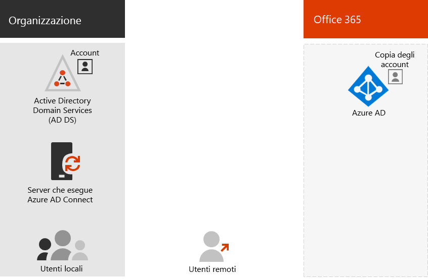

# Modelli di gestione delle identità di Office 365 e Azure Active Directory

*Questo articolo si applica sia a Office 365 Enterprise che a Microsoft 365 Enterprise.*

Per gestire le identità e l'autenticazione, Office 365 usa Azure Active Directory (Azure AD), un servizio di autenticazione e gestione delle identità utente basato sul cloud incluso nell'abbonamento a Office 365. La configurazione corretta dell'infrastruttura di gestione delle identità è di fondamentale importanza per gestire l'accesso utente e le autorizzazioni di Office 365 per l'organizzazione.

Prima di iniziare, guardare questo video che illustra i modelli di gestione delle identità e l'autenticazione sia per Office 365 che per Microsoft 365.

> [!VIDEO https://www.microsoft.com/videoplayer/embed/RE2Pjwu]

La prima opzione di pianificazione è il modello di gestione delle identità di Office 365.

## Modelli di gestione delle identità di Office 365

Per pianificare gli account utente, è necessario prima di tutto conoscere i due modelli di gestione delle identità disponibili in Microsoft 365. È possibile mantenere le identità dell'organizzazione solo nel cloud. In alternativa, è possibile mantenere le identità Active Directory Domain Services (AD DS) in locale e usarle per l'autenticazione quando gli utenti accedono ai servizi cloud di Microsoft 365.  

Ecco i due tipi di identità con la descrizione dei vantaggi e dell'ambiente in cui sono più indicati.

|||
|:-------|:-----|:-----|
|  | **Identità solo cloud** | **Identità ibrida** |
| **Definizione** | L'account utente esiste solo nel tenant di Azure Active Directory (Azure AD) per l'abbonamento a Microsoft 365. | L'account utente esiste in AD DS, ma una copia si trova anche nel tenant di Azure AD per l'abbonamento a Microsoft 365. L'account utente in Azure AD può includere anche una versione con hash della password dell'account utente. |
| **Autenticazione delle credenziali utente in Microsoft 365** | Per eseguire l'autenticazione, il tenant di Azure AD per l'abbonamento a Microsoft 365 usa l'account dell'identità cloud. | Il tenant di Azure AD per l'abbonamento a Microsoft 365 gestisce il processo di autenticazione oppure reindirizza l'utente a un altro provider di identità. |
| **Indicato per** | Organizzazioni che non hanno o necessitano di un'istanza locale di AD DS. | Organizzazioni che usano AD DS o un altro provider di identità. |
| **Principale vantaggio** | Semplice da usare. Non richiede altri strumenti o server di directory. | Gli utenti possono usare le stesse credenziali per accedere a risorse locali o basate sul cloud. |
||||

## Identità solo cloud

Un'identità solo cloud usa solo gli account utente che esistono in Azure AD. Viene in genere usata da organizzazioni di piccole dimensioni che non dispongono di server locali o non usano AD DS per gestire le identità locali. 

Ecco i componenti di base dell'identità solo cloud.
 

Sia gli utenti locali che quelli remoti (online) usano gli account utente e le password di Azure AD per accedere ai servizi cloud di Office 365. Azure AD autentica le credenziali utente in base agli account utente e alle password archiviate.

### Amministrazione
Dal momento che gli account utente vengono solo archiviati in Azure AD, è possibile gestire le identità cloud con strumenti come l'[interfaccia di amministrazione di Microsoft 365](https://admin.microsoft.com) e Windows PowerShell con il modulo PowerShell per Graph di Azure Active Directory. 

## Identità ibrida

L'identità ibrida usa gli account che provengono da un'istanza locale di AD DS e per i quali esiste una copia nel tenant di Azure AD di un abbonamento a Microsoft 365. Tuttavia, la maggior parte delle modifiche è unidirezionale. Le modifiche apportate agli account utente di AD DS vengono sincronizzate con le copie corrispondenti in Azure AD. Le modifiche apportate agli account basati sul cloud in Azure AD, ad esempio i nuovi account utente, non vengono invece sincronizzate con AD DS.

Azure AD Connect offre la sincronizzazione continua degli account. Viene eseguito in un server locale, verifica la presenza di modifiche in AD DS e invia queste modifiche ad Azure AD. Azure AD Connect consente di filtrare gli account sincronizzati e scegliere se eseguire la sincronizzazione di una versione con hash delle password utente, nota come sincronizzazione dell'hash delle password (PHS).

Durante l'implementazione dell'identità ibrida, l'istanza locale di AD DS costituisce l'origine autorevole delle informazioni sull'account. Questo significa che le attività di amministrazione vengono eseguite principalmente in locale e quindi sincronizzate con Azure AD. 

Ecco i componenti dell'identità ibrida.

Il tenant di Azure AD contiene una copia degli account di AD DS. In questa configurazione sia gli utenti locali che gli utenti remoti che accedono ai servizi cloud di Microsoft 365 eseguono l'autenticazione in Azure AD.

>[!Note]
>È sempre necessario usare Azure AD Connect per sincronizzare gli account utenti per l'identità ibrida. Gli account utente sincronizzati in Azure AD sono necessari per l'assegnazione di licenze e la gestione dei gruppi, nonché per configurare le autorizzazioni e per altre attività amministrative che interessano gli account utente.
>

### Amministrazione

Dal momento che gli account utente originali e autorevoli sono archiviati nell'istanza locale di AD DS, è possibile gestire le identità con gli stessi strumenti di AD DS, ad esempio lo strumento Utenti e computer di Active Directory. 

Non viene invece usata l'interfaccia di amministrazione di Microsoft 365 o Windows PowerShell per gestire gli account utente sincronizzati in Azure AD.

## Passaggio successivo

Se è necessario il modello di gestione delle identità solo cloud, vedere [Identità solo cloud](cloud-only-identities.md).

Se è necessario il modello di gestione delle identità ibrido, vedere [Sincronizzazione della directory](plan-for-directory-synchronization.md).
  

## Video di formazione

Vedere il video corso sulla [gestione delle identità con Azure AD Connect in Office 365](https://support.office.com/article/90991a1d-c0ab-479a-b413-35c9706f6fed.aspx) offerto da LinkedIn Learning.

## Vedere anche

[Panoramica di Microsoft 365 Enterprise](https://docs.microsoft.com/microsoft-365/enterprise/microsoft-365-overview)
