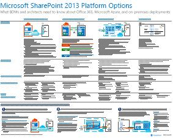
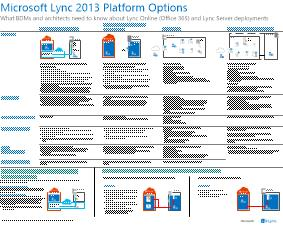

# Modelli architetturali per SharePoint, Exchange, Skype for Business e Lync

 **Riepilogo:** È possibile ottenere il poster IT vengono descritti i modelli dell'architettura, distribuzione e le opzioni della piattaforma per SharePoint, Exchange, Skype per le aziende e Lync.
  
In questi poster IT vengono descritti i modelli architetturali e le opzioni di distribuzione per SharePoint, Exchange, Skype for Business e Lync; sono inoltre disponibili informazioni relative alla progettazione per distribuire SharePoint in Microsoft Azure.
  
Con Office 365, è possibile fornire i servizi di comunicazione e collaborazione che gli utenti conoscono come un servizio basato su cloud. Con alcune eccezioni, l'esperienza utente rimane invariata se si desidera mantenere una distribuzione locale o con Office 365. Questa esperienza utente unificata semplifica inferiore decidere dove posizionare ciascun carico di lavoro e genera domande come:
  
- Come si determina l'opzione di piattaforma da scegliere per i carichi di lavoro individuali?
    
- Ha senso mantenere i servizi in locale?
    
- Quale può essere uno scenario in cui è adatta una distribuzione ibrida?
    
- Microsoft Azure collocazione dell'immagine?
    
- Quali sono le configurazioni supportate per i carichi di lavoro di Office Server in Azure?
    
> [!TIP]
> La maggior parte dei poster in questa pagina è disponibile in più lingue, tra cui cinese, inglese, francese, tedesco, italiano, giapponese, coreano, portoghese, russo e spagnolo. Per scaricare un poster in una di queste lingue, scegliere il collegamento **Altre lingue**.
  
Inviare commenti e suggerimenti all'indirizzo [cloudadopt@microsoft.com](mailto:cloudadopt@microsoft.com). 
  
In questa pagina sono disponibili collegamenti ai poster seguenti:
  
- **Poster di modelli di architettura** È possibile utilizzare le risorse per determinare la piattaforma ideale e configurazione di SharePoint 2016 e Skype per Business 2015.
    
  - [Modelli dell'architettura di Microsoft SharePoint 2016](architectural-models-for-sharepoint-exchange-skype-for-business-and-lync.md#SP2016_ArchModel)
    
  - [Anteprima multi-Geo per OneDrive in Office 365](architectural-models-for-sharepoint-exchange-skype-for-business-and-lync.md#MultiGeoO365ODB)
    
  - [Database di SharePoint Server 2016](architectural-models-for-sharepoint-exchange-skype-for-business-and-lync.md#SP2016_Databases)
    
  - [Microsoft Skype per i modelli dell'architettura di Business 2015](architectural-models-for-sharepoint-exchange-skype-for-business-and-lync.md#SfB2015_ArchModel)
    
- **Poster di opzioni della piattaforma** È possibile utilizzare le risorse per determinare la piattaforma ideale e configurazione per SharePoint 2013, Exchange 2013 e Lync 2013.
    
  - [Opzioni della piattaforma SharePoint 2013](architectural-models-for-sharepoint-exchange-skype-for-business-and-lync.md#SP2013_Options)
    
  - [Opzioni della piattaforma Exchange 2013](architectural-models-for-sharepoint-exchange-skype-for-business-and-lync.md#Exch2013_options)
    
  - [Opzioni della piattaforma Lync 2013](architectural-models-for-sharepoint-exchange-skype-for-business-and-lync.md#Lync2013_Options)
    
- **SharePoint Server 2013 in poster soluzioni Azure** È possibile utilizzare questi poster IT per determinare la progettazione e configurazione di carichi di lavoro di SharePoint Server 2013 in servizi di infrastruttura.
    
  - [Siti Internet in Microsoft Azure using SharePoint Server 2013](architectural-models-for-sharepoint-exchange-skype-for-business-and-lync.md#Azure_sharepoint2013)
    
  - [Esempio di progettazione: siti Internet in Microsoft Azure per SharePoint 2013](architectural-models-for-sharepoint-exchange-skype-for-business-and-lync.md#DesignSampleInternetSites)
    
  - [Ripristino di emergenza di SharePoint in Microsoft Azure](architectural-models-for-sharepoint-exchange-skype-for-business-and-lync.md#sharepoint_recovery_Azure)
    
## Poster dei modelli architetturali

Questi nuovi poster IT per SharePoint 2016 e Skype for Business 2015 forniscono uno strumento per confrontare i vari metodi di distribuzione in un formato facile da stampare. In ogni poster è riportato un elenco di tutte le opzioni di piattaforme o configurazioni disponibili, oltre alle informazioni seguenti per ciascuna opzione:
  
- **Panoramica** Un breve riepilogo della piattaforma, incluso un diagramma concettuale.
    
- **La soluzione migliore per** Scenari comuni che sono adatte per la piattaforma specifica.
    
- **Requisiti relativi alle licenze** Licenze che necessarie per la distribuzione.
    
- **Attività di architettura** Le decisioni che necessarie per i progettisti.
    
- **Attività per professionisti IT o responsabilità** Giornaliera responsabilità che è necessario pianificare di personale IT.
    
### Modelli architetturali di Microsoft SharePoint 2016

|**Elemento**|**Descrizione**|
|:-----|:-----|
|[          ](https://www.microsoft.com/download/details.aspx?id=52650)   [PDF](https://download.microsoft.com/download/4/F/A/4FA0F94B-EE2F-41DB-A047-D9864FEF41E9/SharePoint2016ArchitecturalModels.pdf)  \| [Visio](https://download.microsoft.com/download/4/F/A/4FA0F94B-EE2F-41DB-A047-D9864FEF41E9/SharePoint2016ArchitecturalModels.vsdx)  \| [Altre lingue](https://www.microsoft.com/download/details.aspx?id=52650)   | In questo poster IT vengono descritte le configurazioni locali di SharePoint Online, Microsoft Azure e SharePoint che i decision maker aziendali e gli architetti di soluzioni devono conoscere.    - **SharePoint Online (SaaS)** - utilizzo di SharePoint mediante un Software come un modello di sottoscrizione del servizio (SaaS).   - **Ambiente ibrido di SharePoint** - spostare i siti di SharePoint e App nel cloud le proprie esigenze.   - **SharePoint in Azure (IaaS)** - estendere l'ambiente locale in Microsoft Azure e distribuire SharePoint 2016 server disponibili. (Ciò è consigliata per gli ambienti di sviluppo e di testing e ad alta disponibilità/ripristino di emergenza.)  - **SharePoint locale** - pianificare, distribuire, gestire e personalizzare l'ambiente di SharePoint in un Data Center che si desidera gestire.   |
   
### Anteprima multi-Geo per OneDrive in Office 365

|**Elemento**|**Descrizione**|
|:-----|:-----|
|[          ](http://download.microsoft.com/download/0/5/9/0594634F-7893-4201-938A-C2FF2F21B655/Multi-Geo-ODB.pdf)   [PDF](http://download.microsoft.com/download/0/5/9/0594634F-7893-4201-938A-C2FF2F21B655/Multi-Geo-ODB.pdf)  \| [Visio](http://download.microsoft.com/download/0/5/9/0594634F-7893-4201-938A-C2FF2F21B655/Multi-Geo-ODB.vsdx)   | In questo modello è una panoramica su una pagina di livello geografico Multi OneDrive in Office 365, è in fase di anteprima privata. In questo modello include:   -Vantaggi   -Procedure per la distribuzione   -Un esempio di configurazione     Per ulteriori informazioni sulla Multi-Geo anteprima per OneDrive in Office 365, fare clic [qui](https://aka.ms/onedrivemultigeo).    |
   
### Database di SharePoint Server 2016

|**Elemento**|**Descrizione**|
|:-----|:-----|
|[          ](https://www.microsoft.com/download/details.aspx?id=55041)   [PDF](https://download.microsoft.com/download/D/5/D/D5DC1121-8BC5-4953-834F-1B5BB03EB691/DBrefguideSPS2016_tabloid.pdf)  \| [Visio](https://download.microsoft.com/download/D/5/D/D5DC1121-8BC5-4953-834F-1B5BB03EB691/DBrefguideSPS2016_tabloid.vsdx)  \| [Altre lingue](https://www.microsoft.com/download/details.aspx?id=55041)   | Questo poster IT è una guida di riferimento rapido per i database di SharePoint Server 2016. Ogni database fornisce quanto segue:   -Size   -Indicazioni scala   -Modelli dei / o   -Requisiti     Nella prima pagina contiene i database di sistema di SharePoint e le applicazioni di servizio con più database. La seconda pagina Visualizza tutte le applicazioni di servizio con singoli database.    Per ulteriori informazioni sui database di SharePoint Server 2016, vedere [Database types and descriptions in SharePoint Server 2016](https://technet.microsoft.com/en-us/library/cc678868%28v=office.16%29.aspx)   |
   
### Modelli architetturali di Microsoft Skype for Business 2015

|**Elemento**|**Descrizione**|
|:-----|:-----|
|[          ](https://www.microsoft.com/download/details.aspx?id=55022)   [PDF](https://download.microsoft.com/download/7/7/4/7741262C-A60D-41F7-863B-99BF5964FBFE/Skype%20for%20Business%20Architectural%20Models.pdf)  \| [Visio](https://download.microsoft.com/download/7/7/4/7741262C-A60D-41F7-863B-99BF5964FBFE/Skype%20for%20Business%20Architectural%20Models.vsd)  \| [Altre lingue](https://www.microsoft.com/download/details.aspx?id=55022)   |Questo poster viene descritto il Skype online aziendali, in locale, ibrida, cloud PBX e l'integrazione con le configurazioni di Exchange e SharePoint che dirigenti aziendali e architetti delle soluzioni devono essere a conoscenza.    È destinato il gruppo di destinatari per professionisti IT aumentare la conoscenza dei diversi modelli dell'architettura fondamentali tramite cui possono essere utilizzati Skype Business online e Skype for Business in locale.   Iniziare con qualsiasi configurazione ottimale adatta alle esigenze della propria organizzazione e piani futuri. È consigliabile e utilizzare altri utenti in base alle esigenze. È possibile ad esempio, prendere in considerazione l'integrazione con Exchange e SharePoint o una soluzione che sfrutta l'offerta di Microsoft Cloud PBX.    |
   
## Poster delle opzioni della piattaforma

In questi poster IT per SharePoint 2013, Exchange 2013 e Lync 2013 è disponibile uno strumento per confrontare i vari metodi di distribuzione velocemente in un poster di grandi dimensioni. In ogni poster è riportato un elenco di tutte le opzioni di piattaforme o configurazioni disponibili, oltre alle informazioni seguenti per ciascuna opzione:
  
- **Panoramica** Un breve riepilogo della piattaforma, incluso un diagramma concettuale.
    
- **La soluzione migliore per** Scenari comuni che sono adatte per la piattaforma specifica.
    
- **Requisiti relativi alle licenze** Licenze che necessarie per la distribuzione.
    
- **Attività di architettura** Le decisioni che necessarie per i progettisti.
    
- **Attività per professionisti IT o responsabilità** Giornaliera responsabilità che è necessario pianificare di personale IT.
    
## Opzioni della piattaforma SharePoint 2013

****

|**Elemento**|**Descrizione**|
|:-----|:-----|
|[          ](https://www.microsoft.com/download/details.aspx?id=40332)   [PDF](http://go.microsoft.com/fwlink/p/?LinkId=324594)  \| [Visio](https://go.microsoft.com/fwlink/p/?LinkId=324593)  \| [Altre lingue](https://www.microsoft.com/download/details.aspx?id=40332)   |Per i decisori aziendali (hanno) e gli architetti, questo modello vengono illustrate le opzioni della piattaforma per SharePoint 2013, SharePoint in Office 365, ibridi in locale con Office 365 e Azure distribuzioni solo locali. È inclusa una panoramica di ogni architettura, suggerimenti, i requisiti di licenza e gli elenchi di attività per professionisti IT per ogni piattaforma e architetto. Vengono evidenziate diverse soluzioni di SharePoint in Azure.  Per ottenere una versione di questo poster testo accessibile, vedere [il diagramma accessibile - opzioni della piattaforma Microsoft SharePoint 2013](accessible-diagrammicrosoft-sharepoint-2013-platform-options.md).    |
   
## Opzioni della piattaforma Exchange 2013

****

|**Elemento**|**Descrizione**|
|:-----|:-----|
|[          ](https://www.microsoft.com/download/details.aspx?id=42676)   [PDF](https://go.microsoft.com/fwlink/p/?LinkID=398740)  \| [Visio](https://go.microsoft.com/fwlink/p/?LinkID=398742)  \| [Altre lingue](https://www.microsoft.com/download/details.aspx?id=42676)   |Dell'architettura e progettazione, in questo modello vengono descritte le opzioni della piattaforma disponibili per Exchange 2013. Clienti possono scegliere tra Exchange Online con Office 365, distribuzione ibrida di Exchange, Exchange Server locali e Exchange ospitato. Il poster con i dettagli di ciascuna opzione dell'architettura, inclusi gli scenari più ideali per ognuno, i requisiti relativi alle licenze e le responsabilità per professionisti IT.  Per ottenere una versione di questo poster testo accessibile, vedere [il diagramma accessibile - opzioni della piattaforma di Microsoft Exchange 2013](accessible-diagrammicrosoft-exchange-2013-platform-options.md).    |
   
## Opzioni della piattaforma Lync 2013

****

|**Elemento**|**Descrizione**|
|:-----|:-----|
|[          ](https://www.microsoft.com/download/details.aspx?id=41677)   [PDF](https://go.microsoft.com/fwlink/p/?LinkID=391837)  \| [Visio](https://go.microsoft.com/fwlink/p/?LinkID=391839)  \| [Altre lingue](https://www.microsoft.com/download/details.aspx?id=41677)   |Destinato a BDM e architetti, questo modello descrive le opzioni della piattaforma disponibili per Lync 2013. I clienti possono scegliere da Lync Online con Office 365, una distribuzione ibrida di Lync, Lync Server in locale e Hosted Lync. Il poster IT include le informazioni su ogni opzione architetturale, compresi gli scenari ideali per ciascuna di esse, i requisiti di licenze e le responsabilità dei professionisti IT.      |
   
## Poster di SharePoint nelle soluzioni di Azure

Questi poster IT mostrano soluzioni basate su Azure con SharePoint Server 2013 in formato poster di grandi dimensioni.
  
### Siti Internet in Microsoft Azure che utilizzano SharePoint Server 2013

****

|**Elemento**|**Descrizione**|
|:-----|:-----|
|[          ](https://www.microsoft.com/download/details.aspx?id=41992)   [PDF](https://go.microsoft.com/fwlink/p/?LinkId=392552)  \| [Visio](https://go.microsoft.com/fwlink/p/?LinkId=392551)  \| [Altre lingue](https://www.microsoft.com/download/details.aspx?id=41992)   |Questo poster vengono illustrate le attività di progettazione chiave e le scelte di architettura per siti Internet in Azure è consigliata. Per ottenere una versione di questo poster testo accessibile, vedere [il diagramma accessibile - siti Internet in Microsoft Azure per SharePoint 2013](accessible-diagraminternet-sites-in-microsoft-azure-for-sharepoint-2013.md).   Per ulteriori informazioni, vedere gli articoli seguenti:     - [Siti Internet in Microsoft Azure using SharePoint Server 2013](internet-sites-in-microsoft-azure-using-sharepoint-server-2013.md)   - [Microsoft Azure Architectures for SharePoint 2013](microsoft-azure-architectures-for-sharepoint-2013.md)   |
   
### Esempio di progettazione: siti Internet in Microsoft Azure per SharePoint 2013

****

|**Elemento**|**Descrizione**|
|:-----|:-----|
|[          ](https://www.microsoft.com/download/details.aspx?id=41991)   [PDF](https://go.microsoft.com/fwlink/p/?LinkId=392549)  \| [Visio](https://go.microsoft.com/fwlink/p/?LinkId=392548)  \| [Altre lingue](https://www.microsoft.com/download/details.aspx?id=41991)   |Utilizzare questo esempio di progettazione come punto di partenza per il proprio sito Internet di architettura in Azure con SharePoint Server 2013. Per ottenere una versione di questo poster testo accessibile, vedere [accessibile diagramma - esempio di progettazione: siti Internet in Microsoft Azure per SharePoint 2013](accessible-diagramdesign-sample-internet-sites-in-microsoft-azure-for-sharepoint.md).   Per ulteriori informazioni, vedere gli articoli seguenti:     - [Siti Internet in Microsoft Azure using SharePoint Server 2013](internet-sites-in-microsoft-azure-using-sharepoint-server-2013.md)   - [Microsoft Azure Architectures for SharePoint 2013](microsoft-azure-architectures-for-sharepoint-2013.md)   |
   
### Ripristino di emergenza di SharePoint in Microsoft Azure

****

|**Elemento**|**Descrizione**|
|:-----|:-----|
|[          ](https://www.microsoft.com/download/details.aspx?id=41993)   [PDF](https://go.microsoft.com/fwlink/p/?LinkId=392555)  \| [Visio](https://go.microsoft.com/fwlink/p/?LinkId=392554)  \| [Altre lingue](https://www.microsoft.com/download/details.aspx?id=41993)   |Questo poster IT illustra i principi di architettura per un ambiente di ripristino di emergenza in Azure. Per ottenere una versione di questo poster testo accessibile, vedere [il diagramma accessibile - ripristino di emergenza di SharePoint in Microsoft Azure](accessible-diagramsharepoint-disaster-recovery-to-microsoft-azure.md).   Per ulteriori informazioni, vedere gli articoli seguenti:     - [SharePoint Server 2013 Disaster Recovery in Microsoft Azure](sharepoint-server-2013-disaster-recovery-in-microsoft-azure.md)   - [Microsoft Azure Architectures for SharePoint 2013](microsoft-azure-architectures-for-sharepoint-2013.md)   |
   
## Vedere anche

[Adozione del cloud e soluzioni ibride](cloud-adoption-and-hybrid-solutions.md)
  
[Risorse sull'architettura IT del cloud Microsoft](microsoft-cloud-it-architecture-resources.md)
  
[Test Lab Guide (TLG) di adozione cloud](cloud-adoption-test-lab-guides-tlgs.md)
  
[Soluzioni ibride](hybrid-solutions.md)

