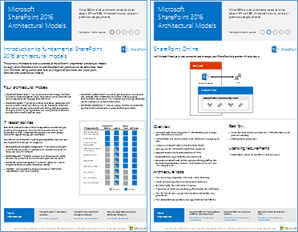
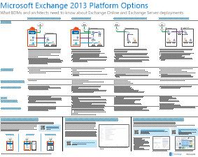

# Modelli architetturali per SharePoint, Exchange, Skype for Business e LyncArchitectural models for SharePoint, Exchange, Skype for Business, and Lync

 **Riepilogo:** È possibile ottenere il poster IT vengono descritti i modelli dell'architettura, distribuzione e le opzioni della piattaforma per SharePoint, Exchange, Skype per le aziende e Lync.**Summary:** Get the IT posters that describe the architectural models, deployment, and platform options for SharePoint, Exchange, Skype for Business, and Lync.
  
In questi poster IT vengono descritti i modelli architetturali e le opzioni di distribuzione per SharePoint, Exchange, Skype for Business e Lync; sono inoltre disponibili informazioni relative alla progettazione per distribuire SharePoint in Microsoft Azure.These IT posters describe the architectural models and deployment options for SharePoint, Exchange, Skype for Business, and Lync, and they provide design information for deploying SharePoint in Microsoft Azure.
  
Con Office 365, è possibile fornire i servizi di comunicazione e collaborazione che gli utenti conoscono come un servizio basato su cloud. Con alcune eccezioni, l'esperienza utente rimane invariata se si desidera mantenere una distribuzione locale o con Office 365. Questa esperienza utente unificata semplifica inferiore decidere dove posizionare ciascun carico di lavoro e genera domande come:With Office 365, you can provide the collaboration and communication services your users are familiar with as a cloud-based service. With a few exceptions, the user experience remains the same whether you are maintaining an on-premises deployment or using Office 365. This unified user experience makes it less straightforward to decide where to place each workload and raises questions such as:
  
- Come si determina l'opzione di piattaforma da scegliere per i carichi di lavoro individuali?How do you determine which platform option to choose for your individual workloads?
    
- Ha senso mantenere i servizi in locale?Does it make sense to keep any service on-premises?
    
- Quale può essere uno scenario in cui è adatta una distribuzione ibrida?What is a scenario where a hybrid deployment is appropriate?
    
- Microsoft Azure collocazione dell'immagine?How does Microsoft Azure fit in the picture?
    
- Quali sono le configurazioni supportate per i carichi di lavoro di Office Server in Azure?What are the supported configurations for Office Server workloads in Azure?
    
> [!TIP]
> La maggior parte dei poster in questa pagina è disponibile in più lingue, tra cui cinese, inglese, francese, tedesco, italiano, giapponese, coreano, portoghese, russo e spagnolo. Per scaricare un poster in una di queste lingue, scegliere il collegamento **Altre lingue**.Most of the posters on this page are available in multiple languages, including Chinese, English, French, German, Italian, Japanese, Korean, Portuguese, Russian, and Spanish. To download a poster in one of these languages, click the **More languages** link for that poster.
  
Inviare commenti e suggerimenti all'indirizzo [cloudadopt@microsoft.com](mailto:cloudadopt@microsoft.com).Let us know what you think! Send us email at [cloudadopt@microsoft.com](mailto:cloudadopt@microsoft.com). 
  
In questa pagina sono disponibili collegamenti ai poster seguenti:This page links you to the following posters:
  
- **Poster di modelli di architettura** È possibile utilizzare le risorse per determinare la piattaforma ideale e configurazione di SharePoint 2016 e Skype per Business 2015.**Architectural models posters** You can use these resources to determine your ideal platform and configuration for SharePoint 2016 and Skype for Business 2015.
    
  - [Modelli architetturali di Microsoft SharePoint 2016Microsoft SharePoint 2016 Architectural Models](architectural-models-for-sharepoint-exchange-skype-for-business-and-lync.md#SP2016_ArchModel)
    
  - [Multi-Geo Capabilities in OneDrive e SharePoint Online in Office 365Multi-Geo Capabilities in OneDrive and SharePoint Online in Office 365](architectural-models-for-sharepoint-exchange-skype-for-business-and-lync.md#MultiGeoO365ODB)
    
  - [Database di SharePoint Server 2016SharePoint Server 2016 Databases](architectural-models-for-sharepoint-exchange-skype-for-business-and-lync.md#SP2016_Databases)
    
  - [Modelli architetturali di Microsoft Skype for Business 2015Microsoft Skype for Business 2015 Architectural Models](architectural-models-for-sharepoint-exchange-skype-for-business-and-lync.md#SfB2015_ArchModel)
    
- **Poster di opzioni della piattaforma** È possibile utilizzare le risorse per determinare la piattaforma ideale e configurazione per SharePoint 2013, Exchange 2013 e Lync 2013.**Platform options posters** You can use these resources to determine your ideal platform and configuration for SharePoint 2013, Exchange 2013, and Lync 2013.
    
  - [Opzioni della piattaforma SharePoint 2013SharePoint 2013 Platform Options](architectural-models-for-sharepoint-exchange-skype-for-business-and-lync.md#SP2013_Options)
    
  - [Opzioni della piattaforma Exchange 2013Exchange 2013 Platform Options](architectural-models-for-sharepoint-exchange-skype-for-business-and-lync.md#Exch2013_options)
    
  - [Opzioni della piattaforma Lync 2013Lync 2013 Platform Options](architectural-models-for-sharepoint-exchange-skype-for-business-and-lync.md#Lync2013_Options)
    
- **SharePoint Server 2013 in poster soluzioni Azure** È possibile utilizzare questi poster IT per determinare la progettazione e configurazione di carichi di lavoro di SharePoint Server 2013 in servizi di infrastruttura.**SharePoint Server 2013 in Azure solutions posters** You can use these IT posters to determine the design and configuration for SharePoint Server 2013 workloads in Azure infrastructure services.
    
  - [Siti Internet in Microsoft Azure using SharePoint Server 2013Internet sites in Microsoft Azure using SharePoint Server 2013](architectural-models-for-sharepoint-exchange-skype-for-business-and-lync.md#Azure_sharepoint2013)
    
  - [Esempio di progettazione: siti Internet in Microsoft Azure per SharePoint 2013Design sample: Internet sites in Microsoft Azure for SharePoint 2013](architectural-models-for-sharepoint-exchange-skype-for-business-and-lync.md#DesignSampleInternetSites)
    
  - [Ripristino di emergenza di SharePoint in Microsoft AzureSharePoint Disaster Recovery to Microsoft Azure](architectural-models-for-sharepoint-exchange-skype-for-business-and-lync.md#sharepoint_recovery_Azure)
    
## Poster dei modelli architetturaliArchitectural models posters

Questi nuovi poster IT per SharePoint 2016 e Skype for Business 2015 forniscono uno strumento per confrontare i vari metodi di distribuzione in un formato facile da stampare. In ogni poster è riportato un elenco di tutte le opzioni di piattaforme o configurazioni disponibili, oltre alle informazioni seguenti per ciascuna opzione:These new IT posters for SharePoint 2016 and Skype for Business 2015 provide a way to compare the various deployment methods in an easy-to-print format. Each poster provides a list of all the configurations or platform options available and gives you the following information for each option:
  
- **Panoramica** Un breve riepilogo della piattaforma, incluso un diagramma concettuale.**Overview** A brief summary of the platform, including a conceptual diagram.
    
- **La soluzione migliore per** Scenari comuni che sono adatte per la piattaforma specifica.**Best for** Common scenarios that are ideally suited for the particular platform.
    
- **Requisiti relativi alle licenze** Licenze che necessarie per la distribuzione.**License requirements** The licenses you need for deployment.
    
- **Attività di architettura** Le decisioni che necessarie per i progettisti.**Architecture tasks** The decisions you need to make as an architect.
    
- **Attività per professionisti IT o responsabilità** Giornaliera responsabilità che è necessario pianificare di personale IT.**IT Pro tasks or responsibilities** The daily responsibilities that your IT staff needs to plan for.
    

### Modelli architetturali di Microsoft SharePoint 2016Microsoft SharePoint 2016 Architectural Models

|**Elemento****Item**|**Descrizione****Description**|
|:-----|:-----|
|[          ](https://www.microsoft.com/download/details.aspx?id=52650)[          ](https://www.microsoft.com/download/details.aspx?id=52650)   [PDF](https://download.microsoft.com/download/4/F/A/4FA0F94B-EE2F-41DB-A047-D9864FEF41E9/SharePoint2016ArchitecturalModels.pdf) \| [Visio](https://download.microsoft.com/download/4/F/A/4FA0F94B-EE2F-41DB-A047-D9864FEF41E9/SharePoint2016ArchitecturalModels.vsdx) \| [più lingue](https://www.microsoft.com/download/details.aspx?id=52650)    [PDF](https://download.microsoft.com/download/4/F/A/4FA0F94B-EE2F-41DB-A047-D9864FEF41E9/SharePoint2016ArchitecturalModels.pdf)  \| [Visio](https://download.microsoft.com/download/4/F/A/4FA0F94B-EE2F-41DB-A047-D9864FEF41E9/SharePoint2016ArchitecturalModels.vsdx)  \| [More languages](https://www.microsoft.com/download/details.aspx?id=52650)   | In questo poster IT vengono descritte le configurazioni locali di SharePoint Online, Microsoft Azure e SharePoint che i decision maker aziendali e gli architetti di soluzioni devono conoscere.This IT poster describes the SharePoint Online, Microsoft Azure, and SharePoint on-premises configurations that business decision makers and solutions architects need to know about.    - **SharePoint Online (SaaS)** - utilizzo di SharePoint mediante un Software come un modello di sottoscrizione del servizio (SaaS).- **SharePoint Online (SaaS)** - Consume SharePoint through a Software as a Service (SaaS) subscription model.   - **Ambiente ibrido di SharePoint** - spostare i siti di SharePoint e App nel cloud le proprie esigenze.- **SharePoint Hybrid** - Move your SharePoint sites and apps to the cloud at your own pace.   - **SharePoint in Azure (IaaS)** - estendere l'ambiente locale in Microsoft Azure e distribuire SharePoint 2016 server disponibili. (Ciò è consigliata per gli ambienti di sviluppo e di testing e ad alta disponibilità/ripristino di emergenza.)- **SharePoint in Azure (IaaS)** - You extend your on-premises environment into Microsoft Azure and deploy SharePoint 2016 Servers there. (This is recommended for High Availability/Disaster Recovery and dev/test environments.)   - **SharePoint locale** - pianificare, distribuire, gestire e personalizzare l'ambiente di SharePoint in un Data Center che si desidera gestire.- **SharePoint On-premises** - You plan, deploy, maintain and customize your SharePoint environment in a datacenter that you maintain.   |
   

### Multi-Geo Capabilities in OneDrive e SharePoint Online in Office 365Multi-Geo Capabilities in OneDrive and SharePoint Online in Office 365

|**Elemento****Item**|**Descrizione****Description**|
|:-----|:-----|
|[          ](https://github.com/MicrosoftDocs/OfficeDocs-Enterprise/raw/live/Enterprise/images/Multi-Geo-ODB.pdf)[          ](https://github.com/MicrosoftDocs/OfficeDocs-Enterprise/raw/live/Enterprise/images/Multi-Geo-ODB.pdf)   [PDF](https://github.com/MicrosoftDocs/OfficeDocs-Enterprise/raw/live/Enterprise/images/Multi-Geo-ODB.pdf) \| [Visio](https://github.com/MicrosoftDocs/OfficeDocs-Enterprise/raw/live/Enterprise/images/Multi-Geo-ODB.vsdx)[PDF](https://github.com/MicrosoftDocs/OfficeDocs-Enterprise/raw/live/Enterprise/images/Multi-Geo-ODB.pdf)  \| [Visio](https://github.com/MicrosoftDocs/OfficeDocs-Enterprise/raw/live/Enterprise/images/Multi-Geo-ODB.vsdx)   | Questo poster viene fornita una panoramica su una pagina di funzionalità Multi-Geo in OneDrive e SharePoint Online in Office 365. In questo modello include:This poster is a one-page overview of Multi-Geo Capabilities in OneDrive and SharePoint Online in Office 365. This model includes:    -Vantaggi- Benefits   -Procedure per la distribuzione- Steps for deployment   -Un esempio di configurazione- An example configuration     Per ulteriori informazioni sulla funzionalità Multi-Geo in OneDrive e SharePoint Online in Office 365, fare clic [qui](https://aka.ms/onedrivemultigeo).For more information about Multi-Geo Capabilities in OneDrive and SharePoint Online in Office 365, click [here](https://aka.ms/onedrivemultigeo).    |
   

### Database di SharePoint Server 2016SharePoint Server 2016 Databases

|**Elemento****Item**|**Descrizione****Description**|
|:-----|:-----|
|[          ](https://www.microsoft.com/download/details.aspx?id=55041)[          ](https://www.microsoft.com/download/details.aspx?id=55041)   [PDF](https://download.microsoft.com/download/D/5/D/D5DC1121-8BC5-4953-834F-1B5BB03EB691/DBrefguideSPS2016_tabloid.pdf) \| [Visio](https://download.microsoft.com/download/D/5/D/D5DC1121-8BC5-4953-834F-1B5BB03EB691/DBrefguideSPS2016_tabloid.vsdx) \| [più lingue](https://www.microsoft.com/download/details.aspx?id=55041)    [PDF](https://download.microsoft.com/download/D/5/D/D5DC1121-8BC5-4953-834F-1B5BB03EB691/DBrefguideSPS2016_tabloid.pdf)  \| [Visio](https://download.microsoft.com/download/D/5/D/D5DC1121-8BC5-4953-834F-1B5BB03EB691/DBrefguideSPS2016_tabloid.vsdx)  \| [More languages](https://www.microsoft.com/download/details.aspx?id=55041)   | Questo poster IT è una guida di riferimento rapido per i database di SharePoint Server 2016. Ogni database fornisce quanto segue:This IT poster is a quick reference guide for SharePoint Server 2016 databases. Each database has the following details:    -Size- Size   -Indicazioni scala- Scaling guidance   -Modelli dei / o- I/O patterns   -Requisiti- Requirements     Nella prima pagina contiene i database di sistema di SharePoint e le applicazioni di servizio con più database. La seconda pagina Visualizza tutte le applicazioni di servizio con singoli database.The first page contains the SharePoint system databases and the service applications that have multiple databases. The second page shows all of the service applications that have single databases.     Per ulteriori informazioni sui database di SharePoint Server 2016, vedere [Database types and descriptions in SharePoint Server 2016](https://technet.microsoft.com/en-us/library/cc678868%28v=office.16%29.aspx)For more information about the SharePoint Server 2016 databases, see [Database types and descriptions in SharePoint Server 2016](https://technet.microsoft.com/en-us/library/cc678868%28v=office.16%29.aspx)   |
   

### Modelli architetturali di Microsoft Skype for Business 2015Microsoft Skype for Business 2015 Architectural Models

|**Elemento****Item**|**Descrizione****Description**|
|:-----|:-----|
|[          ](https://www.microsoft.com/download/details.aspx?id=55022)[          ](https://www.microsoft.com/download/details.aspx?id=55022)   [PDF](https://download.microsoft.com/download/7/7/4/7741262C-A60D-41F7-863B-99BF5964FBFE/Skype%20for%20Business%20Architectural%20Models.pdf) \| [Visio](https://download.microsoft.com/download/7/7/4/7741262C-A60D-41F7-863B-99BF5964FBFE/Skype%20for%20Business%20Architectural%20Models.vsd) \| [più lingue](https://www.microsoft.com/download/details.aspx?id=55022)    [PDF](https://download.microsoft.com/download/7/7/4/7741262C-A60D-41F7-863B-99BF5964FBFE/Skype%20for%20Business%20Architectural%20Models.pdf)  \| [Visio](https://download.microsoft.com/download/7/7/4/7741262C-A60D-41F7-863B-99BF5964FBFE/Skype%20for%20Business%20Architectural%20Models.vsd)  \| [More languages](https://www.microsoft.com/download/details.aspx?id=55022)   |Questo poster viene descritto il Skype online aziendali, in locale, ibrida, cloud PBX e l'integrazione con le configurazioni di Exchange e SharePoint che dirigenti aziendali e architetti delle soluzioni devono essere a conoscenza.This poster describes the Skype for Business Online, on-premises, hybrid, cloud PBX, and integration with Exchange and SharePoint configurations that business decision makers and solutions architects need to know about.    È destinato il gruppo di destinatari per professionisti IT aumentare la conoscenza dei diversi modelli dell'architettura fondamentali tramite cui possono essere utilizzati Skype Business online e Skype for Business in locale.It is intended for the IT Pro audience to raise awareness of the different fundamental architectural models through which Skype for Business Online and Skype for Business on premises can be consumed.   Iniziare con qualsiasi configurazione ottimale adatta alle esigenze della propria organizzazione e piani futuri. È consigliabile e utilizzare altri utenti in base alle esigenze. È possibile ad esempio, prendere in considerazione l'integrazione con Exchange e SharePoint o una soluzione che sfrutta l'offerta di Microsoft Cloud PBX.Start with whichever configuration best suits your organization's needs and future plans. Consider and use others as needed. For example, you might want to consider integration with Exchange and SharePoint or a solution that takes advantage of Microsoft's Cloud PBX offering.    |
   
## Poster delle opzioni della piattaformaPlatform options posters

In questi poster IT per SharePoint 2013, Exchange 2013 e Lync 2013 è disponibile uno strumento per confrontare i vari metodi di distribuzione velocemente in un poster di grandi dimensioni. In ogni poster è riportato un elenco di tutte le opzioni di piattaforme o configurazioni disponibili, oltre alle informazioni seguenti per ciascuna opzione:These IT posters for SharePoint 2013, Exchange 2013, and Lync 2013 provide a way to compare the various deployment methods at a single glance in a large poster format. Each poster provides a list of all the configurations or platform options available and gives you the following information for each option:
  
- **Panoramica** Un breve riepilogo della piattaforma, incluso un diagramma concettuale.**Overview** A brief summary of the platform, including a conceptual diagram.
    
- **La soluzione migliore per** Scenari comuni che sono adatte per la piattaforma specifica.**Best for** Common scenarios that are ideally suited for the particular platform.
    
- **Requisiti relativi alle licenze** Licenze che necessarie per la distribuzione.**License requirements** The licenses you need for deployment.
    
- **Attività di architettura** Le decisioni che necessarie per i progettisti.**Architecture tasks** The decisions you need to make as an architect.
    
- **Attività per professionisti IT o responsabilità** Giornaliera responsabilità che è necessario pianificare di personale IT.**IT Pro tasks or responsibilities** The daily responsibilities that your IT staff needs to plan for.
    

## Opzioni della piattaforma SharePoint 2013SharePoint 2013 Platform Options

****

|**Elemento****Item**|**Descrizione****Description**|
|:-----|:-----|
|[          ](https://www.microsoft.com/download/details.aspx?id=40332)[          ](https://www.microsoft.com/download/details.aspx?id=40332)   [PDF](http://go.microsoft.com/fwlink/p/?LinkId=324594) \| [Visio](https://go.microsoft.com/fwlink/p/?LinkId=324593) \| [più lingue](https://www.microsoft.com/download/details.aspx?id=40332)    [PDF](http://go.microsoft.com/fwlink/p/?LinkId=324594)  \| [Visio](https://go.microsoft.com/fwlink/p/?LinkId=324593)  \| [More languages](https://www.microsoft.com/download/details.aspx?id=40332)   |Per i decisori aziendali (hanno) e gli architetti, questo modello vengono illustrate le opzioni della piattaforma per SharePoint 2013, SharePoint in Office 365, ibridi in locale con Office 365 e Azure distribuzioni solo locali. È inclusa una panoramica di ogni architettura, suggerimenti, i requisiti di licenza e gli elenchi di attività per professionisti IT per ogni piattaforma e architetto. Vengono evidenziate diverse soluzioni di SharePoint in Azure.For business decision makers (BDMs) and architects, this model illustrates the platform options for SharePoint 2013, SharePoint in Office 365, on-premises hybrid with Office 365, Azure, and on-premises only deployments. It includes an overview of each architecture, recommendations, license requirements, and lists of architect and IT Pro tasks for each platform. Several SharePoint solutions on Azure are highlighted.   Per ottenere una versione di questo poster testo accessibile, vedere [il diagramma accessibile - opzioni della piattaforma Microsoft SharePoint 2013](accessible-diagrammicrosoft-sharepoint-2013-platform-options.md).For an accessible text version of this poster, see [Accessible diagram - Microsoft SharePoint 2013 Platform Options](accessible-diagrammicrosoft-sharepoint-2013-platform-options.md).    |
   

## Opzioni della piattaforma Exchange 2013Exchange 2013 Platform Options

****

|**Elemento****Item**|**Descrizione****Description**|
|:-----|:-----|
|[          ](https://www.microsoft.com/download/details.aspx?id=42676)[          ](https://www.microsoft.com/download/details.aspx?id=42676)   [PDF](https://go.microsoft.com/fwlink/p/?LinkID=398740) \| [Visio](https://go.microsoft.com/fwlink/p/?LinkID=398742) \| [più lingue](https://www.microsoft.com/download/details.aspx?id=42676)    [PDF](https://go.microsoft.com/fwlink/p/?LinkID=398740)  \| [Visio](https://go.microsoft.com/fwlink/p/?LinkID=398742)  \| [More languages](https://www.microsoft.com/download/details.aspx?id=42676)   |Dell'architettura e progettazione, in questo modello vengono descritte le opzioni della piattaforma disponibili per Exchange 2013. Clienti possono scegliere tra Exchange Online con Office 365, distribuzione ibrida di Exchange, Exchange Server locali e Exchange ospitato. Il poster con i dettagli di ciascuna opzione dell'architettura, inclusi gli scenari più ideali per ognuno, i requisiti relativi alle licenze e le responsabilità per professionisti IT.For BDMs and architects, this model describes the available platform options for Exchange 2013. Customers can choose from Exchange Online with Office 365, Hybrid Exchange, Exchange Server on-premises and Hosted Exchange. The poster includes details of each architectural option, including the most ideal scenarios for each, the license requirements and IT Pro responsibilities.   Per ottenere una versione di questo poster testo accessibile, vedere [il diagramma accessibile - opzioni della piattaforma di Microsoft Exchange 2013](accessible-diagrammicrosoft-exchange-2013-platform-options.md).For an accessible text version of this poster, see [Accessible diagram - Microsoft Exchange 2013 Platform Options](accessible-diagrammicrosoft-exchange-2013-platform-options.md).    |
   

## Opzioni della piattaforma Lync 2013Lync 2013 Platform Options

****

|**Elemento****Item**|**Descrizione****Description**|
|:-----|:-----|
|[          ](https://www.microsoft.com/download/details.aspx?id=41677)[          ](https://www.microsoft.com/download/details.aspx?id=41677)   [PDF](https://go.microsoft.com/fwlink/p/?LinkID=391837) \| [Visio](https://go.microsoft.com/fwlink/p/?LinkID=391839) \| [più lingue](https://www.microsoft.com/download/details.aspx?id=41677)    [PDF](https://go.microsoft.com/fwlink/p/?LinkID=391837)  \| [Visio](https://go.microsoft.com/fwlink/p/?LinkID=391839)  \| [More languages](https://www.microsoft.com/download/details.aspx?id=41677)   |Destinato a BDM e architetti, questo modello descrive le opzioni della piattaforma disponibili per Lync 2013. I clienti possono scegliere da Lync Online con Office 365, una distribuzione ibrida di Lync, Lync Server in locale e Hosted Lync. Il poster IT include le informazioni su ogni opzione architetturale, compresi gli scenari ideali per ciascuna di esse, i requisiti di licenze e le responsabilità dei professionisti IT.  For BDMs and architects, this model describes the available platform options for Lync 2013. Customers can choose from Lync Online with Office 365, Hybrid Lync, Lync Server on-premises and Hosted Lync. The IT poster includes details of each architectural option, including the most ideal scenarios for each, the license requirements and IT Pro responsibilities.    |
   

## Poster di SharePoint nelle soluzioni di AzureSharePoint in Azure solutions posters

Questi poster IT mostrano soluzioni basate su Azure con SharePoint Server 2013 in formato poster di grandi dimensioni.These IT posters show Azure-based solutions using SharePoint Server 2013 in a large poster format.
  

### Siti Internet in Microsoft Azure che utilizzano SharePoint Server 2013Internet sites in Microsoft Azure using SharePoint Server 2013

****

|**Elemento****Item**|**Descrizione****Description**|
|:-----|:-----|
|[          ](https://www.microsoft.com/download/details.aspx?id=41992)[          ](https://www.microsoft.com/download/details.aspx?id=41992)   [PDF](https://go.microsoft.com/fwlink/p/?LinkId=392552) \| [Visio](https://go.microsoft.com/fwlink/p/?LinkId=392551) \| [più lingue](https://www.microsoft.com/download/details.aspx?id=41992)    [PDF](https://go.microsoft.com/fwlink/p/?LinkId=392552)  \| [Visio](https://go.microsoft.com/fwlink/p/?LinkId=392551)  \| [More languages](https://www.microsoft.com/download/details.aspx?id=41992)   |Questo poster vengono illustrate le attività di progettazione chiave e le scelte di architettura per siti Internet in Azure è consigliata. Per ottenere una versione di questo poster testo accessibile, vedere [il diagramma accessibile - siti Internet in Microsoft Azure per SharePoint 2013](accessible-diagraminternet-sites-in-microsoft-azure-for-sharepoint-2013.md).This poster outlines key design activities and recommended architecture choices for Internet-facing sites in Azure. For an accessible text version of this poster, see [Accessible diagram - Internet sites in Microsoft Azure for SharePoint 2013](accessible-diagraminternet-sites-in-microsoft-azure-for-sharepoint-2013.md).     Per ulteriori informazioni, vedere gli articoli seguenti:For more information, see the following articles:     - [Siti Internet in Microsoft Azure using SharePoint Server 2013](internet-sites-in-microsoft-azure-using-sharepoint-server-2013.md)- [Internet Sites in Microsoft Azure using SharePoint Server 2013](internet-sites-in-microsoft-azure-using-sharepoint-server-2013.md)   - [Microsoft Azure Architectures for SharePoint 2013](microsoft-azure-architectures-for-sharepoint-2013.md)- [Microsoft Azure Architectures for SharePoint 2013](microsoft-azure-architectures-for-sharepoint-2013.md)   |
   

### Esempio di progettazione: siti Internet in Microsoft Azure per SharePoint 2013Design sample: Internet sites in Microsoft Azure for SharePoint 2013

****

|**Elemento****Item**|**Descrizione****Description**|
|:-----|:-----|
|[          ](https://www.microsoft.com/download/details.aspx?id=41991)[          ](https://www.microsoft.com/download/details.aspx?id=41991)   [PDF](https://go.microsoft.com/fwlink/p/?LinkId=392549) \| [Visio](https://go.microsoft.com/fwlink/p/?LinkId=392548) \| [più lingue](https://www.microsoft.com/download/details.aspx?id=41991)    [PDF](https://go.microsoft.com/fwlink/p/?LinkId=392549)  \| [Visio](https://go.microsoft.com/fwlink/p/?LinkId=392548)  \| [More languages](https://www.microsoft.com/download/details.aspx?id=41991)   |Utilizzare questo esempio di progettazione come punto di partenza per il proprio sito Internet di architettura in Azure con SharePoint Server 2013. Per ottenere una versione di questo poster testo accessibile, vedere [accessibile diagramma - esempio di progettazione: siti Internet in Microsoft Azure per SharePoint 2013](accessible-diagramdesign-sample-internet-sites-in-microsoft-azure-for-sharepoint.md).Use this design sample as a starting point for your own architecture Internet-facing site in Azure using SharePoint Server 2013. For an accessible text version of this poster, see [Accessible diagram - Design sample: Internet sites in Microsoft Azure for SharePoint 2013](accessible-diagramdesign-sample-internet-sites-in-microsoft-azure-for-sharepoint.md).     Per ulteriori informazioni, vedere gli articoli seguenti:For more information, see the following articles:     - [Siti Internet in Microsoft Azure using SharePoint Server 2013](internet-sites-in-microsoft-azure-using-sharepoint-server-2013.md)- [Internet Sites in Microsoft Azure using SharePoint Server 2013](internet-sites-in-microsoft-azure-using-sharepoint-server-2013.md)   - [Microsoft Azure Architectures for SharePoint 2013](microsoft-azure-architectures-for-sharepoint-2013.md)- [Microsoft Azure Architectures for SharePoint 2013](microsoft-azure-architectures-for-sharepoint-2013.md)   |
   

### Ripristino di emergenza di SharePoint in Microsoft AzureSharePoint Disaster Recovery to Microsoft Azure

****

|**Elemento****Item**|**Descrizione****Description**|
|:-----|:-----|
|[          ](https://www.microsoft.com/download/details.aspx?id=41993)[          ](https://www.microsoft.com/download/details.aspx?id=41993)   [PDF](https://go.microsoft.com/fwlink/p/?LinkId=392555) \| [Visio](https://go.microsoft.com/fwlink/p/?LinkId=392554) \| [più lingue](https://www.microsoft.com/download/details.aspx?id=41993)    [PDF](https://go.microsoft.com/fwlink/p/?LinkId=392555)  \| [Visio](https://go.microsoft.com/fwlink/p/?LinkId=392554)  \| [More languages](https://www.microsoft.com/download/details.aspx?id=41993)   |Questo poster IT illustra i principi di architettura per un ambiente di ripristino di emergenza in Azure. Per ottenere una versione di questo poster testo accessibile, vedere [il diagramma accessibile - ripristino di emergenza di SharePoint in Microsoft Azure](accessible-diagramsharepoint-disaster-recovery-to-microsoft-azure.md).This IT poster illustrates architecture principles for a disaster recovery environment in Azure. For an accessible text version of this poster, see [Accessible diagram - SharePoint Disaster Recovery to Microsoft Azure](accessible-diagramsharepoint-disaster-recovery-to-microsoft-azure.md).     Per ulteriori informazioni, vedere gli articoli seguenti:For more information, see the following articles:     - [SharePoint Server 2013 Disaster Recovery in Microsoft Azure](sharepoint-server-2013-disaster-recovery-in-microsoft-azure.md)- [SharePoint Server 2013 Disaster Recovery in Microsoft Azure](sharepoint-server-2013-disaster-recovery-in-microsoft-azure.md)   - [Microsoft Azure Architectures for SharePoint 2013](microsoft-azure-architectures-for-sharepoint-2013.md)- [Microsoft Azure Architectures for SharePoint 2013](microsoft-azure-architectures-for-sharepoint-2013.md)   |
   

## Vedere ancheSee Also

[Adozione del cloud e soluzioni ibrideCloud adoption and hybrid solutions](cloud-adoption-and-hybrid-solutions.md)
  
[Risorse sull'architettura IT del cloud MicrosoftMicrosoft Cloud IT architecture resources](microsoft-cloud-it-architecture-resources.md)
  
[Test Lab Guide (TLG) di adozione cloudCloud adoption Test Lab Guides (TLGs)](cloud-adoption-test-lab-guides-tlgs.md)
  
[Soluzioni ibrideHybrid solutions](hybrid-solutions.md)

