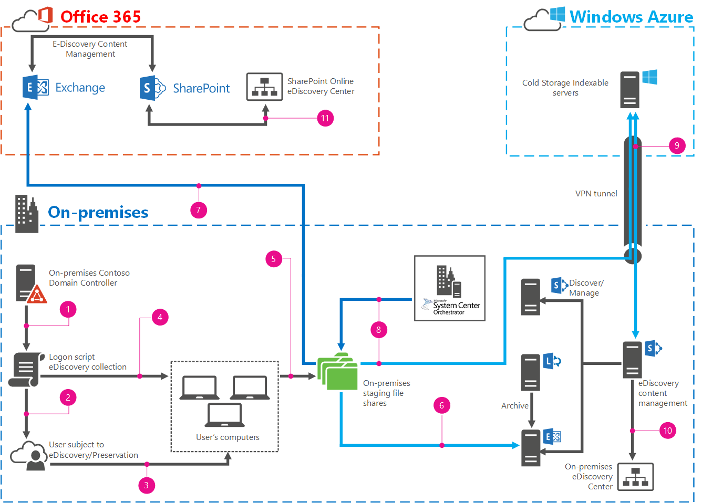

# <a name="automate-file-collection-for-ediscovery"></a>Automatizzare la raccolta di file di eDiscovery

 **Riepilogo:** Informazioni su come automatizzare la raccolta di file dal computer degli utenti di eDiscovery.
  
Tutte le aziende devono affrontare la possibilità di azioni legali o altri tipi di azioni legali. Mentre è possibile utilizzare i reparti legali per riduzione dell'esposizione, conservazione per controversia è un fatto del ciclo di vita di business. Quando una società con un'azione legale, sono necessari passaggi del processo di esibizione, per fornire tutte le prime documentali rilevanti per il corso e del consulente opposto. 
  
eDiscovery è il processo di cui società inventario, di ricerca, identificano, conservare, filtrare e rendere disponibile il materiale documentale esistenti in formato elettronico. SharePoint 2013, Exchange Server 2013, Lync Server 2013, SharePoint Online ed Exchange Online può contenere grandi quantità di contenuto documentale. A seconda della versione, questi prodotti può supportare eDiscovery e dell'archiviazione sul posto (Lync tramite Exchange Server), renderla più semplice per i team legali indicizzare, identificano, premere e filtrare il contenuto per un determinato caso più pertinente.
  
Numero di documenti viene archiviati in degli utenti (depositari) computer locale, non in una posizione centralizzata. In questo modo essenzialmente impedisce per SharePoint 2013 per la ricerca e se non possono essere ricercata, non possono essere incluse nel eDiscovery. Questa soluzione viene illustrato come utilizzare gli script di accesso, System Center agente di orchestrazione 2012 R2 e Windows PowerShell per Exchange Server per automatizzare l'identificazione e l'insieme di materiale documentali dai computer degli utenti.
  
## <a name="what-this-solution-does"></a>Questa soluzione non

Questa soluzione utilizza un gruppo, gruppo di protezione globale criteri e uno script di Windows PowerShell per individuare, preparare un inventario e raccogliere contenuto e i file di archivio personale (PST) di Outlook dal computer locale di utenti in una condivisione file nascosti. Da quest'ultimo, è possibile importare i file PST in Exchange Server 2013 o Exchange Online. Tutti i file vengono spostati utilizzando un runbook di System Center agente di orchestrazione 2012 R2 in un altro condivisione di file in Microsoft Azure per indicizzazione da SharePoint 2013 e l'archiviazione a lungo termine. Utilizzare quindi centri eDiscovery della distribuzione di SharePoint 2013 in locale o in SharePoint Online come regolarmente per eseguire eDiscovery. 
  
> [!IMPORTANT]
> Questa soluzione utilizza robocopy per copiare i file dai computer del depositaria in una condivisione file centralizzata. Poiché robocopy non vengono copiati file aperto o bloccato, i file, inclusi i file PST, che il depositaria sia aperto non saranno raccolti. È necessario raccolgono i dati manualmente. Questa soluzione fornire un elenco che identifica in modo esplicito i file che non può copiare e il percorso completo di tutti i file. 
  
Nel diagramma seguente illustra tutti i passaggi e gli elementi della soluzione.
  

  
|Legenda * * *||
|:-----|:-----|
||Creare un oggetto Criteri di gruppo (GPO) e associarlo allo script di accesso della raccolta.  <br/> |
|| Configurare il filtro di protezione oggetto Criteri di gruppo per l'oggetto Criteri di gruppo si applicano solo al gruppo depositari. <br/> |
||Un depositaria accede e viene eseguito l'oggetto Criteri di gruppo, lo script di accesso raccolta la chiamata.  <br/> |
||Lo script di accesso raccolta inventario di tutte le unità collegate localmente nel computer depositari, cercare i file desiderato e relativo percorso di registrazione.  <br/> |
||Lo script di accesso raccolta copia i file di inventario in una condivisione file nascosto nel server di gestione temporanea.  <br/> |
|| (Opzione A) Eseguire manualmente lo script di importazione file PST per importare i file PST raccolti in Exchange Server 2013. <br/> |
||(Opzione B) Utilizzando lo strumento Office 365 importare e processo, importare i file PST raccolti in Exchange Online.  <br/> |
||Spostare tutte le raccolti file a una condivisione file Azure per l'archiviazione a lungo termine con runbook MoveToColdStorage System Center agente di orchestrazione 2012 R2. <br/> |
||Indicizzare i file nella condivisione di file di archiviazione fredda con SharePoint 2013.  <br/> |
||Eseguire eDiscovery sul contenuto in archiviazione fredda e in locale Exchange Server 2013.  <br/> |
||Eseguire eDiscovery sul contenuto in Office 365.  <br/> |
   
## <a name="prerequisites"></a>Prerequisiti

La configurazione di questa soluzione richiede più molti elementi di cui probabile che in vigore e configurato se si sta valutando eDiscovery. Per gli elementi che non si dispone o caratteri che richiedono una configurazione specifica, si verrà fornire i collegamenti è necessario creare fuori la configurazione di base. Prima di configurare la soluzione stessa, è necessario disporre la configurazione di base sul posto.
  
### <a name="base-configuration"></a>Configurazione di base

|**Elemento**|**Collegamento**|
|:-----|:-----|
|Dominio di Active Directory Domain Services (AD DS)  <br/> ||
|Connettività Internet dalla rete locale  <br/> ||
|SQL Server 2012 per il supporto di SharePoint 2013 e System Center agente di orchestrazione 2012 R2  <br/> |[Distribuzione di agente di orchestrazione - System Center 2012](https://go.microsoft.com/fwlink/p/?LinkId=613503) <br/> |
| Locali o Azure basato su SharePoint 2013 per eDiscovery (necessario per l'opzione A) <br/> ||
|Server di condivisione di file locale per la gestione temporanea  <br/> ||
|Exchange Server 2013 in locale per l'importazione dei file PST A opzione  <br/> |CU5 (15.913.22) è disponibile all'indirizzo [CU5](https://go.microsoft.com/fwlink/p/?LinkId=613426).  <br/> |
|System Center Orchestrator 2012 R2  <br/> |[Distribuzione di agente di orchestrazione - System Center 2012](https://go.microsoft.com/fwlink/p/?LinkId=613503) <br/> |
|Office 365 (piano E3) con Exchange Online e SharePoint Online (necessario per l'opzione B)  <br/> |Per l'iscrizione per una sottoscrizione a Office 365 E3, vedere [sottoscrizione a Office 365 E3](https://go.microsoft.com/fwlink/p/?LinkId=613504).  <br/> |
|Sottoscrizione Azure con una macchina virtuale  <br/> |Per l'iscrizione per un Azure, vedere [Subscribe to Windows Azure](https://go.microsoft.com/fwlink/p/?LinkId=512010) <br/> |
|Una connessione VPN tra la rete locale e la sottoscrizione di Azure  <br/> |Per configurare un tunnel VPN tra la sottoscrizione Azure e la rete locale, vedere [Connect una rete locale a una rete virtuale Microsoft Azure](https://go.microsoft.com/fwlink/p/?LinkId=613507).  <br/> |
|Configurata la ricerca tra SharePoint e quindi fare clic su Exchange Server 2013 e facoltativamente Lync Server 2013 eDiscovery di SharePoint 2013  <br/> |Per configurare eDiscovery in questo modo, vedere [Configure eDiscovery in SharePoint Server 2013](https://go.microsoft.com/fwlink/p/?LinkId=613508) e[Guida del laboratorio di testing: configurare eDiscovery per un Exchange, Lync, SharePoint e laboratorio di testing di condivisioni di File Windows](https://go.microsoft.com/fwlink/p/?LinkId=393130).  <br/> |
|eDiscovery in Office 365 per Exchange Online e SharePoint Online  <br/> |Per configurare eDiscovery in Office 365, vedere [configurare un centro eDiscovery in SharePoint Online](https://go.microsoft.com/fwlink/p/?LinkId=613628).  <br/> |
   
## <a name="configure-the-environment"></a>Configurare l'ambiente

Dopo aver creato la configurazione di base sul posto, possono passare direttamente alla configurazione della soluzione stesso. 
  
### <a name="staging-file-share"></a>Condivisione di file di gestione temporanea

1. Creare un gruppo di protezione globale denominato depositari nel dominio locale.
    
2. Creare una condivisione file nascosto per i file che vengono raccolti dal computer depositari. Tale indirizzo deve corrispondere in un server locale. Ad esempio, in un server denominato gestione temporanea, creare una condivisione file denominata $ casi. Il **$** è necessario impostare tale una condivisione nascosta.
    
3. Impostare le autorizzazioni di condivisione seguenti:
    
  - Depositari: Modifica, lettura
    
  - Amministratori: controllo completo
    
  - Sottosistema Trusted di Exchange: Modifica, lettura
    
4. Aprire la scheda **protezione** , aggiungere il gruppo depositari e fare clic su **Avanzate**. Impostare le autorizzazioni per il gruppo depositari seguenti:
    
  - **Tipo: Nega**
    
  - **Si applica a: questa cartella, sottocartelle e file**
    
5. Fare clic su **Autorizzazioni avanzate** e selezionare le opzioni seguenti:
    
  - **Leggere gli attributi**
    
  - **Leggi attributi estesi**
    
  - **Autorizzazioni di lettura**
    
6. Verificare l'accesso alla condivisione di file $ casi eseguendo le operazioni seguenti:
    
1. Aggiungere un utente al gruppo depositari.
    
2. Inserire un file nella cartella dei casi.
    
3. Quello dell'utente, passare al server di gestione temporanea, ad esempio passare il \\ \\Condividi per vedere le condivisioni disponibili di gestione temporanea. Si non deve vedere condivisione di **$ casi** elencata.
    
4. Digitare il percorso completo per la condivisione di $ casi manualmente in Esplora. Verrà aperto la condivisione di $ casi.
    
5. Provare ad aprire i file che precedentemente inseriti nella condivisione. Si verificherà un errore.
    
### <a name="logon-script"></a>Script di accesso

1. Copiare e incollare questo script di Windows PowerShell nel blocco note:
    
  ```
  # Automated file collection script
# Substantial error processing should be added for robust execution and troubleshooting opportunities
# All commented out write-hosts are for debugging only and are commented out for regular execution

# Functions 

Function CreateCaseFolder() {

#Check to see if case folder already exists
$CaseFolderCheck = Test-Path $CaseLocation

try {

    if (!$CaseFolderCheck) {
    # Case folder doesn't exist.  Create the case folder and the log file location
    # Write-Host -ForegroundColor Cyan "Creating Case Folder $CaseLocation"
    New-Item "$CaseLocation" -ItemType Directory -Force -ErrorAction SilentlyContinue
    # Write-Host -ForegroundColor Cyan "Creating Case Log Folder $CaseLogLocation"
    New-Item "$CaseLogLocation" -ItemType Directory -Force -ErrorAction SilentlyContinue
    # Write-Host -ForegroundColor Cyan "Creating Case PST folder $CasePSTLocation"
    New-Item "$CasePSTLocation" -ItemType Directory -Force -ErrorAction SilentlyContinue

    }
    else {

    # do nothing since the target case folder already exists

    }
}
catch [System.Exception] {

    # To do..
    # to log to an exception or log file
    
    }
}

Function CopyFileToCaseFolder($SourcePath, $TargetPath, $FileName) {
    
    # Check to see if the file already exists
    $TargetFileCheck = Test-Path $TargetPath\\$FileName

try {

    if (!$TargetFileCheck) {
    # Copy the file to the case folder
    Write-Host $SourcePath $TargetPath $FileName
    robocopy "$SourcePath" "$TargetPath" "$FileName" /COPY:DATSO /TEE /LOG+:$LoggingFile /R:10 /W:10 | Out-Null

    }
    else {

    # do nothing since file is already in the target case folder

    }
}
catch [System.Exception] {

    # To do..
    # to log to an exception or log file
    
    }
}

# Global variable initializations

# Error log
$Loggederrors=@()

# The array to contain the file types we collect
$FileTypes = @("*.doc","*.docx","*.pst","*.txt")

# We'll set the case number to be a combination of the date and user name
# For example, a case for John Doe on Dec 14, 2014 at 2:38pm would be:
# 201412141438_jdoe
$CaseNo = get-date -Format yyyyMMddHHmm
$CaseNo = $CaseNo + "_" + [Environment]::UserName

# Target location to copy case files
$CaseRootLocation = "\\\\staging\\Cases$" 

# File copy location, log file location, PST file location and temporary log file location
$CaseLocation = $CaseRootLocation + "\\" + $CaseNo
$CaseLogLocation = $CaseRootLocation + "\\" + $CaseNo + "\\_Log"
$CasePSTLocation = $CaseRootLocation + "\\" + $CaseNo + "\\_PSTs"
$TemporaryLogLocation = [Environment]::getfolderpath('ApplicationData') + "\\" + $CaseNo

# Inventory of local drives
$LocalDrives = Get-PSDrive -PSProvider FileSystem -Scope Global

$LoggingFile = "$CaseLogLocation\\FileCopyErrors.log"

# Main script

# Create the case folder if it doesn't already exist
CreateCaseFolder

# Create the list of files to be copied
# First create the temporary directory in the AppData\\Roaming folder
New-Item "$TemporaryLogLocation" -ItemType Directory -Force -ErrorAction SilentlyContinue
$LocalDrives | foreach {

    # Write-Host -ForeGroundColor Cyan "Collecting Files for Drive: " $_
    Get-ChildItem -Path $_.Root -Recurse -Include $FileTypes -ErrorAction SilentlyContinue -ErrorVariable +Loggederrors | Export-Clixml $TemporaryLogLocation\\\\$_.xml -Force
    # Needs try catch and logged collection error file
}

# Now let's read each file and copy any files we need to the case folder
# We will also copy these XMLs to the case log files folder as we go along
# We only want to process XML files, just in case something else got in there as the script ran
$CaseDriveFiles = Get-ChildItem $TemporaryLogLocation -Filter '*.xml'
$CaseDriveFiles | foreach {
    # Copy the XML file to the case log location
    CopyFileToCaseFolder $_.Directory.FullName $CaseLogLocation $_.Name
    $DriveFile = $_.FullName
    # Write-Host -ForegroundColor Cyan "Copying Files specified in the XML file: $DriveFile"
    $CurrentDriveFile = Import-Clixml $DriveFile
    $CurrentDriveFile | foreach {
        # write-host $_.FullName
        # if it's a PST, add to the PSTs folder. otherwise add it to case folder
        if ($_.Extension -match '.PST')
        {
            CopyFileToCaseFolder $_.Directory.FullName $CasePSTLocation $_.Name
            write-host "this is a PST"
        }
        else
        {
            CopyFileToCaseFolder $_.Directory.FullName $CaseLocation $_.Name
        }
    }
}

# Now delete the temporary log file
Remove-Item $TemporaryLogLocation -Recurse 

Write-Host -ForegroundColor Cyan "Finished."

  ```

2. Salvare lo script precedente come CollectionScript.ps1 in un percorso facile da trovare, ad esempio, c:\\AFCScripts.
    
3. Utilizzare la funzionalità Vai a nel blocco note. Apportare le modifiche seguenti, in base alle esigenze:
    
|**Riga #**|**Che cosa è necessario modificare**|**Facoltativo/necessari**|
|:-----|:-----|:-----|
|71  <br/> |Variabile **$FileTypes** . Include tutte le estensioni di file che si desidera che lo script per preparare un inventario e raccogliere nella variabile di matrice.<br/> |Facoltativo  <br/> |
|76 e 77  <br/> |Modificare il modo in cui la variabile **$CaseNo** si basa adatto alle proprie esigenze. Lo script acquisisce la data e ora correnti e aggiunge il nome dell'utente.<br/> |Facoltativo  <br/> |
|80  <br/> |Condividono **$CaseRootLocation** esigenze variabili da impostare per i file della raccolta server gestione temporanea, ad esempio ** \\ \\di gestione temporanea\\casi$**. <br/> |Obbligatorio  <br/> |
   
4. Inserire il file CollectionScript.ps1 nella condivisione di file Netlogon nei controller di dominio. 
    
### <a name="configure-gpo-for-the-logon-script-and-custodians-group"></a>Configurare l'oggetto Criteri di gruppo per uno script di accesso e il gruppo depositari

1. Configurare uno script di accesso per il gruppo depositari, consultare la sezione "Come assegnare script di accesso" nell'argomento [tramite avvio, arresto, accesso e script di disconnessione in Criteri di gruppo](https://go.microsoft.com/fwlink/p/?LinkId=614844).
    
2. Rimuovere gli utenti autenticati da **Filtri di protezione**e aggiungere il gruppo depositari.
    
### <a name="pst-import-option-a-script-for-exchange-server-2013"></a>PST importare opzione A, lo script per Exchange Server 2013

1.  Copiare e incollare il seguente script di Windows PowerShell nel blocco note:
    
  ```
  # Script to import all PSTs in a given folder to a target mailbox
#
# This is for on-prem Exchange only
# Input parameters
# When you run the script, you call it with two parameters, PST source path and target mailbox alias
# For example:  .\\PSTImport.ps1 \\\\FileShare\\PSTFiles jdoe

param ([String]$SourcePath,[String]$MailboxAlias)

# Folder identifier is the string we want to show in the mailbox that we import the PSTs to

$FolderIdentifier = "zzImportedPSTs_"

# Connect to Exchange remote powershell using the connection Uri below
# This would be the format http://<exchange server FQDN>/Powershell

$ConnectionUri = 'http://h10-exch/PowerShell'
$RemoteEx2013Session = New-PSSession -ConfigurationName Microsoft.Exchange -ConnectionUri $ConnectionUri -Authentication Kerberos
Import-PSSession $RemoteEx2013Session

# Get all the files in the source path

$AllFiles = Get-ChildItem $SourcePath -Recurse

# Go through each file and if it's a PST launch a mailbox import request for it

$AllFiles | ForEach-Object {
    If ($_.Extension -eq ".pst") {
        $ImportName = $MailboxAlias + "_" + $_.Name
        $FolderName = $FolderIdentifier + $_.Name
        New-MailboxImportRequest -Name $ImportName -Mailbox $MailboxAlias -FilePath $_.FullName -TargetRootFolder $FolderName
    }
}
  ```

2. Salvare lo script come PSTImportScript.ps1 in un percorso facile da trovare. Ad esempio e la facilità di utilizzo, creare una cartella nel server temporaneo denominato \\ \\di gestione temporanea\\AFCScripts e salvarlo disponibili.
    
3. Utilizzare la funzionalità Vai a nel blocco note e apportare le modifiche seguenti, in base alle esigenze:
    
|**Riga #**|**Che cosa è necessario modificare**|**Facoltativo/necessari**|
|:-----|:-----|:-----|
|12  <br/> |**$FolderIdentifier** tag le cartelle delle cassette postali che vengono importati nel file pst. Modificare l'impostazione se necessario.<br/> |Facoltativo  <br/> |
|17  <br/> |**$ConnectionUri** deve essere impostata al proprio server. <br/> > [!IMPORTANT]> Verificare che l' **$ConnectionUri** punta a un percorso http, https non. Non funzionerà con https:.          |Obbligatorio  <br/> |
   
4. Verificare che l'account di Exchange Trusted Subsystem disponga delle autorizzazioni di lettura, scrittura ed esecuzione per il \\ \\Intermédiaire\\condivisione$ casi.
    
5. Lo script di importazione file PST richiede due parametri di input seguenti:
    
  - **$SourcePath** Il percorso dei file PST da importare, ad esempio \\ \\Intermédiaire\\casi$.
    
  - **$MailboxAlias** Alias della cassetta postale di destinazione che verrà visualizzati gli elementi di posta elettronica importati.
    
6. Ad esempio, se si desidera importare tutti i file PST dal percorso \\ \\Intermédiaire\\casi$ in una cassetta postale con eDiscoveryMailbox alias, eseguire lo script simile al seguente `\\\\staging\\AFCscripts\\PSTImportScript.ps1 \\\\Staging\\cases$ eDiscoveryMailbox`.
    
### <a name="pst-import-option-b-for-exchange-online"></a>Opzione di importazione di file PST B, per Exchange Online

-  Creare la struttura delle cassette postali per inserire i file PST importati in. Per ulteriori informazioni su come creare una cassetta postale utente in Exchange Online, vedere[Creazione di cassette postali utente in Exchange Online](https://go.microsoft.com/fwlink/p/?LinkId=615118).
    
### <a name="cold-storage"></a>Archiviazione fredda

1. Creare una condivisione file in Azure Virtual Machine, in cui verranno memorizzati tutti i file raccolti, ad esempio \\ \\AZFile1\\ContentColdStorage.
    
2. Concedere all'account di accesso al contenuto predefinito almeno autorizzazioni di lettura per la condivisione e tutte le sottocartelle e i file. Per ulteriori informazioni sulla configurazione di ricerca di SharePoint 2013, vedere [creare e configurare un'applicazione di servizio di ricerca in SharePoint Server 2013](https://go.microsoft.com/fwlink/p/?LinkId=614940).
    
3. Se si prevede che l'importazione di file PST da \\ \\AZFile1\\ContentColdStorage, concedere Exchange Trusted Subsystem leggere, scrivere ed eseguire delle autorizzazioni per la condivisione.
    
### <a name="orchestrator"></a>Agente di orchestrazione

1. Scaricare[ runbook MoveToColdStorage](https://go.microsoft.com/fwlink/?LinkId=616095) da Microsoft Download Center.
    
2. Aprire la **Finestra di progettazione Runbook**, nel riquadro **connessioni** fare clic su cartella che si desidera importare runbook in. Fare clic su dal menu **Azioni** e quindi su **Importa**. Viene visualizzata la finestra di dialogo **Importa** .
    
3. Nella casella **Percorso** digitare il percorso e il nome di runbook che si desidera importare o fare clic sui puntini di sospensione ( **...**) per individuare il file da importare. 
    
4. Selezionare **manuali operativi di importazione** e **l'agente di orchestrazione Importa i dati crittografati**. Deselezionare **contatori**, **pianificazioni**, **variabili**, **Gruppi di Computer**, **le configurazioni globale di importazione**e **configurazioni globale esistente Sovrascrivi**.
    
5. Fare clic su **Fine**.
    
6. Modificare runbook **MoveFilesToColdStorage** come indicato di seguito:
    
1. **Spostare File** - set di attività il percorso del **File di origine** per la condivisione di file insieme, ad esempio \\ \\Intermédiaire\\casi$. Condividere la **Cartella di destinazione** per il file di archivio fredda in Azure, ad esempio set \\ \\AZFile1\\ContentColdStorage. Selezionare **Crea un file con un nome univoco**.
    
2. Set di attività **Elimina cartella** - il **percorso:** all'insieme condivisione file, ad esempio \\ \\Intermédiaire\\casi$\\* e selezionare **Elimina tutti i file e sottocartelle**. 
    
7. Distribuire runbook **MoveToColdStorage** utilizzando le procedure descritte in[Deploying manuali operativi](https://go.microsoft.com/fwlink/p/?LinkId=615120).
    
### <a name="sharepoint-on-premises-search-for-cold-storage"></a>Ricerca di SharePoint locale per l'archiviazione fredda

1. Creare una nuova origine di contenuto in una farm di SharePoint 2013 per la condivisione di archiviazione fredda in Azure, ad esempio \\ \\AZFile1\\ContentColdStorage. Per ulteriori informazioni sulla gestione di origini di contenuto, vedere [aggiungere, modificare o eliminare un'origine contenuto in SharePoint Server 2013](https://go.microsoft.com/fwlink/p/?LinkId=615004)
    
2. Avviare una ricerca per indicizzazione completa. Per ulteriori informazioni, vedere [Start, sospendere, riprendere o interrompere una ricerca per indicizzazione in SharePoint Server 2013](https://go.microsoft.com/fwlink/p/?LinkId=615005).
    
## <a name="using-the-solution"></a>Utilizzo della soluzione

Sono disponibili cinque passaggi principali di questa soluzione, supponendo che non si desidera importare i file PST in Exchange Server 2013 ed Exchange Online. In questa sezione vengono con le procedure per tutti gli elementi. L'interazione con la soluzione principale saranno nel modo seguente:
  
1. Gestire l'appartenenza utente al gruppo depositari.
    
2. Esaminare i file di registro generati dallo script di accesso. Il FileCopyErrors.log Elenca tutti i file che non sono stati copiati. È necessario decidere quali si desidera eseguire con loro
    
3. Gestione del processo di importazione file PST.
    
4. Spostamento dei file di raccolta in un archivio fredda.
    
Tutti gli altri passaggi non sono specifici per la soluzione. Sono standard attività amministrative da eseguire in SharePoint 2013 e Office 365 e Azure. Sono disponibili gli elementi che questa soluzione non fornisce le informazioni che è necessario eseguire in base alle esigenze della propria azienda, ad esempio:
  
1. Verifica i casi di eDiscovery e che sono associati a qual caso depositari.
    
2. Verifica che gli insiemi degli insiemi di file sono associa con qual caso di eDiscovery.
    
3. Coordinamento della scadenza dell'importazione e spostamento nell'archiviazione fredda passaggi.
    
4. Gestione dello spazio i file utilizzati per Azure.
    
5. Gestione delle cassette postali che vengono importati nel file pst.
    
6. Backup e ripristino dei dati in locale.
    
### <a name="custodian-management"></a>Gestione depositaria

- Per avviare il processo di raccolta di file automatico per un singolo utente, aggiungerli al gruppo depositari. Al successivo accesso dell'utente, verrà eseguito lo script di accesso assegnato al gruppo depositari tramite criteri di gruppo. 
    
### <a name="monitor-collected-files-and-review-log-files"></a>Monitorare i file raccolti ed esaminare i file di registro

1. Guarda il file della raccolta di condividere, ad esempio \\ \\Intermédiaire\\casi$\\*, per la cartella di raccolta da parte dell'utente. Il nome della cartella verrà formattato simile alla seguente: *yyyyMMddHHmm_UserName* .
    
2. Al termine dell'insieme, aprire la cartella di raccolta e passare alla cartella _Log. Nella cartella _Log, verrà visualizzato quanto segue:
    
  - Un file XML per ogni unità locale nel computer dell'utente, ad esempio **nella cartella**, **C.xml**. Questi file contengono le unità di inventario vengono denominati dopo che vengono utilizzati per l'operazione robocopy.
    
    > [!NOTE]
    > Lo script insieme creerà solo una voce nel file di inventario per i tipi di file definito nello script stesso. Non creerà una voce di inventario per ogni file nel computer dell'utente. 
  
  - Un file di log denominato FileCopyErrors.log per ogni esecuzione della raccolta. Questo file è riportato un elenco dei file che robocopy potrebbe non copia all'insieme di file condividere, ad esempio \\ \\Intermédiaire\\casi$\\*. È necessario leggere questo e decidere le azioni da intraprendere per questi file senza risposta. In genere è uno necessario raccolgono i dati manualmente se si desidera, oppure è possibile decidere che non sono necessarie e pertanto può essere omesso dall'insieme.
    
### <a name="pst-import-option-a-for-exchange-server-2013"></a>Opzione di importazione di file PST A per Exchange Server 2013

1. Accedere al server che ospita la condivisione di file insieme, ad esempio **gestione temporanea**e aprire Windows PowerShell. Per ulteriori informazioni sull'avvio di Windows PowerShell, vedere[Avvio di Windows PowerShell in Windows Server](https://go.microsoft.com/fwlink/p/?LinkId=615115).
    
2. Impostare il criterio su senza restrizioni. Tipo `Set-ExecutionPolicy Unrestricted -Scope Process` in Windows PowerShell e premere INVIO.
    
3. Eseguire il file PSTImportScript.ps1 e specificare i parametri **$SourcePath** e **$MailboxAlias** . Per ulteriori informazioni sull'esecuzione di script di Windows PowerShell, vedere[Esecuzione di script](https://go.microsoft.com/fwlink/p/?LinkID=615117).
    
4. Rivedere l'output di errori.
    
5. Prima di tentare di importare un file PST omonimo nella stessa cassetta postale, è necessario rimuovere la richiesta di importazione delle cassette postali. Eseguire il comando seguente per ottenere questo risultato: `Get-MailboxImportRequest | Remove-MailboxImportRequest`. Verrà chiesto di rimuovere ogni singola richiesta dalla coda. Rispondere in base alle esigenze.
    
### <a name="pst-import-option-b-for-exchange-online"></a>Opzione di importazione di file PST B, per Exchange Online

- Per inserire i file PST raccolti in Exchange Online, eseguire le procedure illustrate nei file di importazione in Office 365 tramite la sezione per il caricamento di rete del [Servizio di importazione di Office 365](https://go.microsoft.com/fwlink/p/?LinkId=614938).
    
### <a name="move-to-cold-storage"></a>Spostare in un archivio fredda

1. Eseguire runbook **MoveToColdStorage** utilizzando le procedure descritte in[Manuali operativi in esecuzione](https://go.microsoft.com/fwlink/p/?LinkId=615123).
    
2. Guardare la condivisione file Azure in uso per l'archiviazione di termini di tempo, ad esempio \\ \\AZFile1\\ContentColdStorage e il file della raccolta locale condividere, ad esempio \\ \\Intermédiaire\\casi$. È consigliabile visualizzare i file e cartelle vengono visualizzate nella condivisione di file di archiviazione fredda e vengono rimosse dalla condivisione di file della raccolta.
    
### <a name="ediscovery"></a>eDiscovery

1. Consentire la ricerca per indicizzazione completa nella condivisione di file fredda archiviazione deve essere eseguito pianificazioni o avviare una ricerca per indicizzazione. Per ulteriori informazioni su come avviare le ricerche per indicizzazione complete o incrementale, vedere [avviare, sospendere, riprendere o interrompere una ricerca per indicizzazione in SharePoint Server 2013](https://go.microsoft.com/fwlink/p/?LinkId=615005).
    
2. Creare un caso eDiscovery in SharePoint 2013 se è stata utilizzata l'opzione A per l'importazione file PST o creare un caso eDiscovery in SharePoint Online, se è stata utilizzata l'opzione B.
    

