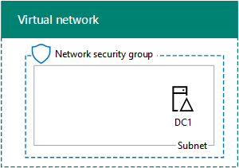

# <a name="base-configuration-devtest-environment"></a><span data-ttu-id="4bd30-103">Ambiente di sviluppo/test della configurazione di base</span><span class="sxs-lookup"><span data-stu-id="4bd30-103">Base Configuration dev/test environment</span></span>

 <span data-ttu-id="4bd30-104">**Riepilogo:** Creare una rete intranet semplificata come un ambiente di sviluppo e di testing in Microsoft Azure.</span><span class="sxs-lookup"><span data-stu-id="4bd30-104">**Summary:** Create a simplified intranet as a dev/test environment in Microsoft Azure.</span></span>
  
<span data-ttu-id="4bd30-105">In questo articolo vengono fornite istruzioni dettagliate per creare il seguente ambiente di sviluppo/test della configurazione di base in Azure:</span><span class="sxs-lookup"><span data-stu-id="4bd30-105">This article provides you with step-by-step instructions to create the following Base Configuration dev/test environment in Azure:</span></span>
  
<span data-ttu-id="4bd30-106">**Nella figura 1: Configurazione di Base dev/ambiente di testing**</span><span class="sxs-lookup"><span data-stu-id="4bd30-106">**Figure 1: The Base Configuration dev/test environment**</span></span>


  
<span data-ttu-id="4bd30-p101">L'ambiente di sviluppo/test della configurazione di base nella figura 1 è costituito dalla subnet Corpnet in una rete virtuale di Azure basata solo su cloud denominata TestLab, che simula una intranet privata semplificata connessa a Internet. Contiene tre macchine virtuali Azure che eseguono Windows Server 2016:</span><span class="sxs-lookup"><span data-stu-id="4bd30-p101">The Base Configuration dev/test environment in Figure 1 consists of the Corpnet subnet in a cloud-only Azure virtual network named TestLab that simulates a simplified, private intranet connected to the Internet. It contains three Azure virtual machines running Windows Server 2016:</span></span>
  
- <span data-ttu-id="4bd30-110">DC1 è configurato come un controller di dominio intranet e server Domain Name System (DNS)</span><span class="sxs-lookup"><span data-stu-id="4bd30-110">DC1 is configured as an intranet domain controller and Domain Name System (DNS) server</span></span>
    
- <span data-ttu-id="4bd30-111">APP1 è configurato come un’applicazione generale e server Web</span><span class="sxs-lookup"><span data-stu-id="4bd30-111">APP1 is configured as a general application and web server</span></span>
    
- <span data-ttu-id="4bd30-112">	CLIENT1 agisce come client intranet</span><span class="sxs-lookup"><span data-stu-id="4bd30-112">CLIENT1 acts as an intranet client</span></span>
    
<span data-ttu-id="4bd30-113">Questa configurazione consente a DC1 APP1, CLIENT1 e altri computer subnet Corpnet di essere: </span><span class="sxs-lookup"><span data-stu-id="4bd30-113">This configuration allows DC1, APP1, CLIENT1, and additional Corpnet subnet computers to be:</span></span> 
  
- <span data-ttu-id="4bd30-114">Connessione a Internet per installare gli aggiornamenti, accedere alle risorse Internet in tempo reale e partecipare alle tecnologie di cloud pubblici, ad esempio Microsoft Office 365 e altri servizi di Azure.</span><span class="sxs-lookup"><span data-stu-id="4bd30-114">Connected to the Internet to install updates, access Internet resources in real time, and participate in public cloud technologies such as Microsoft Office 365 and other Azure services.</span></span>
    
- <span data-ttu-id="4bd30-115">	Gestiti in remoto tramite connessioni da desktop remoto dal proprio computer connesso a Internet o alla rete dell'organizzazione.</span><span class="sxs-lookup"><span data-stu-id="4bd30-115">Remotely managed using Remote Desktop connections from your computer that is connected to the Internet or your organization network.</span></span>
    
<span data-ttu-id="4bd30-116">È possibile utilizzare l'ambiente di test risultante:</span><span class="sxs-lookup"><span data-stu-id="4bd30-116">You can use the resulting test environment:</span></span>
  
- <span data-ttu-id="4bd30-117">Per lo sviluppo di applicazioni e test.</span><span class="sxs-lookup"><span data-stu-id="4bd30-117">For application development and testing.</span></span>
    
- <span data-ttu-id="4bd30-118">Come la configurazione iniziale di un ambiente di test esteso del progetto che include macchine virtuali aggiuntive, servizi di Azure o altre offerte cloud Microsoft, ad esempio Office 365 e la sicurezza aziendale + dispositivi mobili.</span><span class="sxs-lookup"><span data-stu-id="4bd30-118">As the initial configuration of an extended test environment of your own design that includes additional virtual machines, Azure services, or other Microsoft cloud offerings such as Office 365 and Enterprise Security + Mobility.</span></span>
    
<span data-ttu-id="4bd30-119">Esistono quattro fasi per configurare l'ambiente di testing di configurazione di base in Azure:</span><span class="sxs-lookup"><span data-stu-id="4bd30-119">There are four phases to setting up the Base Configuration test environment in Azure:</span></span>
  
1. <span data-ttu-id="4bd30-120">	Creare la rete virtuale.</span><span class="sxs-lookup"><span data-stu-id="4bd30-120">Create the virtual network.</span></span>
    
2. <span data-ttu-id="4bd30-121">	Configurare DC1.</span><span class="sxs-lookup"><span data-stu-id="4bd30-121">Configure DC1.</span></span>
    
3. <span data-ttu-id="4bd30-122">	Configurare APP1.</span><span class="sxs-lookup"><span data-stu-id="4bd30-122">Configure APP1.</span></span>
    
4. <span data-ttu-id="4bd30-123">	Configurare CLIENT1.</span><span class="sxs-lookup"><span data-stu-id="4bd30-123">Configure CLIENT1.</span></span>
    
<span data-ttu-id="4bd30-p102">Se non si dispone già di una sottoscrizione di Azure, è possibile iscriversi per una versione di valutazione gratuita a [Provare Azure](https://azure.microsoft.com/pricing/free-trial/). Se si dispone di una sottoscrizione MSDN o Visual Studio, vedere [credito Azure mensile per i sottoscrittori di Visual Studio](https://azure.microsoft.com/pricing/member-offers/msdn-benefits-details/).</span><span class="sxs-lookup"><span data-stu-id="4bd30-p102">If you do not already have an Azure subscription, you can sign up for a free trial at [Try Azure](https://azure.microsoft.com/pricing/free-trial/). If you have an MSDN or Visual Studio subscription, see [Monthly Azure credit for Visual Studio subscribers](https://azure.microsoft.com/pricing/member-offers/msdn-benefits-details/).</span></span>
  
> [!NOTE]
> <span data-ttu-id="4bd30-p103">Macchine virtuali di Azure comportano un costo corso quando sono in esecuzione. Il costo calcolato rispetto all'abbonamento MSDN prova, gratuito o sottoscrizione a pagamento. Per ulteriori informazioni sui costi delle macchine virtuali Azure, vedere [Informazioni sul prezzo macchine virtuali](https://azure.microsoft.com/pricing/details/virtual-machines/) e [Azure prezzi calcolatrice](https://azure.microsoft.com/pricing/calculator/). Per mantenere i costi verso il basso, vedere [ridurre al minimo i costi delle macchine virtuali ambiente di testing in Azure](base-configuration-dev-test-environment.md#mincost).</span><span class="sxs-lookup"><span data-stu-id="4bd30-p103">Virtual machines in Azure incur an ongoing monetary cost when they are running. This cost is billed against your free trial, MSDN subscription, or paid subscription. For more information about the costs of running Azure virtual machines, see [Virtual Machines Pricing Details](https://azure.microsoft.com/pricing/details/virtual-machines/) and [Azure Pricing Calculator](https://azure.microsoft.com/pricing/calculator/). To keep costs down, see [Minimizing the costs of test environment virtual machines in Azure](base-configuration-dev-test-environment.md#mincost).</span></span> 
  

  
> [!TIP]
> <span data-ttu-id="4bd30-131">Fare clic [qui](http://aka.ms/catlgstack) per consultare una mappa di tutti gli articoli relativi alla guida del laboratorio di testing cloud di One Microsoft.</span><span class="sxs-lookup"><span data-stu-id="4bd30-131">Click [here](http://aka.ms/catlgstack) for a visual map to all the articles in the One Microsoft Cloud Test Lab Guide stack.</span></span>
  
## <a name="phase-1-create-the-virtual-network"></a><span data-ttu-id="4bd30-132">Fase 1: Creare la rete virtuale</span><span class="sxs-lookup"><span data-stu-id="4bd30-132">Phase 1: Create the virtual network</span></span>

<span data-ttu-id="4bd30-133">Per prima cosa, avviare un prompt di Azure PowerShell.</span><span class="sxs-lookup"><span data-stu-id="4bd30-133">First, start an Azure PowerShell prompt.</span></span>
  
> [!NOTE]
> <span data-ttu-id="4bd30-p104">Il seguente comando consente di utilizzare la versione più recente di Azure PowerShell. Vedere [iniziare a utilizzare i cmdlet PowerShell di Azure](https://docs.microsoft.com/en-us/powershell/azureps-cmdlets-docs/).</span><span class="sxs-lookup"><span data-stu-id="4bd30-p104">The following command sets use the latest version of Azure PowerShell. See [Get started with Azure PowerShell cmdlets](https://docs.microsoft.com/en-us/powershell/azureps-cmdlets-docs/).</span></span> 
  
<span data-ttu-id="4bd30-136">Accedere al proprio account Azure con il seguente comando.</span><span class="sxs-lookup"><span data-stu-id="4bd30-136">Sign in to your Azure account with the following command.</span></span>
  
```
Login-AzureRMAccount
```

> [!TIP]
> <span data-ttu-id="4bd30-137">Fare clic [qui](https://gallery.technet.microsoft.com/PowerShell-commands-for-ba957d3d) per ottenere un file di testo che contiene tutti i comandi di PowerShell in questo articolo.</span><span class="sxs-lookup"><span data-stu-id="4bd30-137">Click [here](https://gallery.technet.microsoft.com/PowerShell-commands-for-ba957d3d) to get a text file that contains all the PowerShell commands in this article.</span></span>
  
<span data-ttu-id="4bd30-138">Ottenere il nome della sottoscrizione utilizzando il comando seguente.</span><span class="sxs-lookup"><span data-stu-id="4bd30-138">Get your subscription name using the following command.</span></span>
  
```
Get-AzureRMSubscription | Sort Name | Select Name
```

<span data-ttu-id="4bd30-p105">Impostare la sottoscrizione di Azure. Sostituire tutto il testo racchiuso tra virgolette, compresi i caratteri < e >, con il nome corretto.</span><span class="sxs-lookup"><span data-stu-id="4bd30-p105">Set your Azure subscription. Replace everything within the quotes, including the < and > characters, with the correct name.</span></span>
  
```
$subscr="<subscription name>"
Get-AzureRmSubscription -SubscriptionName $subscr | Select-AzureRmSubscription
```

<span data-ttu-id="4bd30-p106">In seguito, creare un nuovo gruppo di risorse per il lab di test di configurazione di base. Per determinare un nome del gruppo di risorse univoco, utilizzare questo comando per creare un elenco dei gruppi di risorse esistenti.</span><span class="sxs-lookup"><span data-stu-id="4bd30-p106">Next, create a new resource group for your Base Configuration test lab. To determine a unique resource group name, use this command to list your existing resource groups.</span></span>
  
```
Get-AzureRMResourceGroup | Sort ResourceGroupName | Select ResourceGroupName
```

<span data-ttu-id="4bd30-p107">Creare il nuovo gruppo di risorse con questi comandi. Sostituire tutto il testo racchiuso tra virgolette, compresi i caratteri < e >, con i nomi corretti.</span><span class="sxs-lookup"><span data-stu-id="4bd30-p107">Create your new resource group with these commands. Replace everything within the quotes, including the < and > characters, with the correct names.</span></span>
  
```
$rgName="<resource group name>"
$locName="<location name, such as West US>"
New-AzureRMResourceGroup -Name $rgName -Location $locName
```

<span data-ttu-id="4bd30-145">Successivamente, è possibile creare la rete virtuale TestLab che ospiterà la subnet Corpnet della configurazione di base, proteggendola con un gruppo di sicurezza di rete.</span><span class="sxs-lookup"><span data-stu-id="4bd30-145">Next, you create the TestLab virtual network that will host the Corpnet subnet of the base configuration and protect it with a network security group.</span></span>
  
```
$rgName="<name of your new resource group>"
$locName=(Get-AzureRmResourceGroup -Name $rgName).Location
$corpnetSubnet=New-AzureRMVirtualNetworkSubnetConfig -Name Corpnet -AddressPrefix 10.0.0.0/24
New-AzureRMVirtualNetwork -Name TestLab -ResourceGroupName $rgName -Location $locName -AddressPrefix 10.0.0.0/8 -Subnet $corpnetSubnet -DNSServer 10.0.0.4
$rule1=New-AzureRMNetworkSecurityRuleConfig -Name "RDPTraffic" -Description "Allow RDP to all VMs on the subnet" -Access Allow -Protocol Tcp -Direction Inbound -Priority 100 -SourceAddressPrefix Internet -SourcePortRange * -DestinationAddressPrefix * -DestinationPortRange 3389
New-AzureRMNetworkSecurityGroup -Name Corpnet -ResourceGroupName $rgName -Location $locName -SecurityRules $rule1
$vnet=Get-AzureRMVirtualNetwork -ResourceGroupName $rgName -Name TestLab
$nsg=Get-AzureRMNetworkSecurityGroup -Name Corpnet -ResourceGroupName $rgName
Set-AzureRMVirtualNetworkSubnetConfig -VirtualNetwork $vnet -Name Corpnet -AddressPrefix "10.0.0.0/24" -NetworkSecurityGroup $nsg
```

<span data-ttu-id="4bd30-146">Questa è la configurazione corrente.</span><span class="sxs-lookup"><span data-stu-id="4bd30-146">This is your current configuration.</span></span>
  

  
## <a name="phase-2-configure-dc1"></a><span data-ttu-id="4bd30-148">Fase 2: Configurare DC1</span><span class="sxs-lookup"><span data-stu-id="4bd30-148">Phase 2: Configure DC1</span></span>

<span data-ttu-id="4bd30-149">Nella fase successiva verrà creata la macchina virtuale DC1 e verrà configurata come controller di dominio per il dominio di Windows Server Active Directory (AD) corp.contoso.com e un server DNS per le macchine virtuali della rete virtuale TestLab.</span><span class="sxs-lookup"><span data-stu-id="4bd30-149">In this phase, we create the DC1 virtual machine and configure it as a domain controller for the corp.contoso.com Windows Server Active Directory (AD) domain and a DNS server for the virtual machines of the TestLab virtual network.</span></span>
  
<span data-ttu-id="4bd30-150">Per creare una macchina virtuale Azure per DC1, immettere il nome del gruppo di risorse ed eseguire questi comandi al prompt dei comandi di Azure PowerShell nel computer locale.</span><span class="sxs-lookup"><span data-stu-id="4bd30-150">To create an Azure virtual machine for DC1, fill in the name of your resource group and run these commands at the Azure PowerShell command prompt on your local computer.</span></span>
  
```
$rgName="<resource group name>"
$locName=(Get-AzureRmResourceGroup -Name $rgName).Location
$vnet=Get-AzureRMVirtualNetwork -Name TestLab -ResourceGroupName $rgName
$pip=New-AzureRMPublicIpAddress -Name DC1-PIP -ResourceGroupName $rgName -Location $locName -AllocationMethod Dynamic
$nic=New-AzureRMNetworkInterface -Name DC1-NIC -ResourceGroupName $rgName -Location $locName -SubnetId $vnet.Subnets[0].Id -PublicIpAddressId $pip.Id -PrivateIpAddress 10.0.0.4
$vm=New-AzureRMVMConfig -VMName DC1 -VMSize Standard_A1
$cred=Get-Credential -Message "Type the name and password of the local administrator account for DC1."
$vm=Set-AzureRMVMOperatingSystem -VM $vm -Windows -ComputerName DC1 -Credential $cred -ProvisionVMAgent -EnableAutoUpdate
$vm=Set-AzureRMVMSourceImage -VM $vm -PublisherName MicrosoftWindowsServer -Offer WindowsServer -Skus 2016-Datacenter -Version "latest"
$vm=Add-AzureRMVMNetworkInterface -VM $vm -Id $nic.Id
$vm=Set-AzureRmVMOSDisk -VM $vm -Name "DC1-OS" -DiskSizeInGB 128 -CreateOption FromImage -StorageAccountType "StandardLRS"
$diskConfig=New-AzureRmDiskConfig -AccountType "StandardLRS" -Location $locName -CreateOption Empty -DiskSizeGB 20
$dataDisk1=New-AzureRmDisk -DiskName "DC1-DataDisk1" -Disk $diskConfig -ResourceGroupName $rgName
$vm=Add-AzureRmVMDataDisk -VM $vm -Name "DC1-DataDisk1" -CreateOption Attach -ManagedDiskId $dataDisk1.Id -Lun 1
New-AzureRMVM -ResourceGroupName $rgName -Location $locName -VM $vm
```

<span data-ttu-id="4bd30-p108">Verrà richiesto nome utente e password dell'account Administrator locale su DC1. Utilizzare una password complessa e annotare nome e password in una posizione sicura.</span><span class="sxs-lookup"><span data-stu-id="4bd30-p108">You will be prompted for a user name and password for the local administrator account on DC1. Use a strong password and record both the name and password in a secure location.</span></span>
  
<span data-ttu-id="4bd30-153">Eseguire quindi la connessione alla macchina virtuale DC1.</span><span class="sxs-lookup"><span data-stu-id="4bd30-153">Next, connect to the DC1 virtual machine.</span></span>
  
### <a name="connect-to-dc1-using-local-administrator-account-credentials"></a><span data-ttu-id="4bd30-154">Connettersi a DC1 usando le credenziali dell'account Administrator locale</span><span class="sxs-lookup"><span data-stu-id="4bd30-154">Connect to DC1 using local administrator account credentials</span></span>

1. <span data-ttu-id="4bd30-155">Nel [portale di Azure](https://portal.azure.com), fare clic su **gruppi di risorse >** <the name of your new resource group> **> DC1 > Connetti**.</span><span class="sxs-lookup"><span data-stu-id="4bd30-155">In the [Azure portal](https://portal.azure.com), click **Resource Groups >** <the name of your new resource group> **> DC1 > Connect**.</span></span>
    
2. <span data-ttu-id="4bd30-156">Aprire il file DC1.rdp che può essere scaricato e quindi fare clic su **Connetti**.</span><span class="sxs-lookup"><span data-stu-id="4bd30-156">Open the DC1.rdp file that is downloaded, and then click **Connect**.</span></span>
    
3. <span data-ttu-id="4bd30-157">Specificare il nome dell'account amministratore locale DC1:</span><span class="sxs-lookup"><span data-stu-id="4bd30-157">Specify the DC1 local administrator account name:</span></span>
    
  - <span data-ttu-id="4bd30-158">Per Windows 7:</span><span class="sxs-lookup"><span data-stu-id="4bd30-158">For Windows 7:</span></span>
    
    <span data-ttu-id="4bd30-p109">Nella finestra di dialogo **Protezione di Windows** , fare clic su **utilizza un altro account**. In **nome utente**digitare **DC1\\**[nome dell'account amministratore locale].</span><span class="sxs-lookup"><span data-stu-id="4bd30-p109">In the **Windows Security** dialog box, click **Use another account**. In **User name**, type **DC1\\**[Local administrator account name].</span></span>
    
  - <span data-ttu-id="4bd30-161">Per Windows 8 o Windows 10:</span><span class="sxs-lookup"><span data-stu-id="4bd30-161">For Windows 8 or Windows 10:</span></span>
    
    <span data-ttu-id="4bd30-p110">Nella finestra di dialogo **Protezione di Windows** , fare clic su **ulteriori opzioni**e quindi fare clic su **Usa un account diverso**. In **nome utente**digitare **DC1\\**[nome dell'account amministratore locale].</span><span class="sxs-lookup"><span data-stu-id="4bd30-p110">In the **Windows Security** dialog box, click **More choices**, and then click **Use a different account**. In **User name**, type **DC1\\**[Local administrator account name].</span></span>
    
4. <span data-ttu-id="4bd30-164">Nella casella **Password**digitare la password dell'account di amministratore locale e quindi fare clic su **OK**.</span><span class="sxs-lookup"><span data-stu-id="4bd30-164">In **Password**, type the password of the local administrator account, and then click **OK**.</span></span>
    
5. <span data-ttu-id="4bd30-165">Quando richiesto, fare clic su **Sì**.</span><span class="sxs-lookup"><span data-stu-id="4bd30-165">When prompted, click **Yes**.</span></span>
    
<span data-ttu-id="4bd30-166">Aggiungere un ulteriore disco dati come nuovo volume con lettera di unità F: immettendo questo comando al prompt dei comandi di Windows PowerShell a livello di amministratore in DC1.</span><span class="sxs-lookup"><span data-stu-id="4bd30-166">Next, add an extra data disk as a new volume with the drive letter F: with this command at an administrator-level Windows PowerShell command prompt on DC1.</span></span>
  
```
Get-Disk | Where PartitionStyle -eq "RAW" | Initialize-Disk -PartitionStyle MBR -PassThru | New-Partition -AssignDriveLetter -UseMaximumSize | Format-Volume -FileSystem NTFS -NewFileSystemLabel "WSAD Data"
```

<span data-ttu-id="4bd30-p111">Configurare quindi DC1 come controller di dominio e il server DNS per il dominio corp.contoso.com. Eseguire questi comandi al prompt dei comandi di Windows PowerShell a livello di amministratore.</span><span class="sxs-lookup"><span data-stu-id="4bd30-p111">Next, configure DC1 as a domain controller and DNS server for the corp.contoso.com domain. Run these commands at an administrator-level Windows PowerShell command prompt.</span></span>
  
```
Install-WindowsFeature AD-Domain-Services -IncludeManagementTools
Install-ADDSForest -DomainName corp.contoso.com -DatabasePath "F:\\NTDS" -SysvolPath "F:\\SYSVOL" -LogPath "F:\\Logs"
```

<span data-ttu-id="4bd30-p112">Sarà necessario specificare una password di amministratore in modalità provvisoria. Archiviare la password in un percorso sicuro.</span><span class="sxs-lookup"><span data-stu-id="4bd30-p112">You will need to specify a safe mode administrator password. Store this password in a secure location.</span></span>
  
<span data-ttu-id="4bd30-171">Si tenga presente che il completamento di questi comandi potrebbe richiedere alcuni minuti.</span><span class="sxs-lookup"><span data-stu-id="4bd30-171">Note that these commands can take a few minutes to complete.</span></span>
  
<span data-ttu-id="4bd30-172">Dopo il riavvio di DC1, riconnettersi al computer virtuale DC1.</span><span class="sxs-lookup"><span data-stu-id="4bd30-172">After DC1 restarts, reconnect to the DC1 virtual machine.</span></span>
  
### <a name="connect-to-dc1-using-domain-credentials"></a><span data-ttu-id="4bd30-173">Connettersi a DC1 usando le credenziali di dominio</span><span class="sxs-lookup"><span data-stu-id="4bd30-173">Connect to DC1 using domain credentials</span></span>

1. <span data-ttu-id="4bd30-174">Nel [portale di Azure](https://portal.azure.com), fare clic su **gruppi di risorse >** <your resource group name> **> DC1 > Connetti**.</span><span class="sxs-lookup"><span data-stu-id="4bd30-174">In the [Azure portal](https://portal.azure.com), click **Resource Groups >** <your resource group name> **> DC1 > Connect**.</span></span>
    
2. <span data-ttu-id="4bd30-175">Eseguire il file DC1.rdp che può essere scaricato e quindi fare clic su **Connetti**.</span><span class="sxs-lookup"><span data-stu-id="4bd30-175">Run the DC1.rdp file that is downloaded, and then click **Connect**.</span></span>
    
3. <span data-ttu-id="4bd30-p113">**Protezione di Windows**, fare clic su **utilizza un altro account**. In **nome utente**digitare **CORP\\**[nome dell'account amministratore locale].</span><span class="sxs-lookup"><span data-stu-id="4bd30-p113">In **Windows Security**, click **Use another account**. In **User name**, type **CORP\\**[Local administrator account name].</span></span>
    
4. <span data-ttu-id="4bd30-178">Nella casella **Password**digitare la password dell'account di amministratore locale e quindi fare clic su **OK**.</span><span class="sxs-lookup"><span data-stu-id="4bd30-178">In **Password**, type the password of the local administrator account, and then click **OK**.</span></span>
    
5. <span data-ttu-id="4bd30-179">Quando richiesto, fare clic su **Sì**.</span><span class="sxs-lookup"><span data-stu-id="4bd30-179">When prompted, click **Yes**.</span></span>
    
<span data-ttu-id="4bd30-p114">Successivamente, creare un account utente in Active Directory che verrà utilizzato quando si accede a computer membri del dominio CORP. Eseguire questo comando al prompt dei comandi di Windows PowerShell a livello di amministratore.</span><span class="sxs-lookup"><span data-stu-id="4bd30-p114">Next, create a user account in Active Directory that will be used when logging in to CORP domain member computers. Run this command at an administrator-level Windows PowerShell command prompt.</span></span>
  
```
New-ADUser -SamAccountName User1 -AccountPassword (read-host "Set user password" -assecurestring) -name "User1" -enabled $true -PasswordNeverExpires $true -ChangePasswordAtLogon $false
```

<span data-ttu-id="4bd30-p115">Tenere presente che questo comando chiede di specificare la password dell'account User1. Poiché questo account verrà utilizzato per le connessioni desktop remote per tutti i computer membri del dominio CORP, scegliere una password complessa. Registrare la password dell'account User1 e archiviarla in una posizione sicura.</span><span class="sxs-lookup"><span data-stu-id="4bd30-p115">Note that this command prompts you to supply the User1 account password. Because this account will be used for remote desktop connections for all CORP domain member computers, choose a strong password. Record the User1 account password and store it in a secured location.</span></span>
  
<span data-ttu-id="4bd30-p116">Configurare quindi il nuovo account User1 come amministratore dell'organizzazione. Eseguire questo comando al prompt dei comandi di Windows PowerShell a livello di amministratore.</span><span class="sxs-lookup"><span data-stu-id="4bd30-p116">Next, configure the new User1 account as an Enterprise Administrator. Run this command at the administrator-level Windows PowerShell command prompt.</span></span>
  
```
Add-ADPrincipalGroupMembership -Identity "CN=User1,CN=Users,DC=corp,DC=contoso,DC=com" -MemberOf "CN=Enterprise Admins,CN=Users,DC=corp,DC=contoso,DC=com","CN=Domain Admins,CN=Users,DC=corp,DC=contoso,DC=com","CN=Schema Admins,CN=Users,DC=corp,DC=contoso,DC=com"
```

<span data-ttu-id="4bd30-187">Chiudere la sessione di Desktop remoto con DC1 e quindi riconnettersi utilizzando il CORP\\account User1.</span><span class="sxs-lookup"><span data-stu-id="4bd30-187">Close the Remote Desktop session with DC1 and then reconnect using the CORP\\User1 account.</span></span>
  
<span data-ttu-id="4bd30-188">Successivamente, per consentire il traffico per lo strumento Ping, eseguire questo comando al prompt dei comandi di Windows PowerShell a livello di amministratore.</span><span class="sxs-lookup"><span data-stu-id="4bd30-188">Next, to allow traffic for the Ping tool, run this command at an administrator-level Windows PowerShell command prompt.</span></span>
  
```
Set-NetFirewallRule -DisplayName "File and Printer Sharing (Echo Request - ICMPv4-In)" -enabled True
```

<span data-ttu-id="4bd30-189">Questa è la configurazione corrente.</span><span class="sxs-lookup"><span data-stu-id="4bd30-189">This is your current configuration.</span></span>
  

  
## <a name="phase-3-configure-app1"></a><span data-ttu-id="4bd30-191">Fase 3: Configurare APP1</span><span class="sxs-lookup"><span data-stu-id="4bd30-191">Phase 3: Configure APP1</span></span>

<span data-ttu-id="4bd30-192">APP1 fornisce servizi Web e di condivisione file.</span><span class="sxs-lookup"><span data-stu-id="4bd30-192">APP1 provides web and file sharing services.</span></span>
  
<span data-ttu-id="4bd30-193">Per creare una macchina virtuale Azure per APP1, inserire il nome del gruppo di risorse, la posizione di Azure e il nome dell’account di archiviazione, quindi eseguire questi comandi al prompt dei comandi di Azure PowerShell nel computer locale.</span><span class="sxs-lookup"><span data-stu-id="4bd30-193">To create an Azure Virtual Machine for APP1, fill in the name of your resource group, Azure location, and storage account name and run these commands at the Azure PowerShell command prompt on your local computer.</span></span>
  
```
$rgName="<resource group name>"
$locName=(Get-AzureRmResourceGroup -Name $rgName).Location
$vnet=Get-AzureRMVirtualNetwork -Name TestLab -ResourceGroupName $rgName
$pip=New-AzureRMPublicIpAddress -Name APP1-PIP -ResourceGroupName $rgName -Location $locName -AllocationMethod Dynamic
$nic=New-AzureRMNetworkInterface -Name APP1-NIC -ResourceGroupName $rgName -Location $locName -SubnetId $vnet.Subnets[0].Id -PublicIpAddressId $pip.Id
$vm=New-AzureRMVMConfig -VMName APP1 -VMSize Standard_A1
$cred=Get-Credential -Message "Type the name and password of the local administrator account for APP1."
$vm=Set-AzureRMVMOperatingSystem -VM $vm -Windows -ComputerName APP1 -Credential $cred -ProvisionVMAgent -EnableAutoUpdate
$vm=Set-AzureRMVMSourceImage -VM $vm -PublisherName MicrosoftWindowsServer -Offer WindowsServer -Skus 2016-Datacenter -Version "latest"
$vm=Add-AzureRMVMNetworkInterface -VM $vm -Id $nic.Id
$vm=Set-AzureRmVMOSDisk -VM $vm -Name "APP1-OS" -DiskSizeInGB 128 -CreateOption FromImage -StorageAccountType "StandardLRS"
New-AzureRMVM -ResourceGroupName $rgName -Location $locName -VM $vm
```

<span data-ttu-id="4bd30-194">Successivamente, connettersi alla macchina virtuale APP1 usando il nome e la password dell'account Administrator locale di APP1, quindi aprire un prompt dei comandi di Windows PowerShell.</span><span class="sxs-lookup"><span data-stu-id="4bd30-194">Next, connect to the APP1 virtual machine using the APP1 local administrator account name and password, and then open a Windows PowerShell command prompt.</span></span>
  
<span data-ttu-id="4bd30-195">Per verificare la comunicazione nome di soluzione e di rete tra APP1 e DC1, eseguire il comando **ping dc1.corp.contoso.com** e verificare che non vi sono quattro risposte.</span><span class="sxs-lookup"><span data-stu-id="4bd30-195">To check name resolution and network communication between APP1 and DC1, run the **ping dc1.corp.contoso.com** command and verify that there are four replies.</span></span>
  
<span data-ttu-id="4bd30-196">Unire quindi la macchina virtuale APP1 al dominio CORP immettendo questi comandi nel prompt dei comandi di Windows PowerShell.</span><span class="sxs-lookup"><span data-stu-id="4bd30-196">Next, join the APP1 virtual machine to the CORP domain with these commands at the Windows PowerShell prompt.</span></span>
  
```
Add-Computer -DomainName corp.contoso.com
Restart-Computer
```

<span data-ttu-id="4bd30-197">Si noti che è necessario fornire il CORP\\le credenziali dell'account di dominio User1 dopo aver eseguito il comando **Aggiungi Computer** .</span><span class="sxs-lookup"><span data-stu-id="4bd30-197">Note that you must supply the CORP\\User1 domain account credentials after running the **Add-Computer** command.</span></span>
  
<span data-ttu-id="4bd30-198">Dopo il riavvio di APP1, connettersi tramite il CORP\\account User1 e aprire un livello di amministratore di Windows PowerShell Prompt dei comandi.</span><span class="sxs-lookup"><span data-stu-id="4bd30-198">After APP1 restarts, connect to it using the CORP\\User1 account, and then open an administrator-level Windows PowerShell command prompt.</span></span>
  
<span data-ttu-id="4bd30-199">Successivamente, modificare APP1 in server Web con questo comando al prompt dei comandi di Windows PowerShell in APP1.</span><span class="sxs-lookup"><span data-stu-id="4bd30-199">Next, make APP1 a web server with this command at the Windows PowerShell command prompt on APP1.</span></span>
  
```
Install-WindowsFeature Web-WebServer -IncludeManagementTools
```

<span data-ttu-id="4bd30-200">Creare quindi una cartella condivisa e un file di testo all'interno della cartella in APP1 con i comandi di PowerShell.</span><span class="sxs-lookup"><span data-stu-id="4bd30-200">Next, create a shared folder and a text file within the folder on APP1 with these PowerShell commands.</span></span>
  
```
New-Item -path c:\\files -type directory
Write-Output "This is a shared file." | out-file c:\\files\\example.txt
New-SmbShare -name files -path c:\\files -changeaccess CORP\\User1
```

<span data-ttu-id="4bd30-201">Questa è la configurazione corrente.</span><span class="sxs-lookup"><span data-stu-id="4bd30-201">This is your current configuration.</span></span>
  

  
## <a name="phase-4-configure-client1"></a><span data-ttu-id="4bd30-203">Fase 4: Configurare CLIENT1</span><span class="sxs-lookup"><span data-stu-id="4bd30-203">Phase 4: Configure CLIENT1</span></span>

<span data-ttu-id="4bd30-204">CLIENT1 agisce come un portatile, tablet o computer desktop tipico sulla intranet Contoso.</span><span class="sxs-lookup"><span data-stu-id="4bd30-204">CLIENT1 acts as a typical laptop, tablet, or desktop computer on the Contoso intranet.</span></span>
  
> [!NOTE]
> <span data-ttu-id="4bd30-p117">Il set di comando seguente consente di creare CLIENT1 che esegue Windows Server 2016 Datacenter, che può essere eseguita per tutti i tipi di sottoscrizioni di Azure. Se si dispone di una sottoscrizione di Azure basate su Visual Studio, è possibile creare CLIENT1 in esecuzione Windows 10, Windows 8 o Windows 7 con il [portale di Azure](https://portal.azure.com).</span><span class="sxs-lookup"><span data-stu-id="4bd30-p117">The following command set creates CLIENT1 running Windows Server 2016 Datacenter, which can be done for all types of Azure subscriptions. If you have an Visual Studio-based Azure subscription, you can create CLIENT1 running Windows 10, Windows 8, or Windows 7 with the [Azure portal](https://portal.azure.com).</span></span> 
  
<span data-ttu-id="4bd30-207">Per creare una macchina virtuale Azure per CLIENT1, inserire il nome del gruppo di risorse, la posizione di Azure e il nome dell’account di archiviazione, quindi eseguire questi comandi al prompt dei comandi di Azure PowerShell nel computer locale.</span><span class="sxs-lookup"><span data-stu-id="4bd30-207">To create an Azure Virtual Machine for CLIENT1, fill in the name of your resource group, Azure location, and storage account name and run these commands at the Azure PowerShell command prompt on your local computer.</span></span>
  
```
$rgName="<resource group name>"
$locName=(Get-AzureRmResourceGroup -Name $rgName).Location
$vnet=Get-AzureRMVirtualNetwork -Name TestLab -ResourceGroupName $rgName
$pip=New-AzureRMPublicIpAddress -Name CLIENT1-PIP -ResourceGroupName $rgName -Location $locName -AllocationMethod Dynamic
$nic=New-AzureRMNetworkInterface -Name CLIENT1-NIC -ResourceGroupName $rgName -Location $locName -SubnetId $vnet.Subnets[0].Id -PublicIpAddressId $pip.Id
$vm=New-AzureRMVMConfig -VMName CLIENT1 -VMSize Standard_A1
$cred=Get-Credential -Message "Type the name and password of the local administrator account for CLIENT1."
$vm=Set-AzureRMVMOperatingSystem -VM $vm -Windows -ComputerName CLIENT1 -Credential $cred -ProvisionVMAgent -EnableAutoUpdate
$vm=Set-AzureRMVMSourceImage -VM $vm -PublisherName MicrosoftWindowsServer -Offer WindowsServer -Skus 2016-Datacenter -Version "latest"
$vm=Add-AzureRMVMNetworkInterface -VM $vm -Id $nic.Id
$vm=Set-AzureRmVMOSDisk -VM $vm -Name "CLIENT1-OS" -DiskSizeInGB 128 -CreateOption FromImage -StorageAccountType "StandardLRS"
New-AzureRMVM -ResourceGroupName $rgName -Location $locName -VM $vm
```

<span data-ttu-id="4bd30-208">Successivamente, connettersi alla macchina virtuale CLIENT1 usando il nome e la password dell'account Administrator locale di CLIENT1, quindi aprire un prompt dei comandi di Windows PowerShell a livello di amministratore.</span><span class="sxs-lookup"><span data-stu-id="4bd30-208">Next, connect to the CLIENT1 virtual machine using the CLIENT1 local administrator account name and password, and then open an administrator-level Windows PowerShell command prompt.</span></span>
  
<span data-ttu-id="4bd30-209">Per verificare la comunicazione nome di soluzione e di rete tra CLIENT1 e DC1, al prompt dei comandi di Windows PowerShell eseguire il comando **ping dc1.corp.contoso.com** e verificare che non vi sono quattro risposte.</span><span class="sxs-lookup"><span data-stu-id="4bd30-209">To check name resolution and network communication between CLIENT1 and DC1, run the **ping dc1.corp.contoso.com** command at a Windows PowerShell command prompt and verify that there are four replies.</span></span>
  
<span data-ttu-id="4bd30-210">Unire quindi la macchina virtuale CLIENT1 al dominio CORP immettendo questi comandi nel prompt dei comandi di Windows PowerShell.</span><span class="sxs-lookup"><span data-stu-id="4bd30-210">Next, join the CLIENT1 virtual machine to the CORP domain with these commands at the Windows PowerShell prompt.</span></span>
  
```
Add-Computer -DomainName corp.contoso.com
Restart-Computer
```

<span data-ttu-id="4bd30-211">Si noti che è necessario fornire il CORP\\le credenziali dell'account di dominio User1 dopo aver eseguito il comando **Aggiungi Computer** .</span><span class="sxs-lookup"><span data-stu-id="4bd30-211">Note that you must supply your CORP\\User1 domain account credentials after running the **Add-Computer** command.</span></span>
  
<span data-ttu-id="4bd30-212">Dopo il riavvio del CLIENT1, connettersi tramite il CORP\\User1 nome dell'account e password e quindi aprire un prompt dei comandi di Windows PowerShell a livello di amministratore.</span><span class="sxs-lookup"><span data-stu-id="4bd30-212">After CLIENT1 restarts, connect to it using the CORP\\User1 account name and password, and then open an administrator-level Windows PowerShell command prompt.</span></span>
  
<span data-ttu-id="4bd30-213">Successivamente, verificare che sia possibile accedere alle risorse Web e di condivisione file in APP1 da CLIENT1.</span><span class="sxs-lookup"><span data-stu-id="4bd30-213">Next, verify that you can access web and file share resources on APP1 from CLIENT1.</span></span>
  
### <a name="verify-client-access-to-app1"></a><span data-ttu-id="4bd30-214">Verificare l'accesso CLIENT ad APP1</span><span class="sxs-lookup"><span data-stu-id="4bd30-214">Verify CLIENT access to APP1</span></span>

1. <span data-ttu-id="4bd30-215">In Server Manager, nel riquadro dell'albero, fare clic su **Server locale**.</span><span class="sxs-lookup"><span data-stu-id="4bd30-215">In Server Manager, in the tree pane, click **Local Server**.</span></span>
    
2. <span data-ttu-id="4bd30-216">Nelle **proprietà di CLIENT1**, fare clic **su** Avanti per **La protezione avanzata di Internet Explorer**.</span><span class="sxs-lookup"><span data-stu-id="4bd30-216">In **Properties for CLIENT1**, click **On** next to **IE Enhanced Security Configuration**.</span></span>
    
3. <span data-ttu-id="4bd30-217">**Protezione avanzata di Internet Explorer**, fare clic su **Disattiva** per **amministratori** e **utenti**e quindi fare clic su **OK**.</span><span class="sxs-lookup"><span data-stu-id="4bd30-217">In **Internet Explorer Enhanced Security Configuration**, click **Off** for **Administrators** and **Users**, and then click **OK**.</span></span>
    
4. <span data-ttu-id="4bd30-218">Nella schermata Start, fare clic su **Internet Explorer**e quindi fare clic su **OK**.</span><span class="sxs-lookup"><span data-stu-id="4bd30-218">From the Start screen, click **Internet Explorer**, and then click **OK**.</span></span>
    
5. <span data-ttu-id="4bd30-p118">Nella barra degli indirizzi digitare **http://app1.corp.contoso.com/**e quindi premere INVIO. È consigliabile vedere la pagina web di Internet Information Services predefinita per APP1.</span><span class="sxs-lookup"><span data-stu-id="4bd30-p118">In the Address bar, type **http://app1.corp.contoso.com/**, and then press ENTER. You should see the default Internet Information Services web page for APP1.</span></span>
    
6. <span data-ttu-id="4bd30-221">Dalla barra delle applicazioni del desktop, fare clic sull'icona Esplora File.</span><span class="sxs-lookup"><span data-stu-id="4bd30-221">From the desktop taskbar, click the File Explorer icon.</span></span>
    
7. <span data-ttu-id="4bd30-p119">Nella barra degli indirizzi digitare ** \\ \\app1\\file**, e quindi premere INVIO. Verrà visualizzata una finestra della cartella con il contenuto della cartella condivisa.</span><span class="sxs-lookup"><span data-stu-id="4bd30-p119">In the address bar, type **\\\\app1\\Files**, and then press ENTER. You should see a folder window with the contents of the Files shared folder.</span></span>
    
8. <span data-ttu-id="4bd30-p120">Nella finestra della cartella condivisa **i file** , fare doppio clic sul file di **esempio. txt** . È consigliabile visualizzare il contenuto del file di esempio. txt.</span><span class="sxs-lookup"><span data-stu-id="4bd30-p120">In the **Files** shared folder window, double-click the **Example.txt** file. You should see the contents of the Example.txt file.</span></span>
    
9. <span data-ttu-id="4bd30-226">Chiudere l' **esempio. txt - il blocco note** e le finestre della cartella **file** condivisi.</span><span class="sxs-lookup"><span data-stu-id="4bd30-226">Close the **example.txt - Notepad** and the **Files** shared folder windows.</span></span>
    
<span data-ttu-id="4bd30-227">Questa è la configurazione finale.</span><span class="sxs-lookup"><span data-stu-id="4bd30-227">This is your final configuration.</span></span>
  

  
<span data-ttu-id="4bd30-229">La configurazione di Base in Azure è pronta per lo sviluppo di applicazioni e i test o per la creazione di ambienti di testing aggiuntivi.</span><span class="sxs-lookup"><span data-stu-id="4bd30-229">Your Base Configuration in Azure is now ready for application development and testing or for building additional test environments.</span></span> 
  
> [!TIP]
> <span data-ttu-id="4bd30-230">Fare clic [qui](http://aka.ms/catlgstack) per consultare una mappa di tutti gli articoli relativi alla guida del laboratorio di testing cloud di One Microsoft.</span><span class="sxs-lookup"><span data-stu-id="4bd30-230">Click [here](http://aka.ms/catlgstack) for a visual map to all of the articles in the One Microsoft Cloud Test Lab Guide stack.</span></span>
  
## <a name="minimizing-the-costs-of-test-environment-virtual-machines-in-azure"></a><span data-ttu-id="4bd30-231">Ridurre al minimo i costi delle macchine virtuali nell’ambiente di testing in Azure</span><span class="sxs-lookup"><span data-stu-id="4bd30-231">Minimizing the costs of test environment virtual machines in Azure</span></span>
<span data-ttu-id="4bd30-232"><a name="mincost"> </a></span><span class="sxs-lookup"><span data-stu-id="4bd30-232"></span></span>

<span data-ttu-id="4bd30-233">Per ridurre al minimo i costi dell'esecuzione di macchine virtuali in ambiente di testing, è possibile eseguire una delle operazioni seguenti:</span><span class="sxs-lookup"><span data-stu-id="4bd30-233">To minimize the cost of running the test environment virtual machines, you can do one of the following:</span></span>
  
- <span data-ttu-id="4bd30-p121">Creare l'ambiente di testing ed effettuare il test e la dimostrazione necessari al più presto possibile. Al termine, eliminare il gruppo di risorse per l'ambiente di testing.</span><span class="sxs-lookup"><span data-stu-id="4bd30-p121">Create the test environment and perform your needed testing and demonstration as quickly as possible. When complete, delete the resource group for the test environment.</span></span>
    
- <span data-ttu-id="4bd30-236">	Arrestare le macchine virtuali nell’ambiente di testing in uno stato deallocato.</span><span class="sxs-lookup"><span data-stu-id="4bd30-236">Shut down your test environment virtual machines into a deallocated state.</span></span>
    
<span data-ttu-id="4bd30-237">Per arrestare le macchine virtuali con Azure PowerShell, immettere il nome del gruppo di risorse ed eseguire questi comandi.</span><span class="sxs-lookup"><span data-stu-id="4bd30-237">To shut down the virtual machines with Azure PowerShell, fill in the resource group name and run these commands.</span></span>
  
```
$rgName="<your resource group name>"
Stop-AzureRMVM -ResourceGroupName $rgName -Name "CLIENT1" -Force
Stop-AzureRMVM -ResourceGroupName $rgName -Name "APP1" -Force
Stop-AzureRMVM -ResourceGroupName $rgName -Name "DC1" -Force
```

<span data-ttu-id="4bd30-238">Per verificare il corretto funzionamento delle macchine virtuali al loro avvio dallo stato Arrestato (Deallocato), è necessario avviarle nell'ordine seguente:</span><span class="sxs-lookup"><span data-stu-id="4bd30-238">To ensure that your virtual machines work properly when starting all of them from the Stopped (Deallocated) state, you should start them in the following order:</span></span>
  
1. <span data-ttu-id="4bd30-239">DC1</span><span class="sxs-lookup"><span data-stu-id="4bd30-239">DC1</span></span>
    
2. <span data-ttu-id="4bd30-240">APP1</span><span class="sxs-lookup"><span data-stu-id="4bd30-240">APP1</span></span>
    
3. <span data-ttu-id="4bd30-241">CLIENT1</span><span class="sxs-lookup"><span data-stu-id="4bd30-241">CLIENT1</span></span>
    
<span data-ttu-id="4bd30-242">Per avviare le macchine virtuali con Azure PowerShell, immettere il nome del gruppo di risorse ed eseguire questi comandi.</span><span class="sxs-lookup"><span data-stu-id="4bd30-242">To start the virtual machines in order with Azure PowerShell, fill in the resource group name and run these commands.</span></span>
  
```
$rgName="<your resource group name>"
Start-AzureRMVM -ResourceGroupName $rgName -Name "DC1"
Start-AzureRMVM -ResourceGroupName $rgName -Name "APP1"
Start-AzureRMVM -ResourceGroupName $rgName -Name "CLIENT1"
```

## <a name="see-also"></a><span data-ttu-id="4bd30-243">Vedere anche</span><span class="sxs-lookup"><span data-stu-id="4bd30-243">See Also</span></span>

<span data-ttu-id="4bd30-244"><a name="mincost"> </a></span><span class="sxs-lookup"><span data-stu-id="4bd30-244"></span></span>

[<span data-ttu-id="4bd30-245">Ambiente di sviluppo/test di Office 365</span><span class="sxs-lookup"><span data-stu-id="4bd30-245">Office 365 dev/test environment</span></span>](office-365-dev-test-environment.md)
  
[<span data-ttu-id="4bd30-246">DirSync per l'ambiente di sviluppo/test di Office 365</span><span class="sxs-lookup"><span data-stu-id="4bd30-246">DirSync for your Office 365 dev/test environment</span></span>](dirsync-for-your-office-365-dev-test-environment.md)
  
[<span data-ttu-id="4bd30-247">Cloud App Security per l'ambiente di sviluppo/test di Office 365</span><span class="sxs-lookup"><span data-stu-id="4bd30-247">Cloud App Security for your Office 365 dev/test environment</span></span>](cloud-app-security-for-your-office-365-dev-test-environment.md)
  
[<span data-ttu-id="4bd30-248">Protezione avanzata dalle minacce per l'ambiente di sviluppo/test di Office 365</span><span class="sxs-lookup"><span data-stu-id="4bd30-248">Advanced Threat Protection for your Office 365 dev/test environment</span></span>](advanced-threat-protection-for-your-office-365-dev-test-environment.md)
  
[<span data-ttu-id="4bd30-249">Adozione del cloud e soluzioni ibride</span><span class="sxs-lookup"><span data-stu-id="4bd30-249">Cloud adoption and hybrid solutions</span></span>](cloud-adoption-and-hybrid-solutions.md)


