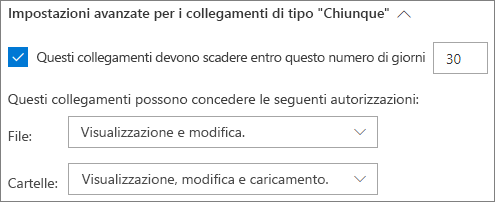
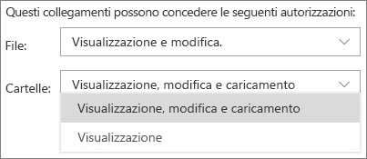
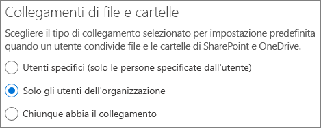
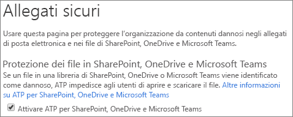

# Procedure consigliate per la condivisione di file e cartelle con utenti non autenticati

La condivisione non autenticata (collegamenti *Chiunque*) può essere comoda e utile in diversi scenari. I collegamenti *Chiunque* sono il modo più semplice per condividere: il collegamento può essere aperto senza autenticazione e passato ad altre persone.

In genere, non tutto il contenuto di un'organizzazione è adatto alla condivisione non autenticata. Questo articolo illustra le opzioni disponibili per la creazione di un ambiente in cui gli utenti possano condividere file e cartelle senza autenticazione e in cui siano implementate misure di sicurezza per proteggere il contenuto dell'organizzazione.

> [!NOTE]
> Affinché la condivisione non autenticata funzioni, è necessario abilitarla per l'organizzazione e per il singolo sito o team che si userà. Vedere [Collaborazione con persone esterne all'organizzazione](collaborating-with-people-outside-your-organization.md) per lo scenario da abilitare.

## Impostare una data di scadenza per i collegamenti Chiunque

Spesso i file vengono archiviati in siti, gruppi e team per lunghi periodi di tempo. A volte esistono criteri di conservazione dei dati che richiedono la conservazione dei file per anni. Se tali file vengono condivisi con persone non autenticate, potrebbero verificarsi accessi imprevisti o modifiche ai file in futuro. Per limitare questa possibilità, è possibile configurare una data di scadenza per i collegamenti *Chiunque*.

Quando un collegamento *Chiunque* scade, non può più essere utilizzato per accedere al contenuto.

Per impostare una data di scadenza per i collegamenti Chiunque
1. Aprire l'interfaccia di amministrazione di SharePoint Online.
2. Nel riquadro di spostamento sinistro fare clic su **Condivisione**.
3. In **Impostazioni avanzate per i collegamenti di tipo "Chiunque"** selezionare la casella di controllo **Questi collegamenti devono scadere entro questo numero di giorni**. 
   
4. Digitare un numero di giorni nella casella, quindi fare clic su **Salva**.

Tenere presente che dopo la scadenza di un collegamento *Chiunque*, è possibile condividere nuovamente il file o la cartella con un nuovo collegamento *Chiunque*.

## Impostare le autorizzazioni per i collegamenti

Per impostazione predefinita, i collegamenti *Chiunque* per un file consentono di modificare il file, mentre i collegamenti *Chiunque* per una cartella consentono di modificare e visualizzare i file, nonché di caricare nuovi file nella cartella. È possibile impostare le autorizzazioni di sola visualizzazione per i file e le cartelle in modo indipendente.

Se si vuole consentire la condivisione senza autenticazione, ma si teme che il contenuto dell'organizzazione venga modificato da utenti non autenticati, è consigliabile impostare le autorizzazioni per i file e le cartelle su **Visualizzazione**.

Per impostare le autorizzazioni per i collegamenti Chiunque
1. Aprire l'interfaccia di amministrazione di SharePoint Online.
2. Nel riquadro di spostamento sinistro fare clic su **Condivisione**.
3. In **Impostazioni avanzate per i collegamenti di tipo "Chiunque"** selezionare le autorizzazioni per i file e le cartelle da usare. 
   

Con i collegamenti *Chiunque* impostati su **Visualizzazione**, è comunque possibile condividere file e cartelle con utenti guest e assegnare loro le autorizzazioni di modifica utilizzando i collegamenti *Persone specifiche*. Questi collegamenti richiedono l'autenticazione come guest da parte delle persone esterne all'organizzazione e consentono di tenere traccia e controllare le attività di tali utenti sulle cartelle e sui file condivisi.

## Impostare il tipo di collegamento predefinito in modo che funzioni solo per le persone dell'organizzazione

Quando per l'organizzazione è abilitata la condivisione di tipo *Chiunque*, il collegamento di condivisione predefinito è generalmente impostato su **Chiunque**. Può essere comodo per gli utenti, ma può aumentare il rischio di condivisione non autenticata involontaria. Se un utente dimentica di cambiare il tipo di collegamento durante la condivisione di un documento sensibile, potrebbe accidentalmente creare un collegamento di condivisione che non richiede l'autenticazione.

È possibile ridurre questo rischio modificando l'impostazione predefinita per il collegamento su un collegamento che funziona solo per le persone interne all'organizzazione. Gli utenti che vogliono condividere con persone non autenticate dovranno selezionare specificamente tale opzione.

Per impostare il collegamento di condivisione di file e cartelle predefinito
1. Nella parte sinistra dell'interfaccia di amministrazione di SharePoint, fare clic su **Condivisione**.
2. In **Collegamenti di file e cartelle** selezionare **Solo gli utenti dell'organizzazione**. 
   
3. Fare clic su **Salva**.

## Proteggere l'ambiente dai file dannosi

Se si consente agli utenti anonimi di caricare file, aumenta il rischio che venga caricato un file dannoso. In Microsoft 365 è possibile usare la funzionalità *allegati sicuri* in Advanced Threat Protection per analizzare automaticamente i file caricati e mettere in quarantena i file che risultano non sicuri.

Per attivare gli allegati sicuri
1. Aprire l'interfaccia di amministrazione di [Sicurezza Microsoft 365](https://security.microsoft.com).
2. Nel riquadro di spostamento sinistro fare clic su **Criteri**.
3. In **Protezione dalle minacce** fare clic su **Allegati sicuri ATP (Office 365)**.
4. Selezionare la casella di controllo **Attiva ATP per SharePoint, OneDrive e Microsoft Teams**, quindi fare clic su **Salva**. 
   

## Aggiungere informazioni sul copyright ai file

Se si usano le etichette di riservatezza nell'interfaccia di amministrazione di Conformità Microsoft 365, è possibile configurare le etichette in modo da aggiungere automaticamente una filigrana, un'intestazione o un piè di pagina ai documenti di Office dell'organizzazione. In questo modo, è possibile assicurarsi che i file condivisi contengano informazioni sul copyright o altre informazioni sulla proprietà.

Per aggiungere un piè di pagina a un file con etichetta
1. Aprire l'interfaccia di amministrazione di [Conformità Microsoft 365](https://compliance.microsoft.com).
2. Nel riquadro di spostamento sinistro, in **Classificazione**, fare clic su **Etichette di riservatezza**.
3. Fare clic sull'etichetta che si vuole usare per aggiungere un piè di pagina e quindi fare clic su **Modifica etichetta**.
4. Fare clic sulla scheda **Contrassegno contenuti**, quindi attivare** **il contrassegno dei contenuti.
5. Selezionare la casella di controllo relativa al tipo di testo da aggiungere e quindi fare clic su **Personalizza testo**.
6. Digitare il testo da aggiungere ai documenti, selezionare le opzioni desiderate per il testo e quindi fare clic su **Salva**. 
   
7. Fare clic su **Salva**, quindi fare clic su **Chiudi**.

Quando è abilitato il contrassegno del contenuto per l'etichetta, il testo specificato verrà aggiunto ai documenti di Office quando un utente applica tale etichetta.

## Vedere anche

[Panoramica delle etichette di riservatezza](https://docs.microsoft.com/Office365/SecurityCompliance/sensitivity-labels)

[Limitare l'esposizione accidentale ai file durante la condivisione con gli utenti guest](sharing-limit-accidental-exposure.md)

[Creare un ambiente di condivisione guest sicuro](create-a-secure-guest-sharing-environment.md)