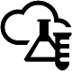

# Test Lab Guide (TLG) di adozione cloud

 **Riepilogo:** Utilizzare questi adozione cloud guide dei laboratori di testing (laboratori) per impostare le demo prova di prova o gli ambienti di sviluppo e di testing per Office 365, mobilità aziendale + sicurezza (EMS), Dynamics 365 e i prodotti Server di Office.
  
Laboratori trovare rapidamente informazioni sui prodotti Microsoft. Fantastica per situazioni in cui è necessario valutare una configurazione o tecnologia prima di decidere se la soluzione migliore per consentire o prima che si implementarlo anche agli utenti. L'esperienza pratica "basa fuori personale e funzionamento" consente di comprendere i requisiti di distribuzione di un nuovo prodotto o una soluzione in modo da pianificare migliori per l'hosting nell'ambiente di produzione.
  
Queste guide permettono di creare anche ambienti appositi per lo sviluppo e al testing delle applicazioni, noti anche con il nome di ambienti dev/test.
  

  
Prima di approfondire ulteriormente, vedere le risorse aggiuntive:
  
- Consente di visualizzare la sessione di Microsoft Virtual Academy [esperienza Microsoft Cloud con guide dei laboratori di testing adozione Cloud](https://mva.microsoft.com/en-US/training-courses/experience-the-microsoft-cloud-with-cloud-adoption-test-lab-guides-17960?l=LXNRdhSLE_1000115881 ) (solo 22 minuti).
    
- Fare clic [qui](http://aka.ms/catlgstack) per consultare una mappa di tutti gli articoli relativi alla guida del laboratorio di testing cloud di One Microsoft.
    
## Ambiente di sviluppo/test di Office 365

Fare riferimento a questi articoli per creare un ambiente di sviluppo/testing di Office 365:
  
- [Ambiente di sviluppo/test della configurazione di base](base-configuration-dev-test-environment.md)
    
    Creare una Intranet semplice all'interno dei servizi dell'infrastruttura Microsoft Azure. Si tratta di un passaggio facoltativo, da eseguire per creare una configurazione aziendale simulata.
    
- [Ambiente di sviluppo/test di Office 365](office-365-dev-test-environment.md)
    
    Creare una sottoscrizione di prova Office 365 Enterprise E5, è possibile eseguire dal computer o da una intranet semplificata in esecuzione in servizi di infrastruttura.
    
- [DirSync per l'ambiente di sviluppo/test di Office 365](dirsync-for-your-office-365-dev-test-environment.md)
    
    Installare e configurare Azure AD Connect per la sincronizzazione della directory con sincronizzazione della password. Si tratta di un passaggio facoltativo, da eseguire per creare una configurazione aziendale simulata.
    
Per l'ambiente di sviluppo e di testing di Office 365, utilizzare questi articoli per illustrare le caratteristiche enterprise di Office 365:
  
- [Autenticazione a più fattori per l'ambiente di sviluppo e di testing di Office 365](multi-factor-authentication-for-your-office-365-dev-test-environment.md)
    
    Configurare e testare l'autenticazione secondaria utilizzando un SMS inviato al proprio smartphone per un account della sottoscrizione a Office 365.
    
- [Identità federata per l'ambiente di sviluppo/test di Office 365](federated-identity-for-your-office-365-dev-test-environment.md)
    
    Configurare e mostrare l'autenticazione federata con gli account di un dominio Windows Server Active Directory.
    
- [Cloud App Security per l'ambiente di sviluppo/test di Office 365](cloud-app-security-for-your-office-365-dev-test-environment.md)
    
    Configurare e dimostrare l'utilizzo di Office 365 Cloud App protezione, che consente di creare criteri per monitorare e informano l'utente delle attività potenzialmente dannoso nella sottoscrizione a Office 365.
    
- [Protezione avanzata dalle minacce per l'ambiente di sviluppo/test di Office 365](advanced-threat-protection-for-your-office-365-dev-test-environment.md)
    
    Configurare e mostrare Advanced Threat Protection, una funzionalità di Exchange Online Protection (EOP) che consente di bloccare il malware nei messaggi di posta elettronica.
    
- [EDiscovery avanzate per l'ambiente di sviluppo e di testing di Office 365](advanced-ediscovery-for-your-office-365-dev-test-environment.md)
    
    Aggiungere dati di esempio e mostrare Advanced eDiscovery che permette di trovare e analizzare rapidamente i dati archiviati in Office 365, ad esempio, e-mail e documenti.
    
- [Protezione dei file riservati nell'ambiente di sviluppo e di testing di Office 365](sensitive-file-protection-in-the-office-365-dev-test-environment.md)
    
    mostrare come è possibile usare Information Rights Management di Office 365 per proteggere i dati di documenti sensibili, anche quando vengono pubblicati per errore nella cartella sbagliata.
    
- [Classificazione dei dati ed etichette nell'ambiente di sviluppo e di testing di Office 365](data-classification-and-labeling-in-the-office-365-dev-test-environment.md)
    
    Viene illustrato come utilizzare il client di Azure Information Protection (AIP) per classificare i documenti con diversi livelli di protezione.
    
- [Ambiente isolato di sviluppo e di testing di sito del team SharePoint Online](isolated-sharepoint-online-team-site-dev-test-environment.md)
    
    Viene illustrato come creare un sito del team SharePoint Online isolato dal resto dell'organizzazione per le risorse altamente riservati.
    
## Ambiente di sviluppo e di testing di Microsoft 365 Enterprise

Creare un ambiente di sviluppo e di testing per scenari [Aziendali 365 Microsoft](https://docs.microsoft.com/microsoft-365-enterprise/) con questi articoli:
  
- [L'ambiente di sviluppo e di testing Microsoft 365 Enterprise](the-microsoft-365-enterprise-dev-test-environment.md)
    
    Creare l'ambiente iniziale che include Office 365 E5, EMS E5 e un computer che esegue Windows 10 Enterprise.
    
- [Criteri MAM per l'ambiente di sviluppo e di testing Microsoft 365 Enterprise](mam-policies-for-your-microsoft-365-enterprise-dev-test-environment.md)
    
    Creare gruppi utente e criteri di gestione di applicazioni mobili per dispositivi iOS e Android.
    
- [Registrare iOS e dispositivi Android nell'ambiente di sviluppo e di testing Microsoft Enterprise 365](enroll-ios-and-android-devices-in-your-microsoft-enterprise-365-dev-test-environ.md)
    
    Registrare dispositivi iOS e Android e gestirli in remoto.
    
## Ambiente di sviluppo/testing di Office 365 e Dynamics 365

Aggiungere una sottoscrizione di prova a Dynamics 365 e testare le funzionalità e gli scenari integrati di Office 365 e Dynamics 365 con questi articoli:
  
- [Ambiente di sviluppo/test di Office 365 e Dynamics 365](office-365-and-dynamics-365-dev-test-environment.md)
    
    Aggiungere una sottoscrizione di prova a Dynamics 365 e licenze di Dynamics 365, nonché autorizzazioni ai propri account utente.
    
- [Integrazione di Exchange Online per l'ambiente di sviluppo e di testing Dynamics 365 e Office 365](exchange-online-integration-for-your-office-365-and-dynamics-365-dev-test-enviro.md)
    
    Configurare e quindi effettuare una dimostrazione di Office 365 e Dynamics 365 interazione tra le cassette postali di Exchange Online.
    
## Ambiente di sviluppo/test One Microsoft Cloud

Creare un ambiente di sviluppo e di testing che includa tutte le offerte di Microsoft cloud: Office 365, Azure, EMS e Dynamics 365. Per istruzioni dettagliate, vedere [l'ambiente di sviluppo e di testing Cloud Microsoft uno](the-one-microsoft-cloud-dev-test-environment.md) .
  
## Ambienti di sviluppo/testing cross-premise simulati

È possibile creare un ambiente di sviluppo/testing cross-premise, che include una rete virtuale di Azure e una rete locale simulata, facendo riferimento ai seguenti articoli:
  
- [Rete virtuale simulato tra locali in Azure](simulated-cross-premises-virtual-network-in-azure.md)
    
    Creare una Intranet simulata e connessa alla rete virtuale di Azure in una configurazione cloud ibrida.
    
- [Server di SharePoint Intranet 2016 nell'ambiente di sviluppo e di testing Azure](https://technet.microsoft.com/library/mt806351%28v=office.16%29.aspx)
    
    Creare una farm a server singolo di SharePoint Server 2016 nella rete virtuale di Azure e testare la connettività e l'amministrazione dalla rete simulata locale.
    
## Altri ambienti di sviluppo/testing basati su cloud

Di seguito sono riportati altri ambienti di sviluppo/testing basati su cloud che è possibile creare nei servizi di infrastruttura di Azure:
  
- [Ambiente di sviluppo e di testing SharePoint Server 2016 in Azure](https://technet.microsoft.com/library/mt723354.aspx)
    
    Creare una farm a singolo server di SharePoint Server 2016 nei servizi di infrastruttura di Azure.
    
- [Ambiente di sviluppo e di testing 2016 Exchange in Azure](https://technet.microsoft.com/library/mt733070%28v=exchg.160%29.aspx)
    
    Creare un server singolo di Exchange 2016 nei servizi di infrastruttura di Azure.
    
- [Ambienti di sviluppo e di testing di SharePoint Server 2013 in Azure](http://technet.microsoft.com/library/165de4d5-8fe6-4fbb-a15b-39a8b0a0eb23.aspx)
    
    Creare farm di base e a disponibilità elevata di SharePoint Server 2013 nei servizi di infrastruttura di Azure.
    
**Partecipare alla discussione**

|**Contattaci**|**Descrizione**|
|:-----|:-----|
|**Ottenere la soluzione necessaria**   |Microsoft sta creando documenti contenenti soluzioni che fanno riferimento a numerosi prodotti e servizi. Fornire commenti e suggerimenti sulle soluzioni tra server proposte o richiedere una soluzione specifica inviando un'e-mail all'indirizzo [MODAcontent@microsoft.com](mailto:cloudadopt@microsoft.com?Subject=[Cloud%20Adoption%20Content%20Feedback]:%20).  |
|**Partecipare alla discussione sulle soluzioni**   |Se si è appassionati di soluzioni basate sul cloud, prendere in considerazione l'idea di accedere al Cloud Adoption Advisory Board (CAAB) per connettersi con una community più ampia e vivace di sviluppatori di contenuti Microsoft, professionisti del settore e clienti di tutto il mondo. Per accedervi, diventare un membro dell'[area CAAB (Cloud Adoption Advisory Board)](https://aka.ms/caab) della Community tecnica Microsoft e inviare una breve e-mail all'indirizzo [CAAB@microsoft.com](mailto:caab@microsoft.com?Subject=I%20just%20joined%20the%20Cloud%20Adoption%20Advisory%20Board!). Chiunque può leggere i contenuti correlati alla community nel [blog di CAAB](https://blogs.technet.com/b/solutions_advisory_board/). Tuttavia, i membri CAAB ricevono inviti a webinar privati che descrivono le nuove soluzioni e risorse relative all'adozione del cloud.    |
|**Ottenere l'immagine visualizzata**   |Se si desidera una copia modificabile dell'immagine visualizzata in questo articolo, Microsoft si occuperà di inviarla. Inviare la propria richiesta tramite e-mail, includendo l'URL e il titolo dell'immagine, all'indirizzo [cloudadopt@microsoft.com](mailto:cloudadopt@microsoft.com?subject=[Art%20Request]:%20).    |
   
## Vedere anche

[Adozione del cloud e soluzioni ibride](cloud-adoption-and-hybrid-solutions.md)
  
[Risorse sull'architettura IT del cloud Microsoft](microsoft-cloud-it-architecture-resources.md)
  
[Modelli architetturali per SharePoint, Exchange, Skype for Business e Lync](architectural-models-for-sharepoint-exchange-skype-for-business-and-lync.md)
  
[Soluzioni ibride](hybrid-solutions.md)

