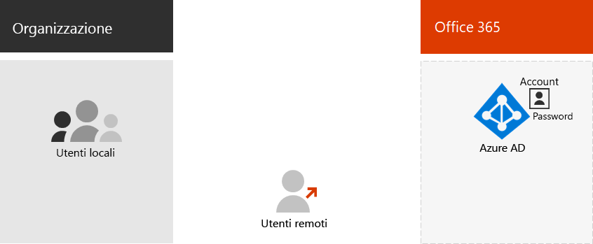

# Identità solo cloud di Office 365

*Questo articolo si applica sia a Office 365 Enterprise che a Microsoft 365 Enterprise*.

Con l'identità solo cloud, tutti gli utenti, i gruppi e i contatti vengono archiviati nel tenant di Azure Active Directory (Azure AD) dell'abbonamento a Office 365. Ecco i componenti di base dell'identità solo cloud.
 

Gli utenti e i loro account utente nelle organizzazioni possono essere categorizzati in vari modi. Ad esempio, alcuni sono dipendenti e hanno uno stato permanente. Alcuni sono fornitori, appaltatori o partner che hanno uno stato temporaneo. Alcuni sono utenti esterni che non dispongono di account utente, ma è comunque necessario concedere l'accesso a servizi e risorse specifici per supportare l'interazione e la collaborazione. Ad esempio:

- Gli account tenant rappresentano gli utenti all'interno dell'organizzazione con la licenza per i servizi cloud

- Gli account business to business (B2B) rappresentano gli utenti esterni all'organizzazione che invitano a partecipare alla collaborazione per fare il punto sui tipi di utenti dell'organizzazione. Quali sono i raggruppamenti? Ad esempio, è possibile raggruppare gli utenti in base alla funzione o allo scopo di alto livello dell'organizzazione.

Inoltre, alcuni servizi cloud possono essere condivisi al di fuori dell'organizzazione senza alcun account utente. È necessario identificare anche questi gruppi di utenti.

È possibile utilizzare i gruppi in Azure AD per diversi scopi che semplificano la gestione dell'ambiente cloud. Ad esempio, con i gruppi di Azure AD, è possibile:

- Utilizzo delle licenze basate su gruppo per assegnare le licenze per Office 365 agli account utente automaticamente non appena vengono aggiunti.
- Aggiungere account utente a gruppi specifici in modo dinamico in base agli attributi dell'account utente, come per esempio il reparto.
- Effettuare automaticamente il provisioning degli utenti per le applicazioni Software as a Service (SaaS) e proteggere l'accesso a tali applicazioni con l'autenticazione a più fattori e altre regole di accesso condizionale.
- Provisioning delle autorizzazioni e dei livelli di accesso per i siti del team di SharePoint Online.

È possibile creare nuovi ***utenti*** con:

- [L'interfaccia di amministrazione di Microsoft 365](https://docs.microsoft.com/office365/admin/add-users/add-users)
- [PowerShell di Office 365](https://docs.microsoft.com/office365/enterprise/powershell/create-user-accounts-with-office-365-powershell)

È possibile creare nuovi ***gruppi*** con:

- [L'interfaccia di amministrazione di Microsoft 365](https://docs.microsoft.com/office365/admin/create-groups/create-groups)
- [PowerShell di Office 365](https://docs.microsoft.com/office365/enterprise/powershell/manage-office-365-groups-with-powershell)

## Passaggio successivo per le identità solo cloud

[Assegnare licenze agli account utente](assign-licenses-to-user-accounts.md).
