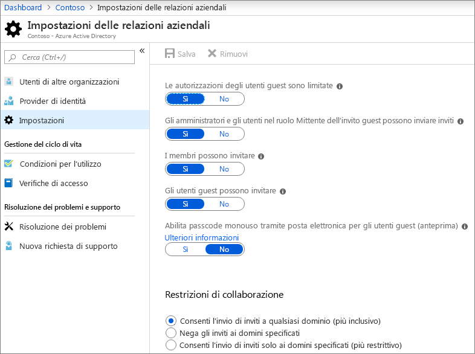
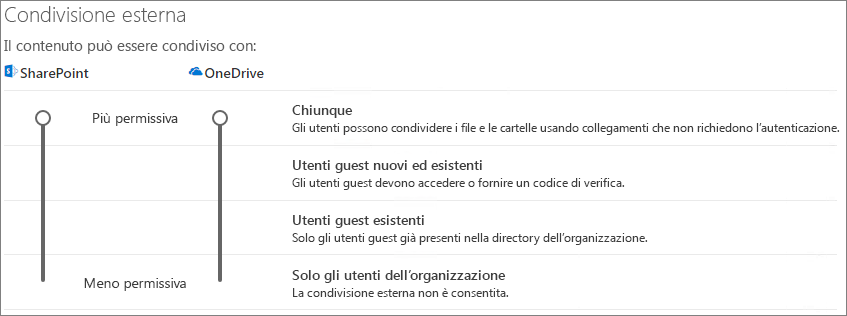
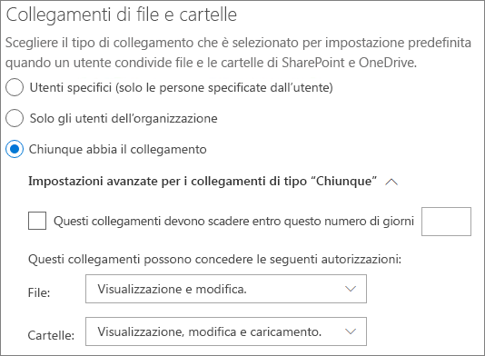
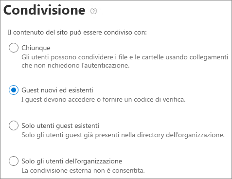

# Collaborare con gli utenti guest a un documentoCollaborate with guests on a document

Se è necessario collaborare con utenti esterni all'organizzazione nei documenti di SharePoint o OneDrive, è possibile inviare un collegamento di condivisione al documento.If you need to collaborate with people outside your organization on documents in SharePoint or OneDrive, you can send them a sharing link to the document. In questo articolo verranno illustrati i passaggi di configurazione di Microsoft 365 necessari per configurare i collegamenti di condivisione per SharePoint e OneDrive per le esigenze dell'organizzazione.In this article, we'll walk through the Microsoft 365 configuration steps necessary to set up sharing links for SharePoint and OneDrive for the needs of your organization.

## Dimostrazione videoVideo demonstration

In questo video vengono illustrati i passaggi di configurazione descritti in questo documento.This video shows the configuration steps described in this document. 

> [!VIDEO https://www.microsoft.com/videoplayer/embed/RE450Vt?autoplay=false]

## Impostazioni delle relazioni organizzative di AzureAzure Organizational relationships settings

La condivisione in Microsoft 365 è regolata al livello più alto dalle impostazioni delle relazioni organizzative in Azure Active Directory.Sharing in Microsoft 365 is governed at its highest level by the organizational relationships settings in Azure Active Directory. Se la condivisione Guest è disabilitata o limitata in Azure AD, queste verranno sostituite da tutte le impostazioni di condivisione configurate in Microsoft 365.If guest sharing is disabled or restricted in Azure AD, this will override any sharing settings that you configure in Microsoft 365.

Controllare le impostazioni delle relazioni organizzative per garantire che la condivisione con gli ospiti non sia bloccata.Check the organizational relationships settings to ensure that sharing with guests is not blocked.

Per impostare le impostazioni delle relazioni organizzativeTo set organizational relationship settings

1. Accedere a Microsoft Azure all'indirizzo [https://portal.azure.com](https://portal.azure.com).Log in to Microsoft Azure at [https://portal.azure.com](https://portal.azure.com).
2. Nel riquadro di spostamento a sinistra, fare clic su **Azure Active Directory**.In the left navigation, click **Azure Active Directory**.
3. Nel riquadro **Panoramica** fare clic su **relazioni organizzative**.In the **Overview** pane, click **Organizational relationships**.
4. Nel riquadro **relazioni organizzative** fare clic su **Impostazioni**.In the **Organizational relationships** pane, click **Settings**.
5. Verificare che **gli amministratori e gli utenti del ruolo invitato ospite possano invitare** e che **i membri possano invitare** siano entrambi impostati su **Sì**.Ensure that **Admins and users in the guest inviter role can invite** and **Members can invite** are both set to **Yes**.
6. Se si apportano modifiche, fare clic su **Salva**.If you made changes, click **Save**.

Prendere nota delle impostazioni nella sezione **vincoli di collaborazione** .Note the settings in the **Collaboration restrictions** section. Verificare che i domini degli utenti con cui si desidera collaborare non siano bloccati.Make sure that the domains of the guests that you want to collaborate with aren't blocked.

## Impostazioni di condivisione a livello di organizzazione di SharePointSharePoint organization level sharing settings

Affinché gli utenti esterni all'organizzazione abbiano accesso a un documento in SharePoint o OneDrive, le impostazioni di condivisione a livello di organizzazione di SharePoint e OneDrive devono consentire la condivisione con utenti esterni all'organizzazione.In order for people outside your organization to have access to a document in SharePoint or OneDrive, the SharePoint and OneDrive organization-level sharing settings must allow for sharing with people outside your organization.

Le impostazioni a livello di organizzazione per SharePoint determinano le impostazioni disponibili per i singoli siti di SharePoint.The organization-level settings for SharePoint determine what settings are available for individual SharePoint sites. Le impostazioni del sito non possono essere più permissive rispetto alle impostazioni a livello di organizzazione.Site settings cannot be more permissive than the organization-level settings. L'impostazione a livello di organizzazione per OneDrive determina il livello di condivisione disponibile nelle raccolte OneDrive degli utenti.The organization-level setting for OneDrive determines what level of sharing is available in users' OneDrive libraries.

Per SharePoint e OneDrive, se si desidera consentire la condivisione di file e cartelle non autenticata, scegliere **nessuno**.For SharePoint and OneDrive, if you want to allow unauthenticated file and folder sharing, choose **Anyone**. Se si desidera garantire che gli utenti esterni all'organizzazione debbano eseguire l'autenticazione, scegliere **clienti nuovi ed esistenti**.If you want to ensure that people outside your organization have to authenticate, choose **New and existing guests**. *Tutti* i collegamenti sono il modo più semplice per condividere: gli utenti esterni all'organizzazione possono aprire il collegamento senza l'autenticazione e sono liberi di passarlo ad altri utenti.*Anyone* links are the easiest way to share: people outside your organization can open the link without authentication and are free to pass it on to others.

Per SharePoint, scegliere l'impostazione più permissiva che sarà necessaria per qualsiasi sito dell'organizzazione.For SharePoint, choose the most permissive setting that will be needed by any site in your organization.

Per impostare le impostazioni di condivisione a livello di organizzazione di SharePointTo set SharePoint organization level sharing settings

1. Nell'interfaccia di amministrazione di Microsoft 365, nella barra di spostamento a sinistra, in interfaccia di **Amministrazione**, fare clic su **SharePoint**.In the Microsoft 365 admin center, in the left navigation, under **Admin centers**, click **SharePoint**.
2. Nella parte sinistra dell'interfaccia di amministrazione di SharePoint, fare clic su **Condivisione**.In the SharePoint admin center, in the left navigation, click **Sharing**.
3. Verificare che la condivisione esterna per SharePoint o OneDrive sia impostata su chiunque o su un **utente** **nuovo o esistente**.Ensure that external sharing for SharePoint or OneDrive is set to **Anyone** or **New and existing guests**. Si noti che l'impostazione di OneDrive non può essere più permissiva dell'impostazione di SharePoint.(Note that the OneDrive setting cannot be more permissive than the SharePoint setting.)
4. Se si apportano modifiche, fare clic su **Salva**.If you made changes, click **Save**.

## Impostazioni di collegamento predefinite a livello di organizzazione di SharePointSharePoint organization level default link settings

Le impostazioni predefinite per il collegamento di file e cartelle determinano l'opzione di collegamento visualizzata all'utente per impostazione predefinita quando condividono un file o una cartella.The default file and folder link settings determine which link option is shown to the user by default when they share a file or folder. Gli utenti possono modificare il tipo di collegamento in una delle altre opzioni prima della condivisione, se necessario.Users can change the link type to one of the other options before sharing if desired.

Tenere presente che questa impostazione influisce sui siti di SharePoint nell'organizzazione, nonché OneDrive.Keep in mind that this setting affects SharePoint sites in your organization, as well as OneDrive.

Scegliere il tipo di collegamento selezionato per impostazione predefinita quando gli utenti condividono file e cartelle:Choose the type of link that's selected by default when users share files and folders:

- **Tutti gli utenti con il collegamento** : scegliere questa opzione se si prevede di eseguire molte condivisione di file e cartelle non autenticate.**Anyone with the link** - Choose this option if you expect to do a lot of unauthenticated file and folder sharing. Se si desidera consentire collegamenti a *tutti gli utenti* , ma si è preoccupati per la condivisione accidentale non autenticata, prendere in considerazione una delle altre opzioni come impostazione predefinita.If you want to allow *Anyone* links but are concerned about accidental unauthenticated sharing, consider one of the other options as the default. Questo tipo di collegamento è disponibile solo se è stata abilitata la condivisione di **utenti** .This link type is only available if you've enabled **Anyone** sharing.
- **Solo persone nell'organizzazione** : scegliere questa opzione se si prevede che la maggior parte della condivisione di file e cartelle sia con le persone all'interno dell'organizzazione.**Only people in your organization** - Choose this option if you expect most file and folder sharing to be with people inside your organization.
- **Persone specifiche** : considerare questa opzione se si prevede di eseguire un sacco di condivisione di file e cartelle con gli utenti.**Specific people** - Consider this option if you expect to do a lot of file and folder sharing with guests. Questo tipo di collegamento è compatibile con gli utenti e richiede l'autenticazione.This type of link works with guests and requires them to authenticate.
 

Per impostare le impostazioni dei collegamenti predefiniti a livello di organizzazione di SharePoint e OneDriveTo set the SharePoint and OneDrive organization level default link settings

1. Passare alla pagina condivisione nell'interfaccia di amministrazione di SharePoint.Navigate to the Sharing page in the SharePoint admin center.
2. In **collegamenti a file e cartelle**selezionare il collegamento di condivisione predefinito che si desidera utilizzare.Under **File and folder links**, select the default sharing link that you want to use.
3. Se si apportano modifiche, fare clic su **Salva**.If you made changes, click **Save**.

## Impostazioni di condivisione a livello di sito di SharePointSharePoint site level sharing settings

Se si condividono file e fodlers che si trovano in un sito di SharePoint, è necessario controllare anche le impostazioni di condivisione a livello di sito per il sito.If you're sharing files and fodlers that are in a SharePoint site, you also need to check the site-level sharing settings for that site.

Per impostare le impostazioni di condivisione a livello di sitoTo set site-level sharing settings
1. Nella parte sinistra dell'interfaccia di amministrazione di SharePoint, espandere **Siti** e fare clic su **Siti attivi**.In the SharePoint admin center, in the left navigation, expand **Sites** and click **Active sites**.
2. Selezionare il sito appena creato.Select the site that you just created.
3. Sulla barra multifunzione fare clic su **Condivisione**.In the ribbon, click **Sharing**.
4. Verificare che la condivisione sia impostata su **tutti gli utenti** o **gli ospiti nuovi e esistenti**.Ensure that sharing is set to **Anyone** or **New and existing guests**.
5. Se si apportano modifiche, fare clic su **Salva**.If you made changes, click **Save**.

## Invitare gli utentiInvite users

Le impostazioni di condivisione Guest sono ora configurate, quindi gli utenti possono ora condividere file e cartelle con utenti esterni all'organizzazione.Guest sharing settings are now configured, so users can now share files and folders with people outside your organization. Per ulteriori informazioni, vedere [condivisione di file e cartelle di OneDrive](https://support.office.com/article/9fcc2f7d-de0c-4cec-93b0-a82024800c07) e [condivisione di file o cartelle di SharePoint](https://support.office.com/article/1fe37332-0f9a-4719-970e-d2578da4941c) .See [Share OneDrive files and folders](https://support.office.com/article/9fcc2f7d-de0c-4cec-93b0-a82024800c07) and [Share SharePoint files or folders](https://support.office.com/article/1fe37332-0f9a-4719-970e-d2578da4941c) for more information.

## Vedere ancheSee Also

[Procedure consigliate per la condivisione di file e cartelle con utenti non autenticatiBest practices for sharing files and folders with unauthenticated users](best-practices-anonymous-sharing.md)

[Limitare l'esposizione accidentale ai file durante la condivisione con gli utenti guestLimit accidental exposure to files when sharing with guests](sharing-limit-accidental-exposure.md)