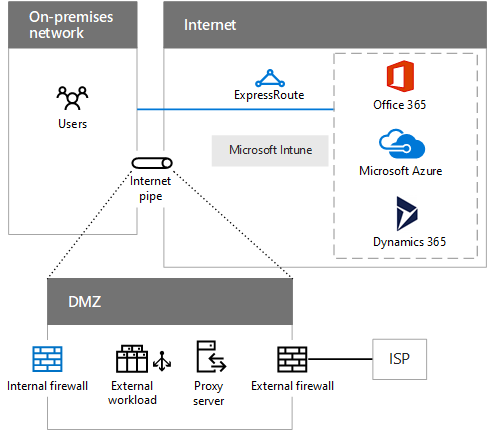

# Elementi comuni della connettività cloud MicrosoftCommon elements of Microsoft cloud connectivity

 **Riepilogo:** Informazioni su come preparare la rete e gli elementi comuni dell'infrastruttura di rete.**Summary:** Understand the common elements of networking infrastructure and how to prepare your network.
  
L'integrazione della rete con il cloud di Microsoft consente di accedere facilmente a una vasta gamma di servizi.Integrating your networking with the Microsoft cloud provides optimal access to a broad range of services.
  
## Passaggi per preparare la rete di servizi cloud MicrosoftSteps to prepare your network for Microsoft cloud services

Per la rete locale:For your on-premises network:
  
1. Analizzare i computer client e ottimizzare per l'hardware di rete, driver software, le impostazioni del protocollo e browser Internet.Analyze your client computers and optimize for network hardware, software drivers, protocol settings, and Internet browsers.
    
2. Analisi della rete locale per il traffico latenza e il routing ottimale per il dispositivo edge Internet.Analyze your on-premises network for traffic latency and optimal routing to the Internet edge device.
    
3. Analizzare le capacità e prestazioni del dispositivo edge Internet e ottimizzare per più alti livelli di traffico.Analyze the capacity and performance of your Internet edge device and optimize for higher levels of traffic.
    
Per la connessione a Internet:For your Internet connection:
  
1. Analizzare la latenza tra il dispositivo edge Internet (ad esempio, il firewall esterno) e i percorsi regionali del servizio cloud Microsoft a cui si effettua la connessione.Analyze the latency between your Internet edge device (such as your external firewall) and the regional locations of the Microsoft cloud service to which you are connecting.
    
2. Analizzare le capacità e l'utilizzo della connessione Internet corrente e, se necessario, aggiungere capacità. In alternativa, aggiungere una connessione ExpressRoute.Analyze the capacity and utilization of your current Internet connection and add capacity if needed. Alternately, add an ExpressRoute connection.
    
## Opzioni di integrazione applicativa Microsoft cloudMicrosoft cloud connectivity options

Utilizzare il canale Internet esistente o una connessione ExpressRoute a Office 365 e Azure Dynamics 365.Use your existing Internet pipe or an ExpressRoute connection to Office 365, Azure, and Dynamics 365.
  
**Figura 1: Opzioni per la connettività cloud Microsoft****Figure 1: Options for Microsoft cloud connectivity**

  
Nella figura 1 viene illustrato come una rete locale può essere connesso a offerte cloud Microsoft utilizzando la propria pipe Internet esistente o ExpressRoute. Il canale Internet rappresenta una DMZ e può avere i seguenti componenti:Figure 1 shows how an on-premises network can be connected to Microsoft cloud offerings using their existing Internet pipe or ExpressRoute. The Internet pipe represents a DMZ and can have the following components:
  
- **Firewall interno:** Barriera tra la rete attendibile e uno non attendibile. Esegue il traffico filtro (in base alle regole) e il monitoraggio.**Internal firewall:** A barrier between your trusted network and an untrusted one. Performs traffic filtering (based on rules) and monitoring.
    
- **Il carico di lavoro esterno:** Siti Web o altri carichi di lavoro rese disponibili per gli utenti esterni su Internet.**External workload:** Web sites or other workloads made available to external users on the Internet.
    
- **Server proxy:** Gestisce le richieste di contenuto web per conto degli utenti intranet. Un proxy inverso consente le richieste in ingresso non richiesto.**Proxy server:** Services requests for web content on behalf of intranet users. A reverse proxy allows unsolicited inbound requests.
    
- **Firewall esterno:** Consente il traffico in uscita e il traffico in ingresso specificato. Consente di eseguire conversione degli indirizzi.**External firewall:** Allows outbound traffic and specified inbound traffic. Can perform address translation.
    
- **Connessione WAN al provider di servizi Internet:** Una connessione basata su gestore di telefonia per un provider di servizi Internet, che peer per il routing e la connettività Internet.**WAN connection to ISP:** A carrier-based connection to an ISP, who peers with the Internet for connectivity and routing.
    
## Aree di rete comune a tutti i servizi cloud MicrosoftAreas of networking common to all Microsoft cloud services

È necessario prendere in considerazione queste aree di rete adottando uno dei servizi cloud Microsoft.You need to consider these areas of networking when adopting any of Microsoft's cloud services.
  
- **Delle prestazioni di rete intranet:** Per le risorse basate su Internet rallentamento delle prestazioni se la rete intranet, tra cui i computer client, non è ottimizzata.**Intranet performance:** Performance to Internet-based resources will suffer if your intranet, including client computers, is not optimized.
    
- **Dispositivi di server perimetrali:** Dispositivi in corrispondenza del bordo della rete sono i punti di uscita e possono includere (Network Address Translator), server proxy (inclusi i proxy inversi), i firewall, i dispositivi di rilevamento delle intrusioni o una combinazione.**Edge devices:** Devices at the edge of your network are egress points and can include Network Address Translators (NATs), proxy servers (including reverse proxies), firewalls, intrusion detection devices, or a combination.
    
- **Connessione Internet:** Connessione WAN al provider di servizi Internet e Internet dovrebbe avere sufficiente capacità per gestire i carichi di picco. È inoltre possibile utilizzare una connessione ExpressRoute.**Internet connection:** Your WAN connection to your ISP and the Internet should have enough capacity to handle peak loads. You can also use an ExpressRoute connection.
    
- **Internet DNS:** A, AAAA, CNAME, MX, PTR e altri record per individuare Microsoft cloud o i servizi ospitati nel cloud. Ad esempio, si potrebbe essere necessario un record CNAME per l'app ospitate in Azure PaaS.**Internet DNS:** A, AAAA, CNAME, MX, PTR and other records to locate Microsoft cloud or your services hosted in the cloud. For example, you might need a CNAME record for your app hosted in Azure PaaS.
    
## Vedere ancheSee Also

[Rete cloud Microsoft per Enterprise ArchitectsMicrosoft Cloud Networking for Enterprise Architects](microsoft-cloud-networking-for-enterprise-architects.md)
  
[Risorse sull'architettura IT del cloud MicrosoftMicrosoft Cloud IT architecture resources](microsoft-cloud-it-architecture-resources.md)

[Guida di orientamento del cloud aziendale Microsoft: risorse per i decision maker del settore ITMicrosoft's Enterprise Cloud Roadmap: Resources for IT Decision Makers](https://sway.com/FJ2xsyWtkJc2taRD)

