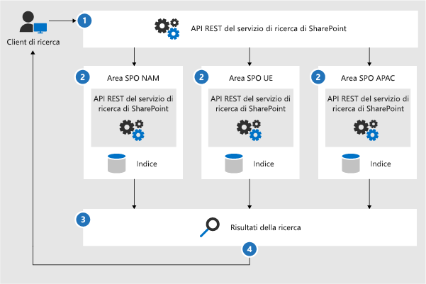
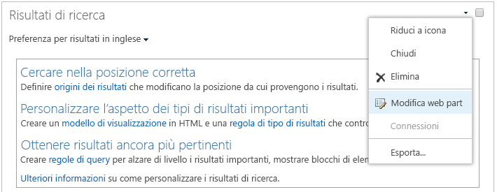

# Configurare la ricerca di Microsoft 365 Multi-GeoConfigure Search for Microsoft 365 Multi-Geo

In un ambiente multi-geografico, ogni posizione geografica ha un proprio indice di ricerca e un Centro ricerche.In a multi-geo environment, each geo location has its own search index and Search Center. Quando un utente effettua una ricerca, la query viene inviata a tutti gli indici e i risultati restituiti vengono aggregati.When a user searches, the query is fanned out to all the indexes, and the returned results are merged.

Ad esempio, un utente in una posizione geografica può cercare contenuto archiviato in un'altra posizione geografica o il contenuto di un sito di SharePoint che è limitato a una posizione geografica diversa.For example, a user in one geo location can search for content stored in another geo location, or for content on a SharePoint site that's restricted to a different geo location. Se l'utente ha accesso a tale contenuto, la ricerca mostrerà il risultato.If the user has access to this content, search will show the result.

## Quali client di ricerca funzionano in un ambiente multi-geografico?Which search clients work in a multi-geo environment?

Questi client possono restituire i risultati di tutte le posizioni geografiche:These clients can return results from all geo locations:

-   OneDrive for BusinessOneDrive for Business

-   DelveDelve

-   Home page di SharePointThe SharePoint home page

-   Centro ricercheThe Search Center

-   Applicazioni di ricerca personalizzate che utilizzano l'API del servizio di ricerca di SharePointCustom search applications that use the SharePoint Search API

### OneDrive for BusinessOneDrive for Business

Non appena viene configurato l'ambiente multi-geografico, gli utenti che cercano in OneDrive ottengono i risultati di tutte le posizioni geografiche.As soon as the multi-geo environment has been set up, users that search in OneDrive get results from all geo locations.

### DelveDelve

Non appena viene configurato l'ambiente multi-geografico, gli utenti che cercano in Delve ottengono risultati da tutte le posizioni geografiche.As soon as the multi-geo environment has been set up, users that search in Delve get results from all geo locations.

Il feed di Delve e la scheda profilo mostrano solo le anteprime dei file archiviati in una posizione centrale.The Delve feed and the profile card only show previews of files that are stored in the central location. Per i file archiviati nelle posizioni satellite, verrà visualizzata l'icona del tipo di file.For files that are stored in satellite locations, the icon for the file type is shown instead.

### Home page di SharePointThe SharePoint home page

Non appena l'ambiente multi-geografico viene configurato, gli utenti possono vedere le notizie, i siti recenti e i siti seguiti di posizioni geografiche diverse nella propria home page di SharePoint. Se usano la casella di ricerca nella home page di SharePoint, aggregheranno tutti i risultati delle posizioni geografiche.As soon as the multi-geo environment has been set up, users will see news, recent and followed sites from multiple geo locations on their SharePoint home page. If they use the search box on the SharePoint home page, they'll get merged results from multiple geo locations.

### Centro ricercheThe Search Center

Dopo che l'ambiente multi-geografico viene configurato, ogni Centro ricerche continua a mostrare solo i risultati della relativa posizione geografica. Gli amministratori devono [modificare le impostazioni di ogni Centro ricerche](#_Set_up_a_1) per generare i risultati di tutte le posizioni geografiche. Successivamente gli utenti che usano il Centro ricerche potranno ottenere i risultati aggregati di tutte le posizioni geografiche.After the multi-geo environment has been set up, each Search Center continues to only show results from their own geo location. Admins must [change the settings of each Search Center](#_Set_up_a_1) to get results from all geo locations. Afterwards, users that search in the Search Center get results from all geo locations.

### Applicazioni di ricerca personalizzateCustom search applications

In genere, le applicazioni di ricerca personalizzate interagiscono con le API REST del servizio di ricerca di SharePoint esistenti. Per ottenere risultati di tutte le posizioni geografiche o solo di alcune, l'applicazione deve [chiamare l'API e includere i nuovi parametri di query Multi-Geo](#_Get_custom_search) nella richiesta. In questo modo, la query viene estesa a tutte le posizioni geografiche.As usual, custom search applications interact with the search indexes by using the existing SharePoint Search REST APIs. To get results from all, or some geo locations, the application must [call the API and include the new Multi-Geo query parameters](#_Get_custom_search) in the request. This triggers a fan out of the query to all geo locations.

## In che modo la ricerca è diversa in un ambiente multi-geografico?What's different about search in a multi-geo environment?

Alcune delle funzionalità di ricerca già note potrebbero funzionare diversamente in un ambiente multi-geografico.Some search features you might be familiar with, work differently in a multi-geo environment.

<table>
<thead>
<tr class="header">
<th align="left"><strong>Funzionalità</strong><strong>Feature</strong></th>
<th align="left"><strong>Come funziona</strong><strong>How it works</strong></th>
<th align="left"><strong>Soluzione</strong><strong>Workaround</strong></th>
</tr>
</thead>
<tbody>
<tr class="odd">
<td align="left">Risultati evidenziatiPromoted results</td>
<td align="left">È possibile creare regole di query con risultati promossi a diversi livelli: per l'intero tenant, per una raccolta siti o per un sito.You can create query rules with promoted results at different levels: for the whole tenant, for a site collection, or for a site. In un ambiente multi-geo definire i risultati promossi a livello di tenant, per promuovere i risultati nei Centri ricerche di tutte le posizioni geografiche.In a multi-geo environment, define promoted results at the tenant level to promote the results to the Search Centers in all geo locations. Se si desidera soltanto convertire i risultati nel Centro ricerche che si trova nella posizione geografica della raccolta siti o del sito, definire i risultati promossi a livello della raccolta siti o del sito.If you only want to promote results in the Search Center that's in the geo location of the site collection or site, define the promoted results at the site collection or site level. Questi risultati non sono promossi in altre posizioni geografiche.These results are not promoted in other geo locations.</td>
<td align="left">Se non sono necessari diversi risultati evidenziati per ogni posizione geografica, ad esempio direttive diverse per le trasferte di lavoro, è consigliabile definire i risultati evidenziati a livello di tenant.If you don't need different promoted results per geo location, for example different rules for traveling, we recommend defining promoted results at the tenant level.</td>
</tr>
<tr class="even">
<td align="left">Criteri di affinamento ricercaSearch refiners</td>
<td align="left">La ricerca restituisce i criteri di affinamento di tutte le posizioni geografiche di un tenant e poi li aggrega. L'aggregazione è approssimativa e viene eseguita secondo il principio "best effort", quindi i conteggi dei criteri di affinamento potrebbero non essere precisi. Per la maggior parte degli scenari di ricerca questo livello di approssimazione è sufficiente. Search returns refiners from all the geo locations of a tenant and then aggregates them. The aggregation is a best effort, meaning that the refiner counts might not be 100% accurate. For most search-driven scenarios, this accuracy is sufficient. </td>
<td align="left">Per le applicazioni basate sulla ricerca che richiedono criteri di affinamento precisi, è necessario inviare la query separatamente a ogni posizione geografica.For search-driven applications that depend on refiner completeness, query each geo location independently.</td>
</tr>
<tr class="odd">
<td align="left"></td>
<td align="left">La ricerca multi-geografica non supporta il bucket di criteri di affinamento numerici.Multi-geo search doesn't support dynamic bucketing for numerical refiners.</td>
<td align="left">Utilizzare il <a href="https://docs.microsoft.com/sharepoint/dev/general-development/query-refinement-in-sharepoint">parametro "Discretize"</a> per criteri di affinamento numerici.Use the <a href="https://docs.microsoft.com/sharepoint/dev/general-development/query-refinement-in-sharepoint">“Discretize” parameter</a> for numerical refiners.</td>
</tr>
<tr class="even">
<td align="left">ID documentiDocument IDs</td>
<td align="left">Se si decide di sviluppare un'applicazione basata sulla ricerca che usa gli ID dei documenti, occorre tenere presente che tali ID non sono univoci nell'intero ambiente multi-geografico, ma solo all'interno di una singola posizione geografica.If you're developing a search-driven application that depends on document IDs, note that document IDs in a multi-geo environment aren't unique across geo locations, they are unique per geo location.</td>
<td align="left">È stata aggiunta una colonna che identifica la posizione geografica.We've added a column that identifies the geo location. Usare questa colonna per ottenere l'univocità.Use this column to achieve uniqueness. Questa colonna è denominata "GeoLocationSource".This column is named “GeoLocationSource”.</td>
</tr>
<tr class="odd">
<td align="left">Numero di risultatiNumber of results</td>
<td align="left">La pagina dei risultati della ricerca mostra i risultati combinati ottenuti dalle posizioni geografiche, ma non è possibile includere più di 500 risultati.The search results page shows combined results from the geo locations, but it's not possible to page beyond 500 results.</td>
<td align="left"></td>
</tr>
<tr class="even">
<td align="left">Ricerca ibridaHybrid search</td>
<td align="left">In un ambiente SharePoint ibrido con <a href="https://docs.microsoft.com/sharepoint/hybrid/learn-about-cloud-hybrid-search-for-sharepoint">Ricerca ibrida nel cloud</a>, il contenuto locale viene aggiunto all'indice di Microsoft 365 della posizione centrale.In a hybrid SharePoint environment with <a href="https://docs.microsoft.com/sharepoint/hybrid/learn-about-cloud-hybrid-search-for-sharepoint">cloud hybrid search</a>,  on-premises content is added to the Microsoft 365 index of the central location.</td>
<td align="left"></td>
</tr>
</tbody>
</table>

## Cosa non è supportato per la ricerca in un ambiente multi-geografico?What's not supported for search in a multi-geo environment?

Alcune delle funzionalità di ricerca già note non sono supportate in un ambiente multi-geografico.Some of the search features you might be familiar with, aren't supported in a multi-geo environment.

<table>
<thead>
<tr class="header">
<th align="left"><strong>Funzionalità di ricerca</strong><strong>Search feature</strong></th>
<th align="left"><strong>Nota</strong><strong>Note</strong></th>
</tr>
</thead>
<tbody>
<tr class="odd">
<td align="left">Autenticazione solo appApp-only authentication</td>
<td align="left">L'autenticazione solo app (accesso con privilegi dai servizi) non è supportata nella ricerca multi-geografica.App-only authentication (privileged access from services) isn't supported in multi-geo search.</td>
</tr>
<tr class="even">
<td align="left">Utenti guestGuest users</td>
<td align="left">Gli utenti guest ottengono solo i risultati della posizione geografica dove effettuano la ricerca.Guest users only get results from the geo location that they're searching from.</td>
</tr>
</tbody>
</table>

## Come funziona la ricerca in un ambiente multi-geografico?How does search work in a multi-geo environment?

Tutti i client di ricerca usano le API REST del servizio di ricerca di SharePoint per interagire con gli indici di ricerca.All the search clients use the existing SharePoint Search REST APIs to interact with the search indexes.

1. Un client di ricerca chiama l'endpoint REST Ricerca con la proprietà di query EnableMultiGeoSearch= true.A search client calls the Search REST endpoint with the query property EnableMultiGeoSearch= true.
2. La query viene inviata a tutte le posizioni geografiche del tenant.The query is sent to all geo locations in the tenant.
3. I risultati della ricerca di ogni posizione geografica vengono aggregati e classificati.Search results from each geo location are merged and ranked.
4. Il client ottiene risultati della ricerca unificati.The client gets unified search results.

Si noti che Microsoft non unisce i risultati della ricerca fino a quando non si ricevono i risultati da tutte le posizioni geografiche.Notice that we don't merge the search results until we've received results from all the geo locations. Questo significa che le ricerche multi-geo hanno una latenza maggiore rispetto alle ricerche in un ambiente che ha una sola posizione geografica.This means that multi-geo searches have additional latency compared to searches in an environment with only one geo location.

## Fare in modo che un Centro ricerche mostri i risultati di tutte le posizioni geograficheGet a Search Center to show results from all geo locations

Ogni Centro ricerche dispone di diverse verticali ed è necessario configurarle singolarmente.Each Search Center has several verticals and you have to set up each vertical individually.

1.  Assicurarsi di avere eseguito questi passaggi con un account che dispone dell'autorizzazione per modificare la pagina dei risultati della ricerca e la web part Risultati della ricerca.Ensure that you perform these steps with an account that has permission to edit the search results page and the Search Result Web Part.

2.  Andare alla pagina dei risultati della ricerca (vedere l'[elenco](https://support.office.com/article/174d36e0-2f85-461a-ad9a-8b3f434a4213) delle pagine di risultati della ricerca).Navigate to the search results page (see the [list](https://support.office.com/article/174d36e0-2f85-461a-ad9a-8b3f434a4213) of search results pages)

3.  Selezionare la verticale da configurare, fare clic sull'icona a forma di ingranaggio **Impostazioni** in alto a destra, quindi fare clic su **Modifica pagina**. La pagina dei risultati della ricerca si apre in modalità di modifica.Select the vertical to set up, click **Settings** gear icon in the upper, right corner, and then click **Edit Page**. The search results page opens in Edit mode.

     
1.  Nella web part Risultati della ricerca, spostare il puntatore sull'angolo in alto a destra della web part, fare clic sulla freccia, quindi fare clic su **Modifica web part** nel menu.  In the Search Results Web Part, move the pointer to the upper, right corner of the web part, click the arrow, and then click **Edit Web Part** on the menu. Si apre il riquadro degli strumenti della web part Risultati della ricerca sotto la barra multifunzione in alto a destra nella pagina.The Search Results Web Part tool pane opens under the ribbon in the top right of the page. 

1.  Nella riquadro degli strumenti della web part, nella sezione **Impostazioni**, in **Impostazioni controllo risultati**, selezionare **Mostra risultati Multi-Geo** affinché la web part Risultati della ricerca mostri i risultati di tutte le posizioni geografiche.In the Web Part tool pane, in the **Settings** section, under **Results control settings**, select **Show Multi-Geo results** to get the Search Results Web Part to show results from all geo locations.

2.  Fare clic su **OK** per salvare la modifica e chiudere il riquadro degli strumenti della web part.Click **OK** to save your change and close the Web Part tool pane.

3.  Verificare le modifiche apportate alla web part Risultati della ricerca facendo clic su **Controllo** nella scheda Pagina del menu principale.Check your changes to the Search Results Web Part by clicking **Check-In** on the Page tab of the main menu.

4.  Pubblicare le modifiche usando il collegamento fornito nella nota in alto nella pagina.Publish the changes by using the link provided in the note at the top of the page.

## Fare in modo che le applicazioni di ricerca personalizzate mostrino risultati di tutte o di alcune posizioni geograficheGet custom search applications to show results from all or some geo locations

Per ottenere i risultati di tutte o alcune posizioni geografiche nelle applicazioni di ricerca personalizzate, è necessario specificare i parametri di query con la richiesta all'API REST del servizio di ricerca di SharePoint. A seconda dei parametri della query, la query viene inviata a tutte le posizioni geografiche o solo ad alcune. Ad esempio, se serve inviare la query solo a un sottoinsieme di posizioni geografiche per trovare informazioni pertinenti, è possibile estendere la query solo ad esse. Se la richiesta ha esito positivo, l'API REST del servizio di ricerca di SharePoint restituisce i dati della risposta.Custom search applications get results from all, or some, geo locations by specifying query parameters with the request to the SharePoint Search REST API. Depending on the query parameters, the query is fanned out to all geo locations, or to some geo locations. For example, if you only need to query a subset of geo locations to find relevant information, you can control the fan out to only these. If the request succeeds, the SharePoint Search REST API returns response data.

**Requisito****Requirement**

Per ogni posizione geografica è necessario verificare che a tutti gli utenti dell'organizzazione sia stato concesso il livello di autorizzazioni **Lettura** per il sito Web radice, ad esempio contoso**APAC**.sharepoint.com/ e contoso**EU**.sharepoint.com/. [Informazioni sulle autorizzazioni](https://support.office.com/article/understanding-permission-levels-in-sharepoint-87ecbb0e-6550-491a-8826-c075e4859848).For each geo location, you must ensure that all users in the organization have been granted the **Read** permission level for the root website (for example contoso**APAC**.sharepoint.com/ and contoso**EU**.sharepoint.com/). [Learn about permissions](https://support.office.com/article/understanding-permission-levels-in-sharepoint-87ecbb0e-6550-491a-8826-c075e4859848).

### Parametri di queryQuery parameters

EnableMultiGeoSearch - questo è un valore Booleano che specifica se la query debba essere estesa agli indici di altre posizioni geografiche del tenant multi-geo.EnableMultiGeoSearch - This is a Boolean value that specifies whether the query shall be fanned out to the indexes of other geo locations of the multi-geo tenant. Impostare su **true** per estendere la query, su **false** per non estendere la query.Set it to **true** to fan out the query; **false** to not fan out the query. Se non si include questo parametro, il valore predefinito è **false**, tranne quando si esegue una chiamata all'API REST su un sito che usa il modello Centro ricerche organizzazione. In tal caso, il valore predefinito è **true**.If you don't include this parameter, the default value is **false**, except when making a REST API call against a site which uses the Enterprise Search Center template, in this case the default value is **true**. Se si usa questo parametro in un ambiente non multi-geografico, il parametro viene ignorato.If you use the parameter in an environment that isn't multi-geo, the parameter is ignored.

ClientType - Questa è una stringa.ClientType - This is a string. Immettere un nome univoco di client per ogni applicazione di ricerca.Enter a unique client name for each search application. Se non si include questo parametro, la query non viene estesa a diverse posizioni geografiche.If you don't include this parameter, the query is not fanned out to other geo locations.

MultiGeoSearchConfiguration - Questo è un elenco facoltativo di quali posizioni geografiche devono essere estese alla query quando **EnableMultiGeoSearch** è impostato su **true**.MultiGeoSearchConfiguration - This is an optional list of which geo locations in the multi-geo tenant to fan the query out to when **EnableMultiGeoSearch** is **true**. Se non si include questo parametro o lo si lascia vuoto, la query non viene estesa a diverse posizioni geografiche.If you don't include this parameter, or leave it blank, the query is fanned out to all geo locations. Per ogni posizione geografica, immettere quanto segue, in formato JSON:For each geo location, enter the following items, in JSON format:

<table>
<thead>
<tr class="header">
<th align="left">ElementoItem</th>
<th align="left">DescrizioneDescription</th>
</tr>
</thead>
<tbody>
<tr class="odd">
<td align="left">DataLocationDataLocation</td>
<td align="left">La posizione geografica, ad esempio NAM.The geo location, for example NAM.</td>
</tr>
<tr class="even">
<td align="left">EndPointEndPoint</td>
<td align="left">L'endpoint a cui connettersi, ad esempio https://contoso.sharepoint.comThe endpoint to connect to, for example https://contoso.sharepoint.com</td>
</tr>
<tr class="odd">
<td align="left">SourceIdSourceId</td>
<td align="left">Il GUID dell'origine dei risultati, ad esempio B81EAB55-3140-4312-B0F4-9459D1B4FFEE.The GUID of the result source, for example B81EAB55-3140-4312-B0F4-9459D1B4FFEE.</td>
</tr>
</tbody>
</table>

Se si omette DataLocation o EndPoint oppure se DataLocation è duplicato, la richiesta ha esito negativo. [È possibile ottenere informazioni sull'endpoint delle posizioni geografiche di un tenant utilizzando Microsoft Graph](https://docs.microsoft.com/sharepoint/dev/solution-guidance/multigeo-discovery).If you omit DataLocation or EndPoint, or if a DataLocation is duplicated, the request fails. [You can get information about the endpoint of a tenant's geo locations by using Microsoft Graph](https://docs.microsoft.com/sharepoint/dev/solution-guidance/multigeo-discovery).

### Dati di rispostaResponse data

MultiGeoSearchStatus - Si tratta di una proprietà che restituisce l'API Ricerca di SharePoint in risposta a una richiesta. Il valore della proprietà è una stringa e fornisce le informazioni seguenti sui risultati restituiti dall'API Ricerca di SharePoint:MultiGeoSearchStatus – This is a property that the SharePoint Search API returns in response to a request. The value of the property is a string and gives the following information about the results that the SharePoint Search API returns:

<table>
<thead>
<tr class="header">
<th align="left">ValoreValue</th>
<th align="left">DescrizioneDescription</th>
</tr>
</thead>
<tbody>
<tr class="odd">
<td align="left">FullFull</td>
<td align="left">Risultati completi da <strong>tutte</strong> le posizioni di ricerca.Full results from <strong>all</strong> the geo locations.</td>
</tr>
<tr class="even">
<td align="left">PartialPartial</td>
<td align="left">Risultati parziali da una o più posizioni geografiche. I risultati non sono completi a causa di un errore temporaneo.Partial results from one or more geo locations. The results are incomplete due to a transient error.</td>
</tr>

</tbody>
</table>

### Query che usa il servizio RESTQuery using the REST service

Con una richiesta GET, si specificano i parametri di query nell'URL. Con una richiesta POST, i parametri della query vengono ignorati nel corpo nel formato JavaScript Object Notation (JSON).With a GET request, you specify the query parameters in the URL. With a POST request, you pass the query parameters in the body in JavaScript Object Notation (JSON) format.

#### Intestazioni di richiestaRequest headers

<table>
<thead>
<tr class="header">
<th align="left">NameName</th>
<th align="left">ValoreValue</th>
</tr>
</thead>
<tbody>
<tr class="odd">
<td align="left">Content-TypeContent-Type</td>
<td align="left">application/json;odata=verboseapplication/json;odata=verbose</td>
</tr>
</tbody>
</table>

#### Esempio di richiesta GET estesa a **tutte** le posizioni geograficheSample GET request that's fanned out to **all** geo locations

https:// \<tenant\>/\_api/search/query?querytext='sharepoint'&Properties='EnableMultiGeoSearch:true'&ClientType='my\_client\_id'https:// \<tenant\>/\_api/search/query?querytext='sharepoint'&Properties='EnableMultiGeoSearch:true'&ClientType='my\_client\_id'

#### Esempio di richiesta GET estesa ad **alcune** posizioni geograficheSample GET request to fan out to **some** geo locations

https:// \<tenant\>/\_api/search/query?querytext='site'&ClientType='my_client_id'&Properties='EnableMultiGeoSearch:true, MultiGeoSearchConfiguration:[{DataLocation\\:"NAM"\\,Endpoint\\:"https\\://contosoNAM.sharepoint.com"\\,SourceId\\:"B81EAB55-3140-4312-B0F4-9459D1B4FFEE"}\\,{DataLocation\\:"CAN"\\,Endpoint\\:"https\\://contosoCAN.sharepoint-df.com"}]'https:// \<tenant\>/\_api/search/query?querytext='site'&ClientType='my_client_id'&Properties='EnableMultiGeoSearch:true, MultiGeoSearchConfiguration:[{DataLocation\\:"NAM"\\,Endpoint\\:"https\\://contosoNAM.sharepoint.com"\\,SourceId\\:"B81EAB55-3140-4312-B0F4-9459D1B4FFEE"}\\,{DataLocation\\:"CAN"\\,Endpoint\\:"https\\://contosoCAN.sharepoint-df.com"}]'

> [!NOTE]
> Le virgole e i due punti nell'elenco di posizioni geografiche per la proprietà MultiGeoSearchConfiguration sono preceduti dalla **barra rovesciata**.Commas and colons in the list of geo locations for the MultiGeoSearchConfiguration property are preceded by the **backslash** character. Questo perché le richieste GET usano i due punti per separare le proprietà e le virgole per separare gli argomenti delle proprietà.This is because GET requests use colons to separate properties and commas to separate arguments of properties. Senza la barra rovesciata come carattere di escape, la proprietà MultiGeoSearchConfiguration viene interpretata in modo errato.Without the backslash as an escape character, the MultiGeoSearchConfiguration property is interpreted wrongly.

#### Esempio di richiesta POST estesa a **tutte** le posizioni geograficheSample POST request that's fanned out to **all** geo locations

    {
        "request": {
            "__metadata": {
            "type": "Microsoft.Office.Server.Search.REST.SearchRequest"
        },
        "Querytext": "sharepoint",
        "Properties": {
            "results": [
                {
                    "Name": "EnableMultiGeoSearch",
                    "Value": {
                        "QueryPropertyValueTypeIndex": 3,
                        "BoolVal": true
                    }
                }
            ]
        },
        "ClientType": "my_client_id"
        }
    }

#### Esempio di richiesta POST estesa ad **alcune** posizioni geograficheSample POST request that's fanned out to **some** geo locations

    {
        "request": {
            "Querytext": "SharePoint",
            "ClientType": "my_client_id",
            "Properties": {
                "results": [
                    {
                        "Name": "EnableMultiGeoSearch",
                        "Value": {
                            "QueryPropertyValueTypeIndex": 3,
                            "BoolVal": true
                        }
                    },
                    {
                        "Name": "MultiGeoSearchConfiguration",
                        "Value": {
                        "StrVal": "[{\"DataLocation\":\"NAM\",\"Endpoint\":\"https://contoso.sharepoint.com\",\"SourceId\":\"B81EAB55-3140-4312-B0F4-9459D1B4FFEE\"},{\"DataLocation\":\"CAN\",\"Endpoint\":\"https://contosoCAN.sharepoint.com\"}]",
                            "QueryPropertyValueTypeIndex": 1
                        }
                    }
                ]
            }
        }
    }

### Query che usa CSOMQuery using CSOM

Esempio di query CSOM estesa a **tutte** le posizioni geografiche:Here's a sample CSOM query that's fanned out to **all** geo locations:

    var keywordQuery = new KeywordQuery(ctx);
    keywordQuery.QueryText = query.SearchQueryText;
    keywordQuery.ClientType = <enter a string here>;
    keywordQuery["EnableMultiGeoSearch"] = true;

