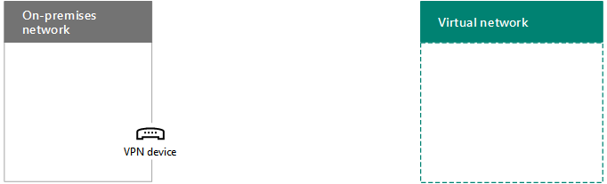

# <a name="connect-an-on-premises-network-to-a-microsoft-azure-virtual-network"></a>Connettere una rete locale a una rete virtuale di Microsoft Azure

 **Riepilogo:** informazioni su come configurare una rete virtuale di Azure cross-premise per i carichi di lavoro del server di Office.
  
Una rete virtuale di Azure cross-premise è connessa alla rete locale, ampliando quest'ultima affinché includa subnet e macchine virtuali ospitate nei servizi dell'infrastruttura di Azure. Tale connessione consente ai computer nella rete locale di accedere direttamente alle macchine virtuali in Azure e viceversa. Ad esempio, un server DirSync in esecuzione su una macchina virtuale di Azure deve effettuare una query nei controller di dominio locali per apportare modifiche agli account e sincronizzarle con la sottoscrizione di Office 365. In questo articolo viene illustrato come configurare una rete virtuale di Azure cross-premise che è pronta a ospitare macchine virtuali di Azure.

## <a name="overview"></a>Panoramica

Le macchine virtuali in Azure non devono essere isolate rispetto all'ambiente locale. Per connettere le macchine virtuali di Azure alle risorse di rete locali, è necessario configurare una rete virtuale di Azure cross-premise. Nel diagramma seguente vengono mostrati i componenti necessari per distribuire una rete virtuale di Azure cross-premise con una macchina virtuale in Azure.
  

  
Nel diagramma sono presenti due reti collegate tramite una connessione di rete privata virtuale (VPN) da sito a sito: la rete locale e la rete virtuale di Azure. La connessione VPN da sito a sito termina con un dispositivo VPN nella rete locale e un gateway VPN di Azure nella rete virtuale di Azure. La rete virtuale di Azure dispone di macchine virtuali. Il traffico di rete proveniente da macchine virtuali della rete virtuale di Azure viene inoltrato al gateway VPN, che a sua volta inoltra il traffico tramite la connessione VPN da sito a sito al dispositivo VPN nella rete locale. A questo punto, l'infrastruttura di routing della rete locale inoltra il traffico alla relativa destinazione.
  
Per configurare la connessione VPN tra la rete virtuale di Azure e la rete locale, eseguire la procedura seguente: 
  
1. **Locale:** definire e creare un route di rete locale per lo spazio degli indirizzi della rete virtuale di Azure che punta al dispositivo VPN locale.
    
2. **Microsoft Azure:** creare una rete virtuale di Azure con una connessione VPN da sito a sito. In questo articolo non viene descritto l'utilizzo di [ExpressRoute](https://azure.microsoft.com/services/expressroute/).
    
3. **Locale:** configurare il dispositivo VPN software o hardware locale per terminare la connessione VPN, che utilizza IPsec (Internet Protocol Security).
    
Dopo avere stabilito la connessione VPN da sito a sito, aggiungere le macchine virtuali di Azure alle subnet della rete virtuale.
  
## <a name="plan-your-azure-virtual-network"></a>Pianificare la rete virtuale di Azure
<a name="PlanningVirtual"></a>

### <a name="prerequisites"></a>Prerequisiti
<a name="Prerequisites"></a>

- Una sottoscrizione di Azure. Per informazioni sulle sottoscrizioni di Azure, andare alla [pagina relativa alla sottoscrizione di Microsoft Azure](https://azure.microsoft.com/pricing/purchase-options/).
    
- Uno spazio di indirizzi IPv4 privato disponibile da assegnare alla rete virtuale e alle relative subnet, con spazio sufficiente per adattarsi alla quantità di macchine virtuali necessarie ora e in futuro.
    
- Un dispositivo VPN disponibile nella rete locale per terminare la connessione VPN da sito a sito che supporti i requisiti per IPsec. Per ulteriori informazioni, vedere [Informazioni sui dispositivi VPN per connessioni delle reti virtuali da sito a sito](https://go.microsoft.com/fwlink/p/?LinkId=393093).
    
- Modifiche all'infrastruttura di routing affinché il traffico inoltrato allo spazio di indirizzi della rete virtuale di Azure venga inoltrato al dispositivo VPN che ospita la connessione VPN da sito a sito.
    
- Un proxy Web che consente l'accesso a Internet ai computer connessi alla rete locale e alla rete virtuale di Azure.
    
### <a name="solution-architecture-design-assumptions"></a>Presupposti per la progettazione dell’architettura della soluzione

Nel seguente elenco vengono riportate le scelte di progettazione effettuate in merito all'architettura della soluzione. 
  
- In questa soluzione viene utilizzata una singola rete virtuale di Azure con una connessione VPN da sito a sito. La rete virtuale di Azure ospita una singola subnet che può contenere più macchine virtuali. 
    
- È possibile utilizzare il servizio Routing e Accesso remoto (Routing and Remote Access, RRAS) in Windows Server 2016 oppure Windows Server 2012 per stabilire una connessione VPN da sito a sito con IPsec tra la rete locale e la rete virtuale di Azure. È inoltre possibile utilizzare altre opzioni, come i dispositivi VPN Cisco o Juniper Networks.
    
- La rete locale potrebbe ancora disporre di servizi di rete quali Windows Server Active Directory (AD), Domain Name System (DNS) e server proxy. In base alle proprie esigenze, può risultare utile posizionare alcune di queste risorse di rete nella rete virtuale di Azure.
    
Per una rete virtuale di Azure esistente con una o più subnet, determinare se è presente uno spazio di indirizzi sufficiente per una subnet aggiuntiva per ospitare le macchine virtuali necessarie, in base alle proprie esigenze. Se non si dispone di uno spazio di indirizzi rimanente per una subnet aggiuntiva, creare un'ulteriore rete virtuale che disponga di una propria connessione VPN da sito a sito.
  
### <a name="plan-the-routing-infrastructure-changes-for-the-azure-virtual-network"></a>Pianificare le modifiche dell'infrastruttura di routing per la rete virtuale di Azure

È necessario configurare l'infrastruttura di routing locale per inoltrare il traffico destinato allo spazio di indirizzi della rete virtuale di Azure al dispositivo VPN locale che ospita la connessione VPN da sito a sito.
  
Il metodo esatto per l'aggiornamento dell'infrastruttura di routing dipende da come vengono gestite le informazioni relative al routing; può trattarsi di:
  
- Aggiornamenti della tabella di routing basati sulla configurazione manuale.
    
- Aggiornamenti della tabella di routing basati sui protocolli di routing, quali Routing Information Protocol (RIP) oppure Open Shortest Path First (OSPF).
    
Consultare il proprio esperto di routing per verificare che il traffico destinato alla rete virtuale di Azure sia inoltrato al dispositivo VPN locale.
  
### <a name="plan-for-firewall-rules-for-traffic-to-and-from-the-on-premises-vpn-device"></a>Pianificare le regole del firewall per il traffico da e verso il dispositivo VPN locale

Se il dispositivo VPN si trova in una rete perimetrale dotata di un firewall tra la rete perimetrale e Internet, potrebbe essere necessario configurare il firewall per le seguenti regole in modo da consentire la connessione VPN da sito a sito.
  
- Traffico verso il dispositivo VPN (proveniente da Internet):
    
  - Indirizzo IP di destinazione del dispositivo VPN e protocollo IP 50
    
  - Indirizzo IP di destinazione del dispositivo VPN e porta di destinazione UDP 500
    
  - Indirizzo IP di destinazione del dispositivo VPN e porta di destinazione UDP 4500
    
- Traffico dal dispositivo VPN (in uscita verso Internet):
    
  - Indirizzo IP di origine del dispositivo VPN e protocollo IP 50
    
  - Indirizzo IP di origine del dispositivo VPN e porta di origine UDP 500
    
  - Indirizzo IP di origine del dispositivo VPN e porta di origine UDP 4500
    
### <a name="plan-for-the-private-ip-address-space-of-the-azure-virtual-network"></a>Pianificare lo spazio di indirizzi IP privato della rete virtuale di Azure

Lo spazio di indirizzi IP privato della rete virtuale di Azure deve essere in grado di adattare gli indirizzi utilizzati da Azure per ospitare la rete virtuale e con almeno una subnet dotata di una quantità sufficiente di indirizzi per le macchine virtuali di Azure in uso.
  
Per determinare il numero di indirizzi necessari per la subnet, contare le macchine virtuali attualmente necessarie, fare una stima per la crescita in futuro, quindi consultare la seguente tabella per stabilire le dimensioni della subnet.
  
|**Numero di macchine virtuali necessarie**|**Numero di host necessari**|**Dimensioni della subnet**|
|:-----|:-----|:-----|
|1-3  <br/> |3  <br/> |/29  <br/> |
|4-11  <br/> |4  <br/> |/28  <br/> |
|12-27  <br/> |5  <br/> |/27  <br/> |
|28-59  <br/> |6  <br/> |/26  <br/> |
|60-123  <br/> |7  <br/> |/25  <br/> |
   
### <a name="planning-worksheet-for-configuring-your-azure-virtual-network"></a>Prospetto di pianificazione per configurare la rete virtuale di Azure
<a name="worksheet"> </a>

Prima di creare una rete virtuale di Azure per ospitare macchine virtuali, occorre determinare le impostazioni necessarie riportate nelle seguenti tabelle.
  
Per le impostazioni della rete virtuale, compilare la tabella V.
  
 **Tabella V: configurazione di una rete virtuale cross-premise**
  
|**Elemento**|**Elemento Configuration**|**Descrizione**|**Valore**|
|:-----|:-----|:-----|:-----|
|1.  <br/> |Nome della rete virtuale  <br/> |Un nome da assegnare alla rete virtuale di Azure (ad esempio, DirSyncNet).  <br/> |_ _ _ _ _ _ _ _ _ <br/> |
|2.  <br/> |Percorso della rete virtuale  <br/> |Data center di Azure che conterrà la rete virtuale (come Stati Uniti occidentali).  <br/> |_ _ _ _ _ _ _ _ _  <br/> |
|3.  <br/> |Indirizzo IP del dispositivo VPN  <br/> |L'indirizzo IPv4 pubblico dell'interfaccia del dispositivo VPN su Internet. Consultare il proprio reparto IT per determinare tale indirizzo.  <br/> |_ _ _ _ _ _ _ _ _  <br/> |
|4.  <br/> |Spazio degli indirizzi delle reti virtuali  <br/> |Lo spazio di indirizzi (definito in un singolo prefisso di indirizzi privati) per la rete virtuale. Consultare il proprio reparto IT per determinare tale spazio di indirizzi. Lo spazio di indirizzi deve essere in formato CIDR (Classless Interdomain Routing), noto anche come formato del prefisso di rete. Ad esempio, 10.24.64.0/20.  <br/> |_ _ _ _ _ _ _ _ _  <br/> |
|5.  <br/> |Chiave condivisa IPsec  <br/> |Una stringa con 32 caratteri alfanumerici casuali che verrà utilizzata per autenticare entrambi i lati della connessione VPN da sito a sito. Consultare il reparto IT o della sicurezza per determinare tale valore chiave e archiviarlo in un percorso sicuro. In alternativa, vedere [Creare una stringa casuale per una chiave già condivisa IPsec ](https://social.technet.microsoft.com/wiki/contents/articles/32330.create-a-random-string-for-an-ipsec-preshared-key.aspx).<br/> |_ _ _ _ _ _ _ _ _  <br/> |
   
Compilare la tabella S per le subnet della soluzione.
  
- Per la prima subnet, determinare uno spazio di indirizzi a 28 bit (con una lunghezza del prefisso di /28) per la subnet del gateway di Azure. Per informazioni su come determinare questo spazio di indirizzi, vedere l'articolo relativo al [calcolo dello spazio di indirizzi della subnet del gateway per reti virtuali di Azure](https://blogs.technet.microsoft.com/solutions_advisory_board/2016/12/01/calculating-the-gateway-subnet-address-space-for-azure-virtual-networks/).
    
- Per la seconda subnet, specificare un nome descrittivo, un singolo spazio di indirizzi IP basato sullo spazio di indirizzi della rete virtuale e uno scopo descrittivo.
    
Consultare il reparto IT per determinare tali spazi di indirizzi in base allo spazio di indirizzi della rete virtuale. Dovranno essere entrambi in formato CIDR.
  
 **Tabella S: subnet nella rete virtuale**
  
|**Elemento**|**Nome della subnet**|**Spazio di indirizzi della subnet**|**Scopo**|
|:-----|:-----|:-----|:-----|
|1.  <br/> |GatewaySubnet  <br/> |_ _ _ _ _ _ _ _ _  <br/> |La subnet utilizzata dal gateway di Azure.  <br/> |
|2.  <br/> |_ _ _ _ _ _ _ _ _  <br/> |_ _ _ _ _ _ _ _ _  <br/> |_ _ _ _ _ _ _ _ _  <br/> |
   
Per i server DNS locali DNS che devono essere utilizzati dalle macchine virtuali nella rete virtuale, compilare la tabella D. Assegnare a ogni server DNS un nome descrittivo e un singolo indirizzo IP. Tale nome non deve necessariamente corrispondere a nome host o al nome computer del server DNS. Sono elencate due voci vuote, ma è possibile aggiungerne altre. Consultare il proprio reparto IT per determinare tale elenco.
  
 **Tabella D: server DNS locali**
  
|**Elemento**|**Nome descrittivo del server DNS**|**Indirizzo IP del server DNS**|
|:-----|:-----|:-----|
|1.  <br/> |_ _ _ _ _ _ _ _ _  <br/> |_ _ _ _ _ _ _ _ _  <br/> |
|2.  <br/> |_ _ _ _ _ _ _ _ _  <br/> |_ _ _ _ _ _ _ _ _  <br/> |
   
Per instradare pacchetti dalla rete virtuale di Azure alla propria rete aziendale tramite la connessione VPN da sito a sito, è necessario configurare la rete virtuale con una rete locale. Tale rete locale contiene un elenco degli spazi di indirizzi (in formato CIDR) per tutti i percorsi nella rete locale aziendale che le macchine virtuali nella rete virtuale devono raggiungere. Può trattarsi di tutti i percorsi nella rete locale o di un subset. L'elenco degli spazi di indirizzi che definiscono la rete locale deve essere univoco e non deve sovrapporsi con gli spazi di indirizzi utilizzati per questa rete virtuale o per altre reti virtuali cross-premise.
  
Per l'insieme degli spazi di indirizzi della rete locale, compilare la tabella L. Sono elencate tre voci vuote, ma sarà necessario aggiungerne altre. Consultare il proprio reparto IT per determinare tale elenco.
  
 **Tabella L: prefissi degli indirizzi per la rete locale**
  
|**Elemento**|**Spazio di indirizzi della rete locale**|
|:-----|:-----|
|1.  <br/> |_ _ _ _ _ _ _ _ _  <br/> |
|2.  <br/> |_ _ _ _ _ _ _ _ _  <br/> |
|3.  <br/> |_ _ _ _ _ _ _ _ _  <br/> |
   
## <a name="deployment-roadmap"></a>Guida di orientamento alla distribuzione
<a name="DeploymentRoadmap"> </a>

La creazione della rete virtuale cross-premise e l'aggiunta delle macchine virtuali in Azure è costituita da tre fasi:
  
- Fase 1: preparare la rete locale.
    
- Fase 2: creare la rete virtuale cross-premise in Azure.
    
- Fase 3 (facoltativa): aggiungere macchine virtuali.
    
### <a name="phase-1-prepare-your-on-premises-network"></a>Fase 1: preparare la rete locale
<a name="Phase1"></a>

È necessario configurare la rete locale con una route che recapita il traffico destinato allo spazio di indirizzi della rete virtuale al router sul perimetro della rete locale. Consultare l'amministratore di rete per determinare come aggiungere la route all'infrastruttura di routing della rete locale.
  
Di seguito è riportata la configurazione risultante.
  

  
### <a name="phase-2-create-the-cross-premises-virtual-network-in-azure"></a>Fase 2: creare la rete virtuale cross-premise in Azure
<a name="Phase2"></a>

Per prima cosa, aprire un prompt di Azure PowerShell. Se Azure PowerShell non è installato, vedere [Panoramica di Azure PowerShell](https://docs.microsoft.com/powershell/azureps-cmdlets-docs/).
  
> [!NOTE]
> Questi comandi sono compatibili con Azure PowerShell 1.0 e versioni successive. Per un file di testo contenente tutti i comandi di PowerShell riportati in questo articolo, fare clic [qui](https://gallery.technet.microsoft.com/scriptcenter/PowerShell-commands-for-5c5a7c19). 
  
Successivamente, accedere al proprio account di Azure con questo comando.
  
```
Login-AzureRMAccount
```

Ottenere il nome della sottoscrizione utilizzando il comando seguente.
  
```
Get-AzureRMSubscription | Sort SubscriptionName | Select SubscriptionName
```

Impostare la sottoscrizione di Azure con questi comandi. Sostituire tutto il testo racchiuso tra virgolette, compresi i caratteri < e >, con il nome della sottoscrizione corretto.
  
```
$subscrName="<subscription name>"
Select-AzureRMSubscription -SubscriptionName $subscrName -Current
```

In seguito, creare un nuovo gruppo di risorse per la rete virtuale. Per determinare un nome del gruppo di risorse univoco, utilizzare questo comando per creare un elenco dei gruppi di risorse esistenti.
  
```
Get-AzureRMResourceGroup | Sort ResourceGroupName | Select ResourceGroupName
```

Creare il nuovo gruppo di risorse con questi comandi.
  
```
$rgName="<resource group name>"
$locName="<Table V - Item 2 - Value column>"
New-AzureRMResourceGroup -Name $rgName -Location $locName

```

Le macchine virtuali basate su Resource Manager richiedono un account di archiviazione basato su Resource Manager. È necessario selezionare un nome univoco globale per l'account di archiviazione che contiene solo numeri e lettere minuscole. È possibile utilizzare questo comando per creare un elenco degli account di archiviazione esistenti.
  
```
Get-AzureRMStorageAccount | Sort Name | Select Name
```

Utilizzare questo comando per verificare se un nome dell'account di archiviazione proposto è univoco.
  
```
Get-AzureRmStorageAccountNameAvailability "<proposed name>"
```

Per creare un nuovo account di archiviazione, eseguire questi comandi.
  
```
$rgName="<your new resource group name>"
$locName="<the location of your new resource group>"
$saName="<unique storage account name>"
New-AzureRMStorageAccount -Name $saName -ResourceGroupName $rgName -Type Standard_LRS -Location $locName
```

Successivamente, creare la rete virtuale di Azure.
  
```
# Fill in the variables from previous values and from Tables V, S, and D
$rgName="<name of your new resource group>"
$locName="<Azure location of your new resource group>"
$vnetName="<Table V - Item 1 - Value column>"
$vnetAddrPrefix="<Table V - Item 4 - Value column>"
$gwSubnetPrefix="<Table S - Item 1 - Subnet address space column>"
$SubnetName="<Table S - Item 2 - Subnet name column>"
$SubnetPrefix="<Table S - Item 2 - Subnet address space column>"
$dnsServers=@( "<Table D - Item 1 - DNS server IP address column>", "<Table D - Item 2 - DNS server IP address column>" )
$locShortName=(Get-AzureRmResourceGroup -Name $rgName).Location

# Create the Azure virtual network and a network security group that allows incoming remote desktop connections to the subnet that is hosting virtual machines
$gatewaySubnet=New-AzureRmVirtualNetworkSubnetConfig -Name "GatewaySubnet" -AddressPrefix $gwSubnetPrefix
$vmSubnet=New-AzureRMVirtualNetworkSubnetConfig -Name $SubnetName -AddressPrefix $SubnetPrefix
New-AzureRMVirtualNetwork -Name $vnetName -ResourceGroupName $rgName -Location $locName -AddressPrefix $vnetAddrPrefix -Subnet $gatewaySubnet,$vmSubnet -DNSServer $dnsServers
$rule1=New-AzureRMNetworkSecurityRuleConfig -Name "RDPTraffic" -Description "Allow RDP to all VMs on the subnet" -Access Allow -Protocol Tcp -Direction Inbound -Priority 100 -SourceAddressPrefix Internet -SourcePortRange * -DestinationAddressPrefix * -DestinationPortRange 3389
New-AzureRMNetworkSecurityGroup -Name $SubnetName -ResourceGroupName $rgName -Location $locShortName -SecurityRules $rule1
$vnet=Get-AzureRMVirtualNetwork -ResourceGroupName $rgName -Name $vnetName
$nsg=Get-AzureRMNetworkSecurityGroup -Name $SubnetName -ResourceGroupName $rgName
Set-AzureRMVirtualNetworkSubnetConfig -VirtualNetwork $vnet -Name $SubnetName -AddressPrefix $SubnetPrefix -NetworkSecurityGroup $nsg
```

Di seguito è riportata la configurazione risultante.
  

  
Successivamente, utilizzare questi comandi per creare i gateway per la connessione VPN da sito a sito.
  
```
# Fill in the variables from previous values and from Tables V and L
$vnetName="<Table V - Item 1 - Value column>"
$localGatewayIP="<Table V - Item 3 - Value column>"
$localNetworkPrefix=@( <comma-separated, double-quote enclosed list of the local network address prefixes from Table L, example: "10.1.0.0/24", "10.2.0.0/24"> )
$vnetConnectionKey="<Table V - Item 5 - Value column>"
$vnet=Get-AzureRMVirtualNetwork -Name $vnetName -ResourceGroupName $rgName
# Attach a virtual network gateway to a public IP address and the gateway subnet
$publicGatewayVipName="PublicIPAddress"
$vnetGatewayIpConfigName="PublicIPConfig"
New-AzureRMPublicIpAddress -Name $vnetGatewayIpConfigName -ResourceGroupName $rgName -Location $locName -AllocationMethod Dynamic
$publicGatewayVip=Get-AzureRMPublicIpAddress -Name $vnetGatewayIpConfigName -ResourceGroupName $rgName
$vnetGatewayIpConfig=New-AzureRMVirtualNetworkGatewayIpConfig -Name $vnetGatewayIpConfigName -PublicIpAddressId $publicGatewayVip.Id -SubnetId $vnet.Subnets[0].Id
# Create the Azure gateway
$vnetGatewayName="AzureGateway"
$vnetGateway=New-AzureRMVirtualNetworkGateway -Name $vnetGatewayName -ResourceGroupName $rgName -Location $locName -GatewayType Vpn -VpnType RouteBased -IpConfigurations $vnetGatewayIpConfig
# Create the gateway for the local network
$localGatewayName="LocalNetGateway"
$localGateway=New-AzureRMLocalNetworkGateway -Name $localGatewayName -ResourceGroupName $rgName -Location $locName -GatewayIpAddress $localGatewayIP -AddressPrefix $localNetworkPrefix
# Create the Azure virtual network VPN connection
$vnetConnectionName="S2SConnection"
$vnetConnection=New-AzureRMVirtualNetworkGatewayConnection -Name $vnetConnectionName -ResourceGroupName $rgName -Location $locName -ConnectionType IPsec -SharedKey $vnetConnectionKey -VirtualNetworkGateway1 $vnetGateway -LocalNetworkGateway2 $localGateway
```

Di seguito è riportata la configurazione risultante.
  

  
Successivamente, configurare il dispositivo VPN locale per stabilire una connessione con il gateway VPN di Azure. Per ulteriori informazioni, vedere [Informazioni sui dispositivi VPN per connessioni delle reti virtuali di Azure da sito a sito](https://docs.microsoft.com/azure/vpn-gateway/vpn-gateway-about-vpn-devices).
  
Per configurare il dispositivo VPN, è necessario quanto segue:
  
- L'indirizzo IPv4 pubblico del gateway VPN di Azure per la rete virtuale. Utilizzare il comando **Get-AzureRMPublicIpAddress -Name $vnetGatewayIpConfigName -ResourceGroupName $rgName** per visualizzare tale indirizzo.
    
- La chiave già condivisa IPsec per la connessione VPN da sito a sito (Tabella V- Elemento 5 - Colonna Valore).
    
Di seguito è riportata la configurazione risultante.
  

  
### <a name="phase-3-optional-add-virtual-machines"></a>Fase 3 (facoltativa): aggiungere macchine virtuali

Creare le macchine virtuali necessarie in Azure. Per ulteriori informazioni, vedere [Creare la prima macchina virtuale Windows nel portale di Azure](https://go.microsoft.com/fwlink/p/?LinkId=393098).
  
Utilizzare le seguenti impostazioni:
  
- Nel riquadro **Impostazioni di base**, selezionare la stessa sottoscrizione e lo stesso gruppo di risorse della rete virtuale. Registrare nome utente e password in un percorso sicuro. Saranno necessari più avanti per accedere alla macchina virtuale.
    
- Nel riquadro **Dimensioni**, scegliere la dimensione appropriata.
    
- Nel riquadro **Impostazioni**, nella sezione **Archiviazione**, selezionare il tipo di archiviazione **Standard** e l'account di archiviazione configurato con la rete virtuale in uso. Nella sezione **Rete**, selezionare il nome della rete virtuale e della subnet per ospitare le macchine virtuali (non GatewaySubnet). Lasciare i valori predefiniti per tutte le altre impostazioni.
    
Verificare che la macchina virtuale utilizzi DNS correttamente controllando il DNS interno in uso per assicurarsi che i record Address (A) siano stati aggiunti per la nuova macchina virtuale. Per accedere a Internet, le macchine virtuali di Azure devono essere configurate per l'utilizzo del server proxy della rete locale. Contattare l'amministratore di rete per visualizzare ulteriori procedure di configurazione da eseguire sul server.
  
Di seguito è riportata la configurazione risultante.
  

  
## <a name="next-step"></a>Passaggio successivo
  
[Distribuire la sincronizzazione della directory (DirSync) di Office 365 in Microsoft Azure](deploy-office-365-directory-synchronization-dirsync-in-microsoft-azure.md)
 


