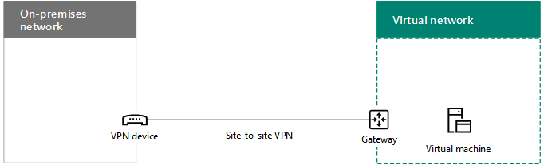
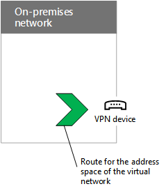

# <a name="connect-an-on-premises-network-to-a-microsoft-azure-virtual-network"></a><span data-ttu-id="02710-103">Connettere una rete locale a una rete virtuale di Microsoft Azure</span><span class="sxs-lookup"><span data-stu-id="02710-103">Connect an on-premises network to a Microsoft Azure virtual network</span></span>

 <span data-ttu-id="02710-104">**Riepilogo:** informazioni su come configurare una rete virtuale di Azure cross-premise per i carichi di lavoro del server di Office.</span><span class="sxs-lookup"><span data-stu-id="02710-104">**Summary:** Learn how to configure a cross-premises Azure virtual network for Office server workloads.</span></span>
  
<span data-ttu-id="02710-p101">Una rete virtuale di Azure cross-premise è connessa alla rete locale, ampliando quest'ultima affinché includa subnet e macchine virtuali ospitate nei servizi dell'infrastruttura di Azure. Questa connessione consente ai computer su rete locale di accedere direttamente alle macchine virtuali in Azure e viceversa.</span><span class="sxs-lookup"><span data-stu-id="02710-p101">A cross-premises Azure virtual network is connected to your on-premises network, extending your network to include subnets and virtual machines hosted in Azure infrastructure services. This connection allows computers on your on-premises network to directly access virtual machines in Azure and vice versa. For example, a DirSync server running on an Azure virtual machine needs to query your on-premises domain controllers for changes to accounts and synchronize those changes with your Office 365 subscription. This article shows you how to set up a cross-premises Azure virtual network that is ready to host Azure virtual machines.</span></span> 

<span data-ttu-id="02710-p102">Ad esempio, un server di sincronizzazione della directory in esecuzione su una macchina virtuale Azure deve eseguire una query sui controller di dominio locali per le modifiche agli account e sincronizzare tali modifiche con la sottoscrizione di Office 365. Questo articolo illustra come configurare una rete virtuale Azure cross-premise utilizzando una connessione VPN (Virtual Private Network) da sito a sito pronta per ospitare macchine virtuali in Azure.</span><span class="sxs-lookup"><span data-stu-id="02710-p102">A cross-premises Azure virtual network is connected to your on-premises network, extending your network to include subnets and virtual machines hosted in Azure infrastructure services. This connection allows computers on your on-premises network to directly access virtual machines in Azure and vice versa. For example, a DirSync server running on an Azure virtual machine needs to query your on-premises domain controllers for changes to accounts and synchronize those changes with your Office 365 subscription. This article shows you how to set up a cross-premises Azure virtual network that is ready to host Azure virtual machines.</span></span>

## <a name="overview"></a><span data-ttu-id="02710-109">Panoramica</span><span class="sxs-lookup"><span data-stu-id="02710-109">Overview</span></span>

<span data-ttu-id="02710-p103">Le macchine virtuali in Azure non devono essere isolate rispetto all'ambiente locale. Per connettere le macchine virtuali di Azure alle risorse di rete locali, è necessario configurare una rete virtuale di Azure cross-premise. Nel diagramma seguente vengono mostrati i componenti necessari per distribuire una rete virtuale di Azure cross-premise con una macchina virtuale in Azure.</span><span class="sxs-lookup"><span data-stu-id="02710-p103">Your virtual machines in Azure don't have to be isolated from your on-premises environment. To connect Azure virtual machines to your on-premises network resources, you must configure a cross-premises Azure virtual network. The following diagram shows the required components to deploy a cross-premises Azure virtual network with a virtual machine in Azure.</span></span>
  

  
<span data-ttu-id="02710-p104">Nel diagramma sono presenti due reti collegate tramite una connessione di rete privata virtuale (VPN) da sito a sito: la rete locale e la rete virtuale di Azure. La connessione VPN da sito a sito:</span><span class="sxs-lookup"><span data-stu-id="02710-p104">In the diagram, there are two networks connected by a site-to-site VPN connection: the on-premises network and the Azure virtual network. The site-to-site VPN connection is:</span></span>

- <span data-ttu-id="02710-116">È tra due punti finali raggiungibili e localizzati su Internet pubblico.</span><span class="sxs-lookup"><span data-stu-id="02710-116">Between two endpoints that are addressable and located on the public Internet.</span></span>
- <span data-ttu-id="02710-117">Viene terminata con un dispositivo VPN nella rete locale e un gateway VPN di Azure nella rete virtuale di Azure.</span><span class="sxs-lookup"><span data-stu-id="02710-117">Terminated by a VPN device on the on-premises network and an Azure VPN gateway on the Azure virtual network.</span></span>

<span data-ttu-id="02710-p105">La rete virtuale di Azure ospita macchine virtuali. Il traffico di rete proveniente da macchine virtuali sulla rete virtuale di Azure viene inoltrato al gateway VPN, attraverso il quale il traffico viene inoltrato tramite la connessione VPN da sito a sito al dispositivo VPN nella rete locale. A questo punto, l'infrastruttura di routing della rete locale inoltra il traffico alla relativa destinazione.</span><span class="sxs-lookup"><span data-stu-id="02710-p105">In the diagram, there are two networks connected by a site-to-site virtual private network (VPN) connection: the on-premises network and the Azure virtual network. The site-to-site VPN connection is terminated by a VPN device on the on-premises network and an Azure VPN gateway on the Azure virtual network. The Azure virtual network has virtual machines. Network traffic originating from virtual machines on the Azure virtual network gets forwarded to the VPN gateway, which then forwards the traffic across the site-to-site VPN connection to the VPN device on the on-premises network. The routing infrastructure of the on-premises network then forwards the traffic to its destination.</span></span>

>[!Note]
><span data-ttu-id="02710-p106">È inoltre possibile utilizzare [ExpressRoute](https://azure.microsoft.com/services/expressroute/), ovvero una connessione diretta tra l'organizzazione dell'utente e la rete Microsoft. Il traffico su ExpressRoute non viaggia su Internet pubblico. Questo articolo non descrive l'uso di ExpressRoute.</span><span class="sxs-lookup"><span data-stu-id="02710-p106">You can also use [ExpressRoute](https://azure.microsoft.com/services/expressroute/), which is a direct connection between your organization and Microsoft's network. Traffic over ExpressRoute does not travel over the public Internet. This article does not describe the use of ExpressRoute.</span></span>
>
  
<span data-ttu-id="02710-124">Per configurare la connessione VPN tra la rete virtuale di Azure e la rete locale, eseguire la procedura seguente:</span><span class="sxs-lookup"><span data-stu-id="02710-124">To set up the VPN connection between your Azure virtual network and your on-premises network, do the following steps:</span></span> 
  
1. <span data-ttu-id="02710-125">**Locale:** definire e creare un route di rete locale per lo spazio degli indirizzi della rete virtuale di Azure che punta al dispositivo VPN locale.</span><span class="sxs-lookup"><span data-stu-id="02710-125">**On-premises:** Define and create an on-premises network route for the address space of the Azure virtual network that points to your on-premises VPN device.</span></span>
    
2. <span data-ttu-id="02710-126">**Microsoft Azure:** creare una rete virtuale di Azure con una connessione VPN da sito a sito.</span><span class="sxs-lookup"><span data-stu-id="02710-126">**Microsoft Azure:** Create an Azure virtual network with a site-to-site VPN connection. This article does not describe the use ofExpressRoute.</span></span> 
    
3. <span data-ttu-id="02710-127">**Locale:** configurare il dispositivo VPN software o hardware locale per terminare la connessione VPN, che utilizza IPsec (Internet Protocol Security).</span><span class="sxs-lookup"><span data-stu-id="02710-127">**On premises:** Configure your on-premises hardware or software VPN device to terminate the VPN connection, which uses Internet Protocol security (IPsec).</span></span>
    
<span data-ttu-id="02710-128">Dopo avere stabilito la connessione VPN da sito a sito, aggiungere le macchine virtuali di Azure alle subnet della rete virtuale.</span><span class="sxs-lookup"><span data-stu-id="02710-128">After you establish the site-to-site VPN connection, you add Azure virtual machines to the subnets of the virtual network.</span></span>
  
## <a name="plan-your-azure-virtual-network"></a><span data-ttu-id="02710-129">Pianificare la rete virtuale di Azure</span><span class="sxs-lookup"><span data-stu-id="02710-129">Plan your Azure virtual network</span></span>
<a name="PlanningVirtual"></a>

### <a name="prerequisites"></a><span data-ttu-id="02710-130">Prerequisiti</span><span class="sxs-lookup"><span data-stu-id="02710-130">Prerequisites</span></span>
<a name="Prerequisites"></a>

- <span data-ttu-id="02710-p107">Una sottoscrizione di Azure. Per informazioni sulle sottoscrizioni di Azure, andare alla [pagina relativa all'acquisto di Azure](https://azure.microsoft.com/pricing/purchase-options/).</span><span class="sxs-lookup"><span data-stu-id="02710-p107">An Azure subscription. For information about Azure subscriptions, go to the [Microsoft Azure subscription page](https://azure.microsoft.com/pricing/purchase-options/).</span></span>
    
- <span data-ttu-id="02710-133">Uno spazio di indirizzi IPv4 privato disponibile da assegnare alla rete virtuale e alle relative subnet, con spazio sufficiente per adattarsi alla quantità di macchine virtuali necessarie ora e in futuro.</span><span class="sxs-lookup"><span data-stu-id="02710-133">An available private IPv4 address space to assign to the virtual network and its subnets, with sufficient room for growth to accommodate the number of virtual machines needed now and in the future.</span></span>
    
- <span data-ttu-id="02710-p108">Un dispositivo VPN disponibile nella rete locale per terminare la connessione VPN da sito a sito che supporti i requisiti per IPsec. Per ulteriori informazioni, vedere [Informazioni sui dispositivi VPN per connessioni delle reti virtuali da sito a sito](https://go.microsoft.com/fwlink/p/?LinkId=393093).</span><span class="sxs-lookup"><span data-stu-id="02710-p108">An available VPN device in your on-premises network to terminate the site-to-site VPN connection that supports the requirements for IPsec. For more information, see [About VPN devices for site-to-site virtual network connections](https://go.microsoft.com/fwlink/p/?LinkId=393093).</span></span>
    
- <span data-ttu-id="02710-136">Modifiche all'infrastruttura di routing affinché il traffico inoltrato allo spazio di indirizzi della rete virtuale di Azure venga inoltrato al dispositivo VPN che ospita la connessione VPN da sito a sito.</span><span class="sxs-lookup"><span data-stu-id="02710-136">Changes to your routing infrastructure so that traffic routed to the address space of the Azure virtual network gets forwarded to the VPN device that hosts the site-to-site VPN connection.</span></span>
    
- <span data-ttu-id="02710-137">Un proxy Web che consente l'accesso a Internet ai computer connessi alla rete locale e alla rete virtuale di Azure.</span><span class="sxs-lookup"><span data-stu-id="02710-137">A web proxy that gives computers that are connected to the on-premises network and the Azure virtual network access to the Internet.</span></span>
    
### <a name="solution-architecture-design-assumptions"></a><span data-ttu-id="02710-138">Presupposti per la progettazione dell’architettura della soluzione</span><span class="sxs-lookup"><span data-stu-id="02710-138">Solution architecture design assumptions</span></span>

<span data-ttu-id="02710-139">Nel seguente elenco vengono riportate le scelte di progettazione effettuate in merito all'architettura della soluzione.</span><span class="sxs-lookup"><span data-stu-id="02710-139">The following list represents the design choices that have been made for this solution architecture.</span></span> 
  
- <span data-ttu-id="02710-p109">In questa soluzione viene utilizzata una singola rete virtuale di Azure con una connessione VPN da sito a sito. La rete virtuale di Azure ospita una singola subnet che può contenere più macchine virtuali.</span><span class="sxs-lookup"><span data-stu-id="02710-p109">This solution uses a single Azure virtual network with a site-to-site VPN connection. The Azure virtual network hosts a single subnet that can contain multiple virtual machines.</span></span> 
    
- <span data-ttu-id="02710-p110">È possibile utilizzare il servizio Routing e Accesso remoto (Routing and Remote Access, RRAS) in Windows Server 2016 oppure Windows Server 2012 per stabilire una connessione VPN da sito a sito con IPsec tra la rete locale e la rete virtuale di Azure. È inoltre possibile utilizzare altre opzioni, come i dispositivi VPN Cisco o Juniper Networks.</span><span class="sxs-lookup"><span data-stu-id="02710-p110">You can use the Routing and Remote Access Service (RRAS) in Windows Server 2016 or Windows Server 2012 to establish an IPsec site-to-site VPN connection between the on-premises network and the Azure virtual network. You can also use other options, such as Cisco or Juniper Networks VPN devices.</span></span>
    
- <span data-ttu-id="02710-p111">La rete locale potrebbe ancora disporre di servizi di rete quali Windows Server Active Directory (AD), Domain Name System (DNS) e server proxy. In base alle proprie esigenze, può risultare utile posizionare alcune di queste risorse di rete nella rete virtuale di Azure.</span><span class="sxs-lookup"><span data-stu-id="02710-p111">The on-premises network might still have network services like Windows Server Active Directory (AD), Domain Name System (DNS), and proxy servers. Depending on your requirements, it might be beneficial to place some of these network resources in the Azure virtual network.</span></span>
    
<span data-ttu-id="02710-p112">Per una rete virtuale di Azure esistente con una o più subnet, determinare se è presente uno spazio di indirizzi sufficiente per una subnet aggiuntiva per ospitare le macchine virtuali necessarie, in base alle proprie esigenze. Se non si dispone di uno spazio di indirizzi rimanente per una subnet aggiuntiva, creare un'ulteriore rete virtuale che disponga di una propria connessione VPN da sito a sito.</span><span class="sxs-lookup"><span data-stu-id="02710-p112">For an existing Azure virtual network with one or more subnets, determine whether there is remaining address space for an additional subnet to host your needed virtual machines, based on your requirements. If you don't have remaining address space for an additional subnet, create an additional virtual network that has its own site-to-site VPN connection.</span></span>
  
### <a name="plan-the-routing-infrastructure-changes-for-the-azure-virtual-network"></a><span data-ttu-id="02710-148">Pianificare le modifiche dell'infrastruttura di routing per la rete virtuale di Azure</span><span class="sxs-lookup"><span data-stu-id="02710-148">Plan the routing infrastructure changes for the Azure virtual network</span></span>

<span data-ttu-id="02710-149">È necessario configurare l'infrastruttura di routing locale per inoltrare il traffico destinato allo spazio di indirizzi della rete virtuale di Azure al dispositivo VPN locale che ospita la connessione VPN da sito a sito.</span><span class="sxs-lookup"><span data-stu-id="02710-149">You must configure your on-premises routing infrastructure to forward traffic destined for the address space of the Azure virtual network to the on-premises VPN device that is hosting the site-to-site VPN connection.</span></span>
  
<span data-ttu-id="02710-150">Il metodo esatto per l'aggiornamento dell'infrastruttura di routing dipende da come vengono gestite le informazioni relative al routing; può trattarsi di:</span><span class="sxs-lookup"><span data-stu-id="02710-150">The exact method of updating your routing infrastructure depends on how you manage routing information, which can be:</span></span>
  
- <span data-ttu-id="02710-151">Aggiornamenti della tabella di routing basati sulla configurazione manuale.</span><span class="sxs-lookup"><span data-stu-id="02710-151">Routing table updates based on manual configuration.</span></span>
    
- <span data-ttu-id="02710-152">Aggiornamenti della tabella di routing basati sui protocolli di routing, quali Routing Information Protocol (RIP) oppure Open Shortest Path First (OSPF).</span><span class="sxs-lookup"><span data-stu-id="02710-152">Routing table updates based on routing protocols, such as Routing Information Protocol (RIP) or Open Shortest Path First (OSPF).</span></span>
    
<span data-ttu-id="02710-153">Consultare il proprio esperto di routing per verificare che il traffico destinato alla rete virtuale di Azure sia inoltrato al dispositivo VPN locale.</span><span class="sxs-lookup"><span data-stu-id="02710-153">Consult with your routing specialist to make sure that traffic destined for the Azure virtual network is forwarded to the on-premises VPN device.</span></span>
  
### <a name="plan-for-firewall-rules-for-traffic-to-and-from-the-on-premises-vpn-device"></a><span data-ttu-id="02710-154">Pianificare le regole del firewall per il traffico da e verso il dispositivo VPN locale</span><span class="sxs-lookup"><span data-stu-id="02710-154">Plan for firewall rules for traffic to and from the on-premises VPN device</span></span>

<span data-ttu-id="02710-155">Se il dispositivo VPN si trova in una rete perimetrale dotata di un firewall tra la rete perimetrale e Internet, potrebbe essere necessario configurare il firewall per le seguenti regole in modo da consentire la connessione VPN da sito a sito.</span><span class="sxs-lookup"><span data-stu-id="02710-155">If your VPN device is on a perimeter network that has a firewall between the perimeter network and the Internet, you might have to configure the firewall for the following rules to allow the site-to-site VPN connection.</span></span>
  
- <span data-ttu-id="02710-156">Traffico verso il dispositivo VPN (proveniente da Internet):</span><span class="sxs-lookup"><span data-stu-id="02710-156">Traffic to the VPN device (incoming from the Internet):</span></span>
    
  - <span data-ttu-id="02710-157">Indirizzo IP di destinazione del dispositivo VPN e protocollo IP 50</span><span class="sxs-lookup"><span data-stu-id="02710-157">Destination IP address of the VPN device and IP protocol 50</span></span>
    
  - <span data-ttu-id="02710-158">Indirizzo IP di destinazione del dispositivo VPN e porta di destinazione UDP 500</span><span class="sxs-lookup"><span data-stu-id="02710-158">Destination IP address of the VPN device and UDP destination port 500</span></span>
    
  - <span data-ttu-id="02710-159">Indirizzo IP di destinazione del dispositivo VPN e porta di destinazione UDP 4500</span><span class="sxs-lookup"><span data-stu-id="02710-159">Destination IP address of the VPN device and UDP destination port 4500</span></span>
    
- <span data-ttu-id="02710-160">Traffico dal dispositivo VPN (in uscita verso Internet):</span><span class="sxs-lookup"><span data-stu-id="02710-160">Traffic from the VPN device (outgoing to the Internet):</span></span>
    
  - <span data-ttu-id="02710-161">Indirizzo IP di origine del dispositivo VPN e protocollo IP 50</span><span class="sxs-lookup"><span data-stu-id="02710-161">Source IP address of the VPN device and IP protocol 50</span></span>
    
  - <span data-ttu-id="02710-162">Indirizzo IP di origine del dispositivo VPN e porta di origine UDP 500</span><span class="sxs-lookup"><span data-stu-id="02710-162">Source IP address of the VPN device and UDP source port 500</span></span>
    
  - <span data-ttu-id="02710-163">Indirizzo IP di origine del dispositivo VPN e porta di origine UDP 4500</span><span class="sxs-lookup"><span data-stu-id="02710-163">Source IP address of the VPN device and UDP source port 4500</span></span>
    
### <a name="plan-for-the-private-ip-address-space-of-the-azure-virtual-network"></a><span data-ttu-id="02710-164">Pianificare lo spazio di indirizzi IP privato della rete virtuale di Azure</span><span class="sxs-lookup"><span data-stu-id="02710-164">Plan for the private IP address space of the Azure virtual network</span></span>

<span data-ttu-id="02710-165">Lo spazio di indirizzi IP privato della rete virtuale di Azure deve essere in grado di adattare gli indirizzi utilizzati da Azure per ospitare la rete virtuale e con almeno una subnet dotata di una quantità sufficiente di indirizzi per le macchine virtuali di Azure in uso.</span><span class="sxs-lookup"><span data-stu-id="02710-165">The private IP address space of the Azure virtual network must be able to accommodate addresses used by Azure to host the virtual network and with at least one subnet that has enough addresses for your Azure virtual machines.</span></span>
  
<span data-ttu-id="02710-166">Per determinare il numero di indirizzi necessari per la subnet, contare le macchine virtuali attualmente necessarie, fare una stima per la crescita in futuro, quindi consultare la seguente tabella per stabilire le dimensioni della subnet.</span><span class="sxs-lookup"><span data-stu-id="02710-166">To determine the number of addresses needed for the subnet, count the number of virtual machines that you need now, estimate for future growth, and then use the following table to determine the size of the subnet.</span></span>
  
|<span data-ttu-id="02710-167">**Numero di macchine virtuali necessarie**</span><span class="sxs-lookup"><span data-stu-id="02710-167">**Number of virtual machines needed**</span></span>|<span data-ttu-id="02710-168">**Numero di host necessari**</span><span class="sxs-lookup"><span data-stu-id="02710-168">**Number of host bits needed**</span></span>|<span data-ttu-id="02710-169">**Dimensioni della subnet**</span><span class="sxs-lookup"><span data-stu-id="02710-169">**Size of the subnet**</span></span>|
|:-----|:-----|:-----|
|<span data-ttu-id="02710-170">1-3</span><span class="sxs-lookup"><span data-stu-id="02710-170">1-3</span></span>  <br/> |<span data-ttu-id="02710-171">3</span><span class="sxs-lookup"><span data-stu-id="02710-171">3.</span></span>  <br/> |<span data-ttu-id="02710-172">/29</span><span class="sxs-lookup"><span data-stu-id="02710-172">/29</span></span>  <br/> |
|<span data-ttu-id="02710-173">4-11</span><span class="sxs-lookup"><span data-stu-id="02710-173">4-11</span></span>  <br/> |<span data-ttu-id="02710-174">4</span><span class="sxs-lookup"><span data-stu-id="02710-174">4.</span></span>  <br/> |<span data-ttu-id="02710-175">/28</span><span class="sxs-lookup"><span data-stu-id="02710-175">/28</span></span>  <br/> |
|<span data-ttu-id="02710-176">12-27</span><span class="sxs-lookup"><span data-stu-id="02710-176">12-27</span></span>  <br/> |<span data-ttu-id="02710-177">5</span><span class="sxs-lookup"><span data-stu-id="02710-177">5.</span></span>  <br/> |<span data-ttu-id="02710-178">/27</span><span class="sxs-lookup"><span data-stu-id="02710-178">/27</span></span>  <br/> |
|<span data-ttu-id="02710-179">28-59</span><span class="sxs-lookup"><span data-stu-id="02710-179">28-59</span></span>  <br/> |<span data-ttu-id="02710-180">6</span><span class="sxs-lookup"><span data-stu-id="02710-180">6.</span></span>  <br/> |<span data-ttu-id="02710-181">/26</span><span class="sxs-lookup"><span data-stu-id="02710-181">/26</span></span>  <br/> |
|<span data-ttu-id="02710-182">60-123</span><span class="sxs-lookup"><span data-stu-id="02710-182">60-123</span></span>  <br/> |<span data-ttu-id="02710-183">7</span><span class="sxs-lookup"><span data-stu-id="02710-183">7.</span></span>  <br/> |<span data-ttu-id="02710-184">/25</span><span class="sxs-lookup"><span data-stu-id="02710-184">/25</span></span>  <br/> |
   
### <a name="planning-worksheet-for-configuring-your-azure-virtual-network"></a><span data-ttu-id="02710-185">Prospetto di pianificazione per configurare la rete virtuale di Azure</span><span class="sxs-lookup"><span data-stu-id="02710-185">Planning worksheet for configuring your Azure virtual network</span></span>
<span data-ttu-id="02710-186"><a name="worksheet"> </a></span><span class="sxs-lookup"><span data-stu-id="02710-186"></span></span>

<span data-ttu-id="02710-187">Prima di creare una rete virtuale di Azure per ospitare macchine virtuali, occorre determinare le impostazioni necessarie riportate nelle seguenti tabelle.</span><span class="sxs-lookup"><span data-stu-id="02710-187">Before you create an Azure virtual network to host virtual machines, you must determine the settings needed in the following tables.</span></span>
  
<span data-ttu-id="02710-188">Per le impostazioni della rete virtuale, compilare la tabella V.</span><span class="sxs-lookup"><span data-stu-id="02710-188">For the settings of the virtual network, fill in Table V.</span></span>
  
 <span data-ttu-id="02710-189">**Tabella V: configurazione di una rete virtuale cross-premise**</span><span class="sxs-lookup"><span data-stu-id="02710-189">**Table V: Cross-premises virtual network configuration**</span></span>
  
|<span data-ttu-id="02710-190">**Elemento**</span><span class="sxs-lookup"><span data-stu-id="02710-190">**Item**</span></span>|<span data-ttu-id="02710-191">**Elemento Configuration**</span><span class="sxs-lookup"><span data-stu-id="02710-191">**Configuration element**</span></span>|<span data-ttu-id="02710-192">**Descrizione**</span><span class="sxs-lookup"><span data-stu-id="02710-192">**Description**</span></span>|<span data-ttu-id="02710-193">**Valore**</span><span class="sxs-lookup"><span data-stu-id="02710-193">**Value**</span></span>|
|:-----|:-----|:-----|:-----|
|<span data-ttu-id="02710-194">1.</span><span class="sxs-lookup"><span data-stu-id="02710-194">1.</span></span>  <br/> |<span data-ttu-id="02710-195">Nome della rete virtuale</span><span class="sxs-lookup"><span data-stu-id="02710-195">Virtual network name</span></span>  <br/> |<span data-ttu-id="02710-196">Un nome da assegnare alla rete virtuale di Azure (ad esempio, DirSyncNet).</span><span class="sxs-lookup"><span data-stu-id="02710-196">A name to assign to the Azure virtual network (example DirSyncNet).</span></span>  <br/> | |
|<span data-ttu-id="02710-197">2.</span><span class="sxs-lookup"><span data-stu-id="02710-197">2.</span></span>  <br/> |<span data-ttu-id="02710-198">Percorso della rete virtuale</span><span class="sxs-lookup"><span data-stu-id="02710-198">Virtual network location</span></span>  <br/> |<span data-ttu-id="02710-199">Data center di Azure che conterrà la rete virtuale (come Stati Uniti occidentali).</span><span class="sxs-lookup"><span data-stu-id="02710-199">The Azure datacenter that will contain the virtual network (such as West US).</span></span>  <br/> |  <br/> |
|<span data-ttu-id="02710-200">3.</span><span class="sxs-lookup"><span data-stu-id="02710-200">3.</span></span>  <br/> |<span data-ttu-id="02710-201">Indirizzo IP del dispositivo VPN</span><span class="sxs-lookup"><span data-stu-id="02710-201">VPN device IP address</span></span>  <br/> |<span data-ttu-id="02710-p113">L'indirizzo IPv4 pubblico dell'interfaccia del dispositivo VPN su Internet. Consultare il proprio reparto IT per determinare tale indirizzo.</span><span class="sxs-lookup"><span data-stu-id="02710-p113">The public IPv4 address of your VPN device's interface on the Internet. Work with your IT department to determine this address.</span></span>  <br/> |  <br/> |
|<span data-ttu-id="02710-204">4.</span><span class="sxs-lookup"><span data-stu-id="02710-204">4.</span></span>  <br/> |<span data-ttu-id="02710-205">Spazio degli indirizzi delle reti virtuali</span><span class="sxs-lookup"><span data-stu-id="02710-205">Virtual network address space</span></span>  <br/> |<span data-ttu-id="02710-p114">Lo spazio di indirizzi (definito in un singolo prefisso di indirizzi privati) per la rete virtuale. Consultare il proprio reparto IT per determinare tale spazio di indirizzi. Lo spazio di indirizzi deve essere in formato CIDR (Classless Interdomain Routing), noto anche come formato del prefisso di rete. Ad esempio, 10.24.64.0/20.</span><span class="sxs-lookup"><span data-stu-id="02710-p114">The address space (defined in a single private address prefix) for the virtual network. Work with your IT department to determine this address space. The address space should be in Classless Interdomain Routing (CIDR) format, also known as network prefix format. An example is 10.24.64.0/20.</span></span>  <br/> | <br/> |
|<span data-ttu-id="02710-210">5.</span><span class="sxs-lookup"><span data-stu-id="02710-210">5.</span></span>  <br/> |<span data-ttu-id="02710-211">Chiave condivisa IPsec</span><span class="sxs-lookup"><span data-stu-id="02710-211">IPsec shared key</span></span>  <br/> |<span data-ttu-id="02710-p115">Una stringa con 32 caratteri alfanumerici casuali che verrà utilizzata per autenticare entrambi i lati della connessione VPN da sito a sito. Consultare il reparto IT o della sicurezza per determinare tale valore chiave e archiviarlo in un percorso sicuro. In alternativa, vedere [Creare una stringa casuale per una chiave già condivisa IPsec ](https://social.technet.microsoft.com/wiki/contents/articles/32330.create-a-random-string-for-an-ipsec-preshared-key.aspx).</span><span class="sxs-lookup"><span data-stu-id="02710-p115">A 32-character random, alphanumeric string that will be used to authenticate both sides of the site-to-site VPN connection. Work with your IT or security department to determine this key value and then store it in a secure location. Alternately, see [Create a random string for an IPsec preshared key](https://social.technet.microsoft.com/wiki/contents/articles/32330.create-a-random-string-for-an-ipsec-preshared-key.aspx).  </span></span><br/> | <br/> |
   
<span data-ttu-id="02710-215">Compilare la tabella S per le subnet della soluzione.</span><span class="sxs-lookup"><span data-stu-id="02710-215">Fill in Table S for the subnets of this solution.</span></span>
  
- <span data-ttu-id="02710-p116">Per la prima subnet, determinare uno spazio di indirizzi a 28 bit (con una lunghezza del prefisso di /28) per la subnet del gateway di Azure. Per informazioni su come determinare questo spazio di indirizzi, vedere l'articolo relativo al [calcolo dello spazio di indirizzi della subnet del gateway per reti virtuali di Azure](https://blogs.technet.microsoft.com/solutions_advisory_board/2016/12/01/calculating-the-gateway-subnet-address-space-for-azure-virtual-networks/).</span><span class="sxs-lookup"><span data-stu-id="02710-p116">For the first subnet, determine a 28-bit address space (with a /28 prefix length) for the Azure gateway subnet. See [Calculating the gateway subnet address space for Azure virtual networks](https://blogs.technet.microsoft.com/solutions_advisory_board/2016/12/01/calculating-the-gateway-subnet-address-space-for-azure-virtual-networks/) for information about how to determine this address space.</span></span>
    
- <span data-ttu-id="02710-218">Per la seconda subnet, specificare un nome descrittivo, un singolo spazio di indirizzi IP basato sullo spazio di indirizzi della rete virtuale e uno scopo descrittivo.</span><span class="sxs-lookup"><span data-stu-id="02710-218">For the second subnet, specify a friendly name, a single IP address space based on the virtual network address space, and a descriptive purpose.</span></span>
    
<span data-ttu-id="02710-p117">Consultare il reparto IT per determinare tali spazi di indirizzi in base allo spazio di indirizzi della rete virtuale. Dovranno essere entrambi in formato CIDR.</span><span class="sxs-lookup"><span data-stu-id="02710-p117">Work with your IT department to determine these address spaces from the virtual network address space. Both address spaces should be in CIDR format.</span></span>
  
 <span data-ttu-id="02710-221">**Tabella S: subnet nella rete virtuale**</span><span class="sxs-lookup"><span data-stu-id="02710-221">**Table S: Subnets in the virtual network**</span></span>
  
|<span data-ttu-id="02710-222">**Elemento**</span><span class="sxs-lookup"><span data-stu-id="02710-222">**Item**</span></span>|<span data-ttu-id="02710-223">**Nome della subnet**</span><span class="sxs-lookup"><span data-stu-id="02710-223">**Subnet name**</span></span>|<span data-ttu-id="02710-224">**Spazio di indirizzi della subnet**</span><span class="sxs-lookup"><span data-stu-id="02710-224">**Subnet address space**</span></span>|<span data-ttu-id="02710-225">**Scopo**</span><span class="sxs-lookup"><span data-stu-id="02710-225">**Purpose**</span></span>|
|:-----|:-----|:-----|:-----|
|<span data-ttu-id="02710-226">1.</span><span class="sxs-lookup"><span data-stu-id="02710-226">1.</span></span>  <br/> |<span data-ttu-id="02710-227">GatewaySubnet</span><span class="sxs-lookup"><span data-stu-id="02710-227">GatewaySubnet</span></span>  <br/> |  <br/> |<span data-ttu-id="02710-228">La subnet utilizzata dal gateway di Azure.</span><span class="sxs-lookup"><span data-stu-id="02710-228">The subnet used by the Azure gateway.</span></span>  <br/> |
|<span data-ttu-id="02710-229">2.</span><span class="sxs-lookup"><span data-stu-id="02710-229">2.</span></span>  <br/> |  <br/> |  <br/> |  <br/> |
   
<span data-ttu-id="02710-p118">Per i server DNS locali DNS che devono essere utilizzati dalle macchine virtuali nella rete virtuale, compilare la tabella D. Assegnare a ogni server DNS un nome descrittivo e un singolo indirizzo IP. Tale nome non deve necessariamente corrispondere a nome host o al nome computer del server DNS. Sono elencate due voci vuote, ma è possibile aggiungerne altre. Consultare il proprio reparto IT per determinare tale elenco.</span><span class="sxs-lookup"><span data-stu-id="02710-p118">For the on-premises DNS servers that you want the virtual machines in the virtual network to use, fill in Table D. Give each DNS server a friendly name and a single IP address. This friendly name does not need to match the host name or computer name of the DNS server. Note that two blank entries are listed, but you can add more. Work with your IT department to determine this list.</span></span>
  
 <span data-ttu-id="02710-234">**Tabella D: server DNS locali**</span><span class="sxs-lookup"><span data-stu-id="02710-234">**Table D: On-premises DNS servers**</span></span>
  
|<span data-ttu-id="02710-235">**Elemento**</span><span class="sxs-lookup"><span data-stu-id="02710-235">**Item**</span></span>|<span data-ttu-id="02710-236">**Nome descrittivo del server DNS**</span><span class="sxs-lookup"><span data-stu-id="02710-236">**DNS server friendly name**</span></span>|<span data-ttu-id="02710-237">**Indirizzo IP del server DNS**</span><span class="sxs-lookup"><span data-stu-id="02710-237">**DNS server IP address**</span></span>|
|:-----|:-----|:-----|
|<span data-ttu-id="02710-238">1.</span><span class="sxs-lookup"><span data-stu-id="02710-238">1.</span></span>  <br/> |  <br/> |  <br/> |
|<span data-ttu-id="02710-239">2.</span><span class="sxs-lookup"><span data-stu-id="02710-239">2.</span></span>  <br/> |  <br/> |  <br/> |
   
<span data-ttu-id="02710-p119">Per instradare pacchetti dalla rete virtuale di Azure alla propria rete aziendale tramite la connessione VPN da sito a sito, è necessario configurare la rete virtuale con una rete locale. Tale rete locale contiene un elenco degli spazi di indirizzi (in formato CIDR) per tutti i percorsi nella rete locale aziendale che le macchine virtuali nella rete virtuale devono raggiungere. Può trattarsi di tutti i percorsi nella rete locale o di un subset. L'elenco degli spazi di indirizzi che definiscono la rete locale deve essere univoco e non deve sovrapporsi con gli spazi di indirizzi utilizzati per questa rete virtuale o per altre reti virtuali cross-premise.</span><span class="sxs-lookup"><span data-stu-id="02710-p119">To route packets from the Azure virtual network to your organization network across the site-to-site VPN connection, you must configure the virtual network with a local network. This local network contains a list of the address spaces (in CIDR format) for all of the locations on your organization's on-premises network that the virtual machines in the virtual network must reach. This can be all of the locations on the on-premises network or a subset. The list of address spaces that define your local network must be unique and must not overlap with the address spaces used for this virtual network or your other cross-premises virtual networks.</span></span>
  
<span data-ttu-id="02710-p120">Per l'insieme degli spazi di indirizzi della rete locale, compilare la tabella L. Sono elencate tre voci vuote, ma sarà necessario aggiungerne altre. Consultare il proprio reparto IT per determinare tale elenco.</span><span class="sxs-lookup"><span data-stu-id="02710-p120">For the set of local network address spaces, fill in Table L. Note that three blank entries are listed but you will typically need more. Work with your IT department to determine this list.</span></span>
  
 <span data-ttu-id="02710-246">**Tabella L: prefissi degli indirizzi per la rete locale**</span><span class="sxs-lookup"><span data-stu-id="02710-246">**Table L: Address prefixes for the local network**</span></span>
  
|<span data-ttu-id="02710-247">**Elemento**</span><span class="sxs-lookup"><span data-stu-id="02710-247">**Item**</span></span>|<span data-ttu-id="02710-248">**Spazio di indirizzi della rete locale**</span><span class="sxs-lookup"><span data-stu-id="02710-248">**Local network address space**</span></span>|
|:-----|:-----|
|<span data-ttu-id="02710-249">1.</span><span class="sxs-lookup"><span data-stu-id="02710-249">1.</span></span>  <br/> |  <br/> |
|<span data-ttu-id="02710-250">2.</span><span class="sxs-lookup"><span data-stu-id="02710-250">2.</span></span>  <br/> |  <br/> |
|<span data-ttu-id="02710-251">3.</span><span class="sxs-lookup"><span data-stu-id="02710-251">3.</span></span>  <br/> |  <br/> |
   
## <a name="deployment-roadmap"></a><span data-ttu-id="02710-252">Guida di orientamento alla distribuzione</span><span class="sxs-lookup"><span data-stu-id="02710-252">Deployment roadmap</span></span>
<span data-ttu-id="02710-253"><a name="DeploymentRoadmap"> </a></span><span class="sxs-lookup"><span data-stu-id="02710-253"></span></span>

<span data-ttu-id="02710-254">La creazione della rete virtuale cross-premise e l'aggiunta delle macchine virtuali in Azure è costituita da tre fasi:</span><span class="sxs-lookup"><span data-stu-id="02710-254">Creating the cross-premises virtual network and adding virtual machines in Azure consists of three phases:</span></span>
  
- <span data-ttu-id="02710-255">Fase 1: preparare la rete locale.</span><span class="sxs-lookup"><span data-stu-id="02710-255">Phase 1: Prepare your on-premises network.</span></span>
    
- <span data-ttu-id="02710-256">Fase 2: creare la rete virtuale cross-premise in Azure.</span><span class="sxs-lookup"><span data-stu-id="02710-256">Phase 2: Create the cross-premises virtual network in Azure.</span></span>
    
- <span data-ttu-id="02710-257">Fase 3 (facoltativa): aggiungere macchine virtuali.</span><span class="sxs-lookup"><span data-stu-id="02710-257">Phase 3 (Optional): Add virtual machines.</span></span>
    
### <a name="phase-1-prepare-your-on-premises-network"></a><span data-ttu-id="02710-258">Fase 1: preparare la rete locale</span><span class="sxs-lookup"><span data-stu-id="02710-258">Phase 1: Prepare your on-premises network</span></span>
<a name="Phase1"></a>

<span data-ttu-id="02710-p121">È necessario configurare la rete locale con una route che recapita il traffico destinato allo spazio di indirizzi della rete virtuale al router sul perimetro della rete locale. Consultare l'amministratore di rete per determinare come aggiungere la route all'infrastruttura di routing della rete locale.</span><span class="sxs-lookup"><span data-stu-id="02710-p121">You must configure your on-premises network with a route that points to and ultimately delivers traffic destined for the address space of the virtual network to the router on the edge of the on-premises network. Consult with your network administrator to determine how to add the route to the routing infrastructure of your on-premises network.</span></span>
  
<span data-ttu-id="02710-261">Di seguito è riportata la configurazione risultante.</span><span class="sxs-lookup"><span data-stu-id="02710-261">Here is your resulting configuration.</span></span>
  

  
### <a name="phase-2-create-the-cross-premises-virtual-network-in-azure"></a><span data-ttu-id="02710-263">Fase 2: creare la rete virtuale cross-premise in Azure</span><span class="sxs-lookup"><span data-stu-id="02710-263">Phase 2: Create the cross-premises virtual network in Azure</span></span>
<a name="Phase2"></a>

<span data-ttu-id="02710-p122">Per prima cosa, aprire un prompt di Azure PowerShell. Se Azure PowerShell non è installato, vedere [Panoramica di Azure PowerShell](https://docs.microsoft.com/powershell/azureps-cmdlets-docs/).</span><span class="sxs-lookup"><span data-stu-id="02710-p122">First, open an Azure PowerShell prompt. If you have not installed Azure PowerShell, see [Get started with Azure PowerShell cmdlets](https://docs.microsoft.com/powershell/azureps-cmdlets-docs/).</span></span>
  
> [!NOTE]
> <span data-ttu-id="02710-p123">Questi comandi sono compatibili con Azure PowerShell 1.0 e versioni successive. Per un file di testo contenente tutti i comandi di PowerShell riportati in questo articolo, fare clic [qui](https://gallery.technet.microsoft.com/scriptcenter/PowerShell-commands-for-5c5a7c19).</span><span class="sxs-lookup"><span data-stu-id="02710-p123">These commands are for Azure PowerShell 1.0 and above. For a text file that contains all the PowerShell commands in this article, click [here](https://gallery.technet.microsoft.com/scriptcenter/PowerShell-commands-for-5c5a7c19).</span></span> 
  
<span data-ttu-id="02710-268">Successivamente, accedere al proprio account di Azure con questo comando.</span><span class="sxs-lookup"><span data-stu-id="02710-268">Next, login to your Azure account with this command.</span></span>
  
```
Login-AzureRMAccount
```

<span data-ttu-id="02710-269">Ottenere il nome della sottoscrizione utilizzando il comando seguente.</span><span class="sxs-lookup"><span data-stu-id="02710-269">Get your subscription name using the following command.</span></span>
  
```
Get-AzureRMSubscription | Sort SubscriptionName | Select SubscriptionName
```

<span data-ttu-id="02710-p124">Impostare la sottoscrizione di Azure con questi comandi. Sostituire tutto il testo racchiuso tra virgolette, compresi i caratteri < e >, con il nome della sottoscrizione corretto.</span><span class="sxs-lookup"><span data-stu-id="02710-p124">Set your Azure subscription with these commands. Replace everything within the quotes, including the < and > characters, with the correct subscription name.</span></span>
  
```
$subscrName="<subscription name>"
Select-AzureRMSubscription -SubscriptionName $subscrName -Current
```

<span data-ttu-id="02710-p125">In seguito, creare un nuovo gruppo di risorse per la rete virtuale. Per determinare un nome del gruppo di risorse univoco, utilizzare questo comando per creare un elenco dei gruppi di risorse esistenti.</span><span class="sxs-lookup"><span data-stu-id="02710-p125">Next, create a new resource group for your virtual network. To determine a unique resource group name, use this command to list your existing resource groups.</span></span>
  
```
Get-AzureRMResourceGroup | Sort ResourceGroupName | Select ResourceGroupName
```

<span data-ttu-id="02710-274">Creare il nuovo gruppo di risorse con questi comandi.</span><span class="sxs-lookup"><span data-stu-id="02710-274">Create your new resource group with these commands.</span></span>
  
```
$rgName="<resource group name>"
$locName="<Table V - Item 2 - Value column>"
New-AzureRMResourceGroup -Name $rgName -Location $locName

```

<span data-ttu-id="02710-p126">Le macchine virtuali basate su Resource Manager richiedono un account di archiviazione basato su Resource Manager. È necessario selezionare un nome univoco globale per l'account di archiviazione che contiene solo numeri e lettere minuscole. È possibile utilizzare questo comando per creare un elenco degli account di archiviazione esistenti.</span><span class="sxs-lookup"><span data-stu-id="02710-p126">Resource Manager-based virtual machines require a Resource Manager-based storage account. You must pick a globally unique name for your storage account that contains only lowercase letters and numbers. You can use this command to list the existing storage accounts.</span></span>
  
```
Get-AzureRMStorageAccount | Sort Name | Select Name
```

<span data-ttu-id="02710-278">Utilizzare questo comando per verificare se un nome dell'account di archiviazione proposto è univoco.</span><span class="sxs-lookup"><span data-stu-id="02710-278">Use this command to test whether a proposed storage account name is unique.</span></span>
  
```
Get-AzureRmStorageAccountNameAvailability "<proposed name>"
```

<span data-ttu-id="02710-279">Per creare un nuovo account di archiviazione, eseguire questi comandi.</span><span class="sxs-lookup"><span data-stu-id="02710-279">To create a new storage account, run these commands.</span></span>
  
```
$rgName="<your new resource group name>"
$locName="<the location of your new resource group>"
$saName="<unique storage account name>"
New-AzureRMStorageAccount -Name $saName -ResourceGroupName $rgName -Type Standard_LRS -Location $locName
```

<span data-ttu-id="02710-280">Successivamente, creare la rete virtuale di Azure.</span><span class="sxs-lookup"><span data-stu-id="02710-280">Next, you create the Azure virtual network.</span></span>
  
```
# Fill in the variables from previous values and from Tables V, S, and D
$rgName="<name of your new resource group>"
$locName="<Azure location of your new resource group>"
$vnetName="<Table V - Item 1 - Value column>"
$vnetAddrPrefix="<Table V - Item 4 - Value column>"
$gwSubnetPrefix="<Table S - Item 1 - Subnet address space column>"
$SubnetName="<Table S - Item 2 - Subnet name column>"
$SubnetPrefix="<Table S - Item 2 - Subnet address space column>"
$dnsServers=@( "<Table D - Item 1 - DNS server IP address column>", "<Table D - Item 2 - DNS server IP address column>" )
$locShortName=(Get-AzureRmResourceGroup -Name $rgName).Location

# Create the Azure virtual network and a network security group that allows incoming remote desktop connections to the subnet that is hosting virtual machines
$gatewaySubnet=New-AzureRmVirtualNetworkSubnetConfig -Name "GatewaySubnet" -AddressPrefix $gwSubnetPrefix
$vmSubnet=New-AzureRMVirtualNetworkSubnetConfig -Name $SubnetName -AddressPrefix $SubnetPrefix
New-AzureRMVirtualNetwork -Name $vnetName -ResourceGroupName $rgName -Location $locName -AddressPrefix $vnetAddrPrefix -Subnet $gatewaySubnet,$vmSubnet -DNSServer $dnsServers
$rule1=New-AzureRMNetworkSecurityRuleConfig -Name "RDPTraffic" -Description "Allow RDP to all VMs on the subnet" -Access Allow -Protocol Tcp -Direction Inbound -Priority 100 -SourceAddressPrefix Internet -SourcePortRange * -DestinationAddressPrefix * -DestinationPortRange 3389
New-AzureRMNetworkSecurityGroup -Name $SubnetName -ResourceGroupName $rgName -Location $locShortName -SecurityRules $rule1
$vnet=Get-AzureRMVirtualNetwork -ResourceGroupName $rgName -Name $vnetName
$nsg=Get-AzureRMNetworkSecurityGroup -Name $SubnetName -ResourceGroupName $rgName
Set-AzureRMVirtualNetworkSubnetConfig -VirtualNetwork $vnet -Name $SubnetName -AddressPrefix $SubnetPrefix -NetworkSecurityGroup $nsg
```

<span data-ttu-id="02710-281">Di seguito è riportata la configurazione risultante.</span><span class="sxs-lookup"><span data-stu-id="02710-281">Here is your resulting configuration.</span></span>
  

  
<span data-ttu-id="02710-283">Successivamente, utilizzare questi comandi per creare i gateway per la connessione VPN da sito a sito.</span><span class="sxs-lookup"><span data-stu-id="02710-283">Next, use these commands to create the gateways for the site-to-site VPN connection.</span></span>
  
```
# Fill in the variables from previous values and from Tables V and L
$vnetName="<Table V - Item 1 - Value column>"
$localGatewayIP="<Table V - Item 3 - Value column>"
$localNetworkPrefix=@( <comma-separated, double-quote enclosed list of the local network address prefixes from Table L, example: "10.1.0.0/24", "10.2.0.0/24"> )
$vnetConnectionKey="<Table V - Item 5 - Value column>"
$vnet=Get-AzureRMVirtualNetwork -Name $vnetName -ResourceGroupName $rgName
# Attach a virtual network gateway to a public IP address and the gateway subnet
$publicGatewayVipName="PublicIPAddress"
$vnetGatewayIpConfigName="PublicIPConfig"
New-AzureRMPublicIpAddress -Name $vnetGatewayIpConfigName -ResourceGroupName $rgName -Location $locName -AllocationMethod Dynamic
$publicGatewayVip=Get-AzureRMPublicIpAddress -Name $vnetGatewayIpConfigName -ResourceGroupName $rgName
$vnetGatewayIpConfig=New-AzureRMVirtualNetworkGatewayIpConfig -Name $vnetGatewayIpConfigName -PublicIpAddressId $publicGatewayVip.Id -SubnetId $vnet.Subnets[0].Id
# Create the Azure gateway
$vnetGatewayName="AzureGateway"
$vnetGateway=New-AzureRMVirtualNetworkGateway -Name $vnetGatewayName -ResourceGroupName $rgName -Location $locName -GatewayType Vpn -VpnType RouteBased -IpConfigurations $vnetGatewayIpConfig
# Create the gateway for the local network
$localGatewayName="LocalNetGateway"
$localGateway=New-AzureRMLocalNetworkGateway -Name $localGatewayName -ResourceGroupName $rgName -Location $locName -GatewayIpAddress $localGatewayIP -AddressPrefix $localNetworkPrefix
# Create the Azure virtual network VPN connection
$vnetConnectionName="S2SConnection"
$vnetConnection=New-AzureRMVirtualNetworkGatewayConnection -Name $vnetConnectionName -ResourceGroupName $rgName -Location $locName -ConnectionType IPsec -SharedKey $vnetConnectionKey -VirtualNetworkGateway1 $vnetGateway -LocalNetworkGateway2 $localGateway
```

<span data-ttu-id="02710-284">Di seguito è riportata la configurazione risultante.</span><span class="sxs-lookup"><span data-stu-id="02710-284">Here is your resulting configuration.</span></span>
  

  
<span data-ttu-id="02710-p127">Successivamente, configurare il dispositivo VPN locale per stabilire una connessione con il gateway VPN di Azure. Per ulteriori informazioni, vedere [Informazioni sui dispositivi VPN per connessioni delle reti virtuali di Azure da sito a sito](https://docs.microsoft.com/azure/vpn-gateway/vpn-gateway-about-vpn-devices).</span><span class="sxs-lookup"><span data-stu-id="02710-p127">Next, configure your on-premises VPN device to connect to the Azure VPN gateway. For more information, see [About VPN Devices for site-to-site Azure Virtual Network connections](https://docs.microsoft.com/azure/vpn-gateway/vpn-gateway-about-vpn-devices).</span></span>
  
<span data-ttu-id="02710-288">Per configurare il dispositivo VPN, è necessario quanto segue:</span><span class="sxs-lookup"><span data-stu-id="02710-288">To configure your VPN device, you will need the following:</span></span>
  
- <span data-ttu-id="02710-p128">L'indirizzo IPv4 pubblico del gateway VPN di Azure per la rete virtuale. Utilizzare il comando **Get-AzureRMPublicIpAddress -Name $vnetGatewayIpConfigName -ResourceGroupName $rgName** per visualizzare tale indirizzo.</span><span class="sxs-lookup"><span data-stu-id="02710-p128">The public IPv4 address of the Azure VPN gateway for your virtual network. Use the **Get-AzureRMPublicIpAddress -Name $vnetGatewayIpConfigName -ResourceGroupName $rgName** command to display this address.</span></span>
    
- <span data-ttu-id="02710-291">La chiave già condivisa IPsec per la connessione VPN da sito a sito (Tabella V- Elemento 5 - Colonna Valore).</span><span class="sxs-lookup"><span data-stu-id="02710-291">The IPsec pre-shared key for the site-to-site VPN connection (Table V- Item 5 - Value column).</span></span>
    
<span data-ttu-id="02710-292">Di seguito è riportata la configurazione risultante.</span><span class="sxs-lookup"><span data-stu-id="02710-292">Here is your resulting configuration.</span></span>
  

  
### <a name="phase-3-optional-add-virtual-machines"></a><span data-ttu-id="02710-294">Fase 3 (facoltativa): aggiungere macchine virtuali</span><span class="sxs-lookup"><span data-stu-id="02710-294">Phase 3 (Optional): Add virtual machines</span></span>

<span data-ttu-id="02710-p129">Creare le macchine virtuali necessarie in Azure. Per ulteriori informazioni, vedere [Creare una macchina virtuale Windows nel portale di Azure](https://go.microsoft.com/fwlink/p/?LinkId=393098).</span><span class="sxs-lookup"><span data-stu-id="02710-p129">Create the virtual machines you need in Azure. For more information, see [Create your first Windows virtual machine in the Azure portal](https://go.microsoft.com/fwlink/p/?LinkId=393098).</span></span>
  
<span data-ttu-id="02710-297">Utilizzare le seguenti impostazioni:</span><span class="sxs-lookup"><span data-stu-id="02710-297">Use the following settings:</span></span>
  
- <span data-ttu-id="02710-p130">Nel riquadro **Impostazioni di base**, selezionare la stessa sottoscrizione e lo stesso gruppo di risorse della rete virtuale. Registrare nome utente e password in un percorso sicuro. Saranno necessari più avanti per accedere alla macchina virtuale.</span><span class="sxs-lookup"><span data-stu-id="02710-p130">On the **Basics** pane, select the same subscription and resource group as your virtual network. Record the user name and password in a secure location. You will need these later to sign in to the virtual machine.</span></span>
    
- <span data-ttu-id="02710-301">Nel riquadro **Dimensioni**, scegliere la dimensione appropriata.</span><span class="sxs-lookup"><span data-stu-id="02710-301">On the **Size** pane, choose the appropriate size.</span></span>
    
- <span data-ttu-id="02710-p131">Nel riquadro **Impostazioni**, nella sezione **Archiviazione**, selezionare il tipo di archiviazione **Standard** e l'account di archiviazione configurato con la rete virtuale in uso. Nella sezione **Rete**, selezionare il nome della rete virtuale e della subnet per ospitare le macchine virtuali (non GatewaySubnet). Lasciare i valori predefiniti per tutte le altre impostazioni.</span><span class="sxs-lookup"><span data-stu-id="02710-p131">On the **Settings** pane, in the **Storage** section, select the **Standard** storage type and the storage account set up with your virtual network. In the **Network** section, select the name of your virtual network and the subnet for hosting virtual machines (not the GatewaySubnet). Leave all other settings at their default values.</span></span>
    
<span data-ttu-id="02710-p132">Verificare che la macchina virtuale utilizzi DNS correttamente controllando il DNS interno in uso per assicurarsi che i record Address (A) siano stati aggiunti per la nuova macchina virtuale. Per accedere a Internet, le macchine virtuali di Azure devono essere configurate per l'utilizzo del server proxy della rete locale. Contattare l'amministratore di rete per visualizzare ulteriori procedure di configurazione da eseguire sul server.</span><span class="sxs-lookup"><span data-stu-id="02710-p132">Verify that your virtual machine is using DNS correctly by checking your internal DNS to ensure that Address (A) records were added for you new virtual machine. To access the Internet, your Azure virtual machines must be configured to use your on-premises network's proxy server. Contact your network administrator for additional configuration steps to perform on the server.</span></span>
  
<span data-ttu-id="02710-308">Di seguito è riportata la configurazione risultante.</span><span class="sxs-lookup"><span data-stu-id="02710-308">Here is your resulting configuration.</span></span>
  

  
## <a name="next-step"></a><span data-ttu-id="02710-310">Passaggio successivo</span><span class="sxs-lookup"><span data-stu-id="02710-310">Next step</span></span>
  
[<span data-ttu-id="02710-311">Distribuire la sincronizzazione della directory (DirSync) di Office 365 in Microsoft Azure</span><span class="sxs-lookup"><span data-stu-id="02710-311">Deploy Office 365 Directory Synchronization (DirSync) in Microsoft Azure</span></span>](deploy-office-365-directory-synchronization-dirsync-in-microsoft-azure.md)

