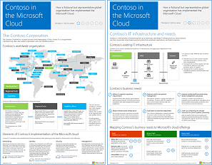

# Contoso nel Microsoft CloudContoso in the Microsoft Cloud

 **Riepilogo:** modalità di adozione di un'infrastruttura IT con cloud da parte di un'organizzazione fittizia ma rappresentativa a livello internazionale con le offerte cloud di Microsoft.**Summary:** How a fictional but representative global organization is adopting a cloud-inclusive IT infrastructure with Microsoft's cloud offerings.
  
In questo articolo sono disponibili dei collegamenti a un insieme di articoli in cui viene descritto il modo in cui Contoso Corporation, un complesso industriale globale con sede principale a Parigi, passa a un'infrastruttura IT con cloud e prende decisioni importanti sulla progettazione di rete, identità e sicurezza, oltre al modo in cui vengono implementati gli scenari cloud aziendali per risolvere i problemi aziendali. È possibile visualizzare queste informazioni anche come poster di 11 pagine e stamparlo in formato tabloid (noto anche come ledger, 11 x 17 o A3).This article links you to a set of articles that describe how the Contoso Corporation, a global manufacturing conglomerate with its headquarters in Paris, is embracing a cloud-inclusive IT infrastructure and has addressed major design decisions for networking, identity, and security and how it is implementing enterprise cloud scenarios to address its business problems. You can also view this information as an 11-page poster and print it in tabloid format (also known as ledger, 11 x 17, or A3).
  

  
[PDF](https://go.microsoft.com/fwlink/p/?linkid=842085)  | [Visio](https://go.microsoft.com/fwlink/p/?linkid=842086)  | [Altre lingue](https://www.microsoft.com/download/details.aspx?id=54427)[PDF](https://go.microsoft.com/fwlink/p/?linkid=842085)  | [Visio](https://go.microsoft.com/fwlink/p/?linkid=842086)  | [More languages](https://www.microsoft.com/download/details.aspx?id=54427)
  
Vedere le seguenti sezioni:See the following sections:
  
- [Panoramica del cloud ibridaHybrid cloud overview](hybrid-cloud-overview.md)
    
    Contoso Corporation è un'azienda conglomerata di produzione, vendita e supporto con oltre 100.000 prodotti.The Contoso Corporation is a global conglomerate manufacturing, sales, and support organization with over 100,000 products.
    
- [Contoso è necessario e dell'infrastruttura ITContoso's IT infrastructure and needs](contoso-it-infrastructure-and-needs.md)
    
    Contoso è in fase di transizione da un'infrastruttura IT centralizzata locale a un'infrastruttura inclusiva di cloud che incorpora carichi di lavoro di produttività personale basati su cloud, applicazioni e scenari ibridi.Contoso is transitioning from an on-premises, centralized IT infrastructure to a cloud-inclusive one that incorporates cloud-based personal productivity workloads, applications, and hybrid scenarios.
    
- [Servizi di rete per Contoso CorporationNetworking for the Contoso Corporation](networking-for-the-contoso-corporation.md)
    
    Per garantire prestazioni ottimali per i servizi basati su cloud, gli ingegneri di rete di Contoso hanno perfezionato il traffico della connessione Internet.For best performance to cloud-based services, Contoso's network engineers optimized traffic to their Internet edge and across the Internet.
    
- [Identità per Contoso CorporationIdentity for the Contoso Corporation](identity-for-the-contoso-corporation.md)
    
    L'identità di Contoso nella soluzione cloud sfrutta il provider di identità locale e include l'autenticazione federativa con i provider di identità di terze parti attendibili esistenti.Contoso's identity in the cloud solution leverages their on-premises identity provider and includes federated authentication with their existing trusted, third-party identity providers.
    
- [Sottoscrizioni, licenze e account utente per Contoso CorporationSubscriptions, licenses, and user accounts for the Contoso Corporation](subscriptions-licenses-and-user-accounts-for-the-contoso-corporation.md)
    
    Contoso utilizza la gerarchia organizzazione/sottoscrizioni/licenze/account utente per accedere alle offerte cloud di Microsoft.Contoso uses the organization/subscriptions/licenses/user accounts hierarchy to access Microsoft's cloud offerings.
    
- [Sicurezza per Contoso CorporationSecurity for the Contoso Corporation](security-for-the-contoso-corporation.md)
    
    Al momento della transizione dall'infrastruttura IT a un'infrastruttura inclusiva di cloud, Contoso ha verificato che i requisiti di sicurezza locale fossero supportati e implementati nelle offerte cloud di Microsoft.When transitioning their IT infrastructure to a cloud-inclusive one, Contoso made sure that their on-premises security requirements were supported and implemented in Microsoft's cloud offerings.
    
- [Scenari aziendali per Contoso CorporationEnterprise scenarios for the Contoso Corporation](enterprise-scenarios-for-the-contoso-corporation.md)
    
    Vedere in che modo Contoso risponde alle proprie esigenze di business tramite le offerte cloud di Microsoft.See how Contoso is addressing its business needs with Microsoft's cloud offerings.
    
> [!NOTE]
> Questi articoli riflettono la versione di **settembre 2017** del poster Contoso in Microsoft Cloud.These articles reflect the **September 2017** release of the Contoso in the Microsoft Cloud poster.
  
## Vedere ancheSee Also

[Risorse sull'architettura IT del cloud MicrosoftMicrosoft Cloud IT architecture resources](microsoft-cloud-it-architecture-resources.md)

[Guida di orientamento del cloud aziendale Microsoft: risorse per i decision maker del settore ITMicrosoft's Enterprise Cloud Roadmap: Resources for IT Decision Makers](https://sway.com/FJ2xsyWtkJc2taRD)

