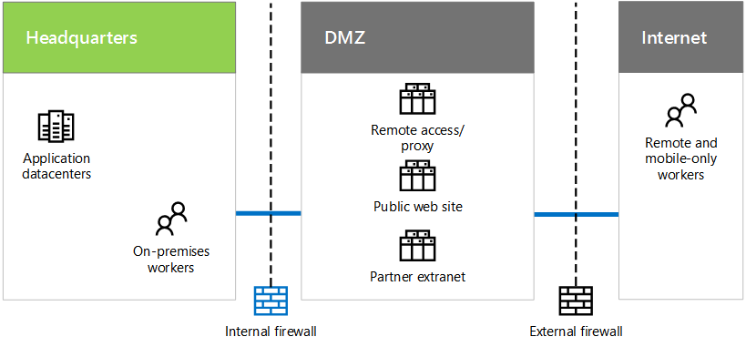

# Contoso è necessario e dell'infrastruttura ITContoso's IT infrastructure and needs

 **Riepilogo:** Acquisire familiarità con la struttura di base di Contoso locale come la propria attività è necessario possono essere soddisfatti dall'offerte cloud di Microsoft e l'infrastruttura IT.**Summary:** Understand the basic structure of Contoso's on-premises IT infrastructure and how its business needs can be met by Microsoft's cloud offerings.
  
Contoso è in fase di transizione da un locale, l'infrastruttura IT centralizzata per uno inclusi cloud che incorpora carichi di lavoro per la produttività personale basato su cloud, le applicazioni e gli scenari ibridi.Contoso is in the process of transitioning from an on-premises, centralized IT infrastructure to a cloud-inclusive one that incorporates cloud-based personal productivity workloads, applications, and hybrid scenarios.
  
## Infrastruttura IT esistente di ContosoContoso's existing IT infrastructure

Contoso utilizza un principalmente centralizzato sull'infrastruttura IT, con centri dati applicazione nella sede centrale Parigi locale.Contoso uses a mostly centralized on-premises IT infrastructure, with application datacenters in the Paris headquarters.
  
**Nella figura 1: Infrastruttura IT Contoso****Figure 1: Contoso's existing IT infrastructure**

  
Nella figura 1 viene illustrata una sede con centri dati applicazione, DMZ e Internet.Figure 1 shows a headquarters office with application datacenters, a DMZ, and the Internet.
  
In Contoso DMZ, fornire diversi set dei server:In Contoso's DMZ, different sets of servers provide:
  
- Accesso remoto per l'inoltro di intranet e del web Contoso per i propri colleghi in sede Paris.Remote access to the Contoso intranet and web proxying for workers in the Paris headquarters.
    
- Hosting per il sito web pubblico Contoso, da cui i clienti possono ordinare prodotti, Web part o forniture.Hosting for the Contoso public web site, from which customers can order products, parts, or supplies.
    
- Per i partner di Contoso extranet per partner comunicazione e collaborazione di hosting.Hosting for the Contoso partner extranet for partner communication and collaboration.
    
## Esigenze aziendali di ContosoContoso's business needs

Di seguito sono le esigenze aziendali di Contoso in ordine di priorità:Here are Contoso's business needs in priority order:
  
1. Rispettare le normative internazionaliAdhere to regional regulatory requirements
    
    Per evitare multe e mantenere una buona relazioni con gli enti pubblici hanno locale, Contoso deve garantire la conformità alle normative di archiviazione e la crittografia dei dati.To prevent fines and maintain good relations with local governments, Contoso must ensure compliance with data storage and encryption regulations.
    
2. Migliorare la gestione di fornitori e partnerImprove vendor and partner management
    
    Partner extranet è durata e costosa da gestire. Contoso desidera sostituire con una soluzione basata su cloud che utilizza l'autenticazione federata.The partner extranet is aging and expensive to maintain. Contoso wants to replace it with a cloud-based solution that uses federated authentication.
    
3. Migliorare la produttività della forza lavoro mobile, la gestione dei dispositivi e accessoImprove mobile workforce productivity, device management, and access
    
    Forza lavoro mobile sola Contoso è l'espansione ed è la gestione dei dispositivi per garantire un accesso più efficiente alle risorse e protezione della proprietà intellettuale.Contoso's mobile-only workforce is expanding and needs device management to ensure intellectual property protection and more efficient access to resources.
    
4. Riduzione dell'infrastruttura di accesso remotoReduce remote access infrastructure
    
    Spostando le risorse normalmente utilizzate da dipendenti remoti nel cloud, Contoso verrà risparmiare denaro grazie alla riduzione dei costi di manutenzione e supporto per la propria soluzione di accesso remoto.By moving resources commonly accessed by remote workers to the cloud, Contoso will save money by reducing maintenance and support costs for their remote access solution.
    
5. Implementare la scalabilità verso il basso centri dati localiScale down on-premises datacenters
    
    Datacenter Contoso contenere centinaia di server, alcuni dei quali esegue legacy o archiviazione funzioni che distrarre il personale IT di gestione dei carichi di lavoro valore elevato per l'azienda.The Contoso datacenters contain hundreds of servers, some of which are running legacy or archival functions that distract IT staff from maintaining high business value workloads.
    
6. Risorse di elaborazione e di archiviazione di implementare la scalabilità verticale per l'elaborazione di fine del quartoScale-up computing and storage resources for end-of-quarter processing
    
    Proiezione di elaborazione e gestione dell'inventario e contabilità fine del quarto è necessario aumentare a breve termine nel server e archiviazione.End-of-quarter financial accounting and projection processing along with inventory management requires short-term increases in servers and storage.
    
## Mapping aziendali di Contoso è necessario offerte cloud di MicrosoftMapping Contoso's business needs to Microsoft's cloud offerings

Basato su un'analisi delle offerte cloud di Microsoft, Contoso del reparto IT determinato il mapping seguente:Based on an analysis of Microsoft's cloud offerings, Contoso's IT department determined the following mapping:
  
|**Software come servizio (SaaS)****Software as a Service (SaaS)**|**Piattaforma as a Service (PaaS Azure)****Platform as a Service (Azure PaaS )**|**Infrastructure as a Service (Azure IaaS)****Infrastructure as a Service (Azure IaaS )**|
|:-----|:-----|:-----|
|**Office 365:** Applicazioni di principale per la produttività personale e di gruppo nel cloud.**Office 365:** Primary personal and group productivity applications in the cloud.   Le esigenze aziendali: 1 3 5Business needs: 1 3 5    |Ospitare vendite e supporto di documenti e informazioni sui sistemi utilizzando applicazioni basate su cloud.Host sales and support documents and information systems using cloud-based apps.    Esigenza azienda: 3Business need: 3    |Spostare i sistemi legacy e archiviare i server basati su cloud.Move archival and legacy systems to cloud-based servers.    Esigenza azienda: 5Business need: 5    |
|**Dynamics 365:** Utilizzare la gestione di fornitori e clienti basata su cloud. Rimuovere partner extranet nella DMZ.**Dynamics 365:** Use cloud-based customer and vendor management. Remove partner extranet in the DMZ.   Esigenza azienda: 2Business need: 2    |Applicazioni per dispositivi mobili sono basati sul cloud, anziché Parigi basate su Data Center.Mobile applications are cloud-based, rather than Paris datacenter-based.    Le esigenze aziendali: 4 3Business needs: 3 4    |Eseguire la migrazione dei dati da centri dati locali e le applicazioni di utilizzo poco.Migrate low-use apps and data out of on-premises datacenters.    Esigenza azienda: 5Business need: 5    |
|**Intune/EMS:** Gestire iOS e dispositivi Android.**Intune/EMS:** Manage iOS and Android devices.   Esigenza azienda: 3Business need: 3    ||Aggiungere server temporanei e archiviazione per esigenze di elaborazione di fine del trimestre.Add temporary servers and storage for end-of-quarter processing needs.    Esigenza azienda: 6Business need: 6    |
   
## See AlsoSee Also

[Contoso nel Microsoft CloudContoso in the Microsoft Cloud](contoso-in-the-microsoft-cloud.md)
  
[Risorse sull'architettura IT del cloud MicrosoftMicrosoft Cloud IT architecture resources](microsoft-cloud-it-architecture-resources.md)

[Guida di orientamento del cloud aziendale Microsoft: risorse per i decision maker del settore ITMicrosoft's Enterprise Cloud Roadmap: Resources for IT Decision Makers](https://sway.com/FJ2xsyWtkJc2taRD)

