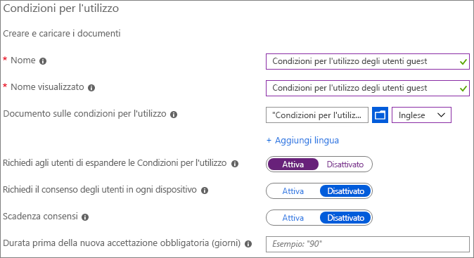
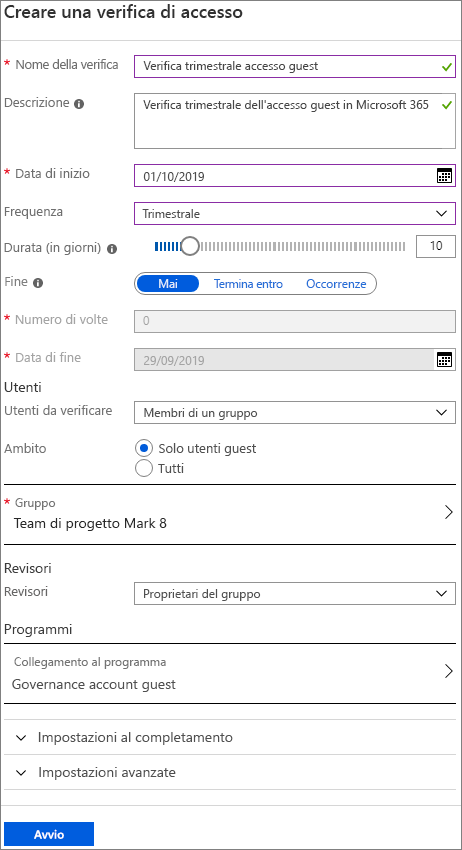
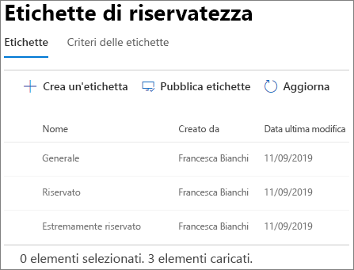
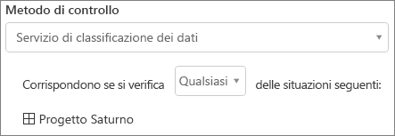
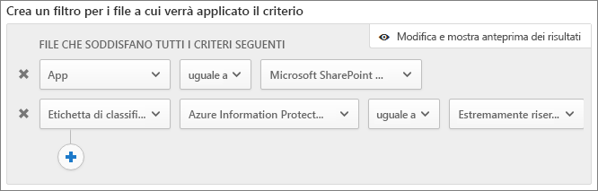

# Creare un ambiente di condivisione guest sicuroCreate a secure guest sharing environment

In questo articolo verranno descritte varie opzioni per la creazione di un ambiente di condivisione guest sicuro in Microsoft 365.In this article, we'll walk through a variety of options for creating a secure guest sharing environment in Microsoft 365. Si tratta di uno scenario di esempio pensato per offrire una panoramica delle opzioni disponibili.This is an example scenario to give you an idea of the options available. È possibile usare queste procedure in diverse combinazioni per soddisfare le esigenze di sicurezza e conformità della propria organizzazione.You can use these procedures in different combinations to meet the security and compliance needs of your organization. Alla fine dell'articolo verrà illustrato un test case per osservare il funzionamento combinato di alcune di queste opzioni.At the end of the article, we'll walk through a test case to see how some of these options work together.

Questo scenario include:This scenario includes:

- Configurazione dell'autenticazione a più fattori per i guest.Setting up multi-factor authentication for guests.
- Configurazione di condizioni per l'utilizzo per gli utenti guest.Setting up a terms of use for guests.
- Configurazione di verifiche trimestrali dell'accesso guest per controllare periodicamente se per gli utenti guest continuano a essere necessarie autorizzazioni per team e siti.Setting up quarterly guest access reviews to periodically validate whether guests continue to need permissions to teams and sites.
- Limitazione degli utenti guest all'accesso solo Web per i dispositivi non gestiti.Restricting guests to web-only access for unmanaged devices.
- Configurazione di criteri di timeout della sessione per assicurarsi che gli utenti guest eseguano l'autenticazione quotidianamente.Configuring a session timeout policy to ensure guests authenticate daily.
- Creazione e pubblicazione di etichette di riservatezza per classificare il contenuto.Creating and publishing sensitivity labels to classify content.
- Creazione di un tipo di informazioni sensibili per un progetto estremamente riservato.Creating a sensitive information type for a highly confidential project.
- Assegnazione automatica di un'etichetta *Estremamente riservato* ai documenti che contengono il tipo di informazioni sensibili.Automatically assigning a *highly confidential* label to documents that contain the sensitive information type.
- Rimozione automatica dell'accesso guest dai file etichettati come *estremamente riservati*.Automatically removing guest access from files labeled as *highly confidential*.

Alcune delle opzioni descritte in questo articolo richiedono che i guest abbiano un account in Azure Active Directory.Some of the options discussed in this article require guests to have an account in Azure Active Directory. Per fare in modo che gli utenti guest siano inclusi nella directory quando si condividono con loro file e cartelle, usare l'[anteprima dell'integrazione di SharePoint e OneDrive con Azure AD B2B](https://docs.microsoft.com/sharepoint/sharepoint-azureb2b-integration-preview).To ensure that guests are included in the directory when you share files and folders with them, use the [SharePoint and OneDrive integration with Azure AD B2B Preview](https://docs.microsoft.com/sharepoint/sharepoint-azureb2b-integration-preview).

Si noti che in questo articolo non verranno illustrate le impostazioni per l'abilitazione della condivisione guest.Note that we won't discuss enabling guest sharing settings in this article. Per informazioni dettagliate su come abilitare la condivisione guest per scenari diversi, vedere [Collaborare con utenti esterni all'organizzazione](https://docs.microsoft.com/Office365/Enterprise/collaborating-with-people-outside-your-organization).See [Collaborating with people outside your organization](https://docs.microsoft.com/Office365/Enterprise/collaborating-with-people-outside-your-organization) for details about enabling guest sharing for different scenarios.

## Configurare l'autenticazione a più fattori per gli utenti guestSet up multi-factor authentication for guests

L'autenticazione a più fattori riduce notevolmente la possibilità di compromissione di un account.Multi-factor authentication greatly reduces the chances of an account being compromised. Dal momento che gli utenti guest possono usare account di posta elettronica personali che non aderiscono a criteri di governance o procedure consigliate, richiedere l'autenticazione a più fattori per i guest è particolarmente importante.Since guest users may be using personal email accounts that don't adhere to any governance policies or best practices, it's especially important to require multi-factor authentication for guests. Qualora il nome utente e la password di un utente guest fossero rubati, l'uso di un secondo fattore di autenticazione ridurrebbe notevolmente le possibilità che soggetti sconosciuti possano accedere ai siti e ai file dell'organizzazione.If a guest user's username and password is stolen, requiring a second factor of authentication greatly reduces the chances of unknown parties gaining access to your sites and files.

In questo esempio verrà configurata l'autenticazione a più fattori per gli utenti guest usando criteri di accesso condizionale in Azure Active Directory.In this example, we'll set up multi-factor authentication for guests by using a conditional access policy in Azure Active Directory.

Per configurare l'autenticazione a più fattori per i guestTo set up multi-factor authentication for guests
1. In Microsoft Azure cercare *Accesso condizionale*.In Microsoft Azure, search for *Conditional access*.
2. Nel pannello **Accesso condizionale - Criteri** selezionare **Nuovi criteri**.On the **Conditional Access - Policies** blade, click **New policy**.
3. Nel campo **Nome** digitare *MFA guest*.In the **Name** field, type *Guest MFA*.
4. In **Assegnazioni** fare clic su **Utenti e gruppi**.Under **Assignments**, click **Users and groups**.
5. Nel pannello **Utenti e gruppi** scegliere **Seleziona utenti e gruppi**, selezionare la casella di controllo **Tutti gli utenti guest ed esterni** e quindi fare clic su **Fatto**.On the **Users and groups** blade, select **Select users and groups**, select the **All guests and external users** check box, and then click **Done**.
4. In **Controlli di accesso** fare clic su **Concedi**.Under **Access controls**, click **Grant**.
5. Nel pannello **Concedi** selezionare la casella di controllo **Richiedi autenticazione a più fattori** e quindi fare clic su **Seleziona**.On the **Grant** blade, select the **Require multi-factor authentication** check box, and then click **Select**.
6. Nel pannello **Nuovo**, in **Abilita criterio** fare clic su **Sì** e quindi su **Crea**.On the **New** blade, under **Enable policy**, click **On**, and then click **Create**.

Ora gli utenti guest dovranno effettuare la registrazione all'autenticazione a più fattori per poter accedere a team, siti o contenuti condivisi.Now, guest will be required to enroll in multi-factor authentication before they can access shared content, sites, or teams.

### Altre informazioniMore information

[Pianificazione di una distribuzione di Azure Multi-Factor Authentication basata su cloudPlanning a cloud-based Azure Multi-Factor Authentication deployment](https://docs.microsoft.com/azure/active-directory/authentication/howto-mfa-getstarted)

## Configurare un documento di condizioni per l'utilizzo per gli utenti guestSet up a terms of use for guests

Spesso gli utenti guest non hanno firmato accordi di non divulgazione o altri accordi legali con l'organizzazione.Often times guest users may not have signed non-disclosure agreements or other legal agreements with your organization. Si può richiedere ai guest di accettare le condizioni per l'utilizzo prima di accedere ai file che sono stati condivisi con loro.You can require guests to agree to a terms of use before accessing files that are shared with them. Le condizioni per l'utilizzo possono essere visualizzate al primo tentativo di accesso a un file o a un sito condiviso.The terms of use can be displayed the first time they attempt to access a shared file or site.

Per creare le condizioni di utilizzo, è necessario prima di tutto creare il documento in Word o in un'altra applicazione e quindi salvarlo come file PDF.To create a terms of use, you first need to create the document in Word or another authoring program, and then save it as a .pdf file. Successivamente, si potrà caricare il file in Azure AD.This file can then be uploaded to Azure AD.

Per creare un documento di condizioni per l'utilizzo di Azure ADTo create an Azure AD terms of use
1. Accedere ad Azure come amministratore globale, amministratore della sicurezza o amministratore di accesso condizionale.Sign in to Azure as a Global Administrator, Security Administrator, or Conditional Access Administrator.
2. Passare a [Condizioni per l'utilizzo](https://aka.ms/catou).Navigate to [Terms of use](https://aka.ms/catou).
3. Fare clic su **Nuove condizioni**.Click **New terms**. 
   
4. Nelle caselle **Nome** e **Nome visualizzato** digitare *Condizioni per l'utilizzo guest*.In the **Name** and **Display name** boxes, type *Guest terms of use*.
6. Per **Documento sulle Condizioni per l'utilizzo** passare al file PDF creato e selezionarlo.For **Terms of use document**, browse to the pdf file that you created and select it.
7. Selezionare la lingua per il documento delle condizioni per l'utilizzo.Select the language for your terms of use document.
8. Impostare **Richiedi agli utenti di espandere le Condizioni per l'utilizzo** su **Attivata**.Set **Require users to expand the terms of use** to **On**.
9. In **Accesso condizionale**, nell'elenco **Applica con i modelli di criteri per l'accesso condizionale** scegliere **Crea criteri di accesso condizionale in seguito**.Under **Conditional Access**, in the **Enforce with Conditional Access policy template** list choose **Create conditional access policy later**.
10. Fare clic su **Crea**.Click **Create**.

Dopo aver creato le condizioni per l'utilizzo, il passaggio successivo consiste nel creare criteri di accesso condizionale che mostrano il documento agli utenti guest.Once you've created the terms of use, the next step is to create a conditional access policy that displays the terms of use to guest users.

Per creare i criteri di accesso condizionaleTo create a conditional access policy
1. In Microsoft Azure cercare *Accesso condizionale*.In Microsoft Azure, search for *Conditional access*.
2. Nel pannello **Accesso condizionale - Criteri** selezionare **Nuovi criteri**.On the **Conditional Access - Policies** blade, click **New policy**.
3. Nella casella **Nome** digitare *Condizioni per l'utilizzo per gli utenti guest*.In the **Name** box, type *Guest user terms of use policy*.
4. In **Assegnazioni** fare clic su **Utenti e gruppi**.Under **Assignments**, click **Users and groups**.
5. Nel pannello **Utenti e gruppi** scegliere **Seleziona utenti e gruppi**, selezionare la casella di controllo **Tutti gli utenti guest ed esterni** e quindi fare clic su **Fatto**.On the **Users and groups** blade, select **Select users and groups**, select the **All guests and external users** check box, and then click **Done**.
6. In **Assegnazioni** fare clic su **Applicazioni cloud o azioni**.Under **Assignments**, click **Cloud apps or actions**.
7. Nella scheda **Includi** scegliere **Seleziona le app** e quindi fare clic su **Seleziona**.On the **Include** tab, select **Select apps**, and then click **Select**.
8. Nel pannello **Seleziona** scegliere **Microsoft Teams**, **Office 365 SharePoint Online** e \*\*Outlook Groups \*\*, quindi fare clic su **Seleziona**.On the **Select** blade, select **Microsoft Teams**, **Office 365 SharePoint Online**, and **Outlook Groups**, and then click **Select**.
9. Nel pannello **Applicazioni cloud o azioni** fare clic su **Fatto**.On the **Cloud apps or actions** blade, click **Done**.
10. In **Controlli di accesso** fare clic su **Concedi**.Under **Access controls**, click **Grant**.
11. Nel pannello **Concedi** selezionare **Condizioni per l'utilizzo guest** e quindi fare clic su **Seleziona**.On the **Grant** blade, select **Guest terms of use**, and then click **Select**.
12. Nel pannello **Nuovo**, in **Abilita criterio** fare clic su **Sì** e quindi su **Crea**.On the **New** blade, under **Enable policy**, click **On**, and then click **Create**.

Ora, la prima volta che un utente guest tenterà di accedere al contenuto, a un team o a un sito dell'organizzazione, dovrà accettare le condizioni per l'utilizzo.Now, the first time a guest user attempts to access content or a team or site in your organization, they will be required to accept the terms of use.

### Altre informazioniMore information
[Condizioni per l'utilizzo di Azure Active DirectoryAzure Active Directory terms of use](https://docs.microsoft.com/azure/active-directory/conditional-access/terms-of-use)

## Configurare le verifiche di accesso per gli utenti guestSet up guest access reviews

Le verifiche di accesso in Azure AD consentono di automatizzare una revisione periodica dell'accesso degli utenti a diversi team e gruppi.With access reviews in Azure AD, you can automate a periodic review of user access to various teams and groups. Richiedendo una verifica di accesso per gli utenti guest, ci si può assicurare che questi ultimi non mantengano l'accesso alle informazioni riservate dell'organizzazione più a lungo del necessario.By requiring an access review for guests specifically, you can help ensure guest users do not retain access to your organization's sensitive information for longer than is necessary.

Le verifiche di accesso possono essere organizzate in programmi.Access reviews can be organized into programs. Un programma è un raggruppamento di verifiche di accesso simili, che è possibile usare per organizzare le verifiche di accesso a scopi di reporting e controllo.A program is a grouping of similar access reviews that can be used to organize access reviews for reporting and auditing purposes.

In questo esempio si creerà un programma per le verifiche di accesso degli utenti guest.In this example, we'll create a program for guest access reviews.

Per creare un programmaTo create a program
1. Accedere al portale di Azure e aprire la pagina [Identity Governance](https://portal.azure.com/#blade/Microsoft_AAD_ERM/DashboardBlade).Sign in to the Azure portal and open the [Identity Governance page](https://portal.azure.com/#blade/Microsoft_AAD_ERM/DashboardBlade).
2. Nel menu a sinistra fare clic su **Programmi**.In the left menu, click **Programs**
3. Fare clic su **Nuovo programma**.Click **New program**.
4. Nella casella **Nome** digitare *Programma verifiche accesso guest*.In the **Name** box, type *Guest access review program*.
5. Nella casella **Descrizione** digitare *Programma per le verifiche di accesso degli utenti guest*.In the **Description** box, type *Program for guest access reviews*.
6. Fare clic su **Crea**.Click **Create**.

Una volta creato il programma, è possibile creare una verifica di accesso guest e associarla al programma.Once the program has been created, we can create a guest access review and associate it with the program.

Per configurare una verifica di accesso per gli utenti guestTo set up a guest user access review
1. Nel menu a sinistra della pagina [Identity Governance](https://portal.azure.com/#blade/Microsoft_AAD_ERM/DashboardBlade) fare clic su **Verifiche di accesso**.On the [Identity Governance page](https://portal.azure.com/#blade/Microsoft_AAD_ERM/DashboardBlade), in the left menu, click **Access reviews**.
2. Fare clic su **Nuova verifica di accesso**.Click **New access review**. 
   
3. Nella casella **Nome** digitare *Verifica trimestrale accesso guest*.In the **Name** box, type *Quarterly guest access review*.
4. Per **Frequenza** scegliere **Trimestrale**.For **Frequency**, choose **Quarterly**.
5. Per **Fine** scegliere **Mai**.For **End**, choose **Never**.
6. Per **Ambito** scegliere **Solo utenti guest**.For **Scope**, choose **Guest users only**.
7. Fare clic su **Raggruppa**, selezionare i gruppi che si vogliono includere nella verifica di accesso e quindi fare clic su **Seleziona**.Click **Group**, select the groups that you want to include in the access review, and then click **Select**.
8. In **Programmi** fare clic su **Collegamento al programma**.Under **Programs**, click **Link to program**.
9. Nel pannello **Selezionare un programma** scegliere **Programma verifiche accesso guest**On the **Select a program** blade, choose **Guest access review program**
10. Fare clic su **Avvia**.Click **Start**.

Verrà creata una revisione di accesso separata per ogni gruppo specificato.A separate access review is created for each group that you specify. I proprietari di ogni gruppo riceveranno un messaggio di posta elettronica trimestrale per approvare o negare l'accesso guest ai propri gruppi.Group owners of each groups will be emailed quarterly to approve or deny guest access to their groups.

È importante tenere presente che è possibile concedere ai guest l'accesso a team o gruppi oppure a singoli file e cartelle.It's important to note that guests can be given access to teams or groups, or to individual files and folders. Quando si fornisce loro l'accesso a file e cartelle, gli utenti guest possono anche non far parte di un gruppo specifico.When given access to files and folders, guests may not be added to any particular group. Se si vogliono eseguire verifiche di accesso sugli utenti guest che non appartengono a un team o a un gruppo, è possibile creare un gruppo dinamico in Azure AD per includere tutti i guest e quindi creare una verifica di accesso per tale gruppo.If you want to do access reviews on guest users who don't belong to a team or group, you can create a dynamic group in Azure AD to contain all guests and then create an access review for that group.

### Altre informazioniMore information
[Gestire l'accesso guest con le verifiche di accesso di Azure ADManage guest access with Azure AD access reviews](https://docs.microsoft.com/azure/active-directory/governance/manage-guest-access-with-access-reviews)

[Creare una verifica di accesso di gruppi o applicazioni nelle verifiche di accesso di Azure ADCreate an access review of groups or applications in Azure AD access reviews](https://docs.microsoft.com/azure/active-directory/governance/create-access-review)

## Configurare l'accesso solo Web per gli utenti guestSet up web-only access for guest users

Richiedendo agli utenti guest di accedere ai team, ai siti e ai file solo tramite un Web browser, è possibile ridurre la superficie di attacco e semplificare l'amministrazione.You can reduce your attack surface and ease administration by requiring guest users to access your teams, sites, and files by using a web browser only. Per fare questo si usano i criteri di accesso condizionale di Azure AD.This is done with an Azure AD conditional access policy.

Per limitare i guest al solo accesso WebTo restrict guests to web-ony access
1. In Microsoft Azure cercare *Accesso condizionale*.In Microsoft Azure, search for *Conditional access*.
2. Nel pannello **Accesso condizionale - Criteri** selezionare **Nuovi criteri**.On the **Conditional Access - Policies** blade, click **New policy**.
3. Nella casella **Nome** digitare *Accesso browser utenti guest*.In the **Name** box, type *Guest user browser access*.
4. In **Assegnazioni** fare clic su **Utenti e gruppi**.Under **Assignments**, click **Users and groups**.
5. Nel pannello **Utenti e gruppi** scegliere **Seleziona utenti e gruppi**, selezionare la casella di controllo **Tutti gli utenti guest ed esterni** e quindi fare clic su **Fatto**.On the **Users and groups** blade, select **Select users and groups**, select the **All guests and external users** check box, and then click **Done**.
6. In **Assegnazioni** fare clic su **Applicazioni cloud o azioni**.Under **Assignments**, click **Cloud apps or actions**.
7. Nella scheda **Includi** scegliere **Seleziona le app** e quindi fare clic su **Seleziona**.On the **Include** tab, select **Select apps**, and then click **Select**.
8. Nel pannello **Seleziona** scegliere **Microsoft Teams**, **Office 365 SharePoint Online** e \*\*Outlook Groups \*\*, quindi fare clic su **Seleziona**.On the **Select** blade, select **Microsoft Teams**, **Office 365 SharePoint Online**, and **Outlook Groups**, and then click **Select**.
9. Nel pannello **Applicazioni cloud o azioni** fare clic su **Fatto**.On the **Cloud apps or actions** blade, click **Done**.
10. In **Assegnazioni** fare clic su **Condizioni**.Under **Assignments**, click **Conditions**.
11. Nel pannello **Condizioni** fare clic su **App client**.On the **Conditions** blade, click **Client apps**.
12. Nel pannello **App client** fare clic su **Sì** per **Configura** e quindi selezionare le impostazioni **App per dispositivi mobili e client desktop** e **Client con autenticazione moderna**.On the **Client apps** blade, click **Yes** for **Configure**, and then select the **Mobile apps and desktop clients** and **Modern authentication clients** settings. 
    
13. Fare clic su **Fatto** e quindi sul pannello **Condizioni** fare di nuovo clic su **Fatto**.Click **Done**, and then on the **Conditions** blade, click **Done** again.
14. In **Controlli di accesso** fare clic su **Concedi**.Under **Access controls**, click **Grant**.
15. Nel pannello **Concedi** selezionare **Richiedi che i dispositivi siano contrassegnati come conformi** e **Richiedi dispositivo aggiunto ad Azure AD ibrido**.On the **Grant** blade, select **Require device to be marked as compliant** and **Require Hybrid Azure AD joined device**.
16. In **Per più controlli** selezionare **Richiedi uno dei controlli selezionati** e quindi fare clic su **Seleziona**.Under **For multiple controls**, select **Require one of the selected controls**, and then click **Select**.
17. Nel pannello **Nuovo**, in **Abilita criterio** fare clic su **Sì** e quindi su **Crea**.On the **New** blade, under **Enable policy**, click **On**, and then click **Create**.

## Configurare un timeout della sessione per gli utenti guestConfigure a session timeout for guest users

Richiedere ai guest di eseguire l'autenticazione a intervalli regolari può ridurre la possibilità che utenti sconosciuti accedano al contenuto dell'organizzazione se il dispositivo di un utente guest non è mantenuto al sicuro.Requiring guests to authenticate on a regular basis can reduce the possibility of unknown users accessing your organization's content if a guest user's device isn't kept secure. È possibile configurare un criterio di accesso condizionale di timeout della sessione per gli utenti guest in Azure AD.You can configure a session timeout conditional access policy for guest users in Azure AD.

Per configurare un criterio di timeout della sessione guestTo configure a guest session timeout policy
1. In Microsoft Azure cercare *Accesso condizionale*.In Microsoft Azure, search for *Conditional access*.
2. Nel pannello **Accesso condizionale - Criteri** selezionare **Nuovi criteri**.On the **Conditional Access - Policies** blade, click **New policy**.
3. Nella casella **Nome** digitare *Timeout sessioni guest*.In the **Name** box, type *Guest session timeout*.
4. In **Assegnazioni** fare clic su **Utenti e gruppi**.Under **Assignments**, click **Users and groups**.
5. Nel pannello **Utenti e gruppi** scegliere **Seleziona utenti e gruppi**, selezionare la casella di controllo **Tutti gli utenti guest ed esterni** e quindi fare clic su **Fatto**.On the **Users and groups** blade, select **Select users and groups**, select the **All guests and external users** check box, and then click **Done**.
6. In **Assegnazioni** fare clic su **Applicazioni cloud o azioni**.Under **Assignments**, click **Cloud apps or actions**.
7. Nella scheda **Includi** scegliere **Seleziona le app** e quindi fare clic su **Seleziona**.On the **Include** tab, select **Select apps**, and then click **Select**.
8. Nel pannello **Seleziona** scegliere **Microsoft Teams**, **Office 365 SharePoint Online** e \*\*Outlook Groups \*\*, quindi fare clic su **Seleziona**.On the **Select** blade, select **Microsoft Teams**, **Office 365 SharePoint Online**, and **Outlook Groups**, and then click **Select**.
9. Nel pannello **Applicazioni cloud o azioni** fare clic su **Fatto**.On the **Cloud apps or actions** blade, click **Done**.
10. In **Controlli di accesso** fare clic su **Sessione**.Under **Access controls**, click **Session**.
11. Nel pannello **Sessione** selezionare **Frequenza di accesso**.On the **Session** blade, select **Sign-in frequency**.
12. Selezionare **1** e **Giorni** per il periodo di tempo e quindi fare clic su **Seleziona**.Select **1** and **Days** for the time period, and then click **Select**.
13. Nel pannello **Nuovo**, in **Abilita criterio** fare clic su **Sì** e quindi su **Crea**.On the **New** blade, under **Enable policy**, click **On**, and then click **Create**.

## Creare etichette di riservatezzaCreate sensitivity labels

Le etichette di riservatezza possono essere usate in vari modi per classificare e proteggere le informazioni dell'organizzazione.Sensitivity labels can be used in a variety of ways to classify and protect your organization's information. In questo esempio viene illustrato come usare le etichette per semplificare la gestione dell'accesso guest a cartelle e file condivisi.In this example, we'll look at how labels can be used to help you manage guest access to shared files and folders.

Prima di tutto, si creeranno tre etichette di riservatezza nel Centro conformità di Microsoft 365:First, we'll create three sensitivity labels in the Microsoft 365 Compliance Center:

- GeneraleGeneral
- RiservatoConfidential
- Estremamente riservatoHighly Confidential

Attenersi alla procedura seguente per creare le etichette *Generale* e *Riservato*.Use the following procedure to create the *General* and *Confidential* labels.

Per creare un'etichetta di classificazione (Generale e Riservato)To create a classification label (General and Confidential)
1. Nel riquadro di spostamento sinistro del [Centro conformità Microsoft 365](https://compliance.microsoft.com) espandere **Classificazione** e quindi fare clic su **Etichette di riservatezza**.In the [Microsoft 365 Compliance Center](https://compliance.microsoft.com), in the left navigation, expand **Classification**, and then click **Sensitivity labels**.
2. Fare clic su **Crea un'etichetta**.Click **Create a label**.
3. In **Nome etichetta** digitare *Generale* o *Riservato*.In **Label name**, type *General* or *Confidential*.
4. In **Descrizione comando** digitare *Informazioni generali che possono essere condivise con dipendenti, guest e partner* o *Informazioni riservate. Condividere solo con dipendenti e guest autorizzati* e quindi fare clic su **Avanti**.In **Tooltip**, type *General information that can be shared with employees, guests, and partners* or *Confidential information. Share only with employees and authorized guests*, and then click **Next**.
5. Lasciare la crittografia\*\* \*\*disattivata e fare clic su **Avanti**.Leave encryption **Off** and click **Next**.
6. Lasciare il contrassegno dei contenuti\*\* \*\*disattivato e fare clic su **Avanti**.Leave content marking **Off** and click **Next**.
7. Lasciare la prevenzione della perdita dei dati degli endpoint\*\* \*\*disattivata e fare clic su **Avanti**.Leave endpoint data loss prevention **Off** and click **Next**.
8. Lasciare l'applicazione automatica di etichette\*\* \*\*disattivata e fare clic su **Avanti**.Leave auto labeling **Off** and click **Next**.
9. Fare clic su **Crea**.Click **Create**.

Con l'etichetta *Estremamente riservato*, ai documenti verranno aggiunte automaticamente filigrane con l'etichetta.With the *Highly Confidential* label, we'll add automatic watermarking of documents with the label.

Per creare un'etichetta di classificazione (Estremamente riservato)To create a classification label (Highly confidential)
1. Fare clic su **Crea un'etichetta**.Click **Create a label**.
2. In **Nome etichetta** digitare *Estremamente riservato*.In **Label name**, type *Highly confidential*.
3. In **Descrizione comando** digitare *Informazioni estremamente riservate. Non condividere con utenti guest*, e quindi fare clic su **Avanti**.In **Tooltip**, type *Highly confidential information. Do not share with guests*, and then click **Next**.
4. Lasciare la crittografia\*\* \*\*disattivata e fare clic su **Avanti**.Leave encryption **Off** and click **Next**.
5. Attivare il\*\* \*\*contrassegno contenuti, selezionare la casella di controllo **Aggiungi un'intestazione** e quindi fare clic su **Personalizza testo**.Turn content marking **On**, select the **Add a header** check box, and then click **Customize text**.
6. Digitare *Estremamente riservato* come testo dell'intestazione e quindi fare clic su **Salva**.Type *Highly confidential* for the header text and click **Save**.
7. Nella pagina \*\*Contrassegno contenuti\*\*\*\* \*\*attivare il contrassegno dei contenuti.On the **Content marking** page, turn content marking **On**.
8. Selezionare la casella di controllo **Aggiungi a filigrana** e quindi fare clic su **Personalizza testo**.Select the **Add a watermark** check box, and then click **Customize text**.
9. Per **Testo della filigrana** digitare *Estremamente riservato*.For **Watermark text**, type *Highly Confidential*.
10. Digitare *24* per **Dimensioni carattere** e quindi fare clic su **Salva**.Type *24* for **Font size**, and then click **Save**.
11. Nella pagina **Contrassegno contenuti** fare clic su **Avanti**.On the **Content marking** page, click **Next**.
12. Lasciare la prevenzione della perdita dei dati degli endpoint\*\* \*\*disattivata e fare clic su **Avanti**.Leave endpoint data loss prevention **Off** and click **Next**.
13. Lasciare l'applicazione automatica di etichette\*\* \*\*disattivata e fare clic su **Avanti**.Leave auto labeling **Off** and click **Next**.
14. Fare clic su **Crea**.Click **Create**.

Dopo aver creato le etichette, il passaggio successivo consiste nel pubblicarle.Once you've created the labels, the next step is to publish them. 

Per pubblicare le etichetteTo publish labels
1. Nella pagina **Etichette di riservatezza** fare clic su **Pubblica etichette**.On the **Sensitivity labels** page, click **Publish labels**.
2. Fare clic su **Scegliere le etichette da pubblicare**.Click **Choose labels to publish**.
3. Fare clic su **Aggiungi**, selezionare le etichette create e quindi fare clic su **Aggiungi**.Click **Add**, select the labels that you created, and then click **Add**.
4. Fare clic su **Fatto**.Click **Done**.
5. Fare clic su **Avanti**.Click **Next**.
6. Lasciare gli utenti e i gruppi impostati su **Tutti** e fare clic su **Avanti**.Leave the users and groups set to **All** and click **Next**.
7. Nell'elenco **Applica questa etichetta per impostazione predefinita a documenti e messaggi di posta elettronica** scegliere **Generale** e quindi fare clic su **Avanti**.In the **Apply this label by default to documents and email** list, choose **General**, and then click **Next**.
8. Nella pagina **Impostazioni criteri** digitare \*Riservatezza documento \* come nome e quindi fare clic su **Avanti**.On the **Policy settings** page, type *Document sensitivity* for the name, and then click **Next**.
9. Fare clic su **Pubblica**.Click **Publish**.

Dopo la pubblicazione, le etichette sono disponibili agli utenti delle app desktop di Office.With the labels published, they're available to users of Office desktop apps. Quando gli utenti applicano l'etichetta **Estremamente riservato**, al documento viene aggiunta automaticamente una filigrana.When users apply the **Highly Confidential** label, a watermark is automatically added to the document.

### Altre informazioniMore information
[Panoramica delle etichette di riservatezzaOverview of sensitivity labels](https://docs.microsoft.com/Office365/SecurityCompliance/sensitivity-labels)

## Creare un tipo di informazioni sensibili per un progetto estremamente riservatoCreate a sensitive information type for a highly confidential project

I tipi di informazioni sensibili sono stringhe predefinite che è possibile usare nei flussi di lavoro dei criteri per applicare i requisiti di conformità.Sensitive information types are predefined strings that can be used in policy workflows to enforce compliance requirements. Il Centro conformità di Microsoft 365 include oltre 100 tipi di informazioni sensibili, tra cui numeri di patente, numeri di carta di credito, numeri di conto corrente bancario e così via.The Microsoft 365 Compliance Center comes with over one hundred sensitive information types, including driver's license numbers, credit card numbers, bank account numbers, etc.

È possibile creare tipi personalizzati di informazioni sensibili per facilitare la gestione di contenuto specifico dell'organizzazione.You can create custom sensitive information types to help manage content specific to your organization. In questo esempio verrà creato un tipo di informazioni sensibili personalizzato per un progetto estremamente riservato.In this example, we'll create a custom sensitive information type for a highly confidential project. Si potrà poi usare questo tipo di informazioni sensibili per applicare un'etichetta di classificazione.We can then use this sensitive information type to automatically apply a classification label.

Per creare un tipo di informazioni sensibiliTo create a sensitive information type
1. Nel riquadro di spostamento sinistro del [Centro conformità Microsoft 365](https://compliance.microsoft.com) espandere **Classificazione** e quindi fare clic su **Tipi di informazioni sensibili**.In the [Microsoft 365 Compliance Center](https://compliance.microsoft.com), in the left navigation, expand **Classification**, and then click **Sensitive info types**.
2. Fare clic su **Crea**.Click **Create**.
3. Per **Nome** e **Descrizione** digitare **Progetto Saturno** e quindi fare clic su **Avanti**.For **Name** and **Description**, type **Project Saturn**, and then click **Next**.
4. Fare clic su **Aggiungere un elemento**.Click **Add an element**.
5. Nell'elenco **Rilevare il contenuto che contiene** selezionare **Parole chiave** e quindi digitare *Progetto Saturno* nella casella delle parole chiave.On the **Detect content containing** list, select **Keywords**, and then type *Project Saturn* in the keyword box.
6. Fare clic su **Avanti** e quindi su **Fine**.Click **Next**, and then click **Finish**.
7. Se viene chiesto se si vuole testare il tipo di informazioni sensibili, fare clic su **No**.If asked if you would like to test the sensitive information type, click **No**.

### Altre informazioniMore information
[Tipi di informazioni sensibili personalizzatiCustom sensitive information types](https://docs.microsoft.com/Office365/SecurityCompliance/custom-sensitive-info-types)

## Creare un criterio per assegnare un'etichetta in base a un tipo di informazioni sensibiliCreate a policy to assign a label based on a sensitive information type

Una volta creato il tipo di informazioni sensibili, è possibile creare un criterio file in Microsoft Cloud App Security in modo da applicare automaticamente l'etichetta *Estremamente riservato* ai documenti che contengono la stringa *Progetto Saturno*.Once the sensitive information type is created, we can create a file policy in Microsoft Cloud App Security to apply the *Highly Confidential* label to documents that contain the *Project Saturn* string automatically.

> [!NOTE]
> Esiste un processo di replica che rende disponibili le etichette di riservatezza in Cloud App Security.There is a replication process that makes sensitivity labels available in Cloud App Security. L'etichetta per un criterio potrebbe non essere immediatamente disponibile.You may not see the label available for a policy right away.

Per creare un criterio basato su un tipo di informazioni sensibiliTo create a sensitive information type-based file policy
1. Aprire [Microsoft Cloud App Security](https://portal.cloudappsecurity.com).Open [Microsoft Cloud App Security](https://portal.cloudappsecurity.com).
2. Nel riquadro di spostamento a sinistra espandere **Controllo**e quindi fare clic su **Criteri**.In the left navigation, expand **Control**, and then click **Policies**.
3. Fare clic su **Crea criterio** e quindi selezionare **Criteri file**.Click **Create policy**, and then choose **File policy**.
4. Per **Nome criterio** digitare *Etichette Progetto Saturno*.For **Policy name**, type *Project Saturn labeling*.
5. In **Crea un filtro per i file a cui verrà applicato il criterio** fare clic sulla X due volte per eliminare i filtri predefiniti.Under **Create a filter for the files this policy will act on**, click X twice to delete the default filters.
7. Nell'elenco **Seleziona un filtro** scegliere **App** e quindi scegliere **Microsoft SharePoint Online** nell'elenco **Seleziona le app**.In the **Select a filter** list, choose **App**, and then select **Microsoft SharePoint Online** from the **Select apps...** list.
8. In **Metodo di ispezione** scegliere **Servizio di classificazione dei dati**.Under **Inspection method**, choose **Data classification service**.
9. Nell'elenco **Scegliere un tipo di ispezione** selezionare **Tipo di informazioni sensibili**.On the **Choose inspection type** list, choose **Sensitive information type**.
10. Cercare e selezionare l'etichetta di riservatezza *Progetto Saturno* e quindi fare clic su **Fatto**.Search for and select the *Project Saturn* sensitivity label, and then click **Done**. 
   
11. In **Governance** espandere **Microsoft SharePoint Online**.Under **Governance**, expand **Microsoft SharePoint Online**.
12. Selezionare la casella di controllo **Applica un'etichetta di classificazione** e selezionare l'etichetta **Estremamente riservato**.Select the **Apply classification label** check box and select the **Highly Confidential** label.
13. Fare clic su **Crea**.Click **Create**.

Una volta impostato il criterio, se un utente digita "Progetto Saturno" in un documento, Cloud App Security applicherà automaticamente l'etichetta *Estremamente riservato* quando analizza il file.With the policy in place, when a user types "Project Saturn" into a document, Cloud App Security will automatically apply the *Highly Confidential* label when it scans the file.

### Altre informazioniMore information
[Criteri fileFile policies](https://docs.microsoft.com/cloud-app-security/data-protection-policies)

## Creare un criterio per rimuovere l'accesso guest ai file estremamente riservatiCreate a policy to remove guest access to highly confidential files

Nell'esempio di questo articolo, i file con l'etichetta *Estremamente riservato* non devono essere condivisi con gli utenti guest.In the example in this article, files with the *Highly Confidential* label shouldn't be shared with guests. È possibile creare un criterio file in Cloud App Security che rimuove automaticamente l'accesso guest dai file con tale etichetta.We can create a file policy in Cloud App Security that automatically removes guest access from files with that label.

Tenere presente che questo non impedisce agli utenti di condividere o ricondividere questi file.Note that this doesn't prevent users from sharing or re-sharing these files. L'organizzazione dipende comunque dal fatto che gli utenti rispettino i criteri di governance per i file archiviati in siti che consentono la condivisione guest.You're still reliant on your users to follow your governance policies for files that are stored in sites that allow guest sharing. Tuttavia, può essere uno strumento utile per rimuovere l'accesso guest dai file in cui sono state aggiunte informazioni riservate dopo che sono stati condivisi con utenti guest.However, this can be a useful tool for removing guest access from files that had confidential information added to them after they were shared with guests.

Per creare criteri file basati su etichetteTo create a label-based file policy
1. Aprire [Microsoft Cloud App Security](https://portal.cloudappsecurity.com).Open [Microsoft Cloud App Security](https://portal.cloudappsecurity.com).
2. Nel riquadro di spostamento a sinistra espandere **Controllo**e quindi fare clic su **Criteri**.In the left navigation, expand **Control**, and then click **Policies**.
3. Fare clic su **Crea criterio** e quindi selezionare **Criteri file**.Click **Create policy**, and then choose **File policy**.
4. Per **Nome criterio** digitare *Progetto Saturno - rimozione accesso guest*.For **Policy name**, type *Project Saturn - remove guest access*.
5. In **Crea un filtro per i file a cui verrà applicato il criterio** fare clic sulla X due volte per eliminare i filtri predefiniti.Under **Create a filter for the files this policy will act on**, click X twice to delete the default filters.
6. Nell'elenco **Seleziona un filtro** scegliere **App** e quindi scegliere **Microsoft SharePoint Online** nell'elenco **Seleziona le app**.In the **Select a filter** list, choose **App**, and then select **Microsoft SharePoint Online** from the **Select apps...** list.
7. Fare clic su **Aggiungi filtro**.Click **Add a filter**.
8. Nell'elenco **Seleziona un filtro** scegliere **Etichetta di classificazione** e quindi scegliere **Azure Information Protection** nell'elenco **Seleziona un filtro**.In the **Select a filter** list, choose **Classification label**, and then select **Azure Information Protection** from the **Select filter...** list.
9. Nell'elenco **Selezionare un'etichetta di classificazione** scegliere **Estremamente riservato**.In the **Select classification label** list, select **Highly Confidential**. 
   
10. In **Governance** espandere **Microsoft SharePoint Online**.Under **Governance**, expand **Microsoft SharePoint Online**.
11. Selezionare le caselle di controllo **Invia digest sulla corrispondenza con criteri al proprietario del file** e **Rimuovi gli utenti esterni**.Select the **Send policy-match digest to file owner** and **Remove external users** check boxes.
12. Per il messaggio di notifica personalizzato, digitare *Questo file è estremamente riservato. I criteri aziendali ne vietano la condivisione con utenti guest*.For the custom notification message, type *This file is highly confidential. Company policy prohibits sharing it with guests*.
13. Fare clic su **Crea**.Click **Create**.

È importante sottolineare che questo criterio rimuove l'accesso ai file condivisi con un collegamento *Utenti specifici*.It's important to note, that this policy removes access for files shared using a *Specific people* link. Non rimuove l'accesso dai collegamenti non autenticati (*Chiunque*).It doesn't remove access from unauthenticated (*Anyone*) links. Inoltre, non rimuove l'accesso se il guest è membro del sito o del team nel suo complesso.It also doesn't remove access if the guest is a member of the site or team as a whole. Se si prevede di avere documenti estremamente riservati in un sito o in un team con utenti guest, è consigliabile usare [canali privati in Teams](https://support.office.com/article/60ef929a-4d68-418b-bf4f-5784db184ec9) e consentire l'accesso ai canali privati solo ai membri dell'organizzazione.If you plan to have highly confidential documents in a site or team with guest members, consider using [private channels in Teams](https://support.office.com/article/60ef929a-4d68-418b-bf4f-5784db184ec9) and only allowing members of your organization in the private channels.

## Testare la soluzioneTest the solution

Per testare la soluzione descritta in questo articolo, creare un documento di Word e salvarlo in una raccolta documenti.To test the solution described in this article, create a Word document and save it to a document library. Condividere il file con un utente guest.Share the file with a guest user. Quando il guest prova ad accedere al documento, gli deve essere richiesto di effettuare la registrazione all'autenticazione a più fattori e quindi accettare le condizioni per l'utilizzo.When the guest attempts to access the document, they should be required to enroll in multi-factor authentication, and then accept the terms of use.

Quando il guest ha accesso al documento, digitare *Progetto Saturno* nel documento e salvarlo.Once the guest has access to the document, type *Project Saturn* in the document and save it. Quando Cloud App Security analizza il documento, dovrebbe essere applicata l'etichetta *Estremamente riservato* e l'utente guest non dovrebbe potervi più accedere.Once Cloud App Security scans the document, the *Highly Confidential* label should be applied and the guest user should no longer have access to it.

È possibile usare gli strumenti descritti in questo articolo in varie combinazioni, per creare un ambiente di condivisione con gli utenti guest produttivo, ma allo stesso tempo sicuro per l'organizzazione.You can use the tools described in this article in various combinations to help create a productive but safe guest sharing environment for your organization.

## Opzioni aggiuntiveAdditional options

Sono disponibili delle opzioni aggiuntive in Microsoft 365 e Azure Active Directory che possono aiutare a proteggere l'ambiente di condivisione guest.There are some additional options in Microsoft 365 and Azure Active Directory that can help secure your guest sharing environment.

- È possibile creare un elenco di domini di condivisione consentiti o rifiutati per limitare le persone con cui gli utenti possono condividere contenuti.You can create a list of allowed or denied sharing domains to limit who users can share with. Per altre informazioni, vedere [Limitare la condivisione di contenuti di SharePoint e OneDrive per dominio](https://docs.microsoft.com/sharepoint/restricted-domains-sharing) e [Consentire o bloccare gli inviti per gli utenti B2B da organizzazioni specifiche](https://docs.microsoft.com/azure/active-directory/b2b/allow-deny-list).See [Restrict sharing of SharePoint and OneDrive content by domain](https://docs.microsoft.com/sharepoint/restricted-domains-sharing) and [Allow or block invitations to B2B users from specific organizations](https://docs.microsoft.com/azure/active-directory/b2b/allow-deny-list) for more information.
- È possibile porre limiti agli altri tenant di Azure Active Directory a cui gli utenti possono connettersi.You can limit which other Azure Active Directory tenants your users can connect to. Per informazioni, vedere [Utilizzare le restrizioni del tenant per gestire l'accesso alle applicazioni cloud SaaS](https://docs.microsoft.com/azure/active-directory/manage-apps/tenant-restrictions).See [Use tenant restrictions to manage access to SaaS cloud applications](https://docs.microsoft.com/azure/active-directory/manage-apps/tenant-restrictions) for information.
- È possibile creare un ambiente gestito in cui i partner possano contribuire alla gestione degli account guest.You can create a managed environment where partners can help manage guest accounts. Per informazioni, vedere [Creare una Extranet B2B con guest gestiti](https://docs.microsoft.com/Office365/Enterprise/b2b-extranet).See [Create a B2B extranet with managed guests](https://docs.microsoft.com/Office365/Enterprise/b2b-extranet) for information.

## Vedere ancheSee Also

[Limitare l'esposizione accidentale ai file durante la condivisione con gli utenti guestLimit accidental exposure to files when sharing with guests](sharing-limit-accidental-exposure.md)

[Procedure consigliate per la condivisione di file e cartelle con utenti non autenticatiBest practices for sharing files and folders with unauthenticated users](best-practices-anonymous-sharing.md)
