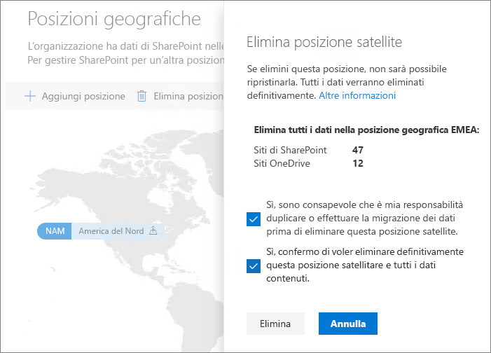

# Eliminare una posizione satellite in Microsoft 365 Multi-Geo

Se una posizione satellite non è più necessaria, è possibile eliminarla dal tenant dall'interfaccia di amministrazione di SharePoint.

> [!WARNING]
> Tutti i dati degli utenti nella posizione satellite verranno eliminati definitivamente. I dati eliminati comprendono tutto il contenuto di OneDrive for Business, i siti di SharePoint e le cassette postali di Exchange, tra cui le cassette postali dei gruppi di Microsoft 365. Prima di eliminare la posizione satellite, è necessario migrare i dati a un'altra posizione satellitare o centrale. Questa azione non può essere annullata.

Solo gli amministratori globali possono eliminare le posizioni satellite.

Per eliminare una posizione satellite

1. Aprire l'interfaccia di amministrazione di SharePoint

2. Andare alla scheda **Posizioni geografiche**.

3. Nella mappa, fare clic sulla posizione geografica che si desidera eliminare.

4. Fare clic su **Elimina posizione**.

5. Confermare l'eliminazione selezionando le caselle di controllo di conferma.

6. Fare clic su **Elimina**.
