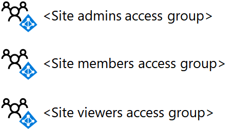
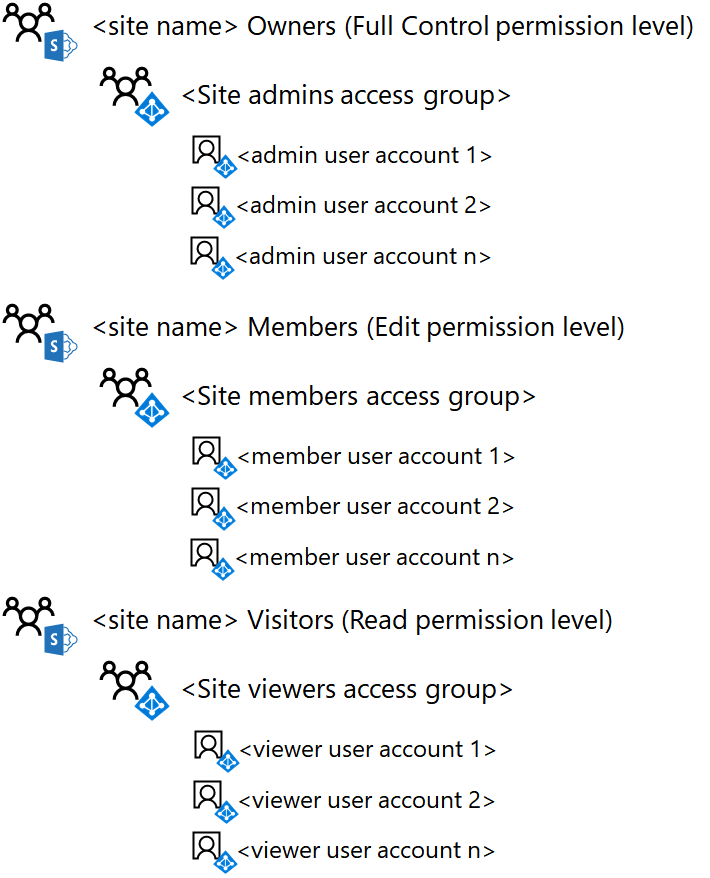

# <a name="deploy-an-isolated-sharepoint-online-team-site"></a>Distribuire un sito del team di SharePoint Online isolato

 **Riepilogo:** Distribuire un nuovo sito del team SharePoint Online isolato, con queste istruzioni dettagliate.
  
In questo articolo viene fornita una guida dettagliata alla distribuzione per creare e configurare un sito del team di SharePoint Online isolato in Microsoft Office 365. Questa procedura presuppone l'utilizzo di tre gruppi di SharePoint predefiniti e dei livelli di autorizzazione corrispondenti, con un singolo gruppo di Azure Active Directory (AD) per ogni livello di accesso.
  
## <a name="phase-1-create-and-populate-the-team-site-access-groups"></a>Fase 1: Creare e compilare i gruppi di accesso del sito del team

In questa fase, vengono creati tre gruppi di accesso basati su Azure AD per i tre gruppi di SharePoint predefiniti e vengono popolati con gli account utente appropriati.
  
> [!NOTE]
> La procedura seguente presuppone che tutti gli account utente necessari già esistano e siano dotati delle licenze appropriate. In caso contrario, aggiungerli e assegnare le licenze prima di procedere con il passaggio 1. 
  
### <a name="step-1-list-the-sharepoint-online-admins-for-the-site"></a>Passaggio 1: elencare gli amministratori di SharePoint Online per il sito

Determinare il set di account utente corrispondenti agli amministratori di SharePoint Online per il sito del team isolato.
  
Se si gestiscono account utente e gruppi con Office 365 e si desidera utilizzare Windows PowerShell, fare un elenco dei loro nomi dell'entità utente (UPN), ad esempio, UPN: belindan@contoso.com.
  
### <a name="step-2-list-the-members-for-the-site"></a>Passaggio 2: elencare i membri del sito

Determinare il set di account utente corrispondenti ai membri del sito del team isolato, quelli che collaboreranno sulle risorse archiviate nel sito.
  
Se si gestiscono account utente e gruppi con Office 365 e si desidera utilizzare PowerShell, fare un elenco dei loro UPN. Se sono presenti molti membri del sito, è possibile archiviare l'elenco di UPN in un file di testo e aggiungerli con un singolo comando di PowerShell.
  
### <a name="step-3-list-the-viewers-for-the-site"></a>Passaggio 3: elencare i visualizzatori del sito

Determinare il set di account utente corrispondenti ai visualizzatori del sito del tam isolato, quelli che possono visualizzare le risorse archiviate nel sito ma non modificarle o collaborare direttamente sui contenuti.
  
Se si gestiscono account utente e gruppi con Office 365 e si desidera utilizzare PowerShell, fare un elenco dei loro UPN. Se sono presenti molti membri del sito, è possibile archiviare l'elenco di UPN in un file di testo e aggiungerli con un singolo comando di PowerShell.
  
I visualizzatori del sito potrebbero includere la direzione esecutiva, i consulenti legali o gli stakeholder interdipartimentali.
  
### <a name="step-4-create-the-three-access-groups-for-the-site-in-azure-ad"></a>Passaggio 4: creare i tre gruppi di accesso per il sito di Azure AD

È necessario creare i gruppi di accesso seguenti in Azure AD:
  
- Amministratori del sito (che contiene l'elenco creato al passaggio 1)
    
- Membri del sito (che contiene l'elenco creato al passaggio 2)
    
- Visualizzatori del sito (che contiene l'elenco creato al passaggio 3)
    
1. Nel browser, accedere al portale di Azure in [https://portal.azure.com](https://portal.azure.com) e accedere con le credenziali di un account assegnato con ruolo di amministratore Gestione utente o amministratore aziendale.
    
2. Nel portale di Azure, fare clic su **Azure Active Directory > utenti e gruppi > tutti i gruppi di**.
    
3. Su blade **tutti i gruppi** , fare clic su **+ nuovo gruppo**.
    
4. Su blade **gruppo** :
    
  - Digitare il nome del gruppo nella **casella Nome**.
    
  - In **appartenenza**, selezionare **assegnato** .
    
  - Fare clic su **Sì** per **caratteristiche di attivare Office**.
    
5. Fare clic su **Crea**e quindi chiudere blade **gruppo** .
    
6. Ripetere i passaggi da 3 a 5 per i gruppi aggiuntivi.
    
> [!NOTE]
> È necessario utilizzare il portale di Azure per creare i gruppi che dispongono di funzionalità di Office attivata. Se un sito di SharePoint Online isolato in seguito è configurato come sito altamente riservati con un'etichetta di protezione informazioni Azure (AIP) per crittografare i file e assegnare autorizzazioni a gruppi specifici, i gruppi autorizzati devono essere stati creati con caratteristiche di Office abilitato. È possibile modificare l'impostazione di funzionalità di Office di un gruppo di Azure Active Directory dopo che è stato creato. 
  
Di seguito è la configurazione risultante con i gruppi di accesso di tre siti.
  

  
### <a name="step-5-add-the-user-accounts-to-the-access-groups"></a>Passaggio 5. Aggiungere gli account utente ai gruppi di accesso

In questo passaggio, eseguire la procedura riportata di seguito:
  
1. Aggiungere l'elenco di utenti creato nel passaggio 1 al gruppo di accesso degli amministratori del sito
    
2. Aggiungere l'elenco di utenti creato nel passaggio 2 al gruppo di accesso dei membri del sito
    
3. Aggiungere l'elenco di utenti creato nel passaggio 3 al gruppo di accesso dei visualizzatori del sito
    
Se si gestiscono account utente e gruppi con Windows Server AD, aggiungere gli utenti ai gruppi di accesso appropriati utilizzando le normali procedure di gestione di gruppi e utenti di Windows Server AD e attendere la sincronizzazione con l'abbonamento a Office 365.
  
Se si gestiscono account utente e gruppi con Office 365, è possibile utilizzare l'interfaccia di amministrazione di Office o PowerShell. Se si dispone di nomi di gruppo duplicati per uno dei gruppi di accesso, è necessario utilizzare l'interfaccia di amministrazione di Office.
  
Per l'interfaccia di amministrazione di Office, accedere con un account utente che è stato assegnato il ruolo di amministratore degli Account utente o amministratore aziendale e utilizzare gruppi aggiungere gli account utente appropriati e ai gruppi di accesso appropriato.
  
Per PowerShell, consultare [Connettersi con il modulo Azure Active Directory V2 PowerShell](https://go.microsoft.com/fwlink/?linkid=842218).
  
Successivamente, utilizzare il seguente blocco di comando per aggiungere un singolo account utente a un gruppo di accesso:
  
```
$userUPN="<UPN of the user account>"
$grpName="<display name of the access group>"
Add-AzureADGroupMember -RefObjectId (Get-AzureADUser | Where { $_.UserPrincipalName -eq $userUPN }).ObjectID -ObjectId (Get-AzureADGroup | Where { $_.DisplayName -eq $grpName }).ObjectID
```

> [!TIP]
> Per un file di testo che contiene tutti i comandi di PowerShell e un foglio di lavoro di configurazione di Excel che genera comandi di PowerShell in base ai nomi degli account utente e di gruppo, scaricare [Kit di distribuzione del sito di SharePoint Online Team isolato](https://gallery.technet.microsoft.com/Isolated-SharePoint-Online-0b364907). 
  
Se gli UPN degli account utente per uno dei gruppi di accesso è archiviato in un file di testo, è possibile utilizzare il seguente blocco di comandi PowerShell per aggiungerli tutti contemporaneamente:
  
```
$grpName="<display name of the access group>"
$fileName="<path and name of the file containing the list of account UPNs>"
$grpID=(Get-AzureADGroup | Where { $_.DisplayName -eq $grpName }).ObjectID
Get-Content $fileName | ForEach { $userUPN=$_; Add-AzureADGroupMember -RefObjectId (Get-AzureADUser | Where { $_.UserPrincipalName -eq $userUPN }).ObjectID -ObjectID $grpID }
```

Per PowerShell, utilizzare il seguente blocco di comando per aggiungere un singolo gruppo a un gruppo di accesso:
  
```
$nestedGrpName="<display name of the group to add to the access group>"
$grpName="<display name of the access group>"
Add-AzureADGroupMember -RefObjectId (Get-AzureADGroup | Where { $_.DisplayName -eq $nestedGrpName }).ObjectID -ObjectID (Get-AzureADGroup | Where { $_.DisplayName -eq $grpName }).ObjectID

```

Dovrebbero essere visualizzati i seguenti risultati:
  
- Gruppo di Azure Active Directory gli amministratori del sito contiene gli account utente amministratore del sito o i gruppi
    
- Il gruppo di Azure Active Directory di membri del sito contiene gli account utente membro del sito o i gruppi
    
- Gruppo visualizzatori Azure Active Directory siti contiene gli account utente o gruppi che possono visualizzare solo il contenuto del sito
    
Convalidare l'elenco dei membri di ogni gruppo di accesso con l'interfaccia di amministrazione di Office o con il seguente blocco di comandi PowerShell:
  
```
$grpName="<display name of the access group>"
Get-AzureADGroupMember -ObjectId (Get-AzureADGroup | Where { $_.DisplayName -eq $grpName }).ObjectID | Sort UserPrincipalName | Select UserPrincipalName,DisplayName,UserType
```

Di seguito è la configurazione risultante con i gruppi di accesso di tre siti popolato con account utente o gruppo.
  

  
## <a name="phase-2-create-and-configure-the-isolated-team-site"></a>Fase 2: creare e configurare il sito del team isolato

In questa fase, viene creato il sito di SharePoint Online isolato e vengono configurate le autorizzazioni per i livelli di autorizzazione di SharePoint Online predefiniti affinché vengano utilizzati i nuovi gruppi di accesso basati su Azure AD.
  
Creare innanzitutto il sito del team di SharePoint Online seguendo questa procedura.
  
1. Accedere al portale di Office 365 con un account che verrà utilizzato anche per amministrare il sito del team di SharePoint Online (un amministratore di SharePoint Online). Per ulteriori informazioni, vedere [la posizione in cui eseguire l'accesso a Office 365](https://support.office.com/Article/Where-to-sign-in-to-Office-365-e9eb7d51-5430-4929-91ab-6157c5a050b4).
    
2. Nell'elenco delle sezioni, fare clic su **SharePoint**.
    
3. In una nuova scheda **SharePoint** del browser, fare clic su **Crea sito +**.
    
4. Nella pagina **Crea sito** fare clic su **sito del Team**.
    
5. In **nome sito**digitare un nome per il sito del team. 
    
6. Nella **descrizione del sito del Team,** digitare una descrizione facoltativa dello scopo del sito.
    
7. **Le impostazioni di Privacy**, selezionare **privato: solo membri possono accedere al sito**e quindi fare clic su **Avanti**.
    
8. Nella **che si desidera aggiungere?** riquadro, fare clic su **Fine**.
    
Successivamente, dal nuovo sito del team di SharePoint Online configurare le autorizzazioni.
  
1. Nella barra degli strumenti, fare clic sull'icona impostazioni e quindi fare clic su **autorizzazioni sito**.
    
2. Nel riquadro **autorizzazioni sito** fare clic su **impostazioni di autorizzazioni avanzate**.
    
3. Nella scheda **autorizzazioni** nuova del browser, fare clic su **Impostazioni richieste di accesso**.
    
4. Nella finestra di dialogo **Impostazioni di richieste di accesso** , deselezionare **Consenti membro per condividere il sito e i singoli file e cartelle** e **Consenti richieste di accesso** (in modo che tutti i tre caselle di controllo è deselezionate), quindi scegliere **OK**.
    
5. Nella scheda **autorizzazioni** del browser fare clic su ** \<nome del sito > membri** nell'elenco.
    
6. In **utenti e gruppi**fare clic su **Nuovo**.
    
7. Nella finestra di dialogo **condivisione** digitare il nome del gruppo di accesso membri del sito, selezionarlo e fare clic su **Condividi**.
    
8. Fare clic sul pulsante Indietro del browser.
    
9. Fare clic su ** \<nome del sito > proprietari** nell'elenco.
    
10. In **utenti e gruppi**fare clic su **Nuovo**.
    
11. Nella finestra di dialogo **condivisione** digitare il nome del gruppo di accesso gli amministratori del sito, selezionarlo e fare clic su **Condividi**.
    
12. Fare clic sul pulsante Indietro del browser.
    
13. Fare clic su ** \<nome del sito > visitatori** nell'elenco.
    
14. In **utenti e gruppi**fare clic su **Nuovo**.
    
15. Nella finestra di dialogo **condivisione** digitare il nome del gruppo di accesso del sito visualizzatori, selezionarlo e fare clic su **Condividi**.
    
16. Chiudere la scheda **autorizzazioni** della finestra del browser.
    
I risultati di queste impostazioni delle autorizzazioni sono i seguenti:
  
- Il ** \<nome del sito > proprietari** gruppo di SharePoint contiene il gruppo di accesso gli amministratori del sito, in cui tutti i membri dispongono del livello di autorizzazione **controllo completo** .
    
- Il ** \<nome del sito > membri** gruppo di SharePoint contiene il gruppo di accesso membri del sito, in cui tutti i membri dispongono del livello di autorizzazione **Modifica** .
    
- Il ** \<nome del sito > visitatori** gruppo di SharePoint contiene il gruppo di accesso i visualizzatori del sito, in cui tutti i membri dispongono del livello di autorizzazione **lettura** .
    
- La possibilità per i membri di invitare altri membri o per i non membri richiedere l'accesso è disattivata.
    
Di seguito è la configurazione risultante con i tre gruppi di SharePoint per il sito configurato per l'utilizzo di tre gruppi di accesso, popolati con gli account utente o gruppi di Azure Active Directory.
  

  
I membri del sito, tramite l'appartenenza a uno dei gruppi di accesso, possono ora collaborare utilizzando le risorse del sito.
  
## <a name="next-step"></a>Passaggio successivo

Quando è necessario modificare l'appartenenza al gruppo di accesso del sito o creare una cartella di documenti con autorizzazioni personalizzate, vedere [Manage a un sito del team di SharePoint Online isolato](manage-an-isolated-sharepoint-online-team-site.md).
  
## <a name="see-also"></a>Vedere anche

[Siti del team di SharePoint Online isolati](isolated-sharepoint-online-team-sites.md)
  
[Progettare un sito del team di SharePoint Online isolato](design-an-isolated-sharepoint-online-team-site.md)
  
[Gestire un sito del team di SharePoint Online isolato](manage-an-isolated-sharepoint-online-team-site.md)
  
[Soluzioni di sicurezza](security-solutions.md)


