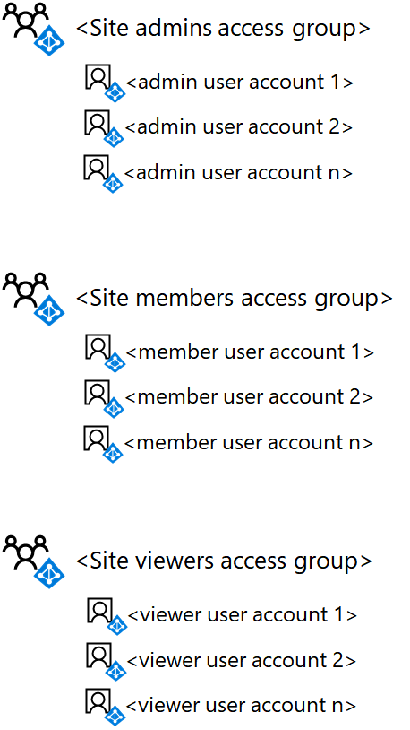

# <a name="deploy-an-isolated-sharepoint-online-team-site"></a><span data-ttu-id="e5bae-103">Distribuire un sito del team di SharePoint Online isolato</span><span class="sxs-lookup"><span data-stu-id="e5bae-103">Deploy an isolated SharePoint Online team site</span></span>

 <span data-ttu-id="e5bae-104">**Riepilogo:** Distribuire un nuovo sito del team SharePoint Online isolato, con queste istruzioni dettagliate.</span><span class="sxs-lookup"><span data-stu-id="e5bae-104">**Summary:** Deploy a new isolated SharePoint Online team site with these step-by-step instructions.</span></span>
  
<span data-ttu-id="e5bae-p101">In questo articolo viene fornita una guida dettagliata alla distribuzione per creare e configurare un sito del team di SharePoint Online isolato in Microsoft Office 365. Questa procedura presuppone l'utilizzo di tre gruppi di SharePoint predefiniti e dei livelli di autorizzazione corrispondenti, con un singolo gruppo di Azure Active Directory (AD) per ogni livello di accesso.</span><span class="sxs-lookup"><span data-stu-id="e5bae-p101">This article is a step-by-step deployment guide for creating and configuring an isolated SharePoint Online team site in Microsoft Office 365. These steps assume the use of the three default SharePoint groups and corresponding permission levels, with a single Azure Active Directory (AD)-based access group for each level of access.</span></span>
  
## <a name="phase-1-create-and-populate-the-team-site-access-groups"></a><span data-ttu-id="e5bae-107">Fase 1: Creare e compilare i gruppi di accesso del sito del team</span><span class="sxs-lookup"><span data-stu-id="e5bae-107">Phase 1: Create and populate the team site access groups</span></span>

<span data-ttu-id="e5bae-108">In questa fase, vengono creati tre gruppi di accesso basati su Azure AD per i tre gruppi di SharePoint predefiniti e vengono popolati con gli account utente appropriati.</span><span class="sxs-lookup"><span data-stu-id="e5bae-108">In this phase, you create the three Azure AD-based access groups for the three default SharePoint groups and populate them with the appropriate user accounts.</span></span>
  
> [!NOTE]
> <span data-ttu-id="e5bae-p102">La procedura seguente presuppone che tutti gli account utente necessari già esistano e siano dotati delle licenze appropriate. In caso contrario, aggiungerli e assegnare le licenze prima di procedere con il passaggio 1.</span><span class="sxs-lookup"><span data-stu-id="e5bae-p102">The following steps assume that all necessary user accounts already exist and are assigned the appropriate licenses. If not, please add them and assign licenses before proceeding to step 1.</span></span> 
  
### <a name="step-1-list-the-sharepoint-online-admins-for-the-site"></a><span data-ttu-id="e5bae-111">Passaggio 1: elencare gli amministratori di SharePoint Online per il sito</span><span class="sxs-lookup"><span data-stu-id="e5bae-111">Step 1: List the SharePoint Online admins for the site</span></span>

<span data-ttu-id="e5bae-112">Determinare il set di account utente corrispondenti agli amministratori di SharePoint Online per il sito del team isolato.</span><span class="sxs-lookup"><span data-stu-id="e5bae-112">Determine the set of user accounts corresponding to the SharePoint Online admins for the isolated team site.</span></span>
  
<span data-ttu-id="e5bae-113">Se si gestiscono account utente e gruppi con Office 365 e si desidera utilizzare Windows PowerShell, fare un elenco dei loro nomi dell'entità utente (UPN), ad esempio, UPN: belindan@contoso.com.</span><span class="sxs-lookup"><span data-stu-id="e5bae-113">If you are managing user accounts and groups through Office 365 and want to use Windows PowerShell, make a list of their user principal names (UPNs) (example UPN: belindan@contoso.com).</span></span>
  
### <a name="step-2-list-the-members-for-the-site"></a><span data-ttu-id="e5bae-114">Passaggio 2: elencare i membri del sito</span><span class="sxs-lookup"><span data-stu-id="e5bae-114">Step 2: List the members for the site</span></span>

<span data-ttu-id="e5bae-115">Determinare il set di account utente corrispondenti ai membri del sito del team isolato, quelli che collaboreranno sulle risorse archiviate nel sito.</span><span class="sxs-lookup"><span data-stu-id="e5bae-115">Determine the set of user accounts corresponding to the members for the isolated team site, those who will be collaborating on resources stored within the site.</span></span>
  
<span data-ttu-id="e5bae-p103">Se si gestiscono account utente e gruppi con Office 365 e si desidera utilizzare PowerShell, fare un elenco dei loro UPN. Se sono presenti molti membri del sito, è possibile archiviare l'elenco di UPN in un file di testo e aggiungerli con un singolo comando di PowerShell.</span><span class="sxs-lookup"><span data-stu-id="e5bae-p103">If you are managing user accounts and groups through Office 365 and want to use PowerShell, make a list of their UPNs. If there are a lot of site members, you can store the list of UPNs in a text file and add them all with a single PowerShell command.</span></span>
  
### <a name="step-3-list-the-viewers-for-the-site"></a><span data-ttu-id="e5bae-118">Passaggio 3: elencare i visualizzatori del sito</span><span class="sxs-lookup"><span data-stu-id="e5bae-118">Step 3: List the viewers for the site</span></span>

<span data-ttu-id="e5bae-119">Determinare il set di account utente corrispondenti ai visualizzatori del sito del tam isolato, quelli che possono visualizzare le risorse archiviate nel sito ma non modificarle o collaborare direttamente sui contenuti.</span><span class="sxs-lookup"><span data-stu-id="e5bae-119">Determine the set of user accounts corresponding to the viewers of the isolated team site, those who can view the resources stored in the site but not modify them or directly collaborate on their contents.</span></span>
  
<span data-ttu-id="e5bae-p104">Se si gestiscono account utente e gruppi con Office 365 e si desidera utilizzare PowerShell, fare un elenco dei loro UPN. Se sono presenti molti membri del sito, è possibile archiviare l'elenco di UPN in un file di testo e aggiungerli con un singolo comando di PowerShell.</span><span class="sxs-lookup"><span data-stu-id="e5bae-p104">If you are managing user accounts and groups through Office 365 and want to use PowerShell, make a list of their UPNs. If there are a lot of site members, you can store the list of UPNs in a text file and add them all with a single PowerShell command.</span></span>
  
<span data-ttu-id="e5bae-122">I visualizzatori del sito potrebbero includere la direzione esecutiva, i consulenti legali o gli stakeholder interdipartimentali.</span><span class="sxs-lookup"><span data-stu-id="e5bae-122">Viewers for the site might include executive management, legal counsel, or inter-departmental stakeholders.</span></span>
  
### <a name="step-4-create-the-three-access-groups-for-the-site-in-azure-ad"></a><span data-ttu-id="e5bae-123">Passaggio 4: creare i tre gruppi di accesso per il sito di Azure AD</span><span class="sxs-lookup"><span data-stu-id="e5bae-123">Step 4: Create the three access groups for the site in Azure AD</span></span>

<span data-ttu-id="e5bae-124">È necessario creare i gruppi di accesso seguenti in Azure AD:</span><span class="sxs-lookup"><span data-stu-id="e5bae-124">You need to create the following access groups in Azure AD:</span></span>
  
- <span data-ttu-id="e5bae-125">Amministratori del sito (che contiene l'elenco creato al passaggio 1)</span><span class="sxs-lookup"><span data-stu-id="e5bae-125">Site admins (which will contain the list from step 1)</span></span>
    
- <span data-ttu-id="e5bae-126">Membri del sito (che contiene l'elenco creato al passaggio 2)</span><span class="sxs-lookup"><span data-stu-id="e5bae-126">Site members (which will contain the list from step 2)</span></span>
    
- <span data-ttu-id="e5bae-127">Visualizzatori del sito (che contiene l'elenco creato al passaggio 3)</span><span class="sxs-lookup"><span data-stu-id="e5bae-127">Site viewers (which will contain the list from step 3)</span></span>
    
1. <span data-ttu-id="e5bae-128">Nel browser, accedere al portale di Azure in [https://portal.azure.com](https://portal.azure.com) e accedere con le credenziali di un account assegnato con ruolo di amministratore Gestione utente o amministratore aziendale.</span><span class="sxs-lookup"><span data-stu-id="e5bae-128">In your browser, go to the Azure portal at [https://portal.azure.com](https://portal.azure.com) and sign in with the credentials of an account that has been assigned with User Management Admin or Company Administrator role.</span></span>
    
2. <span data-ttu-id="e5bae-129">Nel portale di Azure, fare clic su **Azure Active Directory > utenti e gruppi > tutti i gruppi di**.</span><span class="sxs-lookup"><span data-stu-id="e5bae-129">In the Azure portal, click **Azure Active Directory > Users and groups > All groups**.</span></span>
    
3. <span data-ttu-id="e5bae-130">Su blade **tutti i gruppi** , fare clic su **+ nuovo gruppo**.</span><span class="sxs-lookup"><span data-stu-id="e5bae-130">On the **All groups** blade, click **+ New group**.</span></span>
    
4. <span data-ttu-id="e5bae-131">Su blade **gruppo** :</span><span class="sxs-lookup"><span data-stu-id="e5bae-131">On the **Group** blade:</span></span>
    
  - <span data-ttu-id="e5bae-132">Digitare il nome del gruppo nella **casella Nome**.</span><span class="sxs-lookup"><span data-stu-id="e5bae-132">Type the group name in **Name**.</span></span>
    
  - <span data-ttu-id="e5bae-133">In **appartenenza**, selezionare **assegnato** .</span><span class="sxs-lookup"><span data-stu-id="e5bae-133">Select **Assigned** in **Membership**.</span></span>
    
  - <span data-ttu-id="e5bae-134">Fare clic su **Sì** per **caratteristiche di attivare Office**.</span><span class="sxs-lookup"><span data-stu-id="e5bae-134">Click **Yes** for **Enable Office features**.</span></span>
    
5. <span data-ttu-id="e5bae-135">Fare clic su **Crea**e quindi chiudere blade **gruppo** .</span><span class="sxs-lookup"><span data-stu-id="e5bae-135">Click **Create**, and then close the **Group** blade.</span></span>
    
6. <span data-ttu-id="e5bae-136">Ripetere i passaggi da 3 a 5 per i gruppi aggiuntivi.</span><span class="sxs-lookup"><span data-stu-id="e5bae-136">Repeat steps 3-5 for your additional groups.</span></span>
    
> [!NOTE]
> <span data-ttu-id="e5bae-p105">È necessario utilizzare il portale di Azure per creare i gruppi che dispongono di funzionalità di Office attivata. Se un sito di SharePoint Online isolato in seguito è configurato come sito altamente riservati con un'etichetta di protezione informazioni Azure (AIP) per crittografare i file e assegnare autorizzazioni a gruppi specifici, i gruppi autorizzati devono essere stati creati con caratteristiche di Office abilitato. È possibile modificare l'impostazione di funzionalità di Office di un gruppo di Azure Active Directory dopo che è stato creato.</span><span class="sxs-lookup"><span data-stu-id="e5bae-p105">You need to use the Azure portal to create the groups so that they have Office features enabled. If a SharePoint Online isolated site is later configured as a Highly Confidential site with an Azure Information Protection (AIP) label to encrypt files and assign permission to specific groups, the permitted groups must have been created with Office features enabled. You cannot change the Office features setting of an Azure AD group after it has been created.</span></span> 
  
<span data-ttu-id="e5bae-140">Di seguito è la configurazione risultante con i gruppi di accesso di tre siti.</span><span class="sxs-lookup"><span data-stu-id="e5bae-140">Here is your resulting configuration with the three site access groups.</span></span>
  

  
### <a name="step-5-add-the-user-accounts-to-the-access-groups"></a><span data-ttu-id="e5bae-p106">Passaggio 5. Aggiungere gli account utente ai gruppi di accesso</span><span class="sxs-lookup"><span data-stu-id="e5bae-p106">Step 5. Add the user accounts to the access groups</span></span>

<span data-ttu-id="e5bae-144">In questo passaggio, eseguire la procedura riportata di seguito:</span><span class="sxs-lookup"><span data-stu-id="e5bae-144">In this step, do the following:</span></span>
  
1. <span data-ttu-id="e5bae-145">Aggiungere l'elenco di utenti creato nel passaggio 1 al gruppo di accesso degli amministratori del sito</span><span class="sxs-lookup"><span data-stu-id="e5bae-145">Add the list of users from step 1 to the site admins access group</span></span>
    
2. <span data-ttu-id="e5bae-146">Aggiungere l'elenco di utenti creato nel passaggio 2 al gruppo di accesso dei membri del sito</span><span class="sxs-lookup"><span data-stu-id="e5bae-146">Add the list of users from step 2 to the site members access group</span></span>
    
3. <span data-ttu-id="e5bae-147">Aggiungere l'elenco di utenti creato nel passaggio 3 al gruppo di accesso dei visualizzatori del sito</span><span class="sxs-lookup"><span data-stu-id="e5bae-147">Add the list of users from step 3 to the site viewers access group</span></span>
    
<span data-ttu-id="e5bae-148">Se si gestiscono account utente e gruppi con Windows Server AD, aggiungere gli utenti ai gruppi di accesso appropriati utilizzando le normali procedure di gestione di gruppi e utenti di Windows Server AD e attendere la sincronizzazione con l'abbonamento a Office 365.</span><span class="sxs-lookup"><span data-stu-id="e5bae-148">If you are managing user accounts and groups through Windows Server AD, add users to the appropriate access groups using your normal Windows Server AD user and group management procedures and wait for synchronization with your Office 365 subscription.</span></span>
  
<span data-ttu-id="e5bae-p107">Se si gestiscono account utente e gruppi con Office 365, è possibile utilizzare l'interfaccia di amministrazione di Office o PowerShell. Se si dispone di nomi di gruppo duplicati per uno dei gruppi di accesso, è necessario utilizzare l'interfaccia di amministrazione di Office.</span><span class="sxs-lookup"><span data-stu-id="e5bae-p107">If you are managing user accounts and groups through Office 365, you can use the Office Admin center or PowerShell. If you have duplicate group names for any of the access groups, you should use the Office Admin center.</span></span>
  
<span data-ttu-id="e5bae-151">Per l'interfaccia di amministrazione di Office, accedere con un account utente che è stato assegnato il ruolo di amministratore degli Account utente o amministratore aziendale e utilizzare gruppi aggiungere gli account utente appropriati e ai gruppi di accesso appropriato.</span><span class="sxs-lookup"><span data-stu-id="e5bae-151">For the Office Admin center, sign in with a user account that has been assigned the User Account Administrator or Company Administrator role and use Groups to add the appropriate user accounts and groups to the appropriate access groups.</span></span>
  
<span data-ttu-id="e5bae-152">Per PowerShell, consultare [Connettersi con il modulo Azure Active Directory V2 PowerShell](https://go.microsoft.com/fwlink/?linkid=842218).</span><span class="sxs-lookup"><span data-stu-id="e5bae-152">For PowerShell, first [Connect with the Azure Active Directory V2 PowerShell module](https://go.microsoft.com/fwlink/?linkid=842218).</span></span>
  
<span data-ttu-id="e5bae-153">Successivamente, utilizzare il seguente blocco di comando per aggiungere un singolo account utente a un gruppo di accesso:</span><span class="sxs-lookup"><span data-stu-id="e5bae-153">Next, use the following command block to add an individual user account to an access group:</span></span>
  
```
$userUPN="<UPN of the user account>"
$grpName="<display name of the access group>"
Add-AzureADGroupMember -RefObjectId (Get-AzureADUser | Where { $_.UserPrincipalName -eq $userUPN }).ObjectID -ObjectId (Get-AzureADGroup | Where { $_.DisplayName -eq $grpName }).ObjectID
```

> [!TIP]
> <span data-ttu-id="e5bae-154">Per un file di testo che contiene tutti i comandi di PowerShell e un foglio di lavoro di configurazione di Excel che genera comandi di PowerShell in base ai nomi degli account utente e di gruppo, scaricare [Kit di distribuzione del sito di SharePoint Online Team isolato](https://gallery.technet.microsoft.com/Isolated-SharePoint-Online-0b364907).</span><span class="sxs-lookup"><span data-stu-id="e5bae-154">For a text file that contains all the PowerShell commands and an Excel configuration worksheet that generates PowerShell commands based on your group and user account names, download the [Isolated SharePoint Online Team Site Deployment Kit](https://gallery.technet.microsoft.com/Isolated-SharePoint-Online-0b364907).</span></span> 
  
<span data-ttu-id="e5bae-155">Se gli UPN degli account utente per uno dei gruppi di accesso è archiviato in un file di testo, è possibile utilizzare il seguente blocco di comandi PowerShell per aggiungerli tutti contemporaneamente:</span><span class="sxs-lookup"><span data-stu-id="e5bae-155">If you stored the UPNs of user accounts for any of the access groups in a text file, you can use the following PowerShell command block to add them all at one time:</span></span>
  
```
$grpName="<display name of the access group>"
$fileName="<path and name of the file containing the list of account UPNs>"
$grpID=(Get-AzureADGroup | Where { $_.DisplayName -eq $grpName }).ObjectID
Get-Content $fileName | ForEach { $userUPN=$_; Add-AzureADGroupMember -RefObjectId (Get-AzureADUser | Where { $_.UserPrincipalName -eq $userUPN }).ObjectID -ObjectID $grpID }
```

<span data-ttu-id="e5bae-156">Per PowerShell, utilizzare il seguente blocco di comando per aggiungere un singolo gruppo a un gruppo di accesso:</span><span class="sxs-lookup"><span data-stu-id="e5bae-156">For PowerShell, use the following command block to add an individual group to an access group:</span></span>
  
```
$nestedGrpName="<display name of the group to add to the access group>"
$grpName="<display name of the access group>"
Add-AzureADGroupMember -RefObjectId (Get-AzureADGroup | Where { $_.DisplayName -eq $nestedGrpName }).ObjectID -ObjectID (Get-AzureADGroup | Where { $_.DisplayName -eq $grpName }).ObjectID

```

<span data-ttu-id="e5bae-157">Dovrebbero essere visualizzati i seguenti risultati:</span><span class="sxs-lookup"><span data-stu-id="e5bae-157">The results should be the following:</span></span>
  
- <span data-ttu-id="e5bae-158">Gruppo di Azure Active Directory gli amministratori del sito contiene gli account utente amministratore del sito o i gruppi</span><span class="sxs-lookup"><span data-stu-id="e5bae-158">The site admins Azure AD group contains the site admin user accounts or groups</span></span>
    
- <span data-ttu-id="e5bae-159">Il gruppo di Azure Active Directory di membri del sito contiene gli account utente membro del sito o i gruppi</span><span class="sxs-lookup"><span data-stu-id="e5bae-159">The site members Azure AD group contains the site member user accounts or groups</span></span>
    
- <span data-ttu-id="e5bae-160">Gruppo visualizzatori Azure Active Directory siti contiene gli account utente o gruppi che possono visualizzare solo il contenuto del sito</span><span class="sxs-lookup"><span data-stu-id="e5bae-160">The site viewers Azure AD group contains the user accounts or groups that can only view the site contents</span></span>
    
<span data-ttu-id="e5bae-161">Convalidare l'elenco dei membri di ogni gruppo di accesso con l'interfaccia di amministrazione di Office o con il seguente blocco di comandi PowerShell:</span><span class="sxs-lookup"><span data-stu-id="e5bae-161">Validate the list of group members for each access group with the Office Admin center or with the following PowerShell command block:</span></span>
  
```
$grpName="<display name of the access group>"
Get-AzureADGroupMember -ObjectId (Get-AzureADGroup | Where { $_.DisplayName -eq $grpName }).ObjectID | Sort UserPrincipalName | Select UserPrincipalName,DisplayName,UserType
```

<span data-ttu-id="e5bae-162">Di seguito è la configurazione risultante con i gruppi di accesso di tre siti popolato con account utente o gruppo.</span><span class="sxs-lookup"><span data-stu-id="e5bae-162">Here is your resulting configuration with the three site access groups populated with user accounts or groups.</span></span>
  

  
## <a name="phase-2-create-and-configure-the-isolated-team-site"></a><span data-ttu-id="e5bae-164">Fase 2: creare e configurare il sito del team isolato</span><span class="sxs-lookup"><span data-stu-id="e5bae-164">Phase 2: Create and configure the isolated team site</span></span>

<span data-ttu-id="e5bae-165">In questa fase, viene creato il sito di SharePoint Online isolato e vengono configurate le autorizzazioni per i livelli di autorizzazione di SharePoint Online predefiniti affinché vengano utilizzati i nuovi gruppi di accesso basati su Azure AD.</span><span class="sxs-lookup"><span data-stu-id="e5bae-165">In this phase, you create the isolated SharePoint Online site and configure the permissions for the default SharePoint Online permission levels to use your new Azure AD-based access groups.</span></span>
  
<span data-ttu-id="e5bae-166">Creare innanzitutto il sito del team di SharePoint Online seguendo questa procedura.</span><span class="sxs-lookup"><span data-stu-id="e5bae-166">First, create the SharePoint Online team site with these steps.</span></span>
  
1. <span data-ttu-id="e5bae-p108">Accedere al portale di Office 365 con un account che verrà utilizzato anche per amministrare il sito del team di SharePoint Online (un amministratore di SharePoint Online). Per ulteriori informazioni, vedere [la posizione in cui eseguire l'accesso a Office 365](https://support.office.com/Article/Where-to-sign-in-to-Office-365-e9eb7d51-5430-4929-91ab-6157c5a050b4).</span><span class="sxs-lookup"><span data-stu-id="e5bae-p108">Sign in to the Office 365 portal with an account that will also be used to administer the SharePoint Online team site (a SharePoint Online administrator). For help, see [Where to sign in to Office 365](https://support.office.com/Article/Where-to-sign-in-to-Office-365-e9eb7d51-5430-4929-91ab-6157c5a050b4).</span></span>
    
2. <span data-ttu-id="e5bae-169">Nell'elenco delle sezioni, fare clic su **SharePoint**.</span><span class="sxs-lookup"><span data-stu-id="e5bae-169">In the list of tiles, click **SharePoint**.</span></span>
    
3. <span data-ttu-id="e5bae-170">In una nuova scheda **SharePoint** del browser, fare clic su **Crea sito +**.</span><span class="sxs-lookup"><span data-stu-id="e5bae-170">In the new **SharePoint** tab of your browser, click **+ Create site**.</span></span>
    
4. <span data-ttu-id="e5bae-171">Nella pagina **Crea sito** fare clic su **sito del Team**.</span><span class="sxs-lookup"><span data-stu-id="e5bae-171">On the **Create a site** page, click **Team site**.</span></span>
    
5. <span data-ttu-id="e5bae-172">In **nome sito**digitare un nome per il sito del team.</span><span class="sxs-lookup"><span data-stu-id="e5bae-172">In **Site name**, type a name for the team site.</span></span> 
    
6. <span data-ttu-id="e5bae-173">Nella **descrizione del sito del Team,** digitare una descrizione facoltativa dello scopo del sito.</span><span class="sxs-lookup"><span data-stu-id="e5bae-173">In **Team site description,** type an optional description of the purpose of the site.</span></span>
    
7. <span data-ttu-id="e5bae-174">**Le impostazioni di Privacy**, selezionare **privato: solo membri possono accedere al sito**e quindi fare clic su **Avanti**.</span><span class="sxs-lookup"><span data-stu-id="e5bae-174">In **Privacy settings**, select **Private - only members can access this site**, and then click **Next**.</span></span>
    
8. <span data-ttu-id="e5bae-175">Nella **che si desidera aggiungere?** riquadro, fare clic su **Fine**.</span><span class="sxs-lookup"><span data-stu-id="e5bae-175">On the **Who do you want to add?** pane, click **Finish**.</span></span>
    
<span data-ttu-id="e5bae-176">Successivamente, dal nuovo sito del team di SharePoint Online configurare le autorizzazioni.</span><span class="sxs-lookup"><span data-stu-id="e5bae-176">Next, from the new SharePoint Online team site, configure permissions.</span></span>
  
1. <span data-ttu-id="e5bae-177">Nella barra degli strumenti, fare clic sull'icona impostazioni e quindi fare clic su **autorizzazioni sito**.</span><span class="sxs-lookup"><span data-stu-id="e5bae-177">In the tool bar, click the settings icon, and then click **Site permissions**.</span></span>
    
2. <span data-ttu-id="e5bae-178">Nel riquadro **autorizzazioni sito** fare clic su **impostazioni di autorizzazioni avanzate**.</span><span class="sxs-lookup"><span data-stu-id="e5bae-178">In the **Site permissions** pane, click **Advanced permissions settings**.</span></span>
    
3. <span data-ttu-id="e5bae-179">Nella scheda **autorizzazioni** nuova del browser, fare clic su **Impostazioni richieste di accesso**.</span><span class="sxs-lookup"><span data-stu-id="e5bae-179">On the new **Permissions** tab of your browser, click **Access Request Settings**.</span></span>
    
4. <span data-ttu-id="e5bae-180">Nella finestra di dialogo **Impostazioni di richieste di accesso** , deselezionare **Consenti membro per condividere il sito e i singoli file e cartelle** e **Consenti richieste di accesso** (in modo che tutti i tre caselle di controllo è deselezionate), quindi scegliere **OK**.</span><span class="sxs-lookup"><span data-stu-id="e5bae-180">In the **Access Requests Settings** dialog box, clear **Allow member to share the site and individual files and folders** and **Allow access requests** (so that all three check boxes are cleared), and then click **OK**.</span></span>
    
5. <span data-ttu-id="e5bae-181">Nella scheda **autorizzazioni** del browser fare clic su ** \<nome del sito > membri** nell'elenco.</span><span class="sxs-lookup"><span data-stu-id="e5bae-181">On the **Permissions** tab of your browser, click **\<site name> Members** in the list.</span></span>
    
6. <span data-ttu-id="e5bae-182">In **utenti e gruppi**fare clic su **Nuovo**.</span><span class="sxs-lookup"><span data-stu-id="e5bae-182">In **People and Groups**, click **New**.</span></span>
    
7. <span data-ttu-id="e5bae-183">Nella finestra di dialogo **condivisione** digitare il nome del gruppo di accesso membri del sito, selezionarlo e fare clic su **Condividi**.</span><span class="sxs-lookup"><span data-stu-id="e5bae-183">In the **Share** dialog box, type the name of the site members access group, select it, and then click **Share**.</span></span>
    
8. <span data-ttu-id="e5bae-184">Fare clic sul pulsante Indietro del browser.</span><span class="sxs-lookup"><span data-stu-id="e5bae-184">Click the back button on your browser.</span></span>
    
9. <span data-ttu-id="e5bae-185">Fare clic su ** \<nome del sito > proprietari** nell'elenco.</span><span class="sxs-lookup"><span data-stu-id="e5bae-185">Click **\<site name> Owners** in the list.</span></span>
    
10. <span data-ttu-id="e5bae-186">In **utenti e gruppi**fare clic su **Nuovo**.</span><span class="sxs-lookup"><span data-stu-id="e5bae-186">In **People and Groups**, click **New**.</span></span>
    
11. <span data-ttu-id="e5bae-187">Nella finestra di dialogo **condivisione** digitare il nome del gruppo di accesso gli amministratori del sito, selezionarlo e fare clic su **Condividi**.</span><span class="sxs-lookup"><span data-stu-id="e5bae-187">In the **Share** dialog box, type the name of the site admins access group, select it, and then click **Share**.</span></span>
    
12. <span data-ttu-id="e5bae-188">Fare clic sul pulsante Indietro del browser.</span><span class="sxs-lookup"><span data-stu-id="e5bae-188">Click the back button on your browser.</span></span>
    
13. <span data-ttu-id="e5bae-189">Fare clic su ** \<nome del sito > visitatori** nell'elenco.</span><span class="sxs-lookup"><span data-stu-id="e5bae-189">Click **\<site name> Visitors** in the list.</span></span>
    
14. <span data-ttu-id="e5bae-190">In **utenti e gruppi**fare clic su **Nuovo**.</span><span class="sxs-lookup"><span data-stu-id="e5bae-190">In **People and Groups**, click **New**.</span></span>
    
15. <span data-ttu-id="e5bae-191">Nella finestra di dialogo **condivisione** digitare il nome del gruppo di accesso del sito visualizzatori, selezionarlo e fare clic su **Condividi**.</span><span class="sxs-lookup"><span data-stu-id="e5bae-191">In the **Share** dialog box, type the name of the site viewers access group, select it, and then click **Share**.</span></span>
    
16. <span data-ttu-id="e5bae-192">Chiudere la scheda **autorizzazioni** della finestra del browser.</span><span class="sxs-lookup"><span data-stu-id="e5bae-192">Close the **Permissions** tab of your browser.</span></span>
    
<span data-ttu-id="e5bae-193">I risultati di queste impostazioni delle autorizzazioni sono i seguenti:</span><span class="sxs-lookup"><span data-stu-id="e5bae-193">The results of these permission settings are:</span></span>
  
- <span data-ttu-id="e5bae-194">Il ** \<nome del sito > proprietari** gruppo di SharePoint contiene il gruppo di accesso gli amministratori del sito, in cui tutti i membri dispongono del livello di autorizzazione **controllo completo** .</span><span class="sxs-lookup"><span data-stu-id="e5bae-194">The **\<site name> Owners** SharePoint group contains the site admins access group, in which all the members have the **Full control** permission level.</span></span>
    
- <span data-ttu-id="e5bae-195">Il ** \<nome del sito > membri** gruppo di SharePoint contiene il gruppo di accesso membri del sito, in cui tutti i membri dispongono del livello di autorizzazione **Modifica** .</span><span class="sxs-lookup"><span data-stu-id="e5bae-195">The **\<site name> Members** SharePoint group contains the site members access group, in which all the members have the **Edit** permission level.</span></span>
    
- <span data-ttu-id="e5bae-196">Il ** \<nome del sito > visitatori** gruppo di SharePoint contiene il gruppo di accesso i visualizzatori del sito, in cui tutti i membri dispongono del livello di autorizzazione **lettura** .</span><span class="sxs-lookup"><span data-stu-id="e5bae-196">The **\<site name> Visitors** SharePoint group contains the site viewers access group, in which all the members have the **Read** permission level.</span></span>
    
- <span data-ttu-id="e5bae-197">La possibilità per i membri di invitare altri membri o per i non membri richiedere l'accesso è disattivata.</span><span class="sxs-lookup"><span data-stu-id="e5bae-197">The ability for members to invite other members or for non-members to request access is disabled.</span></span>
    
<span data-ttu-id="e5bae-198">Di seguito è la configurazione risultante con i tre gruppi di SharePoint per il sito configurato per l'utilizzo di tre gruppi di accesso, popolati con gli account utente o gruppi di Azure Active Directory.</span><span class="sxs-lookup"><span data-stu-id="e5bae-198">Here is your resulting configuration with the three SharePoint groups for the site configured to use the three access groups, which are populated with user accounts or Azure AD groups.</span></span>
  

  
<span data-ttu-id="e5bae-200">I membri del sito, tramite l'appartenenza a uno dei gruppi di accesso, possono ora collaborare utilizzando le risorse del sito.</span><span class="sxs-lookup"><span data-stu-id="e5bae-200">You and the members of the site, through group membership in one of the access groups, can now collaborate using the resources of the site.</span></span>
  
## <a name="next-step"></a><span data-ttu-id="e5bae-201">Passaggio successivo</span><span class="sxs-lookup"><span data-stu-id="e5bae-201">Next step</span></span>

<span data-ttu-id="e5bae-202">Quando è necessario modificare l'appartenenza al gruppo di accesso del sito o creare una cartella di documenti con autorizzazioni personalizzate, vedere [Manage a un sito del team di SharePoint Online isolato](manage-an-isolated-sharepoint-online-team-site.md).</span><span class="sxs-lookup"><span data-stu-id="e5bae-202">When you need to change site access group membership or create a document folder with custom permissions, see [Manage an isolated SharePoint Online team site](manage-an-isolated-sharepoint-online-team-site.md).</span></span>
  
## <a name="see-also"></a><span data-ttu-id="e5bae-203">Vedere anche</span><span class="sxs-lookup"><span data-stu-id="e5bae-203">See Also</span></span>

[<span data-ttu-id="e5bae-204">Siti del team di SharePoint Online isolati</span><span class="sxs-lookup"><span data-stu-id="e5bae-204">Isolated SharePoint Online team sites</span></span>](isolated-sharepoint-online-team-sites.md)
  
[<span data-ttu-id="e5bae-205">Progettare un sito del team di SharePoint Online isolato</span><span class="sxs-lookup"><span data-stu-id="e5bae-205">Design an isolated SharePoint Online team site</span></span>](design-an-isolated-sharepoint-online-team-site.md)
  
[<span data-ttu-id="e5bae-206">Gestire un sito del team di SharePoint Online isolato</span><span class="sxs-lookup"><span data-stu-id="e5bae-206">Manage an isolated SharePoint Online team site</span></span>](manage-an-isolated-sharepoint-online-team-site.md)
  
[<span data-ttu-id="e5bae-207">Soluzioni di sicurezza</span><span class="sxs-lookup"><span data-stu-id="e5bae-207">Security solutions</span></span>](security-solutions.md)


