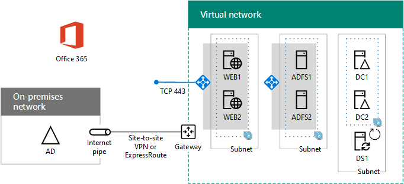

# Distribuire l'autenticazione federata ad alta visibilità per Office 365 in AzureDeploy high availability federated authentication for Office 365 in Azure

 **Riepilogo:** Configurare l'autenticazione federata a disponibilità elevata per l'abbonamento a Office 365 in Microsoft Azure.**Summary:** Configure high availability federated authentication for your Office 365 subscription in Microsoft Azure.
  
In questo articolo sono riportati i collegamenti a istruzioni dettagliate per la distribuzione dell'autenticazione federata a disponibilità elevata per Microsoft Office 365 in servizi infrastruttura di Azure con queste macchine virtuali:This article contains links to the step-by-step instructions for deploying high availability federated authentication for Microsoft Office 365 in Azure infrastructure services with these virtual machines:
  
- Due server proxy di applicazione WebTwo web application proxy servers
    
- Due server Active Directory Federation Services (AD FS)Two Active Directory Federation Services (AD FS) servers
    
- Due controller di dominio di replicaTwo replica domain controllers
    
- Un server di sincronizzazione della directory (DirSync) che esegue Azure AD ConnectOne directory synchronization (DirSync) server running Azure AD Connect
    
Di seguito viene riportata la configurazione, con i nomi segnaposto per ogni server.Here is the configuration, with placeholder names for each server.
  
**Un'autenticazione federata a disponibilità elevata per l'infrastruttura di Office 365 in Azure****A high availability federated authentication for Office 365 infrastructure in Azure**

  
Tutte le macchine virtuali si trovano in una singola rete virtuale di Azure (VNet) cross-premise.All of the virtual machines are in a single cross-premises Azure virtual network (VNet). 
  
> [!NOTE]
> L'autenticazione federata di singoli utenti non fa affidamento ad alcuna risorsa locale. Tuttavia, se la connessione cross-premise non è più disponibile, i controller di dominio della VNet non riceveranno aggiornamenti sugli account utente e sui gruppi creati nell'AD di Windows Server locale. Affinché ciò non si verifichi, è possibile configurare la disponibilità elevata per la connessione cross-premise. Per maggiori informazioni, vedere [Connettività cross-premise e da rete virtuale a rete virtuale a disponibilità elevata](https://docs.microsoft.com/azure/vpn-gateway/vpn-gateway-highlyavailable)Federated authentication of individual users does not rely on any on-premises resources. However, if the cross-premises connection becomes unavailable, the domain controllers in the VNet will not receive updates to user accounts and groups made in the on-premises Windows Server AD. To ensure this does not happen, you can configure high availability for your cross-premises connection. For more information, see [Highly Available Cross-Premises and VNet-to-VNet Connectivity](https://docs.microsoft.com/azure/vpn-gateway/vpn-gateway-highlyavailable)
  
Ogni coppia di macchine virtuali per un ruolo specifico si trova nella propria subnet e nel set di disponibilità.Each pair of virtual machines for a specific role is in its own subnet and availability set.
  
> [!NOTE]
> Poiché tale VNet è connessa alla rete locale, questa configurazione non include jumpbox o macchine virtuali di monitoraggio in una subnet di gestione. Per ulteriori informazioni, vedere [Esecuzione di macchine virtuali Windows per un'architettura a N livelli](https://docs.microsoft.com/azure/guidance/guidance-compute-n-tier-vm).Because this VNet is connected to the on-premises network, this configuration does not include jumpbox or monitoring virtual machines on a management subnet. For more information, see [Running Windows VMs for an N-tier architecture](https://docs.microsoft.com/azure/guidance/guidance-compute-n-tier-vm). 
  
A seguito di questa configurazione, tutti gli utenti di Office 365 avranno a disposizione l'autenticazione federata e potranno accedere usando le credenziali di Windows Server Active Directory anziché l'account di Office 365. L'infrastruttura di autenticazione federata utilizza un set ridondante di server che vengono distribuiti nei servizi dell'infrastruttura di Azure invece che nella rete perimetrale locale.The result of this configuration is that you will have federated authentication for all of your Office 365 users, in which they can use their Windows Server Active Directory credentials to sign in rather than their Office 365 account. The federated authentication infrastructure uses a redundant set of servers that are more easily deployed in Azure infrastructure services, rather than in your on-premises edge network.
  
## Distinta baseBill of materials

Questa configurazione di base richiede l'insieme di componenti e servizi di Azure seguente:This baseline configuration requires the following set of Azure services and components:
  
- Sette macchine virtualiSeven virtual machines
    
- Una rete virtuale cross-premise con quattro subnetOne cross-premises virtual network with four subnets
    
- Quattro gruppi di risorseFour resource groups
    
- Tre set di disponibilitàThree availability sets
    
- Un abbonamento di AzureOne Azure subscription
    
Di seguito sono riportate le macchine virtuali e le rispettive dimensioni predefinite per questa configurazione.Here are the virtual machines and their default sizes for this configuration.
  
|**Elemento****Item**|**Descrizione macchina virtuale****Virtual machine description**|**Immagine della raccolta Azure****Azure gallery image**|**Dimensione predefinita****Default size**|
|:-----|:-----|:-----|:-----|
|1.1.    |Primo controller di dominioFirst domain controller    |Windows Server 2016 DatacenterWindows Server 2016 Datacenter    |D2D2    |
|2.2.    |Secondo controller di dominioSecond domain controller    |Windows Server 2016 DatacenterWindows Server 2016 Datacenter    |D2D2    |
|3.3.    |Server di Azure AD ConnectAzure AD Connect server    |Windows Server 2016 DatacenterWindows Server 2016 Datacenter    |D2D2    |
|4.4.    |primo server AD FSFirst AD FS server    |Windows Server 2016 DatacenterWindows Server 2016 Datacenter    |D2D2    |
|5.5.    |Secondo server AD FSSecond AD FS server    |Windows Server 2016 DatacenterWindows Server 2016 Datacenter    |D2D2    |
|6.6.    |Primo server proxy di applicazione WebFirst web application proxy server    |Windows Server 2016 DatacenterWindows Server 2016 Datacenter    |D2D2    |
|7.7.    |Secondo server proxy di applicazione WebSecond web application proxy server    |Windows Server 2016 DatacenterWindows Server 2016 Datacenter    |D2D2    |
   
Per fare una stima dei costi per questa configurazione, vedere il [calcolatore dei prezzi Azure](https://azure.microsoft.com/pricing/calculator/)To compute the estimated costs for this configuration, see the [Azure pricing calculator](https://azure.microsoft.com/pricing/calculator/)
  
## Fasi di distribuzionePhases of deployment

Distribuire il carico di lavoro nelle fasi seguenti:You deploy this workload in the following phases:
  
<<<<<<< HEAD<<<<<<< HEAD
- [Fase 1 dell'autenticazione federata a disponibilità elevata: Configurare Azure](high-availability-federated-authentication-phase-1-configure-azure.md). Creare gruppi di risorse, account di archiviazione, set di disponibilità e una rete virtuale cross-premise.[High availability federated authentication Phase 1: Configure Azure](high-availability-federated-authentication-phase-1-configure-azure.md). Create resource groups, storage accounts, availability sets, and a cross-premises virtual network.
    
- [High availability federated authentication Phase 2: Configure domain controllers](high-availability-federated-authentication-phase-2-configure-domain-controllers.md). Creare e configurare i controller di dominio di Windows Server Active Directory (AD) di replica e il server DirSync.[High availability federated authentication Phase 2: Configure domain controllers](high-availability-federated-authentication-phase-2-configure-domain-controllers.md). Create and configure replica Windows Server Active Directory (AD) domain controllers and the DirSync server.
    
- [Fase 3 dell'autenticazione federata a disponibilità elevata: Configurare i server AD FS](high-availability-federated-authentication-phase-3-configure-ad-fs-servers.md). Creare e configurare i due server AD FS.[High availability federated authentication Phase 3: Configure AD FS servers](high-availability-federated-authentication-phase-3-configure-ad-fs-servers.md). Create and configure the two AD FS servers.
    
- [Fase 4 dell'autenticazione federata a disponibilità elevata: Configurare i proxy dell'applicazione Web](high-availability-federated-authentication-phase-4-configure-web-application-pro.md). Creare e configurare i due server proxy dell'applicazione Web.[High availability federated authentication Phase 4: Configure web application proxies](high-availability-federated-authentication-phase-4-configure-web-application-pro.md). Create and configure the two web application proxy servers.
    
- [Fase 5 dell'autenticazione federata a disponibilità elevata: Configurare l'autenticazione federata per Office 365](high-availability-federated-authentication-phase-5-configure-federated-authentic.md). Configurare l'autenticazione federata per l'abbonamento di Office 365. =======[High availability federated authentication Phase 5: Configure federated authentication for Office 365](high-availability-federated-authentication-phase-5-configure-federated-authentic.md). Configure federated authentication for your Office 365 subscription. =======
- [Fase 1 dell'autenticazione federata a disponibilità elevata: Configurare Azure](high-availability-federated-authentication-phase-1-configure-azure.md) - Creare gruppi di risorse, account di archiviazione, set di disponibilità e una rete virtuale cross-premise.[High availability federated authentication Phase 1: Configure Azure](high-availability-federated-authentication-phase-1-configure-azure.md) - Create resource groups, storage accounts, availability sets, and a cross-premises virtual network.
    
- [Fase 2 dell'autenticazione federata a disponibilità elevata: configurare i controller di dominio](high-availability-federated-authentication-phase-2-configure-domain-controllers.md). Creare e configurare i controller di dominio di Windows Server Active Directory (AD) di replica e il server DirSync.[High availability federated authentication Phase 2: Configure domain controllers](high-availability-federated-authentication-phase-2-configure-domain-controllers.md) - Create and configure replica Windows Server Active Directory (AD) domain controllers and the DirSync server.
    
- [Fase 3 dell'autenticazione federata a disponibilità elevata: Configurare i server AD FS](high-availability-federated-authentication-phase-3-configure-ad-fs-servers.md) - Creare e configurare i due server AD FS.[High availability federated authentication Phase 3: Configure AD FS servers](high-availability-federated-authentication-phase-3-configure-ad-fs-servers.md) - Create and configure the two AD FS servers.
    
- [Fase 4 dell'autenticazione federata a disponibilità elevata: Configurare i proxy dell'applicazione Web](high-availability-federated-authentication-phase-4-configure-web-application-pro.md) - Creare e configurare i due server proxy dell'applicazione Web.[High availability federated authentication Phase 4: Configure web application proxies](high-availability-federated-authentication-phase-4-configure-web-application-pro.md) - Create and configure the two web application proxy servers.
    
- [Fase 5 dell'autenticazione federata a disponibilità elevata: Configurare l'autenticazione federata per Office 365](high-availability-federated-authentication-phase-5-configure-federated-authentic.md). Configurare l'autenticazione federata per l'abbonamento di Office 365.[High availability federated authentication Phase 5: Configure federated authentication for Office 365](high-availability-federated-authentication-phase-5-configure-federated-authentic.md) - Configure federated authentication for your Office 365 subscription.
>>>>>>> mastermaster
    
Questi articoli forniscono una guida dettagliata per un'architettura predefinita al fine di creare un'autenticazione federata a elevata funzionale per Office 365 nei servizi infrastruttura di Azure. Tenere presente quanto segue:These articles provide a prescriptive, phase-by-phase guide for a predefined architecture to create a functional, high availability federated authentication for Office 365 in Azure infrastructure services. Keep the following in mind:
  
- Se si è un responsabile dell'implementazione AD FS esperto, adattare le istruzione fornite nelle fasi 3 e 4 e compilare il set di server più opportuno per le proprie esigenze.If you are an experienced AD FS implementer, feel free to adapt the instructions in phases 3 and 4 and build the set of servers that best suits your needs.
    
- Se si dispone già di una distribuzione cloud ibrida Azure con una rete virtuale cross-premise esistente, è possibile adattare o ignorare le istruzioni riportate nelle fasi 1 e 2 e posizionare i server proxy dell'applicazione Web e AD FS sulle subnet appropriate.If you already have an existing Azure hybrid cloud deployment with an existing cross-premises virtual network, feel free to adapt or skip the instructions in phases 1 and 2 and place the AD FS and web application proxy servers on the appropriate subnets.
    
Per creare un ambiente di sviluppo e di testing o modello di verifica di questa configurazione, vedere [Identità federata per l'ambiente di sviluppo/test di Office 365](federated-identity-for-your-office-365-dev-test-environment.md).To build a dev/test environment or a proof-of-concept of this configuration, see [Federated identity for your Office 365 dev/test environment](federated-identity-for-your-office-365-dev-test-environment.md).
  
## Passaggio successivoNext step

Iniziare la configurazione di questo carico di lavoro con [Fase 1 dell'autenticazione federata a disponibilità elevata: Configurare Azure](high-availability-federated-authentication-phase-1-configure-azure.md).Start the configuration of this workload with [High availability federated authentication Phase 1: Configure Azure](high-availability-federated-authentication-phase-1-configure-azure.md). 
  
> [!TIP]
> Affinché un set di file distribuisca più velocemente l'autenticazione federata a elevata disponibilità per Office 365 in Azure, vedere [Autenticazione federata per Office 365 in Azure Deployment Kit](https://gallery.technet.microsoft.com/Federated-Authentication-8a9f1664).For a set of files to more quickly deploy your high availability federated authentication for Office 365 in Azure, see the [Federated Authentication for Office 365 in Azure Deployment Kit](https://gallery.technet.microsoft.com/Federated-Authentication-8a9f1664). 
  
## Vedere ancheSee Also

[Identità federata per l'ambiente di sviluppo/test di Office 365Federated identity for your Office 365 dev/test environment](federated-identity-for-your-office-365-dev-test-environment.md)
  
[Adozione del cloud e soluzioni ibrideCloud adoption and hybrid solutions](cloud-adoption-and-hybrid-solutions.md)

[Identità federata per Office 365Federated identity for Office 365](https://support.office.com/article/Understanding-Office-365-identity-and-Azure-Active-Directory-06a189e7-5ec6-4af2-94bf-a22ea225a7a9#bk_federated)

