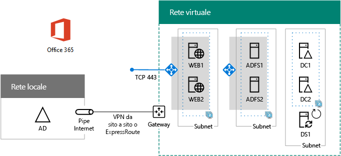

# Distribuire l'autenticazione federata ad alta visibilità per Office 365 in Azure

 **Riepilogo:** Configurare l'autenticazione federata a disponibilità elevata per l'abbonamento a Office 365 in Microsoft Azure.
  
In questo articolo sono riportati i collegamenti a istruzioni dettagliate per la distribuzione dell'autenticazione federata a disponibilità elevata per Microsoft Office 365 in servizi infrastruttura di Azure con queste macchine virtuali:
  
- Due server proxy di applicazione Web
    
- Due server Active Directory Federation Services (AD FS)
    
- Due controller di dominio di replica
    
- Un server di sincronizzazione della directory (DirSync) che esegue Azure AD Connect
    
Di seguito viene riportata la configurazione, con i nomi segnaposto per ogni server.
  
**Un'autenticazione federata a disponibilità elevata per l'infrastruttura di Office 365 in Azure**

  
Tutte le macchine virtuali si trovano in una singola rete virtuale di Azure (VNet) cross-premise. 
  
> [!NOTE]
> L'autenticazione federata di singoli utenti non fa affidamento ad alcuna risorsa locale. Tuttavia, se la connessione cross-premise non è più disponibile, i controller di dominio della VNet non riceveranno aggiornamenti sugli account utente e sui gruppi creati nell'ambiente Active Directory Domain Services (AD DS). Affinché ciò non si verifichi, è possibile configurare la disponibilità elevata per la connessione cross-premise. Per maggiori informazioni, vedere [Connettività cross-premise e da rete virtuale a rete virtuale a disponibilità elevata](https://docs.microsoft.com/azure/vpn-gateway/vpn-gateway-highlyavailable)
  
Ogni coppia di macchine virtuali per un ruolo specifico si trova nella propria subnet e nel set di disponibilità.
  
> [!NOTE]
> Poiché tale VNet è connessa alla rete locale, questa configurazione non include jumpbox o macchine virtuali di monitoraggio in una subnet di gestione. Per ulteriori informazioni, vedere [Esecuzione di macchine virtuali Windows per un'architettura a N livelli](https://docs.microsoft.com/azure/guidance/guidance-compute-n-tier-vm). 
  
A seguito di questa configurazione, tutti gli utenti di Office 365 avranno a disposizione l'autenticazione federata e potranno accedere usando le credenziali di Active Directory Domain Services anziché l'account di Office 365. L'infrastruttura di autenticazione federata utilizza un set ridondante di server che vengono distribuiti nei servizi dell'infrastruttura di Azure invece che nella rete perimetrale locale.
  
## Distinta base

Questa configurazione di base richiede l'insieme di componenti e servizi di Azure seguente:
  
- Sette macchine virtuali
    
- Una rete virtuale cross-premise con quattro subnet
    
- Quattro gruppi di risorse
    
- Tre set di disponibilità
    
- Un abbonamento di Azure
    
Di seguito sono riportate le macchine virtuali e le rispettive dimensioni predefinite per questa configurazione.
  
|**Elemento**|**Descrizione macchina virtuale**|**Immagine della raccolta Azure**|**Dimensione predefinita**|
|:-----|:-----|:-----|:-----|
|1.    |Primo controller di dominio    |Windows Server 2016 Datacenter    |D2    |
|2.    |Secondo controller di dominio    |Windows Server 2016 Datacenter    |D2    |
|3.    |Server di Azure AD Connect    |Windows Server 2016 Datacenter    |D2    |
|4.    |primo server AD FS    |Windows Server 2016 Datacenter    |D2    |
|5.    |Secondo server AD FS    |Windows Server 2016 Datacenter    |D2    |
|6.    |Primo server proxy di applicazione Web    |Windows Server 2016 Datacenter    |D2    |
|7.    |Secondo server proxy di applicazione Web    |Windows Server 2016 Datacenter    |D2    |
   
Per fare una stima dei costi per questa configurazione, vedere il [calcolatore dei prezzi Azure](https://azure.microsoft.com/pricing/calculator/)
  
## Fasi di distribuzione

Distribuire il carico di lavoro nelle fasi seguenti:
  
- [Fase 1: configurare Azure](high-availability-federated-authentication-phase-1-configure-azure.md). Creare gruppi di risorse, account di archiviazione, set di disponibilità e una rete virtuale cross-premise.
    
- [Fase 2: configurare i controller di dominio](high-availability-federated-authentication-phase-2-configure-domain-controllers.md). Creare e configurare i controller di dominio di Windows Server Active Directory (AD DS) di replica e il server DirSync.
    
- [Fase 3: configurare i server AD FS](high-availability-federated-authentication-phase-3-configure-ad-fs-servers.md). Creare e configurare i due server AD FS.
    
- [Fase 4: configurare i proxy dell'applicazione Web](high-availability-federated-authentication-phase-4-configure-web-application-pro.md). Creare e configurare i due server proxy dell'applicazione Web.
    
- [Fase 5: configurare l'autenticazione federata per Office 365](high-availability-federated-authentication-phase-5-configure-federated-authentic.md). Configurare l'autenticazione federata per l'abbonamento di Office 365.
    
Questi articoli forniscono una guida dettagliata per un'architettura predefinita al fine di creare un'autenticazione federata a elevata funzionale per Office 365 nei servizi infrastruttura di Azure. Tenere presente quanto segue:
  
- Se si è un responsabile dell'implementazione AD FS esperto, adattare le istruzione fornite nelle fasi 3 e 4 e compilare il set di server più opportuno per le proprie esigenze.
    
- Se si dispone già di una distribuzione cloud ibrida Azure con una rete virtuale cross-premise esistente, è possibile adattare o ignorare le istruzioni riportate nelle fasi 1 e 2 e posizionare i server proxy dell'applicazione Web e AD FS sulle subnet appropriate.
    
Per creare un ambiente di sviluppo e di testing o modello di verifica di questa configurazione, vedere [Identità federata per l'ambiente di sviluppo/test di Office 365](federated-identity-for-your-office-365-dev-test-environment.md).
  
## Passaggio successivo

Iniziare la configurazione di questo carico di lavoro con [Fase 1 dell'autenticazione federata a disponibilità elevata: Configurare Azure](high-availability-federated-authentication-phase-1-configure-azure.md). 
  
<!--
> [!TIP]
> For a set of files to more quickly deploy your high availability federated authentication for Office 365 in Azure, see the [Federated Authentication for Office 365 in Azure Deployment Kit](https://gallery.technet.microsoft.com/Federated-Authentication-8a9f1664). 
--> 

