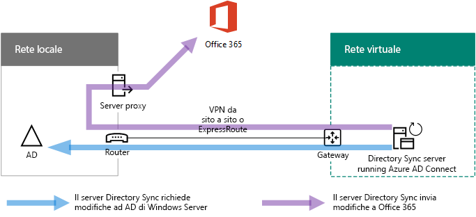

# Distribuire la sincronizzazione della directory Microsoft 365 in Microsoft Azure

Azure Active Directory (Azure AD) Connect (noto in precedenza come strumento di sincronizzazione della directory, strumento di sincronizzazione della directory o strumento di DirSync.exe) è un'applicazione installata in un server appartenente a un dominio per sincronizzare gli utenti di servizi di dominio Active Directory (AD DS) locali con il tenant di Azure AD della sottoscrizione Microsoft 365. Microsoft 365 utilizza Azure AD per il servizio directory. La sottoscrizione Microsoft 365 include un tenant di Azure AD. Questo tenant può essere utilizzato anche per la gestione delle identità dell'organizzazione con altri carichi di lavoro cloud, incluse altre applicazioni SaaS e app in Azure.

È possibile installare Azure AD Connect in un server locale, ma è anche possibile installarlo in una macchina virtuale di Azure per questi motivi:
  
- È possibile effettuare il provisioning e configurare i server basati su cloud più rapidamente, in modo da rendere disponibili i servizi in minor tempo.
- Azure offre una migliore disponibilità del sito con un numero minore di operazioni.
- È possibile ridurre il numero di server locali dell'organizzazione.

This solution requires connectivity between your on-premises network and your Azure virtual network. For more information, see [Connect an on-premises network to a Microsoft Azure virtual network](connect-an-on-premises-network-to-a-microsoft-azure-virtual-network.md). 
  
> [!NOTE]
> In questo articolo viene descritta la sincronizzazione di un singolo dominio in una foresta singola. Azure AD Connect sincronizza tutti i domini di AD DS nella foresta di Active Directory con Microsoft 365. Se si dispone di più foreste di Active Directory per la sincronizzazione con Microsoft 365, vedere [multi-Forest Directory Sync with Single Sign-on scenario](https://go.microsoft.com/fwlink/p/?LinkId=393091). 
  
## Panoramica della distribuzione della sincronizzazione della directory Microsoft 365 in Azure

Nel diagramma seguente viene illustrato Azure AD Connect in esecuzione su una macchina virtuale in Azure (il server di sincronizzazione della directory) che sincronizza una foresta di AD DS locale in un abbonamento a Microsoft 365.
  

  
In the diagram, there are two networks connected by a site-to-site VPN or ExpressRoute connection. There is an on-premises network where AD DS domain controllers are located, and there is an Azure virtual network with a directory sync server, which is a virtual machine running [Azure AD Connect](https://www.microsoft.com/download/details.aspx?id=47594). There are two main traffic flows originating from the directory sync server:
  
-  Azure AD Connect esegue la query a un controller di dominio nella rete locale per apportare modifiche ad account e password.
-  Azure AD Connect invia le modifiche apportate agli account e alle password all'istanza di Azure AD dell'abbonamento a Microsoft 365. Poiché il server di sincronizzazione della directory si trova in una parte estesa della rete locale, queste modifiche vengono inviate tramite il server proxy della rete locale.
    
> [!NOTE]
> Questa soluzione descrive la sincronizzazione di un singolo dominio di Active Directory, in una foresta Active Directory singola. Azure AD Connect sincronizza tutti i domini di Active Directory nella foresta di Active Directory con Microsoft 365. Se si dispone di più foreste di Active Directory per la sincronizzazione con Microsoft 365, vedere [multi-Forest Directory Sync with Single Sign-on scenario](https://go.microsoft.com/fwlink/p/?LinkId=393091). 
  
La distribuzione di questa soluzione comprende due passaggi principali:
  
1. Create an Azure virtual network and establish a site-to-site VPN connection to your on-premises network. For more information, see [Connect an on-premises network to a Microsoft Azure virtual network](connect-an-on-premises-network-to-a-microsoft-azure-virtual-network.md).
    
2. Installare [Azure ad Connect](https://www.microsoft.com/download/details.aspx?id=47594) in una macchina virtuale aggiunta a un dominio in Azure e quindi sincronizzare ad DS locale con Microsoft 365. Questa operazione implica:
    
    La creazione di una macchina virtuale di Azure per l'esecuzione di Azure AD Connect.
    
    L'installazione e la configurazione di [Azure AD Connect](https://www.microsoft.com/download/details.aspx?id=47594).
    
    La configurazione di Azure AD Connect richiede le credenziali (nome utente e password) di un account di amministratore di Azure AD e di un account di amministratore dell'organizzazione di servizi di dominio Active Directory. Azure AD Connect viene eseguito immediatamente e su base continuativa per sincronizzare la foresta di servizi di dominio Active Directory locale con Microsoft 365.
    
Prima di distribuire questa soluzione in produzione, è possibile utilizzare le istruzioni riportate nella [configurazione di base per l'organizzazione simulata](https://docs.microsoft.com/microsoft-365/enterprise/simulated-ent-base-configuration-microsoft-365-enterprise) per impostare la configurazione come prova del concetto, per le dimostrazioni o per la sperimentazione.
  
> [!IMPORTANT]
> Al termine della configurazione di Azure AD Connect, le credenziali dell'account amministratore dell'organizzazione di AD DS non vengono memorizzate. 
  
> [!NOTE]
> Questa soluzione descrive la sincronizzazione di una singola foresta di servizi di dominio Active Directory a Microsoft 365. La topologia discussa in questo articolo rappresenta soltanto un modo per implementare la soluzione. La topologia dell'organizzazione potrebbe variare in base ai requisiti di rete e alle considerazioni di sicurezza univoci. 
  
## Pianificare l'hosting di un server di sincronizzazione della directory per Microsoft 365 in Azure

### Prerequisiti

Prima di iniziare, rivedere i prerequisiti relativi alla soluzione:
  
- Rivedere i contenuti sulla pianificazione correlati in [Pianificare la rete virtuale di Azure](connect-an-on-premises-network-to-a-microsoft-azure-virtual-network.md#plan-your-azure-virtual-network).
    
- Assicurarsi che siano soddisfatti tutti i [Prerequisiti](connect-an-on-premises-network-to-a-microsoft-azure-virtual-network.md#prerequisites) relativi alla configurazione della rete virtuale di Azure.
    
- Avere un abbonamento a Microsoft 365 che includa la funzionalità di integrazione di Active Directory. Per informazioni sulle sottoscrizioni di Microsoft 365, visitare la [pagina di sottoscrizione di microsoft 365](https://products.office.com/compare-all-microsoft-office-products?tab=2).
    
- Eseguire il provisioning di una macchina virtuale di Azure che esegue Azure AD Connect per sincronizzare la foresta di servizi di dominio Active Directory locale con Microsoft 365.
    
    È necessario disporre delle credenziali (nomi e password) dell'account amministratore dell'organizzazione AD DS e dell'account amministratore di Azure AD.
    
### Presupposti per la progettazione dell’architettura della soluzione

Di seguito sono riportate le scelte di progettazione effettuate per questa soluzione:
  
- This solution uses a single Azure virtual network with a site-to-site VPN connection. The Azure virtual network hosts a single subnet that has one server, the directory sync server that is running Azure AD Connect. 
    
- Nella rete locale sono disponibili un controller di dominio e alcuni server DNS.
    
- Azure AD Connect performs password hash synchronization instead of single sign-on. You do not have to deploy an Active Directory Federation Services (AD FS) infrastructure. To learn more about password hash synchronization and single sign-on options, see [Choosing the right authentication method for your Azure Active Directory hybrid identity solution](https://aka.ms/auth-options).
    
There are additional design choices that you might consider when you deploy this solution in your environment. These include the following:
  
- Se in una rete virtuale Azure esistente sono disponibili server DNS, determinare se si desidera che il server di sincronizzazione della directory li utilizzi per la risoluzione dei nomi al posto dei server DNS presenti nella rete locale.
    
- If there are domain controllers in an existing Azure virtual network, determine whether configuring Active Directory Sites and Services may be a better option for you. The directory sync server can query the domain controllers in the Azure virtual network for changes in accounts and passwords instead of domain controllers on the on-premises network.
    
## Guida di orientamento alla distribuzione

La distribuzione di Azure AD Connect in una macchina virtuale in Azure è costituita da tre fasi:
  
- Fase 1: Creare e configurare la rete virtuale di Azure
    
- Fase 2: Creare e configurare la macchina virtuale di Azure
    
- Fase 3: Installare e configurare Azure AD Connect
    
Dopo la distribuzione, è necessario assegnare anche percorsi e licenze per i nuovi account utente in Microsoft 365.

### Fase 1: Creare e configurare la rete virtuale di Azure

Per creare e configurare la rete virtuale di Azure, completare la [Fase 1: Preparare la rete locale](connect-an-on-premises-network-to-a-microsoft-azure-virtual-network.md#phase-1-prepare-your-on-premises-network) e la [Fase 2: Creare la rete virtuale cross-premise in Azure](connect-an-on-premises-network-to-a-microsoft-azure-virtual-network.md#phase-2-create-the-cross-premises-virtual-network-in-azure) nella guida di orientamento alla distribuzione di [Connect an on-premises network to a Microsoft Azure Virtual Network](connect-an-on-premises-network-to-a-microsoft-azure-virtual-network.md).
  
Questa è la configurazione risultante.
  

  
Nella figura viene illustrata una rete locale connessa a una rete virtuale di Azure tramite una connessione VPN da sito a sito o ExpressRoute.
  
### Fase 2: Creare e configurare la macchina virtuale Azure

Create the virtual machine in Azure using the instructions [Create your first Windows virtual machine in the Azure portal](https://go.microsoft.com/fwlink/p/?LinkId=393098). Use the following settings:
  
- On the **Basics** pane, select the same subscription, location, and resource group as your virtual network. Record the user name and password in a secure location. You will need these later to connect to the virtual machine.
    
- Nel riquadro **Scegli una dimensione**, scegliere la dimensione **A2 Standard**.
    
- On the **Settings** pane, in the **Storage** section, select the **Standard** storage type. In the **Network** section, select the name of your virtual network and the subnet for hosting the directory sync server (not the GatewaySubnet). Leave all other settings at their default values.
    
Verificare che il server di sincronizzazione della directory stia utilizzando correttamente il DNS controllando il DNS interno e accertandosi che sia stato aggiunto un record Address (A) per la macchina virtuale con l'indirizzo IP.  
  
Use the instructions in [Connect to the virtual machine and sign on](https://docs.microsoft.com/azure/virtual-machines/windows/connect-logon) to connect to the directory sync server with a Remote Desktop Connection. After signing in, join the virtual machine to the on-premises AD DS domain.
  
For Azure AD Connect to gain access to Internet resources, you must configure the directory sync server to use the on-premises network's proxy server. You should contact your network administrator for any additional configuration steps to perform.
  
Questa è la configurazione risultante.
  

  
Nella figura viene illustrata la macchina virtuale del server di sincronizzazione della directory nella rete virtuale Azure cross-premise.
  
### Fase 3: Installare e configurare Azure AD Connect

Completare la procedura seguente:
  
1. Connect to the directory sync server using a Remote Desktop Connection with an AD DS domain account that has local administrator privileges. See [Connect to the virtual machine and sign on](https://docs.microsoft.com/azure/virtual-machines/windows/connect-logon).
    
2. Dal server di sincronizzazione della directory, aprire l'articolo [configurare la sincronizzazione della directory per Microsoft 365](set-up-directory-synchronization.md) e seguire le istruzioni per la sincronizzazione della directory con la sincronizzazione degli hash delle password.
    
> [!CAUTION]
> Setup creates the **AAD_xxxxxxxxxxxx** account in the Local Users organizational unit (OU). Do not move or remove this account or synchronization will fail.
  
Questa è la configurazione risultante.
  

  
Nella figura viene illustrato il server di sincronizzazione della directory con Azure AD Connect nella rete virtuale Azure cross-premise.
  
### Assegnare percorsi e licenze agli utenti in Microsoft 365

Azure AD Connect aggiunge account alla sottoscrizione Microsoft 365 dal servizio di dominio Active Directory locale, ma affinché gli utenti eseguano l'accesso a Microsoft 365 e utilizzino i propri servizi, gli account devono essere configurati con un percorso e licenze. Seguire questi passaggi per aggiungere il percorso e attivare le licenze per gli account utente appropriati:
  
1. Accedere all'interfaccia di [amministrazione di Microsoft 365](https://admin.microsoft.com)e quindi fare clic su **amministratore**.
    
2. Nel riquadro di spostamento sinistro fare clic su **Utenti > Utenti attivi**.
    
3. Nell’elenco degli account utente, selezionare la casella di controllo accanto all'utente che si desidera attivare.
    
4. Nella pagina dell'utente fare clic su **Modifica** per **Licenze di prodotto**.
    
5. Nella pagina **Licenze di prodotto** selezionare un percorso per l'utente per **Percorso**, quindi abilitare le licenze appropriate per l'utente.
    
6. Al termine dell'operazione, fare clic su **Salva** e fare clic due volte su **Chiudi**.
    
7. Tornare al passaggio 3 per altri utenti.
    
## Vedere anche

[Adozione del cloud e soluzioni ibride](cloud-adoption-and-hybrid-solutions.yml)
  
[Connettere una rete locale a una rete virtuale di Microsoft Azure](connect-an-on-premises-network-to-a-microsoft-azure-virtual-network.md)

[Scaricare Azure AD Connect](https://www.microsoft.com/download/details.aspx?id=47594)
  
[Configurare la sincronizzazione della directory per Microsoft 365](set-up-directory-synchronization.md)
  
