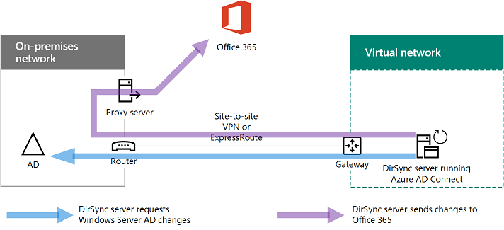
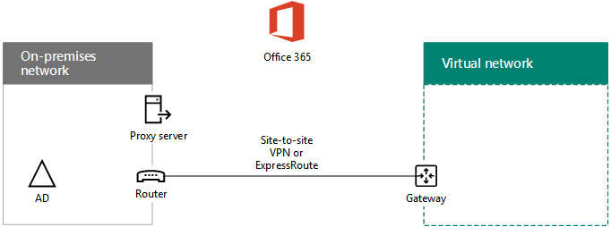
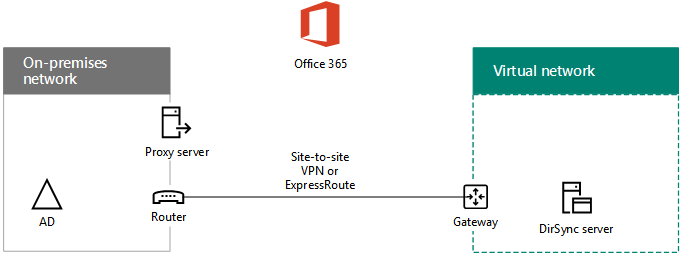
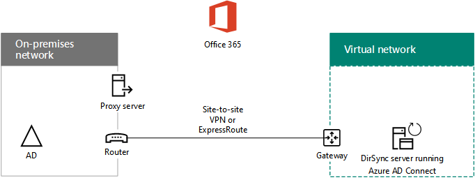

# Distribuire la sincronizzazione della directory (DirSync) di Office 365 in Microsoft Azure

 **Riepilogo:** Distribuire Azure Connect Active Directory (DirSync) in una macchina virtuale in Azure per sincronizzare gli account tra la directory locale e il tenant Azure Active Directory la sottoscrizione a Office 365.
  
Azure Active Directory (AD) Connect (precedentemente noto come lo strumento di sincronizzazione della Directory, strumento di sincronizzazione Directory o lo strumento DirSync.exe) è un'applicazione basata su server installata in un server di dominio per la sincronizzazione di Windows Server in locale Utenti di Active Directory per il tenant Azure Active Directory la sottoscrizione a Office 365. È possibile installare Connetti Azure Active Directory in un server locale, ma è anche possibile installarlo in una macchina virtuale in Azure per i motivi seguenti:
  
- È possibile effettuare il provisioning e configurare i server basati su cloud più rapidamente, in modo da rendere disponibili i servizi in minor tempo.
    
- Azure offre una maggiore disponibilità del sito in tutta semplicità.
    
- È possibile ridurre il numero di server locali dell'organizzazione.
    
> [!IMPORTANT]
> Questa soluzione richiede la connettività tra la rete locale e la rete virtuale Azure. Per ulteriori informazioni, vedere [Connect una rete locale a una rete virtuale Microsoft Azure](connect-an-on-premises-network-to-a-microsoft-azure-virtual-network.md). 
  
> [!IMPORTANT]
> In questo articolo viene descritta la sincronizzazione di un singolo dominio in una singola foresta. Azure Active Directory Connetti Sincronizza tutti i domini di Windows Server Active Directory nella foresta di Active Directory con Office 365. Se si dispone di più foreste di Active Directory da sincronizzare con Office 365, vedere [Sincronizzazione di Directory a più foreste con Scenario Single Sign-On](https://go.microsoft.com/fwlink/p/?LinkId=393091). 
  
> [!NOTE]
> Azure Active Directory (Azure Active Directory) utilizzata da Office 365 per il servizio directory. La sottoscrizione di Office 365 include un tenant di Azure Active Directory. In questo tenant anche utilizzabile per la gestione delle identità dell'organizzazione con altri carichi di lavoro cloud, incluse le applicazioni SaaS e altre App in Azure. 
  
## Panoramica relativa alla distribuzione della sincronizzazione directory di Office 365 in Azure 

Nel diagramma seguente viene illustrato in esecuzione in una macchina virtuale in Azure (server DirSync) che consente di sincronizzare una foresta di Windows Server Active Directory locale alla sottoscrizione anOffice 365 Azure Connect di Active Directory.
  

  
Nel diagramma, esistono due reti connesse mediante una connessione VPN o ExpressRoute sito per sito. Esiste una rete locale dove si trovano i controller di dominio Windows Server Active Directory e non esiste una rete virtuale Azure con un server DirSync, che corrisponde a una macchina virtuale in esecuzione [Connetti Azure Active Directory](https://www.microsoft.com/download/details.aspx?id=47594). Esistono due flussi principale del traffico proveniente dal server DirSync:
  
-  Azure AD Connect esegue la query a un controller di dominio nella rete locale per apportare modifiche ad account e password.
    
-  Azure Active Directory Connetti invia le modifiche agli account e password per l'istanza di Azure Active Directory della sottoscrizione a Office 365. Dal momento che il server DirSync si trova in una parte della rete locale estesa, queste modifiche vengono inviate tramite server proxy di rete locale.
    
> [!NOTE]
> Questa soluzione viene descritta la sincronizzazione di un singolo dominio Active Directory in una singola foresta di Active Directory. Azure Active Directory Connetti Sincronizza tutti i domini di Active Directory nella foresta di Active Directory con Office 365. Se si dispone di più foreste di Active Directory da sincronizzare con Office 365, vedere [Sincronizzazione di Directory a più foreste con Scenario Single Sign-On](https://go.microsoft.com/fwlink/p/?LinkId=393091). 
  
In entrambi i casi, il traffico generato da Azure Active Directory Connetti in esecuzione nella macchina virtuale Azure viene inoltrato a un gateway in rete virtuale in Azure, che quindi inoltra il traffico tra la connessione a siti VPN o ExpressRoute al dispositivo gateway VPN su la rete locale. L'infrastruttura di routing di rete locale inoltra quindi il traffico alla destinazione, ad esempio un controller di dominio o un server proxy.
  
La distribuzione di questa soluzione comprende due passaggi principali:
  
1. Creare una rete virtuale Azure e stabilire una connessione VPN da sito alla rete locale. Per ulteriori informazioni, vedere [Connect una rete locale a una rete virtuale Microsoft Azure](connect-an-on-premises-network-to-a-microsoft-azure-virtual-network.md).
    
2. Installare [Connetti Azure Active Directory](https://www.microsoft.com/download/details.aspx?id=47594) in un computer aggiunto al dominio virtuale in Azure e quindi sincronizzare locale Windows Server Active Directory per Office 365. Comporta:
    
    Creazione di una macchina virtuale Azure per eseguire Connetti Azure Active Directory.
    
    Installazione e configurazione di [Azure Active Directory Connetti](https://www.microsoft.com/download/details.aspx?id=47594).
    
    La configurazione di Azure Active Directory Connect richiede le credenziali dell'account di amministratore di Azure Active Directory e un account di amministratore di Windows Server Active Directory aziendale (nome utente e password). Connetti Azure Active Directory viene eseguito immediatamente e in modo continuativo per sincronizzare la foresta di Windows Server Active Directory locale per Office 365.
    
Prima di distribuire la soluzione nell'ambiente di produzione, utilizzare le istruzioni in [DirSync per l'ambiente di sviluppo e di testing di Office 365](dirsync-for-your-office-365-dev-test-environment.md) per impostare questa configurazione come un modello di prova per dimostrazioni o la sperimentazione.
  
> [!IMPORTANT]
> Al termine della configurazione di Azure AD Connect, questo non salva le credenziali dell'account amministratore dell'organizzazione di Windows Server AD. 
  
> [!NOTE]
> Questa soluzione viene descritta la sincronizzazione di una singola foresta di Windows Server Active Directory per Office 365. La topologia riportata in questo articolo rappresenta un solo modo per implementare questa soluzione. La topologia dell'organizzazione può variare in base sui requisiti di rete univoco e considerazioni sulla protezione. 
  
## Piano per ospitare un server DirSync per Office 365 in Azure

### Prerequisiti

Prima di iniziare, rivedere i prerequisiti relativi alla soluzione:
  
- Esaminare il contenuto correlato pianificazione nella [pianificazione della rete virtuale Azure](connect-an-on-premises-network-to-a-microsoft-azure-virtual-network.md#PlanningVirtual).
    
- Verificare che siano soddisfatti tutti i [Prerequisiti](connect-an-on-premises-network-to-a-microsoft-azure-virtual-network.md#Prerequisites) per la configurazione della rete virtuale Azure.
    
- Disporre di una sottoscrizione a Office 365 che include la funzionalità di integrazione di Active Directory. Per informazioni sulle sottoscrizioni a Office 365, passare alla [pagina di sottoscrizione Office 365](https://go.microsoft.com/fwlink/p/?LinkId=394278).
    
- Eseguire il provisioning di una macchina virtuale Azure che esegue Azure Active Directory Connetti per sincronizzare la foresta di Windows Server Active Directory locale con Office 365.
    
    È necessario disporre delle credenziali (nomi e password) per un account di amministratore di Windows Server Active Directory dell'organizzazione e un account di amministratore di Azure Active Directory.
    
### Presupposti per la progettazione dell’architettura della soluzione

Di seguito sono riportate le scelte di progettazione effettuate per questa soluzione:
  
- Questa soluzione utilizza una rete virtuale Azure singola con una connessione VPN del sito per sito. La rete virtuale Azure ospita una singola subnet che contiene un solo server, il server di DirSync in esecuzione Connetti Azure Active Directory. 
    
- Nella rete locale, sono disponibili un controller di dominio e alcuni server DNS.
    
- Connetti Azure Active Directory esegue la sincronizzazione delle password anziché single sign-on. Non è necessario distribuire un'infrastruttura di Active Directory Federation Services (ADFS). Per ulteriori informazioni sulla sincronizzazione delle password e le opzioni di single sign-on, vedere [determinare lo scenario di integrazione directory da utilizzare](https://go.microsoft.com/fwlink/p/?LinkId=393094).
    
Quando si distribuisce la soluzione nel proprio ambiente, sono disponibili ulteriori opzioni di progettazione che è possibile considerare. Tale opzioni includono:
  
- Se sono presenti server DNS in una rete virtuale Azure esistente, determinare se si desidera che il server DirSync di utilizzarli per la risoluzione dei nomi anziché i server DNS nella rete locale.
    
- Se sono presenti i controller di dominio in una rete virtuale Azure esistente, determinare se la configurazione di siti di Active Directory e servizi può essere una migliore opzione. Il server DirSync eseguire una query i controller di dominio nella rete virtuale Azure per le modifiche di account e password anziché i controller di dominio nella rete locale.
    
## Guida di orientamento alla distribuzione

Distribuzione di Azure Active Directory Connect in una macchina virtuale in Azure è costituito da tre fasi:
  
- Fase 1: Creare e configurare la rete virtuale di Azure
    
- Fase 2: Creare e configurare la macchina virtuale di Azure
    
- Fase 3: Installare e configurare Azure AD Connect
    
Dopo la distribuzione, è necessario assegnare percorsi e licenze ai nuovi account utente in Office 365.
  
> [!TIP]
> Il [Server di DirSync in Azure Deployment Kit](https://gallery.technet.microsoft.com/DirSync-Server-in-Azure-32cb2ded) contiene tutti i blocchi di Azure PowerShell per creare questa soluzione, i diagrammi in formato di Microsoft PowerPoint e Visio e una cartella di lavoro configurazione Microsoft Excel che genera Azure PowerShell blocchi di comandi personalizzati per le impostazioni.
  
### Fase 1: Creare e configurare la rete virtuale di Azure

Per creare e configurare la rete virtuale Azure, completare [fase 1: preparare la rete locale](connect-an-on-premises-network-to-a-microsoft-azure-virtual-network.md#Phase1) e [fase 2: creare la rete virtuale cross-premise in Azure](connect-an-on-premises-network-to-a-microsoft-azure-virtual-network.md#Phase2) nella distribuzione roadmap di [connettere una rete locale a un Rete virtuale Microsoft Azure](connect-an-on-premises-network-to-a-microsoft-azure-virtual-network.md).
  
Questa è la configurazione risultante.
  

  
Nella figura viene illustrata una rete locale connessa a una rete virtuale di Azure tramite una connessione VPN da sito a sito o ExpressRoute.
  
### Fase 2: Creare e configurare la macchina virtuale di Azure

Creare la macchina virtuale in Azure utilizzando le istruzioni [Crea il prima macchina virtuale di Windows nel portale di Azure](https://go.microsoft.com/fwlink/p/?LinkId=393098). Utilizzare le impostazioni seguenti:
  
- Nel riquadro di **elementi di base** , selezionare nello stesso gruppo di sottoscrizione, posizione e delle risorse come la rete virtuale. Registrare il nome utente e password in un luogo sicuro. È necessario queste versioni successive per la connessione alla macchina virtuale.
    
- Nel riquadro **Selezionare una dimensione di** scegliere le dimensioni **A2 Standard** .
    
- Nel riquadro **Impostazioni** nella sezione **archiviazione** selezionare il tipo di archiviazione **Standard** . Nella sezione **rete** selezionare il nome della rete virtuale e le subnet per ospitare il server di DirSync (non GatewaySubnet). Lasciare tutte le altre impostazioni sui rispettivi valori predefiniti.
    
Verificare che il server DirSync stia utilizzando correttamente il DNS controllando il DNS interno e accertandosi che sia stato aggiunto un record Address (A) per la macchina virtuale con l'indirizzo IP.  
  
Utilizzare le istruzioni nella [connessione alla macchina virtuale e accesso](https://docs.microsoft.com/azure/virtual-machines/virtual-machines-windows-hero-tutorial?toc=%2fazure%2fvirtual-machines%2fwindows%2ftoc.json#connect-to-the-virtual-machine-and-sign-on) per connettersi al server di DirSync con una connessione Desktop remoto. Dopo l'accesso, aggiungere la macchina virtuale al dominio di Windows Server Active Directory locale.
  
Affinché Azure AD Connect riesca ad accedere alle risorse di Internet, è necessario configurare il server DirSync affinché utilizzi il server proxy della rete locale. È necessario contattare l'amministratore di rete per visualizzare eventuali ulteriori procedure di configurazione da eseguire.
  
Questa è la configurazione risultante.
  

  
Nella figura viene illustrata la macchina virtuale del server DirSync nella rete virtuale Azure cross-premise.
  
### Fase 3: Installare e configurare Azure AD Connect

Completare la procedura seguente:
  
1. Connettersi al server DirSync mediante una connessione Desktop remoto con un account di dominio di Windows Server Active Directory che dispone dei privilegi di amministratore locale. Vedere [Connect to la macchina virtuale e sign-on](https://docs.microsoft.com/azure/virtual-machines/virtual-machines-windows-hero-tutorial?toc=%2fazure%2fvirtual-machines%2fwindows%2ftoc.json#connect-to-the-virtual-machine-and-sign-on).
    
2. Dal server DirSync, aprire l'articolo [configurare la sincronizzazione delle directory in Office 365](https://support.office.com/article/Set-up-directory-synchronization-in-Office-365-1b3b5318-6977-42ed-b5c7-96fa74b08846) e seguire le istruzioni per la sincronizzazione della directory con la sincronizzazione delle password.
    
> [!CAUTION]
> Il programma di installazione crea l'account **AAD_xxxxxxxxxxxx** nell'unità organizzativa (OU) gli utenti locali. Non spostare o rimuovere l'account o la sincronizzazione avrà esito negativo.
  
Questa è la configurazione risultante.
  

  
Nella figura viene illustrato il server DirSync nella rete virtuale Azure cross-premise.
  
### Assegnare percorsi e licenze agli utenti in Office 365

Azure AD Connect aggiunge account alla sottoscrizione a Office 365 da Windows Server AD locale, ma per consentire agli utenti di accedere a Office 365 e utilizzarne i servizi, gli account devono essere configurati con un percorso e le licenze. Seguire questi passaggi per aggiungere il percorso e attivare le licenze per gli account utente appropriati:
  
1. Accedere alla [pagina del portale di Office 365](https://portal.office.com)e quindi fare clic su **amministratore**.
    
2. Nel riquadro di spostamento sinistro fare clic su **Utenti > Utenti attivi**.
    
3. Nell’elenco degli account utente, selezionare la casella di controllo accanto all'utente che si desidera attivare.
    
4. Nella pagina per l'utente, fare clic su **Modifica** per **le licenze del prodotto**.
    
5. Nella pagina **dei titoli di prodotto** selezionare un percorso per utente per la **posizione**e quindi abilitare i titoli appropriati per l'utente.
    
6. Al termine, fare clic su **Salva**e quindi fare doppio clic su **Chiudi** .
    
7. Tornare al passaggio 3 per altri utenti.
    
## Vedere anche

[Adozione del cloud e soluzioni ibride](cloud-adoption-and-hybrid-solutions.md)
  
[Connettere una rete locale a una rete virtuale di Microsoft Azure](connect-an-on-premises-network-to-a-microsoft-azure-virtual-network.md)

[Connettere il download Azure Active Directory](https://www.microsoft.com/download/details.aspx?id=47594)
  
[Configurare la sincronizzazione delle directory in Office 365](https://support.office.com/article/Set-up-directory-synchronization-in-Office-365-1b3b5318-6977-42ed-b5c7-96fa74b08846)
  
[Server di DirSync in Azure Deployment Kit](https://gallery.technet.microsoft.com/DirSync-Server-in-Azure-32cb2ded)

