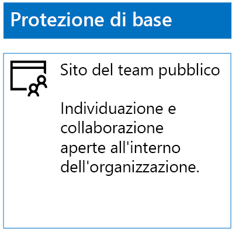
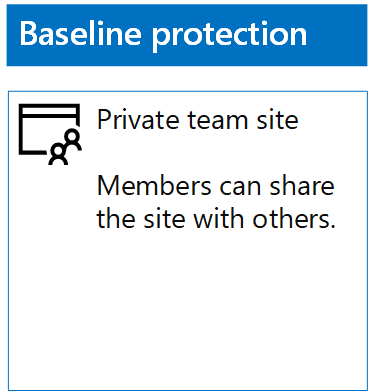
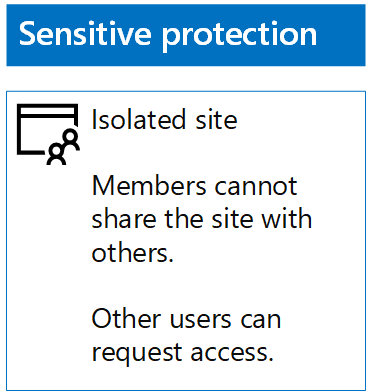
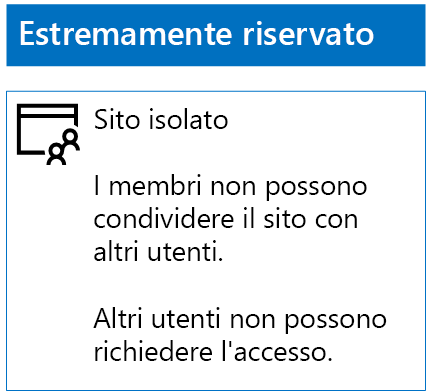

# Distribuzione di siti di SharePoint Online per tre livelli di protezione

 **Riepilogo:** Creare e configurare siti del team SharePoint Online per i diversi livelli di protezione delle informazioni.
  
Utilizzare i passaggi descritti in questo articolo per progettare e distribuire previsto, importanti o altamente riservati team siti di SharePoint Online. Per ulteriori informazioni su questi tre livelli di protezione, vedere [file e siti di SharePoint Online sicura](secure-sharepoint-online-sites-and-files.md).
  
## Siti del team di SharePoint Online di base

La protezione di base include siti del team pubblici e privati. I siti del team pubblici possono essere individuati e sono accessibili da chiunque nell'organizzazione. I siti privati possono essere individuati e sono accessibili solo dai membri del gruppo Office 365 associato al sito del team. Entrambi questi tipi di siti del team consentono ai membri di condividere il sito con altri utenti.
  
### Pubblico

Per creare un sito del team di SharePoint Online di base con autorizzazioni e accesso pubblico, eseguire le operazioni seguenti:
  
1. Accedere al portale di Office 365 con un account che verrà utilizzato anche per amministrare il sito del team di SharePoint Online (un amministratore di SharePoint Online). Per ulteriori informazioni, vedere [la posizione in cui eseguire l'accesso a Office 365](https://support.office.com/Article/Where-to-sign-in-to-Office-365-e9eb7d51-5430-4929-91ab-6157c5a050b4).
    
2. Nell'elenco delle sezioni, fare clic su **SharePoint**.
    
3. Nella scheda **SharePoint** nuovo nel browser, fare clic su **Crea sito +**.
    
4. Nella pagina **Crea sito** fare clic su **sito del Team**.
    
5. In **nome sito**digitare un nome per il sito del team pubblica. 
    
6. Nella **descrizione del sito del Team**, digitare una descrizione dello scopo del sito.
    
7. In **impostazioni di Privacy**, selezionare **Pubblica - tutti gli utenti dell'organizzazione possono accedere al sito**e quindi fare clic su **Avanti**.
    
8. Nella **che si desidera aggiungere?** riquadro, fare clic su **Fine**.
    
Di seguito è riportata la configurazione risultante.
  

  
### Privato

Per creare un sito del team di SharePoint Online di base con autorizzazioni e accesso privato, eseguire le operazioni seguenti:
  
1. Accedere al portale di Office 365 con un account che verrà utilizzato anche per amministrare il sito del team di SharePoint Online (un amministratore di SharePoint Online). Per ulteriori informazioni, vedere [la posizione in cui eseguire l'accesso a Office 365](https://support.office.com/Article/Where-to-sign-in-to-Office-365-e9eb7d51-5430-4929-91ab-6157c5a050b4).
    
2. Nell'elenco delle sezioni, fare clic su **SharePoint**.
    
3. Nella scheda **SharePoint** nuovo nel browser, fare clic su **Crea sito +**.
    
4. Nella pagina **Crea sito** fare clic su **sito del Team**.
    
5. In **nome sito**digitare un nome per il sito del team privata. 
    
6. Nella **casella Descrizione sito del Team,** digitare una descrizione dello scopo del sito.
    
7. **Le impostazioni di Privacy**, selezionare **privato: solo membri possono accedere al sito**e quindi fare clic su **Avanti**.
    
8. Nella **che si desidera aggiungere?** riquadro, **aggiungere membri**, digitare i nomi degli account utente che dispongono dell'accesso al sito del team privata.
    
9. Dopo aver aggiungendo l'insieme iniziale di membri per il sito, fare clic su **Fine**
    
Di seguito è riportata la configurazione risultante.
  

  
## Siti del team di SharePoint Online riservati

Un sito del team di SharePoint Online riservato è un sito del team isolato. Ciò significa che le autorizzazioni vengono controllate tramite l'appartenenza ai gruppi di SharePoint anziché tramite l’appartenenza al gruppo di Office 365 associato al sito del team.
  
Per creare un sito del team isolato, sono disponibili due passaggi principali.
  
### Passaggio 1: Progettare il sito isolato

Per progettare il sito del team isolato, è necessario determinare:
  
- I gruppi di SharePoint e i livelli di autorizzazione.
    
- Il set di gruppi di accesso che saranno membri dei gruppi di SharePoint.
    
     Il set di gruppi di accesso consigliato è un modello per i membri del sito, uno per i visualizzatori del sito e uno per gli amministratori del sito.
    
- Se si utilizzeranno o meno gruppi annidati all'interno dei gruppi di accesso.
    
Ad esempio, i livelli di struttura e autorizzazione del gruppo consigliati sono analoghi a quanto segue:
  
|**Gruppo di SharePoint**|**Livello di autorizzazione**|**Gruppo di accesso (esempi)**|
|:-----|:-----|:-----|
|[nome sito] Membri    |Modifica    |[nome sito] Membri    |
|[nome sito] Visitatori di    |Lettura    |[nome sito] Visualizzatori    |
|[nome sito] Proprietari    |Controllo completo    |[nome sito] Amministratori    |
   
I gruppi di SharePoint e i livelli di autorizzazione vengono creati per impostazione predefinita per un sito del team. È necessario determinare i nomi dei gruppi di accesso.
  
Per i dettagli del processo di progettazione, vedere [Progettazione di un sito del team di SharePoint Online isolato](design-an-isolated-sharepoint-online-team-site.md).
  
### Passaggio 2: Implementare il sito isolato

Per implementare il sito isolato, è innanzitutto necessario:
  
- Determinare gli account utente e i gruppi da aggiungere a tutti i gruppi di accesso.
    
- Creare gruppi di accesso e aggiungere l’utente e i membri dei gruppi.
    
Per ulteriori informazioni, vedere la **fase 1** di [distribuire un sito del team di SharePoint Online isolato](deploy-an-isolated-sharepoint-online-team-site.md).
  
Successivamente, creare il sito del team di SharePoint Online seguendo questi passaggi.
  
1. Accedere al portale di Office 365 con un account che verrà utilizzato anche per amministrare il sito del team di SharePoint Online (un amministratore di SharePoint Online). Per ulteriori informazioni, vedere [la posizione in cui eseguire l'accesso a Office 365](https://support.office.com/Article/Where-to-sign-in-to-Office-365-e9eb7d51-5430-4929-91ab-6157c5a050b4).
    
2. Nell'elenco delle sezioni, fare clic su **SharePoint**.
    
3. In una nuova scheda **SharePoint** del browser, fare clic su **Crea sito +**.
    
4. Nella pagina **Crea sito** fare clic su **sito del Team**.
    
5. In **nome sito**digitare un nome per il sito del team privata.
    
6. Nella **descrizione del sito del Team**, digitare una descrizione facoltativa.
    
7. **Le impostazioni di Privacy**, selezionare **privato: solo membri possono accedere al sito**e quindi fare clic su **Avanti**.
    
8. Nella **che si desidera aggiungere?** riquadro, fare clic su **Fine**.
    
Successivamente, dal nuovo sito del team di SharePoint Online configurare le autorizzazioni seguendo questi passaggi.
  
1. Determinare il Nome dell'entità utente (UPN) di cui l'amministratore IT o altra persona sarà responsabile per rispondere a e indirizzare le richieste di accesso al sito (un esempio di UPN è belindan@contoso.com). Scrivere l’UPN di seguito: _________________________________________.
    
2. Nella barra degli strumenti, fare clic sull'icona impostazioni e quindi fare clic su **autorizzazioni sito**.
    
3. Nel riquadro **autorizzazioni sito** fare clic su **impostazioni di autorizzazioni avanzate**.
    
4. Nella scheda **autorizzazioni** nuova del browser, fare clic su **Impostazioni richieste di accesso**.
    
5. Nella finestra di dialogo **Impostazioni di richieste di accesso** :
    
  - Deselezionare le caselle di controllo **Consenti ai membri di condividere il sito e i singoli file e cartelle** e i **membri Consenti per invitare altre persone al gruppo membri del sito** .
    
  - **Inviare tutte le richieste di accesso**digitare l'UPN dell'amministratore IT nel passaggio 1.
    
  - Fare clic su **OK**.
    
6. Nella scheda **autorizzazioni** del browser fare clic su **[nome sito] membri** nell'elenco.
    
7. In **utenti e gruppi**fare clic su **Nuovo**.
    
8. Nella finestra di dialogo **condivisione** digitare il nome del gruppo di accesso membri del sito per il sito, selezionarlo e fare clic su **Condividi**.
    
9. Fare clic sul pulsante Indietro del browser.
    
10. Fare clic su **[nome sito] proprietari** nell'elenco.
    
11. In **utenti e gruppi**fare clic su **Nuovo**.
    
12. Nella finestra di dialogo **condivisione** digitare il nome del gruppo di accesso degli amministratori del sito per il sito, selezionarlo e fare clic su **Condividi**.
    
13. Fare clic sul pulsante Indietro del browser.
    
14. Fare clic su **visitatori di [nome sito]** nell'elenco.
    
15. In **utenti e gruppi**fare clic su **Nuovo**.
    
16. Nella finestra di dialogo **condivisione** digitare il nome del gruppo di accesso i visualizzatori del sito per il sito, selezionarlo e fare clic su **Condividi**.
    
17. Chiudere la scheda **autorizzazioni** della finestra del browser.
    
I risultati di queste impostazioni delle autorizzazioni sono i seguenti:
  
- Gruppo di SharePoint **proprietari di [nome sito]** contiene gruppo access gli amministratori del sito, in cui tutti i membri dispongono del livello di autorizzazione **controllo completo** .
    
- Gruppo di SharePoint **membri di [nome sito]** contiene il gruppo di accesso membri del sito, in cui tutti i membri dispongono del livello di autorizzazione **Modifica** .
    
- Gruppo di SharePoint **visitatori di [nome sito]** contiene il gruppo di accesso i visualizzatori del sito, in cui tutti i membri dispongono del livello di autorizzazione **lettura** .
    
- La possibilità per i membri di invitare altri membri è disattivata.
    
- La possibilità per gli utenti non membri richiedere l'accesso è abilitata.
    
Di seguito è riportata la configurazione risultante.
  

  
I membri del sito, tramite l'appartenenza a uno dei gruppi di accesso, possono, a questo punto, collaborare in tutta sicurezza utilizzando le risorse del sito.
  
## Siti del team di SharePoint Online estremamente riservati

Un sito del team di SharePoint Online estremamente riservato è un sito del team isolato. Ciò significa che le autorizzazioni vengono controllate tramite l'appartenenza ai gruppi di SharePoint anziché tramite l’appartenenza al gruppo di Office 365 associato al sito del team.
  
Per creare un sito del team isolato per informazioni estremamente riservate e collaborazioni, sono disponibili due passaggi principali.
  
### Passaggio 1: Progettare il sito isolato

Per progettare il sito del team isolato, è necessario determinare:
  
- I gruppi di SharePoint e i livelli di autorizzazione.
    
- Il set di gruppi di accesso che saranno membri dei gruppi di SharePoint.
    
     Il set di gruppi di accesso consigliato è un modello per i membri del sito, uno per i visualizzatori del sito e uno per gli amministratori del sito.
    
- Se si utilizzeranno o meno gruppi annidati all'interno dei gruppi di accesso.
    
Ad esempio, i livelli di struttura e autorizzazione del gruppo consigliati sono analoghi a quanto segue:
  
|**Gruppo di SharePoint**|**Livello di autorizzazione**|**Gruppo di accesso (esempi)**|
|:-----|:-----|:-----|
|[nome sito] Membri    |Modifica    |[nome sito] Membri    |
|[nome sito] Visitatori di    |Lettura    |[nome sito] Visualizzatori    |
|[nome sito] Proprietari    |Controllo completo    |[nome sito] Amministratori    |
   
I gruppi di SharePoint e i livelli di autorizzazione vengono creati per impostazione predefinita per un sito del team. È necessario determinare i nomi dei gruppi di accesso.
  
Per i dettagli del processo di progettazione, vedere [Progettazione di un sito del team di SharePoint Online isolato](design-an-isolated-sharepoint-online-team-site.md).
  
### Passaggio 2: Implementare il sito isolato

Per implementare il sito isolato, è innanzitutto necessario:
  
- Determinare l’utente e i membri del gruppo di ciascun gruppo di accesso
    
- Creare gruppi di accesso e aggiungere l’utente e i membri dei gruppi
    
- Creare un sito del team isolato che utilizzi i gruppi di accesso
    
Per ulteriori informazioni, vedere [distribuzione di un sito del team di SharePoint Online isolato](deploy-an-isolated-sharepoint-online-team-site.md).
  
I risultati di queste impostazioni delle autorizzazioni sono:
  
- Gruppo di SharePoint **proprietari di [nome sito]** contiene gruppo access gli amministratori del sito, in cui tutti i membri dispongono del livello di autorizzazione **controllo completo** .
    
- Gruppo di SharePoint **membri di [nome sito]** contiene il gruppo di accesso membri del sito, in cui tutti i membri dispongono del livello di autorizzazione **Modifica** .
    
- Gruppo di SharePoint **visitatori di [nome sito]** contiene il gruppo di accesso i visualizzatori del sito, in cui tutti i membri dispongono del livello di autorizzazione **lettura** .
    
- La possibilità per i membri di invitare altri membri è disattivata.
    
- La possibilità per gli utenti non membri richiedere l'accesso è disattivata.
    
Di seguito è riportata la configurazione risultante.
  

  
I membri del sito, tramite l'appartenenza a uno dei gruppi di accesso, possono, a questo punto, collaborare in tutta sicurezza utilizzando le risorse del sito.
  
## Passaggio successivo

[Proteggere i file di SharePoint Online con Office 365 etichette e DLP](protect-sharepoint-online-files-with-office-365-labels-and-dlp.md)
    
## Vedere anche

[Protezione di file e siti di SharePoint Online](secure-sharepoint-online-sites-and-files.md)
  
[Proteggere i siti di SharePoint Online in un ambiente di sviluppo e di testing](secure-sharepoint-online-sites-in-a-dev-test-environment.md)
  
[Guida sulla sicurezza Microsoft per organizzazioni che si occupano della campagna politica, no profit e altre organizzazioni agili](microsoft-security-guidance-for-political-campaigns-nonprofits-and-other-agile-o.md)
  
[Adozione del cloud e soluzioni ibride](cloud-adoption-and-hybrid-solutions.md)

