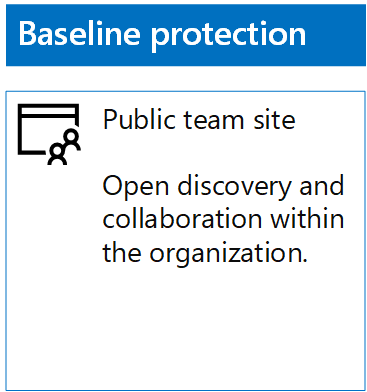
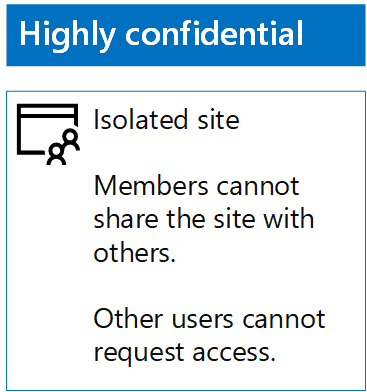

# Distribuzione di siti di SharePoint Online per tre livelli di protezioneDeploy SharePoint Online sites for three tiers of protection

 **Riepilogo:** Creare e configurare siti del team SharePoint Online per i diversi livelli di protezione delle informazioni.**Summary:** Create and configure SharePoint Online team sites for various levels of information protection.
  
Utilizzare i passaggi descritti in questo articolo per progettare e distribuire previsto, importanti o altamente riservati team siti di SharePoint Online. Per ulteriori informazioni su questi tre livelli di protezione, vedere [file e siti di SharePoint Online sicura](secure-sharepoint-online-sites-and-files.md).Use the steps in this article to design and deploy baseline, sensitive, and highly confidential SharePoint Online team sites. For more information about these three tiers of protection, see [Secure SharePoint Online sites and files](secure-sharepoint-online-sites-and-files.md).
  
## Siti del team di SharePoint Online di baseBaseline SharePoint Online team sites

La protezione di base include siti del team pubblici e privati. I siti del team pubblici possono essere individuati e sono accessibili da chiunque nell'organizzazione. I siti privati possono essere individuati e sono accessibili solo dai membri del gruppo Office 365 associato al sito del team. Entrambi questi tipi di siti del team consentono ai membri di condividere il sito con altri utenti.Baseline protection includes both public and private team sites. Public team sites can be discovered and accessed by anybody in the organization. Private sites can only be discovered and accessed by members of the Office 365 group associated with the team site. Both of these types of team sites allow members to share the site with others.
  
### PubblicoPublic

Per creare un sito del team di SharePoint Online di base con autorizzazioni e accesso pubblico, eseguire le operazioni seguenti:To create a baseline SharePoint Online team site with public access and permissions, do the following:
  
1. Accedere al portale di Office 365 con un account che verrà utilizzato anche per amministrare il sito del team di SharePoint Online (un amministratore di SharePoint Online). Per ulteriori informazioni, vedere [la posizione in cui eseguire l'accesso a Office 365](https://support.office.com/Article/Where-to-sign-in-to-Office-365-e9eb7d51-5430-4929-91ab-6157c5a050b4).Sign in to the Office 365 portal with an account that will also be used to administer the SharePoint Online team site (a SharePoint Online administrator). For help, see [Where to sign in to Office 365](https://support.office.com/Article/Where-to-sign-in-to-Office-365-e9eb7d51-5430-4929-91ab-6157c5a050b4).
    
2. Nell'elenco delle sezioni, fare clic su **SharePoint**.In the list of tiles, click **SharePoint**.
    
3. Nella scheda **SharePoint** nuovo nel browser, fare clic su **Crea sito +**.On the new **SharePoint** tab in your browser, click **+ Create site**.
    
4. Nella pagina **Crea sito** fare clic su **sito del Team**.On the **Create a site** page, click **Team site**.
    
5. In **nome sito**digitare un nome per il sito del team pubblica.In **Site name**, type a name for the public team site. 
    
6. Nella **descrizione del sito del Team**, digitare una descrizione dello scopo del sito.In **Team site description**, type a description of the purpose of the site.
    
7. In **impostazioni di Privacy**, selezionare **Pubblica - tutti gli utenti dell'organizzazione possono accedere al sito**e quindi fare clic su **Avanti**.In **Privacy settings**, select **Public - anyone in the organization can access this site**, and then click **Next**.
    
8. Nella **che si desidera aggiungere?** riquadro, fare clic su **Fine**.On the **Who do you want to add?** pane, click **Finish**.
    
Di seguito è riportata la configurazione risultante.Here is your resulting configuration.
  

  
### PrivatoPrivate

Per creare un sito del team di SharePoint Online di base con autorizzazioni e accesso privato, eseguire le operazioni seguenti:To create a baseline SharePoint Online team site with private access and permissions, do the following:
  
1. Accedere al portale di Office 365 con un account che verrà utilizzato anche per amministrare il sito del team di SharePoint Online (un amministratore di SharePoint Online). Per ulteriori informazioni, vedere [la posizione in cui eseguire l'accesso a Office 365](https://support.office.com/Article/Where-to-sign-in-to-Office-365-e9eb7d51-5430-4929-91ab-6157c5a050b4).Sign in to the Office 365 portal with an account that will also be used to administer the SharePoint Online team site (a SharePoint Online administrator). For help, see [Where to sign in to Office 365](https://support.office.com/Article/Where-to-sign-in-to-Office-365-e9eb7d51-5430-4929-91ab-6157c5a050b4).
    
2. Nell'elenco delle sezioni, fare clic su **SharePoint**.In the list of tiles, click **SharePoint**.
    
3. Nella scheda **SharePoint** nuovo nel browser, fare clic su **Crea sito +**.On the new **SharePoint** tab in your browser, click **+ Create site**.
    
4. Nella pagina **Crea sito** fare clic su **sito del Team**.On the **Create a site** page, click **Team site**.
    
5. In **nome sito**digitare un nome per il sito del team privata.In **Site name**, type a name for the private team site. 
    
6. Nella **casella Descrizione sito del Team,** digitare una descrizione dello scopo del sito.In **Team site description,** type a description of the purpose of the site.
    
7. **Le impostazioni di Privacy**, selezionare **privato: solo membri possono accedere al sito**e quindi fare clic su **Avanti**.In **Privacy settings**, select **Private - only members can access this site**, and then click **Next**.
    
8. Nella **che si desidera aggiungere?** riquadro, **aggiungere membri**, digitare i nomi degli account utente che dispongono dell'accesso al sito del team privata.On the **Who do you want to add?** pane, in **Add members**, type the names of user accounts that have access to this private team site.
    
9. Dopo aver aggiungendo l'insieme iniziale di membri per il sito, fare clic su **Fine**When you are done adding the initial set of members to the site, click **Finish**
    
Di seguito è riportata la configurazione risultante.Here is your resulting configuration.
  

  
## Siti del team di SharePoint Online riservatiSensitive SharePoint Online team sites

Un sito del team di SharePoint Online riservato è un sito del team isolato. Ciò significa che le autorizzazioni vengono controllate tramite l'appartenenza ai gruppi di SharePoint anziché tramite l’appartenenza al gruppo di Office 365 associato al sito del team.A sensitive SharePoint Online team site is an isolated team site, which means that permissions are controlled through membership in SharePoint groups instead of membership in the Office 365 group associated with the team site.
  
Per creare un sito del team isolato, sono disponibili due passaggi principali.To create an isolated team site, there are two main steps.
  
### Passaggio 1: Progettare il sito isolatoStep 1: Design your isolated site

Per progettare il sito del team isolato, è necessario determinare:To design your isolated team site, you need to determine:
  
- I gruppi di SharePoint e i livelli di autorizzazione.Your SharePoint groups and permission levels.
    
- Il set di gruppi di accesso che saranno membri dei gruppi di SharePoint.The set of access groups that will be members of your SharePoint groups.
    
     Il set di gruppi di accesso consigliato è un modello per i membri del sito, uno per i visualizzatori del sito e uno per gli amministratori del sito.The recommended set of access groups is one for site members, one for site viewers, and one for site administrators.
    
- Se si utilizzeranno o meno gruppi annidati all'interno dei gruppi di accesso.Whether you will use nested groups within your access groups.
    
Ad esempio, i livelli di struttura e autorizzazione del gruppo consigliati sono analoghi a quanto segue:For example, the recommended group structure and permission levels look like this:
  
|**Gruppo di SharePoint****SharePoint group**|**Livello di autorizzazione****Permission level**|**Gruppo di accesso (esempi)****Access group (examples)**|
|:-----|:-----|:-----|
|[nome sito] Membri[site name] Members    |ModificaEdit    |[nome sito] Membri[site name] Members    |
|[nome sito] Visitatori di[site name] Visitors    |LetturaRead    |[nome sito] Visualizzatori[site name] Viewers    |
|[nome sito] Proprietari[site name] Owners    |Controllo completoFull control    |[nome sito] Amministratori[site name] Admins    |
   
I gruppi di SharePoint e i livelli di autorizzazione vengono creati per impostazione predefinita per un sito del team. È necessario determinare i nomi dei gruppi di accesso.The SharePoint groups and permission levels are created by default for a team site. You need to determine the names of your access groups.
  
Per i dettagli del processo di progettazione, vedere [Progettazione di un sito del team di SharePoint Online isolato](design-an-isolated-sharepoint-online-team-site.md).For the details of the design process, see [Design an isolated SharePoint Online team site](design-an-isolated-sharepoint-online-team-site.md).
  
### Passaggio 2: Implementare il sito isolatoStep 2: Deploy your isolated site

Per implementare il sito isolato, è innanzitutto necessario:To deploy your isolated site, you first need to:
  
- Determinare gli account utente e i gruppi da aggiungere a tutti i gruppi di accesso.Determine the user accounts and groups to add to each of your access groups.
    
- Creare gruppi di accesso e aggiungere l’utente e i membri dei gruppi.Create the access groups and add the user and group members.
    
Per ulteriori informazioni, vedere la **fase 1** di [distribuire un sito del team di SharePoint Online isolato](deploy-an-isolated-sharepoint-online-team-site.md).For the detailed steps, see **Phase 1** of [Deploy an isolated SharePoint Online team site](deploy-an-isolated-sharepoint-online-team-site.md).
  
Successivamente, creare il sito del team di SharePoint Online seguendo questi passaggi.Next, you create the SharePoint Online team site with these steps.
  
1. Accedere al portale di Office 365 con un account che verrà utilizzato anche per amministrare il sito del team di SharePoint Online (un amministratore di SharePoint Online). Per ulteriori informazioni, vedere [la posizione in cui eseguire l'accesso a Office 365](https://support.office.com/Article/Where-to-sign-in-to-Office-365-e9eb7d51-5430-4929-91ab-6157c5a050b4).Sign in to the Office 365 portal with an account that will also be used to administer the SharePoint Online team site (a SharePoint Online administrator). For help, see [Where to sign in to Office 365](https://support.office.com/Article/Where-to-sign-in-to-Office-365-e9eb7d51-5430-4929-91ab-6157c5a050b4).
    
2. Nell'elenco delle sezioni, fare clic su **SharePoint**.In the list of tiles, click **SharePoint**.
    
3. In una nuova scheda **SharePoint** del browser, fare clic su **Crea sito +**.In the new **SharePoint** tab of your browser, click **+ Create site**.
    
4. Nella pagina **Crea sito** fare clic su **sito del Team**.On the **Create a site** page, click **Team site**.
    
5. In **nome sito**digitare un nome per il sito del team privata.In **Site name**, type a name for the private team site.
    
6. Nella **descrizione del sito del Team**, digitare una descrizione facoltativa.In **Team site description**, type an optional description.
    
7. **Le impostazioni di Privacy**, selezionare **privato: solo membri possono accedere al sito**e quindi fare clic su **Avanti**.In **Privacy settings**, select **Private - only members can access this site**, and then click **Next**.
    
8. Nella **che si desidera aggiungere?** riquadro, fare clic su **Fine**.On the **Who do you want to add?** pane, click **Finish**.
    
Successivamente, dal nuovo sito del team di SharePoint Online configurare le autorizzazioni seguendo questi passaggi.Next, from the new SharePoint Online team site, configure permissions with these steps.
  
1. Determinare il Nome dell'entità utente (UPN) di cui l'amministratore IT o altra persona sarà responsabile per rispondere a e indirizzare le richieste di accesso al sito (un esempio di UPN è belindan@contoso.com). Scrivere l’UPN di seguito: _________________________________________.Determine the User Principal Name (UPN) of the IT administrator or other person who will be responsible for responding to and addressing requests for access to the site (belindan@contoso.com is an example of a UPN). Write that UPN here: _________________________________________.
    
2. Nella barra degli strumenti, fare clic sull'icona impostazioni e quindi fare clic su **autorizzazioni sito**.In the tool bar, click the settings icon, and then click **Site permissions**.
    
3. Nel riquadro **autorizzazioni sito** fare clic su **impostazioni di autorizzazioni avanzate**.In the **Site permissions** pane, click **Advanced permissions settings**.
    
4. Nella scheda **autorizzazioni** nuova del browser, fare clic su **Impostazioni richieste di accesso**.On the new **Permissions** tab of your browser, click **Access Request Settings**.
    
5. Nella finestra di dialogo **Impostazioni di richieste di accesso** :In the **Access Requests Settings** dialog box:
    
  - Deselezionare le caselle di controllo **Consenti ai membri di condividere il sito e i singoli file e cartelle** e i **membri Consenti per invitare altre persone al gruppo membri del sito** .Clear the **Allow members to share the site and individual files and folders** and **Allow members to invite others to the site members group** check boxes.
    
  - **Inviare tutte le richieste di accesso**digitare l'UPN dell'amministratore IT nel passaggio 1.Type the UPN of your IT administrator from step 1 in **Send all requests for access**.
    
  - Fare clic su **OK**.Click **OK**.
    
6. Nella scheda **autorizzazioni** del browser fare clic su **[nome sito] membri** nell'elenco.On the **Permissions** tab of your browser, click **[site name] Members** in the list.
    
7. In **utenti e gruppi**fare clic su **Nuovo**.In **People and Groups**, click **New**.
    
8. Nella finestra di dialogo **condivisione** digitare il nome del gruppo di accesso membri del sito per il sito, selezionarlo e fare clic su **Condividi**.In the **Share** dialog box, type the name of your site members access group for this site, select it, and then click **Share**.
    
9. Fare clic sul pulsante Indietro del browser.Click the back button on your browser.
    
10. Fare clic su **[nome sito] proprietari** nell'elenco.Click **[site name] Owners** in the list.
    
11. In **utenti e gruppi**fare clic su **Nuovo**.In **People and Groups**, click **New**.
    
12. Nella finestra di dialogo **condivisione** digitare il nome del gruppo di accesso degli amministratori del sito per il sito, selezionarlo e fare clic su **Condividi**.In the **Share** dialog box, type the name of the site administrators access group for this site, select it, and then click **Share**.
    
13. Fare clic sul pulsante Indietro del browser.Click the back button on your browser.
    
14. Fare clic su **visitatori di [nome sito]** nell'elenco.Click **[site name] Visitors** in the list.
    
15. In **utenti e gruppi**fare clic su **Nuovo**.In **People and Groups**, click **New**.
    
16. Nella finestra di dialogo **condivisione** digitare il nome del gruppo di accesso i visualizzatori del sito per il sito, selezionarlo e fare clic su **Condividi**.In the **Share** dialog box, type the name of the site viewers access group for this site, select it, and then click **Share**.
    
17. Chiudere la scheda **autorizzazioni** della finestra del browser.Close the **Permissions** tab of your browser.
    
I risultati di queste impostazioni delle autorizzazioni sono i seguenti:The results of these permission settings are:
  
- Gruppo di SharePoint **proprietari di [nome sito]** contiene gruppo access gli amministratori del sito, in cui tutti i membri dispongono del livello di autorizzazione **controllo completo** .The **[site name] Owners** SharePoint group contains the site administrators access group, in which all the members have the **Full control** permission level.
    
- Gruppo di SharePoint **membri di [nome sito]** contiene il gruppo di accesso membri del sito, in cui tutti i membri dispongono del livello di autorizzazione **Modifica** .The **[site name] Members** SharePoint group contains the site members access group, in which all the members have the **Edit** permission level.
    
- Gruppo di SharePoint **visitatori di [nome sito]** contiene il gruppo di accesso i visualizzatori del sito, in cui tutti i membri dispongono del livello di autorizzazione **lettura** .The **[site name] Visitors** SharePoint group contains the site viewers access group, in which all the members have the **Read** permission level.
    
- La possibilità per i membri di invitare altri membri è disattivata.The ability for members to invite other members is disabled.
    
- La possibilità per gli utenti non membri richiedere l'accesso è abilitata.The ability for non-members to request access is enabled.
    
Di seguito è riportata la configurazione risultante.Here is your resulting configuration.
  

  
I membri del sito, tramite l'appartenenza a uno dei gruppi di accesso, possono, a questo punto, collaborare in tutta sicurezza utilizzando le risorse del sito.The members of the site, through group membership in one of the access groups, can now securely collaborate on the resources of the site.
  
## Siti del team di SharePoint Online estremamente riservatiHighly confidential SharePoint Online team sites

Un sito del team di SharePoint Online estremamente riservato è un sito del team isolato. Ciò significa che le autorizzazioni vengono controllate tramite l'appartenenza ai gruppi di SharePoint anziché tramite l’appartenenza al gruppo di Office 365 associato al sito del team.A highly confidential SharePoint Online team site is an isolated team site, which means that permissions are controlled through membership in SharePoint groups instead of membership in the Office 365 group associated with the team site.
  
Per creare un sito del team isolato per informazioni estremamente riservate e collaborazioni, sono disponibili due passaggi principali.To create an isolated team site for highly confidential information and collaboration, there are two main steps.
  
### Passaggio 1: Progettare il sito isolatoStep 1: Design your isolated site

Per progettare il sito del team isolato, è necessario determinare:To design your isolated team site, you need to determine:
  
- I gruppi di SharePoint e i livelli di autorizzazione.Your SharePoint groups and permission levels.
    
- Il set di gruppi di accesso che saranno membri dei gruppi di SharePoint.The set of access groups that will be members of your SharePoint groups.
    
     Il set di gruppi di accesso consigliato è un modello per i membri del sito, uno per i visualizzatori del sito e uno per gli amministratori del sito.The recommended set of access groups is one for site members, one for site viewers, and one for site administrators.
    
- Se si utilizzeranno o meno gruppi annidati all'interno dei gruppi di accesso.Whether you will use nested groups within your access groups.
    
Ad esempio, i livelli di struttura e autorizzazione del gruppo consigliati sono analoghi a quanto segue:For example, the recommended group structure and permission levels look like this:
  
|**Gruppo di SharePoint****SharePoint group**|**Livello di autorizzazione****Permission level**|**Gruppo di accesso (esempi)****Access group (examples)**|
|:-----|:-----|:-----|
|[nome sito] Membri[site name] Members    |ModificaEdit    |[nome sito] Membri[site name] Members    |
|[nome sito] Visitatori di[site name] Visitors    |LetturaRead    |[nome sito] Visualizzatori[site name] Viewers    |
|[nome sito] Proprietari[site name] Owners    |Controllo completoFull control    |[nome sito] Amministratori[site name] Admins    |
   
I gruppi di SharePoint e i livelli di autorizzazione vengono creati per impostazione predefinita per un sito del team. È necessario determinare i nomi dei gruppi di accesso.The SharePoint groups and permission levels are created by default for a team site. You need to determine the names of your access groups.
  
Per i dettagli del processo di progettazione, vedere [Progettazione di un sito del team di SharePoint Online isolato](design-an-isolated-sharepoint-online-team-site.md).For the details of the design process, see [Design an isolated SharePoint Online team site](design-an-isolated-sharepoint-online-team-site.md).
  
### Passaggio 2: Implementare il sito isolatoStep 2: Deploy your isolated site

Per implementare il sito isolato, è innanzitutto necessario:To deploy your isolated site, you first need to:
  
- Determinare l’utente e i membri del gruppo di ciascun gruppo di accessoDetermine the user and group members of each of your access groups
    
- Creare gruppi di accesso e aggiungere l’utente e i membri dei gruppiCreate the access groups and add the user and group members
    
- Creare un sito del team isolato che utilizzi i gruppi di accessoCreate an isolated team site that uses your access groups
    
Per ulteriori informazioni, vedere [distribuzione di un sito del team di SharePoint Online isolato](deploy-an-isolated-sharepoint-online-team-site.md).For the detailed steps, see [Deploy an isolated SharePoint Online team site](deploy-an-isolated-sharepoint-online-team-site.md).
  
I risultati di queste impostazioni delle autorizzazioni sono:The results of the permission settings are:
  
- Gruppo di SharePoint **proprietari di [nome sito]** contiene gruppo access gli amministratori del sito, in cui tutti i membri dispongono del livello di autorizzazione **controllo completo** .The **[site name] Owners** SharePoint group contains the site administrators access group, in which all the members have the **Full control** permission level.
    
- Gruppo di SharePoint **membri di [nome sito]** contiene il gruppo di accesso membri del sito, in cui tutti i membri dispongono del livello di autorizzazione **Modifica** .The **[site name] Members** SharePoint group contains the site members access group, in which all the members have the **Edit** permission level.
    
- Gruppo di SharePoint **visitatori di [nome sito]** contiene il gruppo di accesso i visualizzatori del sito, in cui tutti i membri dispongono del livello di autorizzazione **lettura** .The **[site name] Visitors** SharePoint group contains the site viewers access group, in which all the members have the **Read** permission level.
    
- La possibilità per i membri di invitare altri membri è disattivata.The ability for members to invite other members is disabled.
    
- La possibilità per gli utenti non membri richiedere l'accesso è disattivata.The ability for non-members to request access is disabled.
    
Di seguito è riportata la configurazione risultante.Here is your resulting configuration.
  

  
I membri del sito, tramite l'appartenenza a uno dei gruppi di accesso, possono, a questo punto, collaborare in tutta sicurezza utilizzando le risorse del sito.The members of the site, through group membership in one of the access groups, can now securely collaborate on the resources of the site.
  
## Passaggio successivoNext step

[Proteggere i file di SharePoint Online con Office 365 etichette e DLPProtect SharePoint Online files with Office 365 labels and DLP](protect-sharepoint-online-files-with-office-365-labels-and-dlp.md)
    
## Vedere ancheSee Also

[Protezione di file e siti di SharePoint OnlineSecure SharePoint Online sites and files](secure-sharepoint-online-sites-and-files.md)
  
[Proteggere i siti di SharePoint Online in un ambiente di sviluppo e di testingSecure SharePoint Online sites in a dev/test environment](secure-sharepoint-online-sites-in-a-dev-test-environment.md)
  
[Guida sulla sicurezza Microsoft per organizzazioni che si occupano della campagna politica, no profit e altre organizzazioni agiliMicrosoft Security Guidance for Political Campaigns, Nonprofits, and Other Agile Organizations](microsoft-security-guidance-for-political-campaigns-nonprofits-and-other-agile-o.md)
  
[Adozione del cloud e soluzioni ibrideCloud adoption and hybrid solutions](cloud-adoption-and-hybrid-solutions.md)

