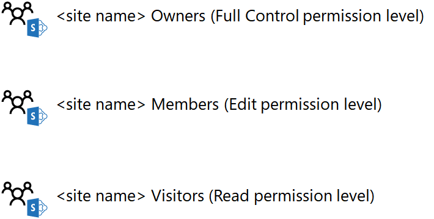
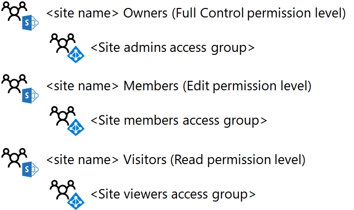
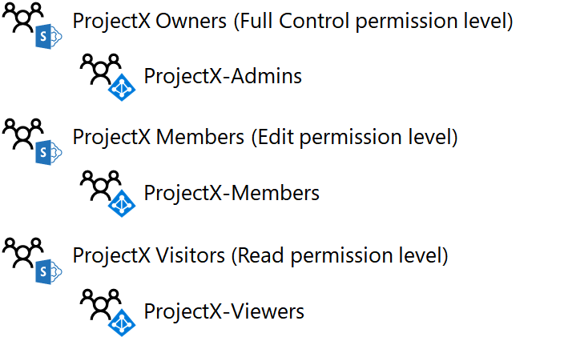
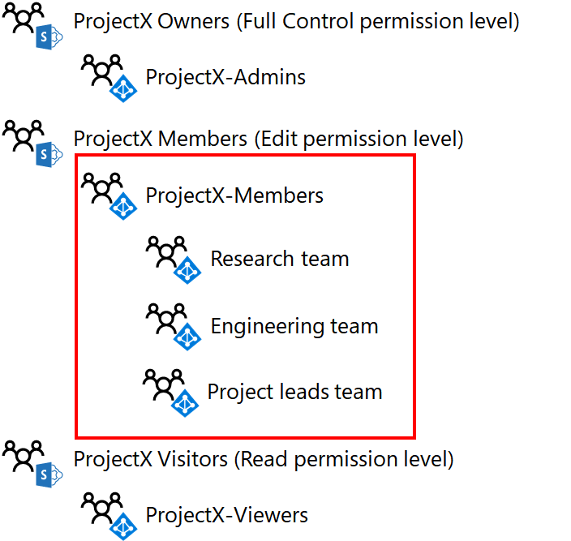

# Progettare un sito del team di SharePoint Online isolato

 **Riepilogo:** Passaggi del processo di progettazione per siti del team di SharePoint Online isolati.
  
In questo articolo viene fornita una descrizione dettagliata delle scelte fondamentali relative alla progettazione necessarie prima di creare un sito del team di SharePoint Online isolato.
  
## Fase 1: determinare i gruppi di SharePoint e i livelli di autorizzazione

Per impostazione predefinita, ogni sito del team di SharePoint Online viene creato con i seguenti gruppi di SharePoint:
  
- \<nome del sito > membri
    
- \<nome del sito > visitatori
    
- \<nome del sito > proprietari
    
Questi gruppi sono separati dai gruppi di Office 365 e Azure Active Directory (AD) e costituiscono la base per l'assegnazione di autorizzazioni per le risorse del sito.
  
Il set di autorizzazioni specifiche che determina le operazioni disponibili per un membro di un gruppo di SharePoint in un sito rappresenta un livello di autorizzazione. Esistono tre livelli di autorizzazione per impostazione predefinita per un sito del team di SharePoint Online: Modifica, Lettura e Controllo completo. Nella tabella seguente vengono illustrati la correlazione predefinita dei gruppi di SharePoint e i livelli di autorizzazione assegnati:
  
|**Gruppo di SharePoint**|**Livello di autorizzazione**|
|:-----|:-----|
|\<nome del sito > membri    |Modifica    |
|\<nome del sito > visitatori    |Lettura    |
|\<nome del sito > proprietari    |Controllo completo    |
   
 **Procedura consigliata:** È possibile creare ulteriori gruppi di SharePoint e livelli di autorizzazione. Tuttavia, è consigliabile utilizzare i gruppi di SharePoint predefiniti e i livelli di autorizzazione per il sito di SharePoint Online isolato.
  
Di seguito sono i gruppi di SharePoint predefiniti e i livelli di autorizzazione.
  

  
## Fase 2: assegnare autorizzazioni agli utenti con i gruppi di accesso

È possibile assegnare autorizzazioni agli utenti aggiungendo il loro account utente (o un gruppo di Office 365 o Azure AD di cui l'account utente è membro) ai gruppi di SharePoint. Al termine di questa operazione, agli account utente di Office 365, direttamente o indirettamente tramite l'appartenenza a un gruppo di Office 365 o Azure AD, viene assegnato il livello di autorizzazione associato al gruppo di SharePoint.
  
Utilizzo di gruppi di SharePoint predefiniti, ad esempio:
  
- Membri del ** \<nome del sito > membri** gruppo di SharePoint, che può includere sia gli account utente e gruppi, viene assegnato il livello di autorizzazione **Modifica**
    
- Membri del ** \<nome del sito > visitatori** gruppo di SharePoint, che può includere sia gli account utente e gruppi, viene assegnato il livello di autorizzazione di **lettura**
    
- Membri del ** \<nome del sito > proprietari** gruppo di SharePoint, che può includere sia gli account utente e gruppi, viene assegnato il livello di autorizzazione **controllo completo**
    
 **Procedura consigliata:** Sebbene sia possibile gestire le autorizzazioni tramite i singoli account utente, è consigliabile utilizzare un singolo gruppo di Azure Active Directory, noto come un gruppo di accesso, in realtà. Questo semplifica la gestione delle autorizzazioni tramite l'appartenenza al gruppo di accesso, anziché l'elenco di utenti di gestione degli account per ogni gruppo di SharePoint.
  
Azure gruppi di Active Directory per Office 365 sono diversi a gruppi di Office 365. Azure gruppi di Active Directory vengono visualizzati nell'interfaccia di amministrazione di Office con il set di **tipo** di **sicurezza** e non è un indirizzo di posta elettronica. Gruppi di Azure Active Directory possono essere gestiti all'interno di:
  
- Windows Server Active Directory (AD)
    
    Si tratta di gruppi che sono stati creati all'interno dell'infrastruttura di Windows Server Active Directory locale e sincronizzati alla sottoscrizione Office 365. Nell'interfaccia di amministrazione di Office, questi gruppi con **stato** **Synched con active directory**.
    
- Office 365
    
    Si tratta di gruppi che sono stati creati utilizzando l'interfaccia di amministrazione di Office, il portale Azure o Microsoft PowerShell. Nell'interfaccia di amministrazione di Office, questi gruppi con **lo stato** del **Cloud**.
    
 **Procedura consigliata:** Se si utilizzano Windows Server Active Directory locale e sincronizzazione con la sottoscrizione a Office 365, eseguire la gestione utenti e gruppi con Windows Server Active Directory.
  
Per i siti del team di SharePoint Online isolati, la struttura del gruppo consigliata è simile alla seguente:
  
|**Gruppo di SharePoint**|**Gruppo di Azure Active Directory-based access**|**Livello di autorizzazione**|
|:-----|:-----|:-----|
|\<nome del sito > membri    |\<nome del sito > membri    |Modifica    |
|\<nome del sito > visitatori    |\<nome del sito > visualizzatori    |Lettura    |
|\<nome del sito > proprietari    |\<nome del sito > Admins    |Controllo completo    |
   
 **Procedura consigliata:** Sebbene sia possibile utilizzare gruppi di Office 365 o Azure Active Directory come membri dei gruppi di SharePoint, è consigliabile utilizzare gruppi di Azure Active Directory. Azure gruppi di Active Directory, gestiti tramite Office 365, o Windows Server AD assegnare una maggiore flessibilità per utilizzare i gruppi annidati per assegnare le autorizzazioni.
  
Di seguito è l'impostazione predefinita i gruppi di SharePoint configurati per l'utilizzo di gruppi di Azure Active Directory-based access.
  

  
Quando si progettano i tre gruppi di accesso, tenere presente quanto segue:
  
- È necessario solo alcuni membri il ** \<nome del sito > Admins** gruppo di accesso, corrispondente a un numero limitato di SharePoint Online amministratori che gestiscono il sito del team.
    
- La maggior parte dei membri del sito sono nel ** \<nome del sito > membri** o ** \<nome del sito > visualizzatori** accedere ai gruppi. Dal momento che i membri del sito di ** \<nome del sito > membri** gruppo di accesso hanno la possibilità di eliminare o modificare le risorse nel sito, valutare attentamente l'appartenenza al. In caso di dubbi, aggiungere il membro del sito per il ** \<nome del sito > visualizzatori** gruppo di accesso.
    
Di seguito è riportato un esempio dei gruppi di accesso per un sito isolato denominato ProjectX e i gruppi di SharePoint.
  

  
## Fase 3: Utilizzare nidificate gruppi di Azure Active Directory

Per un progetto limitato a un numero limitato di utenti, un singolo livello dei gruppi di Azure Active Directory-based access aggiunti ai gruppi del sito di SharePoint più adatto alla maggior parte degli scenari. Tuttavia, se si dispone di un numero elevato di utenti e agli utenti che già membri di definizione dei gruppi di Azure Active Directory, è possibile più facilmente assegnare le autorizzazioni di SharePoint tramite gruppi annidati o i gruppi che contengono altri gruppi come membri.
  
Ad esempio, si desidera creare un sito del team di SharePoint Online isolato per la collaborazione tra i dirigenti dei reparti delle vendite, marketing, ingegneria, legali e del supporto e tali reparti fanno parte di gruppi di account utente della direzione esecutiva. Anziché creare un nuovo gruppo per i nuovi membri del sito e inserirvi tutti i singoli account utente esecutivi, inserire i gruppi di dirigenti esistenti per ogni reparto nel nuovo gruppo.
  
  Se si condivide un abbonamento a Office 365 tra più organizzazioni, un solo livello di appartenenza ai gruppi per un sito isolato per un'organizzazione potrebbe diventare difficile da gestire a causa del gran numero di account utente. In questo caso, è possibile utilizzare gruppi di Azure AD per ogni organizzazione con i gruppi all'interno delle organizzazioni per gestire le autorizzazioni.
  
Per utilizzare i gruppi di Azure AD nidificati:
  
1. Individuare o creare i gruppi di Azure AD che conterranno gli account utente e aggiungere gli account utente appropriati come membri.
    
2. Creare il gruppo di accesso basato su Azure AD che conterrà gli altri gruppi di Azure AD e aggiungere i gruppi come membri.
    
3.   Per il livello di accesso appropriato per il gruppo di accesso contenitore, individuare il gruppo di SharePoint e il livello di autorizzazione corrispondente.
    
> [!NOTE]
> Non è possibile utilizzare i gruppi di Office 365 nidificati. 
  
Di seguito è riportato un esempio di Azure Active Directory annidati gruppi ProjectX membri gruppo di accesso.
  

  
Poiché tutti gli account utente di ricerca, Engineering e Project leads team hanno lo scopo di essere membri del sito, è più semplice aggiungere i gruppi di Azure Active Directory al gruppo accesso ProjectX membri.
  
## Passaggio successivo

Quando si è pronti creare e configurare un sito isolato nell'ambiente di produzione, vedere [distribuzione di un sito del team di SharePoint Online isolato](deploy-an-isolated-sharepoint-online-team-site.md).
  
## Vedere anche

[Siti del team di SharePoint Online isolati](isolated-sharepoint-online-team-sites.md)
  
[Gestire un sito del team di SharePoint Online isolato](manage-an-isolated-sharepoint-online-team-site.md)
  
[Soluzioni di sicurezza](security-solutions.md)

[Distribuire un sito del team di SharePoint Online isolato](deploy-an-isolated-sharepoint-online-team-site.md)

