# Progettazione della rete per IaaS di Microsoft Azure

 **Riepilogo:** Informazioni su come progettare la rete ottimizzata per carichi di lavoro in Microsoft Azure IaaS.
  
L'ottimizzazione della rete per i carichi di lavoro IT ospitati in IaaS di Azure richiede una certa familiarità con le reti virtuali di Azure, gli spazi di indirizzi, il routing, il sistema DNS e il bilanciamento del carico.
  
## Operazioni di pianificazione per qualsiasi rete virtuale

Seguire questa procedura per qualsiasi tipo di rete virtuale.
  
### Passaggio 1: Predisporre la rete Intranet per i servizi cloud Microsoft.

Passare attraverso la sezione **operazioni per preparare la rete di servizi cloud Microsoft** in [elementi comuni di integrazione applicativa di Microsoft cloud](common-elements-of-microsoft-cloud-connectivity.md).
  
### Passaggio 2: Ottimizzare la larghezza di banda Internet.

Ottimizzare la larghezza di banda Internet utilizzando i passaggi da 2 a 4 della sezione **passaggi per la preparazione della rete per i servizi Microsoft SaaS** nella [Progettazione di rete per Microsoft SaaS](designing-networking-for-microsoft-saas.md).
  
### Passaggio 3: Determinare il tipo di rete virtuale (solo cloud o cross-premise).

Una rete virtuale solo cloud non dispone di connessione a una rete locale. Ecco un esempio:
  
**Nella figura 1: Un VNet di solo cloud**

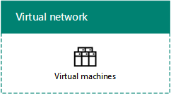
  
La figura 1 mostra un insieme di macchine virtuali all'interno di una rete virtuale solo cloud.
  
Una rete virtuale locale dispone di una connessione S2S VPN o ExpressRoute da sito a sito a una rete locale mediante il gateway Azure. Ecco un esempio:
  
**Figura 2: VNet tra locali**

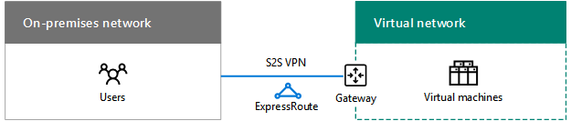
  
La figura 2 mostra un insieme di macchine virtuali all'interno di una rete virtuale locale, connessa a una rete locale.
  
Vedere le ulteriori [operazioni di pianificazione per un VNet cross-premise](designing-networking-for-microsoft-azure-iaas.md#cross_prem) sezione in questo articolo.
  
### Passaggio 4: Determinare lo spazio indirizzi della rete virtuale.

La tabella 1 mostra gli spazi indirizzi per i vari tipi di rete virtuale.
  
|**Tipo di VNet**|**Spazio degli indirizzi di rete virtuale**|
|:-----|:-----|
|Solo cloud    |Spazio di indirizzi privato arbitrario    |
|Solo cloud interconnesso    |Private arbitrarie, ma non la sovrapposizione con altre connessi VNets    |
|Cross-premise    |Privato, ma non in sovrapposizione alle reti virtuali locali    |
|Cross-premise interconnesso    |Privato, ma non in sovrapposizione ad altre reti virtuali locali e connesse    |
   
 **Tabella 1: Tipi di VNets e sul relativo spazio indirizzo**
  
Le macchine virtuali sono assegnate a una configurazione di indirizzi dallo spazio di indirizzi della subnet da parte di DHCP:
  
- indirizzo/subnet mask
    
- Gateway predefinito
    
- Indirizzi IP dei server DNS
    
È anche possibile riservare un indirizzo IP statico.
  
Le macchine virtuali possono anche essere assegnate a un indirizzo IP pubblico, singolarmente o dal servizio cloud contenitore (solo per computer di distribuzione classici).
  
### Passaggio 5: Determinare le subnet all'interno della rete virtuale e gli spazi di indirizzi assegnati a ognuna di esse.

Esistono due tipi di subnet in una rete virtuale, una subnet gateway e una subnet che ospita la macchina virtuale.
  
**Figura 3: I due tipi di subnet in Azure**

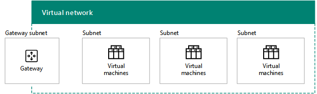
  
La figura 3 mostra un rete virtuale contenente una subnet gateway che include un gateway Azure e un set di subnet che ospitano macchine virtuali.
  
La subnet gateway di Azure è necessaria per ospitare le due macchine virtuali del gateway di Azure. Specificare uno spazio indirizzi con una lunghezza del prefisso di almeno 29 bit (ad esempio: 192.168.15.248/29). Si consiglia di usare una lunghezza prefisso di massimo 28 bit, soprattutto se si prevede di utilizzare ExpressRoute.
  
Di seguito è riportata una procedura consigliata per determinare lo spazio indirizzi della subnet gateway di Azure:
  
1. Decidere la dimensione della subnet del gateway.
    
2. Nei bit variabili nello spazio indirizzi della rete virtuale, impostare i bit usati per la subnet gateway su 0 e impostare i bit rimanenti su 1.
    
3. Convertire in formato decimale ed esprimerli come spazio di indirizzi con la lunghezza del prefisso impostata sulle dimensioni della subnet del gateway.
    
Con questo metodo, lo spazio di indirizzi per la subnet del gateway è sempre all'estremità più lontana dello spazio di indirizzi della rete virtuale.
  
Di seguito, è riportato un esempio di definizione del prefisso dell'indirizzo per la subnet del gateway Lo spazio indirizzi della rete virtuale è 10.119.0.0/16. Inizialmente l'organizzazione userà una connessione VPN da sito a sito, ma probabilmente passerà a ExpressRoute. La tabella 2 mostra i passaggi e i risultati relativi alla definizione del prefisso di indirizzo della subnet gateway nella notazione per i prefissi di rete (detta anche CIDR).

Di seguito sono i passaggi e l'esempio che consente di determinare il prefisso dell'indirizzo gateway subnet:

1. Decidere le dimensioni della subnet gateway. In questo esempio, si è scelto /28.
2. Impostare i bit nella variabile parte dello spazio di indirizzi VNet (b) su 0 per il gateway subnet bit (G), 1 indica il contrario (V). Per questo esempio viene utilizzato lo spazio degli indirizzi 10.119.0.0/16 per il VNet. 
 10.119. bbbbbbbb. bbbbbbbb 10.119. VVVVVVVV. VVVVGGGG 10.119. 11111111. 11110000  
3. Convertire il risultato del passaggio 2 in decimale ed express come uno spazio degli indirizzi. In questo esempio, 10.119. 11111111. 11110000 è 10.119.255.240 e con la lunghezza del prefisso nel passaggio 1, (28 in questo esempio), il prefisso subnet gateway risultante è 10.119.255.240/28.
  
Per ulteriori informazioni, vedere [la calcolatrice spazio indirizzo per le subnet gateway Azure](https://gallery.technet.microsoft.com/scriptcenter/Address-prefix-calculator-a94b6eed) .
  
Nelle subnet che ospitano le macchine virtuali si inseriscono le macchine virtuali di Azure. È possibile effettuare questa operazione in base alle tipiche linee guide in locale, come un livello o ruolo comune di un'applicazione o per l'isolamento della subnet.
  
Azure utilizza gli indirizzi prime 3 in ogni subnet. Di conseguenza, il numero di indirizzi possibili in una subnet Azure è 2n -5, dove n è il numero di bit host. Nella tabella 3 viene illustrato l'intervallo delle macchine virtuali necessarie, il numero di ospita bit necessari e le dimensioni di subnet corrispondenti.
  
|**Macchine virtuali necessarie**|**Bit host**|**Dimensioni subnet**|
|:-----|:-----|:-----|
|1-3    |3    |/29    |
|4-11    |4    |/28    |
|12-27    |5    |/27    |
|28-59    |6    |/26    |
|60-123    |7    |/25    |
   
 **Tabella 3: requisiti delle macchine virtuali e alle dimensioni di subnet**
  
Per ulteriori informazioni sulla quantità massima di macchine virtuali in una subnet o VNet, vedere [Limiti di rete](https://docs.microsoft.com/azure/azure-subscription-service-limits#networking-limits).
  
Per ulteriori informazioni, vedere [pianificare e progettare reti virtuali di Azure](https://azure.microsoft.com/documentation/articles/virtual-network-vnet-plan-design-arm/).
  
### Passaggio 6: Determinare la configurazione del server DNS e gli indirizzi dei server DNS da assegnare alle macchine virtuali della rete virtuale.

Azure assegna alle macchine virtuali gli indirizzi dei server DNS da parte di DHCP. I server DNS possono essere:
  
- Forniti da Azure: con registrazione del nome locale e risoluzione del nome Internet
    
- Forniti dall'utente: con registrazione del nome Intranet o locale e risoluzione del nome Intranet o Internet
    
La tabella 4 mostra le diverse configurazioni dei server DNS per ogni tipo di rete virtuale.
    
|**Tipo di VNet**|**Server DNS**|
|:-----|:-----|
|Solo cloud    |Fornito da Azure per la risoluzione dei nomi locali e Internet    Macchina virtuale di Azure per la risoluzione dei nomi locali e Internet (inoltro DNS)    |
|Cross-premise    |Locale per le risoluzione dei nomi locali e Intranet    Macchina virtuale di Azure per la risoluzione dei nomi locali e Intranet (replica e inoltro DNS)    |
   
 **Tabella 4: Opzioni del server DNS per i due tipi diversi di VNets**
  
Per ulteriori informazioni, vedere [Risoluzione dei nomi per le macchine virtuali e istanze del ruolo](https://docs.microsoft.com/azure/virtual-network/virtual-networks-name-resolution-for-vms-and-role-instances).
  
### Passaggio 7: Determinare la configurazione del bilanciamento del carico (Internet o interno).

In alcuni casi, potrebbe essere necessario distribuire il traffico in arrivo in un insieme di server che hanno lo stesso ruolo. IaaS di Azure dispone di una funzione integrata per eseguire questa operazione per i carichi di traffico interno e verso Internet.
  
Il bilanciamento del carico verso Internet di Azure distribuisce in ordine casuale il traffico in ingresso non richiesto da Internet ai membri di un set con carico bilanciato.
  
**Figura 4: Un esterno bilanciamento del carico in Azure**

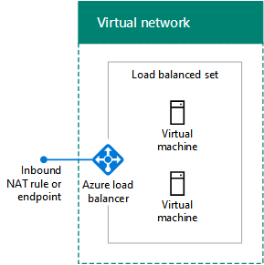
  
Figura 4 viene illustrato un servizio di bilanciamento del carico esterno in Azure che distribuisce il traffico in ingresso in una regola NAT in entrata o endpoint per una serie di macchine virtuali in un set di bilanciamento del carico.
  
Il bilanciamento del carico interno di Azure distribuisce in modo casuale il traffico in ingresso da altre macchine virtuali di Azure o da computer Intranet ai membri di un set con carico bilanciato.  
  
**Figura 5: Un interno bilanciamento del carico in Azure**

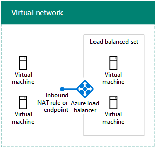
  
Figura 5 viene illustrato un servizio di bilanciamento del carico interno in Azure che distribuisce il traffico in ingresso in una regola NAT in entrata o endpoint per una serie di macchine virtuali in un set di bilanciamento del carico.
  
Per ulteriori informazioni, vedere [Bilanciamento del carico di Azure](https://docs.microsoft.com/azure/load-balancer/load-balancer-overview).
  
### Passaggio 8: Determinare l'uso delle applicazioni virtuali e delle route definite dall'utente.

Nel caso in cui fosse necessario inoltrare il traffico alle applicazioni virtuali della rete virtuale, è necessario aggiungere una o più route definite dall'utente a una subnet.
  
**Nella figura 6: Dispositivi di rete e le route definite dall'utente in Azure**

  
La figura 6 mostra una rete virtuale cross-premise e una route definita dall'utente assegnate a una subnet che ospita una macchina virtuale che punta a un'applicazione virtuale.
  
Per ulteriori informazioni, vedere [le route definite dall'utente e inoltro IP](https://docs.microsoft.com/azure/virtual-network/virtual-networks-udr-overview).
  
### Passaggio 9: Determinare la modalità di connessione di computer da Internet alle macchine virtuali.

Sono disponibili vari modi per fornire accesso a Internet alle macchine virtuali presenti in una rete virtuale, ad esempio, accesso dalla rete aziendale tramite server proxy oppure altri dispositivi periferici.
  
Nella tabella 5 sono riportati i metodi per filtrare o esaminare il traffico in ingresso non richiesto.
  
|**Metodo**|**Modello di distribuzione**|
|:-----|:-----|
|1. Endpoint e ACL configurati sui servizi cloud    |Classico    |
|2. Gruppi di sicurezza di rete    |Gestione risorse e classico    |
|3. Bilanciamento del carico con accesso a Internet con regole NAT in ingresso    |Manager delle risorse    |
|4. dispositivi di rete della protezione in di Azure 
 Marketplace (non visualizzata)    |Gestione risorse e classico    |
   
 **Tabella 5: Metodi di connessione per le macchine virtuali e dai modelli di distribuzione Azure corrispondenti**
  
**Figura 7: La connessione alle macchine virtuali di Azure su Internet**

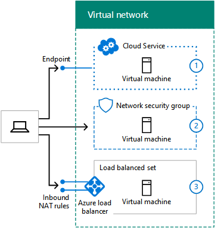
  
La figura 7 mostra un computer connesso a Internet che stabilisce una connessione con una macchina virtuale in un servizio cloud tramite un endpoint, una macchina virtuale su una subnet utilizzando un gruppo di sicurezza di rete e una macchina virtuale su una subnet utilizzando un bilanciamento del carico esterno e le regole NAT in ingresso.
  
Ulteriore sicurezza è offerta da:
  
- Il desktop remoto e le connessioni SSH che sono autenticati e crittografati.
    
- Le sessioni remote di PowerShell che sono autenticate e crittografate.
    
- La modalità di trasporto IPsec, da usare per la crittografia end-to-end.
    
- La protezione DDoS di Azure che blocca gli attacchi interni ed esterni.
    
Per ulteriori informazioni, vedere [Microsoft Security Cloud per architetti](https://aka.ms/cloudarchsecurity) e [La protezione della rete Azure](https://azure.microsoft.com/blog/azure-network-security/).
  
### Passaggio 10: Per più reti virtuali, determina la topologia di connessione da rete virtuale a rete virtuale.

Le reti virtuali possono essere connesse tra loro mediante topologie simili a quelle utilizzate per la connessione dei siti di un'organizzazione.
  
Una configurazione di collegamento in cascata connette le reti virtuali in serie.
  
**Figura 8: Una concatenati daisy configurazione per VNets**

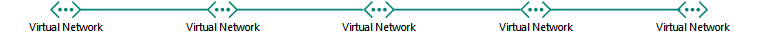
  
Figura 8 mostra cinque VNets connessi nella serie utilizzando una configurazione daisy concatenati.
  
Una configurazione spoke e hub connette più reti virtuali a un set di reti virtuali centrali, che sono a loro connesse tra di loro.
  
**Figura 9: Un hub e spoke configurazione per VNets**

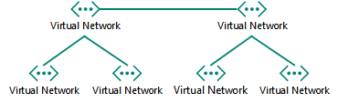
  
La figura 9 mostra 6 reti virtuali, 2 reti virtuali sono hub connessi a loro volta e anche 2 reti virtuali spoke.
  
Una configurazione a maglia completa connette le reti virtuali tra di loro.
  
**Figura 10: Un intero trama configurazione per VNets**

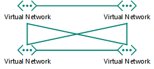
  
La figura 10 mostra 4 reti virtuali che sono connesse a vicenda utilizzando 6 collegamenti da rete virtuale a rete virtuale.
  
## Operazioni di pianificazione per una rete virtuale cross-premise

Seguire questa procedura per una rete virtuale cross-premise.
  
> [!TIP]
> Per creare un ambiente di sviluppo e di testing simulato tra locali, vedere [simulato tra locali reti virtuali di Azure](simulated-cross-premises-virtual-network-in-azure.md). 
  
### Passaggio 1: Determinare la connessione cross-premise alla rete virtuale (S2S VPN o ExpressRoute).

Nella tabella 6 sono elencati i vari di tipi di connessioni.
  
|**Tipo di connessione**|**Scopo**|
|:-----|:-----|
|VPN da sito a sito (S2S)    |Connettere i siti 1 a 10 (inclusi altri VNets) a un singolo VNet.    |
|ExpressRoute    |Un collegamento sicuro e privato ad Azure tramite un IXP (Internet Exchange Provider) o un NSP (Network Service Provider).    |
|VPN da punto a punto (P2S)    |Connette un singolo computer alla rete virtuale.    |
|Peering della rete virtuale o VPN da rete virtuale a rete virtuale (V2V)     |Connette una rete virtuale a un'altra rete virtuale.    |
   
 **Tabella 6: I tipi di connessioni per VNets tra locali**
  
Per ulteriori informazioni sul numero massimo di connessioni, vedere [Limiti della rete](https://docs.microsoft.com/azure/azure-subscription-service-limits#networking-limits).
  
Per ulteriori informazioni sui dispositivi VPN, vedere [dispositivi VPN per le connessioni di rete virtuale di sito per sito](https://docs.microsoft.com/azure/vpn-gateway/vpn-gateway-about-vpn-devices).
  
Per ulteriori informazioni su VNet peering, vedere [VNet peering](https://docs.microsoft.com/azure/virtual-network/virtual-network-peering-overview).
  
**Figura 11: Le quattro modalità per connettersi a un VNet tra locali**

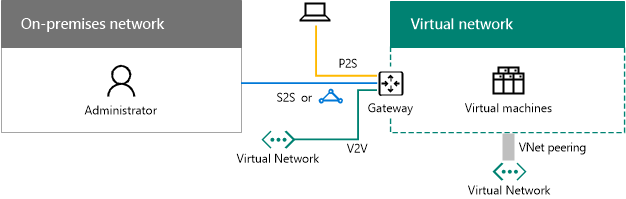
  
Nella figura 11 viene VNet con quattro tipi di connessioni: connessione a un P2S da un computer, una connessione VPN S2S da una rete locale, una connessione ExpressRoute da una rete locale e una connessione VNet-VNet da un altro VNet. 
  
È possibile connettersi alle macchine virtuali di una rete virtuale nei modi seguenti:
  
- Amministrazione delle macchine virtuali della rete virtuale dalla rete locale o da Internet
    
- Accesso al carico IT dalla rete locale
    
- Estensione della rete mediante reti virtuali aggiuntive
    
La sicurezza per le connessioni è offerta dai seguenti elementi:
  
- La connessione P2S usa il protocollo SSTP (Secure Socket Tunneling Protocol)   
    
- Le connessioni VPN S2S e da rete virtuale a rete virtuale usano la modalità tunnel IPsec con AES256
    
- ExpressRoute è una connessione WAN privata
    
Per ulteriori informazioni, vedere [Microsoft Security Cloud per architetti](https://aka.ms/cloudarchsecurity) e [La protezione della rete Azure](https://azure.microsoft.com/blog/azure-network-security/).
  
### Passaggio 2: Determinare il router o dispositivo VPN locale.

Il router o dispositivo VPN locale si comporta come:
  
- Peer IPsec, terminando la connessione S2S VPN dal gateway di Azure.
    
- Peer BPG e punto di terminazione per la connessione ExpressRoute con peer privato.
    
**Figura 12: Router VPN locale o dispositivo**

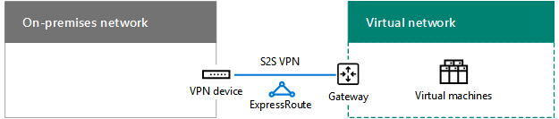
  
La figura 12 mostra una rete virtuale cross-premise connessa a un router o a un dispositivo VPN locale.
  
Per ulteriori informazioni, vedere [gateway su VPN](https://docs.microsoft.com/azure/vpn-gateway/vpn-gateway-about-vpngateways).
  
### Passaggio 3: Aggiungere route alla rete intranet per rendere lo spazio degli indirizzi del VNet raggiungibili.

Il routing verso le reti virtuali da ambiente locale comprende i seguenti elementi:
  
1. Una route per lo spazio indirizzi della rete virtuale che punta verso il dispositivo VPN.
    
2. Una route per lo spazio indirizzo della rete virtuale sul dispositivo VPN che punta tra la connessione VPN S2S o ExpressRoute.
    
**Figura 13: Route locale necessari per rendere un VNet raggiungibile**

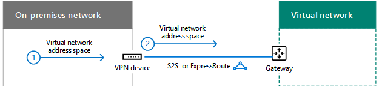
  
La figura 13 mostra le informazioni di routing richieste dai router locali, da quelli VPN o dal dispositivo che rappresenta lo spazio indirizzi della rete virtuale.
  
### Passaggio 4: Per ExpressRoute, pianifica la nuova connessione con il provider.

È possibile creare una connessione ExpressRoute con peering privato tra la rete locale e il cloud Microsoft in tre modi diversi:
  
- Percorso condiviso in un exchange cloud
    
- Connessioni Ethernet da punto a punto
    
- Reti any-to-any (VPN IP)
    
**Figura 14: Utilizzo ExpressRoute per connettersi a un VNet tra locali**

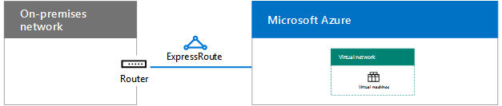
  
La figura 14 mostra una rete virtuale cross-premise e una connessione ExpressRoute da un router locale a Microsoft Azure.
  
Per ulteriori informazioni, vedere [ExpressRoute per la connettività cloud Microsoft](expressroute-for-microsoft-cloud-connectivity.md).
  
### Passaggio 5: Determinare lo spazio di indirizzi della rete locale per il gateway di Azure.

Per il routing verso reti virtuali locali o di altro tipo, Azure inoltra il traffico mediante un gateway che corrisponde allo spazio di indirizzi della rete locale ad esso assegnato.
  
**Figura 15: La rete locale spazio degli indirizzi per un VNet tra locali**

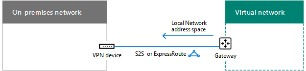
  
La figura 15 mostra una rete virtuale cross-premise e lo spazio indirizzi della rete locale sul gateway di Azure, che rappresenta lo spazio indirizzi raggiungibile sulla rete locale.  
  
È possibile definire lo spazio indirizzi della rete locale nei modi seguenti:
  
- Opzione 1: L'elenco dei prefissi per lo spazio indirizzi corrente necessario o in uso (potrebbero essere necessari degli aggiornamenti quando si aggiungono subnet).
    
- Opzione 2: L'intero spazio di indirizzi locale (gli aggiornamenti sono necessari solo quando si aggiunge un nuovo spazio di indirizzi).
    
Poiché il gateway di Azure non consente route riepilogate, devi definire lo spazio di indirizzi della rete locale per l'opzione 2 affinché non includa lo spazio di indirizzi della rete virtuale.
  
**Figura 16: L'indirizzo spazio foro creato per lo spazio degli indirizzi VNet**

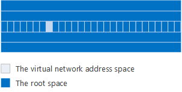
  
La figura 16 mostra una rappresentazione di uno spazio indirizzi, con lo spazio radice e lo spazio indirizzi della rete virtuale.
  
Di seguito è riportato un esempio di definizione dei prefissi per lo spazio degli indirizzi di rete locale attorno lo spazio degli indirizzi "foro" creato dal VNet:
  
- Un'organizzazione usa porzioni dello spazio di indirizzi privato (10.0.0.0/8, 172.16.0.0/12 e 192.168.0.0/16) nella propria rete locale. Si sceglie l'opzione 2 e 10.100.100.0/24 come spazio indirizzi della rete virtuale.
    
La tabella 7 mostra i passaggi e i prefissi risultanti che definiscono lo spazio indirizzi della rete locale per questo esempio.
  
|**Passaggio**|**Risultati**|
|:-----|:-----|
|1. Elencare i prefissi che non sono lo spazio radice per lo spazio indirizzi della rete virtuale.    |172.16.0.0/12 e 192.168.0.0/16    |
|2. elencare i prefissi senza sovrapposizioni per ottetti variabile fino a ma non inclusa l'ultima utilizzato 
 ottetti nello spazio di indirizzi VNet.    |10.0.0.0/16, 10.1.0.0/16... 10.99.0.0/16, 10.101.0.0/16... 10.254.0.0/16, 10.255.0.0/16 (255 prefissi, ignorando 10.100.0.0/16)    |
|3. elenco senza sovrapposizioni prefissi all'interno di 
 utilizzato per ultimo ottetti VNet spazio degli indirizzi.    | 10.100.0.0/24, 10.100.1.0/24... 10.100.99.0/24, 10.100.101.0/24... 10.100.254.0/24, 10.100.0.255.0/24 (255 prefissi, ignorando 10.100.100.0/24)    |
   
 **Tabella 7: Spazio di rete esempio indirizzi locali**
  
### Passaggio 6: Configurare i server DNS locali per la replica DNS con i server DNS ospitati in Azure.

Per assicurarsi che i computer locali possano risolvere i nomi dei server basati su Azure e che i server basati su Azure possano risolvere i nomi dei computer locali, configurare:
  
- I server DNS nella rete virtuale per l'inoltro ai server DNS locali
    
- La replica DNS delle zone appropriate tra i server DNS in locale e nella rete virtuale
    
**Figura 17: La replica DNS e inoltro per un server DNS in una VNet tra locali**

  
La figura 17 mostra una rete virtuale cross-premise con server DNS nella rete locale e su una subnet della rete virtuale. La replica e l'inoltro DNS sono stati configurati tra due server DNS.
  
### Passaggio 7: Determinare l'utilizzo del tunneling forzato.

La route di sistema predefinito per le subnet Azure punta a Internet. Per garantire che tutto il traffico da macchine virtuali passa attraverso la connessione tra locali, creare una tabella di routing con la route predefinita che utilizza il gateway Azure come relativo indirizzo hop successivo. È quindi possibile associare la tabella di route con la subnet. Questo è noto come forzato tunnel. Per ulteriori informazioni, vedere [Configure forzato tunnel](https://docs.microsoft.com/azure/vpn-gateway/vpn-gateway-forced-tunneling-rm).
  
**Figura 18: Route definite dall'utente e tunnel forzato per un VNet tra locali**

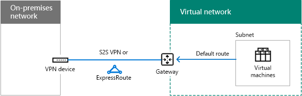
  
Figura 18 viene illustrata una VNet cross-premise a una route definita dall'utente per una subnet che punta al gateway di Azure.
  
## Farm di SharePoint Server 2016 in Azure

Un esempio del carico di lavoro di una Intranet IT ospitata in IaaS di Azure è una farm a più livelli e a disponibilità elevata di SharePoint Server 2016, come mostrato nella figura 19.
  
**Figura 19: Una farm di SharePoint Server 2016 intranet a disponibilità elevata in Azure IaaS**

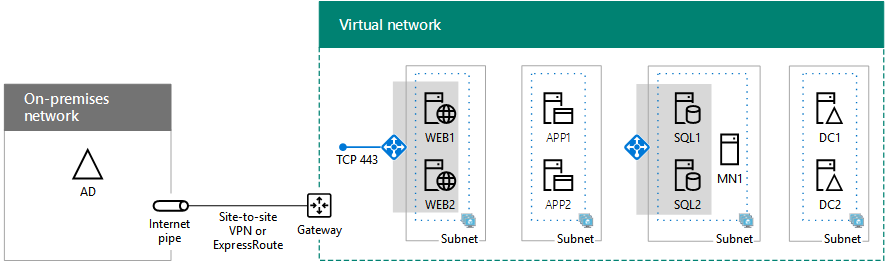
  
Figura 19 mostra i nove server di una farm di SharePoint Server 2016 distribuiti in un VNet cross-premise utilizzato da servizi di bilanciamento del carico interno per i livelli front-end e i dati. Per ulteriori informazioni, tra cui progettazione dettagliate e istruzioni di distribuzione, vedere [SharePoint Server 2016 in Microsoft Azure](https://technet.microsoft.com/library/mt779107%28v=office.16%29.aspx).
  
> [!TIP]
> Per creare una farm di SharePoint Server 2016 a server singolo in un VNet simulato tra locali, vedere [Intranet SharePoint Server 2016 nell'ambiente di sviluppo e di testing Azure](https://technet.microsoft.com/library/mt806351%28v=office.16%29.aspx). 
  
Per ulteriori esempi di carichi di lavoro IT distribuiti nelle macchine virtuali in un virtuali di Azure cross-premise di rete, vedere [scenari basati su cloud ibrida per Azure IaaS](https://technet.microsoft.com/library/mt750502.aspx).
  
## See Also

[Microsoft Cloud per architetti di rete](microsoft-cloud-networking-for-enterprise-architects.md)
  
[Risorse sull'architettura IT del cloud Microsoft](microsoft-cloud-it-architecture-resources.md)

[Guida di orientamento del cloud aziendale Microsoft: risorse per i decision maker del settore IT](https://sway.com/FJ2xsyWtkJc2taRD)

