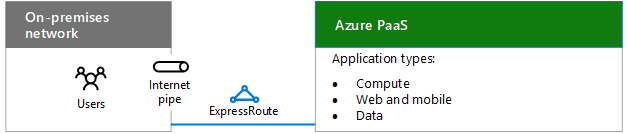
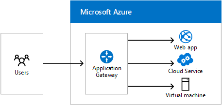
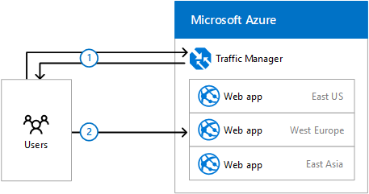

# Progettazione di rete per Microsoft Azure PaaS

 **Riepilogo:** Informazioni su come ottimizzare la rete per l'accesso a Microsoft Azure PaaS.
  
L'ottimizzazione della rete per le app PaaS di Azure necessita di una larghezza di banda Internet adeguata e può richiedere la distribuzione del traffico di rete in più siti o app.
  
## Passaggi di pianificazione per l'hosting di applicazioni PaaS organizzazione in Azure

Inserire qui il corpo della sezione.
  
1. Passare attraverso la sezione **operazioni per preparare la rete di servizi cloud Microsoft** in [elementi comuni di integrazione applicativa di Microsoft cloud](common-elements-of-microsoft-cloud-connectivity.md).
    
2. Ottimizzare la larghezza di banda Internet utilizzando i passaggi da 2 a 4 della sezione **passaggi per la preparazione della rete per i servizi Microsoft SaaS** nella [Progettazione di rete per Microsoft SaaS](designing-networking-for-microsoft-saas.md).
    
3. Stabilire se sono necessari una connessione ExpressRoute in Azure.
    
4. Per carichi di lavoro basate sul web, determinare se è necessario Azure Application Gateway.
    
5. Per la distribuzione del traffico agli endpoint diversi nel centro dati diversi, determinare se è necessario Azure Traffic Managerhttp.
    
## Larghezza di banda Internet per le applicazioni PaaS organizzazione

Organizzazione applicazioni ospitate in Azure PaaS richiedono larghezza di banda Internet per gli utenti intranet. Sono disponibili due opzioni:
  
- **Opzione 1:** Utilizzare la pipe esistente, ottimizzata per il traffico Internet con la capacità di gestire i carichi di picco. Vedere[Progettazione di rete per Microsoft SaaS](designing-networking-for-microsoft-saas.md) per edge Internet, l'utilizzo di client e considerazioni sulle operazioni IT.
    
- **Opzione 2:** Per ampia larghezza di banda o bassa latenza delle esigenze, utilizzare una connessione ExpressRoute in Azure.
    
**Nella figura 1: Opzioni di connessione per la connessione di servizi di Azure PaaS**

  
Una rete locale la connessione a servizi di Azure PaaS attraverso un canale Internet o ExpressRoute illustrato nella figura 1.
  
## Azure Application Gateway

Livello di applicazione di routing e il bilanciamento del carico servizi che consentono di creare un soluzione scalabile e altamente disponibile front-end web in Azure per applicazioni web, servizi cloud e macchine virtuali. 
  
**Figura 2: Applicazioni Azure Gateway**

  
Nella figura 2 viene Azure Application Gateway e come utente richiede da Internet può essere instradate a Azure web App, servizi cloud o macchine virtuali.
  
Application Gateway attualmente supporta il recapito di livello applicazione 7 per le operazioni seguenti:
  
- Bilanciamento del carico HTTP
    
- Affinità basata sui cookie di sessione
    
- Offload SSL
    
Per ulteriori informazioni, vedere [Application Gateway](https://docs.microsoft.com/azure/application-gateway/application-gateway-introduction).
  
## Azure Traffic Manager

Distribuzione del traffico a endpoint distinti, che può includere servizi cloud o applicazioni web Azure in datacenter diversi oppure endpoint esterno.
  
Gestione del traffico vengono utilizzati i metodi di distribuzione seguenti:
  
- **Failover:** I punti finali sono nei data center Azure uguali o diversi e si desidera utilizzare un endpoint principale per tutto il traffico, ma fornisce backup nel caso in cui l'endpoint backup o il primario non sono disponibili.
    
- **Round robin:** Si desidera distribuire il carico in una serie di endpoint nello stesso datacenter o tra i datacenter diversi.
    
- **Prestazioni:** Sono presenti endpoint in posizioni geografiche diverse e si desidera richiedente ai client di utilizzare l'endpoint "più vicino" in termini di più bassa latenza.
    
Di seguito è riportato un esempio di tre distribuiti geograficamente web app.
  
**Figura 3: Azure Traffic Managerhttp**

  
Nella figura 3 viene illustrato il processo di base di gestione del traffico viene utilizzato per instradare le richieste per le applicazioni web diverse Azure tre negli Stati Uniti, Europa e Asia. Nell'esempio:
  
1. Una query DNS utente per un sito web che URL Ottiene indirizzati a Azure Traffic Managerhttp, che restituisce il nome di un'app web regionali, in base il metodo di routing delle prestazioni.
    
2. L'utente avvia il traffico con l'app web internazionali in Europa.
    
Per ulteriori informazioni, vedere [Gestione del traffico](https://docs.microsoft.com/azure/traffic-manager/traffic-manager-overview).
  
## See Also

[Microsoft Cloud per architetti di rete](microsoft-cloud-networking-for-enterprise-architects.md)
  
[Risorse sull'architettura IT del cloud Microsoft](microsoft-cloud-it-architecture-resources.md)

[Guida di orientamento del cloud aziendale Microsoft: risorse per i decision maker del settore IT](https://sway.com/FJ2xsyWtkJc2taRD)

