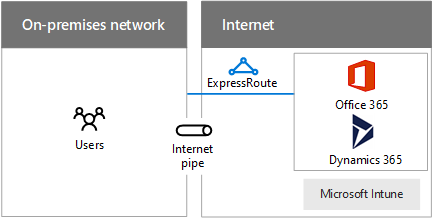

# Progettazione di rete per Microsoft SaaS

 **Riepilogo:** Informazioni su come ottimizzare la rete per l'accesso ai servizi SaaS di Microsoft, tra cui Office 365, Microsoft Intune e Dynamics 365.
  
L'ottimizzazione della rete per i servizi SaaS di Microsoft richiede un'analisi approfondita della connessione Internet, dei dispositivi client e delle operazioni IT tipiche.
  
## Passaggi di preparazione della rete per i servizi Microsoft SaaS

Eseguire la procedura seguente per ottimizzare la rete per i servizi Microsoft SaaS:
  
1. Passare attraverso la sezione **operazioni per preparare la rete di servizi cloud Microsoft** in [elementi comuni di integrazione applicativa di Microsoft cloud](common-elements-of-microsoft-cloud-connectivity.md).
    
2. Ottimizzare l'uscita Internet per i servizi Microsoft SaaS utilizzando i consigli relativi al server proxy.
    
3. Ottimizzare la velocità effettiva Internet utilizzando i suggerimenti di prossimità e il percorso.
    
4. Ottimizzare le prestazioni dei computer client e la rete intranet in cui si trovano utilizzando le considerazioni sull'utilizzo di client.
    
5. In base alle esigenze, ottimizzare le prestazioni di sincronizzazione mediante le considerazioni di operazioni IT e le migrazioni dei dati.
    
## Considerazioni su edge Internet

Ecco alcuni aspetti da considerare ottimizzare il bordo di Internet e velocità effettiva ai servizi Microsoft SaaS.
  
**Nella figura 1: Opzioni di connessione per i servizi Microsoft SaaS**

  
Una rete locale connettersi ai servizi Microsoft SaaS su una barra verticale Internet o ExpressRoute illustrato nella figura 1.
  
Di seguito sono riportati alcuni consigli per ottimizzare il server proxy:
  
- Configurare i client web utilizzando WPAD, PAC o oggetto Criteri di gruppo
    
- Non utilizzare intercettazione SSL
    
- Utilizzare un file PAC per ignorare il proxy per i nomi DNS servizio SaaS Microsoft
    
- Consentire il traffico per la verifica di revoche di certificati/OCSP
    
Ecco alcuni colli di bottiglia server proxy per controllare:
  
- Connessioni permanenti insufficienti (Outlook)
    
- Capacità insufficiente
    
- Valutazione off rete pur
    
- La richiesta di autenticazione
    
- Nessun supporto per il traffico UDP (Skype per le aziende)
    
Di seguito sono riportati alcuni consigli prossimità e il percorso:
  
- Non eseguire il routing del traffico Internet nella rete WAN privata
    
- Utilizzare il flusso di traffico DNS e Internet nell'area per gli utenti di fuori dell'area
    
- Utilizzare ExpressRoute per connessioni a banda larga per Office 365 e la connettività simultanea con servizi di Azure
    
Di seguito sono le porte in uscita necessarie per il traffico di Office 365:
  
- TCP 80 (per i controlli di revoche di certificati/OCSP)
    
- TCP 443
    
- UDP 3478
    
- TCP 5223
    
- TCP 50000 A 59999
    
- UDP 50000 A 59999
    
## Considerazioni sull'utilizzo di client

Innanzitutto configurare il gruppo di servizi che i client utilizzeranno, ad esempio:
  
- Azure Active Directory
    
- Office 365
    
  - Applicazioni client di Office
    
  - SharePoint Online
    
  - Exchange Online
    
  - Skype for Business
    
- Microsoft Intune
    
- Dynamics 365
    
Per i computer client, determinare quanto segue:
  
- Numero massimo in qualsiasi momento (ora del giorni, stagionali, picchi e gestirle in uso)
    
- Totale della larghezza di banda necessaria per picchi
    
- Latenza per il dispositivo di uscita Internet
    
- Paese di origine e paese di posizione condivisa datacenter
    
Per ogni tipo di client (PC, smartphone o tablet), verificare che l'oggetto corrente:
  
- Sistema operativo
    
- Browser Internet
    
- Stack TCP/IP
    
- Hardware di rete
    
- Driver del sistema operativo per l'hardware di rete
    
- Sono installate gli aggiornamenti e patch
    
Inoltre, ottimizzare la velocità effettiva connessione intranet (cablata, senza fili o VPN).
  
Per ulteriori informazioni, vedere [supporto di NAT con Office 365](https://support.office.com/article/NAT-support-with-Office-365-170e96ea-d65d-4e51-acac-1de56abe39b9).
  
Per i suggerimenti più recenti per l'utilizzo di ExpressRoute con Office 365, vedere [ExpressRoute per Office 365](https://support.office.com/article/Azure-ExpressRoute-for-Office-365-6d2534a2-c19c-4a99-be5e-33a0cee5d3bd).
  
Per ottimizzare le prestazioni di rete intranet, eseguire le operazioni seguenti:
  
- Utilizzare gli strumenti per misurare andata tempi (RTTs) per i dispositivi edge Internet (PsPing, il comando Ping, Tracert, TraceTCP, Network Monitor)
    
- Eseguire l'analisi del percorso di uscita utilizzando i protocolli di flusso
    
- Eseguire l'analisi dei dispositivi intermedi (età, integrità e così via)
    
Per ulteriori informazioni, vedere [strumento PsPing](https://technet.microsoft.com/sysinternals/jj729731.aspx).
  
## Considerazioni sulle operazioni IT

Ecco alcuni aspetti da considerare durante il funzionamento di un carico di lavoro in un servizio SaaS Microsoft IT.
  
### Migrazioni occasionale

Esempi di migrazioni occasionale sono trasferimento di dati di blocco per le applicazioni basate su cloud o l'archiviazione di archiviazione.
  
Per ottimizzare la rete per le migrazioni nel tempo:
  
- Evitare l'utilizzo massimo della rete e dei computer applicate patch per orari
    
- Deve essere inseriti nella previsione e un progetto pilota, valutare l'integrità della rete e risolvere i problemi prima di tentare di migrazione effettiva
    
- Eseguire finale per le migrazioni future
    
### Sincronizzazione in corso

Esempi di sincronizzazione in corso sono le informazioni di directory, le impostazioni o i file.
  
Per ottimizzare la rete per la sincronizzazione in corso:
  
- Verificare che una larghezza di banda del sistema di monitoraggio sul posto, risolvere o ignorare errori raccolti
    
- Utilizzare i risultati del monitoraggio della larghezza di banda per determinare la necessità di modifiche alla rete (su scalabilità, nuovi circuiti o dispositivi aggiunta)
    
Per ulteriori informazioni, vedere:
  
- [Pianificazione per Office 365 e rete](https://aka.ms/tune)
    
- [Corso di Academy virtuale Microsoft di gestione delle prestazioni di Office 365](https://aka.ms/o365perf)
    
- [ExpressRoute per Office 365](https://aka.ms/expressrouteoffice365)

## Passaggio successivo

[Progettazione di rete per Microsoft Azure PaaS](designing-networking-for-microsoft-azure-paas.md)
    
## Vedere anche

[Rete cloud Microsoft per Enterprise Architects](microsoft-cloud-networking-for-enterprise-architects.md)
  
[Risorse sull'architettura IT del cloud Microsoft](microsoft-cloud-it-architecture-resources.md)

[Guida di orientamento del cloud aziendale Microsoft: risorse per i decision maker del settore IT](https://sway.com/FJ2xsyWtkJc2taRD)

