# ExpressRoute per la connettività cloud Microsoft

 **Riepilogo:** Informazioni su come ExpressRoute grado di aiutarti con connessioni più veloci e affidabili a piattaforme e servizi cloud di Microsoft.
  
ExpressRoute fornisce una connessione di rete a elevata velocità effettiva, dedicata e privata per il cloud Microsoft.
  
## ExpressRoute nel cloud Microsoft

Di seguito è il percorso di rete per il cloud Microsoft senza una connessione ExpressRoute.
  
**Nella figura 1: Il percorso di rete senza ExpressRoute**

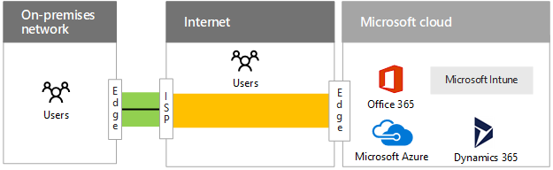
  
Nella figura 1 viene visualizzato il percorso tipico tra una rete locali e cloud Microsoft. Perimetro della rete locale si connette a Internet tramite una rete WAN collegamento a un provider di servizi Internet. Il traffico passa quindi via Internet e il lato del cloud Microsoft. Offerte del cloud all'interno di Microsoft cloud includono Office 365, Microsoft Azure, Microsoft Intune e Dynamics 365. Gli utenti di un'organizzazione possono trovarsi nella rete locale o su Internet.
  
Senza una connessione ExpressRoute, l'unica parte del percorso del traffico da Microsoft cloud che consentono di controllare (e una relazione con il provider di servizi) è il collegamento tra il bordo di rete locale e provider di servizi Internet. 
  
Il percorso tra provider di servizi Internet e il bordo di cloud Microsoft è un sistema di recapito sforzo su Internet soggetti a interruzioni, congestione del traffico e il monitoraggio da utenti malintenzionati.
  
Gli utenti su Internet, ad esempio gli utenti remoti o mobili, inviare traffico nel cloud Microsoft tramite Internet.
  
Di seguito sono i percorsi di reti per il cloud Microsoft con una connessione ExpressRoute.
  
**Figura 2: I percorsi di reti con ExpressRoute**

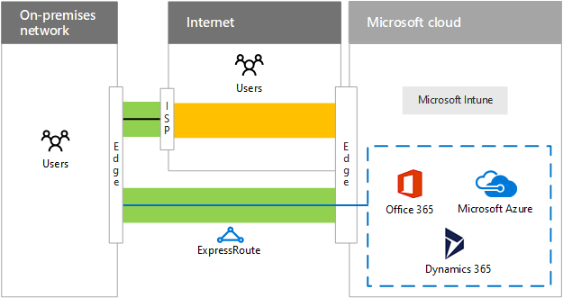
  
Nella figura 2 sono riportati i due percorsi di reti. Il traffico a Microsoft Intune passa nello stesso percorso normale traffico Internet. Traffico a Office 365 e Azure Microsoft Dynamics 365 viaggia tra la connessione ExpressRoute, un percorso dedicato tra il bordo della rete locale e il bordo del cloud Microsoft.
  
Con una connessione ExpressRoute, è ora dispongono del controllo tramite una relazione con il provider di servizi, sul percorso intero traffico tra il bordo di Microsoft cloud edge. La connessione può offrire prestazioni prevedibile e un SLA uptime 99,9%.
  
È ora possibile usufruire della prevedibile velocità effettiva e latenza, basata su connessione del provider di servizi, ai servizi di Office 365 e Azure Dynamics 365. Connessioni ExpressRoute a Microsoft Intune non sono supportate in questa fase.
  
Il traffico inviato tramite la connessione ExpressRoute non è più soggetti a Internet interruzioni, congestione del traffico e monitoraggio.
  
Gli utenti su Internet, ad esempio gli utenti remoti o mobili, continuare a inviare traffico nel cloud Microsoft tramite Internet. Fa eccezione il traffico a una rete intranet applicazione line-of business ospitate in Azure IaaS, inviati tramite la connessione ExpressRoute mediante una connessione di accesso remoto alla rete locale.
  
Anche con una connessione ExpressRoute, alcuni invio del traffico ancora su Internet, ad esempio le query DNS, controllo, elenco di revoche di certificati e le richieste di rete per la distribuzione del contenuto (CDN).
  
Vedere le risorse aggiuntive per ulteriori informazioni:
  
- [ExpressRoute per Office 365](https://aka.ms/expressrouteoffice365)
    
- [ExpressRoute per Azure](https://azure.microsoft.com/services/expressroute/)
    
## Vantaggi della ExpressRoute per Azure

Ecco alcuni vantaggi derivanti dall'utilizzo ExpressRoute per i servizi cloud basati su Azure:
  
- **Prestazioni prevedibile:** Con un percorso e il lato del cloud Microsoft dedicato le prestazioni non sono legate interruzioni provider Internet e picchi di traffico Internet. È possibile determinare e includono i provider responsabile per una velocità effettiva e latenza SLA nel cloud Microsoft.
    
- **La riservatezza dei dati per il traffico:** Il traffico inviato tramite la connessione ExpressRoute dedicata non è soggetta a Internet di monitoraggio o pacchetti acquisizione e l'analisi da utenti malintenzionati. Si tratta di sicurezza basato su Multiprotocol etichetta commutazione MPLS collegamenti WAN.
    
- **Connessioni ad alta velocità effettiva:** Con supporto esteso per le connessioni ExpressRoute dai provider di exchange e provider di servizi di rete, è possibile ottenere fino a 10 GB/s collegamento a Microsoft cloud.
    
- **Ridurre i costi per alcune configurazioni:** Sebbene le connessioni ExpressRoute un costo aggiuntivo, in alcuni casi una singola connessione ExpressRoute può costi minore di aumentare la capacità di Internet da più posizioni dell'organizzazione per garantire velocità effettiva adeguata per servizi cloud Microsoft.
    
Una connessione ExpressRoute non è una garanzia di prestazioni più elevate in tutte le configurazioni. È possibile disporre di riduzione delle prestazioni tramite una connessione ExpressRoute larghezza di banda ridotta di una connessione Internet ampia larghezza di banda solo alcuni passaggi un Data Center Microsoft regionali.
  
Per i suggerimenti più recenti per l'utilizzo di ExpressRoute con Office 365, vedere [ExpressRoute per Office 365](https://support.office.com/article/Azure-ExpressRoute-for-Office-365-6d2534a2-c19c-4a99-be5e-33a0cee5d3bd).
  
## Modelli di connettività ExpressRoute

Tabella 1 sono indicati i tre modelli di connettività principale per le connessioni ExpressRoute.
  
|**Coesistente in uno scambio cloud**|**Scheda Ethernet punto-punto**|**Tutti a qualsiasi IP connessione VPN)**|
|:-----|:-----|:-----|
|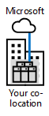|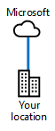|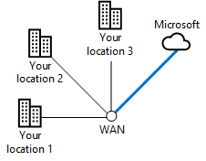|
|Se i datacenter situati in una struttura con uno scambio cloud, è possibile ordinare una connessione tra virtuale nel cloud Microsoft tramite exchange Ethernet del provider posizione condivisa.    |Se il centro dati si trova il locale, è possibile utilizzare un collegamento di una scheda Ethernet da punto a punto per la connessione a Microsoft cloud.    |Se si utilizza già un provider di servizi VPN IP (MPLS) per connettere i siti dell'organizzazione, una connessione ExpressRoute nel cloud Microsoft funge da un'altra posizione sulla WAN privata.    |
   
 **Tabella 1: Modelli di connettività ExpressRoute**
  
## Relazioni di peering ExpressRoute ai servizi cloud Microsoft

Una singola connessione ExpressRoute supporta fino a tre diverse Border Gateway Protocol (BGP) peering relazioni in diverse parti del cloud Microsoft. BPG utilizza peering relazioni per stabilire una relazione di trust e scambiare informazioni di routing.
  
**Figura 3: Le tre diverse BGP relazioni in una singola connessione ExpressRoute**

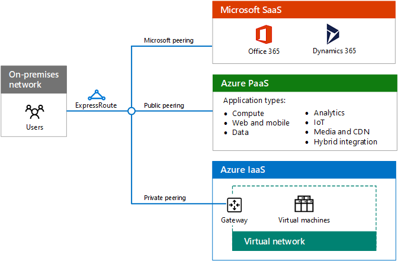
  
Nella figura 3 viene mostrata una connessione ExpressRoute da una rete locale. La connessione ExpressRoute include tre relazioni peering logiche. Una relazione di peering Microsoft passerà a servizi SaaS Microsoft, tra cui Office 365 e Dynamcs CRM Online. Una relazione di peering pubblica passerà a servizi di Azure PaaS. Una relazione di peering privata passa per Azure IaaS e un gateway di rete virtuale che ospita le macchine virtuali.
  
La relazione BGP peering Microsoft: 
  
- Ha origine dal router la DMZ gli indirizzi pubblici di servizi di Office 365 e Dynamics 365. 
    
- Supporta le comunicazioni avviate bidirezionale.
    
La relazione BGP peering pubblica:
  
- È compreso un router la DMZ e gli indirizzi IP pubblici di servizi di Azure.
    
- Supporta la comunicazione unidirezionale avviate da solo sistemi locali. La relazione peering non supporta le comunicazioni avviate da servizi di Azure PaaS.
    
La relazione BGP peering privata:
  
- È compreso un router nel bordo della rete dell'organizzazione e gli indirizzi IP privati assegnati per il VNets Azure.
    
- Supporta le comunicazioni avviate bidirezionale.
    
- È un'estensione della rete dell'organizzazione per il cloud Microsoft, utilizzando l'indirizzamento internamente coerente e il routing.
    
## Esempio di flusso di distribuzione e il traffico di applicazione con ExpressRoute

Come si sposti il traffico tra le connessioni ExpressRoute e all'interno di Microsoft cloud è una funzione di route all'hop del percorso tra l'origine e il comportamento di destinazione e l'applicazione. Di seguito è riportato un esempio di un'applicazione in esecuzione in una macchina virtuale Azure che accede a una farm di SharePoint locali tramite una connessione VPN da sito.
  
**Figura 4: Un'applicazione in una macchina virtuale Azure accesso a una farm di SharePoint locale**

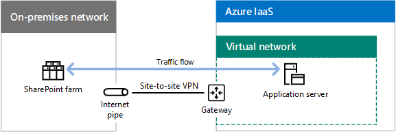

  
Figura 4 viene illustrato il flusso di una farm di SharePoint locale, una connessione VPN da sito tra la rete locale e una rete virtuale in Azure IaaS, un server applicazioni in esecuzione come una macchina virtuale Azure IaaS e il traffico tra il server applicazioni e farm di SharePoint.
  
L'applicazione individua l'indirizzo IP della farm di SharePoint tramite il sistema DNS locale e tutto il traffico viene inoltrata tramite una connessione VPN da sito.
  
L'organizzazione migrati le farm di SharePoint locale in SharePoint Online in Office 365 e distribuzione di una connessione ExpressRoute.
  
**Figura 5: Spostare la farm di SharePoint locale con SharePoint Online**

  
Figura 5 viene illustrata l'aggiunta di una connessione ExpressRoute con relazioni di peering per Microsoft SaaS e Office 365 e Azure IaaS contenente il server applicazioni in una rete virtuale. Farm di SharePoint locale è stata eseguita la migrazione a Office 365.
  
Con Microsoft e relazioni peering private:
  
- Dal gateway rete virtuale Azure percorsi locali riguardano disponibili mediante la connessione ExpressRoute.
    
- Dalla sottoscrizione di Office 365, indirizzi IP pubblici di dispositivi edge, ad esempio server proxy, riguardano disponibili mediante la connessione ExpressRoute.
    
- Dalla rete locale edge, gli indirizzi IP privati del VNet Azure e indirizzi IP pubblici di Office 365 sono disponibili tramite la connessione ExpressRoute.
    
Quando l'applicazione accede l'URL di SharePoint Online, inoltra il traffico tra la connessione ExpressRoute a un server proxy del bordo. 
  
Quando il server proxy individua l'indirizzo IP di SharePoint Online, inoltra il traffico back tramite la connessione ExpressRoute. Il traffico di risposta passa il percorso inverso.
  
**Figura 6: Flusso di traffico durante la migrazione di farm di SharePoint è stata eseguita con SharePoint Online in Office 365**

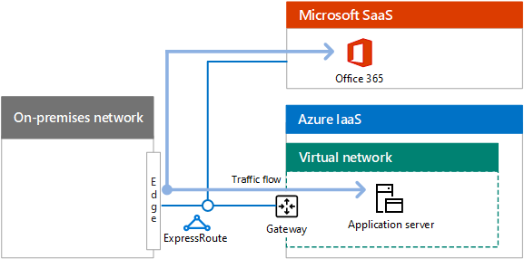

  
Figura 6 mostra come il traffico tra il server applicazioni e SharePoint Online in Office 365 copre la relazione di peering privata dal server applicazioni e il margine di rete locale e quindi dal bordo tramite la relazione peering Microsoft per Office 365.
  
Il risultato è fini del blocco, una conseguenza del comportamento di routing e dell'applicazione.
  
## Rete cloud ExpressRoute e di Microsoft

Sono disponibili in due versioni diverse connessioni ExpressRoute: ExpressRoute ed ExpressRoute Premium.
  
### ExpressRoute

Come si sposti il traffico tra la rete dell'organizzazione e un database di Microsoft Data Center è una combinazione di:
  
- I percorsi.
    
- Microsoft cloud peering percorsi (posizioni fisiche per la connessione e il lato Microsoft).
    
- Posizioni dei data center Microsoft.
    
Data Center Microsoft e cloud peering percorsi sono connessi alla rete Microsoft cloud.
  
Quando si crea una connessione ExpressRoute in un percorso peering cloud Microsoft, si è connessi alla rete Microsoft cloud e tutti i percorsi di datacenter Microsoft continente stesso. Il traffico tra il percorso peering cloud e i data center Microsoft di destinazione viene eseguito tramite la rete di Microsoft cloud.
  
Ciò potrebbe causare recapito non ottimale di datacenter Microsoft locale per il modello a tutti per qualsiasi servizio di integrazione applicativa.
  
**Figura 7: Esempio di un'organizzazione geograficamente distribuiti che utilizza una singola connessione ExpressRoute**

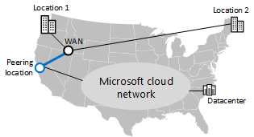
  
Figura 7 mostra un'organizzazione con due percorsi 1 località in Nord-Ovest degli Stati Uniti e 2 posizione del nord-est. Sono connessi da un qualsiasi per qualsiasi provider WAN. L'organizzazione ha inoltre una connessione ExpressRoute in un percorso peering Microsoft costa occidentale. Il traffico proveniente da posizioni 2 in Nord-Est destinate a un datacenter costa orientale deve recarsi completamente WAN dell'organizzazione in costa occidentale del percorso peering Microsoft e quindi nuovamente in tutto il paese sulla rete cloud Microsoft per la zona est Data Center.
  
Per il recapito ottimale, utilizzare più connessioni ExpressRoute per regionali Microsoft cloud peering percorsi. 
  
**Figura 8: L'utilizzo di più connessioni ExpressRoute per il recapito ottimale datacenter internazionale**

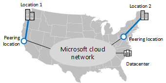
  
Figura 8 Mostra alla stessa organizzazione con due connessioni ExpressRoute, uno per ogni località nella regione locale posizioni peering Microsoft. In questa configurazione, il traffico proveniente da posizioni 2 in Nord-Est destinate a un datacenter costa orientale passa direttamente in una posizione peering costa orientale, alla rete cloud Microsoft e quindi al datacenter costa orientale.
  
Possono inviare più connessioni ExpressRoute:
  
- Migliorare le prestazioni di posizioni dei data center Microsoft nella regione locale.
    
- Maggiore disponibilità per il cloud Microsoft quando non è disponibile una connessione ExpressRoute locale.
    
Ciò vale per organizzazioni di continente stesso. Tuttavia, il traffico di datacenter Microsoft esterno continente dell'organizzazione passa tramite Internet.
  
Per il traffico intercontinental sulla rete Microsoft cloud, è necessario utilizzare connessioni ExpressRoute Premium.
  
### ExpressRoute Premium

Per le organizzazioni che a livello globale vengono distribuite in continenti diversi, è possibile utilizzare ExpressRoute Premium. 
  
Con ExpressRoute Premium, puoi raggiungere qualsiasi datacenter Microsoft in qualsiasi continente da qualsiasi posizione di peering Microsoft. Il traffico tra i continenti viene trasportato sulla rete cloud Microsoft.
  
Con più connessioni ExpressRoute Premium, è possibile disporre di:
  
- Migliorare le prestazioni di datacenter Microsoft continentally locale.
    
- Maggiore disponibilità per il cloud Microsoft globale quando non è disponibile una connessione ExpressRoute locale.
    
È necessario per le connessioni basate su Office 365 ExpressRoute ExpressRoute Premium. Non esiste tuttavia costi aggiuntivi per le grandi aziende con più concessa in licenza o 500 utenti.
  
**Figura 9: Livello mondiale Microsoft cloud network**

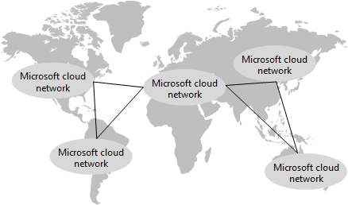
  
Figura 9 mostra un diagramma logico della rete mondiale Microsoft cloud, con le reti che includono il continenti e le aree di tutto il mondo e i collegamenti. Con una parte della rete Microsoft cloud in ogni continente, un'azienda globale crea ExpressRoute Premium connessioni sedi internazionali hub ai percorsi di peering Microsoft locali.
  
Per un ufficio regionale appropriato per il traffico di Office 365:
  
- Continentale datacenter di Office 365 passa attraverso la rete di Microsoft cloud all'interno di continente.
    
- Centri dati di Office 365 in un altro continente passa attraverso la rete cloud Microsoft intercontinental.
    
Per ulteriori informazioni, vedere:
  
- [ExpressRoute Azure per la formazione su Office 365](https://channel9.msdn.com/series/aer/)
    
- [Pianificazione della rete e ottimizzazione delle prestazioni per Office 365](https://aka.ms/tune)
    
- [Gestione delle prestazioni di Office 365](https://mva.microsoft.com/en-US/training-courses/office-365-performance-management-8416)
    
## Opzioni ExpressRoute

La distribuzione ExpressRoute inoltre è possibile incorporare le opzioni seguenti:
  
- **Protezione in corrispondenza del bordo:** Per garantire la sicurezza avanzata per il traffico inviato e ricevuto tramite la connessione ExpressRoute, ad esempio l'ispezione di traffico o il rilevamento delle intrusioni/malware, effettuare le apparecchiature di sicurezza nel percorso di traffico all'interno del DMZ o il bordo della rete intranet.
    
    Il traffico Internet per le macchine virtuali per impedire che si avvia il traffico direttamente con i percorsi Internet e macchine virtuali di Azure annunciare la route predefinita a Microsoft. Il traffico verso Internet viene instradato attraverso la connessione ExpressRoute e tramite i server proxy in locale. Il traffico proveniente da macchine virtuali Azure per Office 365 o i servizi di Azure PaaS viene instradato nuovamente attraverso la connessione ExpressRoute.
    
- **Ottimizzatori WAN:** È possibile distribuire ottimizzatori WAN su entrambi i lati di una connessione peering privata per un Azure cross-premise reti virtuali (VNet). All'interno di VNet Azure, utilizzare un dispositivo di rete WAN optimizer Azure marketplace e routing definite dall'utente per instradare il traffico attraverso il dispositivo.
    
- **Qualità del servizio:** Utilizzare i valori DSCP Differentiated Services Code Point () nell'intestazione IPv4 parte del traffico per contrassegnare per VoIP, video/interattiva o sforzo recapito. Ciò è particolarmente importante per la relazione di peering Microsoft e Skype per il traffico Business Online.
    
Vedere le risorse aggiuntive per ulteriori informazioni:
  
- [ExpressRoute per Office 365](https://aka.ms/expressrouteoffice365)
    
- [ExpressRoute Azure per la formazione su Office 365](https://channel9.msdn.com/series/aer/)
    
- [ExpressRoute per Azure](https://azure.microsoft.com/services/expressroute/)
    
## Vedere anche

[Rete cloud Microsoft per Enterprise Architects](microsoft-cloud-networking-for-enterprise-architects.md)
  
[Risorse sull'architettura IT del cloud Microsoft](microsoft-cloud-it-architecture-resources.md)

[Guida di orientamento del cloud aziendale Microsoft: risorse per i decision maker del settore IT](https://sway.com/FJ2xsyWtkJc2taRD)

