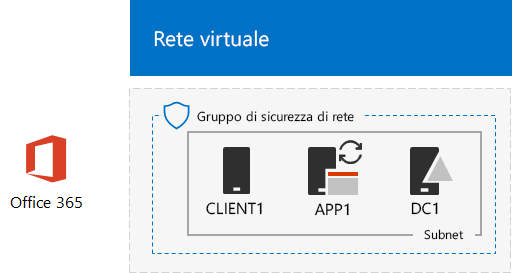
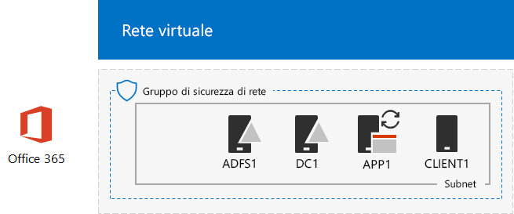

# <a name="federated-identity-for-your-office-365-devtest-environment"></a>Identità federata per l'ambiente di sviluppo/test di Office 365

 **Sintesi**: configurare l'autenticazione federata per l'ambiente di sviluppo/test di Office 365.
  
Office 365 supporta l'identità federativa. Questo indica che invece di eseguire la convalida delle credenziali autonomamente, Office 365 fa riferimento all'utente connesso a un server di autenticazione federata che Office 365 considera attendibile. Se le credenziali dell'utente sono corrette, il server di autenticazione federata emette un token di sicurezza che il client invia quindi a Office 365 come prova di autenticazione. L'identità federativa consente l'offload e la scalabilità in verticale di autenticazione per una sottoscrizione a Office 365 e scenari di sicurezza e autenticazione avanzata.
  
In questo articolo viene descritto come è possibile configurare l'autenticazione federata per l'ambiente di sviluppo/test di Office 365, determinando la configurazione seguente:
  
**Figura 1: l'autenticazione federata per l'ambiente di sviluppo/test di Office 365**


  
La configurazione illustrata nella figura 1 è costituita da: 
  
- Una sottoscrizione di valutazione di Office 365 E5 che scade dopo 30 giorni dalla creazione.
    
- Una rete Intranet dell'organizzazione semplificata connessa a Internet e costituita da cinque macchine virtuali in una sottorete di una rete virtuale Azure (DC1, APP1, CLIENT1, ADFS1 e PROXY1). Azure AD Connect viene eseguito su APP1 per sincronizzare l'elenco di account nel dominio di Active Directory Domain Services con Office 365. PROXY1 riceve le richieste di autenticazione in arrivo. ADFS1 convalida le credenziali con DC1 e rilascia token di sicurezza.
    
Le fasi principali della configurazione dell'ambiente di sviluppo e di testing sono cinque:
  
1. Creare l'ambiente di sviluppo/test di Office 365 aziendale simulato con DirSync.
    
2. Creare il server ADFS (ADFS1).
    
3. Creare il server proxy Web (PROXY1).
    
4. Creare un certificato autofirmato e configurare ADFS1 e PROXY1.
    
5. Configurare Office 365 per l'identità federativa.
    
Per informazioni dettagliate su una distribuzione di produzione di autenticazione federata per Office 365 in Azure, vedere [Deploy high availability federated authentication for Office 365 in Azure](deploy-high-availability-federated-authentication-for-office-365-in-azure.md).
  
> [!NOTE]
> Non è possibile configurare l'ambiente di sviluppo/test con una sottoscrizione di valutazione di Azure. 
  
> [!TIP]
> Fare clic [qui](http://aka.ms/catlgstack) per consultare una mappa di tutti gli articoli nella serie di guide dei lab di test di Office 365.
  
## <a name="phase-1-create-the-simulated-enterprise-office-365-devtest-environment-with-dirsync"></a>Fase 1: creare l'ambiente di sviluppo/test di Office 365 aziendale simulato con DirSync

Seguire le istruzioni in [Sincronizzazione della directory per l'ambiente di sviluppo/test di Office 365](dirsync-for-your-office-365-dev-test-environment.md) per creare l'ambiente di sviluppo/test di Office 365 aziendale simulato con APP1 come server DirSync e identità federativa tra gli account di Office 365 e Active Directory Domain Services su DC1.
  
Successivamente, creare un nuovo nome di dominio DNS pubblico basato sul proprio nome di dominio corrente e aggiungerlo all'abbonamento a Office 365. È consigliabile utilizzare il nome **testlab.**\<dominio pubblico>. Ad esempio, se il nome di dominio pubblico è contoso.com, aggiungere il nome di dominio pubblico testlab.contoso.com.
  
Per istruzioni su come creare i record DNS corretti nel provider DNS e aggiungere il dominio alla sottoscrizione di valutazione di Office 365, vedere [Aggiungere utenti e domini a Office 365](https://support.office.com/article/Add-users-and-domain-to-Office-365-6383f56d-3d09-4dcb-9b41-b5f5a5efd611).  
  
Di seguito è riportata la configurazione risultante.
  
**Figura 2: sincronizzazione della directory per l'ambiente di sviluppo/test di Office 365**


  
Nella figura 2 viene mostrata la sincronizzazione della directory per l'ambiente di sviluppo/test di Office 365, che include Office 365 e le macchine virtuali CLIENT1, APP1 e DC1 in una rete virtuale di Azure.
  
## <a name="phase-2-create-the-ad-fs-server"></a>Fase 2: creare il server AD FS

Un server AD FS fornisce l'autenticazione federata tra Office 365 e gli account nel dominio corp.contoso.com ospitato su DC1.
  
Per creare una macchina virtuale Azure per ADFS1, inserire il nome della sottoscrizione, il gruppo di risorse e la posizione di Azure per la configurazione di base, quindi eseguire questi comandi al prompt dei comandi di Azure PowerShell nel computer locale.
  
```
$subscrName="<your Azure subscription name>"
$rgName="<the resource group name of your Base Configuration>"
$vnetName="TlgBaseConfig-01-VNET"
# NOTE: If you built your simulated intranet with Azure PowerShell, comment the previous line with a "#" and remove the "#" from the next line.
#$vnetName="TestLab"
Connect-AzAccount
Select-AzSubscription -SubscriptionName $subscrName
$staticIP="10.0.0.100"
$locName=(Get-AzResourceGroup -Name $rgName).Location
$vnet=Get-AzVirtualNetwork -Name $vnetName -ResourceGroupName $rgName
$pip = New-AzPublicIpAddress -Name ADFS1-PIP -ResourceGroupName $rgName -Location $locName -AllocationMethod Dynamic
$nic = New-AzNetworkInterface -Name ADFS1-NIC -ResourceGroupName $rgName -Location $locName -SubnetId $vnet.Subnets[0].Id -PublicIpAddressId $pip.Id -PrivateIpAddress $staticIP
$vm=New-AzVMConfig -VMName ADFS1 -VMSize Standard_D2_v2
$cred=Get-Credential -Message "Type the name and password of the local administrator account for ADFS1."
$vm=Set-AzVMOperatingSystem -VM $vm -Windows -ComputerName ADFS1 -Credential $cred -ProvisionVMAgent -EnableAutoUpdate
$vm=Set-AzVMSourceImage -VM $vm -PublisherName MicrosoftWindowsServer -Offer WindowsServer -Skus 2016-Datacenter -Version "latest"
$vm=Add-AzVMNetworkInterface -VM $vm -Id $nic.Id
$vm=Set-AzVMOSDisk -VM $vm -Name "ADFS-OS" -DiskSizeInGB 128 -CreateOption FromImage -StorageAccountType "Standard_LRS"
New-AzVM -ResourceGroupName $rgName -Location $locName -VM $vm
```
<!--
> [!TIP]
> Click [here](https://gallery.technet.microsoft.com/PowerShell-commands-for-f79bc2c2?redir=0) for a text file that has all the PowerShell commands in this article.
-->
  
Successivamente, utilizzare il [portale di Azure](http://portal.azure.com) per connettersi alla macchina virtuale ADFS1 usando il nome e la password dell'account Administrator locale di ADFS1, quindi aprire un prompt dei comandi di Windows PowerShell.
  
Per controllare la risoluzione del nome e la comunicazione della rete tra ADFS1 e DC1, eseguire il comando **ping dc1.corp.contoso.com** e verificare che siano presenti quattro risposte.
  
Unire quindi la macchina virtuale ADFS1 al dominio CORP immettendo questi comandi nel prompt dei comandi di Windows PowerShell in ADFS1.
  
```
$cred=Get-Credential -UserName "CORP\User1" -Message "Type the User1 account password."
Add-Computer -DomainName corp.contoso.com -Credential $cred
Restart-Computer
```

Di seguito è riportata la configurazione risultante.
  
**Figura 3: aggiunta del server AD FS**


  
Nella figura 3 viene mostrata l'aggiunta del server ADFS1 a DirSync per l'ambiente di sviluppo/test di Office 365.
  
## <a name="phase-3-create-the-web-proxy-server"></a>Fase 3: Creare il server proxy Web

PROXY1 consente l'inoltro dei messaggi di autenticazione tra gli utenti e ADFS1.
  
Per creare una macchina virtuale Azure per PROXY1, inserire il nome del gruppo di risorse e la posizione di Azure, quindi eseguire questi comandi al prompt dei comandi di Azure PowerShell nel computer locale.
  
```
$rgName="<the resource group name of your Base Configuration>"
$vnetName="TlgBaseConfig-01-VNET"
# NOTE: If you built your simulated intranet with Azure PowerShell, comment the previous line with a "#" and remove the "#" from the next line.
#$vnetName="TestLab"
$staticIP="10.0.0.101"
$locName=(Get-AzResourceGroup -Name $rgName).Location
$vnet=Get-AzVirtualNetwork -Name $vnetName -ResourceGroupName $rgName
$pip = New-AzPublicIpAddress -Name PROXY1-PIP -ResourceGroupName $rgName -Location $locName -AllocationMethod Static
$nic = New-AzNetworkInterface -Name PROXY1-NIC -ResourceGroupName $rgName -Location $locName -SubnetId $vnet.Subnets[0].Id -PublicIpAddressId $pip.Id -PrivateIpAddress $staticIP
$vm=New-AzVMConfig -VMName PROXY1 -VMSize Standard_D2_v2
$cred=Get-Credential -Message "Type the name and password of the local administrator account for PROXY1."
$vm=Set-AzVMOperatingSystem -VM $vm -Windows -ComputerName PROXY1 -Credential $cred -ProvisionVMAgent -EnableAutoUpdate
$vm=Set-AzVMSourceImage -VM $vm -PublisherName MicrosoftWindowsServer -Offer WindowsServer -Skus 2016-Datacenter -Version "latest"
$vm=Add-AzVMNetworkInterface -VM $vm -Id $nic.Id
$vm=Set-AzVMOSDisk -VM $vm -Name "PROXY1-OS" -DiskSizeInGB 128 -CreateOption FromImage -StorageAccountType "Standard_LRS"
New-AzVM -ResourceGroupName $rgName -Location $locName -VM $vm
```

> [!NOTE]
> A PROXY1 viene assegnato un indirizzo IP pubblico statico perché verrà creato un record DNS pubblico che punta a esso e non deve essere modificato quando si riavvia la macchina virtuale PROXY1. 
  
Aggiungere quindi una regola al gruppo di sicurezza di rete per la sottorete CorpNet per consentire il traffico in ingresso non sollecitato da Internet all'indirizzo IP privato di PROXY1 e la porta TCP 443. Eseguire questi comandi al prompt dei comandi di Azure PowerShell nel computer locale.
  
```
$rgName="<the resource group name of your Base Configuration>"
Get-AzNetworkSecurityGroup -Name CorpNet -ResourceGroupName $rgName | Add-AzNetworkSecurityRuleConfig -Name "HTTPS-to-PROXY1" -Description "Allow TCP 443 to PROXY1" -Access "Allow" -Protocol "Tcp" -Direction "Inbound" -Priority 101 -SourceAddressPrefix "Internet" -SourcePortRange "*" -DestinationAddressPrefix "10.0.0.101" -DestinationPortRange "443" | Set-AzNetworkSecurityGroup
```

Successivamente, utilizzare il [portale di Azure](http://portal.azure.com) per connettersi alla macchina virtuale PROXY1 usando il nome e la password dell'account Administrator locale di PROXY1, quindi aprire un prompt dei comandi di Windows PowerShell in PROXY1.
  
Per controllare la risoluzione del nome e la comunicazione della rete tra PROXY1 e DC1, eseguire il comando **ping dc1.corp.contoso.com** e verificare che siano presenti quattro risposte.
  
Unire quindi la macchina virtuale PROXY1 al dominio CORP immettendo questi comandi nel prompt dei comandi di Windows PowerShell in PROXY1.
  
```
$cred=Get-Credential -UserName "CORP\User1" -Message "Type the User1 account password."
Add-Computer -DomainName corp.contoso.com -Credential $cred
Restart-Computer
```

Visualizzare l'indirizzo IP pubblico di PROXY1 con questi comandi PowerShell di Azure nel computer locale:
  
```
Write-Host (Get-AzPublicIpaddress -Name "PROXY1-PIP" -ResourceGroup $rgName).IPAddress
```

Successivamente, interagire con il provider DNS pubblico e creare un nuovo record A DNS pubblico per **fs.testlab.**\<nome di dominio DNS> che restituisce l'indirizzo IP visualizzato dal comando **Write-Host**. Il **fs.testlab.**\<nome di dominio DNS> verrà di seguito indicato come *nome di dominio completo del servizio federativo*.
  
Successivamente, utilizzare il [portale di Azure](http://portal.azure.com) per connettersi alla macchina virtuale DC1 usando le credenziali di CORP\\User1, quindi eseguire i comandi seguenti a un prompt dei comandi di Windows PowerShell a livello di amministratore:
  
```
Add-DnsServerPrimaryZone -Name corp.contoso.com -ZoneFile corp.contoso.com.dns
Add-DnsServerResourceRecordA -Name "fs" -ZoneName corp.contoso.com -AllowUpdateAny -IPv4Address "10.0.0.100" -TimeToLive 01:00:00
```
Tali comandi consentono di creare un record DNS A interno in modo che le macchine virtuali nella rete virtuale di Azure possano risolvere il nome di dominio completo interno della federazione nell'indirizzo IP privato di ADFS1.
  
Questa è la configurazione risultante.
  
**Figura 4: aggiunta del server proxy di applicazione Web**


  
Nella figura 4 viene mostrata l'aggiunta del server PROXY1.
  
## <a name="phase-4-create-a-self-signed-certificate-and-configure-adfs1-and-proxy1"></a>Fase 4: Creare un certificato autofirmato e configurare ADFS1 e PROXY1

In questa fase, viene creato un certificato digitale autofirmato per il nome di dominio completo del servizio federativo e vengono configurati ADFS1 e PROXY1 come farm AD FS.
  
Per prima cosa, utilizzare il [portale di Azure](http://portal.azure.com) per connettersi alla macchina virtuale DC1 usando le credenziali di CORP\\CORPUser1, quindi aprire un prompt dei comandi di Windows PowerShell a livello di amministratore. 
  
Successivamente, creare un account del servizio AD FS con questo comando al prompt dei comandi di Windows PowerShell in DC1:
  
```
New-ADUser -SamAccountName ADFS-Service -AccountPassword (read-host "Set user password" -assecurestring) -name "ADFS-Service" -enabled $true -PasswordNeverExpires $true -ChangePasswordAtLogon $false
```

Tenere presente che questo comando chiede di specificare la password dell'account. Scegliere una password complessa e annotarla in una posizione sicura. Sarà necessaria per questa e la fase successiva.
  
Utilizzare il [portale di Azure](http://portal.azure.com) per connettersi alla macchina virtuale ADFS1 utilizzando le credenziali di CORP\\CORPUser1. Aprire un prompt dei comandi di Windows PowerShell a livello di amministratore su ADFS1, immettere il nome di dominio completo del servizio federativo e quindi eseguire questi comandi per creare un certificato autofirmato:
  
```
$fedServiceFQDN="<federation service FQDN>"
New-SelfSignedCertificate -DnsName $fedServiceFQDN -CertStoreLocation "cert:\LocalMachine\My"
New-Item -path c:\Certs -type directory
New-SmbShare -name Certs -path c:\Certs -changeaccess CORP\User1
```

Successivamente, seguire questi passaggi per salvare il nuovo certificato autofirmato come file.
  
1. Fare clic sul pulsante **Start**, digitare **mmc.exe**, quindi premere **INVIO**.
    
2. Fare clic su **File > Aggiungi/Rimuovi snap-in**.
    
3. In **Aggiungi o rimuovi snap-in**, fare doppio clic su **Certificati** nell'elenco di snap-in disponibili, fare clic su **Account del computer**, quindi fare clic su **Avanti**.
    
4. In **Seleziona computer**, fare clic su **Fine** e quindi su **OK**.
    
5. Nel riquadro dell'albero, aprire **Certificati (computer locali) > Personale > Certificati**.
    
6. Fare clic con il pulsante destro del mouse sul certificato con il nome di dominio completo del servizio federativo, fare clic su **Tutte le attività**, quindi su **Esporta**.
    
7. Nella pagina **iniziale**, scegliere **Avanti**.
    
8. Nella pagina **Esportazione della chiave privata con il certificato** fare clic su **Sì**, quindi su **Avanti**.
    
9. Nella pagina **Formato file di esportazione** fare clic su **Esporta tutte le proprietà estese**, quindi su **Avanti**.
    
10. Nella pagina **Sicurezza** fare clic su **Password** e digitare una password in **Password** e **Conferma password.**
    
11. Nella pagina **File da esportare** fare clic su **Sfoglia**.
    
12. Passare alla cartella **C:\\Certs**, digitare **SSL** in **Nome file** e quindi fare clic su **Salva**.
    
13. Nella pagina **File da esportare** fare clic su **Avanti**.
    
14. Nella pagina **Completamento dell'Esportazione guidata certificati** fare clic su **Fine**. Quando richiesto, fare clic su **OK**.
    
Successivamente, installare il servizio AD FS con questo comando al prompt dei comandi di Windows PowerShell in ADFS1:
  
```
Install-WindowsFeature ADFS-Federation -IncludeManagementTools
```

Attendere che venga stabilita la connessione.
  
Successivamente, configurare il servizio AD FS seguendo questi passaggi:
  
1. Fare clic sul pulsante **Start** e quindi fare clic sull'icona **Server Manager**.
    
2. Nel riquadro dell'albero di Server Manager, fare clic su **AD FS**.
    
3. Nella barra degli strumenti nella parte superiore, fare clic sul simbolo di attenzione arancione e quindi fare clic su **Configurare il servizio federativo nel server**.
    
4. Nella pagina di **benvenuto** in Configurazione guidata Active Directory Federation Services, fare clic su **Avanti**.
    
5. Nella pagina **Connessione a Servizi di dominio Active Directory** fare clic su **Avanti**.
    
6. Nella pagina **Impostazione proprietà del servizio**:
    
  - Per **Certificato SSL** fare clic sulla freccia in giù, quindi selezionare il certificato con il nome di dominio completo del servizio federativo.
    
  - In **Nome visualizzato del servizio federativo**, digitare il nome dell'organizzazione fittizia.
    
  - Fare clic su **Avanti**.
    
7. Nella pagina **Impostazione account del servizio** fare clic su **Seleziona** per **Nome account**.
    
8. In **Seleziona utente o account del servizio** digitare **Servizio ADFS**, fare clic su **Controlla nomi**, quindi su **OK**.
    
9. In **Password account** digitare la password per l'account del servizio ADFS, quindi fare clic su **Avanti**.
    
10. Nella pagina **Impostazione database di configurazione** fare clic su **Avanti**.
    
11. Nella pagina **Verifica opzioni** fare clic su **Avanti**.
    
12. Nella pagina **Controlli dei prerequisiti** fare clic su **Configura**.
    
13. Nella pagina **Risultati** fare clic su **Chiudi**.
    
14. Fare clic sul pulsante **Start**, selezionare l'icona di alimentazione, fare clic su **Riavvia** e quindi su **Continua**.
    
Dal [portale Azure](http://portal.azure.com), connettersi a PROXY1 con le credenziali dell'account CORP\\User1.
  
Successivamente, seguire questi passaggi per installare il certificato autofirmato e configurare PROXY1.
  
1. Fare clic sul pulsante **Start**, digitare **mmc.exe**, quindi premere **INVIO**.
    
2. Fare clic su **File > Aggiungi/Rimuovi snap-in**.
    
3. In **Aggiungi o rimuovi snap-in**, fare doppio clic su **Certificati** nell'elenco di snap-in disponibili, fare clic su **Account del computer**, quindi fare clic su **Avanti**.
    
4. In **Seleziona computer**, fare clic su **Fine** e quindi su **OK**.
    
5. Nel riquadro dell'albero, aprire **Certificati (computer locali) > Personale > Certificati**.
    
6. Fare clic con il pulsante destro del mouse su **Personale**, selezionare **Tutte le attività** e fare clic su **Importa**.
    
7. Nella pagina **iniziale**, scegliere **Avanti**.
    
8. Nella pagina **File da importare** digitare **\\\\adfs1\\certs\\ssl.pfx**, quindi fare clic su **Avanti**.
    
9. Nella pagina **Protezione della chiave privata** digitare la password del certificato in **Password**, quindi fare clic su **Avanti.**
    
10. Nella pagina **Archivio certificati** fare clic su **Avanti**.
    
11. Nella pagina **Completamento in corso** fare clic su **Fine**.
    
12. Nella pagina **Archivio certificati** fare clic su **Avanti**.
    
13. Quando viene richiesto, fare clic su **OK**.
    
14. Fare clic su **Certificati** nel riquadro dell'albero.
    
15. Fare clic con il pulsante destro del mouse sul certificato, quindi su **Copia**.
    
16. Nel riquadro dell'albero, aprire **Autorità di certificazione radice attendibili > Certificati**.
    
17. Spostare il puntatore del mouse sotto l'elenco di certificati installati rapida, fare clic con il pulsante destro e quindi selezionare **Incolla**.
    
Aprire un prompt dei comandi PowerShell a livello di amministratore ed eseguire il comando seguente:
  
```
Install-WindowsFeature Web-Application-Proxy -IncludeManagementTools
```

Attendere che venga stabilita la connessione.
  
Seguire questi passaggi per configurare il servizio proxy dell'applicazione Web in modo da utilizzare ADFS1 come server federativo:
  
1. Fare clic sul pulsante **Start** e quindi scegliere **Server Manager**.
    
2. Nel riquadro dell'albero fare clic su **Accesso remoto**.
    
3. Nella barra degli strumenti nella parte superiore, fare clic sul simbolo di attenzione arancione e quindi fare clic su **Apre la procedura guidata per il proxy dell'applicazione Web**.
    
4. Nella pagina di **benvenuto** nella Configurazione guidata proxy applicazione Web, fare clic su **Avanti**.
    
5. Nella pagina **Server federativo**:
    
  - Digitare il nome di dominio completo del servizio federativo in **Nome servizio federativo**.
    
  - Digitare **CORP\\User1** in **Nome utente**.
    
  - Digitare la password per l'account User1 nel campo **Password**.
    
  - Fare clic su **Avanti**.
    
6. Nella pagina **Certificato proxy AD FS** fare clic sulla freccia in giù, selezionare il certificato con il nome di dominio completo del servizio federativo e fare clic su **Avanti**.
    
7. Nella pagina **Conferma** fare clic su **Configura**.
    
8. Nella pagina **Risultati** fare clic su **Chiudi**.
    
## <a name="phase-5-configure-office-365-for-federated-identity"></a>Fase 5: configurare Office 365 per l'identità federativa

Utilizzare il [portale di Azure](http://portal.azure.com) per connettersi alla macchina virtuale APP1 utilizzando le credenziali dell'account di CORP\\CORPUser1.
  
Attenersi a questa procedura per configurare Azure AD Connect e l'abbonamento a Office 365 per l'autenticazione federata:
  
1. Dal desktop, fare doppio clic su **Azure AD Connect**.
    
2. Nella pagina **Azure AD Connect** fare clic su **Configura**.
    
3. Nella pagina **Attività addizionali** fare clic su **Cambia l'accesso utente**, quindi su **Avanti**.
    
4. Nella pagina **Connessione ad Azure AD**, digitare il nome e la password dell'account amministratore globale di Office 365 e fare clic su **Avanti**.
    
5. Nella pagina **Accesso utente**, fare clic su **Federazione tramite ADFS**, quindi fare clic su **Avanti**.
    
6. Nella pagina **Farm AD FS** fare clic su **Usa una farm AD FS esistente**, digitare **ADFS1** in **Nome del server** e quindi fare clic su **Avanti**.
    
7. Quando vengono richieste le credenziali del server, immettere quelle dell'account di CORP\\CORPUser1, quindi fare clic su **OK**.
    
8. Nella pagina delle credenziali dell'**amministratore di dominio** digitare **CORP\\User1** in **Nome utente** e la password dell'account in **Password**, quindi fare clic su **Avanti**.
    
9. Nella pagina **Account del servizio ADFS** digitare **CORP\\ADFS-Service** in **Nome utente di dominio** e la password dell'account in **Password utente di dominio**, quindi fare clic su **Avanti**.
    
10. Nella pagina **Dominio di Azure AD**, in **Dominio** selezionare il nome del dominio precedentemente creato e aggiunto all'abbonamento di Office 365 nella fase 1, quindi fare clic su **Avanti**.
    
11. Nella pagina **Pronto per la configurazione** fare clic su **Configura**.
    
12. Nella pagina **Installazione completata** fare clic su **Verifica**.
    
    Verranno visualizzati messaggi che confermano la corretta configurazione Internet e Intranet.
    
13. Nella pagina **Installazione completata**, fare clic su **Chiudi**.
    
Per verificare il funzionamento dell'autenticazione federata, eseguire le operazioni seguenti:
  
1. Aprire una nuova istanza privata del browser nel computer locale e andare a [https://admin.microsoft.com](https://admin.microsoft.com).
    
2. Per le credenziali di accesso, digitare **user1@**\<dominio creato nella fase 1>.  
    
    Ad esempio, se il dominio di test è **testlab.contoso.com**, digitare "user1@testlab.contoso.com". Premere TAB o consentire a Office 365 di essere reindirizzati automaticamente.
    
    Viene visualizzata una pagina **La connessione non è privata**. Accade questo perché è stato installato un certificato autofirmato su ADFS1 che non può essere convalidato dal computer desktop. In una distribuzione di produzione di autenticazione federata, utilizzare un certificato rilasciato da un'autorità di certificazione attendibile per fare in modo che gli utenti non visualizzino questa pagina.
    
3. Nella pagina **La connessione non è privata** fare clic su **Avanzate**, quindi su **Continua a \<nome di dominio completo del servizio federativo>**.  
    
4. Nella pagina con il nome dell'organizzazione fittizia accedere con le seguenti credenziali:
    
  - **CORP\\User1** per il nome
    
  - La password per l'account User1
    
    Verrà visualizzata la **Home Page Microsoft Office**.
    
Questa procedura dimostra che l'abbonamento di valutazione a Office 365 è federato con il dominio corp.contoso.com di Active Directory Domain Services ospitato su DC1. Ecco i concetti di base del processo di autenticazione:
  
1. Quando si utilizza il dominio federato creato nella fase 1 all'interno del nome dell'account di accesso, Office 365 reindirizza il browser al nome di dominio completo del servizio federativo e PROXY1.
    
2. PROXY1 invia al computer locale la pagina di accesso della società fittizia.
    
3. Quando si invia CORP\\CORPUser1 e la password a PROXY1, quest'ultimo li reinvia ad ADFS1.
    
4. ADFS1 convalida CORP\\CORPUser1 e la password con DC1 e invia al computer locale un token di sicurezza.
    
5. Il computer locale invia il token di sicurezza a Office 365.
    
6. Office 365 verifica che il token di sicurezza è stato creato da ADFS1 e consente l'accesso.
    
La sottoscrizione di valutazione di Office 365 è ora configurata con l'autenticazione federata. È possibile utilizzare questo ambiente di sviluppo/test per scenari di autenticazione avanzata.
  
## <a name="next-step"></a>Passaggio successivo

Quando si intende distribuire l'autenticazione federata a disponibilità elevata pronta per la produzione per Office 365 in Azure, vedere [Deploy high availability federated authentication for Office 365 in Azure](deploy-high-availability-federated-authentication-for-office-365-in-azure.md).
  
## <a name="see-also"></a>Vedere anche

[Test Lab Guide (TLG) di adozione cloud](cloud-adoption-test-lab-guides-tlgs.md)
  
[Ambiente di sviluppo/test della configurazione di base](base-configuration-dev-test-environment.md)
  
[Ambiente di sviluppo/test di Office 365](office-365-dev-test-environment.md)
  
[Adozione del cloud e soluzioni ibride](cloud-adoption-and-hybrid-solutions.md)
  
[Distribuire l'autenticazione federata ad alta visibilità per Office 365 in Azure](deploy-high-availability-federated-authentication-for-office-365-in-azure.md)


