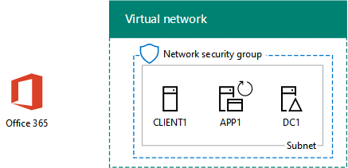

# <a name="federated-identity-for-your-office-365-devtest-environment"></a><span data-ttu-id="48fc4-103">Identità federata per l'ambiente di sviluppo/test di Office 365</span><span class="sxs-lookup"><span data-stu-id="48fc4-103">Federated identity for your Office 365 dev/test environment</span></span>

 <span data-ttu-id="48fc4-104">**Riepilogo:** Configurare l'autenticazione federata per l'ambiente di sviluppo e di testing di Office 365.</span><span class="sxs-lookup"><span data-stu-id="48fc4-104">**Summary:** Configure federated authentication for your Office 365 dev/test environment.</span></span>
  
<span data-ttu-id="48fc4-p101">Office 365 supporta identità federata. Ciò significa che invece di eseguire la convalida delle credenziali stesso, Office 365 si riferisce utente connesso a un server di autenticazione federativa che considera attendibile Office 365. Se le credenziali dell'utente siano corrette, il server di autenticazione federata emette un token di sicurezza che il client invia quindi a Office 365 come modello di autenticazione. Identità federata consente l'offload e la scalabilità verticale di autenticazione per una sottoscrizione a Office 365 e scenari di autenticazione e la protezione avanzata.</span><span class="sxs-lookup"><span data-stu-id="48fc4-p101">Office 365 supports federated identity. This means that instead of performing the validation of credentials itself, Office 365 refers the connecting user to a federated authentication server that Office 365 trusts. If the user's credentials are correct, the federated authentication server issues a security token that the client then sends to Office 365 as proof of authentication. Federated identity allows for the offloading and scaling up of authentication for an Office 365 subscription and advanced authentication and security scenarios.</span></span>
  
<span data-ttu-id="48fc4-109">In questo articolo viene descritto come è possibile configurare l'autenticazione federata per l'ambiente di sviluppo/test di Office 365, determinando la configurazione seguente:</span><span class="sxs-lookup"><span data-stu-id="48fc4-109">This article describes how you can configure federated authentication for the Office 365 dev/test environment, resulting in the following:</span></span>
  
<span data-ttu-id="48fc4-110">**Nella figura 1: L'autenticazione federata per l'ambiente di sviluppo e di testing di Office 365**</span><span class="sxs-lookup"><span data-stu-id="48fc4-110">**Figure 1: The federated authentication for Office 365 dev/test environment**</span></span>


  
<span data-ttu-id="48fc4-112">La configurazione illustrata nella figura 1 è costituita da: </span><span class="sxs-lookup"><span data-stu-id="48fc4-112">The configuration shown in Figure 1 consists of:</span></span> 
  
- <span data-ttu-id="48fc4-113">Una sottoscrizione di valutazione di Office 365 E5 che scade dopo 30 giorni dalla creazione.</span><span class="sxs-lookup"><span data-stu-id="48fc4-113">An Office 365 E5 Trial Subscription, which expires 30 days from when you create it.</span></span>
    
- <span data-ttu-id="48fc4-p102">Una rete Intranet dell'organizzazione semplificata connessa a Internet e costituita da cinque macchine virtuali in una sottorete di una rete virtuale Azure (DC1, APP1, CLIENT1, ADFS1 e PROXY1). Azure AD Connect viene eseguito su APP1 per sincronizzare l'elenco di account nel dominio di Windows Server AD con Office 365. PROXY1 riceve le richieste di autenticazione in arrivo. ADFS1 convalida le credenziali con DC1 e rilascia token di sicurezza.</span><span class="sxs-lookup"><span data-stu-id="48fc4-p102">A simplified organization intranet connected to the Internet, consisting of five virtual machines on a subnet of an Azure virtual network (DC1, APP1, CLIENT1, ADFS1, and PROXY1). Azure AD Connect runs on APP1 to synchronize the list of accounts in the Windows Server AD domain to Office 365. PROXY1 receives the incoming authentication requests. ADFS1 validates credentials with DC1 and issues security tokens.</span></span>
    
<span data-ttu-id="48fc4-118">Le fasi principali della configurazione dell'ambiente di sviluppo e di testing sono cinque:</span><span class="sxs-lookup"><span data-stu-id="48fc4-118">There are five phases to setting up this dev/test environment:</span></span>
  
1. <span data-ttu-id="48fc4-119">Creare l'ambiente di sviluppo/test di Office 365 aziendale simulato con DirSync.</span><span class="sxs-lookup"><span data-stu-id="48fc4-119">Create the simulated enterprise Office 365 dev/test environment with DirSync.</span></span>
    
2. <span data-ttu-id="48fc4-120">Creare il server ADFS (ADFS1).</span><span class="sxs-lookup"><span data-stu-id="48fc4-120">Create the AD FS server (ADFS1).</span></span>
    
3. <span data-ttu-id="48fc4-121">Creare il server proxy Web (PROXY1).</span><span class="sxs-lookup"><span data-stu-id="48fc4-121">Create the web proxy server (PROXY1).</span></span>
    
4. <span data-ttu-id="48fc4-122">Creare un certificato autofirmato e configurare ADFS1 e PROXY1.</span><span class="sxs-lookup"><span data-stu-id="48fc4-122">Create a self-signed certificate and configure ADFS1 and PROXY1.</span></span>
    
5. <span data-ttu-id="48fc4-123">Configurare Office 365 per l'identità federativa.</span><span class="sxs-lookup"><span data-stu-id="48fc4-123">Configure Office 365 for federated identity.</span></span>
    
<span data-ttu-id="48fc4-124">Al passaggio a una distribuzione di produzione di autenticazione federata per Office 365 in Azure, vedere [Deploy la disponibilità elevata nell'autenticazione federata per Office 365 in Azure](deploy-high-availability-federated-authentication-for-office-365-in-azure.md).</span><span class="sxs-lookup"><span data-stu-id="48fc4-124">To step through a production deployment of federated authentication for Office 365 in Azure, see [Deploy high availability federated authentication for Office 365 in Azure](deploy-high-availability-federated-authentication-for-office-365-in-azure.md).</span></span>
  
> [!NOTE]
> <span data-ttu-id="48fc4-125">Non è possibile configurare l'ambiente di sviluppo/test con una sottoscrizione di valutazione di Azure.</span><span class="sxs-lookup"><span data-stu-id="48fc4-125">You cannot configure this dev/test environment with an Azure Trial subscription.</span></span> 
  
> [!TIP]
> <span data-ttu-id="48fc4-126">Fare clic [qui](http://aka.ms/catlgstack) per consultare una mappa di tutti gli articoli relativi alla guida del laboratorio di testing cloud di One Microsoft.</span><span class="sxs-lookup"><span data-stu-id="48fc4-126">Click [here](http://aka.ms/catlgstack) for a visual map to all the articles in the One Microsoft Cloud Test Lab Guide stack.</span></span>
  
## <a name="phase-1-create-the-simulated-enterprise-office-365-devtest-environment-with-dirsync"></a><span data-ttu-id="48fc4-127">Fase 1: Creare l'ambiente di sviluppo/test di Office 365 aziendale simulato con DirSync</span><span class="sxs-lookup"><span data-stu-id="48fc4-127">Phase 1: Create the simulated enterprise Office 365 dev/test environment with DirSync</span></span>

<span data-ttu-id="48fc4-128">Seguire le istruzioni in [DirSync per l'ambiente di sviluppo e di testing di Office 365](dirsync-for-your-office-365-dev-test-environment.md) per creare l'ambiente di sviluppo e di testing simulato enterprise di Office 365 con APP1 come server DirSync e identità sincronizzati tra Office 365 e Windows Server Active Directory account in DC1.</span><span class="sxs-lookup"><span data-stu-id="48fc4-128">Follow the instructions in [DirSync for your Office 365 dev/test environment](dirsync-for-your-office-365-dev-test-environment.md) to create the simulated enterprise Office 365 dev/test environment with APP1 as the DirSync server and synchronized identity between Office 365 and the Windows Server AD accounts on DC1.</span></span>
  
<span data-ttu-id="48fc4-p103">Successivamente, creare un nuovo nome dominio DNS pubblico basato sul nome del dominio corrente e aggiungerla alla sottoscrizione Office 365. È consigliabile utilizzare il nome **laboratorio di test.** \<il dominio pubblico >. Ad esempio, se il nome del dominio pubblico è contoso.com, aggiungere testlab.contoso.com il nome di dominio pubblico.</span><span class="sxs-lookup"><span data-stu-id="48fc4-p103">Next, create a new public DNS domain name based on your current domain name and add it to your Office 365 subscription. We recommend using the name **testlab.**\<your public domain>. For example, if your public domain name is contoso.com, add the public domain name testlab.contoso.com.</span></span>
  
<span data-ttu-id="48fc4-132">Per istruzioni su come creare i record DNS corretti nel provider di DNS e aggiungere il dominio per la sottoscrizione di prova di Office 365, vedere [aggiungere utenti e il dominio a Office 365](https://support.office.com/article/Add-users-and-domain-to-Office-365-6383f56d-3d09-4dcb-9b41-b5f5a5efd611).</span><span class="sxs-lookup"><span data-stu-id="48fc4-132">For instructions on how to create the correct DNS records in your DNS provider and add the domain to your Office 365 trial subscription, see [Add users and domain to Office 365](https://support.office.com/article/Add-users-and-domain-to-Office-365-6383f56d-3d09-4dcb-9b41-b5f5a5efd611).</span></span> 
  
<span data-ttu-id="48fc4-133">Di seguito è riportata la configurazione risultante.</span><span class="sxs-lookup"><span data-stu-id="48fc4-133">Here is your resulting configuration.</span></span>
  
<span data-ttu-id="48fc4-134">**Figura 2: DirSync per l'ambiente di sviluppo e di testing di Office 365**</span><span class="sxs-lookup"><span data-stu-id="48fc4-134">**Figure 2: DirSync for Office 365 dev/test environment**</span></span>


  
<span data-ttu-id="48fc4-136">Nella figura 2 viene mostrato DirSync per l'ambiente di sviluppo/test di Office 365, che include Office 365 e le macchine virtuali CLIENT1, APP1 e DC1 in una rete virtuale di Azure.</span><span class="sxs-lookup"><span data-stu-id="48fc4-136">Figure 2 shows the DirSync for Office 365 dev/test environment, which includes Office 365 and CLIENT1, APP1, and DC1 virtual machines in an Azure virtual network.</span></span>
  
## <a name="phase-2-create-the-ad-fs-server"></a><span data-ttu-id="48fc4-137">Fase 2: Creare il server AD FS</span><span class="sxs-lookup"><span data-stu-id="48fc4-137">Phase 2: Create the AD FS server</span></span>

<span data-ttu-id="48fc4-138">Un server AD FS fornisce l'autenticazione federata tra Office 365 e gli account nel dominio corp.contoso.com ospitato su DC1.</span><span class="sxs-lookup"><span data-stu-id="48fc4-138">An AD FS server provides federated authentication between Office 365 and the accounts in the corp.contoso.com domain hosted on DC1.</span></span>
  
<span data-ttu-id="48fc4-139">Per creare una macchina virtuale Azure per ADFS1, immettere il nome dell'abbonamento e il gruppo di risorse e il percorso Azure per la configurazione di Base e quindi eseguire questi comandi al prompt dei comandi di Azure PowerShell nel computer locale.</span><span class="sxs-lookup"><span data-stu-id="48fc4-139">To create an Azure virtual machine for ADFS1, fill in the name of your subscription and the resource group and Azure location for your Base Configuration, and then run these commands at the Azure PowerShell command prompt on your local computer.</span></span>
  
```
$subscr="<your Azure subscription name>"
$rgName="<the resource group name of your Base Configuration>"
Login-AzureRMAccount
Get-AzureRmSubscription -SubscriptionName $subscr | Select-AzureRmSubscription
$staticIP="10.0.0.100"
$locName=(Get-AzureRmResourceGroup -Name $rgName).Location
$vnet=Get-AzureRMVirtualNetwork -Name TestLab -ResourceGroupName $rgName
$pip = New-AzureRMPublicIpAddress -Name ADFS1-PIP -ResourceGroupName $rgName -Location $locName -AllocationMethod Dynamic
$nic = New-AzureRMNetworkInterface -Name ADFS1-NIC -ResourceGroupName $rgName -Location $locName -SubnetId $vnet.Subnets[0].Id -PublicIpAddressId $pip.Id -PrivateIpAddress $staticIP
$vm=New-AzureRMVMConfig -VMName ADFS1 -VMSize Standard_D2_v2
$cred=Get-Credential -Message "Type the name and password of the local administrator account for ADFS1."
$vm=Set-AzureRMVMOperatingSystem -VM $vm -Windows -ComputerName ADFS1 -Credential $cred -ProvisionVMAgent -EnableAutoUpdate
$vm=Set-AzureRMVMSourceImage -VM $vm -PublisherName MicrosoftWindowsServer -Offer WindowsServer -Skus 2016-Datacenter -Version "latest"
$vm=Add-AzureRMVMNetworkInterface -VM $vm -Id $nic.Id
$vm=Set-AzureRmVMOSDisk -VM $vm -Name "ADFS-OS" -DiskSizeInGB 128 -CreateOption FromImage -StorageAccountType "StandardLRS"
New-AzureRMVM -ResourceGroupName $rgName -Location $locName -VM $vm
```

> [!TIP]
> <span data-ttu-id="48fc4-140">Fare clic [qui](https://gallery.technet.microsoft.com/PowerShell-commands-for-f79bc2c2?redir=0) per ottenere un file di testo che contiene tutti i comandi di PowerShell in questo articolo.</span><span class="sxs-lookup"><span data-stu-id="48fc4-140">Click [here](https://gallery.technet.microsoft.com/PowerShell-commands-for-f79bc2c2?redir=0) to get a text file that contains all the PowerShell commands in this article.</span></span>
  
<span data-ttu-id="48fc4-141">Successivamente, utilizzare il [portale Azure](http://portal.azure.com) per la connessione alla macchina virtuale ADFS1 utilizzando il nome dell'account amministratore locale ADFS1 e la password e quindi aprire un prompt dei comandi di Windows PowerShell.</span><span class="sxs-lookup"><span data-stu-id="48fc4-141">Next, use the [Azure portal](http://portal.azure.com) to connect to the ADFS1 virtual machine using the ADFS1 local administrator account name and password, and then open a Windows PowerShell command prompt.</span></span>
  
<span data-ttu-id="48fc4-142">Per verificare la comunicazione nome di soluzione e di rete tra ADFS1 e DC1, eseguire il comando **ping dc1.corp.contoso.com** e verificare che non vi sono quattro risposte.</span><span class="sxs-lookup"><span data-stu-id="48fc4-142">To check name resolution and network communication between ADFS1 and DC1, run the **ping dc1.corp.contoso.com** command and verify that there are four replies.</span></span>
  
<span data-ttu-id="48fc4-143">Unire quindi la macchina virtuale ADFS1 al dominio CORP immettendo questi comandi nel prompt dei comandi di Windows PowerShell in ADFS1.</span><span class="sxs-lookup"><span data-stu-id="48fc4-143">Next, join the ADFS1 virtual machine to the CORP domain with these commands at the Windows PowerShell prompt on ADFS1.</span></span>
  
```
$cred=Get-Credential -UserName "CORP\\User1" -Message "Type the User1 account password."
Add-Computer -DomainName corp.contoso.com -Credential $cred
Restart-Computer
```

<span data-ttu-id="48fc4-144">Di seguito è riportata la configurazione risultante.</span><span class="sxs-lookup"><span data-stu-id="48fc4-144">Here is your resulting configuration.</span></span>
  
<span data-ttu-id="48fc4-145">**Figura 3: Aggiunta di server AD FS**</span><span class="sxs-lookup"><span data-stu-id="48fc4-145">**Figure 3: Adding the AD FS server**</span></span>


  
<span data-ttu-id="48fc4-147">Nella figura 3 viene mostrata l'aggiunta del server ADFS1 a DirSync per l'ambiente di sviluppo/test di Office 365.</span><span class="sxs-lookup"><span data-stu-id="48fc4-147">Figure 3 shows the addition of the ADFS1 server to the DirSync for Office 365 dev/test environment.</span></span>
  
## <a name="phase-3-create-the-web-proxy-server"></a><span data-ttu-id="48fc4-148">Fase 3: Creare il server proxy Web</span><span class="sxs-lookup"><span data-stu-id="48fc4-148">Phase 3: Create the web proxy server</span></span>

<span data-ttu-id="48fc4-149">PROXY1 consente l'inoltro dei messaggi di autenticazione tra gli utenti e ADFS1.</span><span class="sxs-lookup"><span data-stu-id="48fc4-149">PROXY1 provides proxying of authentication messages between users attempting to authenticate and ADFS1.</span></span>
  
<span data-ttu-id="48fc4-150">Per creare una macchina virtuale Azure per PROXY1, inserire il nome del gruppo di risorse e la posizione di Azure, quindi eseguire questi comandi al prompt dei comandi di Azure PowerShell nel computer locale.</span><span class="sxs-lookup"><span data-stu-id="48fc4-150">To create an Azure virtual machine for PROXY1, fill in the name of your resource group and Azure location, and then run these commands at the Azure PowerShell command prompt on your local computer.</span></span>
  
```
$rgName="<the resource group name of your Base Configuration>"
$staticIP="10.0.0.101"
$locName=(Get-AzureRmResourceGroup -Name $rgName).Location
$vnet=Get-AzureRMVirtualNetwork -Name TestLab -ResourceGroupName $rgName
$pip = New-AzureRMPublicIpAddress -Name PROXY1-PIP -ResourceGroupName $rgName -Location $locName -AllocationMethod Static
$nic = New-AzureRMNetworkInterface -Name PROXY1-NIC -ResourceGroupName $rgName -Location $locName -SubnetId $vnet.Subnets[0].Id -PublicIpAddressId $pip.Id -PrivateIpAddress $staticIP
$vm=New-AzureRMVMConfig -VMName PROXY1 -VMSize Standard_D2_v2
$cred=Get-Credential -Message "Type the name and password of the local administrator account for PROXY1."
$vm=Set-AzureRMVMOperatingSystem -VM $vm -Windows -ComputerName PROXY1 -Credential $cred -ProvisionVMAgent -EnableAutoUpdate
$vm=Set-AzureRMVMSourceImage -VM $vm -PublisherName MicrosoftWindowsServer -Offer WindowsServer -Skus 2016-Datacenter -Version "latest"
$vm=Add-AzureRMVMNetworkInterface -VM $vm -Id $nic.Id
$vm=Set-AzureRmVMOSDisk -VM $vm -Name "PROXY1-OS" -DiskSizeInGB 128 -CreateOption FromImage -StorageAccountType "StandardLRS"
New-AzureRMVM -ResourceGroupName $rgName -Location $locName -VM $vm
```

> [!NOTE]
> <span data-ttu-id="48fc4-151">A PROXY1 viene assegnato un indirizzo IP pubblico statico perché verrà creato un record DNS pubblico che punta a esso e non deve essere modificato quando si riavvia la macchina virtuale PROXY1.</span><span class="sxs-lookup"><span data-stu-id="48fc4-151">PROXY1 is assigned a static public IP address because you will create a public DNS record that points to it and it must not change when you restart the PROXY1 virtual machine.</span></span> 
  
<span data-ttu-id="48fc4-p104">Aggiungere una regola per il gruppo di protezione di rete per la subnet CorpNet per consentire il traffico in ingresso da Internet alla porta TCP 443 e indirizzi IP privati del PROXY1. Eseguire questi comandi al prompt dei comandi di Azure PowerShell nel computer locale.</span><span class="sxs-lookup"><span data-stu-id="48fc4-p104">Next, add a rule to the network security group for the CorpNet subnet to allow unsolicited inbound traffic from the Internet to PROXY1's private IP address and TCP port 443. Run these commands at the Azure PowerShell command prompt on your local computer.</span></span>
  
```
$rgName="<the resource group name of your Base Configuration>"
Get-AzureRmNetworkSecurityGroup -Name CorpNet -ResourceGroupName $rgName | Add-AzureRmNetworkSecurityRuleConfig -Name "HTTPS-to-PROXY1" -Description "Allow TCP 443 to PROXY1" -Access "Allow" -Protocol "Tcp" -Direction "Inbound" -Priority 101 -SourceAddressPrefix "Internet" -SourcePortRange "*" -DestinationAddressPrefix "10.0.0.101" -DestinationPortRange "443" | Set-AzureRmNetworkSecurityGroup
```

<span data-ttu-id="48fc4-154">Successivamente, utilizzare il [portale Azure](http://portal.azure.com) per la connessione alla macchina virtuale PROXY1 utilizzando il nome dell'account amministratore locale PROXY1 e la password e quindi aprire un prompt dei comandi di Windows PowerShell in PROXY1.</span><span class="sxs-lookup"><span data-stu-id="48fc4-154">Next, use the [Azure portal](http://portal.azure.com) to connect to the PROXY1 virtual machine using the PROXY1 local administrator account name and password, and then open a Windows PowerShell command prompt on PROXY1.</span></span>
  
<span data-ttu-id="48fc4-155">Per verificare la comunicazione nome di soluzione e di rete tra PROXY1 e DC1, eseguire il comando **ping dc1.corp.contoso.com** e verificare che non vi sono quattro risposte.</span><span class="sxs-lookup"><span data-stu-id="48fc4-155">To check name resolution and network communication between PROXY1 and DC1, run the **ping dc1.corp.contoso.com** command and verify that there are four replies.</span></span>
  
<span data-ttu-id="48fc4-156">Unire quindi la macchina virtuale PROXY1 al dominio CORP immettendo questi comandi nel prompt dei comandi di Windows PowerShell in PROXY1.</span><span class="sxs-lookup"><span data-stu-id="48fc4-156">Next, join the PROXY1 virtual machine to the CORP domain with these commands at the Windows PowerShell prompt on PROXY1.</span></span>
  
```
$cred=Get-Credential -UserName "CORP\\User1" -Message "Type the User1 account password."
Add-Computer -DomainName corp.contoso.com -Credential $cred
Restart-Computer
```

<span data-ttu-id="48fc4-157">Visualizzare l'indirizzo IP pubblico di PROXY1 con questi comandi PowerShell di Azure nel computer locale:</span><span class="sxs-lookup"><span data-stu-id="48fc4-157">Display the public IP address of PROXY1 with these Azure PowerShell commands on your local computer:</span></span>
  
```
Write-Host (Get-AzureRMPublicIpaddress -Name "PROXY1-PIP" -ResourceGroup $rgName).IPAddress
```

<span data-ttu-id="48fc4-p105">Successivamente, utilizzare i provider DNS pubblico e creare un nuovo record A DNS pubblico per **fs.testlab.** \<il nome di dominio DNS > che viene risolto nell'indirizzo IP visualizzato dal comando di **Write-Host** . Il **fs.testlab.** \<il nome di dominio DNS > verrà indicato di seguito come *servizio federativo FQDN* .</span><span class="sxs-lookup"><span data-stu-id="48fc4-p105">Next, work with your public DNS provider and create a new public DNS A record for **fs.testlab.**\<your DNS domain name> that resolves to the IP address displayed by the **Write-Host** command. The **fs.testlab.**\<your DNS domain name> is hereafter referred to as the  *federation service FQDN*  .</span></span>
  
<span data-ttu-id="48fc4-160">Successivamente, utilizzare il [portale Azure](http://portal.azure.com) per la connessione alla macchina virtuale DC1 utilizzando il CORP\\User1 credenziali e quindi eseguire le operazioni seguenti comandi al prompt dei comandi di Windows PowerShell livello di amministratore:</span><span class="sxs-lookup"><span data-stu-id="48fc4-160">Next, use the [Azure portal](http://portal.azure.com) to connect to the DC1 virtual machine using the CORP\\User1 credentials, and then run the following commands at an administrator-level Windows PowerShell command prompt:</span></span>
  
```
$testZone="<the FQDN of your testlab domain from phase 1, example: testlab.contoso.com>"
$testZoneFile= $testZone + ".dns"
Add-DnsServerPrimaryZone -Name $testZone -ZoneFile $testZoneFile
Add-DnsServerResourceRecordA -Name "fs" -ZoneName $testZone -AllowUpdateAny -IPv4Address "10.0.0.100" -TimeToLive 01:00:00
```

<span data-ttu-id="48fc4-161">Tali comandi consentono di creare un record A DNS per il nome di dominio completo del servizio federativo che le macchine virtuali nella rete virtuale di Azure possono risolvere nell'indirizzo IP privato di ADFS1.</span><span class="sxs-lookup"><span data-stu-id="48fc4-161">These commands create a DNS A record for your federation service FQDN that virtual machines on the Azure virtual network can resolve to ADFS1's private IP address.</span></span>
  
<span data-ttu-id="48fc4-162">Di seguito è riportata la configurazione risultante.</span><span class="sxs-lookup"><span data-stu-id="48fc4-162">Here is your resulting configuration.</span></span>
  
<span data-ttu-id="48fc4-163">**Figura 4: Aggiunta di server proxy dell'applicazione web**</span><span class="sxs-lookup"><span data-stu-id="48fc4-163">**Figure 4: Adding the web application proxy server**</span></span>


  
<span data-ttu-id="48fc4-165">Nella figura 4 viene mostrata l'aggiunta del server PROXY1.</span><span class="sxs-lookup"><span data-stu-id="48fc4-165">Figure 4 shows the addition of the PROXY1 server.</span></span>
  
## <a name="phase-4-create-a-self-signed-certificate-and-configure-adfs1-and-proxy1"></a><span data-ttu-id="48fc4-166">Fase 4: Creare un certificato autofirmato e configurare ADFS1 e PROXY1</span><span class="sxs-lookup"><span data-stu-id="48fc4-166">Phase 4: Create a self-signed certificate and configure ADFS1 and PROXY1</span></span>

<span data-ttu-id="48fc4-167">In questa fase, viene creato un certificato digitale autofirmato per il nome di dominio completo del servizio federativo e vengono configurati ADFS1 e PROXY1 come farm AD FS.</span><span class="sxs-lookup"><span data-stu-id="48fc4-167">In this phase, you create a self-signed digital certificate for your federation service FQDN and configure ADFS1 and PROXY1 as an AD FS farm.</span></span>
  
<span data-ttu-id="48fc4-168">Innanzitutto, utilizzare il [portale Azure](http://portal.azure.com) per la connessione alla macchina virtuale DC1 utilizzando il CORP\\User1 credenziali e quindi aprire un livello di amministratore di Windows PowerShell Prompt dei comandi.</span><span class="sxs-lookup"><span data-stu-id="48fc4-168">First, use the [Azure portal](http://portal.azure.com) to connect to the DC1 virtual machine using the CORP\\User1 credentials, and then open an administrator-level Windows PowerShell command prompt.</span></span>
  
<span data-ttu-id="48fc4-169">Successivamente, creare un account del servizio AD FS con questo comando al prompt dei comandi di Windows PowerShell in DC1:</span><span class="sxs-lookup"><span data-stu-id="48fc4-169">Next, create AD FS service account with this command at the Windows PowerShell command prompt on DC1:</span></span>
  
```
New-ADUser -SamAccountName ADFS-Service -AccountPassword (read-host "Set user password" -assecurestring) -name "ADFS-Service" -enabled $true -PasswordNeverExpires $true -ChangePasswordAtLogon $false
```

<span data-ttu-id="48fc4-p106">Tenere presente che questo comando chiede di specificare la password dell'account. Scegliere una password complessa e annotarla in una posizione sicura. Sarà necessaria per questa e la fase successiva.</span><span class="sxs-lookup"><span data-stu-id="48fc4-p106">Note that this command prompts you to supply the account password. Choose a strong password and record it in a secured location. You will need it for this phase and Phase 5.</span></span>
  
<span data-ttu-id="48fc4-p107">Utilizzare il [portale Azure](http://portal.azure.com) per la connessione alla macchina virtuale ADFS1 utilizzando il CORP\\credenziali User1. Aprire un prompt dei comandi di Windows PowerShell a livello di amministratore in ADFS1, immettere il servizio federativo FQDN e quindi eseguire i comandi seguenti per creare un certificato autofirmato:</span><span class="sxs-lookup"><span data-stu-id="48fc4-p107">Use the [Azure portal](http://portal.azure.com) to connect to the ADFS1 virtual machine using the CORP\\User1 credentials. Open an administrator-level Windows PowerShell command prompt on ADFS1, fill in your federation service FQDN, and then run these commands to create a self-signed certificate:</span></span>
  
```
$fedServiceFQDN="<federation service FQDN>"
New-SelfSignedCertificate -DnsName $fedServiceFQDN -CertStoreLocation "cert:\\LocalMachine\\My"
New-Item -path c:\\Certs -type directory
New-SmbShare -name Certs -path c:\\Certs -changeaccess CORP\\User1
```

<span data-ttu-id="48fc4-175">Successivamente, seguire questi passaggi per salvare il nuovo certificato autofirmato come file.</span><span class="sxs-lookup"><span data-stu-id="48fc4-175">Next, use these steps to save the new self-signed certificate as a file.</span></span>
  
1. <span data-ttu-id="48fc4-176">Fare clic su **Start**, digitare **mmc.exe**. exe e quindi premere **INVIO**.</span><span class="sxs-lookup"><span data-stu-id="48fc4-176">Click **Start**, type **mmc.exe**, and then press **Enter**.</span></span>
    
2. <span data-ttu-id="48fc4-177">Fare clic su **File > Aggiungi/Rimuovi Snap-in**.</span><span class="sxs-lookup"><span data-stu-id="48fc4-177">Click **File > Add/Remove Snap-in**.</span></span>
    
3. <span data-ttu-id="48fc4-178">In **Aggiungi o Rimuovi Snap-in**, fare doppio clic su **certificati** nell'elenco degli snap-in disponibili, fare clic su **account del Computer**e quindi fare clic su **Avanti**.</span><span class="sxs-lookup"><span data-stu-id="48fc4-178">In **Add or Remove Snap-ins**, double-click **Certificates** in the list of available snap-ins, click **Computer account**, and then click **Next**.</span></span>
    
4. <span data-ttu-id="48fc4-179">In **Seleziona Computer**, fare clic su **Fine**e quindi fare clic su **OK**.</span><span class="sxs-lookup"><span data-stu-id="48fc4-179">In **Select Computer**, click **Finish**, and then click **OK**.</span></span>
    
5. <span data-ttu-id="48fc4-180">Nel riquadro dell'albero, aprire **certificati (Computer locale) > personale > certificati**.</span><span class="sxs-lookup"><span data-stu-id="48fc4-180">In the tree pane, open **Certificates (Local Computer) > Personal > Certificates**.</span></span>
    
6. <span data-ttu-id="48fc4-181">Fare clic con il servizio federativo nome di dominio completo del certificato, fare clic su **tutte le attività**e quindi fare clic su **Esporta**.</span><span class="sxs-lookup"><span data-stu-id="48fc4-181">Right-click the certificate with your federation service FQDN, click **All tasks**, and then click **Export**.</span></span>
    
7. <span data-ttu-id="48fc4-182">Nella pagina di **benvenuto** fare clic su **Avanti**.</span><span class="sxs-lookup"><span data-stu-id="48fc4-182">On the **Welcome** page, click **Next**.</span></span>
    
8. <span data-ttu-id="48fc4-183">Nella pagina **Esportazione della chiave privata** , fare clic su **Sì**e quindi fare clic su **Avanti**.</span><span class="sxs-lookup"><span data-stu-id="48fc4-183">On the **Export Private Key** page, click **Yes**, and then click **Next**.</span></span>
    
9. <span data-ttu-id="48fc4-184">Nella pagina **Formato File di esportazione** fare clic su **Esporta tutte le proprietà estese**e quindi fare clic su **Avanti**.</span><span class="sxs-lookup"><span data-stu-id="48fc4-184">On the **Export File Format** page, click **Export all extended properties**, and then click **Next**.</span></span>
    
10. <span data-ttu-id="48fc4-185">Nella pagina **sicurezza** fare clic su **Password** e digitare una password nella **casella Password** e **Conferma password.**</span><span class="sxs-lookup"><span data-stu-id="48fc4-185">On the **Security** page, click **Password** and type a password in **Password** and **Confirm password.**</span></span>
    
11. <span data-ttu-id="48fc4-186">Nella pagina **File da esportare** , fare clic su **Sfoglia**.</span><span class="sxs-lookup"><span data-stu-id="48fc4-186">On the **File to Export** page, click **Browse**.</span></span>
    
12. <span data-ttu-id="48fc4-187">Individuare il **c:\\certificati** cartella, digitare **SSL** nella **casella Nome File**e quindi fare clic su **salvare.**</span><span class="sxs-lookup"><span data-stu-id="48fc4-187">Browse to the **C:\\Certs** folder, type **SSL** in **File name**, and then click **Save.**</span></span>
    
13. <span data-ttu-id="48fc4-188">Nella pagina **File da esportare** , fare clic su **Avanti**.</span><span class="sxs-lookup"><span data-stu-id="48fc4-188">On the **File to Export** page, click **Next**.</span></span>
    
14. <span data-ttu-id="48fc4-p108">Nella pagina **completamento dell'esportazione guidata certificati** fare clic su **Fine**. Quando richiesto, fare clic su **OK**.</span><span class="sxs-lookup"><span data-stu-id="48fc4-p108">On the **Completing the Certificate Export Wizard** page, click **Finish**. When prompted, click **OK**.</span></span>
    
<span data-ttu-id="48fc4-191">Successivamente, installare il servizio AD FS con questo comando al prompt dei comandi di Windows PowerShell in ADFS1:</span><span class="sxs-lookup"><span data-stu-id="48fc4-191">Next, install the AD FS service with this command at the Windows PowerShell command prompt on ADFS1:</span></span>
  
```
Install-WindowsFeature ADFS-Federation -IncludeManagementTools
```

<span data-ttu-id="48fc4-192">Attendere che venga stabilita la connessione.</span><span class="sxs-lookup"><span data-stu-id="48fc4-192">Wait for the installation to complete.</span></span>
  
<span data-ttu-id="48fc4-193">Successivamente, configurare il servizio AD FS seguendo questi passaggi:</span><span class="sxs-lookup"><span data-stu-id="48fc4-193">Next, configure the AD FS service with these steps:</span></span>
  
1. <span data-ttu-id="48fc4-194">Fare clic su **Start**e quindi fare clic sull'icona **Server Manager** .</span><span class="sxs-lookup"><span data-stu-id="48fc4-194">Click **Start**, and then click the **Server Manager** icon.</span></span>
    
2. <span data-ttu-id="48fc4-195">Nel riquadro dell'albero di Server Manager, fare clic su **AD FS**.</span><span class="sxs-lookup"><span data-stu-id="48fc4-195">In the tree pane of Server Manager, click **AD FS**.</span></span>
    
3. <span data-ttu-id="48fc4-196">Nella barra degli strumenti nella parte superiore, fare clic sul simbolo attenzione arancione e quindi fare clic su **Configura il servizio federativo nel server**.</span><span class="sxs-lookup"><span data-stu-id="48fc4-196">In the tool bar at the top, click the orange caution symbol, and then click **Configure the federation service on this server**.</span></span>
    
4. <span data-ttu-id="48fc4-197">Nella pagina **iniziale** della configurazione guidata servizi di federazione Active Directory fare clic su **Avanti**.</span><span class="sxs-lookup"><span data-stu-id="48fc4-197">On the **Welcome** page of the Active Directory Federation Services Configuration Wizard, click **Next**.</span></span>
    
5. <span data-ttu-id="48fc4-198">Nella pagina **connessione al dominio Active Directory** , fare clic su **Avanti**.</span><span class="sxs-lookup"><span data-stu-id="48fc4-198">On the **Connect to AD DS** page, click **Next**.</span></span>
    
6. <span data-ttu-id="48fc4-199">Nella pagina **Specificare le proprietà del servizio** :</span><span class="sxs-lookup"><span data-stu-id="48fc4-199">On the **Specify Service Properties** page:</span></span>
    
  - <span data-ttu-id="48fc4-200">**Certificato SSL**, fare clic sulla freccia e quindi fare clic sul certificato con il nome del servizio federativo FQDN.</span><span class="sxs-lookup"><span data-stu-id="48fc4-200">For **SSL Certificate**, click the down arrow, and then click the certificate with the name of your federation service FQDN.</span></span>
    
  - <span data-ttu-id="48fc4-201">In **Nome visualizzato del servizio federativo**, digitare il nome della società fittizia.</span><span class="sxs-lookup"><span data-stu-id="48fc4-201">In **Federation Service Display Name**, type the name of your fictional organization.</span></span>
    
  - <span data-ttu-id="48fc4-202">Fare clic su **Avanti**.</span><span class="sxs-lookup"><span data-stu-id="48fc4-202">Click **Next**.</span></span>
    
7. <span data-ttu-id="48fc4-203">Nella pagina **Specifica Account di servizio** fare clic su **Seleziona** per **nome dell'Account**.</span><span class="sxs-lookup"><span data-stu-id="48fc4-203">On the **Specify Service Account** page, click **Select** for **Account name**.</span></span>
    
8. <span data-ttu-id="48fc4-204">In **Seleziona utente o Account di servizio**, digitare **Servizio di ADFS**, fare clic su **Controlla nomi**e quindi fare clic su **OK**.</span><span class="sxs-lookup"><span data-stu-id="48fc4-204">In **Select User or Service Account**, type **ADFS-Service**, click **Check Names**, and then click **OK**.</span></span>
    
9. <span data-ttu-id="48fc4-205">Nella casella **Password dell'Account**, digitare la password per l'account del servizio ADFS e quindi fare clic su **Avanti**.</span><span class="sxs-lookup"><span data-stu-id="48fc4-205">In **Account Password**, type the password for the ADFS-Service account, and then click **Next**.</span></span>
    
10. <span data-ttu-id="48fc4-206">Nella pagina **Specificare Database di configurazione** , fare clic su **Avanti**.</span><span class="sxs-lookup"><span data-stu-id="48fc4-206">On the **Specify Configuration Database** page, click **Next**.</span></span>
    
11. <span data-ttu-id="48fc4-207">Nella pagina **Opzioni di revisione** , fare clic su **Avanti**.</span><span class="sxs-lookup"><span data-stu-id="48fc4-207">On the **Review Options** page, click **Next**.</span></span>
    
12. <span data-ttu-id="48fc4-208">Nella pagina **Controlla prerequisito** fare clic su **Configura**.</span><span class="sxs-lookup"><span data-stu-id="48fc4-208">On the **Pre-requisite Checks** page, click **Configure**.</span></span>
    
13. <span data-ttu-id="48fc4-209">Nella pagina **dei risultati** , fare clic su **Chiudi**.</span><span class="sxs-lookup"><span data-stu-id="48fc4-209">On the **Results** page, click **Close**.</span></span>
    
14. <span data-ttu-id="48fc4-210">Fare clic su **Start**, fare clic sull'icona dell'alimentazione, fare clic su **Riavvia**e quindi fare clic su **Continua**.</span><span class="sxs-lookup"><span data-stu-id="48fc4-210">Click **Start**, click the power icon, click **Restart**, and then click **Continue**.</span></span>
    
<span data-ttu-id="48fc4-211">Dal [portale di Azure](http://portal.azure.com), connettersi al PROXY1 con la CORP\\le credenziali dell'account User1.</span><span class="sxs-lookup"><span data-stu-id="48fc4-211">From the [Azure portal](http://portal.azure.com), connect to PROXY1 with the CORP\\User1 account credentials.</span></span>
  
<span data-ttu-id="48fc4-212">Successivamente, seguire questi passaggi per installare il certificato autofirmato e configurare PROXY1.</span><span class="sxs-lookup"><span data-stu-id="48fc4-212">Next, use these steps to install the self-signed certificate and configure PROXY1.</span></span>
  
1. <span data-ttu-id="48fc4-213">Fare clic su **Start**, digitare **mmc.exe**. exe e quindi premere **INVIO**.</span><span class="sxs-lookup"><span data-stu-id="48fc4-213">Click **Start**, type **mmc.exe**, and then press **Enter**.</span></span>
    
2. <span data-ttu-id="48fc4-214">Fare clic su **File > Aggiungi/Rimuovi Snap-in**.</span><span class="sxs-lookup"><span data-stu-id="48fc4-214">Click **File > Add/Remove Snap-in**.</span></span>
    
3. <span data-ttu-id="48fc4-215">In **Aggiungi o Rimuovi Snap-in**, fare doppio clic su **certificati** nell'elenco degli snap-in disponibili, fare clic su **account del Computer**e quindi fare clic su **Avanti**.</span><span class="sxs-lookup"><span data-stu-id="48fc4-215">In **Add or Remove Snap-ins**, double-click **Certificates** in the list of available snap-ins, click **Computer account**, and then click **Next**.</span></span>
    
4. <span data-ttu-id="48fc4-216">In **Seleziona Computer**, fare clic su **Fine**e quindi fare clic su **OK**.</span><span class="sxs-lookup"><span data-stu-id="48fc4-216">In **Select Computer**, click **Finish**, and then click **OK**.</span></span>
    
5. <span data-ttu-id="48fc4-217">Nel riquadro dell'albero, aprire **certificati (Computer locale) > personale > certificati**.</span><span class="sxs-lookup"><span data-stu-id="48fc4-217">In the tree pane, open **Certificates (Local Computer) > Personal > Certificates**.</span></span>
    
6. <span data-ttu-id="48fc4-218">Destro **personale**, scegliere **tutte le attività**e quindi fare clic su **Importa**.</span><span class="sxs-lookup"><span data-stu-id="48fc4-218">Right-click **Personal**, click **All tasks**, and then click **Import**.</span></span>
    
7. <span data-ttu-id="48fc4-219">Nella pagina di **benvenuto** fare clic su **Avanti**.</span><span class="sxs-lookup"><span data-stu-id="48fc4-219">On the **Welcome** page, click **Next**.</span></span>
    
8. <span data-ttu-id="48fc4-220">Nella pagina **File da importare** , digitare ** \\ \\adfs1\\certificati\\ssl.pfx**e quindi fare clic su **Avanti**.</span><span class="sxs-lookup"><span data-stu-id="48fc4-220">On the **File to Import** page, type **\\\\adfs1\\certs\\ssl.pfx**, and then click **Next**.</span></span>
    
9. <span data-ttu-id="48fc4-221">Nella pagina **protezione della chiave privata** , digitare la password del certificato nella **casella Password**, quindi scegliere **successivo.**</span><span class="sxs-lookup"><span data-stu-id="48fc4-221">On the **Private key protection** page, type the certificate password in **Password**, and then click **Next.**</span></span>
    
10. <span data-ttu-id="48fc4-222">Nella pagina **archivio certificati** fare clic su **successivo.**</span><span class="sxs-lookup"><span data-stu-id="48fc4-222">On the **Certificate store** page, click **Next.**</span></span>
    
11. <span data-ttu-id="48fc4-223">Nella pagina **completamento** , fare clic su **Fine**.</span><span class="sxs-lookup"><span data-stu-id="48fc4-223">On the **Completing** page, click **Finish**.</span></span>
    
12. <span data-ttu-id="48fc4-224">Nella pagina **Archivio certificati** fare clic su **Avanti**.</span><span class="sxs-lookup"><span data-stu-id="48fc4-224">On the **Certificate Store** page, click **Next**.</span></span>
    
13. <span data-ttu-id="48fc4-225">Quando richiesto, fare clic su **OK**.</span><span class="sxs-lookup"><span data-stu-id="48fc4-225">When prompted, click **OK**.</span></span>
    
14. <span data-ttu-id="48fc4-226">Nel riquadro dell'albero, fare clic su **certificati** .</span><span class="sxs-lookup"><span data-stu-id="48fc4-226">Click **Certificates** in the tree pane.</span></span>
    
15. <span data-ttu-id="48fc4-227">Destro del mouse sul certificato e quindi fare clic su **Copia**.</span><span class="sxs-lookup"><span data-stu-id="48fc4-227">Right-click the certificate, and then click **Copy**.</span></span>
    
16. <span data-ttu-id="48fc4-228">Nel riquadro dell'albero, aprire **autorità di certificazione radice attendibili > certificati**.</span><span class="sxs-lookup"><span data-stu-id="48fc4-228">In the tree pane, open **Trusted Root Certification Authorities > Certificates**.</span></span>
    
17. <span data-ttu-id="48fc4-229">Spostare il puntatore del mouse sotto l'elenco di certificati installati, pulsante destro del mouse e quindi fare clic su **Incolla**.</span><span class="sxs-lookup"><span data-stu-id="48fc4-229">Move your mouse pointer below the list of installed certificates, right-click, and then click **Paste**.</span></span>
    
<span data-ttu-id="48fc4-230">Aprire un prompt dei comandi PowerShell a livello di amministratore ed eseguire il comando seguente:</span><span class="sxs-lookup"><span data-stu-id="48fc4-230">Open an administrator-level PowerShell command prompt and run the following command:</span></span>
  
```
Install-WindowsFeature Web-Application-Proxy -IncludeManagementTools
```

<span data-ttu-id="48fc4-231">Attendere che venga stabilita la connessione.</span><span class="sxs-lookup"><span data-stu-id="48fc4-231">Wait for the installation to complete.</span></span>
  
<span data-ttu-id="48fc4-232">Seguire questi passaggi per configurare il servizio proxy dell'applicazione Web in modo da utilizzare ADFS1 come server federativo:</span><span class="sxs-lookup"><span data-stu-id="48fc4-232">Use these steps to configure the web application proxy service to use ADFS1 as its federation server:</span></span>
  
1. <span data-ttu-id="48fc4-233">Fare clic su **Start**e quindi fare clic su **Server Manager**.</span><span class="sxs-lookup"><span data-stu-id="48fc4-233">Click **Start**, and then click **Server Manager**.</span></span>
    
2. <span data-ttu-id="48fc4-234">Nel riquadro della struttura ad albero fare clic su **Accesso remoto**.</span><span class="sxs-lookup"><span data-stu-id="48fc4-234">In the tree pane, click **Remote Access**.</span></span>
    
3. <span data-ttu-id="48fc4-235">Nella barra degli strumenti nella parte superiore, fare clic sul simbolo attenzione arancione e quindi **aprire la procedura guidata Proxy di applicazione Web**.</span><span class="sxs-lookup"><span data-stu-id="48fc4-235">In the tool bar at the top, click the orange caution symbol, and then click **Open the Web Application Proxy Wizard**.</span></span>
    
4. <span data-ttu-id="48fc4-236">Nella pagina **iniziale** della procedura guidata configurazione Proxy applicazione Web, fare clic su **Avanti**.</span><span class="sxs-lookup"><span data-stu-id="48fc4-236">On the **Welcome** page of the Web Application Proxy Configuration Wizard, click **Next**.</span></span>
    
5. <span data-ttu-id="48fc4-237">Nella pagina **Server federativo** :</span><span class="sxs-lookup"><span data-stu-id="48fc4-237">On the **Federation Server** page:</span></span>
    
  - <span data-ttu-id="48fc4-238">Digitare il nome di dominio completo di servizio federativo nel **nome del servizio federativo**.</span><span class="sxs-lookup"><span data-stu-id="48fc4-238">Type your federation service FQDN in **Federation service name**.</span></span>
    
  - <span data-ttu-id="48fc4-239">Tipo **CORP\\User1** nella **casella nome utente**.</span><span class="sxs-lookup"><span data-stu-id="48fc4-239">Type **CORP\\User1** in **User name**.</span></span>
    
  - <span data-ttu-id="48fc4-240">Nella **casella Password**, digitare la password per l'account User1.</span><span class="sxs-lookup"><span data-stu-id="48fc4-240">Type the password for the User1 account in **Password**.</span></span>
    
  - <span data-ttu-id="48fc4-241">Fare clic su **Avanti**.</span><span class="sxs-lookup"><span data-stu-id="48fc4-241">Click **Next**.</span></span>
    
6. <span data-ttu-id="48fc4-242">Nella pagina **Certificato Proxy ADFS** , fare clic sulla freccia in giù, fare clic sul certificato con il servizio federativo FQDN e quindi fare clic su **Avanti**.</span><span class="sxs-lookup"><span data-stu-id="48fc4-242">On the **AD FS Proxy Certificate** page, click the down arrow, click the certificate with your federation service FQDN, and then click **Next**.</span></span>
    
7. <span data-ttu-id="48fc4-243">Nella pagina di **Conferma** fare clic su **Configura**.</span><span class="sxs-lookup"><span data-stu-id="48fc4-243">On the **Confirmation** page, click **Configure**.</span></span>
    
8. <span data-ttu-id="48fc4-244">Nella pagina **dei risultati** , fare clic su **Chiudi**.</span><span class="sxs-lookup"><span data-stu-id="48fc4-244">On the **Results** page, click **Close**.</span></span>
    
## <a name="phase-5-configure-office-365-for-federated-identity"></a><span data-ttu-id="48fc4-245">Fase 5: Configurare Office 365 per l'identità federativa</span><span class="sxs-lookup"><span data-stu-id="48fc4-245">Phase 5: Configure Office 365 for federated identity</span></span>

<span data-ttu-id="48fc4-246">Utilizzare il [portale Azure](http://portal.azure.com) per la connessione alla macchina virtuale APP1 con la CORP\\le credenziali dell'account User1.</span><span class="sxs-lookup"><span data-stu-id="48fc4-246">Use the [Azure portal](http://portal.azure.com) to connect to the APP1 virtual machine with the CORP\\User1 account credentials.</span></span>
  
<span data-ttu-id="48fc4-247">Attenersi a questa procedura per configurare Azure AD Connect e l'abbonamento a Office 365 per l'autenticazione federata:</span><span class="sxs-lookup"><span data-stu-id="48fc4-247">Use these steps to configure Azure AD Connect and your Office 365 subscription for federated authentication:</span></span>
  
1. <span data-ttu-id="48fc4-248">Dal desktop e fare doppio clic su **Connetti Azure Active Directory**.</span><span class="sxs-lookup"><span data-stu-id="48fc4-248">From the desktop, double-click **Azure AD Connect**.</span></span>
    
2. <span data-ttu-id="48fc4-249">Nella pagina di **benvenuto Connetti Azure Active Directory** fare clic su **Configura**.</span><span class="sxs-lookup"><span data-stu-id="48fc4-249">On the **Welcome to Azure AD Connect** page, click **Configure**.</span></span>
    
3. <span data-ttu-id="48fc4-250">Nella pagina **attività aggiuntive** , fare clic su **Cambia utente Accedi -**e quindi fare clic su **Avanti**.</span><span class="sxs-lookup"><span data-stu-id="48fc4-250">On the **Additional tasks** page, click **Change user sign-in**, and then click **Next**.</span></span>
    
4. <span data-ttu-id="48fc4-251">Nella pagina **connessione a Azure Active Directory** , digitare il nome di account amministratore globale di Office 365 e la password e quindi fare clic su **Avanti**.</span><span class="sxs-lookup"><span data-stu-id="48fc4-251">On the **Connect to Azure AD** page, type your Office 365 global administrator account name and password, and then click **Next**.</span></span>
    
5. <span data-ttu-id="48fc4-252">Nella pagina **Accesso utente**, fare clic su **Federazione tramite ADFS**, quindi fare clic su **Avanti**.</span><span class="sxs-lookup"><span data-stu-id="48fc4-252">On the **User sign-in** page, click **Federation with AD FS**, and then click **Next**.</span></span>
    
6. <span data-ttu-id="48fc4-253">Nella pagina **farm ADFS** , fare clic su **Usa una farm ADFS esistente**, digitare **ADFS1** nella **Casella Nome Server**e quindi fare clic su **Avanti**.</span><span class="sxs-lookup"><span data-stu-id="48fc4-253">On the **AD FS farm** page, click **Use an existing AD FS farm**, type **ADFS1** in **Server Name**, and then click **Next**.</span></span>
    
7. <span data-ttu-id="48fc4-254">Quando richiesto per le credenziali del server, immettere le credenziali del CORP\\User1 per gli account e quindi fare clic su **OK**.</span><span class="sxs-lookup"><span data-stu-id="48fc4-254">When prompted for server credentials, enter the credentials of the CORP\\User1 account, and then click **OK**.</span></span>
    
8. <span data-ttu-id="48fc4-255">Nella pagina credenziali di **Amministratore di dominio** , digitare **CORP\\User1** in **nome utente** e la password dell'account nella casella **Password**, quindi scegliere **Avanti**.</span><span class="sxs-lookup"><span data-stu-id="48fc4-255">On the **Domain Administrator** credentials page, type **CORP\\User1** in **Username** and the account password in **Password**, and then click **Next**.</span></span>
    
9. <span data-ttu-id="48fc4-256">Nella pagina **account del servizio di ADFS** , digitare **CORP\\servizio ADFS** in **Nome utente di dominio** e la password dell'account nella casella **Password dell'utente di dominio**, quindi scegliere **Avanti**.</span><span class="sxs-lookup"><span data-stu-id="48fc4-256">On the **AD FS service account** page, type **CORP\\ADFS-Service** in **Domain Username** and the account password in **Domain User Password**, and then click **Next**.</span></span>
    
10. <span data-ttu-id="48fc4-257">Nella pagina **Azure Active Directory dominio** nel **dominio**, selezionare il nome del dominio precedentemente creato e aggiunto alla sottoscrizione Office 365 nella fase 1 e quindi fare clic su **Avanti**.</span><span class="sxs-lookup"><span data-stu-id="48fc4-257">On the **Azure AD Domain** page, in **Domain**, select the name of the domain you previously created and added to your Office 365 subscription in Phase 1, and then click **Next**.</span></span>
    
11. <span data-ttu-id="48fc4-258">Nella pagina **pronto per la configurazione** , fare clic su **Configura**.</span><span class="sxs-lookup"><span data-stu-id="48fc4-258">On the **Ready to configure** page, click **Configure**.</span></span>
    
12. <span data-ttu-id="48fc4-259">Nella pagina **Installazione completata** fare clic su **verifica**.</span><span class="sxs-lookup"><span data-stu-id="48fc4-259">On the **Installation complete** page, click **Verify**.</span></span>
    
    <span data-ttu-id="48fc4-260">Verranno visualizzati messaggi che confermano la corretta configurazione Internet e Intranet.</span><span class="sxs-lookup"><span data-stu-id="48fc4-260">You should see messages indicating that both the intranet and Internet configuration was verified.</span></span>
    
13. <span data-ttu-id="48fc4-261">Nella pagina **Installazione completata**, fare clic su **Chiudi**.</span><span class="sxs-lookup"><span data-stu-id="48fc4-261">On the **Installation complete** page, click **Exit**.</span></span>
    
<span data-ttu-id="48fc4-262">Per verificare il funzionamento dell'autenticazione federata, eseguire le operazioni seguenti:</span><span class="sxs-lookup"><span data-stu-id="48fc4-262">To demonstrate that federated authentication is working, do the following:</span></span>
  
1. <span data-ttu-id="48fc4-263">Aprire una nuova istanza del browser nel computer locale privata e passare a [https://portal.office.com](https://portal.office.com).</span><span class="sxs-lookup"><span data-stu-id="48fc4-263">Open a new private instance of your browser on your local computer and go to [https://portal.office.com](https://portal.office.com).</span></span>
    
2. <span data-ttu-id="48fc4-264">Per le credenziali di accesso, digitare **utente1 @**\<il dominio creato nella fase 1 >.</span><span class="sxs-lookup"><span data-stu-id="48fc4-264">For the sign-in credentials, type **user1@**\<the domain created in Phase 1>.</span></span> 
    
    <span data-ttu-id="48fc4-265">Ad esempio, se il dominio di test è **testlab.contoso.com**, digitare **user1@testlab.contoso.com**. Premere TAB o consentire automaticamente reindirizzato di Office 365.</span><span class="sxs-lookup"><span data-stu-id="48fc4-265">For example, if your test domain is **testlab.contoso.com**, you would type **user1@testlab.contoso.com**. Press TAB or allow Office 365 to automatically redirect you.</span></span>
    
    <span data-ttu-id="48fc4-p109">Verrà ora visualizzato una pagina **di una connessione su non privata** . Viene visualizzato questo perché è stato installato un certificato autofirmato in ADFS1 che è Impossibile convalidare il computer desktop. In una distribuzione di produzione di autenticazione federata, è necessario utilizzare un certificato rilasciato da un'autorità di certificazione attendibile e gli utenti non verrebbero visualizzato in questa pagina.</span><span class="sxs-lookup"><span data-stu-id="48fc4-p109">You should now see a **Your connection is not private** page. You are seeing this because you installed a self-signed certificate on ADFS1 that your desktop computer cannot validate. In a production deployment of federated authentication, you would use a certificate from a trusted certification authority and your users would not see this page.</span></span>
    
3. <span data-ttu-id="48fc4-269">Nella pagina **la connessione è non privata** fare clic su **Avanzate**e quindi fare clic su **passare alla sezione \<il servizio federativo FQDN >**.</span><span class="sxs-lookup"><span data-stu-id="48fc4-269">On the **Your connection is not private** page, click **Advanced**, and then click **Proceed to \<your federation service FQDN>**.</span></span> 
    
4. <span data-ttu-id="48fc4-270">Nella pagina con il nome dell'organizzazione fittizia accedere con le seguenti credenziali:</span><span class="sxs-lookup"><span data-stu-id="48fc4-270">On the page with the name of your fictional organization, sign in with the following:</span></span>
    
  - <span data-ttu-id="48fc4-271">**CORP\\User1** per il nome</span><span class="sxs-lookup"><span data-stu-id="48fc4-271">**CORP\\User1** for the name</span></span>
    
  - <span data-ttu-id="48fc4-272">La password per l'account User1</span><span class="sxs-lookup"><span data-stu-id="48fc4-272">The password for the User1 account</span></span>
    
    <span data-ttu-id="48fc4-273">Verrà visualizzata la pagina **Microsoft Office Home** .</span><span class="sxs-lookup"><span data-stu-id="48fc4-273">You should see the **Microsoft Office Home** page.</span></span>
    
<span data-ttu-id="48fc4-p110">Questa procedura viene illustrato che la sottoscrizione di prova di Office 365 è federata con il dominio corp.contoso.com Windows Server Active Directory ospitato su DC1. Di seguito sono i concetti di base del processo di autenticazione:</span><span class="sxs-lookup"><span data-stu-id="48fc4-p110">This procedure demonstrates that your Office 365 trial subscription is federated with the Windows Server AD corp.contoso.com domain hosted on DC1. Here are the basics of the authentication process:</span></span>
  
1. <span data-ttu-id="48fc4-276">Quando si utilizza il dominio federato creato nella fase 1 all'interno del nome dell'account di accesso, Office 365 reindirizza il browser al nome di dominio completo del servizio federativo e PROXY1.</span><span class="sxs-lookup"><span data-stu-id="48fc4-276">When you use the federated domain that you created in Phase 1 within the sign-in account name, Office 365 redirects your browser to your federation service FQDN and PROXY1.</span></span>
    
2. <span data-ttu-id="48fc4-277">PROXY1 invia al computer locale la pagina di accesso della società fittizia.</span><span class="sxs-lookup"><span data-stu-id="48fc4-277">PROXY1 sends your local computer the fictional company sign-in page.</span></span>
    
3. <span data-ttu-id="48fc4-278">Quando si invia CORP\\User1 e la password da PROXY1, li inoltra a ADFS1.</span><span class="sxs-lookup"><span data-stu-id="48fc4-278">When you send CORP\\User1 and the password to PROXY1, it forwards them to ADFS1.</span></span>
    
4. <span data-ttu-id="48fc4-279">ADFS1 convalida CORP\\User1 e la password con DC1 e riceve un token di sicurezza del computer locale.</span><span class="sxs-lookup"><span data-stu-id="48fc4-279">ADFS1 validates CORP\\User1 and the password with DC1 and sends your local computer a security token.</span></span>
    
5. <span data-ttu-id="48fc4-280">Il computer locale invia il token di sicurezza a Office 365.</span><span class="sxs-lookup"><span data-stu-id="48fc4-280">Your local computer sends the security token to Office 365.</span></span>
    
6. <span data-ttu-id="48fc4-281">Office 365 verifica che il token di sicurezza è stato creato da ADFS1 e consente l'accesso.</span><span class="sxs-lookup"><span data-stu-id="48fc4-281">Office 365 validates that the security token was created by ADFS1 and allows access.</span></span>
    
<span data-ttu-id="48fc4-p111">La sottoscrizione di valutazione di Office 365 è ora configurata con l'autenticazione federata. È possibile utilizzare questo ambiente di sviluppo/test per scenari di autenticazione avanzata.</span><span class="sxs-lookup"><span data-stu-id="48fc4-p111">Your Office 365 trial subscription is now configured with federated authentication. You can use this dev/test environment for advanced authentication scenarios.</span></span>
  
## <a name="next-step"></a><span data-ttu-id="48fc4-284">Passaggio successivo</span><span class="sxs-lookup"><span data-stu-id="48fc4-284">Next Step</span></span>

<span data-ttu-id="48fc4-285">Quando si è pronti per la distribuzione di produzione pronto, l'autenticazione federata di disponibilità elevata per Office 365 in Azure, vedere [Deploy la disponibilità elevata nell'autenticazione federata per Office 365 in Azure](deploy-high-availability-federated-authentication-for-office-365-in-azure.md).</span><span class="sxs-lookup"><span data-stu-id="48fc4-285">When you are ready to deploy production-ready, high availability federated authentication for Office 365 in Azure, see [Deploy high availability federated authentication for Office 365 in Azure](deploy-high-availability-federated-authentication-for-office-365-in-azure.md).</span></span>
  
## <a name="see-also"></a><span data-ttu-id="48fc4-286">Vedere anche</span><span class="sxs-lookup"><span data-stu-id="48fc4-286">See Also</span></span>

[<span data-ttu-id="48fc4-287">Test Lab Guide (TLG) di adozione cloud</span><span class="sxs-lookup"><span data-stu-id="48fc4-287">Cloud adoption Test Lab Guides (TLGs)</span></span>](cloud-adoption-test-lab-guides-tlgs.md)
  
[<span data-ttu-id="48fc4-288">Ambiente di sviluppo/test della configurazione di base</span><span class="sxs-lookup"><span data-stu-id="48fc4-288">Base Configuration dev/test environment</span></span>](base-configuration-dev-test-environment.md)
  
[<span data-ttu-id="48fc4-289">Ambiente di sviluppo/test di Office 365</span><span class="sxs-lookup"><span data-stu-id="48fc4-289">Office 365 dev/test environment</span></span>](office-365-dev-test-environment.md)
  
[<span data-ttu-id="48fc4-290">Adozione del cloud e soluzioni ibride</span><span class="sxs-lookup"><span data-stu-id="48fc4-290">Cloud adoption and hybrid solutions</span></span>](cloud-adoption-and-hybrid-solutions.md)
  
[<span data-ttu-id="48fc4-291">Distribuire l'autenticazione federata ad alta visibilità per Office 365 in Azure</span><span class="sxs-lookup"><span data-stu-id="48fc4-291">Deploy high availability federated authentication for Office 365 in Azure</span></span>](deploy-high-availability-federated-authentication-for-office-365-in-azure.md)


