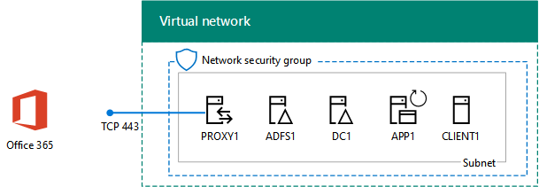

# <a name="federated-identity-for-your-office-365-devtest-environment"></a>Identità federata per l'ambiente di sviluppo/test di Office 365

 **Riepilogo:** Configurare l'autenticazione federata per l'ambiente di sviluppo e di testing di Office 365.
  
Office 365 supporta identità federata. Ciò significa che invece di eseguire la convalida delle credenziali stesso, Office 365 si riferisce utente connesso a un server di autenticazione federativa che considera attendibile Office 365. Se le credenziali dell'utente siano corrette, il server di autenticazione federata emette un token di sicurezza che il client invia quindi a Office 365 come modello di autenticazione. Identità federata consente l'offload e la scalabilità verticale di autenticazione per una sottoscrizione a Office 365 e scenari di autenticazione e la protezione avanzata.
  
In questo articolo viene descritto come è possibile configurare l'autenticazione federata per l'ambiente di sviluppo/test di Office 365, determinando la configurazione seguente:
  
**Nella figura 1: L'autenticazione federata per l'ambiente di sviluppo e di testing di Office 365**


  
La configurazione illustrata nella figura 1 è costituita da:  
  
- Una sottoscrizione di valutazione di Office 365 E5 che scade dopo 30 giorni dalla creazione.
    
- Una rete Intranet dell'organizzazione semplificata connessa a Internet e costituita da cinque macchine virtuali in una sottorete di una rete virtuale Azure (DC1, APP1, CLIENT1, ADFS1 e PROXY1). Azure AD Connect viene eseguito su APP1 per sincronizzare l'elenco di account nel dominio di Windows Server AD con Office 365. PROXY1 riceve le richieste di autenticazione in arrivo. ADFS1 convalida le credenziali con DC1 e rilascia token di sicurezza.
    
Le fasi principali della configurazione dell'ambiente di sviluppo e di testing sono cinque:
  
1. Creare l'ambiente di sviluppo/test di Office 365 aziendale simulato con DirSync.
    
2. Creare il server ADFS (ADFS1).
    
3. Creare il server proxy Web (PROXY1).
    
4. Creare un certificato autofirmato e configurare ADFS1 e PROXY1.
    
5. Configurare Office 365 per l'identità federativa.
    
Al passaggio a una distribuzione di produzione di autenticazione federata per Office 365 in Azure, vedere [Deploy la disponibilità elevata nell'autenticazione federata per Office 365 in Azure](deploy-high-availability-federated-authentication-for-office-365-in-azure.md).
  
> [!NOTE]
> Non è possibile configurare l'ambiente di sviluppo/test con una sottoscrizione di valutazione di Azure. 
  
> [!TIP]
> Fare clic [qui](http://aka.ms/catlgstack) per consultare una mappa di tutti gli articoli relativi alla guida del laboratorio di testing cloud di One Microsoft.
  
## <a name="phase-1-create-the-simulated-enterprise-office-365-devtest-environment-with-dirsync"></a>Fase 1: Creare l'ambiente di sviluppo/test di Office 365 aziendale simulato con DirSync

Seguire le istruzioni in [DirSync per l'ambiente di sviluppo e di testing di Office 365](dirsync-for-your-office-365-dev-test-environment.md) per creare l'ambiente di sviluppo e di testing simulato enterprise di Office 365 con APP1 come server DirSync e identità sincronizzati tra Office 365 e Windows Server Active Directory account in DC1.
  
Successivamente, creare un nuovo nome dominio DNS pubblico basato sul nome del dominio corrente e aggiungerla alla sottoscrizione Office 365. È consigliabile utilizzare il nome **laboratorio di test.** \<il dominio pubblico >. Ad esempio, se il nome del dominio pubblico è contoso.com, aggiungere testlab.contoso.com il nome di dominio pubblico.
  
Per istruzioni su come creare i record DNS corretti nel provider di DNS e aggiungere il dominio per la sottoscrizione di prova di Office 365, vedere [aggiungere utenti e il dominio a Office 365](https://support.office.com/article/Add-users-and-domain-to-Office-365-6383f56d-3d09-4dcb-9b41-b5f5a5efd611). 
  
Di seguito è riportata la configurazione risultante.
  
**Figura 2: DirSync per l'ambiente di sviluppo e di testing di Office 365**


  
Nella figura 2 viene mostrato DirSync per l'ambiente di sviluppo/test di Office 365, che include Office 365 e le macchine virtuali CLIENT1, APP1 e DC1 in una rete virtuale di Azure.
  
## <a name="phase-2-create-the-ad-fs-server"></a>Fase 2: Creare il server AD FS

Un server AD FS fornisce l'autenticazione federata tra Office 365 e gli account nel dominio corp.contoso.com ospitato su DC1.
  
Per creare una macchina virtuale Azure per ADFS1, immettere il nome dell'abbonamento e il gruppo di risorse e il percorso Azure per la configurazione di Base e quindi eseguire questi comandi al prompt dei comandi di Azure PowerShell nel computer locale.
  
```
$subscr="<your Azure subscription name>"
$rgName="<the resource group name of your Base Configuration>"
Login-AzureRMAccount
Get-AzureRmSubscription -SubscriptionName $subscr | Select-AzureRmSubscription
$staticIP="10.0.0.100"
$locName=(Get-AzureRmResourceGroup -Name $rgName).Location
$vnet=Get-AzureRMVirtualNetwork -Name TestLab -ResourceGroupName $rgName
$pip = New-AzureRMPublicIpAddress -Name ADFS1-PIP -ResourceGroupName $rgName -Location $locName -AllocationMethod Dynamic
$nic = New-AzureRMNetworkInterface -Name ADFS1-NIC -ResourceGroupName $rgName -Location $locName -SubnetId $vnet.Subnets[0].Id -PublicIpAddressId $pip.Id -PrivateIpAddress $staticIP
$vm=New-AzureRMVMConfig -VMName ADFS1 -VMSize Standard_D2_v2
$cred=Get-Credential -Message "Type the name and password of the local administrator account for ADFS1."
$vm=Set-AzureRMVMOperatingSystem -VM $vm -Windows -ComputerName ADFS1 -Credential $cred -ProvisionVMAgent -EnableAutoUpdate
$vm=Set-AzureRMVMSourceImage -VM $vm -PublisherName MicrosoftWindowsServer -Offer WindowsServer -Skus 2016-Datacenter -Version "latest"
$vm=Add-AzureRMVMNetworkInterface -VM $vm -Id $nic.Id
$vm=Set-AzureRmVMOSDisk -VM $vm -Name "ADFS-OS" -DiskSizeInGB 128 -CreateOption FromImage -StorageAccountType "StandardLRS"
New-AzureRMVM -ResourceGroupName $rgName -Location $locName -VM $vm
```

> [!TIP]
> Fare clic [qui](https://gallery.technet.microsoft.com/PowerShell-commands-for-f79bc2c2?redir=0) per ottenere un file di testo che contiene tutti i comandi di PowerShell in questo articolo.
  
Successivamente, utilizzare il [portale Azure](http://portal.azure.com) per la connessione alla macchina virtuale ADFS1 utilizzando il nome dell'account amministratore locale ADFS1 e la password e quindi aprire un prompt dei comandi di Windows PowerShell.
  
Per verificare la comunicazione nome di soluzione e di rete tra ADFS1 e DC1, eseguire il comando **ping dc1.corp.contoso.com** e verificare che non vi sono quattro risposte.
  
Unire quindi la macchina virtuale ADFS1 al dominio CORP immettendo questi comandi nel prompt dei comandi di Windows PowerShell in ADFS1.
  
```
$cred=Get-Credential -UserName "CORP\\User1" -Message "Type the User1 account password."
Add-Computer -DomainName corp.contoso.com -Credential $cred
Restart-Computer
```

Di seguito è riportata la configurazione risultante.
  
**Figura 3: Aggiunta di server AD FS**


  
Nella figura 3 viene mostrata l'aggiunta del server ADFS1 a DirSync per l'ambiente di sviluppo/test di Office 365.
  
## <a name="phase-3-create-the-web-proxy-server"></a>Fase 3: Creare il server proxy Web

PROXY1 consente l'inoltro dei messaggi di autenticazione tra gli utenti e ADFS1.
  
Per creare una macchina virtuale Azure per PROXY1, inserire il nome del gruppo di risorse e la posizione di Azure, quindi eseguire questi comandi al prompt dei comandi di Azure PowerShell nel computer locale.
  
```
$rgName="<the resource group name of your Base Configuration>"
$staticIP="10.0.0.101"
$locName=(Get-AzureRmResourceGroup -Name $rgName).Location
$vnet=Get-AzureRMVirtualNetwork -Name TestLab -ResourceGroupName $rgName
$pip = New-AzureRMPublicIpAddress -Name PROXY1-PIP -ResourceGroupName $rgName -Location $locName -AllocationMethod Static
$nic = New-AzureRMNetworkInterface -Name PROXY1-NIC -ResourceGroupName $rgName -Location $locName -SubnetId $vnet.Subnets[0].Id -PublicIpAddressId $pip.Id -PrivateIpAddress $staticIP
$vm=New-AzureRMVMConfig -VMName PROXY1 -VMSize Standard_D2_v2
$cred=Get-Credential -Message "Type the name and password of the local administrator account for PROXY1."
$vm=Set-AzureRMVMOperatingSystem -VM $vm -Windows -ComputerName PROXY1 -Credential $cred -ProvisionVMAgent -EnableAutoUpdate
$vm=Set-AzureRMVMSourceImage -VM $vm -PublisherName MicrosoftWindowsServer -Offer WindowsServer -Skus 2016-Datacenter -Version "latest"
$vm=Add-AzureRMVMNetworkInterface -VM $vm -Id $nic.Id
$vm=Set-AzureRmVMOSDisk -VM $vm -Name "PROXY1-OS" -DiskSizeInGB 128 -CreateOption FromImage -StorageAccountType "StandardLRS"
New-AzureRMVM -ResourceGroupName $rgName -Location $locName -VM $vm
```

> [!NOTE]
> A PROXY1 viene assegnato un indirizzo IP pubblico statico perché verrà creato un record DNS pubblico che punta a esso e non deve essere modificato quando si riavvia la macchina virtuale PROXY1. 
  
Aggiungere una regola per il gruppo di protezione di rete per la subnet CorpNet per consentire il traffico in ingresso da Internet alla porta TCP 443 e indirizzi IP privati del PROXY1. Eseguire questi comandi al prompt dei comandi di Azure PowerShell nel computer locale.
  
```
$rgName="<the resource group name of your Base Configuration>"
Get-AzureRmNetworkSecurityGroup -Name CorpNet -ResourceGroupName $rgName | Add-AzureRmNetworkSecurityRuleConfig -Name "HTTPS-to-PROXY1" -Description "Allow TCP 443 to PROXY1" -Access "Allow" -Protocol "Tcp" -Direction "Inbound" -Priority 101 -SourceAddressPrefix "Internet" -SourcePortRange "*" -DestinationAddressPrefix "10.0.0.101" -DestinationPortRange "443" | Set-AzureRmNetworkSecurityGroup
```

Successivamente, utilizzare il [portale Azure](http://portal.azure.com) per la connessione alla macchina virtuale PROXY1 utilizzando il nome dell'account amministratore locale PROXY1 e la password e quindi aprire un prompt dei comandi di Windows PowerShell in PROXY1.
  
Per verificare la comunicazione nome di soluzione e di rete tra PROXY1 e DC1, eseguire il comando **ping dc1.corp.contoso.com** e verificare che non vi sono quattro risposte.
  
Unire quindi la macchina virtuale PROXY1 al dominio CORP immettendo questi comandi nel prompt dei comandi di Windows PowerShell in PROXY1.
  
```
$cred=Get-Credential -UserName "CORP\\User1" -Message "Type the User1 account password."
Add-Computer -DomainName corp.contoso.com -Credential $cred
Restart-Computer
```

Visualizzare l'indirizzo IP pubblico di PROXY1 con questi comandi PowerShell di Azure nel computer locale:
  
```
Write-Host (Get-AzureRMPublicIpaddress -Name "PROXY1-PIP" -ResourceGroup $rgName).IPAddress
```

Successivamente, utilizzare i provider DNS pubblico e creare un nuovo record A DNS pubblico per **fs.testlab.** \<il nome di dominio DNS > che viene risolto nell'indirizzo IP visualizzato dal comando di **Write-Host** . Il **fs.testlab.** \<il nome di dominio DNS > verrà indicato di seguito come *servizio federativo FQDN* .
  
Successivamente, utilizzare il [portale Azure](http://portal.azure.com) per la connessione alla macchina virtuale DC1 utilizzando il CORP\\User1 credenziali e quindi eseguire le operazioni seguenti comandi al prompt dei comandi di Windows PowerShell livello di amministratore:
  
```
$testZone="<the FQDN of your testlab domain from phase 1, example: testlab.contoso.com>"
$testZoneFile= $testZone + ".dns"
Add-DnsServerPrimaryZone -Name $testZone -ZoneFile $testZoneFile
Add-DnsServerResourceRecordA -Name "fs" -ZoneName $testZone -AllowUpdateAny -IPv4Address "10.0.0.100" -TimeToLive 01:00:00
```

Tali comandi consentono di creare un record A DNS per il nome di dominio completo del servizio federativo che le macchine virtuali nella rete virtuale di Azure possono risolvere nell'indirizzo IP privato di ADFS1.
  
Di seguito è riportata la configurazione risultante.
  
**Figura 4: Aggiunta di server proxy dell'applicazione web**


  
Nella figura 4 viene mostrata l'aggiunta del server PROXY1.
  
## <a name="phase-4-create-a-self-signed-certificate-and-configure-adfs1-and-proxy1"></a>Fase 4: Creare un certificato autofirmato e configurare ADFS1 e PROXY1

In questa fase, viene creato un certificato digitale autofirmato per il nome di dominio completo del servizio federativo e vengono configurati ADFS1 e PROXY1 come farm AD FS.
  
Innanzitutto, utilizzare il [portale Azure](http://portal.azure.com) per la connessione alla macchina virtuale DC1 utilizzando il CORP\\User1 credenziali e quindi aprire un livello di amministratore di Windows PowerShell Prompt dei comandi.
  
Successivamente, creare un account del servizio AD FS con questo comando al prompt dei comandi di Windows PowerShell in DC1:
  
```
New-ADUser -SamAccountName ADFS-Service -AccountPassword (read-host "Set user password" -assecurestring) -name "ADFS-Service" -enabled $true -PasswordNeverExpires $true -ChangePasswordAtLogon $false
```

Tenere presente che questo comando chiede di specificare la password dell'account. Scegliere una password complessa e annotarla in una posizione sicura. Sarà necessaria per questa e la fase successiva.
  
Utilizzare il [portale Azure](http://portal.azure.com) per la connessione alla macchina virtuale ADFS1 utilizzando il CORP\\credenziali User1. Aprire un prompt dei comandi di Windows PowerShell a livello di amministratore in ADFS1, immettere il servizio federativo FQDN e quindi eseguire i comandi seguenti per creare un certificato autofirmato:
  
```
$fedServiceFQDN="<federation service FQDN>"
New-SelfSignedCertificate -DnsName $fedServiceFQDN -CertStoreLocation "cert:\\LocalMachine\\My"
New-Item -path c:\\Certs -type directory
New-SmbShare -name Certs -path c:\\Certs -changeaccess CORP\\User1
```

Successivamente, seguire questi passaggi per salvare il nuovo certificato autofirmato come file.
  
1. Fare clic su **Start**, digitare **mmc.exe**. exe e quindi premere **INVIO**.
    
2. Fare clic su **File > Aggiungi/Rimuovi Snap-in**.
    
3. In **Aggiungi o Rimuovi Snap-in**, fare doppio clic su **certificati** nell'elenco degli snap-in disponibili, fare clic su **account del Computer**e quindi fare clic su **Avanti**.
    
4. In **Seleziona Computer**, fare clic su **Fine**e quindi fare clic su **OK**.
    
5. Nel riquadro dell'albero, aprire **certificati (Computer locale) > personale > certificati**.
    
6. Fare clic con il servizio federativo nome di dominio completo del certificato, fare clic su **tutte le attività**e quindi fare clic su **Esporta**.
    
7. Nella pagina di **benvenuto** fare clic su **Avanti**.
    
8. Nella pagina **Esportazione della chiave privata** , fare clic su **Sì**e quindi fare clic su **Avanti**.
    
9. Nella pagina **Formato File di esportazione** fare clic su **Esporta tutte le proprietà estese**e quindi fare clic su **Avanti**.
    
10. Nella pagina **sicurezza** fare clic su **Password** e digitare una password nella **casella Password** e **Conferma password.**
    
11. Nella pagina **File da esportare** , fare clic su **Sfoglia**.
    
12. Individuare il **c:\\certificati** cartella, digitare **SSL** nella **casella Nome File**e quindi fare clic su **salvare.**
    
13. Nella pagina **File da esportare** , fare clic su **Avanti**.
    
14. Nella pagina **completamento dell'esportazione guidata certificati** fare clic su **Fine**. Quando richiesto, fare clic su **OK**.
    
Successivamente, installare il servizio AD FS con questo comando al prompt dei comandi di Windows PowerShell in ADFS1:
  
```
Install-WindowsFeature ADFS-Federation -IncludeManagementTools
```

Attendere che venga stabilita la connessione.
  
Successivamente, configurare il servizio AD FS seguendo questi passaggi:
  
1. Fare clic su **Start**e quindi fare clic sull'icona **Server Manager** .
    
2. Nel riquadro dell'albero di Server Manager, fare clic su **AD FS**.
    
3. Nella barra degli strumenti nella parte superiore, fare clic sul simbolo attenzione arancione e quindi fare clic su **Configura il servizio federativo nel server**.
    
4. Nella pagina **iniziale** della configurazione guidata servizi di federazione Active Directory fare clic su **Avanti**.
    
5. Nella pagina **connessione al dominio Active Directory** , fare clic su **Avanti**.
    
6. Nella pagina **Specificare le proprietà del servizio** :
    
  - **Certificato SSL**, fare clic sulla freccia e quindi fare clic sul certificato con il nome del servizio federativo FQDN.
    
  - In **Nome visualizzato del servizio federativo**, digitare il nome della società fittizia.
    
  - Fare clic su **Avanti**.
    
7. Nella pagina **Specifica Account di servizio** fare clic su **Seleziona** per **nome dell'Account**.
    
8. In **Seleziona utente o Account di servizio**, digitare **Servizio di ADFS**, fare clic su **Controlla nomi**e quindi fare clic su **OK**.
    
9. Nella casella **Password dell'Account**, digitare la password per l'account del servizio ADFS e quindi fare clic su **Avanti**.
    
10. Nella pagina **Specificare Database di configurazione** , fare clic su **Avanti**.
    
11. Nella pagina **Opzioni di revisione** , fare clic su **Avanti**.
    
12. Nella pagina **Controlla prerequisito** fare clic su **Configura**.
    
13. Nella pagina **dei risultati** , fare clic su **Chiudi**.
    
14. Fare clic su **Start**, fare clic sull'icona dell'alimentazione, fare clic su **Riavvia**e quindi fare clic su **Continua**.
    
Dal [portale di Azure](http://portal.azure.com), connettersi al PROXY1 con la CORP\\le credenziali dell'account User1.
  
Successivamente, seguire questi passaggi per installare il certificato autofirmato e configurare PROXY1.
  
1. Fare clic su **Start**, digitare **mmc.exe**. exe e quindi premere **INVIO**.
    
2. Fare clic su **File > Aggiungi/Rimuovi Snap-in**.
    
3. In **Aggiungi o Rimuovi Snap-in**, fare doppio clic su **certificati** nell'elenco degli snap-in disponibili, fare clic su **account del Computer**e quindi fare clic su **Avanti**.
    
4. In **Seleziona Computer**, fare clic su **Fine**e quindi fare clic su **OK**.
    
5. Nel riquadro dell'albero, aprire **certificati (Computer locale) > personale > certificati**.
    
6. Destro **personale**, scegliere **tutte le attività**e quindi fare clic su **Importa**.
    
7. Nella pagina di **benvenuto** fare clic su **Avanti**.
    
8. Nella pagina **File da importare** , digitare ** \\ \\adfs1\\certificati\\ssl.pfx**e quindi fare clic su **Avanti**.
    
9. Nella pagina **protezione della chiave privata** , digitare la password del certificato nella **casella Password**, quindi scegliere **successivo.**
    
10. Nella pagina **archivio certificati** fare clic su **successivo.**
    
11. Nella pagina **completamento** , fare clic su **Fine**.
    
12. Nella pagina **Archivio certificati** fare clic su **Avanti**.
    
13. Quando richiesto, fare clic su **OK**.
    
14. Nel riquadro dell'albero, fare clic su **certificati** .
    
15. Destro del mouse sul certificato e quindi fare clic su **Copia**.
    
16. Nel riquadro dell'albero, aprire **autorità di certificazione radice attendibili > certificati**.
    
17. Spostare il puntatore del mouse sotto l'elenco di certificati installati, pulsante destro del mouse e quindi fare clic su **Incolla**.
    
Aprire un prompt dei comandi PowerShell a livello di amministratore ed eseguire il comando seguente:
  
```
Install-WindowsFeature Web-Application-Proxy -IncludeManagementTools
```

Attendere che venga stabilita la connessione.
  
Seguire questi passaggi per configurare il servizio proxy dell'applicazione Web in modo da utilizzare ADFS1 come server federativo:
  
1. Fare clic su **Start**e quindi fare clic su **Server Manager**.
    
2. Nel riquadro della struttura ad albero fare clic su **Accesso remoto**.
    
3. Nella barra degli strumenti nella parte superiore, fare clic sul simbolo attenzione arancione e quindi **aprire la procedura guidata Proxy di applicazione Web**.
    
4. Nella pagina **iniziale** della procedura guidata configurazione Proxy applicazione Web, fare clic su **Avanti**.
    
5. Nella pagina **Server federativo** :
    
  - Digitare il nome di dominio completo di servizio federativo nel **nome del servizio federativo**.
    
  - Tipo **CORP\\User1** nella **casella nome utente**.
    
  - Nella **casella Password**, digitare la password per l'account User1.
    
  - Fare clic su **Avanti**.
    
6. Nella pagina **Certificato Proxy ADFS** , fare clic sulla freccia in giù, fare clic sul certificato con il servizio federativo FQDN e quindi fare clic su **Avanti**.
    
7. Nella pagina di **Conferma** fare clic su **Configura**.
    
8. Nella pagina **dei risultati** , fare clic su **Chiudi**.
    
## <a name="phase-5-configure-office-365-for-federated-identity"></a>Fase 5: Configurare Office 365 per l'identità federativa

Utilizzare il [portale Azure](http://portal.azure.com) per la connessione alla macchina virtuale APP1 con la CORP\\le credenziali dell'account User1.
  
Attenersi a questa procedura per configurare Azure AD Connect e l'abbonamento a Office 365 per l'autenticazione federata:
  
1. Dal desktop e fare doppio clic su **Connetti Azure Active Directory**.
    
2. Nella pagina di **benvenuto Connetti Azure Active Directory** fare clic su **Configura**.
    
3. Nella pagina **attività aggiuntive** , fare clic su **Cambia utente Accedi -**e quindi fare clic su **Avanti**.
    
4. Nella pagina **connessione a Azure Active Directory** , digitare il nome di account amministratore globale di Office 365 e la password e quindi fare clic su **Avanti**.
    
5. Nella pagina **Accesso utente**, fare clic su **Federazione tramite ADFS**, quindi fare clic su **Avanti**.
    
6. Nella pagina **farm ADFS** , fare clic su **Usa una farm ADFS esistente**, digitare **ADFS1** nella **Casella Nome Server**e quindi fare clic su **Avanti**.
    
7. Quando richiesto per le credenziali del server, immettere le credenziali del CORP\\User1 per gli account e quindi fare clic su **OK**.
    
8. Nella pagina credenziali di **Amministratore di dominio** , digitare **CORP\\User1** in **nome utente** e la password dell'account nella casella **Password**, quindi scegliere **Avanti**.
    
9. Nella pagina **account del servizio di ADFS** , digitare **CORP\\servizio ADFS** in **Nome utente di dominio** e la password dell'account nella casella **Password dell'utente di dominio**, quindi scegliere **Avanti**.
    
10. Nella pagina **Azure Active Directory dominio** nel **dominio**, selezionare il nome del dominio precedentemente creato e aggiunto alla sottoscrizione Office 365 nella fase 1 e quindi fare clic su **Avanti**.
    
11. Nella pagina **pronto per la configurazione** , fare clic su **Configura**.
    
12. Nella pagina **Installazione completata** fare clic su **verifica**.
    
    Verranno visualizzati messaggi che confermano la corretta configurazione Internet e Intranet.
    
13. Nella pagina **Installazione completata**, fare clic su **Chiudi**.
    
Per verificare il funzionamento dell'autenticazione federata, eseguire le operazioni seguenti:
  
1. Aprire una nuova istanza del browser nel computer locale privata e passare a [https://portal.office.com](https://portal.office.com).
    
2. Per le credenziali di accesso, digitare **utente1 @**\<il dominio creato nella fase 1 >. 
    
    Ad esempio, se il dominio di test è **testlab.contoso.com**, digitare **user1@testlab.contoso.com**. Premere TAB o consentire automaticamente reindirizzato di Office 365.
    
    Verrà ora visualizzato una pagina **di una connessione su non privata** . Viene visualizzato questo perché è stato installato un certificato autofirmato in ADFS1 che è Impossibile convalidare il computer desktop. In una distribuzione di produzione di autenticazione federata, è necessario utilizzare un certificato rilasciato da un'autorità di certificazione attendibile e gli utenti non verrebbero visualizzato in questa pagina.
    
3. Nella pagina **la connessione è non privata** fare clic su **Avanzate**e quindi fare clic su **passare alla sezione \<il servizio federativo FQDN >**. 
    
4. Nella pagina con il nome dell'organizzazione fittizia accedere con le seguenti credenziali:
    
  - **CORP\\User1** per il nome
    
  - La password per l'account User1
    
    Verrà visualizzata la pagina **Microsoft Office Home** .
    
Questa procedura viene illustrato che la sottoscrizione di prova di Office 365 è federata con il dominio corp.contoso.com Windows Server Active Directory ospitato su DC1. Di seguito sono i concetti di base del processo di autenticazione:
  
1. Quando si utilizza il dominio federato creato nella fase 1 all'interno del nome dell'account di accesso, Office 365 reindirizza il browser al nome di dominio completo del servizio federativo e PROXY1.
    
2. PROXY1 invia al computer locale la pagina di accesso della società fittizia.
    
3. Quando si invia CORP\\User1 e la password da PROXY1, li inoltra a ADFS1.
    
4. ADFS1 convalida CORP\\User1 e la password con DC1 e riceve un token di sicurezza del computer locale.
    
5. Il computer locale invia il token di sicurezza a Office 365.
    
6. Office 365 verifica che il token di sicurezza è stato creato da ADFS1 e consente l'accesso.
    
La sottoscrizione di valutazione di Office 365 è ora configurata con l'autenticazione federata. È possibile utilizzare questo ambiente di sviluppo/test per scenari di autenticazione avanzata.
  
## <a name="next-step"></a>Passaggio successivo

Quando si è pronti per la distribuzione di produzione pronto, l'autenticazione federata di disponibilità elevata per Office 365 in Azure, vedere [Deploy la disponibilità elevata nell'autenticazione federata per Office 365 in Azure](deploy-high-availability-federated-authentication-for-office-365-in-azure.md).
  
## <a name="see-also"></a>See Also

[Test Lab Guide (TLG) di adozione cloud](cloud-adoption-test-lab-guides-tlgs.md)
  
[Ambiente di sviluppo/test della configurazione di base](base-configuration-dev-test-environment.md)
  
[Ambiente di sviluppo/test di Office 365](office-365-dev-test-environment.md)
  
[Adozione del cloud e soluzioni ibride](cloud-adoption-and-hybrid-solutions.md)
  
[Distribuire l'autenticazione federata ad alta visibilità per Office 365 in Azure](deploy-high-availability-federated-authentication-for-office-365-in-azure.md)


