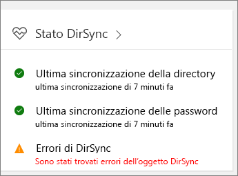

# Risoluzione dei problemi di sincronizzazione della directory per Office 365Fixing problems with directory synchronization for Office 365

Con la sincronizzazione della directory, puoi continuare a gestire gli utenti e gruppi locali e sincronizzare aggiunte, eliminazioni e modifiche nel cloud.With directory synchronization, you can continue to manage users and groups on-premises and synchronize additions, deletions, and changes to the cloud. Tuttavia, la configurazione è un po' complicata e a volte può essere difficile identificare l'origine dei problemi.But setup is a little complicated and it can sometimes be difficult to identify the source of problems. Sono disponibili risorse per consentire di individuare e risolvere potenziali problemi.We have resources to help you hunt down potential issues and fix them.
  
## Come si fa a sapere se si è verificato un problema?How do I know if something is wrong?

La prima segnalazione di un problema viene visualizzata nel riquadro Stato DirSync dell'interfaccia di amministrazione di Microsoft 365:The first indication that something is wrong is when the DirSync Status tile in the Microsoft 365 admin center indicates there is a problem:
  

  
Office 365 invia anche un messaggio di posta elettronica, all'indirizzo di posta elettronica alternativo e a quello di amministrazione, per segnalare che nel tenant si sono verificati errori di sincronizzazione della directory.You will also receive a mail (to the alternate email and to your admin email) from Office 365 that indicates your tenant has encountered directory synchronization errors. Per informazioni dettagliate, vedere [Identificare gli errori di sincronizzazione della directory in Office 365](identify-directory-synchronization-errors.md).[Identify directory synchronization errors in Office 365](identify-directory-synchronization-errors.md)
  
## Come si ottiene lo strumento Azure Active Directory Connect?How do I get Azure Active Directory Connect tool?

Nell'[interfaccia di amministrazione di Microsoft 365](https://admin.microsoft.com), passare a \*\* Utenti \*\* \> **Utenti attivi**.In the [Microsoft 365 admin center](https://admin.microsoft.com), navigate to \*\* Users \*\* \> **Active users**. Fare clic sul menu **Altro** e scegliere **Sincronizzazione della directory**.Click the **More** menu and select **Directory synchronization**. 
  

  
Seguire le [istruzioni della procedura guidata](set-up-directory-synchronization.md) per scaricare Azure AD Connect.Follow the [instructions in the wizard](set-up-directory-synchronization.md) to download Azure AD Connect. 
  
Se si usa ancora Azure Active Directory Sync (DirSync), vedere [Come risolvere i problemi di installazione dello strumento di sincronizzazione di Azure Active Directory e i messaggi di errore della Configurazione guidata in Office 365](https://go.microsoft.com/fwlink/p/?LinkId=396717) per informazioni sui requisiti di sistema per l'installazione di DirSync, sulle autorizzazioni necessarie e sulla risoluzione dei problemi comuni.Take a look at  How to troubleshoot Azure Active Directory Sync Tool installation and Configuration Wizard error messages in Office 365 http://go.microsoft.com/fwlink/p/?LinkId=396717  for information about the system requirements to install WindowsAzureActiveDirectorySyncTool, the permissions you need, and how to troubleshoot common errors. 
  
Per eseguire l'aggiornamento da Azure Active Directory Sync ad Azure AD Connect, vedere le [istruzioni di aggiornamento](https://go.microsoft.com/fwlink/p/?LinkId=733240).To update from Azure Active Directory Sync to Azure AD Connect, see [the upgrade instructions](https://go.microsoft.com/fwlink/p/?LinkId=733240).
  
## Risoluzione delle cause comuni dei problemi relativi alla sincronizzazione delle directory in Office 365Common causes of problems with directory synchronization in Office 365

### **Gli oggetti sincronizzati non vengono visualizzati o aggiornati online oppure si riceve un errore di sincronizzazione dal servizio.****Synchronized objects aren't appearing or updating online, or I'm getting synchronization error reports from the Service.**

- [Sincronizzazione delle identità e resilienza degli attributi duplicatiIdentity synchronization and duplicate attribute resiliency](https://docs.microsoft.com/azure/active-directory/hybrid/how-to-connect-syncservice-duplicate-attribute-resiliency)

### **Nell'interfaccia di amministrazione è presente un avviso oppure si ricevono messaggi di posta elettronica automatici che informano che non ci sono stati eventi di sincronizzazione recenti****I have an alert in the admin center, or am receiving automated emails that there hasn't been a recent synchronization event**
- [Risolvere i problemi di connettività con Azure AD ConnectTroubleshoot connectivity issues with Azure AD Connect](https://docs.microsoft.com/azure/active-directory/hybrid/tshoot-connect-connectivity)
- [Azure AD Connect: account e autorizzazioniAzure AD Connect Accounts and permissions](https://go.microsoft.com/fwlink/p/?LinkId=820598)
- [Servizio di sincronizzazione Azure AD Connect: come gestire l'account del servizio Azure Active DirectoryAzure AD Connect sync: How to manage the Azure AD service account](https://docs.microsoft.com/azure/active-directory/hybrid/how-to-connect-azureadaccount)
- [La sincronizzazione della directory in Azure Active Directory viene interrotta oppure viene visualizzato un avviso che indica che la sincronizzazione non è stata registrata per più di un giornoDirectory synchronization to Azure Active Directory stops or you're warned that sync hasn't registered in more than a day](https://support.microsoft.com/help/2882421/directory-synchronization-to-azure-active-directory-stops-or-you-re-warned-that-sync-hasn-t-registered-in-more-than-a-day)

### **Gli hash delle password non vengono sincronizzati oppure nell'interfaccia di amministrazione è presente un avviso che informa che di recente non è stata eseguita la sincronizzazione degli hash delle password****Password hashes aren't synchronizing, or I'm seeing an alert in the admin center that there hasn't been a recent password hash synchronization**
- [Implementazione della sincronizzazione dell'hash delle password con la sincronizzazione di Azure AD Connect](https://docs.microsoft.com/azure/active-directory/hybrid/how-to-connect-password-hash-synchronization)For more information, see [Implement password hash synchronization with Azure AD Connect sync](https://docs.microsoft.com/azure/active-directory/hybrid/how-to-connect-password-hash-synchronization).

### **Viene visualizzato un avviso relativo al superamento della quota per gli oggetti****I'm seeing an alert that Object quota exceeded**
- Per proteggere il servizio, è prevista una quota predefinita per gli oggetti.We have a built-in object quota to help protect the service. Se la directory contiene troppi oggetti da sincronizzare con Office 365, per aumentare la quota, è necessario [contattare il supporto per i prodotti per le aziende](https://support.office.com/article/32a17ca7-6fa0-4870-8a8d-e25ba4ccfd4b).If you have too many objects in your directory that need to sync to Office 365, you’ll have to contact Support to increase your quota.

### **Si desidera sapere quali attributi sono sincronizzati****I need to know which attributes are synchronized**
- L'elenco di tutti gli attributi sincronizzati tra l'ambiente locale e il cloud è disponibile [qui](https://go.microsoft.com/fwlink/p/?LinkId=396719).You can find a list of all the attributes that are synced between on-premises and the cloud [right herehttp://go.microsoft.com/fwlink/p/?LinkId=396719](https://go.microsoft.com/fwlink/p/?LinkId=396719).

### **Non è possibile gestire o rimuovere oggetti sincronizzati con il cloud****I can’t manage or remove objects that were synced to the cloud**
- Sei pronto a gestire gli oggetti solo nel cloud?Are you ready to manage objects in the cloud only? Oppure c'è un oggetto che è stato eliminato in locale, ma è bloccato nel cloud?Or is there an object that was deleted on-premises, but is stuck in the cloud? Per indicazioni su come risolvere questi problemi, vedere [Risoluzione degli problemi durante la sincronizzazione](https://go.microsoft.com/fwlink/p/?linkid=842044) e l'[articolo del supporto](https://go.microsoft.com/fwlink/p/?LinkId=396720).Take a look at this [Troubleshooting Errors during synchronization](https://go.microsoft.com/fwlink/p/?linkid=842044) and [support article](https://go.microsoft.com/fwlink/p/?LinkId=396720) for guidance on how to resolve these issues.

### **Si è ricevuto un messaggio di errore che indica che è stato superato il numero di oggetti che è possibile sincronizzare****I got an error message that my company has exceeded the number of objects that can be synchronized**
- Altre informazioni su questo problema sono disponibili [qui](https://go.microsoft.com/fwlink/p/?LinkId=396721).You can read more about this issue [here](https://go.microsoft.com/fwlink/p/?LinkId=396721).
   
## Altre risorseOther resources

- [Script per correggere i nomi dell'entità utente duplicatiScript to fix duplicate user principal names](https://go.microsoft.com/fwlink/p/?LinkId=396725)
    
- [Come preparare un dominio non instradabile, ad esempio un dominio .local, per la sincronizzazione della directoryHow to prepare a non-routable domain for directory synchronization](prepare-a-non-routable-domain-for-directory-synchronization.md)
    
- [Script per il conteggio degli oggetti sincronizzatiScript to count total synchronized objectshttp://go.microsoft.com/fwlink/p/?LinkId=396726](https://go.microsoft.com/fwlink/p/?LinkId=396726)
    
- [Risoluzione dei problemi di AD FS 2.0AD FS 2.0](https://go.microsoft.com/fwlink/p/?LinkId=396727)
    
- [Usare PowerShell per risolvere il problema degli attributi DisplayName vuoti per i gruppi abilitati alla posta elettronicaUse PowerShell to fix empty DisplayName attributes for mail-enabled groups](https://go.microsoft.com/fwlink/p/?LinkId=396728)
    
- [Usare PowerShell per correggere i nomi dell'entità utente duplicatiHow to use PowerShell to fix duplicate UPN](https://go.microsoft.com/fwlink/p/?LinkId=396730)
    
- [Usare PowerShell per correggere gli indirizzi di posta elettronica duplicatiUse PowerShell to fix duplicate email addresseshttp://go.microsoft.com/fwlink/p/?LinkId=396731](https://go.microsoft.com/fwlink/p/?LinkId=396731)
    
## Strumenti di diagnosticaDiagnostic tools

Lo [strumento IDFix](prepare-directory-attributes-for-synch-with-idfix.md) viene usato per l'individuazione e la correzione di oggetti identità e dei relativi attributi in un ambiente Active Directory locale per la preparazione della migrazione a Office 365.IdFix is used to perform discovery and remediation of identity objects and their attributes in an on-premises Active Directory environment in preparation for migration to Office 365. IDFix è destinato agli amministratori di Active Directory responsabili dell'esecuzione di DirSync con il servizio di Office 365.IdFix is intended for the Active Directory administrators responsible for DirSync with the Office 365 service. 

[Scaricare lo strumento IDFix](https://go.microsoft.com/fwlink/p/?LinkId=396718) dall'Area download Microsoft.[Download the IDFix toolhttp://go.microsoft.com/fwlink/p/?LinkId=396718](https://go.microsoft.com/fwlink/p/?LinkId=396718) from the Microsoft download center.