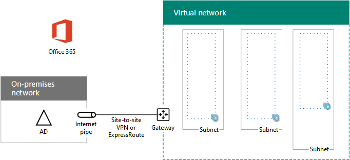

# <a name="high-availability-federated-authentication-phase-1-configure-azure"></a>Fase 1 dell'autenticazione federata a disponibilità elevata: Configurare Azure

 **Riepilogo:** Configurare l'infrastruttura Microsoft Azure per l'autenticazione di disponibilità elevata federate host per Office 365.
  
In questa fase, verrà creato i gruppi di risorse, set di rete (VNet) e la disponibilità virtuali di Azure che ospiterà le macchine virtuali in fasi 2, 3 e 4. È necessario completare prima di spostare in questa fase [la disponibilità elevata federati autenticazione fase 2: configurare i controller di dominio](high-availability-federated-authentication-phase-2-configure-domain-controllers.md). Per tutte le fasi, vedere [Deploy la disponibilità elevata nell'autenticazione federata per Office 365 in Azure](deploy-high-availability-federated-authentication-for-office-365-in-azure.md) .
  
Deve essere fornite da Azure con componenti di base seguenti:
  
- Gruppi di risorse
    
- Una rete virtuale (VNet) Azure cross-premise con subnet per ospitare le macchine virtuali di Azure
    
- Gruppi di sicurezza di rete per l'esecuzione dell'isolamento delle subnet
    
- Set di disponibilità
    
## <a name="configure-azure-components"></a>Configurare i componenti di Azure

Prima di iniziare la configurazione dei componenti Azure, del riempimento nelle tabelle seguenti. Per facilitare le procedure per la configurazione di Azure, in questa sezione di stampa e prendere nota delle informazioni necessarie o copiare in questa sezione di un documento e completare. Per le impostazioni del VNet, compilare tabella V.
  
|**Elemento**|**Impostazione di configurazione**|**Descrizione**|**Valore**|
|:-----|:-----|:-----|:-----|
|1.  <br/> |Nome VNet  <br/> |Un nome da assegnare alla VNet (ad esempio, FedAuthNet).  <br/> |  <br/> |
|2.  <br/> |Percorso VNet  <br/> |Data center di Azure regionale che conterrà la rete virtuale.  <br/> |  <br/> |
|3.  <br/> |Indirizzo IP del dispositivo VPN  <br/> |L'indirizzo IPv4 pubblico dell'interfaccia del dispositivo VPN su Internet.   <br/> |  <br/> |
|4.  <br/> |Spazio di indirizzi della VNet  <br/> |Lo spazio di indirizzi della rete virtuale. Consultare il proprio reparto IT per determinare tale spazio di indirizzi.  <br/> |  <br/> |
|5.  <br/> |Chiave condivisa IPsec  <br/> |32 caratteri alfanumerici casuale stringa che verrà utilizzata per autenticare entrambi i lati della connessione VPN da sito. Lavorare con le IT o un reparto di sicurezza per determinare il valore della chiave. In alternativa, vedere [creazione di una stringa casuale per una chiave già condivisa IPsec](http://social.technet.microsoft.com/wiki/contents/articles/32330.create-a-random-string-for-an-ipsec-preshared-key.aspx).<br/> |  <br/> |
   
 **Tabella V: configurazione di una rete virtuale cross-premise**
  
Successivamente, compilare la tabella S per le subnet della soluzione. Tutti gli spazi di indirizzi devono essere in formato CIDR (Classless Interdomain Routing), noto anche come formato del prefisso di rete. Ad esempio, 10.24.64.0/20.
  
Per le prime tre subnet, specificare un nome e un singolo spazio di indirizzi IP in base allo spazio di indirizzi di rete virtuale. Per la prima subnet del gateway, determinare lo spazio di indirizzi a 27 bit (con una lunghezza del prefisso di /27) per la subnet del gateway di Azure con quanto segue:
  
1. Impostare i bit variabili nello spazio di indirizzi della VNet su 1, fino ai bit utilizzati dalla subnet del gateway, quindi impostare i bit rimanenti su 0.
    
2. Convertire i bit risultanti in formato decimale ed esprimerli come spazio di indirizzi con la lunghezza del prefisso impostata sulle dimensioni della subnet del gateway.
    
Per un blocco di comandi di PowerShell e applicazione console c# o Python utilizzato per eseguire tale calcolo automaticamente, vedere [la calcolatrice spazio indirizzo per le subnet gateway Azure](https://gallery.technet.microsoft.com/scriptcenter/Address-prefix-calculator-a94b6eed) .
  
Consultare il reparto IT per determinare tali spazi di indirizzi in base allo spazio di indirizzi della rete virtuale.
  
|**Elemento**|**Nome della subnet**|**Spazio di indirizzi della subnet**|**Scopo**|
|:-----|:-----|:-----|:-----|
|1.  <br/> |  <br/> |  <br/> |La subnet utilizzata dal controller di dominio Windows Server Active Directory (AD) e le macchine virtuali (VMs) del server DirSync.  <br/> |
|2.  <br/> |  <br/> |  <br/> |La subnet utilizzata dalle macchine virtuali di AD FS.  <br/> |
|3.  <br/> |  <br/> |  <br/> |La subnet utilizzata dalle macchine virtuali del proxy di applicazione Web.  <br/> |
|4.  <br/> |GatewaySubnet  <br/> |  <br/> |La subnet utilizzata dalle macchine virtuali del gateway di Azure.  <br/> |
   
 **Tabella S: subnet nella rete virtuale**
  
Successivamente, compilare la tabella I per gli indirizzi IP statici assegnati alle macchine virtuali e alle istanze del bilanciamento del carico.
  
|**Elemento**|**Scopo**|**Indirizzo IP della subnet**|**Valore**|
|:-----|:-----|:-----|:-----|
|1.  <br/> |Indirizzo IP statico del primo controller di dominio  <br/> |Il quarto indirizzo IP possibile per lo spazio di indirizzi della subnet definito alla voce 1 della tabella S.  <br/> |  <br/> |
|2.  <br/> |Indirizzo IP statico del secondo controller di dominio  <br/> |Il quinto indirizzo IP possibile per lo spazio di indirizzi della subnet definito alla voce 1 della tabella S.  <br/> |  <br/> |
|3.  <br/> |Indirizzo IP statico del server DirSync  <br/> |Il sesto indirizzo IP possibile per lo spazio di indirizzi della subnet definito alla voce 1 della tabella S.   <br/> |  <br/> |
|4.  <br/> |Indirizzo IP statico del bilanciamento del carico interno per i server AD FS  <br/> |Il quarto indirizzo IP possibile per lo spazio di indirizzi della subnet definito alla voce 2 della tabella S.   <br/> |  <br/> |
|5.  <br/> |Indirizzo IP statico del primo server AD FS  <br/> |Il quinto indirizzo IP possibile per lo spazio di indirizzi della subnet definito alla voce 2 della tabella S.  <br/> |  <br/> |
|6.  <br/> |Indirizzo IP statico del secondo server AD FS  <br/> |Il sesto indirizzo IP possibile per lo spazio di indirizzi della subnet definito alla voce 2 della tabella S.  <br/> |  <br/> |
|7.  <br/> |Indirizzo IP statico del primo server proxy dell'applicazione Web  <br/> |Il quarto indirizzo IP possibile per lo spazio di indirizzi della subnet definito alla voce 3 della tabella S.  <br/> |  <br/> |
|8.  <br/> |Indirizzo IP statico del secondo server proxy dell'applicazione Web  <br/> |Il quinto indirizzo IP possibile per lo spazio di indirizzi della subnet definito alla voce 3 della tabella S.  <br/> |  <br/> |
   
 **Indirizzi IP statici i: tabella nella rete virtuale**
  
Per due server DNS (Domain Name System) nella rete locale che si desidera utilizzare durante la configurazione iniziale dei controller di dominio nella rete virtuale, compilare la tabella D. Consultare il reparto IT per determinare questo elenco.
  
|**Elemento**|**Nome descrittivo del server DNS**|**Indirizzo IP del server DNS**|
|:-----|:-----|:-----|
|1.  <br/> |  <br/> |  <br/> |
|2.  <br/> |  <br/> |  <br/> |
   
 **Tabella D: server DNS locali**
  
Per instradare i pacchetti dalla rete cross-premise alla rete aziendale tramite la connessione VPN da sito a sito, è necessario configurare la rete virtuale con una rete locale contenente un elenco degli spazi di indirizzi (in notazione CIDR) per tutti i percorsi raggiungibili nella rete locale dell'organizzazione. L'elenco degli spazi di indirizzi che definiscono la rete locale deve essere univoco e non deve sovrapporsi con lo spazio di indirizzi utilizzato per altre reti virtuali o per altre reti locali.
  
Per l'insieme degli spazi di indirizzi della rete locale, compilare la tabella L. Sono elencate tre voci vuote, ma sarà necessario aggiungerne altre. Consultare il proprio reparto IT per determinare questo elenco di spazi di indirizzi.
  
|**Elemento**|**Spazio di indirizzi della rete locale**|
|:-----|:-----|
|1.  <br/> |  <br/> |
|2.  <br/> |  <br/> |
|3.  <br/> |  <br/> |
   
 **Tabella L: prefissi degli indirizzi per la rete locale**
  
Iniziamo a creare l'infrastruttura di Azure per ospitare l'autenticazione federata di Office 365.
  
> [!NOTE]
> Il seguente comando consente di utilizzare la versione più recente di Azure PowerShell. Vedere [iniziare a utilizzare i cmdlet PowerShell di Azure](https://docs.microsoft.com/en-us/powershell/azureps-cmdlets-docs/). 
  
Avviare un prompt dei comandi di Azure PowerShell e accedere al proprio account.
  
```
Login-AzureRMAccount
```

> [!TIP]
> Per un file di testo che contiene tutti i comandi di PowerShell in questo articolo e una cartella di lavoro configurazione Microsoft Excel che genera pronto a portata di blocchi di comandi di PowerShell in base alle impostazioni personalizzate, vedere [autenticazione federata per Office 365 in Azure Deployment Kit](https://gallery.technet.microsoft.com/Federated-Authentication-8a9f1664). 
  
Ottenere il nome della sottoscrizione utilizzando il comando seguente.
  
```
Get-AzureRMSubscription | Sort Name | Select Name
```

Per le versioni precedenti di Azure PowerShell, utilizzare questo comando.
  
```
Get-AzureRMSubscription | Sort Name | Select SubscriptionName
```

Impostare la sottoscrizione di Azure. Sostituire tutte le virgolette, incluse le \< e > caratteri, con il nome corretto.
  
```
$subscr="<subscription name>"
Get-AzureRmSubscription -SubscriptionName $subscr | Select-AzureRmSubscription
```

Successivamente, creare i nuovi gruppi di risorse. Per determinare un set di nomi dei gruppi di risorse univoci, utilizzare questo comando per creare un elenco dei gruppi di risorse esistenti.
  
```
Get-AzureRMResourceGroup | Sort ResourceGroupName | Select ResourceGroupName
```

Compilare la tabella seguente per il set di nomi dei gruppi di risorse univoci.
  
|**Elemento**|**Nome del gruppo di risorse**|**Scopo**|
|:-----|:-----|:-----|
|1.  <br/> |  <br/> |Controller di dominio  <br/> |
|2.  <br/> |  <br/> |Server AD FS  <br/> |
|3.  <br/> |  <br/> |Server proxy di applicazione Web  <br/> |
|4.  <br/> |  <br/> |Elementi dell'infrastruttura  <br/> |
   
 **Tabella r: gruppi di risorse**
  
Creare i nuovi gruppi di risorse con questi comandi.
  
```
$locName="<an Azure location, such as West US>"
$rgName="<Table R - Item 1 - Name column>"
New-AzureRMResourceGroup -Name $rgName -Location $locName
$rgName="<Table R - Item 2 - Name column>"
New-AzureRMResourceGroup -Name $rgName -Location $locName
$rgName="<Table R - Item 3 - Name column>"
New-AzureRMResourceGroup -Name $rgName -Location $locName
$rgName="<Table R - Item 4 - Name column>"
New-AzureRMResourceGroup -Name $rgName -Location $locName
```

Successivamente, creare la rete virtuale di Azure e le relative subnet.
  
```
$rgName="<Table R - Item 4 - Resource group name column>"
$locName="<your Azure location>"
$vnetName="<Table V - Item 1 - Value column>"
$vnetAddrPrefix="<Table V - Item 4 - Value column>"
$dnsServers=@( "<Table D - Item 1 - DNS server IP address column>", "<Table D - Item 2 - DNS server IP address column>" )
# Get the shortened version of the location
$locShortName=(Get-AzureRmResourceGroup -Name $rgName).Location

# Create the subnets
$subnet1Name="<Table S - Item 1 - Subnet name column>"
$subnet1Prefix="<Table S - Item 1 - Subnet address space column>"
$subnet1=New-AzureRMVirtualNetworkSubnetConfig -Name $subnet1Name -AddressPrefix $subnet1Prefix
$subnet2Name="<Table S - Item 2 - Subnet name column>"
$subnet2Prefix="<Table S - Item 2 - Subnet address space column>"
$subnet2=New-AzureRMVirtualNetworkSubnetConfig -Name $subnet2Name -AddressPrefix $subnet2Prefix
$subnet3Name="<Table S - Item 3 - Subnet name column>"
$subnet3Prefix="<Table S - Item 3 - Subnet address space column>"
$subnet3=New-AzureRMVirtualNetworkSubnetConfig -Name $subnet3Name -AddressPrefix $subnet3Prefix
$gwSubnet4Prefix="<Table S - Item 4 - Subnet address space column>"
$gwSubnet=New-AzureRMVirtualNetworkSubnetConfig -Name "GatewaySubnet" -AddressPrefix $gwSubnet4Prefix

# Create the virtual network
New-AzureRMVirtualNetwork -Name $vnetName -ResourceGroupName $rgName -Location $locName -AddressPrefix $vnetAddrPrefix -Subnet $gwSubnet,$subnet1,$subnet2,$subnet3 -DNSServer $dnsServers

```

È quindi creare rete gruppi di sicurezza per ogni subnet che contiene le macchine virtuali. Per eseguire isolamento subnet, è possibile aggiungere regole per specifici tipi di traffico concesse o negate al gruppo di protezione di rete di una subnet.
  
```
# Create network security groups
$vnet=Get-AzureRMVirtualNetwork -ResourceGroupName $rgName -Name $vnetName

New-AzureRMNetworkSecurityGroup -Name $subnet1Name -ResourceGroupName $rgName -Location $locShortName
$nsg=Get-AzureRMNetworkSecurityGroup -Name $subnet1Name -ResourceGroupName $rgName
Set-AzureRMVirtualNetworkSubnetConfig -VirtualNetwork $vnet -Name $subnet1Name -AddressPrefix $subnet1Prefix -NetworkSecurityGroup $nsg

New-AzureRMNetworkSecurityGroup -Name $subnet2Name -ResourceGroupName $rgName -Location $locShortName
$nsg=Get-AzureRMNetworkSecurityGroup -Name $subnet2Name -ResourceGroupName $rgName
Set-AzureRMVirtualNetworkSubnetConfig -VirtualNetwork $vnet -Name $subnet2Name -AddressPrefix $subnet2Prefix -NetworkSecurityGroup $nsg

New-AzureRMNetworkSecurityGroup -Name $subnet3Name -ResourceGroupName $rgName -Location $locShortName
$nsg=Get-AzureRMNetworkSecurityGroup -Name $subnet3Name -ResourceGroupName $rgName
Set-AzureRMVirtualNetworkSubnetConfig -VirtualNetwork $vnet -Name $subnet3Name -AddressPrefix $subnet3Prefix -NetworkSecurityGroup $nsg
```

Successivamente, utilizzare questi comandi per creare i gateway per la connessione VPN da sito a sito.
  
```
$rgName="<Table R - Item 4 - Resource group name column>"
$locName="<Azure location>"
$vnetName="<Table V - Item 1 - Value column>"
$vnet=Get-AzureRMVirtualNetwork -Name $vnetName -ResourceGroupName $rgName
$subnet=Get-AzureRmVirtualNetworkSubnetConfig -VirtualNetwork $vnet -Name "GatewaySubnet"

# Attach a virtual network gateway to a public IP address and the gateway subnet
$publicGatewayVipName="PublicIPAddress"
$vnetGatewayIpConfigName="PublicIPConfig"
New-AzureRMPublicIpAddress -Name $vnetGatewayIpConfigName -ResourceGroupName $rgName -Location $locName -AllocationMethod Dynamic
$publicGatewayVip=Get-AzureRMPublicIpAddress -Name $vnetGatewayIpConfigName -ResourceGroupName $rgName
$vnetGatewayIpConfig=New-AzureRMVirtualNetworkGatewayIpConfig -Name $vnetGatewayIpConfigName -PublicIpAddressId $publicGatewayVip.Id -Subnet $subnet

# Create the Azure gateway
$vnetGatewayName="AzureGateway"
$vnetGateway=New-AzureRMVirtualNetworkGateway -Name $vnetGatewayName -ResourceGroupName $rgName -Location $locName -GatewayType Vpn -VpnType RouteBased -IpConfigurations $vnetGatewayIpConfig

# Create the gateway for the local network
$localGatewayName="LocalNetGateway"
$localGatewayIP="<Table V - Item 3 - Value column>"
$localNetworkPrefix=@( <comma-separated, double-quote enclosed list of the local network address prefixes from Table L, example: "10.1.0.0/24", "10.2.0.0/24"> )
$localGateway=New-AzureRMLocalNetworkGateway -Name $localGatewayName -ResourceGroupName $rgName -Location $locName -GatewayIpAddress $localGatewayIP -AddressPrefix $localNetworkPrefix

# Define the Azure virtual network VPN connection
$vnetConnectionName="S2SConnection"
$vnetConnectionKey="<Table V - Item 5 - Value column>"
$vnetConnection=New-AzureRMVirtualNetworkGatewayConnection -Name $vnetConnectionName -ResourceGroupName $rgName -Location $locName -ConnectionType IPsec -SharedKey $vnetConnectionKey -VirtualNetworkGateway1 $vnetGateway -LocalNetworkGateway2 $localGateway

```

> [!NOTE]
> Le risorse locali non utilizzano l'autenticazione federata dei singoli utenti. Tuttavia, se la connessione VPN da sito risulta disponibile, i controller di dominio di VNet non riceverà aggiornamenti agli account utente e gruppi apportati in locale Windows Server Active Directory. Per garantire che non accade, è possibile configurare la disponibilità elevata per la connessione di rete VPN del sito per sito. Per ulteriori informazioni, vedere [altamente disponibili tra locali e la connettività VNet-VNet](https://docs.microsoft.com/azure/vpn-gateway/vpn-gateway-highlyavailable)
  
Successivamente, registrare l'indirizzo IPv4 pubblico del gateway VPN di Azure per la rete virtuale visualizzato con questo comando:
  
```
Get-AzureRMPublicIpAddress -Name $publicGatewayVipName -ResourceGroupName $rgName
```

Configurare quindi il dispositivo VPN in locale per la connessione al gateway VPN Azure. Per ulteriori informazioni, vedere [configurare il dispositivo VPN](https://docs.microsoft.com/azure/vpn-gateway/vpn-gateway-about-vpn-devices).
  
Per configurare il dispositivo VPN locale, è necessario quanto segue:
  
- L'indirizzo IPv4 pubblico del gateway VPN di Azure.
    
- Il tasto già condiviso IPsec per la connessione VPN da sito (colonna di tabella V - elemento 5 - valore).
    
Successivamente, assicurarsi che lo spazio di indirizzi della rete virtuale sia raggiungibile dalla rete locale. In genere è possibile aggiungere una route corrispondente allo spazio di indirizzi di rete virtuali al dispositivo VPN e quindi distribuire tale route al resto dell'infrastruttura di routing della rete dell'organizzazione. A tale scopo, consultare il proprio reparto IT.
  
Successivamente, definire i nomi di tre set di disponibilità. Compilare la tabella A.  
  
|**Elemento**|**Scopo**|**Nome del set di disponibilità**|
|:-----|:-----|:-----|
|1.  <br/> |Controller di dominio  <br/> |  <br/> |
|2.  <br/> |Server AD FS  <br/> |  <br/> |
|3.  <br/> |Server proxy di applicazione Web  <br/> |  <br/> |
   
 **Set di disponibilità a: tabella**
  
Questi nomi sono necessari quando si creano le macchine virtuali nelle fasi 2, 3 e 4.
  
Creare i nuovi set di disponibilità con questi comandi di Azure PowerShell.
  
```
$locName="<the Azure location for your new resource group>"
$rgName="<Table R - Item 1 - Resource group name column>"
$avName="<Table A - Item 1 - Availability set name column>"
New-AzureRMAvailabilitySet -Name $avName -ResourceGroupName $rgName -Location $locName
$rgName="<Table R - Item 2 - Resource group name column>"
$avName="<Table A - Item 2 - Availability set name column>"
New-AzureRMAvailabilitySet -Name $avName -ResourceGroupName $rgName -Location $locName
$rgName="<Table R - Item 3 - Resource group name column>"
$avName="<Table A - Item 3 - Availability set name column>"
New-AzureRMAvailabilitySet -Name $avName -ResourceGroupName $rgName -Location $locName
```

Questa è la configurazione risultante dal completamento corretto di questa fase.
  
**Fase 1: L'infrastruttura per l'autenticazione federata di disponibilità elevata per Office 365**


  
## <a name="next-step"></a>Passaggio successivo

Utilizzare [la disponibilità elevata federati autenticazione fase 2: configurare i controller di dominio](high-availability-federated-authentication-phase-2-configure-domain-controllers.md) per continuare con la configurazione di questo carico di lavoro.
  
## <a name="see-also"></a>Vedere anche

[Distribuire l'autenticazione federata ad alta visibilità per Office 365 in Azure](deploy-high-availability-federated-authentication-for-office-365-in-azure.md)
  
[Identità federata per l'ambiente di sviluppo/test di Office 365](federated-identity-for-your-office-365-dev-test-environment.md)
  
[Adozione del cloud e soluzioni ibride](cloud-adoption-and-hybrid-solutions.md)

[Identità federata per Office 365](https://support.office.com/article/Understanding-Office-365-identity-and-Azure-Active-Directory-06a189e7-5ec6-4af2-94bf-a22ea225a7a9#bk_federated)


