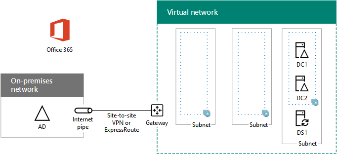

# <a name="high-availability-federated-authentication-phase-2-configure-domain-controllers"></a><span data-ttu-id="a80b2-103">Fase 2 dell'autenticazione federata a disponibilità elevata: configurare i controller di dominio</span><span class="sxs-lookup"><span data-stu-id="a80b2-103">High availability federated authentication Phase 2: Configure domain controllers</span></span>

 <span data-ttu-id="a80b2-104">**Riepilogo:** Configurare il controller di dominio e il server di DirSync per l'autenticazione federata la disponibilità elevata per Office 365 in Microsoft Azure.</span><span class="sxs-lookup"><span data-stu-id="a80b2-104">**Summary:** Configure the domain controllers and DirSync server for your high availability federated authentication for Office 365 in Microsoft Azure.</span></span>
  
<span data-ttu-id="a80b2-p101">In questa fase di distribuzione di disponibilità elevata per l'autenticazione federata di Office 365 nei servizi dell'infrastruttura di Azure, si configurano due controller di dominio e il server DirSync nella rete virtuale Azure. Le richieste Web client per l'autenticazione possono quindi essere autenticate nella rete virtuale di Azure, anziché inviare tale traffico di autenticazione tramite la connessione VPN da sito a sito alla rete locale.</span><span class="sxs-lookup"><span data-stu-id="a80b2-p101">In this phase of deploying high availability for Office 365 federated authentication in Azure infrastructure services, you configure two domain controllers and the DirSync server in the Azure virtual network. Client web requests for authentication can then be authenticated in the Azure virtual network, rather than sending that authentication traffic across the site-to-site VPN connection to your on-premises network.</span></span>
  
> [!NOTE]
> <span data-ttu-id="a80b2-107">In Active Directory Federation Services (AD FS) non è possibile utilizzare Azure Active Directory Domain Services al posto dei controller di dominio di Windows Server AD.</span><span class="sxs-lookup"><span data-stu-id="a80b2-107">Active Directory Federation Services (AD FS) cannot use Azure Active Directory Domain Services as a substitute for Windows Server AD domain controllers.</span></span> 
  
<span data-ttu-id="a80b2-p102">È necessario completare prima di spostare in questa fase [la disponibilità elevata federati autenticazione fase 3: configurare i server ADFS](high-availability-federated-authentication-phase-3-configure-ad-fs-servers.md). Per tutte le fasi, vedere [Deploy la disponibilità elevata nell'autenticazione federata per Office 365 in Azure](deploy-high-availability-federated-authentication-for-office-365-in-azure.md) .</span><span class="sxs-lookup"><span data-stu-id="a80b2-p102">You must complete this phase before moving on to [High availability federated authentication Phase 3: Configure AD FS servers](high-availability-federated-authentication-phase-3-configure-ad-fs-servers.md). See [Deploy high availability federated authentication for Office 365 in Azure](deploy-high-availability-federated-authentication-for-office-365-in-azure.md) for all of the phases.</span></span>
  
## <a name="create-the-domain-controller-virtual-machines-in-azure"></a><span data-ttu-id="a80b2-110">Creare le macchine virtuali dei controller di dominio in Azure</span><span class="sxs-lookup"><span data-stu-id="a80b2-110">Create the domain controller virtual machines in Azure</span></span>

<span data-ttu-id="a80b2-111">Innanzitutto, è necessario compilare la colonna **nome della macchina virtuale** di tabella M e modificare le dimensioni delle macchine virtuali in base alle esigenze nella colonna **dimensione minima** .</span><span class="sxs-lookup"><span data-stu-id="a80b2-111">First, you need to fill out the **Virtual machine name** column of Table M and modify virtual machine sizes as needed in the **Minimum size** column.</span></span>
  
|<span data-ttu-id="a80b2-112">**Elemento**</span><span class="sxs-lookup"><span data-stu-id="a80b2-112">**Item**</span></span>|<span data-ttu-id="a80b2-113">**Nome della macchina virtuale**</span><span class="sxs-lookup"><span data-stu-id="a80b2-113">**Virtual machine name**</span></span>|<span data-ttu-id="a80b2-114">**Galleria**</span><span class="sxs-lookup"><span data-stu-id="a80b2-114">**Gallery image**</span></span>|<span data-ttu-id="a80b2-115">**Tipo di archiviazione**</span><span class="sxs-lookup"><span data-stu-id="a80b2-115">**Storage type**</span></span>|<span data-ttu-id="a80b2-116">**Dimensione minima**</span><span class="sxs-lookup"><span data-stu-id="a80b2-116">**Minimum size**</span></span>|
|:-----|:-----|:-----|:-----|:-----|
|<span data-ttu-id="a80b2-117">1.</span><span class="sxs-lookup"><span data-stu-id="a80b2-117">1.</span></span>  <br/> |<span data-ttu-id="a80b2-118">______________ (primo controller di dominio, ad esempio DC1)</span><span class="sxs-lookup"><span data-stu-id="a80b2-118">______________ (first domain controller, example DC1)</span></span>  <br/> |<span data-ttu-id="a80b2-119">Windows Server 2016 Datacenter</span><span class="sxs-lookup"><span data-stu-id="a80b2-119">Windows Server 2016 Datacenter</span></span>  <br/> |<span data-ttu-id="a80b2-120">StandardLRS</span><span class="sxs-lookup"><span data-stu-id="a80b2-120">StandardLRS</span></span>  <br/> |<span data-ttu-id="a80b2-121">Standard_D2</span><span class="sxs-lookup"><span data-stu-id="a80b2-121">Standard_D2</span></span>  <br/> |
|<span data-ttu-id="a80b2-122">2.</span><span class="sxs-lookup"><span data-stu-id="a80b2-122">2.</span></span>  <br/> |<span data-ttu-id="a80b2-123">______________ (secondo controller di dominio, ad esempio DC2)</span><span class="sxs-lookup"><span data-stu-id="a80b2-123">______________ (second domain controller, example DC2)</span></span>  <br/> |<span data-ttu-id="a80b2-124">Windows Server 2016 Datacenter</span><span class="sxs-lookup"><span data-stu-id="a80b2-124">Windows Server 2016 Datacenter</span></span>  <br/> |<span data-ttu-id="a80b2-125">StandardLRS</span><span class="sxs-lookup"><span data-stu-id="a80b2-125">StandardLRS</span></span>  <br/> |<span data-ttu-id="a80b2-126">Standard_D2</span><span class="sxs-lookup"><span data-stu-id="a80b2-126">Standard_D2</span></span>  <br/> |
|<span data-ttu-id="a80b2-127">3.</span><span class="sxs-lookup"><span data-stu-id="a80b2-127">3.</span></span>  <br/> |<span data-ttu-id="a80b2-128">______________ (server DirSync, ad esempio DS1)</span><span class="sxs-lookup"><span data-stu-id="a80b2-128">______________ (DirSync server, example DS1)</span></span>  <br/> |<span data-ttu-id="a80b2-129">Windows Server 2016 Datacenter</span><span class="sxs-lookup"><span data-stu-id="a80b2-129">Windows Server 2016 Datacenter</span></span>  <br/> |<span data-ttu-id="a80b2-130">StandardLRS</span><span class="sxs-lookup"><span data-stu-id="a80b2-130">StandardLRS</span></span>  <br/> |<span data-ttu-id="a80b2-131">Standard_D2</span><span class="sxs-lookup"><span data-stu-id="a80b2-131">Standard_D2</span></span>  <br/> |
|<span data-ttu-id="a80b2-132">4.</span><span class="sxs-lookup"><span data-stu-id="a80b2-132">4.</span></span>  <br/> |<span data-ttu-id="a80b2-133">______________ (primo server AD FS, ad esempio ADFS1)</span><span class="sxs-lookup"><span data-stu-id="a80b2-133">______________ (first AD FS server, example ADFS1)</span></span>  <br/> |<span data-ttu-id="a80b2-134">Windows Server 2016 Datacenter</span><span class="sxs-lookup"><span data-stu-id="a80b2-134">Windows Server 2016 Datacenter</span></span>  <br/> |<span data-ttu-id="a80b2-135">StandardLRS</span><span class="sxs-lookup"><span data-stu-id="a80b2-135">StandardLRS</span></span>  <br/> |<span data-ttu-id="a80b2-136">Standard_D2</span><span class="sxs-lookup"><span data-stu-id="a80b2-136">Standard_D2</span></span>  <br/> |
|<span data-ttu-id="a80b2-137">5.</span><span class="sxs-lookup"><span data-stu-id="a80b2-137">5.</span></span>  <br/> |<span data-ttu-id="a80b2-138">______________ (secondo server AD FS, ad esempio ADFS2)</span><span class="sxs-lookup"><span data-stu-id="a80b2-138">______________ (second AD FS server, example ADFS2)</span></span>  <br/> |<span data-ttu-id="a80b2-139">Windows Server 2016 Datacenter</span><span class="sxs-lookup"><span data-stu-id="a80b2-139">Windows Server 2016 Datacenter</span></span>  <br/> |<span data-ttu-id="a80b2-140">StandardLRS</span><span class="sxs-lookup"><span data-stu-id="a80b2-140">StandardLRS</span></span>  <br/> |<span data-ttu-id="a80b2-141">Standard_D2</span><span class="sxs-lookup"><span data-stu-id="a80b2-141">Standard_D2</span></span>  <br/> |
|<span data-ttu-id="a80b2-142">6.</span><span class="sxs-lookup"><span data-stu-id="a80b2-142">6.</span></span>  <br/> |<span data-ttu-id="a80b2-143">______________ (primo server proxy di applicazione Web, ad esempio WEB1)</span><span class="sxs-lookup"><span data-stu-id="a80b2-143">______________ (first web application proxy server, example WEB1)</span></span>  <br/> |<span data-ttu-id="a80b2-144">Windows Server 2016 Datacenter</span><span class="sxs-lookup"><span data-stu-id="a80b2-144">Windows Server 2016 Datacenter</span></span>  <br/> |<span data-ttu-id="a80b2-145">StandardLRS</span><span class="sxs-lookup"><span data-stu-id="a80b2-145">StandardLRS</span></span>  <br/> |<span data-ttu-id="a80b2-146">Standard_D2</span><span class="sxs-lookup"><span data-stu-id="a80b2-146">Standard_D2</span></span>  <br/> |
|<span data-ttu-id="a80b2-147">7.</span><span class="sxs-lookup"><span data-stu-id="a80b2-147">7.</span></span>  <br/> |<span data-ttu-id="a80b2-148">______________ (secondo server proxy di applicazione Web, ad esempio WEB2)</span><span class="sxs-lookup"><span data-stu-id="a80b2-148">______________ (second web application proxy server, example WEB2)</span></span>  <br/> |<span data-ttu-id="a80b2-149">Windows Server 2016 Datacenter</span><span class="sxs-lookup"><span data-stu-id="a80b2-149">Windows Server 2016 Datacenter</span></span>  <br/> |<span data-ttu-id="a80b2-150">StandardLRS</span><span class="sxs-lookup"><span data-stu-id="a80b2-150">StandardLRS</span></span>  <br/> |<span data-ttu-id="a80b2-151">Standard_D2</span><span class="sxs-lookup"><span data-stu-id="a80b2-151">Standard_D2</span></span>  <br/> |
   
 <span data-ttu-id="a80b2-152">**Tabella M - macchine virtuali per l'autenticazione federata la disponibilità elevata per Office 365 in Azure**</span><span class="sxs-lookup"><span data-stu-id="a80b2-152">**Table M - Virtual machines for the high availability federated authentication for Office 365 in Azure**</span></span>
  
<span data-ttu-id="a80b2-153">Per l'elenco completo delle dimensioni delle macchine virtuali, vedere [dimensioni per le macchine virtuali](https://docs.microsoft.com/azure/virtual-machines/virtual-machines-windows-sizes).</span><span class="sxs-lookup"><span data-stu-id="a80b2-153">For the complete list of virtual machine sizes, see [Sizes for virtual machines](https://docs.microsoft.com/azure/virtual-machines/virtual-machines-windows-sizes).</span></span>
  
<span data-ttu-id="a80b2-p103">Il seguente blocco di comandi Azure PowerShell consente di creare le macchine virtuali per i controller di due dominio. Specificare i valori per le variabili, rimuovere il \< e > caratteri. Si noti che questo blocco di comandi Azure PowerShell utilizza valori dalle tabelle riportate di seguito:</span><span class="sxs-lookup"><span data-stu-id="a80b2-p103">The following Azure PowerShell command block creates the virtual machines for the two domain controllers. Specify the values for the variables, removing the \< and > characters. Note that this Azure PowerShell command block uses values from the following tables:</span></span>
  
- <span data-ttu-id="a80b2-157">Tabella M, per le macchine virtuali</span><span class="sxs-lookup"><span data-stu-id="a80b2-157">Table M, for your virtual machines</span></span>
    
- <span data-ttu-id="a80b2-158">Tabella R, per i gruppi di risorse</span><span class="sxs-lookup"><span data-stu-id="a80b2-158">Table R, for your resource groups</span></span>
    
- <span data-ttu-id="a80b2-159">Tabella V, per le impostazioni della rete virtuale</span><span class="sxs-lookup"><span data-stu-id="a80b2-159">Table V, for your virtual network settings</span></span>
    
- <span data-ttu-id="a80b2-160">Tabella S, per le subnet</span><span class="sxs-lookup"><span data-stu-id="a80b2-160">Table S, for your subnets</span></span>
    
- <span data-ttu-id="a80b2-161">Tabella I, per gli indirizzi IP statici</span><span class="sxs-lookup"><span data-stu-id="a80b2-161">Table I, for your static IP addresses</span></span>
    
- <span data-ttu-id="a80b2-162">Tabella A, per i set di disponibilità</span><span class="sxs-lookup"><span data-stu-id="a80b2-162">Table A, for your availability sets</span></span>
    
<span data-ttu-id="a80b2-163">Richiamare una definite tabelle R, V, S, è possibile e A in [la disponibilità elevata federati autenticazione fase 1: configurare Azure](high-availability-federated-authentication-phase-1-configure-azure.md).</span><span class="sxs-lookup"><span data-stu-id="a80b2-163">Recall that you defined Tables R, V, S, I, and A in [High availability federated authentication Phase 1: Configure Azure](high-availability-federated-authentication-phase-1-configure-azure.md).</span></span>
  
> [!NOTE]
> <span data-ttu-id="a80b2-p104">Il seguente comando consente di utilizzare la versione più recente di Azure PowerShell. Vedere [iniziare a utilizzare i cmdlet PowerShell di Azure](https://docs.microsoft.com/en-us/powershell/azureps-cmdlets-docs/).</span><span class="sxs-lookup"><span data-stu-id="a80b2-p104">The following command sets use the latest version of Azure PowerShell. See [Get started with Azure PowerShell cmdlets](https://docs.microsoft.com/en-us/powershell/azureps-cmdlets-docs/).</span></span> 
  
<span data-ttu-id="a80b2-166">Una volta forniti tutti i valori corretti, eseguire il blocco risultante nel prompt di Azure PowerShell oppure in PowerShell Integrated Script Environment (ISE) nel computer locale.</span><span class="sxs-lookup"><span data-stu-id="a80b2-166">When you have supplied all the correct values, run the resulting block at the Azure PowerShell prompt or in the PowerShell Integrated Script Environment (ISE) on your local computer.</span></span>
  
> [!TIP]
> <span data-ttu-id="a80b2-167">Per un file di testo che contiene tutti i comandi di PowerShell in questo articolo e una cartella di lavoro configurazione Microsoft Excel che genera pronto a portata di blocchi di comandi di PowerShell in base alle impostazioni personalizzate, vedere [autenticazione federata per Office 365 in Azure Deployment Kit](https://gallery.technet.microsoft.com/Federated-Authentication-8a9f1664).</span><span class="sxs-lookup"><span data-stu-id="a80b2-167">For a text file that contains all of the PowerShell commands in this article and a Microsoft Excel configuration workbook that generates ready-to-run PowerShell command blocks based on your custom settings, see the [Federated Authentication for Office 365 in Azure Deployment Kit](https://gallery.technet.microsoft.com/Federated-Authentication-8a9f1664).</span></span> 
  
```
# Set up variables common to both virtual machines
$locName="<your Azure location>"
$vnetName="<Table V - Item 1 - Value column>"
$subnetName="<Table S - Item 1 - Value column>"
$avName="<Table A - Item 1 - Availability set name column>"
$rgNameTier="<Table R - Item 1 - Resource group name column>"
$rgNameInfra="<Table R - Item 4 - Resource group name column>"

$rgName=$rgNameInfra
$vnet=Get-AzureRMVirtualNetwork -Name $vnetName -ResourceGroupName $rgName
$subnet=Get-AzureRmVirtualNetworkSubnetConfig -VirtualNetwork $vnet -Name $subnetName

$rgName=$rgNameTier
$avSet=Get-AzureRMAvailabilitySet -Name $avName -ResourceGroupName $rgName 

# Create the first domain controller
$vmName="<Table M - Item 1 - Virtual machine name column>"
$vmSize="<Table M - Item 1 - Minimum size column>"
$staticIP="<Table I - Item 1 - Value column>"
$diskStorageType="<Table M - Item 1 - Storage type column>"
$diskSize=<size of the extra disk for Windows Server AD data in GB>

$nic=New-AzureRMNetworkInterface -Name ($vmName +"-NIC") -ResourceGroupName $rgName -Location $locName -Subnet $subnet -PrivateIpAddress $staticIP
$vm=New-AzureRMVMConfig -VMName $vmName -VMSize $vmSize -AvailabilitySetId $avset.Id
$vm=Set-AzureRmVMOSDisk -VM $vm -Name ($vmName +"-OS") -DiskSizeInGB 128 -CreateOption FromImage -StorageAccountType $diskStorageType
$diskConfig=New-AzureRmDiskConfig -AccountType $diskStorageType -Location $locName -CreateOption Empty -DiskSizeGB $diskSize
$dataDisk1=New-AzureRmDisk -DiskName ($vmName + "-DataDisk1") -Disk $diskConfig -ResourceGroupName $rgName
$vm=Add-AzureRmVMDataDisk -VM $vm -Name ($vmName + "-DataDisk1") -CreateOption Attach -ManagedDiskId $dataDisk1.Id -Lun 1
$cred=Get-Credential -Message "Type the name and password of the local administrator account for the first domain controller." 
$vm=Set-AzureRMVMOperatingSystem -VM $vm -Windows -ComputerName $vmName -Credential $cred -ProvisionVMAgent -EnableAutoUpdate
$vm=Set-AzureRMVMSourceImage -VM $vm -PublisherName MicrosoftWindowsServer -Offer WindowsServer -Skus 2016-Datacenter -Version "latest"
$vm=Add-AzureRMVMNetworkInterface -VM $vm -Id $nic.Id
New-AzureRMVM -ResourceGroupName $rgName -Location $locName -VM $vm

# Create the second domain controller
$vmName="<Table M - Item 2 - Virtual machine name column>"
$vmSize="<Table M - Item 2 - Minimum size column>"
$staticIP="<Table I - Item 2 - Value column>"
$diskStorageType="<Table M - Item 2 - Storage type column>"
$diskSize=<size of the extra disk for Windows Server AD data in GB>

$nic=New-AzureRMNetworkInterface -Name ($vmName +"-NIC") -ResourceGroupName $rgName -Location $locName -Subnet $subnet -PrivateIpAddress $staticIP
$vm=New-AzureRMVMConfig -VMName $vmName -VMSize $vmSize -AvailabilitySetId $avset.Id
$vm=Set-AzureRmVMOSDisk -VM $vm -Name ($vmName +"-OS") -DiskSizeInGB 128 -CreateOption FromImage -StorageAccountType $diskStorageType
$diskConfig=New-AzureRmDiskConfig -AccountType $diskStorageType -Location $locName -CreateOption Empty -DiskSizeGB $diskSize
$dataDisk1=New-AzureRmDisk -DiskName ($vmName + "-DataDisk1") -Disk $diskConfig -ResourceGroupName $rgName
$vm=Add-AzureRmVMDataDisk -VM $vm -Name ($vmName + "-DataDisk1") -CreateOption Attach -ManagedDiskId $dataDisk1.Id -Lun 1
$cred=Get-Credential -Message "Type the name and password of the local administrator account for the second domain controller." 
$vm=Set-AzureRMVMOperatingSystem -VM $vm -Windows -ComputerName $vmName -Credential $cred -ProvisionVMAgent -EnableAutoUpdate
$vm=Set-AzureRMVMSourceImage -VM $vm -PublisherName MicrosoftWindowsServer -Offer WindowsServer -Skus 2016-Datacenter -Version "latest"
$vm=Add-AzureRMVMNetworkInterface -VM $vm -Id $nic.Id
New-AzureRMVM -ResourceGroupName $rgName -Location $locName -VM $vm

# Create the DirSync server
$vmName="<Table M - Item 3 - Virtual machine name column>"
$vmSize="<Table M - Item 3 - Minimum size column>"
$staticIP="<Table I - Item 3 - Value column>"
$diskStorageType="<Table M - Item 3 - Storage type column>"

$nic=New-AzureRMNetworkInterface -Name ($vmName +"-NIC") -ResourceGroupName $rgName -Location $locName -Subnet $subnet -PrivateIpAddress $staticIP
$vm=New-AzureRMVMConfig -VMName $vmName -VMSize $vmSize

$cred=Get-Credential -Message "Type the name and password of the local administrator account for the DirSync server." 
$vm=Set-AzureRMVMOperatingSystem -VM $vm -Windows -ComputerName $vmName -Credential $cred -ProvisionVMAgent -EnableAutoUpdate
$vm=Set-AzureRMVMSourceImage -VM $vm -PublisherName MicrosoftWindowsServer -Offer WindowsServer -Skus 2016-Datacenter -Version "latest"
$vm=Add-AzureRMVMNetworkInterface -VM $vm -Id $nic.Id
$vm=Set-AzureRmVMOSDisk -VM $vm -Name ($vmName +"-OS") -DiskSizeInGB 128 -CreateOption FromImage -StorageAccountType $diskStorageType
New-AzureRMVM -ResourceGroupName $rgName -Location $locName -VM $vm
```

> [!NOTE]
> <span data-ttu-id="a80b2-p105">Dal momento che queste macchine virtuali sono relative a un'applicazione intranet, non vengono assegnati un indirizzo IP pubblico o un'etichetta nome di dominio DNS ed esposti a Internet. Tuttavia, ciò significa inoltre che non è possibile connettersi a tali dal portale di Azure. Quando si visualizzano le proprietà della macchina virtuale non è disponibile l'opzione **Connetti** . Utilizzare accessorio connessione Desktop remoto o un altro strumento di Desktop remoto per la connessione alla macchina virtuale con privata IP address o intranet nome DNS.</span><span class="sxs-lookup"><span data-stu-id="a80b2-p105">Because these virtual machines are for an intranet application, they are not assigned a public IP address or a DNS domain name label and exposed to the Internet. However, this also means that you cannot connect to them from the Azure portal. The **Connect** option is unavailable when you view the properties of the virtual machine. Use the Remote Desktop Connection accessory or another Remote Desktop tool to connect to the virtual machine using its private IP address or intranet DNS name.</span></span>
  
## <a name="configure-the-first-domain-controller"></a><span data-ttu-id="a80b2-172">Configurare il primo controller di dominio</span><span class="sxs-lookup"><span data-stu-id="a80b2-172">Configure the first domain controller</span></span>

<span data-ttu-id="a80b2-p106">Usare il client desktop remoto di propria scelta e creare una connessione desktop remoto per la macchina virtuale del primo controller di dominio. Usare il nome DNS Intranet o il nome computer e le credenziali dell'account di amministratore locale.</span><span class="sxs-lookup"><span data-stu-id="a80b2-p106">Use the remote desktop client of your choice and create a remote desktop connection to the first domain controller virtual machine. Use its intranet DNS or computer name and the credentials of the local administrator account.</span></span>
  
<span data-ttu-id="a80b2-175">Successivamente, aggiungere il disco dati aggiuntivi per il primo controller di dominio con il comando da un Windows PowerShell al prompt dei comandi **nella macchina virtuale prima di controller di dominio**:</span><span class="sxs-lookup"><span data-stu-id="a80b2-175">Next, add the extra data disk to the first domain controller with this command from a Windows PowerShell command prompt **on the first domain controller virtual machine**:</span></span>
  
```
Get-Disk | Where PartitionStyle -eq "RAW" | Initialize-Disk -PartitionStyle MBR -PassThru | New-Partition -AssignDriveLetter -UseMaximumSize | Format-Volume -FileSystem NTFS -NewFileSystemLabel "WSAD Data"
```

<span data-ttu-id="a80b2-176">Quindi, verificare la connettività del primo controller di dominio nei percorsi della rete dell'organizzazione utilizzando il comando **ping** per eseguire il ping dei nomi e gli indirizzi IP delle risorse di rete dell'organizzazione.</span><span class="sxs-lookup"><span data-stu-id="a80b2-176">Next, test the first domain controller's connectivity to locations on your organization network by using the **ping** command to ping names and IP addresses of resources on your organization network.</span></span>
  
<span data-ttu-id="a80b2-p107">Questa procedura assicura che la risoluzione dei nomi DNS funziona correttamente (che la macchina virtuale è configurata correttamente con i server DNS locali) e che possono essere inviati pacchetti da e verso la rete virtuale cross-premise. Se il test ha esito negativo, contattare il proprio reparto IT per risolvere i problemi relativi alla risoluzione del nome DNS e al recapito dei pacchetti.</span><span class="sxs-lookup"><span data-stu-id="a80b2-p107">This procedure ensures that DNS name resolution is working correctly (that the virtual machine is correctly configured with on-premises DNS servers) and that packets can be sent to and from the cross-premises virtual network. If this basic test fails, contact your IT department to troubleshoot the DNS name resolution and packet delivery issues.</span></span>
  
<span data-ttu-id="a80b2-179">Successivamente, dal prompt dei comandi di Windows PowerShell nel primo controller di dominio, eseguire i comandi seguenti:</span><span class="sxs-lookup"><span data-stu-id="a80b2-179">Next, from the Windows PowerShell command prompt on the first domain controller, run the following commands:</span></span>
  
```
$domname="<DNS domain name of the domain for which this computer will be a domain controller, such as corp.contoso.com>"
$cred = Get-Credential -Message "Enter credentials of an account with permission to join a new domain controller to the domain"
Install-WindowsFeature AD-Domain-Services -IncludeManagementTools
Install-ADDSDomainController -InstallDns -DomainName $domname  -DatabasePath "F:\\NTDS" -SysvolPath "F:\\SYSVOL" -LogPath "F:\\Logs" -Credential $cred
```

<span data-ttu-id="a80b2-p108">Verrà richiesto di fornire le credenziali di un account di amministratore del dominio. Il computer viene riavviato.</span><span class="sxs-lookup"><span data-stu-id="a80b2-p108">You will be prompted to supply the credentials of a domain administrator account. The computer will restart.</span></span>
  
## <a name="configure-the-second-domain-controller"></a><span data-ttu-id="a80b2-182">Configurare il secondo controller di dominio</span><span class="sxs-lookup"><span data-stu-id="a80b2-182">Configure the second domain controller</span></span>

<span data-ttu-id="a80b2-p109">Usare il client desktop remoto di propria scelta e creare una connessione desktop remoto per la macchina virtuale del secondo controller di dominio. Usare il nome DNS Intranet o il nome computer e le credenziali dell'account di amministratore locale.</span><span class="sxs-lookup"><span data-stu-id="a80b2-p109">Use the remote desktop client of your choice and create a remote desktop connection to the second domain controller virtual machine. Use its intranet DNS or computer name and the credentials of the local administrator account.</span></span>
  
<span data-ttu-id="a80b2-185">È necessario aggiungere il disco dati aggiuntivi al secondo controller di dominio con il comando da un Windows PowerShell al prompt dei comandi **nella seconda macchina virtuale controller di dominio**:</span><span class="sxs-lookup"><span data-stu-id="a80b2-185">Next, you need to add the extra data disk to the second domain controller with this command from a Windows PowerShell command prompt **on the second domain controller virtual machine**:</span></span>
  
```
Get-Disk | Where PartitionStyle -eq "RAW" | Initialize-Disk -PartitionStyle MBR -PassThru | New-Partition -AssignDriveLetter -UseMaximumSize | Format-Volume -FileSystem NTFS -NewFileSystemLabel "WSAD Data"
```

<span data-ttu-id="a80b2-186">Quindi, eseguire i seguenti comandi:</span><span class="sxs-lookup"><span data-stu-id="a80b2-186">Next, run the following commands:</span></span>
  
```
$domname="<DNS domain name of the domain for which this computer will be a domain controller, such as corp.contoso.com>"
$cred = Get-Credential -Message "Enter credentials of an account with permission to join a new domain controller to the domain"
Install-WindowsFeature AD-Domain-Services -IncludeManagementTools
Install-ADDSDomainController -InstallDns -DomainName $domname  -DatabasePath "F:\\NTDS" -SysvolPath "F:\\SYSVOL" -LogPath "F:\\Logs" -Credential $cred

```

<span data-ttu-id="a80b2-p110">Verrà richiesto di fornire le credenziali di un account di amministratore del dominio. Il computer viene riavviato.</span><span class="sxs-lookup"><span data-stu-id="a80b2-p110">You will be prompted to supply the credentials of a domain administrator account. The computer will restart.</span></span>
  
<span data-ttu-id="a80b2-p111">È necessario aggiornare i server DNS per la rete virtuale in modo che tale Azure assegna macchine virtuali gli indirizzi IP di due nuovi controller di dominio da utilizzare come server DNS. Compilare le variabili e quindi eseguire questi comandi dal prompt dei comandi di Windows PowerShell nel computer locale:</span><span class="sxs-lookup"><span data-stu-id="a80b2-p111">Next, you need to update the DNS servers for your virtual network so that Azure assigns virtual machines the IP addresses of the two new domain controllers to use as their DNS servers. Fill in the variables and then run these commands from a Windows PowerShell command prompt on your local computer:</span></span>
  
```
$rgName="<Table R - Item 4 - Resource group name column>"
$adrgName="<Table R - Item 1 - Resource group name column>"
$locName="<your Azure location>"
$vnetName="<Table V - Item 1 - Value column>"
$onpremDNSIP1="<Table D - Item 1 - DNS server IP address column>"
$onpremDNSIP2="<Table D - Item 2 - DNS server IP address column>"
$staticIP1="<Table I - Item 1 - Value column>"
$staticIP2="<Table I - Item 2 - Value column>"
$firstDCName="<Table M - Item 1 - Virtual machine name column>"
$secondDCName="<Table M - Item 2 - Virtual machine name column>"

$vnet=Get-AzureRMVirtualNetwork -ResourceGroupName $rgName -Name $vnetName
$vnet.DhcpOptions.DnsServers.Add($staticIP1)
$vnet.DhcpOptions.DnsServers.Add($staticIP2) 
$vnet.DhcpOptions.DnsServers.Remove($onpremDNSIP1)
$vnet.DhcpOptions.DnsServers.Remove($onpremDNSIP2) 
Set-AzureRMVirtualNetwork -VirtualNetwork $vnet
Restart-AzureRMVM -ResourceGroupName $adrgName -Name $firstDCName
Restart-AzureRMVM -ResourceGroupName $adrgName -Name $secondDCName
```

<span data-ttu-id="a80b2-p112">Si noti che i due controller di dominio vengono riavviati in modo che non siano configurati con i server DNS locali come server DNS. Trattandosi di due server DNS, sono stati configurati automaticamente con i server DNS locali come server d'inoltro quando sono stati promossi a controller di dominio.</span><span class="sxs-lookup"><span data-stu-id="a80b2-p112">Note that we restart the two domain controllers so that they are not configured with the on-premises DNS servers as DNS servers. Because they are both DNS servers themselves, they were automatically configured with the on-premises DNS servers as DNS forwarders when they were promoted to domain controllers.</span></span>
  
<span data-ttu-id="a80b2-p113">Successivamente, è necessario creare un sito di replica di Active Directory per assicurarsi che i server della rete virtuale di Azure utilizzino i controller di dominio locali. Connettersi a uno dei due controller di dominio con un account di amministratore di dominio ed eseguire i comandi seguenti dal prompt dei comandi di Windows PowerShell a livello di amministratore:</span><span class="sxs-lookup"><span data-stu-id="a80b2-p113">Next, we need to create an Active Directory replication site to ensure that servers in the Azure virtual network use the local domain controllers. Connect to either domain controller with a domain administrator account and run the following commands from an administrator-level Windows PowerShell prompt:</span></span>
  
```
$vnet="<Table V - Item 1 - Value column>"
$vnetSpace="<Table V - Item 4 - Value column>"
New-ADReplicationSite -Name $vnet 
New-ADReplicationSubnet -Name $vnetSpace -Site $vnet
```

## <a name="configure-the-dirsync-server"></a><span data-ttu-id="a80b2-195">Configurare il server DirSync</span><span class="sxs-lookup"><span data-stu-id="a80b2-195">Configure the DirSync server</span></span>

<span data-ttu-id="a80b2-p114">Utilizzare il client desktop remoto desiderato e creare una connessione desktop remoto alla macchina virtuale server DirSync. Utilizzare il nome DNS o computer intranet e le credenziali dell'account di amministratore locale.</span><span class="sxs-lookup"><span data-stu-id="a80b2-p114">Use the remote desktop client of your choice and create a remote desktop connection to the DirSync server virtual machine. Use its intranet DNS or computer name and the credentials of the local administrator account.</span></span>
  
<span data-ttu-id="a80b2-198">Successivamente, aggiungerlo al dominio di Windows Server AD appropriato con questi comandi nel prompt dei comandi di Windows PowerShell.</span><span class="sxs-lookup"><span data-stu-id="a80b2-198">Next, join it to the appropriate Windows Server AD domain with these commands at the Windows PowerShell prompt.</span></span>
  
```
$domName="<Windows Server AD domain name to join, such as corp.contoso.com>"
$cred=Get-Credential -Message "Type the name and password of a domain acccount."
Add-Computer -DomainName $domName -Credential $cred
Restart-Computer
```

<span data-ttu-id="a80b2-199">Di seguito è riportata la configurazione risultante dal completamento corretto di questa fase, con i nomi computer segnaposto.</span><span class="sxs-lookup"><span data-stu-id="a80b2-199">Here is the configuration resulting from the successful completion of this phase, with placeholder computer names.</span></span>
  
<span data-ttu-id="a80b2-200">**Fase 2: Controller di dominio e server DirSync per l'infrastruttura di autenticazione federativa la disponibilità elevata in Azure**</span><span class="sxs-lookup"><span data-stu-id="a80b2-200">**Phase 2: The domain controllers and DirSync server for your high availability federated authentication infrastructure in Azure**</span></span>


  
## <a name="next-step"></a><span data-ttu-id="a80b2-202">Passaggio successivo</span><span class="sxs-lookup"><span data-stu-id="a80b2-202">Next step</span></span>

<span data-ttu-id="a80b2-203">Utilizzare [la disponibilità elevata federati autenticazione fase 3: configurare i server ADFS](high-availability-federated-authentication-phase-3-configure-ad-fs-servers.md) per continuare a configurare questo carico di lavoro.</span><span class="sxs-lookup"><span data-stu-id="a80b2-203">Use [High availability federated authentication Phase 3: Configure AD FS servers](high-availability-federated-authentication-phase-3-configure-ad-fs-servers.md) to continue configuring this workload.</span></span>
  
## <a name="see-also"></a><span data-ttu-id="a80b2-204">See Also</span><span class="sxs-lookup"><span data-stu-id="a80b2-204">See Also</span></span>

[<span data-ttu-id="a80b2-205">Distribuire l'autenticazione federata ad alta visibilità per Office 365 in Azure</span><span class="sxs-lookup"><span data-stu-id="a80b2-205">Deploy high availability federated authentication for Office 365 in Azure</span></span>](deploy-high-availability-federated-authentication-for-office-365-in-azure.md)
  
[<span data-ttu-id="a80b2-206">Identità federata per l'ambiente di sviluppo/test di Office 365</span><span class="sxs-lookup"><span data-stu-id="a80b2-206">Federated identity for your Office 365 dev/test environment</span></span>](federated-identity-for-your-office-365-dev-test-environment.md)
  
[<span data-ttu-id="a80b2-207">Adozione del cloud e soluzioni ibride</span><span class="sxs-lookup"><span data-stu-id="a80b2-207">Cloud adoption and hybrid solutions</span></span>](cloud-adoption-and-hybrid-solutions.md)

[<span data-ttu-id="a80b2-208">Identità federata per Office 365</span><span class="sxs-lookup"><span data-stu-id="a80b2-208">Federated identity for Office 365</span></span>](https://support.office.com/article/Understanding-Office-365-identity-and-Azure-Active-Directory-06a189e7-5ec6-4af2-94bf-a22ea225a7a9#bk_federated)


