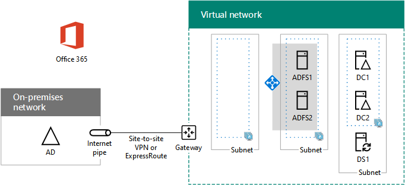

# <a name="high-availability-federated-authentication-phase-3-configure-ad-fs-servers"></a>Fase 3 dell'autenticazione federata a disponibilità elevata: Configurare i server AD FS

 **Riepilogo:** Creare e configurare il server di Active Directory Federation Services (ADFS) per l'autenticazione federata la disponibilità elevata per Office 365 in Microsoft Azure.
  
In questa fase di distribuzione di disponibilità elevata per l'autenticazione federata di Office 365 nei servizi infrastruttura di Azure, viene creato un bilanciamento del carico interno e due server AD FS.
  
È necessario completare prima di spostare in questa fase [la disponibilità elevata federati autenticazione fase 4: configurare il proxy di applicazione web](high-availability-federated-authentication-phase-4-configure-web-application-pro.md). Per tutte le fasi, vedere [Deploy la disponibilità elevata nell'autenticazione federata per Office 365 in Azure](deploy-high-availability-federated-authentication-for-office-365-in-azure.md) .
  
## <a name="create-the-ad-fs-server-virtual-machines-in-azure"></a>Creare le macchine virtuali dei server AD FS in Azure

Utilizzare il seguente blocco di comandi di PowerShell per creare le macchine virtuali per i due server AD FS. Il set di comandi di PowerShell utilizza i valori indicati nelle tabelle riportate di seguito:
  
- Tabella M, per le macchine virtuali
    
- Tabella R, per i gruppi di risorse
    
- Tabella V, per le impostazioni della rete virtuale
    
- Tabella S, per le subnet
    
- Tabella I, per gli indirizzi IP statici
    
- Tabella A, per i set di disponibilità
    
Richiamare una definite tabella M in [la disponibilità elevata federati autenticazione fase 2: configurare i controller di dominio](high-availability-federated-authentication-phase-2-configure-domain-controllers.md) e tabelle R, V, S, è possibile e A in [la disponibilità elevata federati autenticazione fase 1: configurare Azure](high-availability-federated-authentication-phase-1-configure-azure.md).
  
> [!NOTE]
> Il seguente comando consente di utilizzare la versione più recente di Azure PowerShell. Vedere [iniziare a utilizzare i cmdlet PowerShell di Azure](https://docs.microsoft.com/en-us/powershell/azureps-cmdlets-docs/). 
  
Creare innanzitutto un servizio di bilanciamento del carico interno Azure per l'annuncio di due server ADFS. Specificare i valori per le variabili, rimuovere il \< e > caratteri. Quando vengono specificati tutti i valori appropriati, eseguire il blocco risultante al prompt dei comandi di PowerShell Azure o in PowerShell ISE.
  
> [!TIP]
> Per un file di testo che contiene tutti i comandi di PowerShell in questo articolo e una cartella di lavoro configurazione Microsoft Excel che genera pronto a portata di blocchi di comandi di PowerShell in base alle impostazioni personalizzate, vedere [autenticazione federata per Office 365 in Azure Deployment Kit](https://gallery.technet.microsoft.com/Federated-Authentication-8a9f1664). 
  
```
# Set up key variables
$locName="<your Azure location>"
$vnetName="<Table V - Item 1 - Value column>"
$subnetName="<Table R - Item 2 - Subnet name column>"
$privIP="<Table I - Item 4 - Value column>"
$rgName=<Table R - Item 4 - Resource group name column>"

$vnet=Get-AzureRMVirtualNetwork -Name $vnetName -ResourceGroupName $rgName
$subnet=Get-AzureRmVirtualNetworkSubnetConfig -VirtualNetwork $vnet -Name $subnetName

$frontendIP=New-AzureRMLoadBalancerFrontendIpConfig -Name "ADFSServers-LBFE" -PrivateIPAddress $privIP -Subnet $subnet
$beAddressPool=New-AzureRMLoadBalancerBackendAddressPoolConfig -Name "ADFSServers-LBBE"

$healthProbe=New-AzureRMLoadBalancerProbeConfig -Name WebServersProbe -Protocol "TCP" -Port 443 -IntervalInSeconds 15 -ProbeCount 2
$lbrule=New-AzureRMLoadBalancerRuleConfig -Name "HTTPSTraffic" -FrontendIpConfiguration $frontendIP -BackendAddressPool $beAddressPool -Probe $healthProbe -Protocol "TCP" -FrontendPort 443 -BackendPort 443
New-AzureRMLoadBalancer -ResourceGroupName $rgName -Name "ADFSServers" -Location $locName -LoadBalancingRule $lbrule -BackendAddressPool $beAddressPool -Probe $healthProbe -FrontendIpConfiguration $frontendIP
```

Successivamente, creare le macchine virtuali dei server AD FS.
  
Una volta forniti tutti i valori opportuni, eseguire il blocco risultante nel prompt dei comandi di Azure PowerShell o in PowerShell ISE.
  
```
# Set up variables common to both virtual machines
$locName="<your Azure location>"
$vnetName="<Table V - Item 1 - Value column>"
$subnetName="<Table R - Item 2 - Subnet name column>"
$avName="<Table A - Item 2 - Availability set name column>"
$rgNameTier="<Table R - Item 2 - Resource group name column>"
$rgNameInfra="<Table R - Item 4 - Resource group name column>"

$rgName=$rgNameInfra
$vnet=Get-AzureRMVirtualNetwork -Name $vnetName -ResourceGroupName $rgName
$subnet=Get-AzureRmVirtualNetworkSubnetConfig -VirtualNetwork $vnet -Name $subnetName
$backendSubnet=Get-AzureRMVirtualNetworkSubnetConfig -Name $subnetName -VirtualNetwork $vnet
$webLB=Get-AzureRMLoadBalancer -ResourceGroupName $rgName -Name "ADFSServers"

$rgName=$rgNameTier
$avSet=Get-AzureRMAvailabilitySet -Name $avName -ResourceGroupName $rgName

# Create the first ADFS server virtual machine
$vmName="<Table M - Item 4 - Virtual machine name column>"
$vmSize="<Table M - Item 4 - Minimum size column>"
$staticIP="<Table I - Item 5 - Value column>"
$diskStorageType="<Table M - Item 4 - Storage type column>"

$nic=New-AzureRMNetworkInterface -Name ($vmName +"-NIC") -ResourceGroupName $rgName -Location $locName -Subnet $backendSubnet -LoadBalancerBackendAddressPool $webLB.BackendAddressPools[0] -PrivateIpAddress $staticIP
$vm=New-AzureRMVMConfig -VMName $vmName -VMSize $vmSize -AvailabilitySetId $avset.Id

$cred=Get-Credential -Message "Type the name and password of the local administrator account for the first AD FS server." 
$vm=Set-AzureRMVMOperatingSystem -VM $vm -Windows -ComputerName $vmName -Credential $cred -ProvisionVMAgent -EnableAutoUpdate
$vm=Set-AzureRMVMSourceImage -VM $vm -PublisherName MicrosoftWindowsServer -Offer WindowsServer -Skus 2016-Datacenter -Version "latest"
$vm=Add-AzureRMVMNetworkInterface -VM $vm -Id $nic.Id
$vm=Set-AzureRmVMOSDisk -VM $vm -Name ($vmName +"-OS") -DiskSizeInGB 128 -CreateOption FromImage -StorageAccountType $diskStorageType
New-AzureRMVM -ResourceGroupName $rgName -Location $locName -VM $vm

# Create the second AD FS virtual machine
$vmName="<Table M - Item 5 - Virtual machine name column>"
$vmSize="<Table M - Item 5 - Minimum size column>"
$staticIP="<Table I - Item 6 - Value column>"
$diskStorageType="<Table M - Item 5 - Storage type column>"

$nic=New-AzureRMNetworkInterface -Name ($vmName +"-NIC") -ResourceGroupName $rgName -Location $locName  -Subnet $backendSubnet -LoadBalancerBackendAddressPool $webLB.BackendAddressPools[0] -PrivateIpAddress $staticIP
$vm=New-AzureRMVMConfig -VMName $vmName -VMSize $vmSize -AvailabilitySetId $avset.Id

$cred=Get-Credential -Message "Type the name and password of the local administrator account for the second AD FS server." 
$vm=Set-AzureRMVMOperatingSystem -VM $vm -Windows -ComputerName $vmName -Credential $cred -ProvisionVMAgent -EnableAutoUpdate
$vm=Set-AzureRMVMSourceImage -VM $vm -PublisherName MicrosoftWindowsServer -Offer WindowsServer -Skus 2016-Datacenter -Version "latest"
$vm=Add-AzureRMVMNetworkInterface -VM $vm -Id $nic.Id
$vm=Set-AzureRmVMOSDisk -VM $vm -Name ($vmName +"-OS") -DiskSizeInGB 128 -CreateOption FromImage -StorageAccountType $diskStorageType
New-AzureRMVM -ResourceGroupName $rgName -Location $locName -VM $vm

```

> [!NOTE]
> Dal momento che queste macchine virtuali sono relative a un'applicazione intranet, non vengono assegnati un indirizzo IP pubblico o un'etichetta nome di dominio DNS ed esposti a Internet. Tuttavia, ciò significa inoltre che non è possibile connettersi a tali dal portale di Azure. Quando si visualizzano le proprietà della macchina virtuale non è disponibile l'opzione **Connetti** . Utilizzare accessorio connessione Desktop remoto o un altro strumento di Desktop remoto per la connessione alla macchina virtuale con privata IP address o intranet nome DNS.
  
Per ogni macchina virtuale, usare il client desktop remoto di propria scelta e creare una connessione desktop remoto. Usare il nome DNS Intranet o il nome computer e le credenziali dell'account di amministratore locale.
  
Per ogni macchina virtuale, aggiungerlo al dominio di Windows Server AD appropriato con questi comandi nel prompt dei comandi di Windows PowerShell.
  
```
$domName="<Windows Server AD domain name to join, such as corp.contoso.com>"
$cred=Get-Credential -Message "Type the name and password of a domain acccount."
Add-Computer -DomainName $domName -Credential $cred
Restart-Computer
```

Di seguito è riportata la configurazione risultante dal completamento corretto di questa fase, con i nomi computer segnaposto.
  
**Fase 3: Server AD FS e servizio di bilanciamento del carico interno per l'infrastruttura di autenticazione federativa la disponibilità elevata in Azure**


  
## <a name="next-step"></a>Passaggio successivo

Utilizzare [la disponibilità elevata federati autenticazione fase 4: configurare il proxy di applicazione web](high-availability-federated-authentication-phase-4-configure-web-application-pro.md) per continuare a configurare questo carico di lavoro.
  
## <a name="see-also"></a>Vedere anche

[Distribuire l'autenticazione federata ad alta visibilità per Office 365 in Azure](deploy-high-availability-federated-authentication-for-office-365-in-azure.md)
  
[Identità federata per l'ambiente di sviluppo/test di Office 365](federated-identity-for-your-office-365-dev-test-environment.md)


