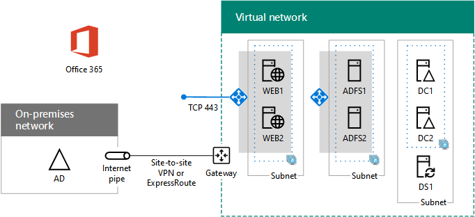

# <a name="high-availability-federated-authentication-phase-4-configure-web-application-proxies"></a>Fase 4 dell'autenticazione federata a disponibilità elevata: Configurare i proxy dell'applicazione Web

 **Riepilogo:** Configurare il server proxy applicazione web per l'autenticazione federata la disponibilità elevata per Office 365 in Microsoft Azure.
  
In questa fase di distribuzione di disponibilità elevata per l'autenticazione federata di Office 365 nei servizi infrastruttura di Azure, viene creato un bilanciamento del carico interno e due server AD FS.
  
È necessario completare prima di spostare in questa fase [la disponibilità elevata federati autenticazione fase 5: configurare l'autenticazione federata per Office 365](high-availability-federated-authentication-phase-5-configure-federated-authentic.md). Per tutte le fasi, vedere [Deploy la disponibilità elevata nell'autenticazione federata per Office 365 in Azure](deploy-high-availability-federated-authentication-for-office-365-in-azure.md) .
  
## <a name="create-the-internet-facing-load-balancer-in-azure"></a>Creare il bilanciatore di carico per traffico Internet in Azure

È necessario creare un bilanciatore di carico per traffico Internet affinché Azure distribuisca il traffico di autenticazione del client in arrivo da Internet uniformemente tra i due server proxy dell'applicazione Web.
  
> [!NOTE]
> Il seguente comando consente di utilizzare la versione più recente di Azure PowerShell. Vedere [iniziare a utilizzare i cmdlet PowerShell di Azure](https://docs.microsoft.com/en-us/powershell/azureps-cmdlets-docs/). 
  
Una volta forniti i valori per i gruppi di risorse e il percorso, eseguire il blocco risultante nel prompt dei comandi di Azure PowerShell o in PowerShell ISE.
  
> [!TIP]
> Per un file di testo che contiene tutti i comandi di PowerShell in questo articolo e una cartella di lavoro configurazione Microsoft Excel che genera pronto a portata di blocchi di comandi di PowerShell in base alle impostazioni personalizzate, vedere [autenticazione federata per Office 365 in Azure Deployment Kit](https://gallery.technet.microsoft.com/Federated-Authentication-8a9f1664). 
  
```
# Set up key variables
$locName="<your Azure location>"
$rgName="<Table R - Item 4 - Resource group name column>"

$publicIP=New-AzureRmPublicIpAddress -ResourceGroupName $rgName -Name "WebProxyPublicIP" -Location $LocName -AllocationMethod "Static"
$frontendIP=New-AzureRmLoadBalancerFrontendIpConfig -Name "WebAppProxyServers-LBFE" -PublicIpAddress $publicIP
$beAddressPool=New-AzureRMLoadBalancerBackendAddressPoolConfig -Name "WebAppProxyServers-LBBE"
$healthProbe=New-AzureRMLoadBalancerProbeConfig -Name "WebServersProbe" -Protocol "TCP" -Port 443 -IntervalInSeconds 15 -ProbeCount 2
$lbrule=New-AzureRMLoadBalancerRuleConfig -Name "WebTraffic" -FrontendIpConfiguration $frontendIP -BackendAddressPool $beAddressPool -Probe $healthProbe -Protocol "TCP" -FrontendPort 443 -BackendPort 443
New-AzureRMLoadBalancer -ResourceGroupName $rgName -Name "WebAppProxyServers" -Location $locName -LoadBalancingRule $lbrule -BackendAddressPool $beAddressPool -Probe $healthProbe -FrontendIpConfiguration $frontendIP
```

Per visualizzare l'indirizzo IP pubblico assegnato al bilanciatore di carico per traffico Internet, eseguire questi comandi nel prompt dei comandi di Azure PowerShell nel computer locale:
  
```
Write-Host (Get-AzureRMPublicIpaddress -Name "WebProxyPublicIP" -ResourceGroup $rgName).IPAddress
```

## <a name="determine-your-federation-service-fqdn-and-create-dns-records"></a>Determinare il nome di dominio completo del servizio federativo e creare record DNS

È necessario determinare il nome DNS per identificare il nome del servizio federativo su Internet. Azure AD Connect configurerà Office 365 con questo nome nella fase 5, che diventerà parte dell'URL inviato da Office 365 per connettere i client per ottenere token di sicurezza. Un esempio è fs.contoso.com (dove fs è l'acronimo di federation service, cioè servizio federativo).
  
Una volta ottenuto il nome di dominio completo del servizio federativo, creare un record di tipo A del dominio DNS pubblico per il nome di dominio completo che consente di determinare l'indirizzo IP pubblico del bilanciatore di carico per traffico Internet di Azure.
  
|**Nome**|**Tipo**|**TTL**|**Valore**|
|:-----|:-----|:-----|:-----|
|Nome di dominio completo del servizio federativo  <br/> |A  <br/> |3600  <br/> |indirizzo IP pubblico del bilanciamento del carico per Internet di Azure (visualizzato dal comando di **Write-Host** nella sezione precedente) <br/> |
   
Ecco un esempio:
  
|**Nome**|**Tipo**|**TTL**|**Valore**|
|:-----|:-----|:-----|:-----|
|FS.contoso.com  <br/> |A  <br/> |3600  <br/> |131.107.249.117  <br/> |
   
Successivamente, aggiungere un record di indirizzo DNS allo spazio dei nomi DNS privato aziendale che consente di determinare il nome di dominio completo del servizio federativo per l'indirizzo IP privato assegnato al bilanciamento del carico interno per i server AD FS (tabella I, voce 4, colonna Valore).
  
## <a name="create-the-web-application-proxy-server-virtual-machines-in-azure"></a>Creare macchine virtuali per i server proxy delle applicazioni Web in Azure

Utilizzare il seguente blocco di comandi di Azure PowerShell per creare le macchine virtuali per i due server proxy delle applicazioni Web.  
  
Si noti che i seguenti set di comandi di Azure PowerShell utilizzano i valori indicati nelle tabelle riportate di seguito:
  
- Tabella M, per le macchine virtuali
    
- Tabella R, per i gruppi di risorse
    
- Tabella V, per le impostazioni della rete virtuale
    
- Tabella S, per le subnet
    
- Tabella I, per gli indirizzi IP statici
    
- Tabella A, per i set di disponibilità
    
Richiamare una definite tabella M in [la disponibilità elevata federati autenticazione fase 2: configurare i controller di dominio](high-availability-federated-authentication-phase-2-configure-domain-controllers.md) e tabelle R, V, S, è possibile e A in [la disponibilità elevata federati autenticazione fase 1: configurare Azure](high-availability-federated-authentication-phase-1-configure-azure.md).
  
Una volta forniti tutti i valori opportuni, eseguire il blocco risultante nel prompt dei comandi di Azure PowerShell o in PowerShell ISE.
  
```
# Set up variables common to both virtual machines
$locName="<your Azure location>"
$vnetName="<Table V - Item 1 - Value column>"
$subnetName="<Table R - Item 3 - Subnet name column>"
$avName="<Table A - Item 3 - Availability set name column>"
$rgNameTier="<Table R - Item 3 - Resource group name column>"
$rgNameInfra="<Table R - Item 4 - Resource group name column>"

$rgName=$rgNameInfra
$vnet=Get-AzureRMVirtualNetwork -Name $vnetName -ResourceGroupName $rgName
$subnet=Get-AzureRmVirtualNetworkSubnetConfig -VirtualNetwork $vnet -Name $subnetName
$backendSubnet=Get-AzureRMVirtualNetworkSubnetConfig -Name $subnetName -VirtualNetwork $vnet
$webLB=Get-AzureRMLoadBalancer -ResourceGroupName $rgName -Name "WebAppProxyServers"

$rgName=$rgNameTier
$avSet=Get-AzureRMAvailabilitySet -Name $avName -ResourceGroupName $rgName

# Create the first web application proxy server virtual machine
$vmName="<Table M - Item 6 - Virtual machine name column>"
$vmSize="<Table M - Item 6 - Minimum size column>"
$staticIP="<Table I - Item 7 - Value column>"
$diskStorageType="<Table M - Item 6 - Storage type column>"

$nic=New-AzureRMNetworkInterface -Name ($vmName +"-NIC") -ResourceGroupName $rgName -Location $locName -Subnet $backendSubnet -LoadBalancerBackendAddressPool $webLB.BackendAddressPools[0] -PrivateIpAddress $staticIP
$vm=New-AzureRMVMConfig -VMName $vmName -VMSize $vmSize -AvailabilitySetId $avset.Id

$cred=Get-Credential -Message "Type the name and password of the local administrator account for the first web application proxy server." 
$vm=Set-AzureRMVMOperatingSystem -VM $vm -Windows -ComputerName $vmName -Credential $cred -ProvisionVMAgent -EnableAutoUpdate
$vm=Set-AzureRMVMSourceImage -VM $vm -PublisherName MicrosoftWindowsServer -Offer WindowsServer -Skus 2016-Datacenter -Version "latest"
$vm=Add-AzureRMVMNetworkInterface -VM $vm -Id $nic.Id
$vm=Set-AzureRmVMOSDisk -VM $vm -Name ($vmName +"-OS") -DiskSizeInGB 128 -CreateOption FromImage -StorageAccountType $diskStorageType
New-AzureRMVM -ResourceGroupName $rgName -Location $locName -VM $vm

# Create the second web application proxy virtual machine
$vmName="<Table M - Item 7 - Virtual machine name column>"
$vmSize="<Table M - Item 7 - Minimum size column>"
$staticIP="<Table I - Item 8 - Value column>"
$diskStorageType="<Table M - Item 7 - Storage type column>"

$nic=New-AzureRMNetworkInterface -Name ($vmName +"-NIC") -ResourceGroupName $rgName -Location $locName  -Subnet $backendSubnet -LoadBalancerBackendAddressPool $webLB.BackendAddressPools[0] -PrivateIpAddress $staticIP
$vm=New-AzureRMVMConfig -VMName $vmName -VMSize $vmSize -AvailabilitySetId $avset.Id

$cred=Get-Credential -Message "Type the name and password of the local administrator account for the second web application proxy server." 
$vm=Set-AzureRMVMOperatingSystem -VM $vm -Windows -ComputerName $vmName -Credential $cred -ProvisionVMAgent -EnableAutoUpdate
$vm=Set-AzureRMVMSourceImage -VM $vm -PublisherName MicrosoftWindowsServer -Offer WindowsServer -Skus 2016-Datacenter -Version "latest"
$vm=Add-AzureRMVMNetworkInterface -VM $vm -Id $nic.Id
$vm=Set-AzureRmVMOSDisk -VM $vm -Name ($vmName +"-OS") -DiskSizeInGB 128 -CreateOption FromImage -StorageAccountType $diskStorageType
New-AzureRMVM -ResourceGroupName $rgName -Location $locName -VM $vm
```

> [!NOTE]
> Dal momento che queste macchine virtuali sono relative a un'applicazione intranet, non vengono assegnati un indirizzo IP pubblico o un'etichetta nome di dominio DNS ed esposti a Internet. Tuttavia, ciò significa inoltre che non è possibile connettersi a tali dal portale di Azure. Quando si visualizzano le proprietà della macchina virtuale non è disponibile l'opzione **Connetti** . Utilizzare accessorio connessione Desktop remoto o un altro strumento di Desktop remoto per la connessione alla macchina virtuale utilizzando il relativo privata indirizzo IP o intranet DNS nome e le credenziali dell'account di amministratore locale.
  
Di seguito è riportata la configurazione risultante dal completamento corretto di questa fase, con i nomi computer segnaposto.
  
**Fase 4: Con connessione Internet carico bilanciamento e server proxy di applicazione web per l'infrastruttura di autenticazione federativa la disponibilità elevata in Azure**


  
## <a name="next-step"></a>Passaggio successivo

Utilizzare [la disponibilità elevata federati autenticazione fase 5: configurare l'autenticazione federata per Office 365](high-availability-federated-authentication-phase-5-configure-federated-authentic.md) per continuare a configurare questo carico di lavoro.
  
## <a name="see-also"></a>Vedere anche

[Distribuire l'autenticazione federata ad alta visibilità per Office 365 in Azure](deploy-high-availability-federated-authentication-for-office-365-in-azure.md)
  
[Identità federata per l'ambiente di sviluppo/test di Office 365](federated-identity-for-your-office-365-dev-test-environment.md)
  
[Adozione del cloud e soluzioni ibride](cloud-adoption-and-hybrid-solutions.md)

[Identità federata per Office 365](https://support.office.com/article/Understanding-Office-365-identity-and-Azure-Active-Directory-06a189e7-5ec6-4af2-94bf-a22ea225a7a9#bk_federated)


