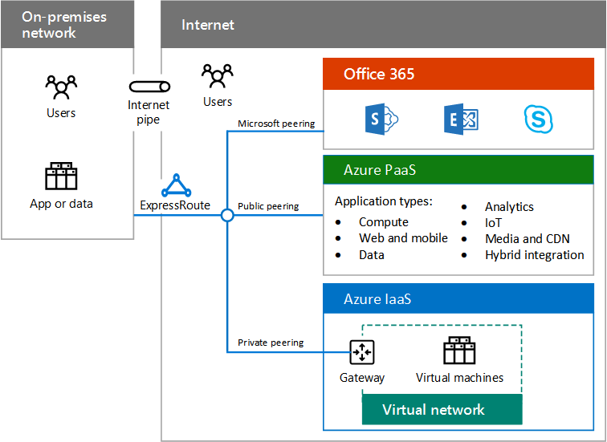

# Panoramica del cloud ibridaHybrid cloud overview

 **Riepilogo:** Informazioni sulla definizione e sugli elementi del cloud ibrido Microsoft.**Summary:** Understand the definition and elements of Microsoft hybrid cloud.
  
Cloud ibrida utilizza le risorse di archiviazione o compute nella rete locale e nel cloud. Cloud ibrida è possibile utilizzare un percorso di migrazione nel cloud le esigenze aziendali e il relativo IT o integrare le piattaforme cloud e i servizi esistenti locali dell'infrastruttura come parte della strategia IT generale.Hybrid cloud uses compute or storage resources on your on-premises network and in the cloud. You can use hybrid cloud as a path to migrate your business and its IT needs to the cloud or integrate cloud platforms and services with your existing on-premises infrastructure as part of your overall IT strategy.
  
## Cloud ibrida MicrosoftMicrosoft hybrid cloud

Cloud ibrida Microsoft è un insieme di scenari aziendali in cui combinare piattaforma Microsoft cloud con un componente locale, ad esempio:Microsoft hybrid cloud is a set of business scenarios that combine a Microsoft cloud platform with an on-premises component, such as: 
  
- Ottenere risultati di ricerca di contenuti in una farm di SharePoint locale e in SharePoint Online in Office 365.Getting search results from content both in an on-premises SharePoint farm and in SharePoint Online in Office 365.
    
- App per dispositivi mobili in esecuzione in Azure che esegue la query su un archivio dati locale.A mobile app running in Azure that queries an on-premises data store.
    
- Una rete intranet IT carico di lavoro in esecuzione su macchine virtuali di Azure.An intranet IT workload running on Azure virtual machines.
    
**Figura 1: Componenti di Microsoft cloud ibrida****Figure 1: Components of the Microsoft hybrid cloud**

  
Nella figura 1 vengono illustrati i componenti del cloud ibrida Microsoft, da una rete locale per il set di Office 365, piattaforma Azure come servizio PaaS () e l'infrastruttura di Azure come un servizio (IaaS) servizi disponibili tramite Internet o una connessione ExpressRoute.Figure 1 shows the components of the Microsoft hybrid cloud, from an on-premises network to the set of Office 365, Azure Platform as a Service (PaaS), and Azure Infrastructure as a Service (IaaS) services available across the Internet or an ExpressRoute connection.
  
Poiché Microsoft ha la soluzione cloud più completa sul mercato, incluso il Software come servizio (SaaS), PaaS e IaaS, è possibile:Because Microsoft has the most complete cloud solution in the marketplace—including Software as a Service (SaaS), PaaS, and IaaS—you can:
  
- Sfruttare gli investimenti locali esistenti quando si esegue la migrazione dei carichi di lavoro e le applicazioni nel cloud.Leverage your existing on-premises investments as you migrate workloads and applications to the cloud.
    
- Incorporare scenari basati su cloud ibrida i piani IT a lungo termine, ad esempio, quando le regole o i criteri non consentono lo spostamento dei carichi di lavoro o dati specifici nel cloud.Incorporate hybrid cloud scenarios into your long-term IT plans, for example, when regulations or policies do not permit moving specific data or workloads to the cloud.
    
- Creare uno scenario ibrido aggiuntive che includono più servizi cloud Microsoft e piattaforme.Create additional hybrid scenarios that include multiple Microsoft cloud services and platforms.
    
Scenari per il cloud ibrida con servizi cloud Microsoft variano con la piattaforma.Scenarios for hybrid cloud with Microsoft cloud services vary with the platform.
  
- SaaSSaaS
    
    Servizi Microsoft SaaS includono Office 365, Microsoft Intune e Microsoft Dynamics 365. Scenari basati su cloud ibrida con Microsoft SaaS combinano questi servizi con applicazioni o servizi locali. Ad esempio, Exchange Online in esecuzione in Office 365 può essere integrata con Skype per 2015 Business che viene distribuito in locale.Microsoft SaaS services include Office 365, Microsoft Intune, and Microsoft Dynamics 365. Hybrid cloud scenarios with Microsoft SaaS combine these services with on-premises services or applications. For example, Exchange Online running in Office 365 can be integrated with Skype for Business 2015 that is deployed on-premises.
    
- PaaS di AzureAzure PaaS
    
    I servizi Microsoft Azure PaaS consentono di creare applicazioni basate su cloud. Scenari basati su cloud ibrida con i servizi di Azure PaaS combinano un'app PaaS Azure con risorse locali o applicazioni. Ad esempio, un'app di Azure PaaS potrebbe in modo sicuro interrogare un archivio dati locale per le informazioni necessarie per visualizzare agli utenti di app per dispositivi mobili.Microsoft Azure PaaS services allow you to create cloud-based applications. Hybrid cloud scenarios with Azure PaaS services combine an Azure PaaS app with on-premises resources or applications. For example, an Azure PaaS app could securely query an on-premises data store for information needed to display to mobile app users.
    
- IaaS di AzureAzure IaaS
    
    Servizi di Azure IaaS consentono di creare ed eseguire carichi di lavoro basate su server IT nel cloud, anziché nel centro dati in locale. Scenari basati su cloud ibrida con i servizi di Azure IaaS include in genere di un carico di lavoro IT che viene eseguito su macchine virtuali in modo trasparente connesso alla rete locale. Gli utenti locali non si noteranno la differenza.Azure IaaS services allow you to build and run server-based IT workloads in the cloud, rather than in your on-premises datacenter. Hybrid cloud scenarios with Azure IaaS services typically consist of an IT workload that runs on virtual machines that is transparently connected to your on-premises network. Your on-premises users will not notice the difference.
    
## Elementi del cloud ibridaElements of hybrid cloud

È necessario considerare gli elementi seguenti durante la pianificazione e l'implementazione di scenari basati su cloud ibrida con Microsoft cloud piattaforme e servizi.You must account for the following elements when planning and implementing hybrid cloud scenarios with Microsoft cloud platforms and services.
  
- ReteNetworking
    
    La rete per scenari basati su cloud ibrida include la connettività per la piattaforma Microsoft cloud e dei servizi e larghezza di banda sufficiente per essere ad alte prestazioni con carichi di picco. Per ulteriori informazioni, vedere [Microsoft Cloud di rete per architetti Enterprise](microsoft-cloud-networking-for-enterprise-architects.md).Networking for hybrid cloud scenarios includes the connectivity to Microsoft cloud platforms and services and enough bandwidth to be performant under peak loads. For more information, see [Microsoft Cloud Networking for Enterprise Architects](microsoft-cloud-networking-for-enterprise-architects.md).
    
- IdentitàIdentity
    
    Identità per gli scenari ibridi SaaS e Azure PaaS può includere Azure Active Directory come provider di identità comuni, che possono essere sincronizzati con locale Windows Server Active Directory o federati con Windows Server Active Directory o altri provider di identità. È inoltre possibile estendere l'infrastruttura di identità in locale per Azure IaaS. Per ulteriori informazioni, vedere [Identità Cloud Microsoft per architetti Enterprise](microsoft-cloud-identity-for-enterprise-architects.md).Identity for SaaS and Azure PaaS hybrid scenarios can include Azure AD as a common identity provider, which can be synchronized with your on-premises Windows Server AD, or federated with Windows Server AD or other identity providers. You can also extend your on-premises Identity infrastructure to Azure IaaS. For more information, see [Microsoft Cloud Identity for Enterprise Architects](microsoft-cloud-identity-for-enterprise-architects.md).
    
- SicurezzaSecurity
    
    Protezione di scenari basati su cloud ibrida include gestione per le identità, la protezione dei dati, gestione di privilegi amministrativi, la consapevolezza delle minacce e l'implementazione della governance e criteri di sicurezza e protezione. Per ulteriori informazioni, vedere [Microsoft Security Cloud per architetti Enterprise](https://technet.microsoft.com/library/dn919927.aspx#security).Security for hybrid cloud scenarios includes protection and management for your identities, data protection, administrative privilege management, threat awareness, and the implementation of governance and security policies. For more information, see [Microsoft Cloud Security for Enterprise Architects](https://technet.microsoft.com/library/dn919927.aspx#security).
    
- GestioneManagement
    
    Gestione di scenari basati su cloud ibrida include la possibilità di gestire le impostazioni, dati, account, criteri e le autorizzazioni e per monitorare lo stato in corso degli elementi dello scenario e le prestazioni. È inoltre possibile utilizzare il set di strumenti stesso, ad esempio Systems Management Server per la gestione delle macchine virtuali di Azure IaaS.Management for hybrid cloud scenarios includes the ability to maintain settings, data, accounts, policies, and permissions and to monitor the ongoing health of the elements of the scenario and its performance. You can also use the same tool set, such as Systems Management Server, for managing virtual machines in Azure IaaS.
    
## Vedere ancheSee Also

[Cloud ibrido Microsoft per Enterprise ArchitectsMicrosoft Hybrid Cloud for Enterprise Architects](microsoft-hybrid-cloud-for-enterprise-architects.md)
  
[Risorse sull'architettura IT del cloud MicrosoftMicrosoft Cloud IT architecture resources](microsoft-cloud-it-architecture-resources.md)

[Guida di orientamento del cloud aziendale Microsoft: risorse per i decision maker del settore ITMicrosoft's Enterprise Cloud Roadmap: Resources for IT Decision Makers](https://sway.com/FJ2xsyWtkJc2taRD)
 

