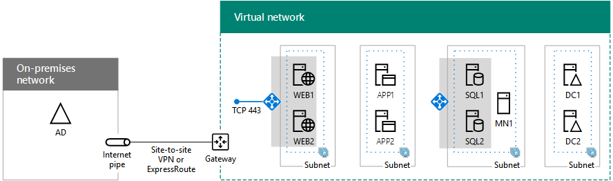

# Scenari cloud ibridi per IaaS di Azure

 **Riepilogo:** Acquisire familiarità con l'architettura ibrida e gli scenari per l'infrastruttura di Microsoft come servizio (IaaS)-basato su cloud offerte in Azure.
  
Estendere l'infrastruttura di gestione delle identità e di calcolo locale nel cloud ospitando i carichi di lavoro IT in esecuzione su reti virtuali Azure cross-premise.  
  
## Architettura per scenario ibrido in IaaS di Azure

La figura 1 mostra l'architettura di scenari ibridi Microsoft basati su IaaS in Azure.
  
**Nella figura 1: Scenari di ibrida basata su IaaS Microsoft in Azure**

  
Per ogni livello dell'architettura:
  
- App e scenari
    
    In genere, un carico di lavoro IT è un'applicazione a disponibilità elevata multilivello composta da macchine virtuali di Azure.
    
- Identità
    
    Aggiunge server di identità, come i controller di dominio di AD di Windows Server, al set di server in esecuzione sulle reti virtuali di Azure per l'autenticazione locale.
    
- Rete
    
    Usa una connessione VPN da sito a sito su Internet o una connessione ExpressRoute con peer privato in IaaS di Azure.
    
- Locale
    
    Contiene identità server che vengono sincronizzate con il server di identità in Azure. Può inoltre contenere risorse cui possono accedere le macchine virtuali in esecuzione in Azure, ad esempio la risorsa di archiviazione e l’infrastruttura di gestione dei sistemi.
    
## Server DirSync per Office 365

L’esecuzione del server di sincronizzazione della directory (DirSync) da una rete virtuale di Azure, come illustrato nella figura 2, è un esempio di come estendere l'infrastruttura di identità e calcolo al cloud.
  
**Figura 2: Server DirSync per Office 365 in Azure IaaS**

  
Nella figura 2, una rete locale ospita un'infrastruttura di Windows Server Active Directory, con un server proxy e un router in corrispondenza del bordo. Il router si connette a un gateway Azure in corrispondenza del bordo di un VNet Azure con una connessione VPN o ExpressRoute sito per sito. All'interno di VNet, un server di DirSync esegue Connetti Azure Active Directory.
  
Un server DirSync per Office 365 sincronizza l'elenco degli account in Windows Server AD con il tenant di Azure AD di un abbonamento a Office 365.
  
Un server DirSync è un server basato su Windows che esegue Azure AD Connect. Per un provisioning più veloce o per ridurre il numero di server in locale nell'organizzazione, distribuire il server DirSync in una rete virtuale (VNet) in Azure IaaS.
  
Il server DirSync sonda Windows Server AD per le modifiche, quindi le sincronizza con l’abbonamento a Office 365.
  
Per ulteriori informazioni, vedere [Distribuzione di Office 365 DirSync in Azure](https://technet.microsoft.com/library/dn635310.aspx).
  
## Applicazione LOB (line-of-business)

La figura 3 mostra la configurazione di un'applicazione LOB basata su server in esecuzione su IaaS di Azure.
  
**Figura 3: Applicazione LOB in Azure IaaS**

  
Nella figura 3, una rete locale ospita un'infrastruttura di identità e utenti. È collegato a un gateway IaaS di Azure con una connessione VPN da sito a sito o ExpressRoute. IaaS di Azure ospita una rete virtuale contenente i server dell'applicazione LOB.
  
È possibile creare le applicazioni LOB in esecuzione su macchine virtuali di Azure, che si trovano in subnet di un VNet Azure in un Data Center Azure (noto anche come posizione).
  
Dato che essenzialmente si sta estendendo l'infrastruttura locale ad Azure, è necessario assegnare uno spazio di indirizzi privato unico alle reti virtuali e aggiornare le tabelle di routing locali per garantire l'accessibilità a ogni rete virtuale.
  
Una volta stabilita la connessione, queste macchine virtuali possono essere gestite con connessioni desktop remoto o con un software di gestione dei sistemi, proprio come i server locali.
  
Configurando le porte pubbliche, queste macchine virtuali sono accessibili anche da Internet per utenti remoti o mobili.
  
Per una configurazione di prova, vedere [simulato tra locali reti virtuali di Azure](simulated-cross-premises-virtual-network-in-azure.md).
  
Attributi di applicazioni LOB ospitate su macchine virtuali di Azure:
  
- Più livelli
    
    Applicazioni LOB tipiche utilizzano un approccio graduale. I set di server forniscono identità, elaborazione di database, elaborazione logica e applicazioni, server Web front-end per l'accesso di dipendenti o clienti.  
    
- Disponibilità elevata
    
    Applicazioni LOB tipiche forniscono disponibilità elevata utilizzando più server in ogni livello. IaaS di Azure fornisce un contratto di servizio di operatività del 99,9% per i server in set di disponibilità di Azure.  
    
- Distribuzione del carico
    
    Per distribuire il carico del traffico di rete tra i server di un livello, è possibile usare un bilanciamento del carico di Azure interno o con connessione Internet. In alternativa, usare un'applicazione di bilanciamento del carico dedicata disponibile in Azure Marketplace.
    
- Sicurezza
    
    Per proteggere i server dal traffico in ingresso provenienti da Internet, è possibile utilizzare gruppi di sicurezza di rete Azure. Puoi definire di concedere o negare il traffico verso una subnet o l'interfaccia di rete di una singola macchina virtuale.
    
## Farm di SharePoint Server 2016 in Azure

Un esempio di applicazione LOB altamente disponibile di più livelli in Azure è una farm di SharePoint Server 2016, come illustrato nella figura 4.
  
**Figura 4: Una disponibilità elevata 2016 di SharePoint Server farm in Azure IaaS**

  
Nella figura 4, una rete locale ospita un'infrastruttura di identità e utenti. È collegato a un gateway IaaS di Azure con una connessione VPN da sito a sito o ExpressRoute. La rete virtuale di Azure contiene i server della farm di SharePoint Server 2016, che include livelli separati per server front-end, server di applicazioni, cluster di SQL Server e controller di dominio.
  
Questa configurazione offre i seguenti attributi delle applicazioni LOB in Azure:  
  
- Livelli
    
    Server che eseguono diversi ruoli all'interno della farm crea i livelli e ogni livello ha una propria subnet.
    
- Disponibilità elevata
    
    È ottenuta utilizzando più di un server in ogni livello e tutti i server di un livello di immissione nello stesso set di disponibilità.
    
- Distribuzione del carico
    
    Servizi di bilanciamento del carico Azure interno distribuiscono il traffico web client in arrivo ai server front-end (WEB1 e WEB2) e all'indirizzo IP del listener del cluster SQL Server (SQL1, SQL2 e MN1).
    
- Sicurezza
    
    Gruppi di sicurezza di rete per ogni subnet consentono di configurare il traffico in ingresso e in uscita consentito.
    
Seguire questo percorso per l’adozione:
  
1. Valutare e sperimentare
    
    Vedere [2016 di SharePoint Server in Microsoft Azure](https://technet.microsoft.com/library/mt779107%28v=office.16%29.aspx) per acquisire familiarità con i vantaggi dell'esecuzione di SharePoint Server 2016 in Azure.
    
    Vedere [Intranet SharePoint Server 2016 nell'ambiente di sviluppo e di testing Azure](https://technet.microsoft.com/library/mt806351%28v=office.16%29.aspx) per creare un ambiente di sviluppo e di testing simulate
    
2. Struttura
    
    Vedere [Progettazione di una farm di SharePoint Server 2016 in Azure](https://technet.microsoft.com/library/mt779108%28v=office.16%29.aspx) per eseguire un processo per determinare il set di rete Azure IaaS, compute ed elementi di archiviazione per ospitare la farm e le relative impostazioni.
    
3. Distribuzione
    
    Vedere [distribuzione di SharePoint Server 2016 con SQL Server AlwaysOn Availability Groups in Azure](https://technet.microsoft.com/library/mt793552%28v=office.16%29.aspx) per eseguire la configurazione end-to-end della farm di disponibilità elevata in cinque fasi.
    
## Identità federata per Office 365 in Azure

Un altro esempio di un'applicazione LOB a più livelli e altamente disponibile in Azure è identità federata per Office 365.
  
**Figura 5: Un'infrastruttura di identità federata di disponibilità elevata per Office 365 in Azure IaaS**

  
Nella figura 5, una rete locale ospita un'infrastruttura di identità e degli utenti. Si connette a un gateway Azure IaaS con una connessione VPN o ExpressRoute sito per sito. VNet Azure contiene il server proxy web, server di Active Directory Federation Services (ADFS) e i controller di dominio Windows Server Active Directory (AD).
  
Questa configurazione offre i seguenti attributi delle applicazioni LOB in Azure: 
  
- **Livelli:** Sono disponibili i livelli per server proxy web, server AD FS e controller di dominio di Windows Server Active Directory.
    
- **Distribuzione del carico:** Un servizio di bilanciamento del carico esterno Azure distribuisce le richieste di autenticazione client in ingresso per il proxy web e un servizio di bilanciamento del carico interno Azure distribuisce le richieste di autenticazione per i server ADFS.
    
Seguire questo percorso per l’adozione:
  
1. Valutare e sperimentare
    
    [Identità federata per l'ambiente di sviluppo e di testing di Office 365](federated-identity-for-your-office-365-dev-test-environment.md) per creare un ambiente di sviluppo e di testing simulato per l'autenticazione federata con Office 365, vedere.
    
2. Distribuzione
    
    Vedere [l'autenticazione federata distribuire la disponibilità elevata per Office 365 in Azure](deploy-high-availability-federated-authentication-for-office-365-in-azure.md) per eseguire la configurazione end-to-end della disponibilità elevata dell'infrastruttura ADFS in cinque fasi.
    
Consultare queste risorse aggiuntive:
  
- [Architettura degli ambienti ibridi di Cloud](https://gallery.technet.microsoft.com/Architecting-Hybrid-Cloud-a7dc9f24/file/147475/1/Architecting%20Hybrid%20Cloud%20Environments%20V1.docx)
    
- [Estensione del centro dati per il corso Cloud Microsoft Virtual Academy](https://mva.microsoft.com/en-US/training-courses/extend-your-datacenter-to-the-cloud-13908?l=7fG3tAouB_7100115881)
    
- [Progettare e creare un'applicazione LOB in Azure](https://techcommunity.microsoft.com/t5/CAAB-Cloud-Adoption-Advisory/EXTRA-November-2016-Webinar/m-p/30058#M41)
    
## Vedere anche

[Cloud ibrido Microsoft per Enterprise Architects](microsoft-hybrid-cloud-for-enterprise-architects.md)
  
[Risorse sull'architettura IT del cloud Microsoft](microsoft-cloud-it-architecture-resources.md)

[Guida di orientamento del cloud aziendale Microsoft: risorse per i decision maker del settore IT](https://sway.com/FJ2xsyWtkJc2taRD)

