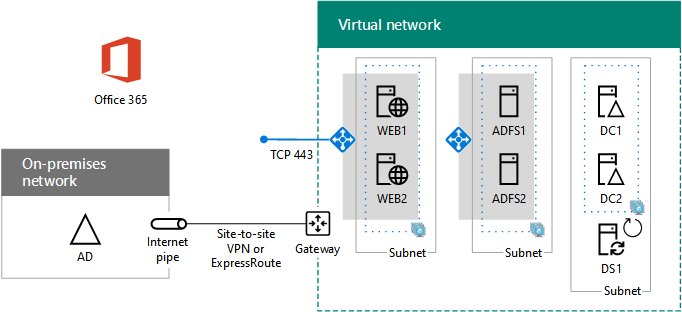

# Scenari cloud ibridi per IaaS di AzureHybrid cloud scenarios for Azure IaaS

 **Riepilogo:** Acquisire familiarità con l'architettura ibrida e gli scenari per l'infrastruttura di Microsoft come servizio (IaaS)-basato su cloud offerte in Azure.**Summary:** Understand the hybrid architecture and scenarios for Microsoft's Infrastructure as a Service (IaaS)-based cloud offerings in Azure.
  
Estendere l'infrastruttura di gestione delle identità e di calcolo locale nel cloud ospitando i carichi di lavoro IT in esecuzione su reti virtuali Azure cross-premise. Extend your on-premises computing and identity infrastructure into the cloud by hosting IT workloads running in cross-premises Azure virtual networks (VNets). 
  
## Architettura per scenario ibrido in IaaS di AzureAzure IaaS hybrid scenario architecture

La figura 1 mostra l'architettura di scenari ibridi Microsoft basati su IaaS in Azure.Figure 1 shows the architecture of Microsoft IaaS-based hybrid scenarios in Azure.
  
**Nella figura 1: Scenari di ibrida basata su IaaS Microsoft in Azure****Figure 1: Microsoft IaaS-based hybrid scenarios in Azure**

  
Per ogni livello dell'architettura:For each layer of the architecture:
  
- App e scenariApps and scenarios
    
    In genere, un carico di lavoro IT è un'applicazione a disponibilità elevata multilivello composta da macchine virtuali di Azure.An IT workload is typically a multi-tier, highly-available application composed of Azure virtual machines (VMs).
    
- IdentitàIdentity
    
    Aggiunge server di identità, come i controller di dominio di AD di Windows Server, al set di server in esecuzione sulle reti virtuali di Azure per l'autenticazione locale.Add identity servers, such as Windows Server AD domain controllers, to the set of servers running in Azure VNets for local authentication.
    
- ReteNetwork
    
    Usa una connessione VPN da sito a sito su Internet o una connessione ExpressRoute con peer privato in IaaS di Azure.Use either a site-to-site VPN connection over the Internet or an ExpressRoute connection with private peering to Azure IaaS.
    
- LocaleOn-premises
    
    Contiene identità server che vengono sincronizzate con il server di identità in Azure. Può inoltre contenere risorse cui possono accedere le macchine virtuali in esecuzione in Azure, ad esempio la risorsa di archiviazione e l’infrastruttura di gestione dei sistemi.Contains identity servers that are synchronized with the identity servers running in Azure. Can also contain resources that VMs running in Azure can access, such as storage and systems management infrastructure.
    
## Server DirSync per Office 365DirSync server for Office 365

L’esecuzione del server di sincronizzazione della directory (DirSync) da una rete virtuale di Azure, come illustrato nella figura 2, è un esempio di come estendere l'infrastruttura di identità e calcolo al cloud.Running your directory synchronization (DirSync) server from an Azure VNet, as shown in Figure 2, is an example of extending your computing and identity infrastructure to the cloud.
  
**Figura 2: Server DirSync per Office 365 in Azure IaaS****Figure 2: DirSync server for Office 365 in Azure IaaS**

  
Nella figura 2, una rete locale ospita un'infrastruttura di Windows Server Active Directory, con un server proxy e un router in corrispondenza del bordo. Il router si connette a un gateway Azure in corrispondenza del bordo di un VNet Azure con una connessione VPN o ExpressRoute sito per sito. All'interno di VNet, un server di DirSync esegue Connetti Azure Active Directory.In Figure 2, an on-premises network hosts a Windows Server AD infrastructure, with a proxy server and a router at its edge. The router connects to an Azure gateway at the edge of an Azure VNet with a site-to-site VPN or ExpressRoute connection. Inside the VNet, a DirSync server runs Azure AD Connect.
  
Un server DirSync per Office 365 sincronizza l'elenco degli account in Windows Server AD con il tenant di Azure AD di un abbonamento a Office 365.A DirSync server for Office 365 synchronizes the list of accounts in Windows Server AD with the Azure AD tenant of an Office 365 subscription.
  
Un server DirSync è un server basato su Windows che esegue Azure AD Connect. Per un provisioning più veloce o per ridurre il numero di server in locale nell'organizzazione, distribuire il server DirSync in una rete virtuale (VNet) in Azure IaaS.A DirSync server is a Windows-based server that runs Azure AD Connect. For faster provisioning or to reduce the number of on-premises servers in your organization, deploy your DirSync server in a virtual network (VNet) in Azure IaaS.
  
Il server DirSync sonda Windows Server AD per le modifiche, quindi le sincronizza con l’abbonamento a Office 365.The DirSync server polls Windows Server AD for changes and then synchronizes them with the Office 365 subscription.
  
Per ulteriori informazioni, vedere [Distribuzione di Office 365 DirSync in Azure](https://technet.microsoft.com/library/dn635310.aspx).For more information, see [Deploy Office 365 DirSync in Azure](https://technet.microsoft.com/library/dn635310.aspx).
  
## Applicazione LOB (line-of-business)Line of business (LOB) application

La figura 3 mostra la configurazione di un'applicazione LOB basata su server in esecuzione su IaaS di Azure.Figure 3 shows the configuration of a server-based LOB application running in Azure IaaS.
  
**Figura 3: Applicazione LOB in Azure IaaS****Figure 3: LOB application in Azure IaaS**

  
Nella figura 3, una rete locale ospita un'infrastruttura di identità e utenti. È collegato a un gateway IaaS di Azure con una connessione VPN da sito a sito o ExpressRoute. IaaS di Azure ospita una rete virtuale contenente i server dell'applicazione LOB.In Figure 3, an on-premises network hosts an identity infrastructure and users. It is connected to an Azure IaaS gateway with a site-to-site VPN or ExpressRoute connection. Azure IaaS hosts a virtual network containing the servers of the LOB application.
  
È possibile creare le applicazioni LOB in esecuzione su macchine virtuali di Azure, che si trovano in subnet di un VNet Azure in un Data Center Azure (noto anche come posizione).You can create LOB applications running on Azure VMs, which reside on subnets of an Azure VNet in an Azure datacenter (also known as a location).
  
Dato che essenzialmente si sta estendendo l'infrastruttura locale ad Azure, è necessario assegnare uno spazio di indirizzi privato unico alle reti virtuali e aggiornare le tabelle di routing locali per garantire l'accessibilità a ogni rete virtuale.Because you are essentially extending your on-premises infrastructure to Azure, you must assign unique private address space to your VNets and update your on-premises routing tables to ensure reachability to each VNet.
  
Una volta stabilita la connessione, queste macchine virtuali possono essere gestite con connessioni desktop remoto o con un software di gestione dei sistemi, proprio come i server locali.Once connected, these VMs can be managed with remote desktop connections or with your systems management software, just like your on-premises servers.
  
Configurando le porte pubbliche, queste macchine virtuali sono accessibili anche da Internet per utenti remoti o mobili.By configuring publically-exposed ports, these VMs can also be accessed from the Internet by mobile or remote users.
  
Per una configurazione di prova, vedere [simulato tra locali reti virtuali di Azure](simulated-cross-premises-virtual-network-in-azure.md).For a proof-of-concept configuration, see [Simulated cross-premises virtual network in Azure](simulated-cross-premises-virtual-network-in-azure.md).
  
Attributi di applicazioni LOB ospitate su macchine virtuali di Azure:Attributes of LOB applications hosted on Azure VMs are the following:
  
- Più livelliMultiple tiers
    
    Applicazioni LOB tipiche utilizzano un approccio graduale. I set di server forniscono identità, elaborazione di database, elaborazione logica e applicazioni, server Web front-end per l'accesso di dipendenti o clienti. Typical LOB applications use a tiered approach. Sets of servers provide identity, database processing, application and logic processing, and front-end web servers for employee or customer access. 
    
- Disponibilità elevataHigh availability
    
    Applicazioni LOB tipiche forniscono disponibilità elevata utilizzando più server in ogni livello. IaaS di Azure fornisce un contratto di servizio di operatività del 99,9% per i server in set di disponibilità di Azure. Typical LOB applications provide high availability by using multiple servers in each tier. Azure IaaS provides a 99.9% uptime SLA for servers in Azure availability sets. 
    
- Distribuzione del caricoLoad distribution
    
    Per distribuire il carico del traffico di rete tra i server di un livello, è possibile usare un bilanciamento del carico di Azure interno o con connessione Internet. In alternativa, usare un'applicazione di bilanciamento del carico dedicata disponibile in Azure Marketplace.To distribute the load of network traffic among multiple servers in a tier, you can use an Internet-facing or internal Azure load balancer. Or, you can use a dedicated load balancer appliance available from the Azure marketplace.
    
- SicurezzaSecurity
    
    Per proteggere i server dal traffico in ingresso provenienti da Internet, è possibile utilizzare gruppi di sicurezza di rete Azure. Puoi definire di concedere o negare il traffico verso una subnet o l'interfaccia di rete di una singola macchina virtuale.To protect servers from unsolicited incoming traffic from the Internet, you can use Azure network security groups. You can define allowed or denied traffic for a subnet or the network interface of an individual virtual machine.
    
## Farm di SharePoint Server 2016 in AzureSharePoint Server 2016 farm in Azure

Un esempio di applicazione LOB altamente disponibile di più livelli in Azure è una farm di SharePoint Server 2016, come illustrato nella figura 4.An example of a multi-tier, highly-available LOB application in Azure is a SharePoint Server 2016 farm, as shown in Figure 4.
  
**Figura 4: Una disponibilità elevata 2016 di SharePoint Server farm in Azure IaaS****Figure 4: A high-availability SharePoint Server 2016 farm in Azure IaaS**

  
Nella figura 4, una rete locale ospita un'infrastruttura di identità e utenti. È collegato a un gateway IaaS di Azure con una connessione VPN da sito a sito o ExpressRoute. La rete virtuale di Azure contiene i server della farm di SharePoint Server 2016, che include livelli separati per server front-end, server di applicazioni, cluster di SQL Server e controller di dominio.In Figure 4, an on-premises network hosts an identity infrastructure and users. It is connected to an Azure IaaS gateway with a site-to-site VPN or ExpressRoute connection. The Azure VNet contains the servers of the SharePoint Server 2016 farm, which includes separate tiers for the front-end servers, the application servers, the SQL Server cluster, and the domain controllers.
  
Questa configurazione offre i seguenti attributi delle applicazioni LOB in Azure: This configuration has the following attributes of LOB applications in Azure: 
  
- LivelliTiers
    
    Server che eseguono diversi ruoli all'interno della farm crea i livelli e ogni livello ha una propria subnet.Servers running different roles within the farm create the tiers and each tier has its own subnet.
    
- Disponibilità elevataHigh-availability
    
    È ottenuta utilizzando più di un server in ogni livello e tutti i server di un livello di immissione nello stesso set di disponibilità.Achieved by using more than one server in each tier and placing all the servers of a tier in the same availability set.
    
- Distribuzione del caricoLoad distribution
    
    Servizi di bilanciamento del carico Azure interno distribuiscono il traffico web client in arrivo ai server front-end (WEB1 e WEB2) e all'indirizzo IP del listener del cluster SQL Server (SQL1, SQL2 e MN1).Internal Azure load balancers distribute the incoming client web traffic to the front-end servers (WEB1 and WEB2) and to the listener IP address of the SQL Server cluster (SQL1, SQL2, and MN1).
    
- SicurezzaSecurity
    
    Gruppi di sicurezza di rete per ogni subnet consentono di configurare il traffico in ingresso e in uscita consentito.Network security groups for each subnet let you to configure allowed inbound and outbound traffic.
    
Seguire questo percorso per l’adozione:Follow this path for successful adoption:
  
1. Valutare e sperimentareEvaluate and experiment
    
    Vedere [2016 di SharePoint Server in Microsoft Azure](https://technet.microsoft.com/library/mt779107%28v=office.16%29.aspx) per acquisire familiarità con i vantaggi dell'esecuzione di SharePoint Server 2016 in Azure.See [SharePoint Server 2016 in Microsoft Azure](https://technet.microsoft.com/library/mt779107%28v=office.16%29.aspx) to understand the benefits of running SharePoint Server 2016 in Azure.
    
    Vedere [Intranet SharePoint Server 2016 nell'ambiente di sviluppo e di testing Azure](https://technet.microsoft.com/library/mt806351%28v=office.16%29.aspx) per creare un ambiente di sviluppo e di testing simulateSee [Intranet SharePoint Server 2016 in Azure dev/test environment](https://technet.microsoft.com/library/mt806351%28v=office.16%29.aspx) to build a simulated dev/test environment
    
2. StrutturaDesign
    
    Vedere [Progettazione di una farm di SharePoint Server 2016 in Azure](https://technet.microsoft.com/library/mt779108%28v=office.16%29.aspx) per eseguire un processo per determinare il set di rete Azure IaaS, compute ed elementi di archiviazione per ospitare la farm e le relative impostazioni.See [Designing a SharePoint Server 2016 farm in Azure](https://technet.microsoft.com/library/mt779108%28v=office.16%29.aspx) to step through a process to determine the set of Azure IaaS networking, compute, and storage elements to host your farm and their settings.
    
3. DistribuzioneDeploy
    
    Vedere [distribuzione di SharePoint Server 2016 con SQL Server AlwaysOn Availability Groups in Azure](https://technet.microsoft.com/library/mt793552%28v=office.16%29.aspx) per eseguire la configurazione end-to-end della farm di disponibilità elevata in cinque fasi.See [Deploying SharePoint Server 2016 with SQL Server AlwaysOn Availability Groups in Azure](https://technet.microsoft.com/library/mt793552%28v=office.16%29.aspx) to step through the end-to-end configuration of the high-availability farm in five phases.
    
## Identità federata per Office 365 in AzureFederated identity for Office 365 in Azure

Un altro esempio di un'applicazione LOB a più livelli e altamente disponibile in Azure è identità federata per Office 365.Another example of a multi-tier, highly-available LOB application in Azure is federated identity for Office 365.
  
**Figura 5: Un'infrastruttura di identità federata di disponibilità elevata per Office 365 in Azure IaaS****Figure 5: A high-availability federated identity infrastructure for Office 365 in Azure IaaS**

  
Nella figura 5, una rete locale ospita un'infrastruttura di identità e degli utenti. Si connette a un gateway Azure IaaS con una connessione VPN o ExpressRoute sito per sito. VNet Azure contiene il server proxy web, server di Active Directory Federation Services (ADFS) e i controller di dominio Windows Server Active Directory (AD).In Figure 5, an on-premises network hosts an identity infrastructure and users. It is connected to an Azure IaaS gateway with a site-to-site VPN or ExpressRoute connection. The Azure VNet contains web proxy servers, Active Directory Federation Services (AD FS) servers, and Windows Server Active Directory (AD) domain controllers.
  
Questa configurazione offre i seguenti attributi delle applicazioni LOB in Azure: This configuration has the following attributes of LOB applications in Azure:
  
- **Livelli:** Sono disponibili i livelli per server proxy web, server AD FS e controller di dominio di Windows Server Active Directory.**Tiers:** There are tiers for web proxy servers, AD FS servers, and Windows Server AD domain controllers.
    
- **Distribuzione del carico:** Un servizio di bilanciamento del carico esterno Azure distribuisce le richieste di autenticazione client in ingresso per il proxy web e un servizio di bilanciamento del carico interno Azure distribuisce le richieste di autenticazione per i server ADFS.**Load distribution:** An external Azure load balancer distributes the incoming client authentication requests to the web proxies and an internal Azure load balancer distributes authentication requests to the AD FS servers.
    
Seguire questo percorso per l’adozione:Follow this path for successful adoption:
  
1. Valutare e sperimentareEvaluate and experiment
    
    [Identità federata per l'ambiente di sviluppo e di testing di Office 365](federated-identity-for-your-office-365-dev-test-environment.md) per creare un ambiente di sviluppo e di testing simulato per l'autenticazione federata con Office 365, vedere.See [Federated identity for your Office 365 dev/test environment](federated-identity-for-your-office-365-dev-test-environment.md) to build a simulated dev/test environment for federated authentication with Office 365.
    
2. DistribuzioneDeploy
    
    Vedere [l'autenticazione federata distribuire la disponibilità elevata per Office 365 in Azure](deploy-high-availability-federated-authentication-for-office-365-in-azure.md) per eseguire la configurazione end-to-end della disponibilità elevata dell'infrastruttura ADFS in cinque fasi.See [Deploy high availability federated authentication for Office 365 in Azure](deploy-high-availability-federated-authentication-for-office-365-in-azure.md) to step through the end-to-end configuration of the high availability AD FS infrastructure in five phases.
    
Consultare queste risorse aggiuntive:See these additional resources:
  
- [Architettura degli ambienti ibridi di CloudArchitecting Hybrid Cloud Environments](https://gallery.technet.microsoft.com/Architecting-Hybrid-Cloud-a7dc9f24/file/147475/1/Architecting%20Hybrid%20Cloud%20Environments%20V1.docx)
    
- [Estensione del centro dati per il corso Cloud Microsoft Virtual AcademyExtend Your Datacenter to the Cloud Microsoft Virtual Academy course](https://mva.microsoft.com/en-US/training-courses/extend-your-datacenter-to-the-cloud-13908?l=7fG3tAouB_7100115881)
    
- [Progettare e creare un'applicazione LOB in AzureDesign and Build an LOB application in Azure ](https://techcommunity.microsoft.com/t5/CAAB-Cloud-Adoption-Advisory/EXTRA-November-2016-Webinar/m-p/30058#M41)
    
## Vedere ancheSee Also

[Cloud ibrido Microsoft per Enterprise ArchitectsMicrosoft Hybrid Cloud for Enterprise Architects](microsoft-hybrid-cloud-for-enterprise-architects.md)
  
[Risorse sull'architettura IT del cloud MicrosoftMicrosoft Cloud IT architecture resources](microsoft-cloud-it-architecture-resources.md)

[Guida di orientamento del cloud aziendale Microsoft: risorse per i decision maker del settore ITMicrosoft's Enterprise Cloud Roadmap: Resources for IT Decision Makers](https://sway.com/FJ2xsyWtkJc2taRD)

