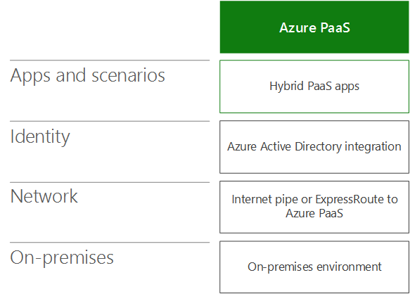
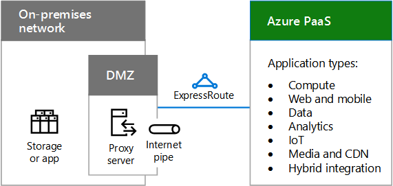
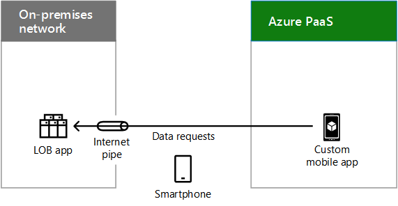
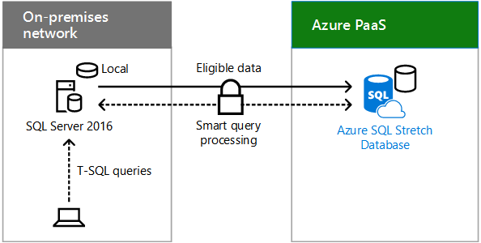

# Scenari basati su cloud ibrida per Azure PaaS

 **Riepilogo:** Acquisire familiarità con l'architettura ibrida e gli scenari per la piattaforma Microsoft come servizio (PaaS)-basato su cloud offerte in Azure.
  
Combinare dati locali o le risorse di elaborazione con nuove o convertire applicazioni in esecuzione in Azure PaaS, che possono trarre vantaggio cloud prestazioni, l'affidabilità e la scala e fornire supporto migliorato per gli utenti mobili. 
  
## Architettura di uno scenario ibrido PaaS Azure

Nella figura 1 illustra l'architettura di scenari basati su PaaS ibridi Microsoft in Azure.
  
**Nella figura 1: Scenari di ibrida basata su PaaS Microsoft in Azure**

  
Per ogni livello dell'architettura:
  
- App e scenari
    
    Un ambiente ibrido applicazione PaaS viene eseguito in Azure e utilizza risorse compute o l'archiviazione in locale.
    
- Identità
    
    È costituita dalla sincronizzazione delle directory o la federazione con un provider di identità di terze parti.
    
- Rete
    
    È costituita dal canale Internet esistente o una connessione ExpressRoute con peering pubblica per Azure PaaS. È necessario includere un modo per l'applicazione PaaS Azure accedere alla risorsa compute o l'archiviazione in locale.
    
- Locale
    
    È costituita da identità e la protezione dell'infrastruttura e line-of business (LOB) applicazioni o server di database, un'applicazione di Azure PaaS può accedere in modo sicuro esistenti.
    
## Applicazione di ibrida PaaS Azure

Nella figura 2 viene illustrata la configurazione di un'applicazione ibrida in esecuzione in Azure.
  
**Nella figura 2: Applicazione ibrida basata su PaaS Azure**

  
Nella figura 2, una rete locale ospita archiviazione o applicazioni server e una DMZ contenente un server proxy. Si connette ai servizi di Azure PaaS tramite Internet o con una connessione ExpressRoute.
  
Un'organizzazione, è possibile effettuare le relative risorse compute o l'archiviazione disponibili per l'applicazione ibrida PaaS Azure per:
  
- Hosting delle risorse nei server DMZ.
    
- Hosting di un server proxy inverso nella DMZ, che consente le richieste di utenti autenticate, in ingresso, basato su HTTPS per la risorsa che si trova in locale.
    
L'app Azure è possibile utilizzare le credenziali da:
  
- Azure Active Directory, che possono essere sincronizzati con il provider di identità in locale, ad esempio Windows Server Active Directory.
    
- Un provider di identità di terze parti.
    
### Applicazione di esempio Azure PaaS ibrida

Nella figura 3 viene mostrata un'applicazione di ibrida di esempio in esecuzione in Azure.
  
**Figura 3: Un esempio di un'applicazione basata su Azure PaaS ibrida**

  
Nella figura 3, un host di rete locale un LOB App Azure PaaS ospita un'applicazione personalizzata per dispositivi mobili. Un dispositivo smartphone su Internet accede l'app personalizzata per dispositivi mobili in Azure, che invia le richieste di dati per l'applicazione LOB locale.
  
In questo esempio Azure PaaS ibrida applicazione sia un'app per dispositivi mobili personalizzata che fornisce informazioni aggiornate sui contatti sui dipendenti. Lo scenario ibrido end-to-end è costituito da:
  
- Una smartphone app che richiede la convalida, le credenziali locali per l'esecuzione.
    
- Un'applicazione personalizzata per dispositivi mobili in esecuzione in Azure PaaS, che richiede informazioni sui dipendenti specifici in base alle query da app smartphone dell'utente.
    
- Un server proxy inverso nella DMZ che convalida l'app per dispositivi mobili personalizzato e inoltra la richiesta.
    
- Una farm di server applicazioni LOB che gestisce la richiesta di contatto, soggette alle autorizzazioni dell'account dell'utente.
    
Dal momento che il provider di identità locale è stato sincronizzato con Azure Active Directory, l'app per dispositivi mobili personalizzato e le applicazioni LOB possano convalidare il richiedente nome dell'account utente.
  
## Estensione database con SQL Server 2016

Estensione database è una funzionalità di SQL Server 2016 che consente di spostare in modo sicuro e in modo trasparente freddi dati, ad esempio dati business chiuso in una tabella di grandi dimensioni che contiene informazioni sugli ordini, a un database SQL adatta in Azure.
  
Quando estesa, il contenuto di un'istanza di SQL Server, un database o anche una singola tabella è la combinazione di dati locali nel server SQL Server 2016 e dati remoti in Azure. Dati diventa idonei per Ridimensiona vengono automaticamente spostati Azure da SQL Server 2016.
  
Database Ridimensiona con SQL Server 2016 illustrato nella figura 4.
  
**Figura 4: Database esteso con SQL Server 2016**

  
Nella figura 4, una rete locale ospita un server che esegue SQL Server 2016 con un database locale di piccole dimensioni. Azure PaaS ospita un'istanza di Database Ridimensiona Azure SQL Server con la parte estesa del database. Query T-SQL da un utente locale inviati a SQL server in locale in modo sicuro vengono inoltrate al Database Ridimensiona SQL Azure, che restituisce i risultati all'utente richiedente.
  
 Le query utente che includono i dati cronologici vengono inoltrate in modo trasparente al database esteso di SQL Azure. Le query non devono essere scritte nuovamente, anche se la tabella viene estesa.
  
Il database esteso fornisce un'opzione conveniente per l'archiviazione a lungo termine e l'accesso trasparente ai dati cronologici. Consente inoltre di risolvere problemi relativi a prestazioni e disponibilità che si verificano quando le tabelle diventano molto grandi.
  
Per ulteriori informazioni, vedere [Database adatta](https://msdn.microsoft.com/library/dn935011.aspx).
  
## See Also

[Cloud ibrido Microsoft per Enterprise Architects](microsoft-hybrid-cloud-for-enterprise-architects.md)
  
[Risorse sull'architettura IT del cloud Microsoft](microsoft-cloud-it-architecture-resources.md)

[Guida di orientamento del cloud aziendale Microsoft: risorse per i decision maker del settore IT](https://sway.com/FJ2xsyWtkJc2taRD)

