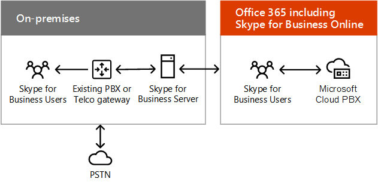
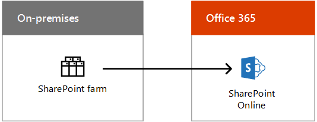
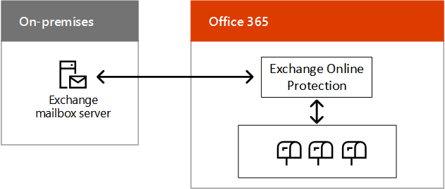

# Scenari per il cloud ibrido per SaaS Microsoft (Office 365)

 **Sintesi:** Comprendere l'architettura ibrida e gli scenari delle offerte cloud basate sul software distribuito come servizio Microsoft (SaaS) in Office 365.
  
Combina le distribuzioni locali di Exchange, SharePoint o Skype for Business con le rispettive controparti in Office 365 come parte di una migrazione cloud o di una strategia di integrazione a lungo termine.
  
## Architettura per scenario ibrido in SaaS Microsoft

La figura 1 mostra l'architettura di scenari ibridi Microsoft basati su SaaS in Office 365.
  
**Figura 1: scenari ibridi Microsoft basati su SaaS per Office 365**

  
Per ogni livello dell'architettura:
  
- App e scenari
    
    Esiste una serie di scenari ibridi basati su SaaS, che si allineano ai prodotti server Office e alle rispettive controparti in Office 365:
    
  - Exchange Server combinato con Exchange Online (Exchange Server ibrido)
    
  - Skype for Business Server combinato con Skype for Business Online e i nuovi scenari con Cloud PBX e la versione del connettore cloud
    
  - SharePoint Server 2016 o SharePoint Server 2013 combinati con SharePoint Online (scenari multipli)
    
    Esiste anche Exchange Online con Skype for Business Server locale, uno scenario ibrido di prodotto incrociato.
    
- Identità
    
    Può includere la sincronizzazione della directory con Windows Server AD locale. In alternativa, è possibile configurare Azure AD in modo da attuare federazione con provider di identità di terze parti.
    
- Rete
    
    È costituito dalla pipe Internet esistente o da una connessione ExpressRoute con il peering Microsoft per Office 365 o Dynamics 365.
    
- Locale
    
    Può essere costituito da server esistenti di Exchange, SharePoint e Skype for Business, che devono essere aggiornati alle versioni più recenti. È quindi possibile combinarli con le rispettive controparti in Office 365 per gli scenari ibridi.
    
Impostare l'[Ambiente di sviluppo/test di Office 365](office-365-dev-test-environment.md).
  
## Skype for Business 2015 ibrido

Skype for Business 2015 ibrido consente di combinare una distribuzione locale esistente con Skype for Business Online. Alcuni utenti sono ospitati in locale e alcuni sono ospitati online; tuttavia, condividono lo stesso dominio SIP (Session Initiation Protocol), come contoso.com. Puoi usare questa configurazione ibrida per migrare dall'ambiente locale a Office 365 in base alle esigenze di pianificazione. È possibile integrare Skype for Business 2015 con Exchange Online.
  
**Figura 2: configurazione ibrida di Skype for Business 2015**

  
Nella figura 2 viene mostrata la configurazione ibrida di Skype for Business 2015, la quale comprende il pool Front End di Skype for Business 2015 locale e il server perimetrale che comunica con Skype for Business Online in Office 365.
  
Per ulteriori informazioni, vedere:
  
- [Pianificare la connettività ibrida tra Skype for Business Server e Skype for Business Online]((https://technet.microsoft.com/library/jj205403.aspx))
    
- [Configurazione ibride supportate per Skype for Business Server 2015]((https://technet.microsoft.com/library/jj945633.aspx))
    
- [Versione ibrida di Skype for Business]((http://hybrid.office.com/skype-for-business/))
    
## Cloud PBX con Skype for Business Server

Cloud PBX con Skype for Business Server consente di trasferire una distribuzione locale di Skype for Business Server esistente in una topologia con connettività PSTN (Public Switched Telephone Network).  
  
**Figura 3: cloud PBX con Skype for Business Server**

  
Nella figura 3 viene mostrata la configurazione di Cloud PBX con Skype for Business Server, che comprende un gateway PBX o Telco locale, uno Skype for Business Server e il PSTN connesso al Cloud PBX di Microsoft in Office 365, che include Skype for Business Online.
  
Gli utenti nell'organizzazione ospitati nel cloud possono ricevere servizi PBX (Private Branch eXchange) dal cloud Microsoft che includono segnalazione e segreteria telefonica; tuttavia, la connettività PSTN (segnale di linea) viene fornita mediante VoIP aziendale dalla distribuzione di Skype for Business Server locale.
  
È un ottimo esempio di configurazione ibrida che permette di effettuare gradualmente la migrazione a un servizio basato sul cloud. È possibile mantenere le funzionalità vocali degli utenti non appena vengono trasferiti su Skype for Business Online. È possibile trasferire gli utenti al proprio ritmo, sapendo che le funzionalità vocali saranno comunque disponibili a prescindere da dove sono ospitate. 
  
Per ulteriori informazioni, vedere [Pianificare la connettività ibrida tra Skype for Business Server e Skype for Business Online o Lync Server 2013]((https://technet.microsoft.com/library/jj205403.aspx)).
  
Se non disponi già di una distribuzione di Lync Server o Skype for Business Server esistente, puoi usare la versione del connettore cloud di Skype for Business, un set di macchine virtuali in pacchetto che implementano la connettività PSTN locale con Cloud PBX.
  
Per ulteriori informazioni, vedere [Piano per Skype for Business Cloud Connector Edition]((https://technet.microsoft.com/library/mt605227.aspx)).
  
## Ambiente ibrido di SharePoint

SharePoint ibrido combina SharePoint Online in Office 365 con la farm di SharePoint locale per un'esperienza ottimale che consenta di usufruire del meglio di entrambi i mondi.
  
**Figura 4: configurazione ibrida di SharePoint**

  
Nella figura 4 viene mostrata la configurazione ibrida di SharePoint, che comprende una farm di SharePoint locale che comunica con SharePoint Online in Office 365.
  
Scenari ibridi di SharePoint:
  
- [Versione ibrida di OneDrive for Business](https://technet.microsoft.com/library/mt147425%28v=office.16%29.aspx)
    
- [Versione ibrida dei siti del team](https://technet.microsoft.com/library/mt346110%28v=office.16%29.aspx)
    
- [Soluzione Extranet B2B ibrida]((https://support.office.com/article/SharePoint-Business-to-Business-Collaboration-Extranet-for-Partners-with-Office-365-7b087413-165a-4e94-8871-4393e0b9c037))
    
- [Ricerca ibrida](https://technet.microsoft.com/library/dn720906%28v=office.16%29.aspx)
    
- [Profili ibridi]((https://support.office.com/article/Plan-hybrid-profiles-96d1eaf0-94eb-40c5-ab76-c82907777db4))
    
- [Selezione ibrida]((https://support.office.com/article/Hybrid-picker-in-the-SharePoint-Online-admin-center-efce8417-c9bc-4a2c-ac9d-cce6c4e84a9c))
    
    È facile abilitare gli scenari ibridi con le procedure guidate che rendono automatica la configurazione ibrida, disponibili dall'interfaccia di amministrazione di SharePoint Online in Office 365.
    
- [Icona di avvio delle app estendibile ibrida]((https://support.office.com/article/The-extensible-hybrid-app-launcher-617a7cb5-53da-4128-961a-64a840c0ab91))
    
    Consente agli utenti di visualizzare e usare i video in Office 365 e le app e le esperienze Delve nelle pagine della relativa farm di SharePoint locale.
    
Tutti questi scenari ibridi di SharePoint, ad eccezione dell'icona di avvio delle app ibrida estensibile, sono disponibili per gli utenti di SharePoint 2016 e SharePoint 2013.
  
Per ulteriori informazioni, vedere [SharePoint ibrido]((http://hybrid.office.com/sharepoint/)).
  
## Exchange Server 2016 ibrido

Con Exchange Server 2016 ibrido, puoi ottenere i vantaggi di Exchange Online in Office 365 per gli utenti online, mentre gli utenti locali continuano a usare l'infrastruttura di Exchange Server esistente. 
  
**Figura 5: configurazione ibrida di Exchange 2016**

  
La figura 5 mostra la configurazione ibrida di Exchange 2016, formata da server Cassette postali di Exchange che comunicano con Exchange Online Protection e con le cassette postali di Office 365.
  
Alcuni utenti hanno un server di posta elettronica locale, altri usano Exchange Online; tuttavia, condividono tutti lo stesso spazio di indirizzi di posta elettronica.  
  
Questa configurazione ibrida:
  
- Sfrutta l'infrastruttura di Exchange Server esistente durante la migrazione a Exchange Online in base alle esigenze di pianificazione.
    
- Consente di supportare i siti remoti senza influire sull'infrastruttura per la gestione delle filiali.
    
- Consente di instradare la posta elettronica Internet in arrivo tramite Exchange Online Protection in Office 365.
    
- Risponde alle esigenze delle organizzazioni multinazionali con filiali per le quali è necessario che i dati siano conservati in locale.
    
Puoi anche integrare questa configurazione ibrida con altre applicazioni di Microsoft Office 365, tra cui Skype for Business Online e SharePoint Online.
  
Per ulteriori informazioni, vedere [Distribuzioni ibride di Exchange Server](https://technet.microsoft.com/library/jj200581%28v=exchg.150%29.aspx) e [Versione ibrida di Exchange]((http://hybrid.office.com/exchange/)).
  
## Vedere anche

[Cloud ibrido Microsoft per Enterprise Architects](microsoft-hybrid-cloud-for-enterprise-architects.md)
  
[Risorse sull'architettura IT del cloud Microsoft](microsoft-cloud-it-architecture-resources.md)

[Guida di orientamento del cloud aziendale Microsoft: risorse per i decision maker del settore IT]((https://sway.com/FJ2xsyWtkJc2taRD))

