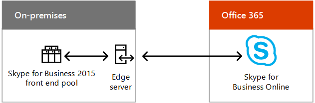

# Scenari per il cloud ibrido per SaaS Microsoft (Office 365)Hybrid cloud scenarios for Microsoft SaaS (Office 365)

 **Sintesi:** Comprendere l'architettura ibrida e gli scenari delle offerte cloud basate sul software distribuito come servizio Microsoft (SaaS) in Office 365.**Summary:** Understand the hybrid architecture and scenarios for Microsoft's SaaS-based cloud offerings (Office 365).
  
Combina le distribuzioni locali di Exchange, SharePoint o Skype for Business con le rispettive controparti in Office 365 come parte di una migrazione cloud o di una strategia di integrazione a lungo termine.Combine on-premises deployments of Exchange, SharePoint, or Skype for Business with their counterparts in Office 365 as part of a cloud migration or long-term integration strategy.
  
## Architettura per scenario ibrido in SaaS MicrosoftMicrosoft SaaS hybrid scenario architecture

La figura 1 mostra l'architettura di scenari ibridi Microsoft basati su SaaS in Office 365.Figure 1 shows the architecture of Microsoft SaaS-based hybrid scenarios for Office 365.
  
**Figura 1: scenari ibridi Microsoft basati su SaaS per Office 365****Figure 1: Microsoft SaaS-based hybrid scenarios for Office 365**

  
Per ogni livello dell'architettura:For each layer of the architecture:
  
- App e scenariApps and scenarios
    
    Esiste una serie di scenari ibridi basati su SaaS, che si allineano ai prodotti server Office e alle rispettive controparti in Office 365:There are a variety of SaaS-based hybrid scenarios, aligning around Office Server products and their Office 365 counterparts:
    
  - Exchange Server combinato con Exchange Online (Exchange Server ibrido)Exchange Server combined with Exchange Online (Exchange Server hybrid)
    
  - Skype for Business Server combinato con Skype for Business Online e i nuovi scenari con Cloud PBX e la versione del connettore cloudSkype for Business Server combined with Skype for Business Online and the new Cloud PBX and Cloud Connector Edition scenarios
    
  - SharePoint Server 2016 o SharePoint Server 2013 combinati con SharePoint Online (scenari multipli)SharePoint Server 2016 or SharePoint Server 2013 combined with SharePoint Online (multiple scenarios)
    
    Esiste anche Exchange Online con Skype for Business Server locale, uno scenario ibrido di prodotto incrociato.There is also Exchange Online with Skype for Business Server on-premises, a cross-product hybrid scenario.
    
- IdentitàIdentity
    
    Può includere la sincronizzazione della directory con Windows Server AD locale. In alternativa, è possibile configurare Azure AD in modo da attuare federazione con provider di identità di terze parti.Can include directory synchronization with your on-premises Windows Server AD. Alternately, you can configure Azure AD to federate with a third-party identity provider.
    
- ReteNetwork
    
    È costituito dalla pipe Internet esistente o da una connessione ExpressRoute con il peering Microsoft per Office 365 o Dynamics 365.Consists of either your existing Internet pipe or an ExpressRoute connection with Microsoft peering for Office 365 or Dynamics 365.
    
- LocaleOn-premises
    
    Può essere costituito da server esistenti di Exchange, SharePoint e Skype for Business, che devono essere aggiornati alle versioni più recenti. È quindi possibile combinarli con le rispettive controparti in Office 365 per gli scenari ibridi.Can consist of existing servers for Exchange, SharePoint, and Skype for Business, which should be updated to their latest versions. You can then combine them with their Office 365 counterparts for hybrid scenarios.
    
Impostare l'[Ambiente di sviluppo/test di Office 365](office-365-dev-test-environment.md).Set up your own [Office 365 dev/test environment](office-365-dev-test-environment.md).
  
## Skype for Business 2015 ibridoSkype for Business 2015 Hybrid

Skype for Business 2015 ibrido consente di combinare una distribuzione locale esistente con Skype for Business Online. Alcuni utenti sono ospitati in locale e alcuni sono ospitati online; tuttavia, condividono lo stesso dominio SIP (Session Initiation Protocol), come contoso.com. Puoi usare questa configurazione ibrida per migrare dall'ambiente locale a Office 365 in base alle esigenze di pianificazione. È possibile integrare Skype for Business 2015 con Exchange Online.Skype for Business 2015 Hybrid allows you to combine an existing on-premises deployment with Skype for Business Online. Some users are homed on-premises and some users are homed online, but the users share the same Session Initiation Protocol (SIP) domain, such as contoso.com. You can use this hybrid configuration to migrate from on-premises to Office 365 over time, on your schedule. Skype for Business 2015 can also be integrated with Exchange Online.
  
**Figura 2: configurazione ibrida di Skype for Business 2015****Figure 2: The Skype for Business 2015 hybrid configuration**

  
Nella figura 2 viene mostrata la configurazione ibrida di Skype for Business 2015, la quale comprende il pool Front End di Skype for Business 2015 locale e il server perimetrale che comunica con Skype for Business Online in Office 365.Figure 2 shows the Skype for Business 2015 hybrid configuration, consisting of an on-premises Skype for Business 2015 front end pool and edge server communicating with Skype for Business Online in Office 365.
  
Per ulteriori informazioni, vedere:For more information, see:
  
- [Pianificare la connettività ibrida tra Skype for Business Server e Skype for Business Online]((https://technet.microsoft.com/library/jj205403.aspx))[Plan hybrid connectivity between Skype for Business Server and Skype for Business Online]((https://technet.microsoft.com/library/jj205403.aspx))
    
- [Configurazione ibride supportate per Skype for Business Server 2015]((https://technet.microsoft.com/library/jj945633.aspx))[Supported hybrid configurations for Skype for Business Server 2015]((https://technet.microsoft.com/library/jj945633.aspx))
    
- [Versione ibrida di Skype for Business]((http://hybrid.office.com/skype-for-business/))[Skype for Business Hybrid]((http://hybrid.office.com/skype-for-business/))
    
## Cloud PBX con Skype for Business ServerCloud PBX with Skype for Business Server

Cloud PBX con Skype for Business Server consente di trasferire una distribuzione locale di Skype for Business Server esistente in una topologia con connettività PSTN (Public Switched Telephone Network). Cloud PBX with Skype for Business Server allows you to transition an existing Skype for Business Server on-premises deployment to a topology with on-premises Public Switched Telephone Network (PSTN) connectivity. 
  
**Figura 3: cloud PBX con Skype for Business Server****Figure 3: Cloud PBX with Skype for Business Server**

  
Nella figura 3 viene mostrata la configurazione di Cloud PBX con Skype for Business Server, che comprende un gateway PBX o Telco locale, uno Skype for Business Server e il PSTN connesso al Cloud PBX di Microsoft in Office 365, che include Skype for Business Online.Figure 3 shows the Cloud PBX with Skype for Business Server configuration, consisting of an on-premises existing PBX or Telco gateway, a Skype for Business Server, and the PSTN connected to the Microsoft Cloud PBX in Office 365, which includes Skype for Business Online.
  
Gli utenti nell'organizzazione ospitati nel cloud possono ricevere servizi PBX (Private Branch eXchange) dal cloud Microsoft che includono segnalazione e segreteria telefonica; tuttavia, la connettività PSTN (segnale di linea) viene fornita mediante VoIP aziendale dalla distribuzione di Skype for Business Server locale.Users in the organization who are homed in the cloud can receive private branch exchange (PBX) services from the Microsoft cloud that include signaling and voicemail, but PSTN connectivity (dial tone) is provided through Enterprise Voice from your on-premises Skype for Business Server deployment.
  
È un ottimo esempio di configurazione ibrida che permette di effettuare gradualmente la migrazione a un servizio basato sul cloud. È possibile mantenere le funzionalità vocali degli utenti non appena vengono trasferiti su Skype for Business Online. È possibile trasferire gli utenti al proprio ritmo, sapendo che le funzionalità vocali saranno comunque disponibili a prescindere da dove sono ospitate.This is a great example of a hybrid configuration that allows you to gradually migrate to a cloud-based service. You can retain your users' voice capabilities as you begin to move them to Skype for Business Online. You can move your users at your own pace, knowing that their voice features will continue no matter where they are homed. 
  
Per ulteriori informazioni, vedere [Pianificare la connettività ibrida tra Skype for Business Server e Skype for Business Online o Lync Server 2013]((https://technet.microsoft.com/library/jj205403.aspx)).For more information, see [Plan hybrid connectivity between Skype for Business Server and Skype for Business Online or Lync Server 2013]((https://technet.microsoft.com/library/jj205403.aspx)).
  
Se non disponi già di una distribuzione di Lync Server o Skype for Business Server esistente, puoi usare la versione del connettore cloud di Skype for Business, un set di macchine virtuali in pacchetto che implementano la connettività PSTN locale con Cloud PBX.If you do not already have an existing Lync Server or Skype for Business Server deployment, you can use Skype for Business Cloud Connector Edition, a set of packaged virtual machines (VMs) that implement on-premises PSTN connectivity with Cloud PBX.
  
Per ulteriori informazioni, vedere [Piano per Skype for Business Cloud Connector Edition]((https://technet.microsoft.com/library/mt605227.aspx)).For more information, see [Plan for Skype for Business Cloud Connector Edition]((https://technet.microsoft.com/library/mt605227.aspx)).
  
## Ambiente ibrido di SharePointSharePoint Hybrid

SharePoint ibrido combina SharePoint Online in Office 365 con la farm di SharePoint locale per un'esperienza ottimale che consenta di usufruire del meglio di entrambi i mondi.SharePoint hybrid combines SharePoint Online in Office 365 with your on-premises SharePoint farm for a best of both worlds, connected experience.
  
**Figura 4: configurazione ibrida di SharePoint****Figure 4: The SharePoint hybrid configuration**

  
Nella figura 4 viene mostrata la configurazione ibrida di SharePoint, che comprende una farm di SharePoint locale che comunica con SharePoint Online in Office 365.Figure 4 shows the SharePoint hybrid configuration, consisting of an on-premises SharePoint farm communicating with SharePoint Online in Office 365.
  
Scenari ibridi di SharePoint:SharePoint hybrid scenarios:
  
- [Versione ibrida di OneDrive for BusinessHybrid OneDrive for Business](https://technet.microsoft.com/library/mt147425%28v=office.16%29.aspx)
    
- [Versione ibrida dei siti del teamHybrid team sites](https://technet.microsoft.com/library/mt346110%28v=office.16%29.aspx)
    
- [Soluzione Extranet B2B ibrida]((https://support.office.com/article/SharePoint-Business-to-Business-Collaboration-Extranet-for-Partners-with-Office-365-7b087413-165a-4e94-8871-4393e0b9c037))[Hybrid Extranet B2B]((https://support.office.com/article/SharePoint-Business-to-Business-Collaboration-Extranet-for-Partners-with-Office-365-7b087413-165a-4e94-8871-4393e0b9c037))
    
- [Ricerca ibridaHybrid search](https://technet.microsoft.com/library/dn720906%28v=office.16%29.aspx)
    
- [Profili ibridi]((https://support.office.com/article/Plan-hybrid-profiles-96d1eaf0-94eb-40c5-ab76-c82907777db4))[Hybrid profiles]((https://support.office.com/article/Plan-hybrid-profiles-96d1eaf0-94eb-40c5-ab76-c82907777db4))
    
- [Selezione ibrida]((https://support.office.com/article/Hybrid-picker-in-the-SharePoint-Online-admin-center-efce8417-c9bc-4a2c-ac9d-cce6c4e84a9c))[Hybrid Picker]((https://support.office.com/article/Hybrid-picker-in-the-SharePoint-Online-admin-center-efce8417-c9bc-4a2c-ac9d-cce6c4e84a9c))
    
    È facile abilitare gli scenari ibridi con le procedure guidate che rendono automatica la configurazione ibrida, disponibili dall'interfaccia di amministrazione di SharePoint Online in Office 365.It is easy to enable hybrid scenarios using the wizards that automate hybrid configuration, available from the SharePoint Online admin center in Office 365.
    
- [Icona di avvio delle app estendibile ibrida]((https://support.office.com/article/The-extensible-hybrid-app-launcher-617a7cb5-53da-4128-961a-64a840c0ab91))[Extensible hybrid app launcher]((https://support.office.com/article/The-extensible-hybrid-app-launcher-617a7cb5-53da-4128-961a-64a840c0ab91))
    
    Consente agli utenti di visualizzare e usare i video in Office 365 e le app e le esperienze Delve nelle pagine della relativa farm di SharePoint locale.Allows users to view and use Office 365 video and Delve apps and experiences within the pages of their on-premises SharePoint farm.
    
Tutti questi scenari ibridi di SharePoint, ad eccezione dell'icona di avvio delle app ibrida estensibile, sono disponibili per gli utenti di SharePoint 2016 e SharePoint 2013.All of these SharePoint hybrid scenarios, except the Extensible hybrid app launcher, are available for both SharePoint 2016 and SharePoint 2013 users.
  
Per ulteriori informazioni, vedere [SharePoint ibrido]((http://hybrid.office.com/sharepoint/)).For more information, see [SharePoint Hybrid]((http://hybrid.office.com/sharepoint/)).
  
## Exchange Server 2016 ibridoExchange Server 2016 Hybrid

Con Exchange Server 2016 ibrido, puoi ottenere i vantaggi di Exchange Online in Office 365 per gli utenti online, mentre gli utenti locali continuano a usare l'infrastruttura di Exchange Server esistente.With Exchange Server 2016 Hybrid, you can realize the benefits of Exchange Online in Office 365 for online users while on-premises users continue to use existing Exchange Server infrastructure. 
  
**Figura 5: configurazione ibrida di Exchange 2016****Figure 5: The Exchange 2016 hybrid configuration**

  
La figura 5 mostra la configurazione ibrida di Exchange 2016, formata da server Cassette postali di Exchange che comunicano con Exchange Online Protection e con le cassette postali di Office 365.Figure 5 shows the Exchange 2016 hybrid configuration, consisting of on-premises Exchange mailbox servers communicating with Exchange Online Protection and mailboxes in Office 365.
  
Alcuni utenti hanno un server di posta elettronica locale, altri usano Exchange Online; tuttavia, condividono tutti lo stesso spazio di indirizzi di posta elettronica. Some users have an on-premises email server and some users use Exchange Online, but all users share the same e-mail address space. 
  
Questa configurazione ibrida:This hybrid configuration:
  
- Sfrutta l'infrastruttura di Exchange Server esistente durante la migrazione a Exchange Online in base alle esigenze di pianificazione.Leverages your existing Exchange Server infrastructure while you migrate to Exchange Online over time, on your schedule.
    
- Consente di supportare i siti remoti senza influire sull'infrastruttura per la gestione delle filiali.Allows you to support remote sites without investing in branch office infrastructure.
    
- Consente di instradare la posta elettronica Internet in arrivo tramite Exchange Online Protection in Office 365.Allows you to route incoming Internet email through Exchange Online Protection in Office 365.
    
- Risponde alle esigenze delle organizzazioni multinazionali con filiali per le quali è necessario che i dati siano conservati in locale.Serves the needs of multinational organizations with subsidiaries that require data to reside on-premises.
    
Puoi anche integrare questa configurazione ibrida con altre applicazioni di Microsoft Office 365, tra cui Skype for Business Online e SharePoint Online.You can also integrate this hybrid configuration with other Microsoft Office 365 applications, including Skype for Business Online and SharePoint Online.
  
Per ulteriori informazioni, vedere [Distribuzioni ibride di Exchange Server](https://technet.microsoft.com/library/jj200581%28v=exchg.150%29.aspx) e [Versione ibrida di Exchange]((http://hybrid.office.com/exchange/)).For more information, see [Exchange Server Hybrid Deployments](https://technet.microsoft.com/library/jj200581%28v=exchg.150%29.aspx) and[Exchange Hybrid]((http://hybrid.office.com/exchange/)).
  
## Vedere ancheSee Also

[Cloud ibrido Microsoft per Enterprise ArchitectsMicrosoft Hybrid Cloud for Enterprise Architects](microsoft-hybrid-cloud-for-enterprise-architects.md)
  
[Risorse sull'architettura IT del cloud MicrosoftMicrosoft Cloud IT architecture resources](microsoft-cloud-it-architecture-resources.md)

[Guida di orientamento del cloud aziendale Microsoft: risorse per i decision maker del settore IT]((https://sway.com/FJ2xsyWtkJc2taRD))[Microsoft's Enterprise Cloud Roadmap: Resources for IT Decision Makers]((https://sway.com/FJ2xsyWtkJc2taRD))

