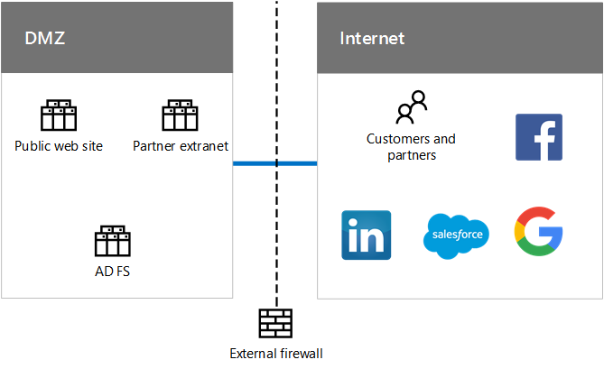

# Identità per Contoso CorporationIdentity for the Contoso Corporation

 **Sintesi:** informazioni su come Contoso trae vantaggio da una soluzione di gestione delle identità e degli accessi distribuita come servizio (IDaaS) e fornisce un'autenticazione ridondante e distribuita a livello geografico per i suoi utenti.**Summary:** Understand how Contoso takes advantage of IDaaS and provides geographically distributed and redundant authentication for its users.
  
Microsoft fornisce una soluzione di gestione delle identità e degli accessi distribuita come servizio (IDaaS) nelle sue offerte cloud. Per adottare un'infrastruttura inclusiva di cloud, la soluzione IDaaS di Contoso deve sfruttare i provider di identità locali e includere l'autenticazione federata con i provider di identità di terze parti esistenti e attendibili.Microsoft provides an Identity as a Service (IDaaS) across its cloud offerings. To adopt a cloud-inclusive infrastructure, Contoso's IDaaS solution must leverage their on-premises identity provider and include federated authentication with their existing trusted, third-party identity providers.
  
## Foresta di Windows Server AD di ContosoContoso's Windows Server AD forest

Contoso usa una foresta di Windows Server Active Directory (AD) singola per contoso.com con sette domini, uno per ogni area geografica del mondo. La sede principale, le sedi centrali regionali e le filiali contengono controller di dominio per l'autorizzazione e l'autenticazione locali.Contoso uses a single Windows Server Active Directory (AD) forest for contoso.com with seven domains, one for each region of the world. The headquarters, regional hub offices, and satellite offices contain domain controllers for local authentication and authorization.
  
**Figura 1: foresta di Contoso e domini a livello mondiale****Figure 1: Contoso's forest and domains worldwide**

  
Nella figura 1 viene mostrata la foresta di Contoso con domini regionali per le varie parti del mondo in cui sono presenti sedi centrali regionali.Figure 1 shows the Contoso forest with regional domains for the different parts of the world that contain regional hubs.
  
Contoso desidera utilizzare gli account e i gruppi della foresta contoso.com per l'autenticazione e l'autorizzazione per le app basate su cloud e per i carichi di lavoro.Contoso wants to use the accounts and groups in the contoso.com forest for authentication and authorization for its cloud-based apps and workloads.
  
## Infrastruttura di autenticazione federata di ContosoContoso's federated authentication infrastructure

Contoso consente:Contoso allows:
  
- Ai clienti di usare il proprio account Microsoft, Facebook o Google Mail per accedere al proprio sito Web pubblico.Customers to use their Microsoft, Facebook, or Google Mail accounts to sign in to their public web site.
    
- Ai fornitori e ai partner di usare il proprio account LinkedIn, Salesforce o Google Mail per accedere all'extranet dei partner.Vendors and partners to use their LinkedIn, Salesforce, or Google Mail accounts to sign in to the partner extranet.
    
**Figura 2: Supporto di Contoso per l'autenticazione federata di clienti e partner****Figure 2: Contoso's support for federated authentication for customers and partners**

  
Nella figura 2 viene mostrata la rete perimetrale di Contoso contenente un sito Web pubblico, una rete extranet partner e un set di server AD FS. La rete perimetrale è connessa a Internet che contiene clienti, partner e servizi Internet.Figure 2 shows the Contoso DMZ containing a public web site, a partner extranet, and a set of AD FS servers. The DMZ is connected to the Internet that contains customers and partners and Internet services.
  
I server di Active Directory Federation Services (AD FS) nella DMZ autenticano le credenziali dei clienti per l'accesso al sito Web pubblico e le credenziali dei partner per l'accesso all'extranet dei partner.Active Directory Federation Services (AD FS) servers in the DMZ authenticate customer credentials for access to the public web site and partner credentials for access to the partner extranet.
  
Quando Contoso effettua la transizione dal proprio sito Web pubblico in Azure Web App e dall'extranet dei partner a Dynamics 365, desidera continuare a utilizzare i provider di identità di terze parti per clienti e partner. Questo sarà possibile configurando la federazione tra i tenant di Contoso Azure AD e i provider di identità di terze parti.When Contoso transitions its public web site to an Azure Web App and partner extranet to Dynamics 365, they want to continue to use these third-party identity providers for their customers and partners. This will be accomplished by configuring federation between Contoso Azure AD tenants and these third-party identity providers.
  
## Sincronizzazione di directory per la foresta Windows Server AD di ContosoDirectory synchronization for Contoso's Windows Server AD forest

Contoso ha distribuito lo strumento Azure AD Connect su un cluster di server nel suo centro dati di Parigi. Azure AD Connect sincronizza le modifiche alla foresta di Windows Server AD contoso.com con il tenant di Azure AD condiviso dalle sottoscrizioni a Office 365, EMS, Dynamics 365 e Azure di Contoso. Per ulteriori informazioni su sottoscrizioni, licenze, account utente e tenant, vedere [Sottoscrizioni, licenze e account utente per Contoso Corporation](subscriptions-licenses-and-user-accounts-for-the-contoso-corporation.md).Contoso has deployed the Azure AD Connect tool on a cluster of servers in its Paris datacenter. Azure AD Connect synchronizes changes to the contoso.com Windows Server AD forest with the Azure AD tenant shared by Contoso's Office 365, EMS, Dynamics 365, and Azure subscriptions. For more information about subscriptions, licenses, user accounts, and tenants, see [Subscriptions, licenses, and user accounts for the Contoso Corporation](subscriptions-licenses-and-user-accounts-for-the-contoso-corporation.md).
  
**Figura 3: Infrastruttura di sincronizzazione della directory di Contoso****Figure 3: Contoso's directory synchronization infrastructure**

  
Nella figura 3 viene mostrato un cluster di server che eseguono Azure AD Connect per la sincronizzazione della foresta di Windows Server AD di Contoso con il tenant di Azure AD.Figure 3 shows a cluster of servers running Azure AD Connect synchronizing the Contoso Windows Server AD forest with the Azure AD tenant.
  
Contoso ha configurato l'autenticazione federata, che permette ai dipendenti di Contoso di effettuare l'accesso Single Sign-On. Quando un utente che ha già effettuato l'accesso alla foresta Windows Server AD di contoso.com accede a una risorsa cloud SaaS o PaaS di Microsoft, non verrà richiesta la password.Contoso has configured federated authentication, which provides single sign-on for Contoso's workers. When a user that has already signed in to the contoso.com Windows Server AD forest accesses a Microsoft SaaS or PaaS cloud resource, they will not be prompted for a password.
  
## Distribuzione geografica del traffico di autenticazione di ContosoGeographical distribution of Contoso authentication traffic

Per supportare al meglio le proprie risorse mobili e remote, Contoso ha distribuito insiemi di server di autenticazione nelle proprie filiali. Questa infrastruttura distribuisce il carico e offre ridondanza, nonché prestazioni migliori durante l'autenticazione delle credenziali utente per l'accesso alle offerte cloud di Microsoft che utilizzano il tenant di Azure AD comune.To better support its mobile and remote workforce, Contoso has deployed sets of authentication servers in its regional offices. This infrastructure distributes the load and provides redundancy and higher performance when authenticating user credentials for access to Microsoft cloud offerings that use the common Azure AD tenant.
  
Per distribuire il carico delle richieste di autenticazione, Contoso ha configurato Azure Traffic Manager con un profilo che utilizza il metodo di routing delle prestazioni, che consente di autenticare i client al set di server di autenticazione nell'area geografica più vicina.To distribute the load of authentication requests, Contoso has configured Azure Traffic Manager with a profile that uses the performance routing method, which refers authenticating clients to the regionally closest set of authentication servers. 
  
**Figura 4: Distribuzione geografica del traffico di autenticazione per le sedi regionali****Figure 4: Geographical distribution of authentication traffic for regional offices**

  
Nella figura 4 vengono mostrati i livelli dei computer client, Gestione traffico di Azure e i server di autenticazione nelle filiali regionali. Ogni filiale regionale usa proxy Web e server AD FS per autenticare le credenziali utente con i controller di dominio di Windows Server AD.Figure 4 shows the layers of client computers, Azure Traffic Manager, and authentication servers in regional offices. Each regional office uses web proxies and AD FS servers to authenticate user credentials with Windows Server AD domain controllers.
  
Esempio di processo di autenticazione:Authentication process example:
  
1. Il computer client avvia la comunicazione con una pagina Web nella tenancy di Office 365 in Europa (ad esempio sharepoint.contoso.com).The client computer initiates communication with a web page in the Office 365 tenancy in Europe (such as sharepoint.contoso.com).
    
2. Office 365 inoltra una richiesta di invio per la prova di autenticazione. La richiesta contiene l'URL da contattare per l'autenticazione.Office 365 sends back a request to send proof of authentication. The request contains the URL to contact for authentication.
    
3. Il computer client tenta di risolvere il nome DNS nell'URL a un indirizzo IP.The client computer attempts to resolve the DNS name in the URL to an IP address.
    
4. Azure Traffic Manager riceve la query DNS e risponde al computer client con l'indirizzo IP di un server proxy di applicazione Web nella filiale più vicina al computer client.Azure Traffic Manager receives the DNS query and responds to the client computer with the IP address of a web application proxy server in the regional office that is closest to the client computer.
    
5.  Il computer client invia una richiesta di autenticazione a un server proxy di applicazione Web, che inoltra la richiesta a un server AD FS.The client computer sends an authentication request to a web application proxy server, which forwards the request to an AD FS server.
    
6. Il server AD FS richiede le credenziali utente dal computer client.The AD FS server requests the user credentials from the client computer.
    
7. Il computer client invia le credenziali utente senza chiedere conferma all'utente.The client computer sends the user credentials without prompting the user.
    
8. Il server AD FS convalida le credenziali con un controller di dominio Windows Server AD nella filiale e restituisce un token di sicurezza al computer client.The AD FS server validates the credentials with a Windows Server AD domain controller in the regional office and returns a security token to the client computer.
    
9. Il computer client invia il token di sicurezza a Office 365.The client computer sends the security token to Office 365.
    
10. Dopo aver completato la convalida, Office 365 memorizza nella cache il token di sicurezza e invia la pagina Web richiesta nel passaggio 1 al computer client.After successful validation, Office 365 caches the security token and sends the web page requested in step 1 to the client computer.
    
## Ridondanza per l'infrastruttura di autenticazione della sede centrale in IaaS di AzureRedundancy for the headquarters authentication infrastructure in Azure IaaS

Per garantire la ridondanza a dipendenti remoti e mobili della sede di Parigi con 15.000 dipendenti, Contoso ha distribuito un secondo set di proxy di applicazione e server AD FS in IaaS di Azure.To provide redundancy for the remote and mobile workers of the Paris headquarters that contains 15,000 workers, Contoso has deployed a second set of application proxies and AD FS servers in Azure IaaS.
  
**Figura 5: Infrastruttura di autenticazione ridondante in IaaS di Azure****Figure 5: Redundant authentication infrastructure in Azure IaaS**

  
Nella figura 5 vengono mostrati i proxy Web e i server AD FS nella rete perimetrale e un set aggiuntivo di ognuno di questi in una rete virtuale di Azure cross-premise.Figure 5 shows web proxies and AD FS servers in the DMZ and an additional set of each in a cross-premises Azure virtual network.
  
Quando i server di autenticazione principali nella rete perimetrale della sede centrale diventano non disponibili, il personale IT passa al set ridondante distribuito in IaaS di Azure. Le richieste di autenticazione successive provenienti dai computer della sede di Parigi usano il set in IaaS di Azure finché il problema di disponibilità non viene corretto.When the primary authentication servers in the headquarters DMZ become unavailable, IT staff switch over to the redundant set deployed in Azure IaaS. Subsequent authentication requests from Paris office computers use the set in Azure IaaS until the availability problem is corrected.
  
Per effettuare questi passaggi, Contoso aggiorna il profilo Azure Traffic Manager affinché l'area di Parigi possa utilizzare un set di indirizzi IP diverso per i proxy di applicazioni Web:To switch over and switch back, Contoso updates the Azure Traffic Manager profile for the Paris region to use a different set of IP addresses for the web application proxies:
  
- Quando l'autenticazione ai server della rete perimetrale torna disponibile, usa gli indirizzi IP dei server nella rete perimetrale.When the DMZ authentication servers are available, use the IP addresses of the servers in the DMZ.
    
- Quando l'autenticazione ai server della rete perimetrale torna disponibile, usa gli indirizzi IP dei server in IaaS di Azure.When the DMZ authentication servers are not available, use the IP addresses of the servers in Azure IaaS.
    
## See AlsoSee Also

[Contoso nel Microsoft CloudContoso in the Microsoft Cloud](contoso-in-the-microsoft-cloud.md)
  
[Risorse sull'architettura IT del cloud MicrosoftMicrosoft Cloud IT architecture resources](microsoft-cloud-it-architecture-resources.md)

[Identità di Microsoft Cloud per Enterprise ArchitectsMicrosoft Cloud Identity for Enterprise Architects](http://aka.ms/cloudarchidentity)
  
[Protezione di dispositivi e identità per Office 365Identity and Device Protection for Office 365](http://aka.ms/o365protect_device)
  
[Guida di orientamento per Enterprise Cloud di Microsoft: risorse per i decision maker del settore ITMicrosoft's Enterprise Cloud Roadmap: Resources for IT Decision Makers](https://sway.com/FJ2xsyWtkJc2taRD)

