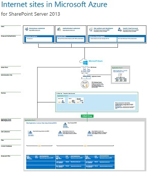

# Siti Internet in Microsoft Azure che utilizzano SharePoint Server 2013Internet Sites in Microsoft Azure using SharePoint Server 2013

 **Riepilogo: I siti Internet** che utilizzano SharePoint Server 2013 traggono vantaggio dall'essere ospitati in servizi infrastruttura di Azure. In questo articolo sono disponibili risorse utili per progettare e implementare questa soluzione.**Summary:** Internet sites that use SharePoint Server 2013 benefit by being hosted in Azure Infrastructure Services. This article provides resources for designing and implementing this solution.
  
## Utilizzare i servizi infrastruttura di Azure per i siti InternetUsing Azure Infrastructure Services for Internet sites

Microsoft Azure fornisce un'opzione interessante per ospitare siti Internet basati su SharePoint Server 2013. I vantaggi includono quanto segue:Microsoft Azure provides a compelling option for hosting Internet sites based on SharePoint Server 2013. Advantages include the following:
  
- Focalizzazione sullo sviluppo di un sito efficiente anziché sulla creazione dell'infrastruttura.Focus on developing a great site instead of building infrastructure.
    
- Flessibilità per ridimensionare la soluzione basata su richiesta aumentando e riducendo.Flexibility to scale your solution based on demand by scaling out and in.
    
- Pagare solo per le risorse necessarie e utilizzate.Pay only for the resources that you need and use.
    
- Sfruttare Azure Active Directory per gli account cliente.Take advantage of Azure Active Directory for customer accounts.
    
- Aggiungere funzionalità che non sono attualmente disponibili in Office 365, ad esempio report e analisi completi.Add features that are not currently available in Office 365, such as deep reporting and analytics.
    
## RisorseResources

Le seguenti illustrazioni tecniche e i seguenti articoli forniscono informazioni su come progettare e implementare siti Internet in Azure utilizzando SharePoint Server 2013.The following technical illustrations and articles provide information about how to design and implement Internet sites in Azure by using SharePoint Server 2013.
  
|**Risorsa****Resource**|**Ulteriori informazioni****More information**|
|:-----|:-----|
|**Siti Internet SharePoint Server 2013 in Azure****SharePoint Server 2013 Internet sites in Azure**   [          ](https://go.microsoft.com/fwlink/p/?LinkId=392552)[          ](https://go.microsoft.com/fwlink/p/?LinkId=392552)   [PDF](https://go.microsoft.com/fwlink/p/?LinkId=392552)[PDF](https://go.microsoft.com/fwlink/p/?LinkId=392552) |[          ](https://go.microsoft.com/fwlink/p/?LinkId=392551)[Visio](https://go.microsoft.com/fwlink/p/?LinkId=392551)[          ](https://go.microsoft.com/fwlink/p/?LinkId=392551)[Visio](https://go.microsoft.com/fwlink/p/?LinkId=392551)   |Questo modello di architettura descrive le attività di progettazione e le scelte di architettura consigliate per i siti Internet in Azure.This architecture model outlines key design activities and recommended architecture choices for Internet sites in Azure.    |
|**Esempio di progettazione: Siti Internet in Azure per SharePoint Server 2013****Design sample: Internet Sites in Azure for SharePoint Server 2013**   [          ](https://go.microsoft.com/fwlink/p/?LinkId=392549)[          ](https://go.microsoft.com/fwlink/p/?LinkId=392549)   [PDF](https://go.microsoft.com/fwlink/p/?LinkId=392549)[PDF](https://go.microsoft.com/fwlink/p/?LinkId=392549) |[Visio](https://go.microsoft.com/fwlink/p/?LinkId=392548)[Visio](https://go.microsoft.com/fwlink/p/?LinkId=392548)   |Utilizzare questo esempio di progettazione come punto di partenza per la propria architettura.Use this design sample as a starting point for your own architecture.    |
|**[Microsoft Azure Architectures for SharePoint 2013](microsoft-azure-architectures-for-sharepoint-2013.md)****[Microsoft Azure Architectures for SharePoint 2013](microsoft-azure-architectures-for-sharepoint-2013.md)**   |In questo articolo viene descritto come progettare le architetture Azure e ospitare le soluzioni SharePoint.This article describes how to design Azure architectures to host SharePoint solutions.    |
|**[Con Microsoft Azure Active Directory per l'autenticazione di SharePoint 2013](using-microsoft-azure-active-directory-for-sharepoint-2013-authentication.md)****[Using Microsoft Azure Active Directory for SharePoint 2013 authentication](using-microsoft-azure-active-directory-for-sharepoint-2013-authentication.md)**   |Istruzioni passo passo per la configurazione di Azure AD con una farm di SharePoint 2013.Step-by-step instructions for configuring Azure AD with a SharePoint 2013 farm.    |
   
**Partecipare alla discussione****Join the discussion**

|**Contattaci****Contact us**|**Descrizione****Description**|
|:-----|:-----|
|**Ottenere la soluzione necessaria****What cloud adoption content do you need?**   |Microsoft sta creando documenti contenenti soluzioni che fanno riferimento a numerosi prodotti e servizi. Fornire commenti e suggerimenti sulle soluzioni tra server proposte o richiedere una soluzione specifica inviando un'e-mail all'indirizzo [MODAcontent@microsoft.com](mailto:cloudadopt@microsoft.com?Subject=[Cloud%20Adoption%20Content%20Feedback]:%20).We are creating content for cloud adoption that spans multiple Microsoft cloud platforms and services. Let us know what you think about our cloud adoption content, or ask for specific content by sending email to [cloudadopt@microsoft.com](mailto:cloudadopt@microsoft.com?Subject=[Cloud%20Adoption%20Content%20Feedback]:%20).    |
|**Partecipare alla discussione sulle soluzioni****Join the cloud adoption discussion**   |Se si è sulle soluzioni basate su cloud, è consigliabile partecipare il Cloud adozione consulenza Consiglio (CAAB) per la connessione con una più grande e vivace community di sviluppatori contenuti Microsoft, ai professionisti del settore e i clienti di tutto il mondo. Per partecipare, aggiungere l'utente come membri dello [spazio CAAB (scheda consulenza adozione di Cloud)](https://aka.ms/caab) della Community di Microsoft Tech e inviare un messaggio di posta elettronica rapido a[CAAB@microsoft.com](mailto:caab@microsoft.com?Subject=I%20just%20joined%20the%20Cloud%20Adoption%20Advisory%20Board!). Tutti gli utenti possono leggere il contenuto correlato al community sul [blog CAAB](https://blogs.technet.com/b/solutions_advisory_board/). Tuttavia, membri CAAB ottenere gli inviti per webinar privato che descrivono le nuove risorse adozione cloud e soluzioni.If you are passionate about cloud-based solutions, consider joining the Cloud Adoption Advisory Board (CAAB) to connect with a larger, vibrant community of Microsoft content developers, industry professionals, and customers from around the globe. To join, add yourself as a member of the [CAAB (Cloud Adoption Advisory Board) space](https://aka.ms/caab) of the Microsoft Tech Community and send us a quick email at[CAAB@microsoft.com](mailto:caab@microsoft.com?Subject=I%20just%20joined%20the%20Cloud%20Adoption%20Advisory%20Board!). Anyone can read community-related content on the [CAAB blog](https://blogs.technet.com/b/solutions_advisory_board/). However, CAAB members get invitations to private webinars that describe new cloud adoption resources and solutions.    |
|**Ottenere l'immagine visualizzata****Get the art you see here**   |Se si desidera una copia modificabile dell'oggetto WordArt che viene visualizzato in questo articolo, verranno contenti inviare all'utente. La richiesta, incluso l'URL e il titolo dell'oggetto WordArt alla [cloudadopt@microsoft.com](mailto:cloudadopt@microsoft.com?subject=[Art%20Request]:%20)della posta elettronica.If you want an editable copy of the art you see in this article, we'll be glad to send it to you. Email your request, including the URL and title of the art, to [cloudadopt@microsoft.com](mailto:cloudadopt@microsoft.com?subject=[Art%20Request]:%20).    |
   
## See AlsoSee Also

[Adozione del cloud e soluzioni ibrideCloud adoption and hybrid solutions](cloud-adoption-and-hybrid-solutions.md)

