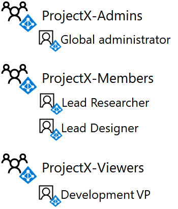
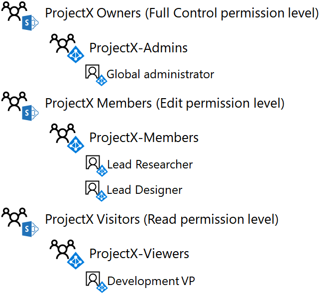

# <a name="isolated-sharepoint-online-team-site-devtest-environment"></a>Ambiente isolato di sviluppo e di testing di sito del team SharePoint Online

 **Riepilogo:** Configurare un sito del team di SharePoint Online isolato dal resto dell'organizzazione nell'ambiente di sviluppo e di testing di Office 365.
  
SharePoint Online siti dei team in Office 365 sono percorsi per la collaborazione con una raccolta documenti comuni, un blocco appunti di OneNote e altri servizi. In molti casi, si desidera ampio accesso e la collaborazione tra organizzazioni o reparti. In alcuni casi, tuttavia, si desidera controllare rigidamente l'accesso e le autorizzazioni per la collaborazione tra un piccolo gruppo di utenti.
  
Accesso ai siti dei team di SharePoint Online e operazioni eseguibili dagli utenti è controllato dai livelli di autorizzazione e gruppi di SharePoint. Per impostazione predefinita, i siti di SharePoint Online sono tre livelli di accesso:
  
- **Membri**, che possono visualizzare, creare e modificare le risorse nel sito.
    
- **I proprietari**, che dispongono del controllo completo del sito, inclusa la possibilità di modificare le autorizzazioni.
    
- **Visitatori**, che nel sito possono visualizzare solo le risorse.
    
In questo articolo passaggi è la configurazione di un sito del team di SharePoint Online isolato per un progetto di ricerca segreta denominato ProjectX. I requisiti di accesso sono:
  
- Solo i membri del progetto possono accedere al sito e ai suoi contenuti (documenti, Blocco appunti di OneNote, Pages), con livelli di autorizzazione di SharePoint per la modifica e la visualizzazione controllati mediante l'appartenenza al gruppo.
    
- Solo l'autore del sito e i membri di un gruppo Amministratori per il sito possono eseguire operazioni amministrative sul sito, inclusa la modifica delle autorizzazioni a livello del sito.
    
Esistono tre fasi per configurare un sito del team di SharePoint Online isolato nell'ambiente di sviluppo e di testing di Office 365:
  
1. Creare l'ambiente di sviluppo/testing di Office 365
    
2. Creare gli utenti e i gruppi per ProjectX.
    
3. Creare un nuovo sito del team ProjectX SharePoint Online e il relativo isolamento.
    
> [!TIP]
> Fare clic [qui](http://aka.ms/catlgstack) per consultare una mappa di tutti gli articoli relativi alla guida del laboratorio di testing cloud di One Microsoft.
  
## <a name="phase-1-build-out-your-lightweight-or-simulated-enterprise-office-365-devtest-environment"></a>Fase 1: creare l'ambiente di sviluppo/test di Office 365 aziendale leggero o simulato

Se si desidera creare un sito del team di SharePoint Online isolato in un modo semplice con i requisiti minimi, seguire le istruzioni in fasi 2 e 3 [dell'ambiente di sviluppo e di testing di Office 365](office-365-dev-test-environment.md).
  
Se si desidera creare un sito del team di SharePoint Online isolato in una configurazione enterprise simulato, seguire le istruzioni in [DirSync per l'ambiente di sviluppo e di testing di Office 365](dirsync-for-your-office-365-dev-test-environment.md).
  
> [!NOTE]
> La creazione di un sito di SharePoint Online isolato non richiede l'ambiente di sviluppo/test aziendale simulato, che include una rete Intranet simulata connessa a Internet e la sincronizzazione della directory per una foresta di Windows Server AD. Qui viene fornito come un'opzione in modo da poter testare un sito di SharePoint Online isolato e sperimentarlo in un ambiente che rappresenta un'organizzazione tipica. 
  
## <a name="phase-2-create-user-accounts-and-access-groups"></a>Fase 2: Creare gli account utente e accedere ai gruppi

Utilizzare le istruzioni riportate in [connessione a Office 365 PowerShell](https://technet.microsoft.com/library/dn975125.aspx) per connettersi alla sottoscrizione Office 365 trail con l'account di amministratore globale di:
  
- Dal computer (per l'ambiente di sviluppo/test di Office 365 leggero).
    
- Dalla macchina virtuale CLIENT1 (per l'ambiente di sviluppo/test di Office 365 aziendale simulato).
    
Per creare nuovi gruppi di accesso per il sito del team ProjectX SharePoint Online, eseguire questi comandi dal prompt dei comandi di Windows Azure Active Directory Module per Windows PowerShell:
  
```
$groupName="ProjectX-Members"
$groupDesc="People allowed to collaborate for ProjectX."
New-MsolGroup -DisplayName $groupName -Description $groupDesc
$groupName="ProjectX-Admins"
$groupDesc="People allowed to administer SharePoint for ProjectX."
New-MsolGroup -DisplayName $groupName -Description $groupDesc
$groupName="ProjectX-Viewers"
$groupDesc="People allowed to view the SharePoint resources for ProjectX."
New-MsolGroup -DisplayName $groupName -Description $groupDesc
```

> [!TIP]
> Fare clic [qui](https://gallery.technet.microsoft.com/PowerShell-commands-for-an-b2608df1) per un file di testo che contiene tutti i comandi di PowerShell in questo articolo.
  
Immettere il nome dell'organizzazione (ad esempio: contosotoycompany), il prefisso internazionale a due caratteri e quindi eseguire i comandi seguenti dal prompt Modulo Microsoft Azure Active Directory per Windows PowerShell:
  
```
$orgName="<organization name>"
$loc="<two-character country code, such as US>"
$licAssignment= $orgName + ":ENTERPRISEPREMIUM"
$userName= "designer@" + $orgName + ".onmicrosoft.com"
New-MsolUser -DisplayName "Lead Designer" -FirstName Lead -LastName Designer -UserPrincipalName $userName -UsageLocation $loc -LicenseAssignment $licAssignment -ForceChangePassword $false
```

Dalla visualizzazione del comando **New-MsolUser** , annotare la password generata per l'account di coordinare Designer e registrarlo in un percorso sicuro.
  
Eseguire i comandi seguenti dal prompt Modulo Microsoft Azure Active Directory per Windows PowerShell:
  
```
$userName= "researcher@" + $orgName + ".onmicrosoft.com"
New-MsolUser -DisplayName "Lead Researcher" -FirstName Lead -LastName Researcher -UserPrincipalName $userName -UsageLocation $loc -LicenseAssignment $licAssignment -ForceChangePassword $false
```

Dalla visualizzazione del comando **New-MsolUser** , annotare la password generata per l'account di coordinare ricercatori e registrarlo in un percorso sicuro.
  
Eseguire i comandi seguenti dal prompt Modulo Microsoft Azure Active Directory per Windows PowerShell:
  
```
$userName= "devvp@" + $orgName + ".onmicrosoft.com"
New-MsolUser -DisplayName "Development VP" -FirstName Development -LastName VP -UserPrincipalName $userName -UsageLocation $loc -LicenseAssignment $licAssignment -ForceChangePassword $false
```

Dalla visualizzazione del comando **New-MsolUser** , annotare la password generata per l'account di sviluppo Vicepresidente e registrarlo in un percorso sicuro.
  
Successivamente, per aggiungere i nuovi account per i nuovi gruppi di accesso, eseguire questi comandi di PowerShell dal prompt dei comandi di Windows Azure Active Directory Module per Windows PowerShell:
  
```
$grpName="ProjectX-Members"
$userUPN="designer@" + $orgName + ".onmicrosoft.com"
Add-MsolGroupMember -GroupObjectId (Get-MsolGroup | Where { $_.DisplayName -eq $grpName }).ObjectID -GroupMemberObjectId (Get-MsolUser | Where { $_.UserPrincipalName -eq $userUPN }).ObjectID -GroupMemberType "User"
$userUPN="researcher@" + $orgName + ".onmicrosoft.com"
Add-MsolGroupMember -GroupObjectId (Get-MsolGroup | Where { $_.DisplayName -eq $grpName }).ObjectID -GroupMemberObjectId (Get-MsolUser | Where { $_.UserPrincipalName -eq $userUPN }).ObjectID -GroupMemberType "User"
$grpName="ProjectX-Admins"
Add-MsolGroupMember -GroupObjectId (Get-MsolGroup | Where { $_.DisplayName -eq $grpName }).ObjectID -GroupMemberObjectId (Get-MsolUser | Where { $_.UserPrincipalName -eq $userCredential.UserName }).ObjectID -GroupMemberType "User"
$grpName="ProjectX-Viewers"
$userUPN="devvp@" + $orgName + ".onmicrosoft.com"
Add-MsolGroupMember -GroupObjectId (Get-MsolGroup | Where { $_.DisplayName -eq $grpName }).ObjectID -GroupMemberObjectId (Get-MsolUser | Where { $_.UserPrincipalName -eq $userUPN }).ObjectID -GroupMemberType "User"
```

Risultati:
  
- Il gruppo di accesso ProjectX membri contiene gli account utente di coordinare Designer e coordinare Organizzatore ricerche
    
- Il gruppo di accesso ProjectX Admins contiene l'account amministratore globale per la sottoscrizione di prova
    
- Il gruppo di accesso ProjectX visualizzatori contiene l'account utente di sviluppo Vicepresidente
    
Nella figura 1 vengono illustrati i gruppi di accesso e la propria appartenenza.
  
**Nella figura 1**


  
## <a name="phase-3-create-a-new-projectx-sharepoint-online-team-site-and-isolate-it"></a>Fase 3: Creare un nuovo sito del team ProjectX SharePoint Online e isolare l'attacco

Per creare un sito del team di SharePoint Online per ProjectX, eseguire le operazioni seguenti:
  
1. Utilizzando un browser in uno nel computer locale (configurazione semplificata) o su CLIENT1 (configurazione aziendale simulato), accedere al portale di Office 365 ([https://portal.office.com](https://portal.office.com)) utilizzando l'account amministratore globale.
    
2. Nell'elenco delle sezioni, fare clic su **SharePoint**.
    
3. Nella scheda SharePoint nuovo nel browser, fare clic su **Crea sito +**.
    
4. **Nome del sito del Team**, digitare **ProjectX**. **Le impostazioni di Privacy**, selezionare **privato: solo membri possono accedere al sito**.
    
5. Nella **descrizione del sito del Team**, digitare **sito di SharePoint per ProjectX**e quindi fare clic su **Avanti**.
    
6. In **cui si desidera aggiungere**? riquadro, fare clic su **Fine**.
    
7. Nella scheda **Home ProjectX** nuovo nel browser, nella barra degli strumenti, fare clic sull'icona impostazioni e quindi fare clic su **autorizzazioni sito**.
    
8. Nel riquadro **autorizzazioni sito** fare clic su **impostazioni di autorizzazioni avanzate**.
    
9. Nella nuova **autorizzazioni: progetto X** schede nel browser, fare clic su **Impostazioni richieste di accesso**.
    
10. Nella finestra di dialogo **Impostazioni di richieste di accesso** , deselezionare **Consenti ai membri di condividere il sito e i singoli file e cartelle** e **Consenti richieste di accesso** (in modo che tutti i tre caselle di controllo è deselezionate), quindi scegliere **OK**.
    
11. Fare clic su **ProjectX membri** nell'elenco.
    
12. Nella pagina **Utenti e gruppi** fare clic su **Nuovo**.
    
13. Nella finestra di dialogo **Condividi** digitare **ProjectX membri**, selezionarlo e fare clic su **Condividi**.
    
14. Fare clic sul pulsante Indietro del browser.
    
15. Fare clic su **ProjectX proprietari** nell'elenco.
    
16. Nella pagina **Utenti e gruppi** fare clic su **Nuovo**.
    
17. Nella finestra di dialogo **Condividi** digitare **ProjectX Admins**, selezionarlo e fare clic su **Condividi**.
    
18. Fare clic sul pulsante Indietro del browser.
    
19. Fare clic su **Visitatori ProjectX** nell'elenco.
    
20. Nella pagina **Utenti e gruppi** fare clic su **Nuovo**.
    
21. Nella finestra di dialogo **Condividi** digitare **ProjectX visualizzatori**, selezionarlo e quindi fare clic su **Condividi**.
    
22. Chiudere la scheda **utenti e gruppi** nel browser, fare clic sulla scheda **Home ProjectX** nel browser e quindi chiudere il riquadro **autorizzazioni sito** .
    
Ecco i risultati della configurazione delle autorizzazioni:
  
- Il gruppo di SharePoint membri ProjectX contiene solo il gruppo di accesso ProjectX membri (che include solo gli account utente provocare Designer e coordinare ricercatori) e del gruppo ProjectX (che contiene solo l'account utente amministratore globale).
    
- Gruppo di SharePoint proprietari ProjectX contiene solo il gruppo di accesso ProjectX Admins (che contiene solo l'account utente amministratore globale).
    
- Il gruppo di SharePoint visitatori ProjectX contiene solo i visualizzatori ProjectX gruppo di accesso (che contiene solo l'account utente di sviluppo Vicepresidente).
    
- I membri non possono modificare le autorizzazioni a livello del sito (ciò può essere fatto solo dai membri del gruppo ProjectX-Admins).
    
- Altri account utente non possono accedere al sito e alle relative risorse o richiedere l'accesso al sito.
    
Nella figura 2 vengono mostrati i gruppi di SharePoint e la relativa appartenenza.
  
**Nella figura 2**


  
A questo punto possiamo illustrare l'accesso utilizzando l'account utente di coordinare Designer:
  
1. Chiudere la scheda **Home ProjectX** nel browser e quindi fare clic sulla scheda **Home page di Microsoft Office** nel browser.
    
2. Fare clic sul nome dell'amministratore globale e quindi fare clic su **Esci**.
    
3. Accedere al portale di Office 365 ([https://portal.office.com](https://portal.office.com)) utilizzando il nome dell'account coordinare progettazione e la relativa password.
    
4. Nell'elenco delle sezioni, fare clic su **SharePoint**.
    
5. Nella scheda **SharePoint** nuovo nel browser, digitare **ProjectX** nella casella di ricerca, attivare la ricerca e quindi fare clic su sito del team **ProjectX** . Una nuova scheda verrà visualizzato nel browser per il sito del team ProjectX.
    
6. Fare clic sull'icona impostazioni. Si noti che è disponibile alcuna opzione le autorizzazioni dei **Siti**. In questo modo corretto solo i membri del gruppo Admins ProjectX possono modificare le autorizzazioni nel sito
    
7. Aprire il Blocco note o un editor di testo di propria scelta.
    
8. Copiare l'URL del sito del team ProjectX e incollarlo in una nuova riga nel blocco note o l'editor di testo.
    
9. Nella scheda **Home ProjectX** nuovo nel browser, fare clic su **documenti**.
    
10. Copiare l'URL della cartella dei documenti di ProjectX e incollarlo su una nuova riga nel Blocco note o nell'editor di testo.
    
11. Nella scheda nuovo **ProjectX documenti** nel browser, fare clic su **Nuovo > documento di Word**.
    
12. Digitare il testo nella pagina **Word Online** , attendere che lo stato indicare **salvata**, fare clic sul pulsante Indietro nel browser e quindi aggiornare la pagina. Verrà visualizzato un nuovo **Document.docx** nella cartella **documenti** .
    
13. Fare clic sui puntini di sospensione per il documento **Document.docx** e quindi fare clic su **, utilizzare il collegamento**.
    
14. Copiare l'URL della finestra di dialogo **Condividi 'Document.docx'** e incollarlo in una nuova riga nel blocco note o l'editor di testo e quindi chiudere la finestra di dialogo **Condividi 'Document.docx'** .
    
15. Chiudere le schede **SharePoint** e **ProjectX documenti** nel browser e quindi fare clic sulla scheda **Home page di Microsoft Office** .
    
16. Fare clic sul nome di **Coordinare Designer** e fare clic su **Esci**.
    
A questo punto possiamo illustrare l'accesso utilizzando l'account utente Vicepresidente dello sviluppo:
  
1. Accedere al portale di Office 365 ([https://portal.office.com](https://portal.office.com)) utilizzando il nome dell'account Vicepresidente di sviluppo e la relativa password.
    
2. Nell'elenco delle sezioni, fare clic su **SharePoint**.
    
3. Nella scheda **SharePoint** nuovo nel browser, digitare **ProjectX** nella casella di ricerca, attivare la ricerca e quindi fare clic su sito del team **ProjectX** . Una nuova scheda verrà visualizzato nel browser per il sito del team ProjectX.
    
4. Fare clic su **documenti**e quindi fare clic sul file **Document.docx** .
    
5. Nella scheda **Document.docx** nel browser, provare a modificare il testo. Verrà visualizzato un messaggio che informa **questo documento è di sola lettura.** È previsto dal momento che l'account utente di sviluppo Vicepresidente solo disponga delle autorizzazioni di visualizzazione per il sito.
    
6. Chiudere le schede **Document.docx**, **ProjectX documenti**e **SharePoint** nel browser.
    
7. Fare clic sulla scheda **Home page di Microsoft Office** , fare clic sul nome **Vicepresidente sviluppo** e quindi fare clic su **Esci**.
    
A questo punto possiamo illustrare l'accesso con un account utente che non dispone delle autorizzazioni:
  
1. Accedere al portale di Office 365 ([https://portal.office.com](https://portal.office.com)) utilizzando il nome dell'account utente 3 e la relativa password.
    
2. Nell'elenco delle sezioni, fare clic su **SharePoint**.
    
3. Nella scheda **SharePoint** nuovo nel browser, digitare **ProjectX** nella casella di ricerca e quindi attivazione della ricerca. Verrà visualizzato il messaggio **Nothing qui corrisponde alla ricerca.**
    
4. L'istanza aperta del blocco note o l'editor di testo, copiare l'URL per il sito ProjectX nella barra degli indirizzi del browser e premere **INVIO**. Verrà visualizzata una pagina di **Accesso negato** .
    
5. Il blocco note o l'editor di testo, copiare l'URL per la cartella documenti ProjectX nella barra degli indirizzi del browser e premere **INVIO**. Verrà visualizzata una pagina di **Accesso negato** .
    
6. Il blocco note o l'editor di testo, copiare l'URL per il file Documents.docx nella barra degli indirizzi del browser e premere **INVIO**. Verrà visualizzata una pagina di **Accesso negato** .
    
7. Chiudere la scheda **SharePoint** nel browser, fare clic sulla scheda **Home page di Microsoft Office** , fare clic sul nome **utente 3** e quindi fare clic su **Esci**.
    
Nel sito di SharePoint Online isolato è pronto per le operazioni aggiuntive.
  
## <a name="next-step"></a>Passaggio successivo

Quando si è pronti a distribuire un sito del team di SharePoint Online isolato in produzione, vedere le considerazioni di progettazione dettagliate in [Progettare un sito del team di SharePoint Online isolato](design-an-isolated-sharepoint-online-team-site.md).
  
## <a name="see-also"></a>Vedere anche

[Siti del team di SharePoint Online isolati](isolated-sharepoint-online-team-sites.md)
  
[Test Lab Guide (TLG) di adozione cloud](cloud-adoption-test-lab-guides-tlgs.md)
  
[Ambiente di sviluppo/test della configurazione di base](base-configuration-dev-test-environment.md)
  
[Ambiente di sviluppo/test di Office 365](office-365-dev-test-environment.md)
  
[Adozione del cloud e soluzioni ibride](cloud-adoption-and-hybrid-solutions.md)


