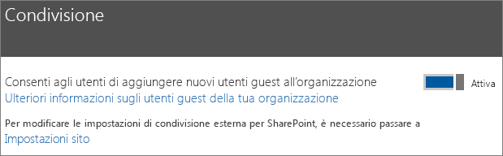
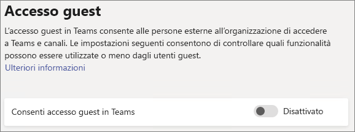
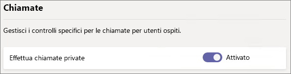
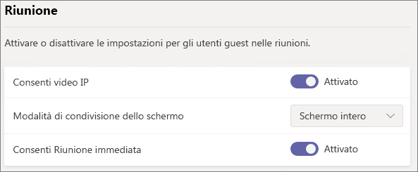
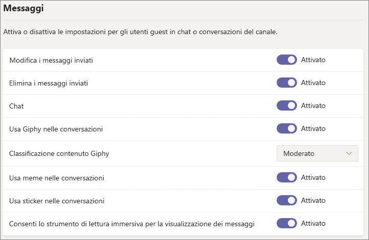
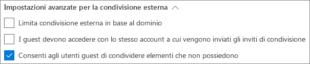
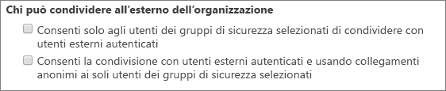

# Riferimento alle impostazioni di condivisione guest di Microsoft 365Microsoft 365 guest sharing settings reference

Questo articolo fornisce informazioni di riferimento per le varie impostazioni che possono interessare la condivisione con persone esterne all'organizzazione per i carichi di lavoro di Microsoft 365: Teams, Gruppi di Office 365, SharePoint e OneDrive.This article provides a reference for the various settings that can affect sharing with people outside your organization for the Microsoft 365 workloads: Teams, Office 365 Groups, SharePoint, and OneDrive. Queste impostazioni si trovano nelle interfacce di amministrazione di Azure Active Directory, Microsoft 365, Teams e SharePoint admin centers.These settings are located in the Azure Active Directory, Microsoft 365, Teams, and SharePoint admin centers.

## Azure Active DirectoryAzure Active Directory

**Ruolo di amministratore:** Amministratore globale**Admin role:** Global administrator

Azure Active Directory è il servizio directory utilizzato da Microsoft 365.Azure Active Directory is the directory service used by  Microsoft 365. Le impostazioni delle relazioni aziendali di Azure Active Directory interessano direttamente la condivisione in Teams, Gruppi di Office 365, SharePoint e OneDrive.The Azure Active Directory Organizational relationships settings directly affect sharing in Teams, Office 365 Groups, SharePoint, and OneDrive.

> [!NOTE]
> Queste impostazioni influiscono su SharePoint solo se è stata configurata [l'integrazione di SharePoint e OneDrive con Azure AD B2B (anteprima)](https://docs.microsoft.com/sharepoint/sharepoint-azureb2b-integration-preview).These settings only affect SharePoint when [SharePoint and OneDrive integration with Azure AD B2B (Preview)](https://docs.microsoft.com/sharepoint/sharepoint-azureb2b-integration-preview) has been configured. Nella tabella seguente si presuppone che sia stata configurata.The table below assumes that this has been configured.

### Impostazioni delle relazioni aziendaliOrganizational relationships settings

**Navigazione:** [Interfaccia di amministrazione di Azure Active Directory](https://aad.portal.azure.com) > Azure Active Directory > Relazioni aziendali > Impostazioni**Navigation:** [Azure Active Directory admin center](https://aad.portal.azure.com) > Azure Active Directory > Organizational relationships > Settings

|**Impostazione****Setting**|**Predefinita****Default**|**Descrizione****Description**|
|:-----|:-----|:-----|
|Le autorizzazioni degli utenti guest sono limitateGuest users permissions are limited|SìYes|Questa impostazione interessa le attività della directory che un utente guest può eseguire.This setting affects the directory tasks that a guest can perform.|
|Gli amministratori e gli utenti nel ruolo Mittente dell'invito guest possono inviare invitiAdmins and users in the guest inviter role can invite|SìYes|Se l'impostazione è su **Sì**, gli amministratori possono invitare utenti guest tramite Azure AD e tramite le esperienze di condivisione di Microsoft 365, come Teams e SharePoint; se l'impostazione è su **No**, non possono farlo.When set to **Yes**, admins can invite guests via Azure AD and via  Microsoft 365 sharing experiences such as Teams and SharePoint; when set to **No**, they cannot.|
|I membri possono invitareMembers can invite|SìYes|Se l'impostazione è su **Sì**, i membri di Azure AD possono invitare utenti guest tramite Azure AD; se l'impostazione è su **No**, non possono farlo.When set to **Yes**, Azure AD members can invite guests via Azure AD; when set to **No**, they cannot. Se l'impostazione è su **Sì**, i membri di Gruppi di Office 365 possono invitare utenti guest con l'approvazione dei proprietari; se l'impostazione è su **No**, i membri di Gruppi di Office 365 possono invitare utenti guest con l'approvazione dei proprietari ma i proprietari devono essere amministratori globali per concedere l'approvazione.When set to **Yes**, Office 365 Group members can invite guests with owner approval; when set to **No**, Office 365 Group members can invite guests with owner approval but owners must be global administrators to approve.   Tenere presente che **I membri possono invitare** si riferisce ai membri di Azure AD (anziché agli utenti guest) e non ai membri di siti o gruppi in Microsoft 365.Note that **Members can invite** refers to members in Azure AD (as opposed to guests) and not to site or group members in  Microsoft 365.   È identica all'impostazione **Consenti agli utenti di aggiungere nuovi utenti guest all'organizzazione** in Sicurezza e protezione di Microsoft 365.This is identical to the **Let users add new guests to the organization** setting in Microsoft 365 Security & privacy.|
|Gli utenti guest possono invitareGuests can invite|SìYes|Se l'impostazione è su **Sì**, gli utenti guest nella directory possono invitare altri utenti guest a collaborare su risorse di Azure AD e su file e cartelle in SharePoint e OneDrive; se l'impostazione è su **No**, non possono farlo.When set to **Yes**, guests in the directory can invite other guests to collaborate on Azure AD resources and on files and folders in SharePoint and OneDrive; when set to **No**, they cannot.   Tenere presente che **Consentire agli utenti esterni di trovare gli account utente nella directory digitando le corrispondenze esatte degli indirizzi di posta elettronica** deve essere attivata nell'interfaccia di amministrazione di SharePoint affinché gli utenti guest possano condividere file e cartelle con altri utenti guest.Note that **Allow external users to find user accounts in the directory by typing in exact email address matches** must be turned on in the SharePoint admin center for guests to share files and folders with other guests.|
|Abilita passcode monouso tramite posta elettronica per gli utenti guest (anteprima)Enable Email One-Time Passcode for guests (Preview)|NoNo|Se l'impostazione è su **Sì**, gli utenti guest senza un account del servizio gestito o un account aziendale o dell'istituto di istruzione possono [eseguire l'autenticazione con Azure AD utilizzando un passcode monouso](https://docs.microsoft.com/azure/active-directory/b2b/one-time-passcode); se l'impostazione è su **No**, gli utenti dovranno creare un account Microsoft per eseguire l'autenticazione.When set to **Yes**, guests without an MSA or a work or school account can [authenticate with Azure AD using a one-time passcode](https://docs.microsoft.com/azure/active-directory/b2b/one-time-passcode); when set to **No**, users will need to create a Microsoft account in order to authenticate. Questa impostazione deve essere su **Sì** affinché [Integrazione di SharePoint e OneDrive con Azure AD B2B (anteprima)](https://docs.microsoft.com/sharepoint/sharepoint-azureb2b-integration-preview) funzioni.This setting must be set to **Yes** for [SharePoint and OneDrive integration with Azure AD B2B (Preview)](https://docs.microsoft.com/sharepoint/sharepoint-azureb2b-integration-preview) to work.|
|Restrizioni di collaborazioneCollaboration restrictions|Consenti l'invio di inviti a qualsiasi dominioAllow invitations to be sent to any domain|Questa impostazione consente di specificare un elenco di domini autorizzati o bloccati per la condivisione.This setting allows you to specify a list of allowed or blocked domains for sharing. Se si specificano domini autorizzati, gli inviti di condivisione possono essere inviati solo a tali domini.When allowed domains are specified, then sharing invitations can only be sent to those domains. Se si specificano domini non autorizzati, gli inviti di condivisione non possono essere inviati a tali domini.When denied domains are specified, then sharing invitations cannot be sent to those domains.   Questa impostazione interessa le esperienze di condivisione di Microsoft 365 come Teams e SharePoint.This setting affects  Microsoft 365 sharing experiences such as Teams and SharePoint. È possibile autorizzare o bloccare i domini a un livello più granulare utilizzando i filtri per i domini in SharePoint o Teams.You can allow or block domains at a more granular level by using domain filtering in SharePoint or Teams.|

Questa impostazione influisce sul modo in cui gli utenti sono invitati nella directory.These settings affect how users are invited to the directory. Non influisce sulla condivisione con gli utenti guest già presenti nella directory.They do not affect sharing with guests who are already in the directory.

## Microsoft 365Microsoft 365

**Ruolo di amministratore:** Amministratore globale**Admin role:** Global administrator

L'interfaccia di amministrazione di Microsoft 365 presenta delle impostazioni a livello di organizzazione per la condivisione e per Gruppi di Office 365.The Microsoft 365 admin center has organization-level settings for sharing and for Office 365 Groups.

### CondivisioneSharing

**Navigazione:** [Interfaccia di amministrazione di Microsoft 365](https://admin.microsoft.com) > Impostazioni > Impostazioni > scheda Sicurezza e privacy > Condivisione**Navigation:** [Microsoft 365 admin center](https://admin.microsoft.com) > Settings > Settings > Security & privacy tab > Sharing

|**Impostazione****Setting**|**Predefinita****Default**|**Descrizione****Description**|
|:-----|:-----|:-----|
|Consenti agli utenti di aggiungere nuovi utenti guest all'organizzazioneLet users add new guests to the organization|AttivatoOn|Se l'impostazione è su **Sì**, i membri di Azure AD possono invitare utenti guest tramite Azure AD; se l'impostazione è su **No**, non possono farlo.When set to **Yes**, Azure AD members can invite guests via Azure AD; when set to **No**, they cannot. Se l'impostazione è su **Sì**, i membri di Gruppi di Office 365 possono invitare utenti guest con l'approvazione dei proprietari; se l'impostazione è su **No**, i membri di Gruppi di Office 365 possono invitare utenti guest con l'approvazione dei proprietari ma i proprietari devono essere amministratori globali per concedere l'approvazione.When set to **Yes**, Office 365 Group members can invite guests with owner approval; when set to **No**, Office 365 Group members can invite guests with owner approval but owners must be global administrators to approve.   Tenere presente che **I membri possono invitare** si riferisce ai membri di Azure AD (anziché agli utenti guest) e non ai membri di siti o gruppi in Microsoft 365.Note that **Members can invite** refers to members in Azure AD (as opposed to guests) and not to site or group members in  Microsoft 365.   È identica all'impostazione **I membri possono invitare** nelle impostazioni delle relazioni aziendali di Azure Active Directory.This is identical to the **Members can invite** setting in Azure Active Directory Organizational relationships settings.|

### Gruppi di Office 365Office 365 Groups

**Navigazione:** [Interfaccia di amministrazione di Microsoft 365](https://admin.microsoft.com) > Impostazioni > Impostazioni > Gruppi di Office 365**Navigation:** [Microsoft 365 admin center](https://admin.microsoft.com) > Settings > Settings > Office 365 Groups

|**Impostazione****Setting**|**Predefinita****Default**|**Descrizione****Description**|
|:-----|:-----|:-----|
|Consenti ai membri del gruppo esterni all'organizzazione di accedere al contenuto del gruppoLet group members outside your organization access group content|AttivatoOn|Se l'impostazione è su **Attivato**, gli utenti guest possono accedere al contenuto del gruppo; se l'impostazione è su **Disattivato**, non possono farlo.When set to **On**, guests can access groups content; when set to **Off**, they can't. Questa impostazione deve essere su **Attivato** per qualsiasi scenario in cui gli utenti guest interagiscono con Teams o Gruppi di Office 365.This setting should be **On** for any scenario where guest users are interacting with Office 365 Groups or Teams.|
|Consenti ai proprietari del gruppo di aggiungere persone esterne all'organizzazione ai gruppiLet group owners add people outside your organization to groups|AttivatoOn|Se è su **Attivato**, i proprietari di Teams o Gruppi di Office 365 possono invitare nuovi utenti guest al gruppo.When **On**, Owners of Office 365 Groups or Teams can invite new guests to the group. Se è su **Disattivato**, i proprietari possono invitare solo utenti guest già presenti nella directory.When **Off**, owners can only invite guests who are already in the directory.|

Queste impostazioni sono a livello di organizzazione.These settings are at the organization level. Vedere [Creare impostazioni per un gruppo specifico](https://docs.microsoft.com/azure/active-directory/users-groups-roles/groups-settings-cmdlets#create-settings-for-a-specific-group) per informazioni sulle modifiche di queste impostazioni a livello di gruppo con PowerShell.See [Create settings for a specific group](https://docs.microsoft.com/azure/active-directory/users-groups-roles/groups-settings-cmdlets#create-settings-for-a-specific-group) for information about how to change these settings at the group level by using PowerShell.

## TeamsTeams

L'opzione di accesso guest principale di Teams, **Consenti accesso ospite in Teams**, deve essere **attivata** affinché le altre impostazioni guest siano disponibili.The Teams master guest access switch, **Allow guest access in Teams**, must be **On** for the other guest settings to be available.

**Ruolo di amministratore:** Amministratore del servizio Teams**Admin role:** Teams service administrator

### Accesso guestGuest access

**Navigazione:** [Interfaccia di amministrazione di Teams](https://admin.teams.microsoft.com) > Impostazioni organizzazione > Accesso guest**Navigation:** [Teams admin center](https://admin.teams.microsoft.com) > Org-wide settings > Guest access

|**Impostazione****Setting**|**Predefinita****Default**|**Descrizione****Description**|
|:-----|:-----|:-----|
|Consenti accesso ospite in TeamsAllow guest access in Teams|DisattivatoOff|Attiva o disattiva l'accesso guest per Teams.Turns guest access on or off for Teams overall. L'applicazione di questa impostazione può richiedere 24 ore una volta modificata.This setting can take 24 hours to take effect once changed.|

### Chiamate guestGuest calling

**Navigazione:** [Interfaccia di amministrazione di Teams](https://admin.teams.microsoft.com) > Impostazioni organizzazione > Accesso guest**Navigation:** [Teams admin center](https://admin.teams.microsoft.com) > Org-wide settings > Guest access

|**Impostazione****Setting**|**Predefinita****Default**|**Descrizione****Description**|
|:-----|:-----|:-----|
|Effettua chiamate privateMake private calls|AttivatoOn|Se è su **Attivato**, gli utenti guest possono effettuare chiamate peer-to-peer in Teams; se è su **Disattivato**, non possono farlo.When **On**, guests can make peer-to-peer calls in Teams; when **Off**, they can't.|

### Riunioni guestGuest meeting

**Navigazione:** [Interfaccia di amministrazione di Teams](https://admin.teams.microsoft.com) > Impostazioni organizzazione > Accesso guest**Navigation:** [Teams admin center](https://admin.teams.microsoft.com) > Org-wide settings > Guest access

|**Impostazione****Setting**|**Predefinita****Default**|**Descrizione****Description**|
|:-----|:-----|:-----|
|Consenti video IPAllow IP video|AttivatoOn|Se è su **Attivato**, gli utenti guest possono utilizzare i video nelle chiamate e nelle riunioni; se è su **Disattivato**, non possono farlo.When **On**, guests can use video in their calls and meetings; when **Off**, they can't.|
|Modalità di condivisione dello schermoScreen sharing mode|Schermo interoEntire screen|Se **disabilitato**, gli utenti guest non possono condividere gli schermi in Teams.When **Disabled**, guests can't share their screens in Teams. Se impostato su **Applicazione singola**, gli utenti guest possono condividere solo una singola applicazione sullo schermo.When set to **Single application**, guests can only share a single application on their screen. Se impostato su **Schermo intero**, gli utenti guest possono scegliere di condividere un'applicazione o lo schermo interno.When set to **Entire screen**, guests can choose to share an applicaion or their entire screen.|
|Consenti Riunione immediataAllow Meet Now|AttivatoOn|Se è su **Attivato**, gli utenti guest possono utilizzare la funzionalità Riunione immediata in Teams; se è su **Disattivato**, non possono farlo.When **On**, guests can use the Meet Now feature in Teams; when **Off**, they can't.|

### Messaggistica guestGuest messaging

**Navigazione:** [Interfaccia di amministrazione di Teams](https://admin.teams.microsoft.com) > Impostazioni organizzazione > Accesso guest**Navigation:** [Teams admin center](https://admin.teams.microsoft.com) > Org-wide settings > Guest access

|**Impostazione****Setting**|**Predefinita****Default**|**Descrizione****Description**|
|:-----|:-----|:-----|
|Modifica i messaggi inviatiEdit sent messages|AttivatoOn|Se è su **Attivato**, gli utenti guest possono modificare i messaggi inviati in precedenza; se è su **Disattivato**, non possono farlo.When **On**, guests can edit messages they previously sent; when **Off**, they can't.|
|Elimina i messaggi inviatiDelete sent messages|AttivatoOn|Se è su **Attivato**, gli utenti guest possono eliminare i messaggi inviati in precedenza; se è su **Disattivato**, non possono farlo.When **On**, guests can delete messages they previously sent; when **Off**, they can't.|
|ChatChat|AttivatoOn|Se è su **Attivato**, gli utenti guest possono utilizzare la chat in Teams; se è su **Disattivato**, non possono farlo.When **On**, guests can use chat in Teams; when **Off**, they can't.|
|Usa Giphy nelle conversazioniUse Giphys in conversations|AttivatoOn|Se è su **Attivato**, gli utenti guest possono usare Giphy nelle conversazioni; se è su **Disattivato**, non possono farlo.When **On**, guests can use Giphys in conversations; when **Off**, they can't.|
|Classificazione contenuto GiphyGiphy content rating|ModeratoModerate|Se impostato su **Consenti tutti i contenuti**, gli utenti guest possono inserire tutti i contenuti Giphy nelle chat, indipendentemente dalla loro classificazione.When set to **Allow all content**, guests will can insert all Giphys in chats, regardless of the content rating. Se impostato su **Moderato**, gli utenti guest possono inserire contenuti Giphy nelle chat, ma i contenuti per adulti saranno moderatamente limitati.Wnen set to **Moderate** guests can insert Giphys in chats, but will be moderately restricted from adult content. Se impostato su **Rigido**, gli utenti guest possono inserire contenuti Giphy nelle chat, ma i contenuti per adulti saranno vietati.When set to **Strict** guests can insert Giphys in chats, but will be restricted from inserting adult content.|
|Usa meme nelle conversazioniUse Memes in conversations|AttivatoOn|Se è su **Attivato**, gli utenti guest possono usare meme nelle conversazioni; se è su **Disattivato**, non possono farlo.When **On**, guests can use memes in conversations; when **Off**, they can't.|
|Usa sticker nelle conversazioniUser stickers in conversations|AttivatoOn|Se è su **Attivato**, gli utenti guest possono usare sticker nelle conversazioni; se è su **Disattivato**, non possono farlo.When **On**, guests can use stickers in conversations; when **Off**, they can't.|
|Consenti lo strumento di lettura immersiva per la visualizzazione dei messaggiAllow immersive reader for viewing messages|AttivatoOn|Se è su **Attivato**, gli utenti guest possono visualizzare i messaggi con lo strumento di lettura immersiva; se è su **Disattivato**, non possono farlo.When **On**, guests can view messages in Immersive Reader; when **Off**, they can't.|

## SharePoint e OneDrive (livello organizzazione)SharePoint and OneDrive (organization-level)

**Ruolo di amministratore:** Amministratore di SharePoint**Admin role:** SharePoint administrator

Queste impostazioni influiscono su tutti i siti dell'organizzazione.These settings affect all of the sites in the organization. Non influiscono direttamente su Teams o Gruppi di Office 365, ma è consigliabile allineare queste impostazioni a quelle di Teams e Gruppi di Office 365 per evitare problemi con l'esperienza utente.They do not affect Office 365 Groups or Teams directly, however we recommend that you align these settings with the settings for Office 365 Groups and Teams to avoid user experience issues. Se, ad esempio, la condivisione guest è consentita in Teams ma non in SharePoint, gli utenti guest in Teams non avranno accesso alla scheda File perché i file di Teams sono archiviati in SharePoint.(For example, if guest sharing is allowed in Teams but not SharePoint, then guests in Teams will not have access to the Files tab because Teams files are stored in SharePoint.)

### Impostazioni di condivisione in SharePoint e OneDriveSharePoint and OneDrive sharing settings

Poiché OneDrive è una gerarchia di siti all'interno di SharePoint, le impostazioni di condivisione a livello di organizzazione influiscono direttamente su OneDrive come per altri siti di SharePoint.Because OneDrive is a hierarchy of sites within SharePoint, the organization-level sharing settings directly affect OneDrive just as they do other SharePoint sites.

**Navigazione:** Interfaccia di amministrazione di SharePoint > Condivisione**Navigation:** SharePoint admin center > Sharing

|**Impostazione****Setting**|**Predefinita****Default**|**Descrizione****Description**|
|:-----|:-----|:-----|
|SharePointSharePoint|ChiunqueAnyone|Specifica le autorizzazioni di condivisione più permissive consentite per i siti di SharePoint.Specifies the most permissive sharing permissions allowed for SharePoint sites.|
|OneDriveOneDrive|ChiunqueAnyone|Specifica le autorizzazioni di condivisione più permissive consentite per i siti di OneDrive.Specifies the most permissive sharing permissions allowed for OneDrive sites. Questa impostazione non può essere più permissiva dell'impostazione di SharePoint.This setting cannot be more permissive than the SharePoint setting.|

### Impostazioni di condivisione avanzate in SharePoint e OneDriveSharePoint and OneDrive advanced sharing settings

**Navigazione:** Interfaccia di amministrazione di SharePoint > Condivisione**Navigation:** SharePoint admin center > Sharing

|**Impostazione****Setting**|**Predefinita****Default**|**Descrizione****Description**|
|:-----|:-----|:-----|
|Limita condivisione esterna in base al dominioLimit external sharing by domain|DisattivatoOff|Questa impostazione consente di specificare un elenco di domini autorizzati o bloccati per la condivisione.This setting allows you to specify a list of allowed or blocked domains for sharing. Se si specificano domini autorizzati, gli inviti di condivisione possono essere inviati solo a tali domini.When allowed domains are specified, then sharing invitations can only be sent to those domains. Se si specificano domini non autorizzati, gli inviti di condivisione non possono essere inviati a tali domini.When denied domains are specified, then sharing invitations cannot be sent to those domains.   Questa impostazione influisce su tutti i siti di SharePoint e OneDrive nell'organizzazione.This setting affects all SharePoint and OneDrive sites in the organization.|
|Gli utenti guest devono accedere con lo stesso account a cui vengono inviati gli inviti di condivisioneGuests must sign in using the same account to which sharing invitations are sent|DisattivatoOff|Impedisce agli utenti guest di utilizzare gli inviti di condivisione dei siti con un indirizzo di posta elettronica diverso da quello al quale è stato inviato l'invito.Prevents guests from redeeming site sharing invitations using a different email address than the invitation was sent to.  [L'integrazione di SharePoint e OneDrive con Azure AD B2B (anteprima)](https://docs.microsoft.com/sharepoint/sharepoint-azureb2b-integration-preview) non usa questa impostazione perché tutti gli utenti guest vengono aggiunti alla directory in base all'indirizzo di posta elettronica al quale è stato inviato l'invito.[SharePoint and OneDrive integration with Azure AD B2B (Preview)](https://docs.microsoft.com/sharepoint/sharepoint-azureb2b-integration-preview) does not use this setting because all guests are added to the directory based on the email address that the invitation was sent to. Non è possibile utilizzare indirizzi di posta elettronica alternativi per accedere al sito.Alternate email addresses cannot be used to access the site.|
|Consenti agli utenti guest di condividere elementi che non possiedonoAllow guests to share items they don't own|AttivatoOn|Se è su **Attivato**, gli utenti guest possono condividere elementi che non possiedono con altri utenti o utenti guest; se è su **Disattivato**, non possono farlo.When **On**, guests can share items that they don't own with other users or guests; when **Off** they cannot. Gli utenti guest possono sempre condividere elementi di cui hanno il controllo completo.Guests can always share items for which they have full control.|

### Impostazioni dei collegamenti a file e cartelle di SharePoint e OneDriveSharePoint and OneDrive file and folder link settings

Quando si condividono file e cartelle in SharePoint e OneDrive, ai destinatari della condivisione viene inviato un collegamento con le autorizzazioni per il file o la cartella, anziché l'autorizzazione di accesso diretto al file o alla cartella.When files and folders are shared in SharePoint and OneDrive, sharing recipients are sent a link with permissions to the file or folder rather than being granted direct access to the file or folder themselves. Sono disponibili diversi tipi di collegamenti ed è possibile scegliere quello predefinito presentato agli utenti quando condividono un file o una cartella.Several types of links are available, and you can choose the default link type presented to users when they share a file or folder. È inoltre possibile impostare autorizzazioni e opzioni di scadenza per i collegamenti *Chiunque*.You can also set permissions and expiration options for *Anyone* links.

**Navigazione:** Interfaccia di amministrazione di SharePoint > Condivisione**Navigation:** SharePoint admin center > Sharing

|**Impostazione****Setting**|**Predefinita****Default**|**Descrizione****Description**|
|:-----|:-----|:-----|
|Collegamenti di file e cartelleFile and folder links|Chiunque abbia il collegamentoAnyone with the link|Specifica quale collegamento di condivisione viene visualizzato per impostazione predefinita quando un utente condivide un file o una cartella.Specifies which sharing link is shown by default when a user shares a file or folder. Se lo desiderano, gli utenti possono modificare l'opzione prima di condividere.Users can change the option before sharing if they want. Se l'impostazione predefinita è su **Chiunque abbia il collegamento** e *Chiunque*, la condivisione non è consentita per un determinato sito, **Solo persone nell'organizzazione** sarà visualizzata come impostazione predefinita per tale sito.If the default is set to **Anyone with the link** and *Anyone* sharing is not allowed for a given site, then **Only people in your organization** will be shown as the default for that site.|
|Questi collegamenti devono scadere entro questo numero di giorniThese links must expire within this many days|Disattivato (nessuna scadenza)Off (no expiration)|Specifica il numero di giorni dopo che un collegamento *Chiunque* creato scade.Specifies the number of days after an *Anyone* link is created that it expires. I collegamenti scaduti non possono essere rinnovati.Expired links cannot be renewed. Creare un nuovo collegamento se è necessario continuare a condividere dopo la scadenza.Create a new link if you need to continue sharing past the expiration.|
|Autorizzazioni per i fileFile permissions|Visualizzazione e modificaView and edit|Specifica i livelli di autorizzazione per i file disponibili per gli utenti quando si crea un collegamento *Chiunque*.Specifies the file permission levels available to users when creating an *Anyone* link. Se si seleziona **Visualizzazione**, gli utenti possono creare collegamenti ai file *Chiunque* solo con autorizzazioni di visualizzazione.If **View** is selected, then users can only create *Anyone* file links with view permissions. Se si seleziona **Visualizzazione e modifica**, gli utenti possono scegliere tra le autorizzazioni di visualizzazione e le autorizzazioni di visualizzazione e modifica quando creano il collegamento.If **View, and edit** is selected, then users can choose between view and view and edit permissions when they create the link.|
|Autorizzazioni per le cartelleFolder permissions|Visualizzazione, modifica e caricamentoView, edit, and upload|Specifica i livelli di autorizzazione per le cartelle disponibili per gli utenti quando si crea un collegamento *Chiunque*.Specifies the folder permission levels available to users when creating an *Anyone* link. Se si seleziona **Visualizzazione**, gli utenti possono creare collegamenti alle cartelle *Chiunque* solo con autorizzazioni di visualizzazione.If **View** is selected, then users can only create *Anyone* folder links with view permissions. Se si seleziona **Visualizzazione, modifica e caricamento**, gli utenti possono scegliere tra le autorizzazioni di visualizzazione e le autorizzazioni di visualizzazione, modifica e caricamento quando creano il collegamento.If **View, edit, and upload** is selected, then users can choose between view and view, edit, and upload permissions when they creat the link.|

### Impostazioni dei gruppi di sicurezza in SharePoint e OneDriveSharePoint and OneDrive security group settings

Se si desidera limitare chi può condividere contenuti con utenti guest in SharePoint e OneDrive, è possibile farlo limitando la condivisione alle persone in gruppi di sicurezza specifici.If you want to limit who can share with guests in SharePoint and OneDrive, you can do so by limiting sharing to people in specified security groups. Queste impostazioni non influiscono sulla condivisione tramite Teams o Gruppi di Office 365.These settings do not affect sharing via Office 365 Groups or Teams. Gli utenti guest invitati tramite un gruppo o un team hanno accesso anche al sito associato, anche se la condivisione di documenti e cartelle può essere eseguita solo da persone nei gruppi di sicurezza specificati.Guests invited via a group or team would also have access to the associated site, though document and folder sharing could only be done by people in the specified security groups.

**Navigazione:** Interfaccia di amministrazione di SharePoint > Condivisione > Limitare la condivisione esterna ai gruppi di sicurezza**Navigation:** SharePoint admin center > Sharing > Limit external sharing to specific security groups

|**Impostazione****Setting**|**Predefinita****Default**|**Descrizione****Description**|
|:-----|:-----|:-----|
|Consenti solo agli utenti dei gruppi di sicurezza selezionati di condividere con utenti esterni autenticatiLet only users in selected security groups share with authenticated external users|DisattivatoOff|Se è su **Attivato**, solo le persone nei gruppi di sicurezza specificati possono condividere con gli utenti esterni.When **On**, only the people in the specified security groups can share with external users. Sono disponibili solo i collegamenti *Persone specifiche*.Only *Specific people* links are available. La condivisione *Chiunque* è disabilitata a meno che anche **Consenti la condivisione con utenti esterni autenticati e usando collegamenti anonimi ai soli utenti dei gruppi di sicurezza selezionati** sia su **Attivato***Anyone* sharing is effectively disabled unless **Let only users in selected security groups share with authenticated external users and using anonymous links** is also **On**|
|Consenti la condivisione con utenti esterni autenticati e usando collegamenti anonimi ai soli utenti dei gruppi di sicurezza selezionatiLet only users in selected security groups share with authenticated external users and using anonymous links|DisattivatoOff|Se è su **Attivato**, solo le persone nei gruppi di sicurezza specificati possono condividere con utenti guest.When **On**, only the people in the specified security groups can share with guests. Sono disponibili i collegamenti *Chiunque* e *Persone specifiche*.Both *Anyone* and *Specific people* links are available.|

Queste due impostazioni possono essere usate contemporaneamente.Both of these settings can be used at the same time. Se un utente si trova nel gruppo di sicurezza specificato per entrambe le impostazioni, il livello di autorizzazione più elevato prevale (*Chiunque* più *Utente specifico*).If a user is in security groups specified for both settings, then the greater permission level prevails (*Anyone* plus *Specific user*).

## SharePoint (livello sito)SharePoint (site level)

**Ruolo di amministratore:** Amministratore di SharePoint**Admin role:** SharePoint administrator

Poiché queste impostazioni sono soggette alle impostazioni a livello di organizzazione per SharePoint, l'impostazione di condivisione effettiva per il sito potrebbe cambiare se l'impostazione a livello di organizzazione cambia.Because these settings are subject to the organization-wide settings for SharePoint, the effective sharing setting for the site may change if the organization-level setting changes. Se si sceglie un'impostazione qui e il livello di organizzazione viene impostato successivamente su un valore più restrittivo, a questo sito sarà applicato tale livello più restrittivo.If you choose a setting here and the organization-level is later set to a more restrictive value, then this site will operate at that more restrictive value. Ad esempio, se si sceglie **Chiunque** e l'impostazione a livello di organizzazione viene in seguito impostata su **Utenti guest nuovi ed esistenti**, il sito consentirà solo utenti guest nuovi ed esistenti.For example, if you choose **Anyone** and the organization-level setting is later set to **New and existing guests**, then this site will only allow new and existing guests. Se l'impostazione a livello di organizzazione viene quindi reimpostata su **Chiunque**, il sito consentirà di nuovo i collegamenti *Chiunque*.If the organization-level setting is then set back to **Anyone**, this site would again allow *Anyone* links.

### Condivisione di sitiSite sharing

È possibile impostare le autorizzazioni di condivisione guest per ogni sito di SharePoint.You can set guest sharing permissions for each site in SharePoint. Questa impostazione è valida sia per la condivisione di siti che per la condivisione di file e cartelle.This setting applies to both site sharing and file and folder sharing. La condivisione *Chiunque* non è disponibile per la condivisione di siti.(*Anyone* sharing is not available for site sharing. Se si sceglie **Chiunque**, gli utenti possono condividere file e cartelle utilizzando i collegamenti *Chiunque* e il sito stesso con utenti guest nuovi ed esistenti.If you choose **Anyone**, users will be able to share files and folders by using *Anyone* links, and the site itself with new and existing guests.)

**Navigazione:** Interfaccia di amministrazione di SharePoint > Siti attivi > selezionare il sito > scheda Criteri > Modifica le impostazioni di condivisione esterna**Navigation:** SharePoint admin center > Active sites > select the site > Policies tab > Edit External sharing

|**Impostazione****Setting**|**Predefinita****Default**|**Descrizione****Description**|
|:-----|:-----|:-----|
|Il contenuto del sito può essere condiviso con:Site content can be shared with|Varia in base al tipo di sito (vedere la tabella seguente)Varies by site type (see the table below)|Indica il tipo di condivisione esterna consentito per il sito.Indicates the type of external sharing allowed for this site. Le opzioni disponibili qui sono soggette alle impostazioni di condivisione a livello di organizzazione per SharePoint.Options available here are subject to the organization-level sharing settings for SharePoint.|

### Impostazioni dei collegamenti a file e cartelle dei sitiSite file and folder link settings

È possibile configurare impostazioni predefinite per il tipo di collegamento, le autorizzazioni e la scadenza dei collegamenti *Chiunque* per ogni sito.You can set defaults for link type and permissions, and expiration settings for *Anyone* links for each site. Se configurate al livello del sito, queste impostazioni sostituiscono le impostazioni a livello di organizzazione.When set at the site level, these settings override the organization-level settings. Si noti che se i collegamenti *Chiunque* sono disabilitati a livello dell'organizzazione, *Chiunque* non sarà un tipo di collegamento disponibile a livello di sito.Note that if *Anyone* links are disabled at the organization level, *Anyone* will not be an available link type at the site level.

**Navigazione:** Interfaccia di amministrazione di SharePoint > Siti attivi > selezionare il sito > scheda Criteri > Modifica le impostazioni di condivisione esterna**Navigation:** SharePoint admin center > Active sites > select the site > Policies tab > Edit External sharing

|**Impostazione****Setting**|**Predefinita****Default**|**Descrizione****Description**|
|:-----|:-----|:-----|
|Limita la condivisione esterna in base al dominioLimit sharing by domain|OffOff|Questa impostazione consente di specificare un elenco di domini autorizzati o bloccati per la condivisione.This setting allows you to specify a list of allowed or blocked domains for sharing. Se si specificano domini autorizzati, gli inviti di condivisione possono essere inviati solo a tali domini.When allowed domains are specified, then sharing invitations can only be sent to those domains. Se si specificano domini non autorizzati, gli inviti di condivisione non possono essere inviati a tali domini.When denied domains are specified, then sharing invitations cannot be sent to those domains.   Questa impostazione non può essere usata per ignorare le restrizioni sul dominio impostate a livello di organizzazione o di Azure AD.This setting cannot be used to override domain restrictions set at the organization or Azure AD level.|
|Tipo di collegamento di condivisione predefinitoDefault sharing link type|Uguale all'impostazione a livello di organizzazioneSame as organization-level setting|Questa impostazione consente di specificare il collegamento di condivisione predefinito presentato agli utenti del sito.This setting allows you to specify the default sharing link presented to users in this site. L'opzione *Uguale all'impostazione a livello di organizzazione* è definita da una combinazione di impostazioni di condivisione a livello di organizzazione e di sito.The *Same as organization-level setting* option is defined by a combination of organization and site sharing settings.|
|Impostazioni avanzate per i collegamenti di tipo "Chiunque"Advanced settings for Anyone links|Uguale all'impostazione a livello di organizzazioneSame as organization-level setting|Specifica il numero di giorni dopo cui scade un collegamento *Chiunque* creato per un file di questo sito.Specifies the number of days after an *Anyone* link is created for a file in this site that it expires. I collegamenti scaduti non possono essere rinnovati.Expired links cannot be renewed. Creare un nuovo collegamento se è necessario continuare a condividere dopo la scadenza.Create a new link if you need to continue sharing past the expiration.|
|Autorizzazione collegamento predefinitaDefault link permission|Uguale all'impostazione a livello di organizzazioneSame as organization-level setting|Questa impostazione consente di specificare l'autorizzazione predefinita (Visualizzazione o Modifica) per la i collegamenti di condivisione creati per i file nel sito.This setting allows you to specify the default permission (View or Edit) for sharing links created for files in this site.|

### Impostazioni di condivisione del sito predefiniteDefault site sharing settings

Nella tabella seguente viene mostrata l'impostazione di condivisione predefinita per ogni tipo di sito.The table below shows the default sharing setting for each site type.

|**Tipo di sito****Site type**|**Impostazione di condivisione predefinita****Default sharing setting**|
|:-----|:-----|
|ClassicoClassic|**Solo gli utenti dell'organizzazione****Only people in your organization**|
|OneDriveOneDrive|**Chiunque****Anyone**|
|Siti collegati ai gruppi (tra cui Teams)Group-connected sites (including Teams)|**Utenti guest nuovi ed esistenti** se l'impostazione di Gruppi di Office 365 **Consenti ai proprietari di gruppi di aggiungere persone esterne all'organizzazione ai gruppi** è su **Attivato**; altrimenti, **Solo utenti guest esistenti****New and existing guests** if the Office 365 Groups setting **Let group owners add people outside the organization to groups** is **On**; otherwise **Existing guests only**|
|ComunicazioneCommunication|**Solo gli utenti dell'organizzazione****Only people in your organization**|
|Siti moderni senza gruppo (#STS3 TeamSite)Modern sites with no group (#STS3 TeamSite)|**Solo gli utenti dell'organizzazione****Only people in your organization**|

> [!NOTE]
> Il sito radice di comunicazione (tenant-name.sharepoint.com) include un'opzione di condivisione predefinita impostata su **Chiunque**.The root communication site (tenant-name.sharepoint.com) has a default sharing setting of **Anyone**.

## Vedere ancheSee also

[Panoramica sulla condivisione esterna in SharePoint e OneDriveSharePoint and OneDrive external sharing overview](https://docs.microsoft.com/sharepoint/external-sharing-overview)

[Accesso guest in Microsoft TeamsGuest access in Microsoft Teams](https://docs.microsoft.com/MicrosoftTeams/guest-access)

[Aggiunta di utenti guest a Gruppi di Office 365Adding guests to Office 365 Groups](https://support.office.com/article/bfc7a840-868f-4fd6-a390-f347bf51aff6)
