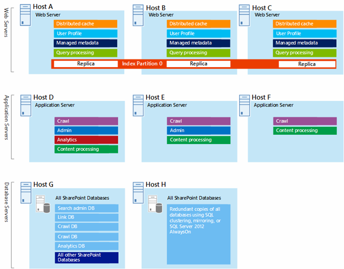
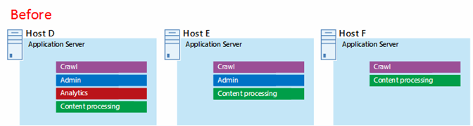
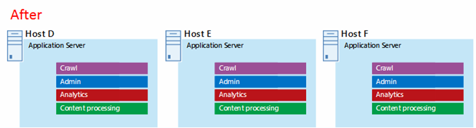

# Microsoft Azure Architectures for SharePoint 2013

 **Riepilogo:** Soluzioni di SharePoint 2013 possono essere ospitate in macchine virtuali di Microsoft Azure. Informazioni su quali tipi di soluzioni sono utile e configurare Microsoft Azure per ospitare uno.
  
Azure è un ambiente ottimale per l'hosting di una soluzione di SharePoint Server 2013. Nella maggior parte dei casi, è consigliabile Office 365, ma una farm di SharePoint Server ospitata in Azure può essere una buona scelta relativi a specifiche soluzioni. In questo articolo viene descritto come per l'architettura delle soluzioni in modo che siano un buon adattamento della piattaforma Azure SharePoint. Come esempi vengono utilizzate due soluzioni specifiche seguenti:
  
- [Ripristino di emergenza di SharePoint Server 2013 in Microsoft Azure](sharepoint-server-2013-disaster-recovery-in-microsoft-azure.md)
    
- [Siti Internet in Microsoft Azure che utilizzano SharePoint Server 2013](internet-sites-in-microsoft-azure-using-sharepoint-server-2013.md)
    
## Soluzioni SharePoint consigliate per servizi di infrastruttura di Azure

Servizi di infrastruttura è un'opzione interessante per l'hosting di soluzioni SharePoint. Alcune soluzioni sono la più adatta a questa piattaforma rispetto ad altri. Nella tabella seguente sono le soluzioni consigliate.
  
|**Soluzione**|**Perché questa soluzione è consigliata per Azure**|
|:-----|:-----|
|Ambienti di sviluppo e testing    |È semplice creare e gestire questi ambienti.    |
|Ripristino di emergenza di farm di SharePoint locale in Azure    |**Hosted datacenter secondario** Utilizzare Azure anziché investire in un centro dati secondario in un'area diversa.   **Ambienti di ripristino di emergenza a costo inferiore** Gestire e pagare meno risorse di un ambiente di ripristino di emergenza locale. Il numero di risorse dipende dall'ambiente di ripristino di emergenza si sceglie: Data Center con cold standby, con warm standby o hot standby.  **Piattaforma più flessibile** In caso di emergenza con facilità con scalabilità orizzontale della farm di SharePoint di ripristino per soddisfare requisiti di carico. Implementare la scalabilità quando non è più necessario le risorse.  Vedere [SharePoint Server 2013 Disaster Recovery in Microsoft Azure](sharepoint-server-2013-disaster-recovery-in-microsoft-azure.md).    |
|Siti Internet che utilizzano funzionalità e scala non è disponibile in Office 365    |**Concentrare l'attenzione** Concentrarsi sulla creazione di un sito di grande piuttosto che la creazione di infrastruttura.   **Possibilità di sfruttare la flessibilità in Azure** Dimensioni della farm per la richiesta mediante l'aggiunta di nuovi server e verrà solo per le risorse che necessarie. Allocazione macchina dinamiche non è supportata (ridimensionamento automatico).  **Utilizzo di Azure Active Directory (AD)** Trai vantaggio di Azure Active Directory per gli account dei clienti.   **Funzionalità di SharePoint aggiungere non è disponibile in Office 365** Aggiungere informazioni sui report e analitica web.   Visualizzare [I siti Internet in Microsoft Azure using SharePoint Server 2013](internet-sites-in-microsoft-azure-using-sharepoint-server-2013.md).    |
|Farm di App per il supporto di ambienti locali o di Office 365    |**Build, test e ospitare le applicazioni** in Azure per supportare sia in locale e del cloud ambienti.   **Host questo ruolo** in Azure anziché acquistare nuovi componenti hardware per gli ambienti locali.   |
   
Per intranet e soluzioni di collaborazione e carichi di lavoro, prendere in considerazione le opzioni seguenti:
  
- Determinare se Office 365 soddisfi i requisiti aziendali o può far parte della soluzione. Office 365 offre un'ampia gamma di funzionalità che è sempre aggiornato.
    
- Se Office 365 non soddisfa tutti i requisiti aziendali, prendere in considerazione un'implementazione standard di SharePoint 2013 in locale da Microsoft Consulting Services (MCS). Un'architettura standard può essere una soluzione più rapida, meno costose e più semplice per poter supportare quella personalizzata. 
    
- Se un'implementazione standard non soddisfa i requisiti aziendali, è consigliabile una soluzione personalizzata in locale.
    
- Se utilizza una piattaforma cloud è importante per i requisiti aziendali, prendere in considerazione un'implementazione standard o personalizzata di SharePoint 2013 ospitate in servizi di infrastruttura. Soluzioni di SharePoint sono molto più semplice per il supporto di altre piattaforme di cloud pubblici Microsoft non nativo in Azure.
    
## Prima progettare l'ambiente Azure

Durante questo articolo vengono utilizzate le topologie di esempio SharePoint, è possibile utilizzare questi concetti di progettazione con qualsiasi topologia della farm di SharePoint. Prima di progettare l'ambiente Azure, utilizzare le informazioni della topologia, architettura, capacità e prestazioni seguenti per progettare la farm di SharePoint:
  
- [Progettazione dell'architettura per SharePoint 2013 per professionisti IT](http://technet.microsoft.com/en-us/sharepoint/fp123594.aspx)
    
- [Pianificare le prestazioni e la gestione della capacità in SharePoint Server 2013](http://technet.microsoft.com/library/8dd52916-f77d-4444-b593-1f7d6f330e5f.aspx)
    
## Determinare il tipo di dominio Active Directory

Ogni farm di SharePoint Server si basa su Active Directory per fornire gli account amministrativi per l'installazione di farm. In questa fase sono disponibili due opzioni per le soluzioni SharePoint in Azure. Descritti nella tabella seguente.
  
|**Opzione**|**Descrizione**|
|:-----|:-----|
|Dominio dedicato    |È possibile distribuire un dominio di Active Directory dedicato e isolato in Azure per supportare la farm di SharePoint. Si tratta di una buona scelta per siti Internet pubblico.    |
|Estendere il dominio locale tramite una connessione tra locali    |Quando si estende il dominio locale tramite una connessione tra locali, gli utenti accedere alla farm di SharePoint tramite la rete intranet come se fosse ospitati in locale. È possibile sfruttare nell'implementazione locale di Active Directory e DNS.    Una connessione tra locali è necessaria per la creazione di un ambiente di ripristino di emergenza in Azure per eseguire il failover della farm locale.    |
   
In questo articolo include concetti di programmazione per estendere il dominio locale tramite una connessione tra locali. Se la soluzione utilizza un dominio dedicato, non è necessario una connessione tra locali.
  
## Progettare la rete virtuale

È necessario innanzitutto una rete virtuale in Azure, che include la subnet in cui verranno collocati delle macchine virtuali. La rete virtuale è necessario uno spazio di indirizzi IP privato, che parti di cui si assegna alle subnet.
  
Se si estende la rete locale in Azure tramite una connessione tra locali (necessaria per un ambiente di ripristino di emergenza), è necessario scegliere uno spazio degli indirizzi privati che non sia già in uso in un' posizione nella rete dell'organizzazione, può includere l'ambiente locale e altre reti virtuali Azure. 
  
**Nella figura 1: Ambiente locale con una rete virtuale in Azure**

  
In questo diagramma:
  
- Una rete virtuale in Azure è illustrata side-by-side nell'ambiente locale. Entrambi gli ambienti non sono ancora connessi tramite una connessione tra locali, che può essere una connessione VPN per siti o ExpressRoute.
    
- A questo punto, la rete virtuale sono incluse solo le subnet e non altri elementi dell'architettura. Una subnet ospiterà gateway Azure e altre subnet ospitare i livelli della farm di SharePoint, con un'altra aggiuntiva per Active Directory e DNS.
    
## Aggiungere la connettività tra locali

Il passaggio di distribuzione successivo consiste nel creare la connessione tra locali (se ciò è valido per la soluzione). Per le connessioni tra locali, un gateway Azure si trova in una subnet gateway separato, che è necessario creare e assegnare uno spazio degli indirizzi. 
  
Quando si pianifica una connessione tra locali, definire e creare un gateway Azure e la connessione a un dispositivo gateway locale.
  
**Figura 2: Utilizzo di un gateway Azure e un dispositivo gateway locale per fornire la connettività da sito tra l'ambiente locale e Azure**

  
In questo diagramma:
  
- Aggiunta al diagramma precedente, l'ambiente locale è connesso alla rete virtuale Azure per una connessione tra locali, che può essere una connessione VPN per siti o ExpressRoute.
    
- Un gateway Azure è in una subnet di gateway.
    
- L'ambiente locale include un dispositivo gateway, ad esempio un router o un server VPN.
    
Per ulteriori informazioni su come pianificare e creare una rete virtuale cross-premise, vedere [connessione di una rete locale a una rete virtuale Microsoft Azure](connect-an-on-premises-network-to-a-microsoft-azure-virtual-network.md).
  
## Aggiungere Windows Server Active Directory (AD) e DNS

Ripristino di emergenza in Azure, distribuire Windows Server Active Directory e DNS in uno scenario ibrido in Windows Server Active Directory è distribuito sia in locale e nelle macchine virtuali Azure.
  
**Figura 3: Configurazione del dominio ibrido Active Directory**

  
In questo diagramma si basa sulle diagrammi precedenti mediante l'aggiunta di due macchine virtuali di Windows Server Active Directory e DNS subnet. Le macchine virtuali sono controller di dominio di replica e i server DNS. Si tratta di un'estensione dell'ambiente Windows Server Active Directory locale. 
  
Nella tabella seguente vengono fornite indicazioni di configurazione per le macchine virtuali di Azure. Utilizzare questi come punto di partenza per la progettazione al proprio ambiente, anche per un dominio dedicato in cui l'ambiente Azure non comunica con l'ambiente locale.
  
|**Elemento**|**Configurazione**|
|:-----|:-----|
|Dimensioni di macchine virtuali di Azure    |Dimensioni a1 o A2 nel livello Standard    |
|Sistema operativo    |Windows Server 2012 R2    |
|Ruolo di Active Directory    |Controller di dominio di dominio Active directory Active Directory designato come server di catalogo globale. Questa configurazione consente di ridurre il traffico in uscita attraverso la connessione tra locali.    In un ambiente più domini un'elevata quantità di modifica (non scelta comune), configurare i controller di dominio in locale non eseguire la sincronizzazione con i server di catalogo globale in Azure per ridurre il traffico di replica.    |
|Ruolo di DNS    |Installare e configurare il servizio Server DNS nei controller di dominio.    |
|Dischi dati    |Posizionare il database Active Directory, log e SYSVOL su dischi dati aggiuntivi Azure. Non collocare questi del disco di sistema operativo o i dischi temporanei forniti da Azure.    |
|Indirizzi IP    |Utilizzare indirizzi IP statici e configurare la rete virtuale per assegnare questi indirizzi per le macchine virtuali della rete virtuale dopo che sono stati configurati i controller di dominio.    |
   
> [!IMPORTANT]
> Prima di distribuire Active Directory in Azure, leggere [le linee guida per la distribuzione di Windows Server Active Directory nelle macchine virtuali Azure](https://go.microsoft.com/fwlink/p/?linkid=392681). Queste consentono di determinare se sono necessari per la soluzione di un'architettura differente o le impostazioni di configurazione diverso. 
  
## Aggiungere la farm di SharePoint

Inserire le macchine virtuali nella farm di SharePoint nei livelli di subnet appropriate.
  
**Figura 4: Posizionamento di macchine virtuali di SharePoint**

  
In questo diagramma si basa sulle diagrammi precedenti aggiungendo i ruoli di server farm di SharePoint nel loro i rispettivi livelli.
  
- Due macchine virtuali di database che esegue SQL Server creare il livello di database.
    
- Due macchine virtuali che eseguono SharePoint Server 2013 per ciascuno dei seguenti livelli: front end server, server di cache distribuita e server back-end.
    
## Progettare e ottimizzare i ruoli del server per set di disponibilità e domini di errore

Un dominio di errore è un raggruppamento dei componenti hardware in cui istanze del ruolo eseguire. Macchine virtuali all'interno dello stesso dominio di errore può essere aggiornate per l'infrastruttura contemporaneamente. In alternativa, può non riuscire contemporaneamente quanto condividono lo stesso rack. Per evitare il rischio di avere due macchine virtuali nello stesso dominio di errore, è possibile configurare le macchine virtuali come un set di disponibilità, quale viene garantito che ogni macchina virtuale in un dominio diverso. Se tre macchine virtuali sono configurate come un set di disponibilità, Azure garantisce che non più di due delle macchine virtuali si trovano nello stesso dominio di errore.
  
Quando si progetta l'architettura di Azure per una farm di SharePoint, configurare i ruoli del server identici per far parte di un set di disponibilità. In questo modo che le macchine virtuali sono suddivisi in più domini di errore.
  
**Nella figura 5: Set di disponibilità utilizzare Azure per garantire la disponibilità elevata per i livelli di farm di SharePoint**

  
In questo diagramma vengono indicati la configurazione del set di disponibilità all'interno dell'infrastruttura di Azure. Ognuno dei ruoli seguenti condividere un set di disponibilità separati:
  
- DNS e active Directory
    
- Database
    
- Server back-end
    
- Distribuzione della cache
    
- Front-end
    
Farm di SharePoint potrebbe essere necessario è adeguata ottimizzato piattaforma Azure. Per garantire la disponibilità elevata di tutti i componenti, verificare che il server ruoli configurati in modo identico.
  
Ecco un esempio in cui viene illustrata un'architettura di siti Internet standard che soddisfi gli obiettivi di prestazioni e capacità specifiche. In questo esempio è disponibile nelle applicazioni seguenti modello di architettura: [Architetture di ricerca di Internet Sites per SharePoint Server 2013](https://go.microsoft.com/fwlink/p/?LinkId=261519).
  
**Figura 6: Pianificazione di esempio per gli obiettivi di capacità e prestazioni in una farm a tre livelli**

  
In questo diagramma:
  
- È rappresentata una farm a tre livelli: server web, server applicazioni e server di database.
    
- I server tre web devono essere configurati in modo identico con più componenti.
    
- Due server di database vengono configurate in modo identico.
    
- Le tre applicazioni non sono configurati in modo identico. Questi ruoli del server richiedono ottimizzazione per la disponibilità viene impostata in Azure.
    
Di seguito vengono illustrate più vicina al livello di server applicazioni.
  
**Figura 7: Livello di server applicazioni prima di ottimizzazione**

  
In questo diagramma:
  
- Tre server sono inclusi nel livello dell'applicazione.
    
- Il primo server include quattro componenti.
    
- Il secondo server include tre componenti.
    
- Il terzo server include due componenti.
    
Determinare il numero di componenti gli obiettivi di prestazioni e capacità per la farm. Per adattare questa architettura per Azure, si verranno replicare i quattro componenti in tutti i tre server. In questo modo aumenta il numero di componenti oltre quanto necessario per le prestazioni e capacità. Lo svantaggio è che questa struttura garantisce la disponibilità elevata di tutti i quattro componenti della piattaforma Azure quando questi tre macchine virtuali vengono assegnate a un set di disponibilità.
  
**Figura 8: Livello di server applicazioni dopo l'ottimizzazione**

  
Figura che mostra tutti i server applicazioni tre configurati in modo identico con gli stessi quattro componenti.
  
Quando si aggiungono set di disponibilità per i livelli della farm di SharePoint, l'implementazione è completo.
  
**Figura 9: Completate farm di SharePoint in servizi di infrastruttura**

  
Figura che mostra la farm di SharePoint implementata in servizi di infrastruttura, con set di disponibilità per fornire i domini di errore per i server in ogni livello.
  
**Partecipare alla discussione**

|**Contattaci**|**Descrizione**|
|:-----|:-----|
|**Ottenere la soluzione necessaria**   |Microsoft sta creando documenti contenenti soluzioni che fanno riferimento a numerosi prodotti e servizi. Fornire commenti e suggerimenti sulle soluzioni tra server proposte o richiedere una soluzione specifica inviando un'e-mail all'indirizzo [MODAcontent@microsoft.com](mailto:cloudadopt@microsoft.com?Subject=[Cloud%20Adoption%20Content%20Feedback]:%20).  |
|**Partecipare alla discussione sulle soluzioni**   |Se si è appassionati di soluzioni basate sul cloud, prendere in considerazione l'idea di accedere al Cloud Adoption Advisory Board (CAAB) per connettersi con una community più ampia e vivace di sviluppatori di contenuti Microsoft, professionisti del settore e clienti di tutto il mondo. Per accedervi, diventare un membro dell'[area CAAB (Cloud Adoption Advisory Board)](https://aka.ms/caab) della Community tecnica Microsoft e inviare una breve e-mail all'indirizzo [CAAB@microsoft.com](mailto:caab@microsoft.com?Subject=I%20just%20joined%20the%20Cloud%20Adoption%20Advisory%20Board!). Chiunque può leggere i contenuti correlati alla community nel [blog di CAAB](https://blogs.technet.com/b/solutions_advisory_board/). Tuttavia, i membri CAAB ricevono inviti a webinar privati che descrivono le nuove soluzioni e risorse relative all'adozione del cloud.    |
|**Ottenere l'immagine visualizzata**   |Se si desidera una copia modificabile dell'immagine visualizzata in questo articolo, Microsoft si occuperà di inviarla. Inviare la propria richiesta tramite e-mail, includendo l'URL e il titolo dell'immagine, all'indirizzo [cloudadopt@microsoft.com](mailto:cloudadopt@microsoft.com?subject=[Art%20Request]:%20).    |
   
## Vedere anche

[Adozione del cloud e soluzioni ibride](cloud-adoption-and-hybrid-solutions.md)
  
[Siti Internet in Microsoft Azure che utilizzano SharePoint Server 2013](internet-sites-in-microsoft-azure-using-sharepoint-server-2013.md)
  
[Ripristino di emergenza di SharePoint Server 2013 in Microsoft Azure](sharepoint-server-2013-disaster-recovery-in-microsoft-azure.md)

