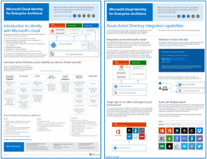
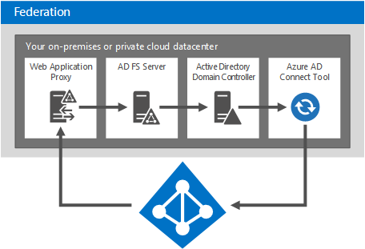

# Identità cloud Microsoft per Enterprise Architects

 **Riepilogo:** Progettare una soluzione di identità per i servizi cloud e le piattaforme Microsoft.
  
In questo articolo viene descritto cosa devono sapere gli architetti IT sulla progettazione di identità per le organizzazioni che utilizzano i servizi cloud e le piattaforme Microsoft. È possibile visualizzare questo articolo anche come poster di 5 pagine e stamparlo in formato tabloid (noto anche come ledger, 11 x 17 o A3).
  

  
[PDF](https://go.microsoft.com/fwlink/p/?LinkId=524586) | [Visio](https://download.microsoft.com/download/2/3/8/238228E6-9017-4F6C-BD3C-5559E6708F82/MSFT_cloud_architecture_identity.vsd) | [Altre lingue](https://www.microsoft.com/download/details.aspx?id=54431)
  
È inoltre possibile visualizzare tutti i modelli nelle [Risorse sull'architettura IT del cloud Microsoft](microsoft-cloud-it-architecture-resources.md) e consultare la [Guida di orientamento del cloud aziendale Microsoft: risorse per i decision maker del settore IT](https://aka.ms/cloudarchitecture).
  
> [!NOTE]
> Questo articolo riflette la versione di gennaio 2016 del poster **Identità cloud Microsoft per Enterprise Architects**. Non contiene le modifiche apportate alla versione di aprile 2016 o successiva del poster.
  
## Progettazione dell'identità per il cloud Microsoft

L'integrazione delle identità con il cloud Microsoft consente di accedere a una vasta gamma di servizi e opzioni di piattaforme cloud. Esistono due opzioni principali:
  
- È possibile integrare con Microsoft Azure Active Directory (AD). Ciò include la sincronizzazione degli account locali con Azure AD, il provider di identità per il cloud Microsoft.
    
- È possibile estendere l'ambiente Servizi di dominio Active Directory (AD DS) alle macchine virtuali in esecuzione nei servizi infrastruttura di Microsoft Azure.
    

  
 **Figura 1: opzioni per la progettazione delle identità nel cloud**
  
Nella figura 1 viene illustrato che Azure AD è il provider di identità per i servizi Microsoft SaaS (Software as a Service) e le applicazioni Azure PaaS (Platform as a Service) e che le applicazioni line-of-business possono utilizzare AD DS locale. 
  
### Azure Active Directory

Microsoft Azure AD è il servizio di gestione degli accessi e delle identità ospitato nel cloud Microsoft. Si trova al centro dei servizi cloud e delle piattaforme Microsoft. L'integrazione con Azure AD fornisce l'accesso a tutti i servizi Microsoft SaaS tramite gli account e le password correnti. Tale integrazione fornisce inoltre l'identità basata su cloud per applicazioni PaaS di Azure. 
  
> [!NOTE]
> Azure AD non sostituisce la necessità di disporre di AD DS locale per le aziende o di macchine virtuali basate su Windows in esecuzione nell'infrastruttura distribuita come servizio (Infrastructure as a Service, IaaS) di Azure. 
  
Sono disponibili tre versioni di Azure AD: gratuita, di base e premium. 
  
||||
|:-----|:-----|:-----|
|**Gratuita**   |**Di base**   |**Premium**   |
| 	Gestione degli account utente    Sincronizzazione con directory locali    Single Sign-On in Azure, Office 365 e migliaia di altre note applicazioni SaaS, come Salesforce, Workday, Concur, DocuSign, Google Apps, Box, ServiceNow, Dropbox e altro   | Include tutte le capacità della versione gratuita, oltre a:    Informazioni personalizzate distintive dell'azienda    Accesso alle applicazioni sulla base di un gruppo    Reimpostazione password self-service    Contratto di servizio aziendale del 99,9%   | Include tutte le caratteristiche della versione gratuita e della versione di base, oltre a:    Gestione gruppi self-service    Avvisi e report di sicurezza avanzata    Autenticazione a più fattori    Reimpostazione della password con write-back in AD DS locale    Sincronizzazione bidirezionale dello strumento Azure AD Connect    Proxy di applicazione Azure AD    	Microsoft Forefront Identity Manager (MIM)   |
   
Per ulteriori informazioni sulle versioni, vedere [Edizioni di Azure Active Directory](https://go.microsoft.com/fwlink/p/?LinkId=524280).
  
### Opzione 1: integrazione con Azure Active Directory

La maggior parte delle organizzazioni sincronizza un insieme di oggetti e attributi con il tenant di Azure AD. Lo strumento Azure AD Connect consente di sincronizzare gli account tra AD DS locale e un tenant di Azure AD.
  

  
 **Figura 2: integrazione con Azure AD**
  
Nella figura 2 viene illustrato come lo strumento Azure AD Connect ottiene le modifiche di AD DS e le invia al tenant di Azure AD. In questo caso, il tenant di Azure AD è un duplicato ospitato nel cloud di contenuto della directory locale essenziale.
  
Molte organizzazioni utilizzano AD DS come provider di identità locale. È possibile utilizzare un altro tipo di provider di identità locale (come uno di quelli che usano LDAP) e sincronizzarlo con Azure AD.
  
### Opzione 2: estensione di AD DS ad Azure

L'estensione di AD DS a macchine virtuali in esecuzione nei servizi infrastruttura di Azure supporta un diverso set di soluzioni e applicazioni rispetto alla sincronizzazione con Azure AD. Eccone due:
  
- Supporta le soluzioni basate su cloud che richiedono l'autenticazione Kerberos o NTLM, oppure le macchine virtuali aggiunte a un dominio di AD DS.
    
- Aggiunge un'ulteriore potenziale integrazione per i servizi cloud e le applicazioni nei servizi cloud e nelle piattaforme Microsoft.
    

  
 **Figura 3: estensione di AD DS ad Azure**
  
Nella figura 3 viene illustrato un controller di dominio di AD DS connesso a una rete virtuale di Azure mediante un dispositivo VPN locale e un gateway VPN di Azure. La rete virtuale di Azure contiene i server per un'applicazione line-of-business e il relativo insieme di controller di dominio di AD DS.
  
### Ulteriori informazioni

- [La sincronizzazione della directory con Office 365 è facile](https://go.microsoft.com/fwlink/p/?LinkId=524281)
    
- [Infografica: Gestione di identità e accesso nel cloud](https://go.microsoft.com/fwlink/p/?LinkId=524282)
    
- [Azure Active Directory](https://go.microsoft.com/fwlink/p/?LinkId=524283)
    
## Integrazione degli account di AD DS locali con Microsoft Azure AD

Sincronizzando gli account di AD DS locali con Azure AD, gli utenti possono utilizzare i propri account di AD DS per accedere:
  
- A tutti i servizi SaaS Microsoft (Office 365, Microsoft Intune e Dynamics CRM Online)
    
- Alle applicazioni in esecuzione in PaaS di Azure
    
Per configurare questa integrazione è possibile procedere in due modi:
  
- Sincronizzazione di password e directory
    
- Federazione e Single Sign-On
    
Iniziare con l'opzione più semplice che risponde alle proprie esigenze. È possibile passare da un'opzione all'altra, se necessario.
  
> [!NOTE]
> L'uso di account basati solo sul cloud (non integrati con AD DS locale) non è consigliabile per le organizzazioni su scala aziendale. 
  
### Sincronizzazione di password e directory

Questa è l'opzione più semplice e richiede solo un server che esegue lo strumento Azure AD Connect. 
  

  
 **Figura 4: configurazione della sincronizzazione di password e directory**
  
Nella figura 4 viene illustrato un datacenter del cloud privato o locale con un controller di dominio di AD DS. Un server che esegue lo strumento Azure AD Connect consente di sincronizzare l'elenco di nomi dell'account con Azure AD.
  
Con questa opzione:
  
- Gli account utente vengono sincronizzati da AD DS locale (o da un altro provider di identità) al tenant di Azure AD. La directory locale rimane l'origine autorevole per gli account e consente all'utente di gestire le modifiche di tutti gli account.
    
- Azure AD esegue tutte le autenticazioni per i servizi basati su SaaS Microsoft e le applicazioni PaaS di Azure.
    
- È inoltre possibile configurare la sincronizzazione per più foreste di AD DS.
    
Con la sincronizzazione delle password:
  
- Agli utenti viene richiesto di immettere una password per accedere ai servizi cloud, che è identica a quella che utilizzano per le risorse locali.
    
- Le password degli utenti non vengono mai inviate come testo non crittografato ad Azure AD. Al contrario, viene utilizzato un hash della password. A livello di crittografia, non è possibile decrittografare o decompilare l'hash della password e ottenere la password come testo non crittografato. 
    
Con l'autenticazione a più fattori (MFA):
  
- È possibile usufruire delle caratteristiche di base di MFA offerte con Office 365.
    
- Gli sviluppatori di applicazioni PaaS di Azure possono usufruire del servizio di autenticazione a più fattori di Azure.
    
La sincronizzazione delle directory non consente l'integrazione con soluzioni MFA locali.
  
### Federazione e Single Sign-On

Questa opzione richiede server e infrastruttura aggiuntivi. 
  

  
 **Figura 5: server necessari per l'autenticazione federata**
  
Nella figura 5 viene illustrato l'insieme di componenti per l'autenticazione federata. Azure AD contatta un proxy applicazione Web, che inoltra la richiesta di autenticazione a un server di Active Directory Federation Services (AD FS), che a sua volta inoltra la richiesta a un controller di dominio di AD DS per la valutazione e la risposta. Un server che esegue lo strumento Azure AD Connect consente di sincronizzare l'elenco di nomi dell'account da AD DS ad Azure AD.
  
La federazione fornisce le seguenti funzionalità aziendali aggiuntive:
  
- Tutte le richieste di autenticazione inviate ad Azure AD vengono inoltrate ed eseguite rispetto al provider di identità locale mediante AD FS.
    
- Funziona con i provider di identità non Microsoft.
    
- La sincronizzazione degli hash delle password può agire come backup delle informazioni di accesso per l'accesso federato (ad esempio, se l'autenticazione federata ha esito negativo).
    
Usare la federazione nei seguenti casi:
  
- Single Sign-On è obbligatorio. Con Single Sign-On, agli utenti non viene richiesto di immettere le credenziali (nome utente o password) per accedere a un servizio cloud.
    
- AD FS è già stato distribuito.
    
- Si utilizza un provider di identità di terze parti.
    
- Si utilizza Forefront Identity Manager 2010 R2 (non supporta la sincronizzazione degli hash delle password).
    
- Si dispone di una smart card integrata in locale o un'altra soluzione MFA.
    
- Si necessita di controllare l'accesso e/o di disabilitare account.
    
- L'organizzazione richiede restrizioni client di accesso in base al percorso di rete o alle ore lavorative.
    
- È necessaria la conformità con Federal Information Processing Standards (FIPS).
    
L'autenticazione federata richiede un investimento maggiore in infrastrutture locali.
  
- I server locali devono essere accessibili da Internet mediante un firewall aziendale. È consigliabile utilizzare i server Proxy applicazione Web distribuiti nella rete perimetrale.
    
- Richiede componenti hardware, licenze e operazioni per server AD FS, proxy AD FS o server proxy di applicazione Web, firewall e servizi di bilanciamento del carico. 
    
- Disponibilità e prestazioni sono importanti per garantire agli utenti l’accesso a Office 365 e ad altre applicazioni cloud.
    
### Ulteriori informazioni

- [La sincronizzazione della directory con Office 365 è facile](https://go.microsoft.com/fwlink/p/?LinkId=524281)
    
- [Preparazione per il provisioning degli utenti verso Office 365 tramite la sincronizzazione di directory](https://go.microsoft.com/fwlink/p/?LinkId=524284)
    
- [Autenticazione a più fattori per Office 365](https://go.microsoft.com/fwlink/p/?LinkID=392012)
    
- [Multi-Factor Authentication di Azure](https://go.microsoft.com/fwlink/p/?LinkId=524285)
    
- [TechEd 2014: Integrazione directory: creazione di una directory con Active Directory e Azure Active Directory](https://go.microsoft.com/fwlink/p/?LinkId=524286)
    
## estensione di AD DS ad Azure

L'estensione di AD DS ad Azure è il primo passaggio per il supporto delle applicazioni line-of-business in esecuzione sulle macchine virtuali nei servizi infrastruttura di Azure, che fornisce:
  
- Supporto per le soluzioni basate su cloud che richiedono l'autenticazione Kerberos o NTLM, oppure le macchine virtuali aggiunte a un dominio di AD DS.
    
- Potenziale integrazione aggiuntiva per servizi cloud e applicazioni e può essere aggiunto in qualsiasi momento.
    

  
 **Figura 6: estensione di Servizi di dominio Active Directory a una rete virtuale di Azure**
  
Nella figura 6 viene illustrato un datacenter del cloud privato o locale con AD DS connesso a una rete virtuale di Azure con una connessione VPN da sito a sito o ExpressRoute. La rete virtuale di Azure contiene i server per un'applicazione line-of-business e il relativo insieme di controller di dominio di AD DS. Questa configurazione è una distribuzione ibrida di AD DS in locale e nei servizi infrastruttura di Azure. Richiede:
  
- Una rete virtuale di Azure.
    
- Una connessione tra un router o un dispositivo VPN (Virtual Private Network) locale e un gateway VPN di Azure.
    
- L'utilizzo di una porzione dello spazio di indirizzi IP locali per le macchine virtuali nella rete virtuale.
    
- La distribuzione di uno o più controller di dominio nella rete virtuale designata come server di catalogo globale (riduce il traffico in uscita attraverso la connessione VPN).
    
Questa architettura di identità supporta un insieme di soluzioni e applicazioni diverso rispetto a quello della sincronizzazione con Azure AD.
  
### Opzioni di connessione dalla rete locale a quella di Azure

Per connettere la rete locale a una rete virtuale di Azure, è possibile utilizzare:
  
- Una connessione VPN da sito a sito, che consente di connettere da 1 a 10 siti (comprese le altre reti virtuali di Azure) a una singola rete virtuale di Azure.
    
- ExpressRoute, un collegamento WAN sicuro e privato ad Azure mediante un provider di servizi di datacenter e di rete partner. Le connessioni ExpressRoute possono offrire una maggiore affidabilità, una larghezza di banda superiore e latenze inferiori.
    
### Ulteriori informazioni

- [Connessione cross-premise per reti virtuali](https://go.microsoft.com/fwlink/p/?LinkId=524293)
    
- [Panoramica tecnica relativa a ExpressRoute](https://go.microsoft.com/fwlink/?LinkID=392081)
    
- [Linee guida per la distribuzione di Windows Server Active Directory in macchine virtuali di Azure](https://go.microsoft.com/fwlink/p/?LinkId=524295)
    
## Integrare le applicazioni con identità cloud

Durante la progettazione e lo sviluppo delle applicazioni che vengono eseguite nel cloud, l'obiettivo deve essere la coerenza dell'esperienza utente in merito al processo di autenticazione, compreso l'insieme di credenziali necessarie. Ad esempio, quando si utilizzano le credenziali di Windows, che si tratti di Azure AD o di un'estensione di AD DS, occorre accertarsi che gli utenti possano eseguire l'autenticazione rapidamente e concentrarsi sulle proprie attività.
  

  
 **Figura 7: integrare le applicazioni con identità cloud**
  
Nella figura 7 vengono illustrate tre opzioni per l'integrazione dell'applicazione con identità cloud.
  
1. Registrare le applicazioni ospitate nel cloud con Azure AD.
    
    Vedere l'articolo MSDN [Integrazione di applicazioni con Azure Active Directory](https://go.microsoft.com/fwlink/p/?LinkId=524303). Ciò consente di utilizzare Azure AD per autenticare l'accesso all'applicazione PaaS, oltre a permettere a utenti o amministratori di autorizzare l'applicazione ad accedere ai contenuti per conto di altri servizi cloud, come Office 365. Ulteriori informazioni ed esempi di codice sono disponibili nell'articolo MSDN [Scenari di autenticazione per Azure AD](https://go.microsoft.com/fwlink/p/?LinkId=524304). 
    
2. Le applicazioni che richiedono l'autenticazione programmatica per avere accesso a un'applicazione protetta da AD DS, AD FS in Windows Server 2012 R2 o Azure AD possono utilizzare:
    
  - [API Graph di Azure AD](https://go.microsoft.com/fwlink/p/?LinkId=524305)
    
  - [Active Directory Authentication Library (ADAL)](https://go.microsoft.com/fwlink/p/?LinkID=524297)
    
    L'API Graph di Azure AD supporta l'autorizzazione OAuth e la connessione OpenID. Funziona anche con le applicazioni PaaS.
    
3. Configurare le applicazioni locali o le applicazioni line-of-business in esecuzione su macchine virtuali in una rete virtuale di Azure per utilizzare direttamente l'autenticazione di Windows (NTLM o Kerberos). Si tratta dell'esperienza utente migliore e richiede la configurazione minima per gli sviluppatori di applicazioni server.
    
### Esempio di integrazione di applicazioni

Un'organizzazione compila un'applicazione ASP.NET che espone un endpoint REST in cui altre applicazioni possono ottenere i dati sulle vendite più recenti. L'accesso a tale endpoint REST è protetto con Azure AD. Le applicazioni devono fornire le credenziali per essere autenticate da Azure AD prima che l'applicazione ASP.NET invii i dati richiesti. Gli altri sviluppatori dell'organizzazione possono quindi scrivere le proprie applicazioni che utilizzano i dati sulle vendite dall'endpoint REST.
  
Per eseguire l'autenticazione di Azure AD e recuperare i dati, ADAL gestisce il processo di autenticazione dell'utente e trasmette il token di accesso all'applicazione, affinché venga usato per accedere ai dati sulle vendite. ADAL supera gran parte della complessità dell'acquisizione e dell'analisi dei token, dei flussi OAuth e di altri elementi. ADAL è un'altra soluzione tecnologica in continua evoluzione, quindi gli sviluppatori devono cercare la versione più recente su NuGet.
  
## Distribuzione dei componenti della directory ad Azure

È possibile distribuire i componenti della directory, come i server per la sincronizzazione delle password o per l'autenticazione federata, in una rete virtuale di Azure anziché in un datacenter locale. Valutarne i vantaggi, specialmente se si ha intenzione di estendere AD DS ad Azure.
  
Di seguito sono riportati i componenti della directory che è possibile inserire in una rete virtuale di Azure:
  
- 	Strumento Azure AD Connect
    
- Componenti di autenticazione federata
    
- Ambiente AD DS autonomo
    
### Strumento AD Connect

Lo strumento Azure AD Connect può essere ospitato nel cloud in una rete virtuale di Azure. Prendere in considerazione i vantaggi della distribuzione di questo carico di lavoro in Azure:
  
- Possibilità di provisioning più veloce e costi delle operazioni più bassi
    
- Disponibilità migliorata
    

  
 **Figura 8: strumento AD Connect in esecuzione in Azure**
  
Nella figura 8 viene illustrato lo strumento AD Connect in esecuzione su una macchina virtuale in una rete virtuale di Azure, che esegue una query in un controller di dominio AD DS locale per ottenere le modifiche apportate all'account e quindi invia tali modifiche a Office 365. Questa soluzione funziona con:
  
- Servizi di Office 365.
    
- Applicazioni PaaS di Azure disponibili su Internet.
    
- Applicazioni line-of-business in Azure disponibili da ambienti locali mediante la connessione VPN da sito a sito o ExpressRoute.
    
Per ulteriori informazioni, vedere [Integrazione delle identità locali con Azure Active Directory](https://go.microsoft.com/fwlink/p/?LinkId=524307).
  
### Infrastruttura di autenticazione federata

Se non è stato ancora distribuito AD FS locale, valutare i vantaggi della distribuzione del carico di lavoro in Azure:
  
- Garantisce autonomia per l'autenticazione ai servizi cloud (no dipendenze locali)
    
- Riduce server e strumenti disponibili in locale
    
- Utilizza un gateway VPN da sito a sito su un cluster di failover a due nodi per la connessione ad Azure (novità)
    
- Usa ACL per permettere ai server proxy di applicazione Web di comunicare solo con AD FS, non direttamente con controller di dominio o altri server
    

  
 **Figura 9: distribuzione dell'infrastruttura di autenticazione federata in Azure**
  
Nella figura 9 viene illustrato un insieme di controller di dominio locali che replicano le informazioni di AD DS con un insieme di controller di dominio in una rete virtuale di Azure. Lo strumento Azure AD Connect in esecuzione su un server nella rete virtuale di Azure esegue una query sui controller di dominio locali per ottenere le modifiche e quindi invia tali modifiche ad Azure AD. Le richieste di autenticazione in ingresso per Azure AD dai servizi Microsoft SaaS, dalle applicazioni PaaS di Azure e da altre applicazioni cloud vengono inoltrate a un bilanciamento del carico esterno, che inoltra la richiesta a un insieme di server proxy di applicazione Web. I server proxy di applicazione Web inoltrano la richiesta a un bilanciamento del carico interno, che inoltra la richiesta a un insieme di server AD FS. I server AD FS inoltrano quindi la richiesta a un controller di dominio per convalidare le credenziali inviate.
  
 Questa soluzione funziona con:
  
- Applicazioni che richiedono Kerberos
    
- Tutti i servizi SaaS di Microsoft
    
- Applicazioni in Azure per Internet
    
- Applicazioni in IaaS o PaaS di Azure che richiedono l'autenticazione con l'insieme di account nei servizi di dominio AD DS dell'organizzazione
    
Per ulteriori informazioni, vedere [Integrazione delle identità locali con Azure Active Directory](https://go.microsoft.com/fwlink/p/?LinkId=524307).
  
### Ambiente AD DS autonomo in una rete virtuale di Azure

Non è sempre necessario integrare un'applicazione cloud con il proprio ambiente locale. Ad esempio, un dominio AD DS autonomo in una rete virtuale di Azure supporta le applicazioni pubbliche, come i siti Internet.
  

  
 **Figura 10: ambiente AD DS autonomo per un'applicazione basata su server**
  
Nella figura 10 viene illustrata una rete virtuale di Azure che ospita un insieme di server AD DS, fornendo i servizi di AD DS e DNS, con un insieme di server che ospitano un'applicazione. Questa soluzione funziona con:
  
- Applicazioni e siti Web con connessione Internet
    
- Applicazioni che richiedono l'autenticazione NTLM o Kerberos
    
- Applicazioni in esecuzione su server basati su Windows che richiedono AD DS
    
Per ulteriori informazioni, vedere [Integrazione delle identità locali con Azure Active Directory](https://go.microsoft.com/fwlink/p/?LinkId=524307).
  
## Vedere anche

[Risorse sull'architettura IT del cloud Microsoft](microsoft-cloud-it-architecture-resources.md)

[Guida di orientamento del cloud aziendale Microsoft: risorse per i decision maker del settore IT](https://sway.com/FJ2xsyWtkJc2taRD)

